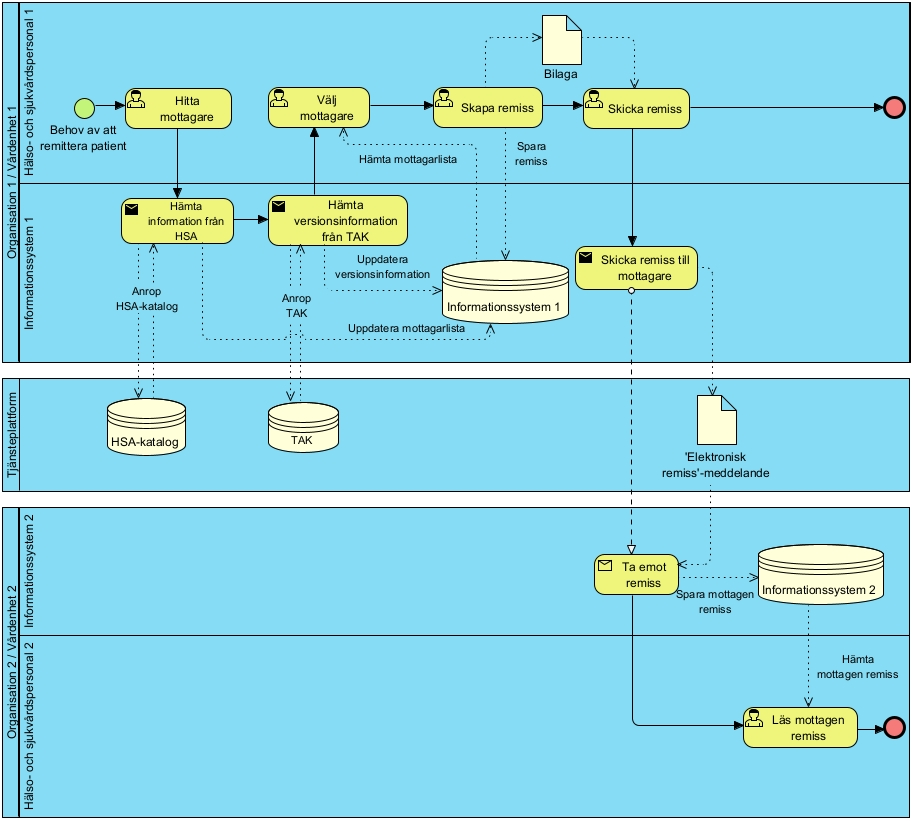
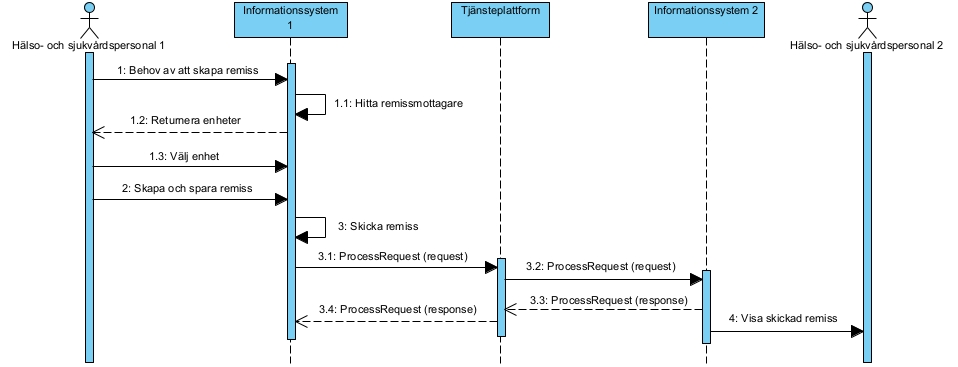
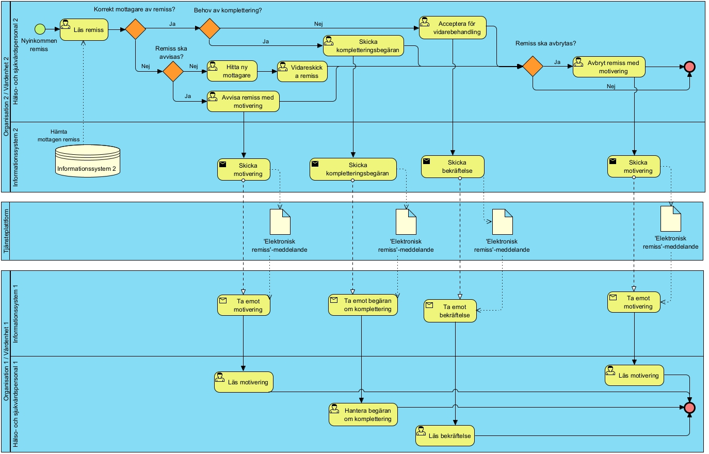
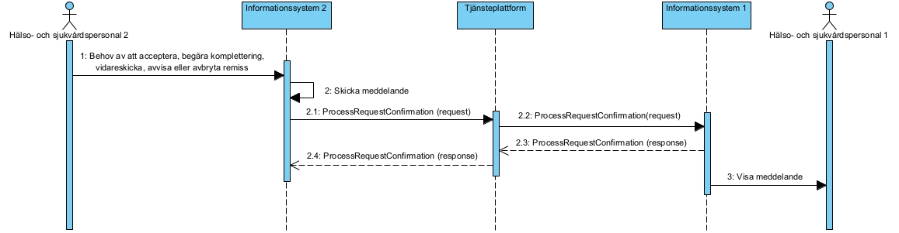
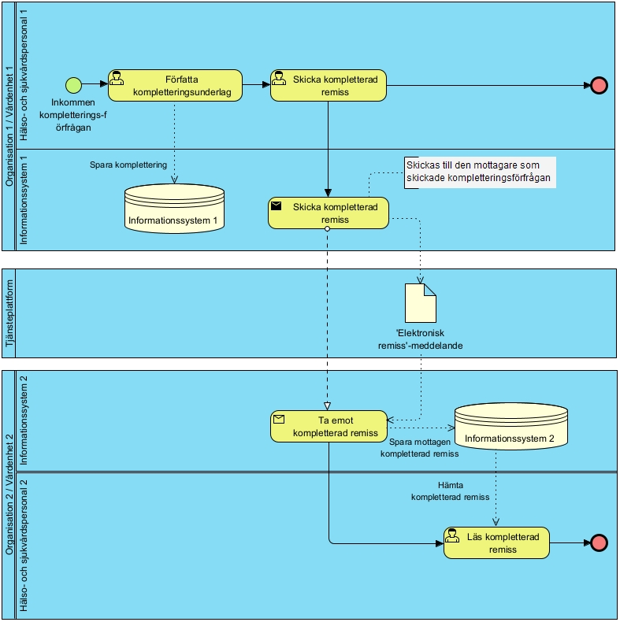
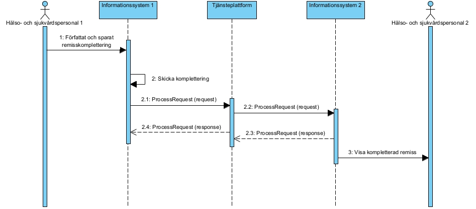
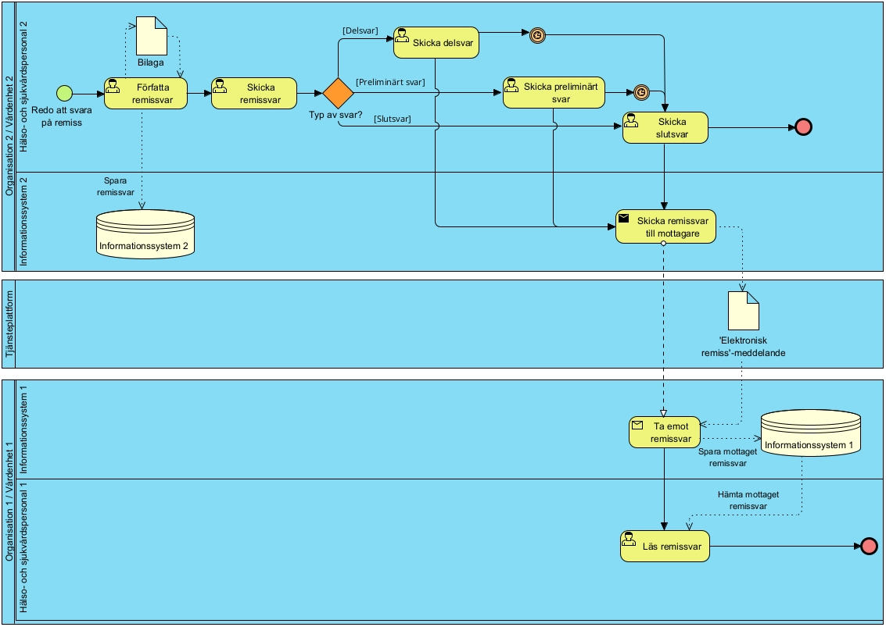
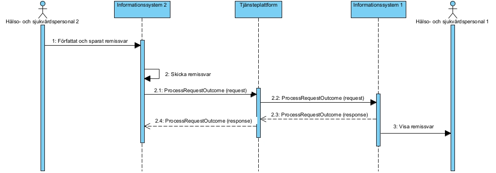

# 3 Tjänstedomänens arkitektur - clinicalprocess: activity: request — Remisshantering v2.2.0

* [**Table of Contents**](toc.md)
* **3 Tjänstedomänens arkitektur**

## 3 Tjänstedomänens arkitektur

## Tjänstedomänens arkitektur

Detta kapitel beskriver de flöden som är relevanta för tjänstedomänen remisshantering. Det vill säga flöden som beskriver hur man skapar och skickar remisser, olika typer av remissbekräftelser och remissvar. Beskrivningarna är i form av modeller, för varje flöde finns dels ett arbetsflöde som beskriver vilka steg som ingår i flödet, dels ett sekvensdiagram som tar hänsyn till vilka tjänstekontrakt som nyttjas i de olika stegen.

### Flöden

#### Skicka och ta emot remiss

Flödet ”Skicka och ta emot remiss” beskriver hur en hälso- och sjukvårdspersonal (HSP) skickar en remiss från ett informationssystem (IS) genom att välja och hitta mottagare, skapa, spara och skicka remissen till en mottagande enhet. Hitta mottagare - HSP1 upplever ett behov av att remittera en patient. HSP1 går in i sitt informationssystem (IS1) och söker efter en ur verksamhetsperspektiv lämplig mottagare av remissen. IS1 hanterar information om mottagare och vilka huvudversioner av Elektronisk remiss mottagarens journalsystem kan hantera med hjälp av HSA-katalog och TAK. Skapa remiss – HSP1 väljer lämplig mottagare ur lista i IS1. Beroende på vilken huvudversion av tjänsten som mottagaren använder så presenterar IS1 rätt remissmall för användaren. HSP1 fyller sedan i remissen och sparar den. Bifoga bilaga – HSP1 väljer om en eller flera bilagor ska bifogas till remissen. Skicka remiss - HSP1 skickar iväg remissen från IS1. Remissen adresseras till det HSA-id som den tänkta mottagaren har och skickas via tjänsteplattformen. Ta emot remiss - IS2 tar emot remiss från IS1. IS2 presenterar den inkomna remissen för HSP2 i rollen som Remissbedömare. Ändra remissinnehåll eller betalningsansvar - Remittenten Hsp1 kan välja att ändra innehållet i remissen i efterhand. Om Hsp2 ännu inte har bedömt remissen kan Hsp1 uppdatera remissen och skicka den igen. Om remissen redan är bekräftad så krävs en kompletteringsbegäran från Hsp2 – se flöde ”Hantera remisskomplettering”. Om ändringen rör betalningsansvar kan Hsp1 skicka denna även när remissen är bekräftad.

##### Arbetsflöde

 **Figur 1 Arbetsflöde Skicka och ta emot remiss enligt BPMN 2.0**

###### Roller

| | |
| :--- | :--- |
| Hälso- och sjukvårdspersonal 1 (HSP1) | Den hälso- och sjukvårdspersonal som skapar och skickar remiss. |
| Informationssystem 1 (IS1) | Det informationssystem som HSP1 använder för att skapa och skicka remiss. |
| Hälso- och sjukvårdspersonal 2 (HSP2) | Den hälso- och sjukvårdspersonal som läser mottagen remiss. |
| Informationssystem 2 (IS2) | Det informationssystem som HSP2 använder för att ta emot och visa remiss. |

##### Sekvensdiagram

Nedanstående diagram beskriver vilka tjänstekontrakt som används i det ovan beskrivna flödet. Tjänstekontrakt som används är: ProcessRequest för remisshantering.

 **Figur 2 Sekvensdiagram Skicka och ta emot remiss enligt UML**

#### Hantera mottagen remiss

Flödet ”Hantera mottagen remiss” beskriver hur mottagaren av remissen (hälso- och sjukvårdspersonal 2) bedömer och bekräftar remissen (om innehåll godkänt), begär komplettering (om innehåll ej godkänt), skickar ev. vidare remissen (om annan mottagare är mer lämplig), avvisar remissen om frågeställning inte matchar utbud eller uppdrag, eller avbryter remissen om behovet av vårdkontakt inte längre finns. Bedöma och bekräfta remiss – Hälso- och sjukvårdspersonal (HSP) 2 i rollen som Remissbedömare får remissen presenterad för sig av IS2 och gör en verksamhetsmässig bedömning om att tillräckligt med underlag finns för att gå vidare med hanteringen av patienten. HSP2 skickar en remissbekräftelse till HSP1 (remittenten) med anledning av att HSP2 bedömt och accepterat remissen. Begära komplettering - HSP2 i rollen som Remissbedömare får remissen presenterad för sig av IS2 och gör en verksamhetsmässig bedömning om att tillräckligt med underlag saknas för att gå vidare med hanteringen av patienten. HSP2 bedömer att remissen behöver kompletteras och bestämmer sig för att begära en komplettering från avsändaren. En kompletteringsbegäran skrivs och skickas från IS2 till IS1. Skicka vidare - HSP2 i rollen som Remissbedömare får remissen presenterad för sig av IS2 och gör en verksamhetsmässig bedömning om att remissen inte ska hanteras på enheten. Därefter letar HSP2 upp en bättre lämpad mottagare enligt flöde 3.1.1 och skickar iväg den enligt flöde 3.1.2. Alternativt avvisas remissen, se nedan. Avvisa remiss - HSP2 i rollen som Remissbedömare får remissen presenterad för sig av IS2 och gör en verksamhetsmässig bedömning om att remissen inte kan hanteras på enheten om frågeställning inte matchar enhetens utbud eller uppdrag. HSP2 avvisar remissen med en motivering till varför och skickar till HSP1. Avbryt remiss: HSP2 i rollen som Remissbedömare får remissen presenterad för sig av IS2 och gör bedömningen att remissen inte kan hanteras på enheten om behov av vårdkontakt inte längre finns, t.ex. om åtgärd inte längre är aktuell eller om patienten är avliden. HSP2 avbryter remissen med en motivering till varför och skickar till HSP1. Detta steg kan även ske efter att en remiss har bekräftats och kompletterats, fram till dess att ett remissvar skrivs.

##### Arbetsflöde

 **Figur 3 Arbetsflöde Hantera mottagen remiss, enligt BPMN 2.0**

###### Roller

| | |
| :--- | :--- |
| Hälso- och sjukvårdspersonal 1 (HSP1) | Den hälso- och sjukvårdspersonal som läser och hanterar bekräftelse på remiss, kompletteringsförfrågan på remiss, avvisad remiss eller avbruten remiss. |
| Informationssystem 1 (IS1) | Det informationssystem som HSP1 använder för att ta emot och visa bekräftelse på remiss, kompletteringsförfrågan på remiss, avvisad remiss eller avbruten remiss. |
| Hälso- och sjukvårdspersonal 2 (HSP2) | Den hälso- och sjukvårdspersonal som bedömer remiss och antingen bekräftar remiss, skickar förfrågan om komplettering, skickar vidare, avvisar eller avbryter mottagen remiss. |
| Informationssystem 2 (IS2) | Det informationssystem som HSP2 använder för att skicka bekräftelse på remiss, skicka förfrågan om komplettering, skicka vidare, avvisa eller avbryta mottagen remiss. |

##### Sekvensdiagram

Tjänstekontrakt som är involverade: ProcessRequestConfirmation. (ProcessRequest täcks av flödet ”Skicka och ta emot remiss”)

 **Figur 4 Sekvensdiagram Hantera mottagen remiss, enligt UML**

#### Hantera remisskomplettering

Flödet ”Hantera remisskomplettering” beskriver hur en begärd komplettering hanteras. Mottagaren av kompletteringsbegäran (HSP1), skriver och skickar komplettering och sändaren av kompletteringsbegäran (HSP2) tar emot kompletteringen. En remisskomplettering(ny version av remiss) kan vid behov också skickas utan att remissmottagare (HSP2) begärt komplettering så länge remissen inte är bedömd (då remissbekräftelse mottagits av IS1) . Detta sker då på initiativ av remittent (HSP1) när behov uppstår hos avsändaren att komplettera informationen i remissen. Detta flöde beskrivs ej i figur 5 men motsvaras av flödet i 3.1.1 ”Skicka och ta emot remiss”. Skriva komplettering - En begäran av komplettering har inkommit till IS1 som uppmärksammar HSP1 på detta. HSP1 kompletterar remissen enligt önskan från HSP2 och sparar i IS1. Skicka komplettering – HSP1/IS1 skickar den uppdaterade remissen till HSP2/IS2. Ta emot komplettering – IS2 tar emot den kompletterade remissen och visar för HSP2.

##### Arbetsflöde

 **Figur 5 Arbetsflöde Hantera remisskomplettering, enligt BPMN 2.0**

###### Roller

| | |
| :--- | :--- |
| Hälso- och sjukvårdspersonal 1 (HSP1) | Den hälso- och sjukvårdspersonal som skriver och skickar komplettering på begärd remiss. |
| Informationssystem 1 (IS1) | Det informationssystem som HSP1 använder för att skapa och skicka komplettering på begärd remiss. |
| Hälso- och sjukvårdspersonal 2 (HSP2) | Den hälso- och sjukvårdspersonal som läser och bedömer kompletterad remiss. |
| Informationssystem 2 (IS2) | Det informationssystem som HSP2 använder för att ta emot och visa kompletterad remiss. |

##### Sekvensdiagram

Tjänstekontrakt som är involverade är ProcessRequest.

 **Figur 6 Sekvensdiagram Hantera remisskomplettering, enligt UML**

#### Hantera remissvar

Flödet ”Hantera remissvar” beskriver hur remissmottagaren (HSP2) skriver och skickar svar på en remiss, samt hur HSP1 tar emot remissvaret. Skriva remissvar - En remiss har inkommit och remissmottagande enhet har hanterat remissen. HSP2, i rollen som Remisbesvarare, har skaffat sig underlag för att besvara remissen och författar ett svar. Svaret kan vara av typen delsvar, preliminärt svar eller slutsvar. Skicka remissvar – HSP2/Remissbesvarare skickar det författade svaret från IS2 till den remissvarsmottagande enheten. Ta emot remissvar – IS1 tar emot remissvaret från IS2. IS1 presenterar det inkomna remissvaret för HSP1 i rollen som Remissvarsmottagare.

##### Arbetsflöde

 **Figur 7 Arbetsflöde Hantera remissvar, enligt BPMN 2.0**

###### Roller

| | |
| :--- | :--- |
| Hälso- och sjukvårdspersonal 1 (HSP1) | Den hälso- och sjukvårdspersonal som läser remissvar. |
| Informationssystem 1 (IS1) | Det informationssystem som HSP1 använder för att ta emot och visa remissvar. |
| Hälso- och sjukvårdspersonal 2 (HSP2) | Den hälso- och sjukvårdspersonal som skriver och skickar remissvar. |
| Informationssystem 2 (IS2) | Det informationssystem som HSP2 använder för att skapa och skicka remissvar. |

##### Sekvensdiagram

Tjänstekontrakt som är involverade i processen ”hantera remissvar” är ProcessRequestOutcome.

 **Figur 8 Sekvensdiagram Hantera remissvar, enligt UML**

#### Obligatoriska kontrakt

Följande tabell specificerar vilka kontrakt som är obligatoriska att realisera för respektive flöde.

| | | | | |
| :--- | :--- | :--- | :--- | :--- |
| Skicka och ta emot remiss | Flöde 3.1.2 |   |   |   |
| Hantera mottagen remiss | Flöde 3.1.3 |   |   |   |
| Hantera remiss-komplettering | Flöde 3.1.4 |   |   |   |
| Hantera remissvar |   |   |   |   |
| ProcessRequest | X |   | X |   |
| ProcessRequest-Confirmation |   | X |   |   |
| ProcessRequest-Outcome |   |   |   | X |

### Adressering

Remisser adresseras med hjälp av att Remissmottagares organisatoriska identitet används som logisk adress. Remissvarsmottagarens organisatoriska identitet finns också med i remissen i sig (se fältbeskrivning för remiss). Dessa tjänster är verksamhetsadresserade.

### Aggregering och engagemangsindex

Aggregering och Engagemangsindex används inte inom denna tjänstedomän.

### Versionshantering parallella huvudversioner

Konsumenter och producenter som stödjer en ny huvudversion av domänen behöver fortsatt stödja den tidigare huvudversionen, så länge det finns konsumenter och producenter som ännu inte stödjer den nya huvudversionen. Exempelvis så behöver man fortsatt stödja v.1 av tjänsten när man ansluter till v.2. Eftersom huvudversionerna inte är kompatibla behöver konsument av ProcessRequest veta enligt vilken version remissen ska skapas redan när mottagare väljs. För att veta vilken huvudversion som mottagaren har kan informationssystemet anropa TAK (Tjänsteadresseringskatalog). För ytterligare beskrivning, se allmän beskrivning i RIV TA för övergång till ny huvudversion [R3] och specifika regler för tjänsten i ”Teknisk realisering” [R4].

