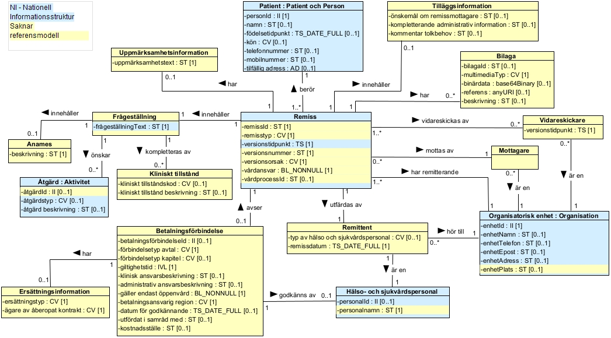
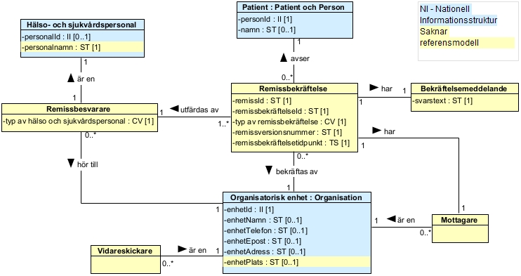
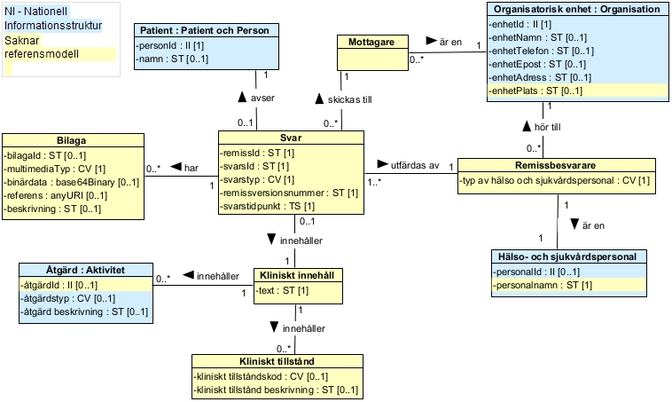

# 5 Tjänstedomänens meddelandemodeller - clinicalprocess: activity: request — Remisshantering v2.2.0

* [**Table of Contents**](toc.md)
* **5 Tjänstedomänens meddelandemodeller**

## 5 Tjänstedomänens meddelandemodeller

## Tjänstedomänens meddelandemodeller

Här beskrivs de modeller som beskriver informationsinnehållet i tjänstekontrakten inom tjänstedomänen. Varje tjänstekontrakt har en egen meddelandemodell som uttömmande beskriver informationen som tjänstekontraktet bär. För varje meddelandemodell beskrivs hur mappning ser ut mot tjänstekontraktets schema (XSD).

### V-MIM

#### ProcessRequest

 **Figur 9 V-MIM ProcessRequest, klassdiagram enligt UML** Mappning mot tjänstekontraktets schema

| | | |
| :--- | :--- | :--- |
| Remiss | request | RequestType |
| remiss-id | requestId | requestIdType |
| remisstyp | typeOfRequest | codeForRequestType |
| versionstidpunkt | versionTimeStamp | TimeStampType |
| versionsnummer | versionNumber | VersionNumberType |
| versionsorsak | reasonForVersion | ReasonForVersionType |
| vårdansvar kvarstår | careResponsibilityRemains | Boolean |
| vårdprocess-id | careProcessId | String |
| Patient | patient | PatientType |
| person-id | personId | personIdType |
| tillfällig adress | address | AddressType |
| telefonnummer | telecom | TelecomType |
| mobiltelefonnummer | telecom | TelecomType |
| namn | name | String |
| födelsetidpunkt | dateOfBirth | dateType |
| kön | gender | codeForGenderType |
| Organisatorisk enhet | requestOrganisation | FullOrganisationType |
| enhet-id | careUnitId | HSAIdType |
| enhet-namn | careUnitName | String |
| enhet-telefon | careUnitTelephone | String |
| enhet-epost | careUnitEmail | String |
| enhet-adress | careUnitAddress | String |
| enhet-plats | careUnitLocation | String |
| Remittent | requestAuthor | RequestAuthorType |
| remissdatum | date | DateType |
| typ av hälso- och sjukvårdspersonal | typeOfHealthcareProfessional | CVType |
| Hälso och sjukvårdspersonal | healthcareProfessional | HealthcareProfessionalType |
| personal-id | id | HSAIdType |
| personalnamn | name | String |
| Mottagare | recipient | RecipientType |
| Vidareskickare | intermediaryParticipant | IntermediaryType |
| versionstidpunkt | time | TimpStampType |
| Tilläggsinformation | additionalInformation | AdditionalInformationType |
| önskemål om remissmottagare | desiredRequestRecipient | String |
| kompletterande administrativ information | administrativeInformation | String |
| kommentar tolkbehov | interpreterRequirement | String |
| Uppmärksamhetsinformation | awarenessInformation | AwarenessInformationType |
| uppmärksamhetstext | Text | String |
| Frågeställning | questionFormulation | QuestionFormulationType |
| frågeställning-text | text | String |
| Anamnes | clinicalInformation | ClinicalInformationType |
| beskrivning | text | String |
| Kliniskt tillstånd | condition | ConditionType |
| kliniskt tillstånd beskrivning | text | String |
| kliniskt tillståndskod | code | CVType |
| Åtgärd | desiredActivity | ActivityType |
| åtgärd-id | id | ActivityIdType |
| åtgärd beskrivning | text | String |
| åtgärdtyp | code | ActivityCodeType |
| Betalningsförbindelse | paymentCommitment | PaymentCommitmentType |
| betalningsförbindelse-id | paymentCommitmentId | PaymentCommitmentIdType |
| förbindelsetyp avtal | commitmentType | CVType |
| förbindelsetyp kapitel | commitmentTypeChapter | CVType |
| giltighetstid | validity | TimeIntervalType |
| klinisk ansvarsbeskrivning | clinicalResponsibilityDescription | ResponsibilityDescriptionType |
| administrativ ansvarsbeskrivning | administrativeResponsibilityDescription | ResponsibilityDescriptionType |
| gäller endast öppenvård | validOnlyForOutpatientCare | boolean |
| betalningsansvarig region | liableCountyCouncil | CVType |
| datum för godkännande | dateOfApproval | TimeStampType |
| utfärdad i samråd med | issuedInConsultationWith | String |
| kostnadsställe | costcenter | String |
| Ersättningsinformation | reimbursementInformation | ReimbursementInformationType |
| ersättningstyp | reimbursementType | codeForReimbursementType |
| ägare av åberopat kontrakt | ownerOfInvokedContract | codeForCountyCouncil |
| Bilaga | attachment | MultimediaType |
| bilaga id | id | String |
| multimediaTyp | mediaType | CVType |
| binärdata | value | Base64Binary |
| referens | reference | AnyURI |
| beskrivning | description | String |

| | |
| :--- | :--- |
| Åtgärd.åtgärdstyp | Aktivitet.kod |
| Åtgärd.Åtgärd beskrivning | Aktivitet.beskrivning |
| Remiss.versionstidpunkt | Vårdbegäran.tidpunkt samt Remiss.tidpunkt |
| Patient.personId | Patient.id |
| Patient.namn | Person.förnamn, Person.mellannamn, Person.Efternamn |
| Patient.födelsetidpunkt | Person.födelsedatum |
| Patient.kön | Person.kön |
| Patient.telefonnummer | Person.elektroniskAdress |
| Patient.mobilnummer | Person.elektroniskAdress |
| Patient.tillfällig adress | Person.adress |
| Organisatorisk enhet.enhetId | Organisation.id |
| Organisatorisk enhet.enhetNamn | Organisation.namn |
| Organisatorisk enhet.enhetTelefon | Organisation.elektroniskAdress |
| Organisatorisk enhet.enhetEpost | Organisation.elektroniskAdress |
| Organisatorisk enhet.enhetAdress | Organisation.adress |
| Hälso- och sjukvårdspersonal.personalId | Hälso- och sjukvårdspersonal.id |

#### ProcessRequestConfirmation

 **Figur 10 V-MIM ProcessRequestConfirmation, klassdiagram enligt UML** Mappning mot tjänstekontraktets schema

| | | |
| :--- | :--- | :--- |
| Remissbekräftelse | requestConfirmation | RequestConfirmationType |
| remiss-id | requestId | RequestIdType |
| remissbekräftelse-id | requestConfirmationId | RequestIdType |
| typ av remissbekräftelse | typeOfRequestConfirmation | codes:codeRequestConfirmationType |
| remissversionsnummer | requestVersionNumber | VersionNumberType |
| remissbekräftelsettidpunkt | requestConfirmationtime | TimeStampType |
| Patient | patient | SimplePatientType |
| person-id | personId | PersonIdType |
| namn | name | String |
| Organisatorisk enhet | confirmingOrganisation | FullOrganisationType |
| enhet-id | careUnitId | HSAIdType |
| enhet-namn | careUnitName | String |
| enhet-telefon | careUnitTelephone | String |
| enhet-epost | careUnitEmail | String |
| enhet-adress | careUnitAddress | String |
| enhet-plats | careUnitLocation | String |
| Remissbesvarare | author | AuthorType |
| typ av hälso- och sjukvårdspersonal | typeOfHealthcareProfessional | CVType |
| Mottagare | recipient | RecipientType |
| Hälso- och sjukvårdspersonal | healthcareProfessional | HealthCareProfessionalType |
| personal-id | id | HsaIdType |
| personalnamn | name | String |
| Bekräftelsemeddelande | outcome | RequestReceivedConfirmationOutcomeType |
| svarstext | outcometext | String |

| | |
| :--- | :--- |
| Patient.personId | Patient.id |
| Patient.namn | Person.förnamn, Person.mellannamn, Person.Efternamn |
| Organisatorisk enhet.enhetId | Organisation.id |
| Organisatorisk enhet.enhetNamn | Organisation.namn |
| Organisatorisk enhet.enhetTelefon | Organisation.elektroniskAdress |
| Organisatorisk enhet.enhetEpost | Organisation.elektroniskAdress |
| Organisatorisk enhet.enhetAdress | Organisation.adress |
| Hälso- och sjukvårdspersonal.personalId | Hälso- och sjukvårdspersonal.id |

#### ProcessRequestOutcome

 **Figur 11 V-MIM ProcessRequestOutcome, klassdiagram enligt UML** Mappning mot tjänstekontraktets schema

| | | |
| :--- | :--- | :--- |
| Svar | requestOutcome | RequestOutcomeType |
| remiss-id | requestId | RequestIdType |
| svars-id | requestOutcomeId | RequestIdType |
| svarstyp | typeOfRequestOutcome | codes:codeRequestOutcomeType |
| remissversionsnummer | requestVersionNumber | VersionNumberType |
| svarstidpunkt | requestOutcomeTime | TimeStampType |
| Patient | patient | SimplePatientType |
| person-id | personId | personIdType |
| namn | name | String |
| Organisatorisk enhet | respondingOrganisation | FullOrganisationType |
| enhet-id | careUnitId | HSAIdType |
| enhet-namn | careUnitName | String |
| enhet-telefon | careUnitTelephone | String |
| enhet-epost | careUnitEmail | String |
| enhet-adress | careUnitAddress | String |
| enhet-plats | careUnitLocation | String |
| Remissbesvarare | author | AuthorType |
| typ av hälso- och sjukvårdspersonal | typeOfHealthcareProfessional | CVType |
| Hälso- och sjukvårdspersonal | HealthCareProfessional | HealthCareProfessionalType |
| personal-id | id | HSAIdType |
| personalnamn | name | String |
| Mottagare | recipient | RecipientType |
| Kliniskt innehåll | outcome | OutcomeType |
| klinisk svarstext | outcomeText | String |
| Kliniskt tillstånd | condition | ConditionType |
| kliniskt tillståndsbeskrivning | text | String |
| kliniskt tillståndskod | code | CVType |
| Åtgärd | accomplishedActivity | ActivityType |
| åtgärd-id | id | ActivityIdType |
| åtgärd beskrivning | text | String |
| åtgärdtyp | code | ActivityCodeType |
| Bilaga | attachment | MultimediaType |
| bilaga id | id | String |
| multimediaTyp | mediaType | CVType |
| binärdata | value | Base64Binary |
| referens | reference | AnyURI |
| beskrivning | description | String |

| | |
| :--- | :--- |
| Åtgärd.åtgärdstyp | Aktivitet.kod |
| Åtgärd.Åtgärd beskrivning | Aktivitet.beskrivning |
| Patient.personId | Patient.id |
| Patient.namn | Person.förnamn, Person.mellannamn, Person.Efternamn |
| Organisatorisk enhet.enhetId | Organisation.id |
| Organisatorisk enhet.enhetNamn | Organisation.namn |
| Organisatorisk enhet.enhetTelefon | Organisation.elektroniskAdress |
| Organisatorisk enhet.enhetEpost | Organisation.elektroniskAdress |
| Organisatorisk enhet.enhetAdress | Organisation.adress |
| Hälso- och sjukvårdspersonal.personalId | Hälso- och sjukvårdspersonal.id |

### Formatregler – gemensamma informationskomponenter

Gemensamma informationskomponenter är typer gemensamma för användning i tjänstekontrakt i flera domäner. Nedan listas de gemensamma typer som används i denna domäns tjänstekontrakt. Användning av datatyperna sker i enlighet med hur de är definierade, dvs. regler som anges för respektive datatyp och kardinalitet för de olika attributen ska följas. I de fall det finns restriktioner på en eller flera datatyper anges det i fältregeltabellerna.

#### CVType

En CVType är en referens till ett begrepp som definieras i ett externt kodverk (kodsystem, terminologi eller ontologi). Se vanligt förekommande kodverk. En CVType kan innehålla en enkel kod, det vill säga en hänvisning till ett begrepp som definieras direkt av det refererade kodverket, eller den kan innehålla ett uttryck i någon syntax definierad av det refererade kodverket som kan utvärderas, exempelvis begreppet "vänster fot" som är ett postkoordinerat uttryck byggt från den primära koden "FOT" och bestämningen "VÄNSTER".

| Namn | Datatyp | Beskrivning | Kardinalitet | | :— | :— | :— | :— | | code | string | Kod eller uttryck definierad enligt kodverket. | 1..1 | | codeSystem | string | Kodverket som definierar koden. | 1..1 | | codeSystemName | string | Kodverkets namn i klartext. | 0..1 | | codeSystemVersion | string | Versionsangivelse som har definierats specifikt för det givna kodverket. | 0..1 | | displayName | string | Den läsbara representationen (klartext) av koden eller uttrycket som definierat av kodverket. | 1..1 | | originalText | string | Texten så som sedd och/eller vald av användaren som har matat in den, och som representerar användarens avsedda betydelse. | 0..1 | Regler code code ska vara en exakt match till en kod eller ett uttryck definierat av kodverket, som refereras till i codeSystem. Om kodverket definierar en kod eller ett uttryck som inkluderar mellanslag, ska koden inkludera mellanslaget. Ett uttryck kan endast användas där kodverket antingen definierar en uttryckssyntax, eller där det finns en allmänt accepterad syntax för kodverket. Det åligger det mottagande systemet att bedöma om man kontrollerar huruvida det är ett uttryck som har skickats istället för en enkel kod, och utvärdera uttrycket istället för att behandla uttrycket som en kod. I vissa fall kan det vara oklart eller tvetydigt om koden representerar en enda symbol eller ett uttryck. Detta uppstår vanligtvis där kodverket definierar ett uttrycksspråk och sedan definierar prekoordinerade begrepp med symboler som matchar deras uttryck, t.ex. UCUM. I andra fall är det säkert att behandla uttrycket som en symbol. Det finns ingen garanti för att detta alltid är säkert: definitionerna i kodverket bör alltid konsulteras för att avgöra hur man ska hantera potentiella uttryck. codeSystem Kodverk ska refereras till genom en globalt unik identifierare, som möjliggör entydig hänvisning till standardkodverk eller andra lokala kodverk. Identifieraren ska vara en Universally Unique Identifier (UUID), Object Identifier (OID), eller Uniform Resource Identifier (URI). En CVType som har ett kodattribut ska ha ett kodverk som specificerar begreppsystemet som definierar koden. codeSystemName Syftet med ett kodverksnamn är att hjälpa en mänsklig tolkare av en kod att tolka codeSystem. Tjänstekonsumenter och tjänsteproducenter som använder codeSystemName ska INTE funktionellt förlita sig på kodverkets namn. Dessutom KAN de välja att inte implementera kodverkets namn men ska INTE avvisa instanser då namnet finns. codeSystemVersion Olika versioner av ett kodverk måste vara kompatibla. Per definition ska en kod ha samma betydelse i alla versioner av ett kodverk. Mellan versioner kan koder inaktiveras men inte tas bort eller återanvändas. Om klartexten av en kod ändras måste den fortfarande vara kompatibel (lika) mellan olika kodverksversioner. displayName För displayName ska klartexten vara den läsbara representationen av koden eller uttrycket som definierat av kodverket vid tiden av datainmatningen. Om kodverket inte definierar en klartext för koden eller uttrycket, ska samma värde som i code anges. Huvudsyfte med klartexten är att stödja implementationsfelsökning, men kan även användas till andra tillämpningsspecifika ändamål som till exempel visning för användaren i gränssnittet. En CVType som har ett kodattribut ska ha en klartext som specificerar koden. originalText Det finns två godkända tillämpningar av elementet originalText: OriginalText kan användas för att beskriva det en användare angav och som representeras av koden. I en situation där användaren dikterar eller skriver text är originalText den text som matats in eller yttrats av användaren. OriginalText kan användas i de fall producenten avser ange ett värde som saknar kod. I dessa fall motsvarar originalText benämningen för värdet som saknar kod. Behov att tillföra nya koder till kodverket förmedlas till den som ansvarar för kodverkets innehåll. OriginalText ska vara den exakta text så som den presenteras i originalkällan utan att på något sätt bearbetas eller omvandlas. Således ska originalText representeras i vanlig textform.

#### DateType

Datum anges som en sträng med formatet ”ÅÅÅÅMMDD”. Detta motsvarar den ISO 8601 och ISO 8824-kompatibla formatbeskrivningen ”YYYYMMDD”. Tidszon anges inte. Datum ska anges i tidszonerna CET (svensk normaltid) respektive CEST (svensk normaltid med justering för sommartid).

#### HSAIdType

HSA-id anges som en sträng enligt definition från Inera AB.

#### MultimediaType

| | | | |
| :--- | :--- | :--- | :--- |
| id | string | Identitet på bilagan. Används för inbäddade bilagor vid referenser inom en tjänsteinteraktion. Obligatoriskt för inbäddade bilagor | 0..1 |
| mediaType | CVType | Typ av multimedia. | 1..1 |
| value | base64Binary | Value är binärdata som representerar objektet. Ett och endast ett av value och reference ska anges. Obligatoriskt när referens inte används. | 0..1 |
| reference | anyURI | Referens till extern bild i form av en URL. Ett och endast ett av value och reference ska anges. Används inte i denna version av tjänstedomänen. | 0..0 |
| description | string | Beskrivning av bilaga, t ex av innehåll i bilaga. | 0..1 |

#### TimeStampType

Tidpunkt anges som en sträng med formatet ”ÅÅÅÅMMDDttmmss”. Detta motsvarar den ISO 8601 och ISO 8824-kompatibla formatbeskrivningen ”YYYYMMDDhhmmss”. Tidszon anges inte. Tidpunkt ska anges i tidszonerna CET (svensk normaltid) respektive CEST (svensk normaltid med justering för sommartid).

### Verksamhetsregler

#### Regel 1 Remisskomplettering versionsnumrering

Ett ProcessRequestConfirmation med typeOfRequestConfirmation satt till KOM (Komplettering begärd) från system 2 till system 1 skall följas upp med ett ProcessRequest med samma requestId men med ett nytt versionNumber samt med reasonForVersion satt till AR (Ändrad remiss) från system 1 till system 2.

#### Regel 2 Remisskomplettering utan kompletteringsbegäran

En remisskomplettering som inte är begärd av remissmottagare får bara skickas så länge remissen inte är bedömd av remissmottagaren.

#### Regel 3 Ändrat betalningsansvar

Vid ett ProcessRequest med reasonForVersion satt till AB (Ändrat betalningsansvar) räknas versionNumber (versionsnummer på remissen) upp med ett. Ett ändrat betalningsansvar kan skickas även när remissen är bekräftad av mottagaren.

#### Regel 4 Funktionen vidareskickning frivillig

Funktionen att kunna vidareskicka en remiss är frivillig. Systemet bör kunna ta emot en vidareskickad remiss (reasonForVersion satt till VR), eller besked om att en remiss har blivit vidareskickad (typeOfRequestConfirmation satt till VID). Om systemet inte kan ta emot en vidareskickad remiss eller besked om vidareskickning ska ett felmeddelande skickas tillbaka till sändaren. Se tabell felkoder i kapitel 4.3.1.1 Logiska fel.

#### Regel 5 Besked om vidareskickning

Ett ProcessRequest med reasonForVersion satt till VR (Vidareskickad remiss) från ursprunglig remissmottagare till ny remissmottagare skall följas upp med ett ProcessRequestConfirmation med typeOfRequestConfirmation satt till VID (Besked om vidareskickning) från ursprunglig remissmottagare till remittent.

#### Regel 6 Vidareskickning och samtycke

Vid vidareskickning av remiss till en annan vårdgivare behövs patientens samtycke.

#### Regel 7 Ändrad remiss/remissvar med inbäddad bilaga

När text i en remiss eller ett remissvar som innehåller inbäddad bilaga ändras och skickas igen gäller följande: Vid ändrad remiss: Bilaga skickas med igen om den fortfarande är aktuell. Vid nytt svar (delsvar, preliminärsvar, slutsvar): Bilaga skickas med igen om den fortfarande är aktuell. Nytt delsvar, preliminärsvar och slutsvar ersätter tidigare svar.

#### Regel 8 Bilageformat kan inte hanteras

Om remiss eller remissvar med bilaga inte kan tas emot på grund av bilagans filformat, skickas ett felmeddelande tillbaka till sändare att remiss eller remissvar behöver skickas om och bilagorna hanteras manuellt.

#### Regel 9 Avbruten eller avvisad remiss

Det ska inte gå att skicka ett svar för en avbruten eller avvisad remiss. Det ska heller inte gå att skicka en ändrad/kompletterad remiss för en remiss som avvisats eller avbrutits.

#### Regel 10 Slutbesvarad remiss

Det ska inte gå att skicka ett delsvar eller preliminärt svar på en remiss som slutbesvarats, däremot ska det gå att skicka ytterligare slutsvar.

#### Regel 11 Hantering format för personidentifierare

Om en mottagare inte kan hantera det reservnummerformat som patient har som personidentifierare i en remiss, skickas ett felmeddelande tillbaka till sändaren att remiss inte kan tas emot. Mottagare ska däremot kunna hantera personnummer och samordningsnummer.

