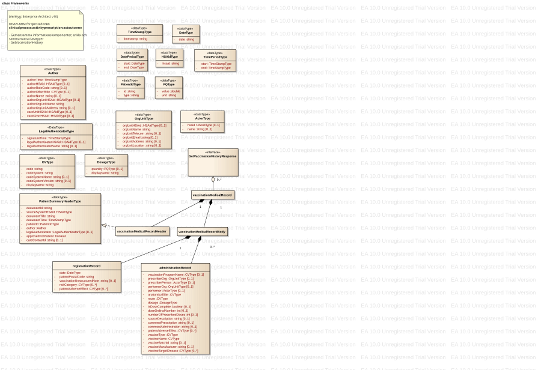

# 7 Tjänstekontrakt - clinicalprocess: activityprescription: actoutcome 1.0 v1.0.2

* [**Table of Contents**](toc.md)
* **7 Tjänstekontrakt**

## 7 Tjänstekontrakt

## Tjänstekontrakt

**I källdokumentet (TKB 1.0, utgåva 1.0.2) beskrivs domänens enda tjänstekontrakt i kapitel 7 GetVaccinationHistory.**

### GetVaccinationHistory

Tjänsten returnerar strukturerad eller ostrukturerad information om patientens vaccinationer.

#### Frivillighet

Tjänstekontraktet är frivilligt

#### Version

1.0

#### SLA-krav

Inga specifika. Se generella SLA-krav.

#### Särskilda förutsättningar beroende på typ av konsument med hänsyn till historisk information (i äldre system)

Relaterat till notering ovan i avsnittet ”Informationssäkerhet”är att vid konsumtion av tjänstekontraktet från en patient/invånartjänst så kan fält som är valfria i kontraktet utelämnas i svaret i de fall som information saknas i producerande system.

Observera att utelämnat HSA-id för Vårdgivare eller Vårdenhet begränsar verksamhetens möjlighet att tillgängliggöra information för egna och andras medarbetare genom olika etjänster riktade till professionen.

#### MIM

Informationsinnehåll och -struktur baseras på en genomgång och analys av ett antal vaccinationsjournalsystem (SMI:s Svevac, TakeCare’s vaccinationsmodul med avstämning även med vissa andra) samt informationskraven som ställs av nationella vaccinationsregistret (sedan 1 januari 2013).

Det förekommer stora skillnader i hur pass strukturerat vaccinationshistorik beskrivs i olika journalsystem, varför nedan kontakt har ett antal attribut som ger viss frihet i hur vaccinationshistorik ges. Observera därför att som regel skall alltid så strukturerad information som möjligt ges av producerande system, och i förekommande fall den ostrukturerade informationen endast ges som kompletterande information.

Vidare ställer lagen om rapportering av nationella vaccinationsprogram vissa informationskrav, som vi valt att inkludera i nedan tjänstekontrakt i syfte att möjliggöra användning av detta tjänstekontrakt för att samla information för rapportering till SMI enligt lagkrav.

Modellen beskriver den logiska strukturen för ett svarsmeddelande.

#### Fältregler

| | | | |
| :--- | :--- | :--- | :--- |
| Begäran |   |   |   |
| careUnitHSAId | HSAIdType | Filtrering på Vårdenhet vilket motsvarar careUnitHSAid i HealthCareProfessionalType. Journalposter som saknar märkning med vårdenhet ingår inte i svaret om detta fält använts i anropet. | 0..* |
| patientId | PersonIdType | Id för patienten. / value sätts till patientens identifierare. Anges med 12 tecken utan avskiljare. / Type sätts till OID för typ av identifierare. / För personnummer ska Skatteverkets personnummer (1.2.752.129.2.1.3.1). / För samordningsnummer ska Skatteverkets samordningsnummer (1.2.752.129.2.1.3.3). / För reservnummer används lokalt definierade reservnummet, exempelvis SLL reservnummer (1.2.752.97.3.1.3) | 1..1 |
| timePeriod | DatePeriodType | Begränsning av sökningen i tid. Begränsningen sker genom att resultatet innehåller de poster som i något av de tidsfält som ingår i vaccinationMedicalRecordHeader eller vaccinationMedicalRecordBody.registrationrecord.date anger en tidpunkt som ligger inom det sökta tidsintervallet (start- och slutpunkt inkluderas i intervallet). | 0..1 |
| sourceSystemHSAId | HSAIdType | Begränsar sökningen till dokument som är skapade i angivet system. / Värdet på detta fält måste överensstämma med värdet på logicalAddress i anropets tekniska kuvertering (ex. SOAP-header). / Det innebär i praktiken att aggregerande tjänster inte används när detta fält anges. / Fältet är tvingande om careContactId angivits. | 0..1 |
| careContactId | string | Begränsar sökningen till den vård- och omsorgskontakt som föranlett den information som omfattas av dokumentet. Identiteten är unik inom källsystemet | 0..* |
|   |   |   |   |
| Svar |   |   |   |
| vaccinationMedicalRecord | VaccinationMedicalRecordType | En strukturerad vaccinationsjournal. | 0..* |
| ../vaccinationMedicalRecordHeader | PatientSummaryHeaderType | Innehåller basinformation om dokumentet. | 1..1 |
| ../../documentId | string | Dokumentets identitet som är unik inom källsystemet. | 1..1 |
| ../../sourceSystemHSAId | HSAIdType | HSA-id för det system som dokumentet är skapat i. | 1..1 |
| ../../documentTitle | string | Titel som beskriver den information som sänds i dokumentet. | 0..1 |
| ../../documentTime | TimeStampType | Händelsetidpunkt. Tidsangivelse för den vaccinationstidpunkt dokumentet gäller. | 0..1 |
| ../../patientId | PersonIdType | Identifierare för patient. | 1..1 |
| ../../../id | string | Sätts till patientens identifierare. Anges med 12 tecken utan avskiljare. | 1..1 |
| ../../../type | string | Sätts till OID för typ av identifierare. / För personnummer ska Skatteverkets personnummer (1.2.752.129.2.1.3.1). / För samordningsnummer ska Skatteverkets samordningsnummer (1.2.752.129.2.1.3.3). / För reservnummer används lokalt definierade reservnummet, exempelvis SLL reservnummer (1.2.752.97.3.1.3) | 1..1 |
| ../../accountableHealthCareProfessional | HealthCareProfessionalType | Information om den hälso- och sjukvårdsperson som ansvarar för informationen i dokumentet. | 1..1 |
| ../../../authorTime | TimeStampType | Tidpunkt då dokumentet skapades. Det är den senaste tidpunkten då informationen uppdaterats i systemet som ska finnas här i de fall informationen har ändrats efter det att den skapades. | 1..1 |
| ../../../healthcareProfessionalHSAId | HSAIdType | Hälso- och sjukvårdspersonens HSA-id. (Enligt NPÖ riv-spec 2.2.0 avsnitt 4.1.39 beslutsregel: / I de fall då HSA-id inte finns tillgängligt i systemet kan Orgnr + lokalt id anges.) | 0..1 |
| ../../../healthcareProfessionalName | string | Namn på hälso- och sjukvårdspersonen. Om tillgängligt skall detta anges. | 0..1 |
| ../../../healthcareProfessionalRoleCode | CVType | Information om personens befattning. Om möjligt skall KV Befattning (OID 1.2.752.129.2.2.1.4), se / http://www.inera.se/Documents/TJANSTER_PROJEKT/Katalogtjanst_HSA/Innehall/hsa_innehall_befattning.pdf | 0..1 |
| ../../../../code | string | Befattningskod. Om code anges skall också codeSystem samt displayName anges. | 0..1 |
| ../../../../codeSystem | string | Kodsystem för befattningskod. Om codeSystem anges skall också code samt displayName anges. | 0..1 |
| ../../../../codeSystemName | string | Namn på kodsystem för befattningskod. | 0..1 |
| ../../../../codeSystemVersion | string | Version på kodsystem för befattningskod. | 0..1 |
| ../../../../displayName | string | Befattningskoden i klartext. Om separat displayName inte finns i producerande system skall samma värde som i code anges. | 0..1 |
| ../../../../originalText | string | Om befattning är beskriven i ett lokalt kodverk utan OID, eller när kod helt saknas, kan en beskrivande text anges i originalText. / Om originalText anges skall inget annat värde i healthcareProfessionalRoleCode anges. | 0..1 |
| ../../../healthcareProfessionalOrgUnit | OrgUnitType | Den organisation som hälso- och sjukvårdspersonen är uppdragstagare på | 0..1 |
| ../../../../orgUnitHSAId | HSAIdType | HSA-id för organisationsenhet. (Enligt NPÖ riv-spec 2.2.0 avsnitt 4.1.6 beslutsregel: / I de fall då HSA-id inte finns tillgängligt i systemet kan Orgnr + lokalt id anges.) | 0..1 |
| ../../../../orgUnitName | string | Namnet på den organisation som hälso- och sjukvårdspersonen är uppdragstagare på. | 0..1 |
| ../../../../orgUnitTelecom | string | Telefon till organisationsenhet | 0..1 |
| ../../../../orgUnitEmail | string | Epost till enhet | 0..1 |
| ../../../../orgUnitAddress | string | Postadress för den organisation som hälso- och sjukvårdspersonen är uppdragstagare på. Skrivs på ett så naturligt sätt som möjligt, exempelvis: / ”Storgatan 12 / 468 91 Lilleby” | 0..1 |
| ../../../../orgUnitLocation | string | Text som anger namnet på plats eller ort för organisationens fysiska placering | 0..1 |
| ../../../healthcareProfessionalCareUnitHSAId | HSAIdType | HSA-id för Vårdenhet | 0..1 |
| ../../../healthcareProfessionalCareGiverHSAId | HSAIdType | HSA-id för vårdgivaren, som är vårdgivare för den enhet som hälso- och sjukvårdspersonen är uppdragstagare för. | 0..1 |
| ../../legalAuthenticator | LegalAuthenticatorType | Information om vem som signerat informationen i dokumentet. | 0..1 |
| ../../../signatureTime | TimeStampType | Tidpunkt för signering | 1..1 |
| ../../../legalAuthenticatorHSAId | HSAIdType | HSA-id för person som signerat dokumentet. (Enligt NPÖ riv-spec 2.2.0 avsnitt 4.1.39 beslutsregel: / I de fall då HSA-id inte finns tillgängligt i systemet kan Orgnr + lokalt id anges.) | 0..1 |
| ../../../legalAuthenticatorName | string | Namnen i klartext för signerande person. | 0..1 |
| ../../approvedForPatient | boolean | Anger om information får delas till patient. Värdet sätts i sådant fall till true, i annat fall till false. | 1..1 |
| ../../careContactId | string | Identitetet för den vård- och omsorgskontakt som föranlett den information som omfattas av dokumentet. Identiteten är unik inom källsystemet | 0..1 |
| ../../nullified | boolean | Anger om dokumentet makulerats i källsystemet. Sätts i så fall till true annars false. Används bl.a. i statistik-/rapportuttag med hjälp av tjänstekontrakten. | 1..1 |
| ../../nullifiedReason | string | Anger orsak till makulering. Får endast anges i kombination med att nullified = true | 0..1 |
| ../vaccinationMedicalRecordBody | VaccinationMedicalRecordBodyType | Består av en registrationData med ytterligare administrativ information samt en eller flera vaccinationData om utförda vaccinationer vid vaccinationstillfället. | 1..1 |
| ../../registrationRecord | RegistrationRecordType | Annan information än ovan som registreras vid eller relaterat till vaccinationstillfället | 1..1 |
| ../../../date | DateType | Datum då nedan vaccination(er) gavs | 1..1 |
| ../../../patientPostalCode | string | Postnummer för patientens senast kända bostadsadress | 0..1 |
| ../../../vaccinationUnstructuredNote | string | Enligt CDA:s konvention med läsbar fritextsammanfattning av den strukturerade information kan också använda här. / Kan formateras enligt HL7NarrativeBlock. / Not: Om endast ostrukturerad vaccinationsinformation finns, kan, detta kontrakt produceras men i så fall inga administrationRecords nedan returneras. | 0..1 |
| ../../../riskCategory | CVType | Information om patientens eventuella riskgruppstillhörighet, känd vid vaccinationstillfället, baserad på i förekommande fall patientens hälsodeklaration | 0..* |
| ../../../patientAdverseEffect | CVType | Information om patienten erfarit någon eller några reaktioner hänför bara till vaccinationstillfället men ej specifik vaccination (i fall som när flera vaccin givits vid samma tillfälle) | 0..* |
| ../../../careGiverOrg | OrgUnitType | Information om juridisk vårdgivare; hsaid (om finns) och kontaktuppgifter namn,epost,tel,adress etc | 1..1 |
| ../../../careGiverContact | ActorType | Kontaktperson hos juridiskt ansvarig vårdgivare | 0..1 |
| ../../../sourceSystemName | String | Klartextnamn på källsystemet | 1..1 |
| ../../../sourceSystemProductName | String | Klartextnamn på källsystemets produktnamn | 0..1 |
| ../../../sourceSystemProductVersion | String | Klartextnamn på källsystemets produktversion | 0..1 |
| ../../../sourceSystemContact | ActorType | Kontaktuppgifter till källsystemsansvarig | 1..1 |
| ../../../careUnitSmiId | String | Utförande vårdenhetens registreringsId hos SMI | 0..1 |
| ../../administrationRecord | AdministrationRecordType | Information om utförd(a) vaccination(er) vid tillfället. Ordinerad men av någon anledning ej given vaccination kan inkluderas. | 0..* |
| ../../../vaccinationProgramName | CVType | Information om vaccinationsprogram om vaccinationen är del av sådant program. Tillåter kodat värde liksom endast namn genom bruk av DisplayName i CVType. | 0..1 |
| ../../../prescriberOrg | OrgUnitType | Information om var vaccinationen ordinerats (eller i fallet med förskrivna vaccinationsläkemedel, förskrivits) | 0..1 |
| ../../../prescriberPerson | ActorType | Information om vem som ordinerat/förskrivit vaccinationen | 0..1 |
| ../../../performerOrg | OrgUnitType | Information om vårdenhet som utfört vaccinationen | 0..1 |
| ../../../performer | ActorType | Information om vem som utfört (administrerat) vaccineringen | 0..1 |
| ../../../anatomicalSite | CVType | Information om var på kroppen vaccinet givits. | 0..1 |
| ../../../route | CVType | Information om hur vaccinet givits. Ibland kallat ”administrationsväg” | 0..1 |
| ../../../dosage | DosageType | Mängd vaccin som givits | 0..1 |
| ../../../isDoseComplete | boolean | True om vaccineringen räknas som hel dos eller efter flera delvaccinationer fullt utförd. Annars false (dvs för de fall som ytterligare delvaccinationer skall ges innan full dos är uppnådd) | 0..1 |
| ../../../doseOrdinalNumber | integer | Anger i förekommande fall om vaccineringen är en del av flera vaccinationer som skall utföras, värden 1,2,3… 1 om endast en | 0..1 |
| ../../../numberOfPrescribedDoses | integer | Anger antalet delvaccinationer som skall utföras för att vaccinationen skall räknas som full dos uppnådd. Värden 1,2,3,… 1 om endast en vaccinering utgör full dos | 0..1 |
| ../../../sourceDescription | string | Fritextinformation som anger källa för vaccinering som efterregistrerats. T ex namn på annan vårdenhet, intyg, land el. dyl. | 0..1 |
| ../../../commentPrescription | string | Fritextinformation. T.ex. instruktioner som noterats i ordinationen av vaccineringen | 0..1 |
| ../../../commentAdministration | string | Fritextinformation. Generella kommentarer gjorde vid vaccineringen av den som utfört den | 0..1 |
| ../../../patientAdverseEffect | CVType | Information om patienten erfarit någon eller några reaktioner hänför bara till den specifika administreringen | 0..* |
| ../../../vaccineType | CVType | Information om givet vaccin | 0..1 |
| ../../../vaccineName | CVType | Information om givet vaccins produktnamn. I Code skall då anges exempelvis NPL-id om det finns och kodverk ”npl”. Om standardkodverk ej används, ej anges lokal kod, se CVType ovan. Namnet i klartext ges i DisplayName. | 0..1 |
| ../../../vaccineBatchId | string | Identifiering av batchnummer för vaccinets tillverkning | 0..1 |
| ../../../vaccineManufacturer | string | Namn på tillverkaren av vaccinet | 0..1 |
| ../../../vaccineTargetDisease | CVType | Information om den/de sjukdomar vaccinet skyddar emot | 0..* |
| ../../../vaccinationUniqueReference | IIType | Unika referensen till källsystemets vaccinationsinformation | 0..1 |
| ../../../../root | string | Om identiteten i källsystemet är globalt unik kan den anges här (t.ex. om den är en UUID). Annars anges källsystemets HSA-id här och källsystemets lokala ID för vaccinationen anges i ”extention”. | 1..1 |
| ../../../../extension | string | Används vid behov. Se beskrivning för ”root” | 0..1 |

#### Källfiler (RIV-TA)

Originalkällfiler för tjänstekontraktet, i RIV-TA-format, ur Bitbucket-taggen `1.0.2`:

| | |
| :--- | :--- |
| [GetVaccinationHistoryInteraction_1.0_RIVTABP21.wsdl](GetVaccinationHistoryInteraction_1.0_RIVTABP21.wsdl) | WSDL-kontrakt |
| [GetVaccinationHistoryResponder_1.0.xsd](GetVaccinationHistoryResponder_1.0.xsd) | Tjänstespecifikt schema |
| [clinicalprocess_activityprescription_actoutcome_1.0.xsd](clinicalprocess_activityprescription_actoutcome_1.0.xsd) | Domänschema (delat) |
| [itintegration_registry_1.0.xsd](itintegration_registry_1.0.xsd) | Schema för LogicalAddress (RIV-TA-huvud) |
| [Mappning_GVH_till_journalsystem.docx](Mappning_GVH_till_journalsystem.docx) | Arbetsdokument: mappning av GetVaccinationHistory till källsystem |

Övriga dokument i taggen:

| | |
| :--- | :--- |
| [Arkitekturella_beslut.docx](Arkitekturella_beslut.docx) | Arkitekturella beslut (AB), version 1.0.2 (mall utan ifyllda beslut) |
| [TD_activityprescription_actoutcome.pptx](TD_activityprescription_actoutcome.pptx) | Presentation av tjänstedomänen |

#### FHIR-artefakter

Följande FHIR-artefakter har genererats från ovanstående kontraktsbeskrivning och XML-scheman:

* **Logisk modell (response):** [StructureDefinition/getvaccinationhistory](StructureDefinition-getvaccinationhistory.md)
* **Logisk modell (request):** [StructureDefinition/getvaccinationhistory-request](StructureDefinition-getvaccinationhistory-request.md)

Domänen definierar inga egna kodverk i version 1.0. Kodade värden (CVType) anges med producentsystemets kodverk.

