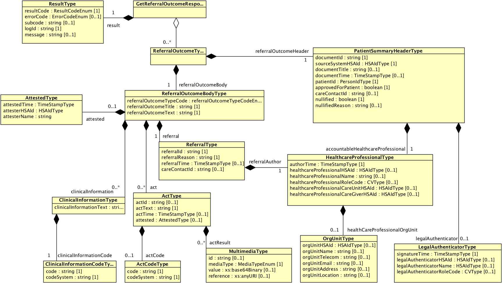
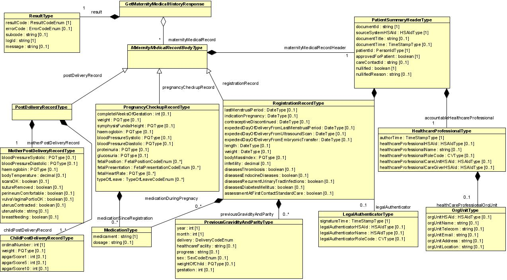
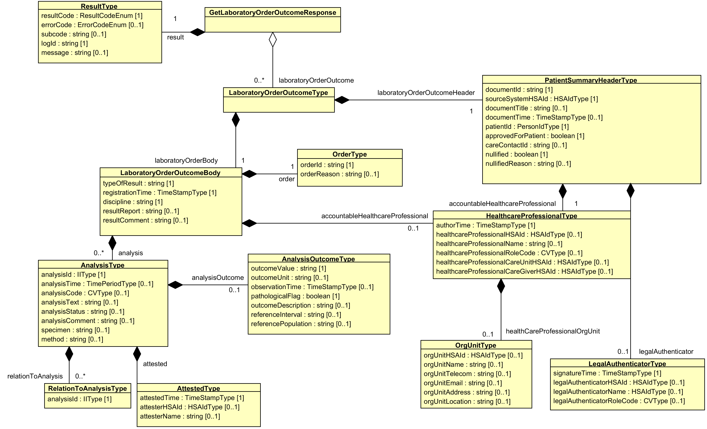
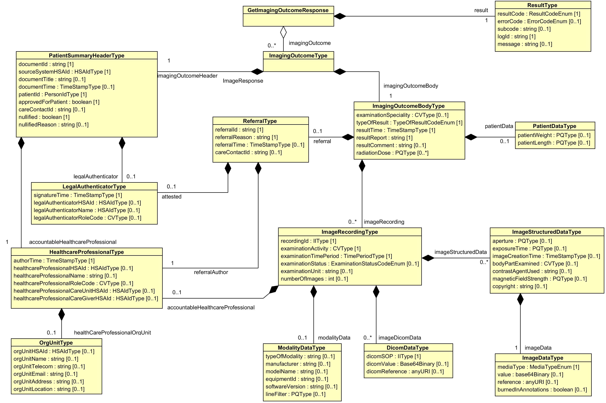

# 6 Tjänstedomänens meddelandemodeller - clinicalprocess: healthcond: actoutcome 3.1.10 v3.1.10

* [**Table of Contents**](toc.md)
* **6 Tjänstedomänens meddelandemodeller**

## 6 Tjänstedomänens meddelandemodeller

## Tjänstedomänens meddelandemodeller

Här beskrivs de meddelandemodeller som tjänstekontrakten bygger på. För varje meddelandemodell beskrivs hur mappning ser ut mot schema (XSD) för tjänstekontrakt.

### V-MIM

#### GetReferralOutcome

Meddelandeformatet är kompatibelt med HL7 v. 3 CDA v. 2 och NPÖ RIV Informationsspecifikation 2.2.0, V-MIM ”Undersökningsresultat Övrig undersökning”, enligt beskrivning i bilaga, se referens [R 6].

| | |
| :--- | :--- |
| ReferralOutcomeType |   |
| ReferralOutcomeHeaderType.documentId | referralOutcome/referralOutcomeHeader/documentId |
| ReferralOutcomeHeaderType.sourceSystemHSAId | referralOutcome/referralOutcomeHeader/sourceSystemHSAId |
| ReferralOutcomeHeaderType.documentTitle | referralOutcome/referralOutcomeHeader/documentTitle |
| ReferralOutcomeHeaderType.documentTime | referralOutcome/referralOutcomeHeader/documentTime |
| ReferralOutcomeHeaderType.patientId | referralOutcome/referralOutcomeHeader/patientId |
| ReferralOutcomeHeaderType.accountableHealthcareProfessional | referralOutcome/referralOutcomeHeader/accountableHealthcareProfessional |
| HealthcareProfessionalType.authorTime | referralOutcome/referralOutcomeHeader/ accountableHealthcareProfessional /authorTime |
| HealthcareProfessionalType.healthcareProfessionalHSAId | referralOutcome/referralOutcomeHeader/accountableHealthcareProfessional/healthcareProfessionalHSAId |
| HealthcareProfessionalType.healthcareProfessionalName | referralOutcome/referralOutcomeHeader/accountableHealthcareProfessional/healthcareProfessionalName |
| HealthcareProfessionalType.healthcareProfessionalRoleCode | referralOutcome/referralOutcomeHeader/accountableHealthcareProfessional/healthcareProfessionalRoleCode |
| OrgUnitType.orgUnitHSAId | referralOutcome/referralOutcomeHeader/accountableHealthcareProfessional/healthcareProfessionalOrgUnit/orgUnitHSAId |
| OrgUnitType.orgUnitname | referralOutcome/referralOutcomeHeader/accountableHealthcareProfessional/healthcareProfessionalOrgUnit/orgUnitname |
| OrgUnitType.orgUnitTelecom | referralOutcome/referralOutcomeHeader/accountableHealthcareProfessional/healthcareProfessionalOrgUnit/orgUnitTelecom |
| OrgUnitType.orgUnitEmail | referralOutcome/referralOutcomeHeader/accountableHealthcareProfessional/healthcareProfessionalOrgUnit/orgUnitEmail |
| OrgUnitType.orgUnitAddress | referralOutcome/referralOutcomeHeader/accountableHealthcareProfessional/healthcareProfessionalOrgUnit/orgUnitAddress |
| OrgUnitType.orgUnitLocation | referralOutcome/referralOutcomeHeader/accountableHealthcareProfessional/healthcareProfessionalOrgUnit/orgUnitLocation |
| HealthcareProfessionalType.healthcareProfessionalCareUnitHSAId | referralOutcome/referralOutcomeHeader/accountableHealthcareProfessional/healthcareProfessionalCareUnitHSAId |
| HealthcareProfessionalType.healthcareProfessionalCareGiverHSAId | referralOutcome/referralOutcomeHeader/accountableHealthcareProfessional/healthcareProfessionalCareGiverHSAId |
| LegalAuthenticatorType.signatureTime | referralOutcome/referralOutcomeHeader/legalAuthenticator/signatureTime |
| LegalAuthenticatorType.legalAuthenticatorHSAId | referralOutcome/referralOutcomeHeader/legalAuthenticator/legalAuthenticatorHSAId |
| LegalAuthenticatorType.legalAuthenticatorName | referralOutcome/referralOutcomeHeader/legalAuthenticator/legalAuthenticatorName |
| ReferralOutcomeHeaderType.approvedForPatient | referralOutcome/referralOutcomeHeader/approvedForPatient |
| ReferralOutcomeHeaderType.careContactId | referralOutcome/referralOutcomeHeader/careContactId |
| ReferralOutcomeBodyType |   |
| ReferralOutcomeBodyType.referralOutcomeTypeCode | referralOutcome/referralOutcomeBody/referralOutcomeTypeCode |
| ReferralOutcomeBodyType.referralOutcomeTitle | referralOutcome/referralOutcomeBody/referralOutcomeTitle |
| ReferralOutcomeBodyType.referralOutcomeText | referralOutcome/referralOutcomeBody/referralOutcomeText |
| ClinicalInformationType.clinicalInformationCode | referralOutcome/referralOutcomeBody/clinicalInformation/clinicalInformationCode |
| ClinicalInformationType.clinicalInformationText | referralOutcome/referralOutcomeBody/clinicalInformation/clinicalInformationText |
| ActType.actId | referralOutcome/referralOutcomeBody/act/actId |
| ActType.actCode | referralOutcome/referralOutcomeBody/act/actCode |
| ActType.actText | referralOutcome/referralOutcomeBody/act/actText |
| ActType.actTime | referralOutcome/referralOutcomeBody/act/actTime |
| ActType.actResult | referralOutcome/referralOutcomeBody/act/actResult |
| ReferralType.referralId | referralOutcome/referralOutcomeBody/referral/referralId |
| ReferralType.referralReason | referralOutcome/referralOutcomeBody/referral/referralReason |
| ReferralType.referralTime | referralOutcome/referralOutcomeBody/referral/referralTime |
| ReferralType.referralAuthor | referralOutcome/referralOutcomeBody/referral/referralAuthor |
| HealthcareProfessionalType.authorTime | referralOutcome/referralOutcomeBody/referral/referralAuthor/authorTime |
| HealthcareProfessionalType.healthcareProfessionalHSAId | referralOutcome/referralOutcomeBody/referral/referralAuthor/healthcareProfessionalHSAId |
| HealthcareProfessionalType.healthcareProfessionalName | referralOutcome/referralOutcomeBody/referral/referralAuthor/healthcareProfessionalName |
| HealthcareProfessionalType.healthcareProfessionalRoleCode | referralOutcome/referralOutcomeBody/referral/referralAuthor/healthcareProfessionalRoleCode |
| HealthcareProfessionalType.healthcareProfessionalOrgUnit.orgUnitHSAId | referralOutcome/referralOutcomeBody/referral/referralAuthor/healthcareProfessionalOrgUnit/orgUnitHSAId |
| HealthcareProfessionalType.healthcareProfessionalOrgUnit.orgUnitName | referralOutcome/referralOutcomeBody/referral/referralAuthor/healthcareProfessionalOrgUnit/orgUnitName |
| HealthcareProfessionalType.healthcareProfessionalOrgUnit.orgUnitTelecom | referralOutcome/referralOutcomeBody/referral/referralAuthor/healthcareProfessionalOrgUnit/orgUnitTelecom |
| HealthcareProfessionalType.healthcareProfessionalOrgUnit.orgUnitEmail | referralOutcome/referralOutcomeBody/referral/referralAuthor/healthcareProfessionalOrgUnit/orgUnitEmail |
| HealthcareProfessionalType.healthcareProfessionalOrgUnit.orgUnitAddress | referralOutcome/referralOutcomeBody/referral/referralAuthor/healthcareProfessionalOrgUnit/orgUnitAddress |
| HealthcareProfessionalType.healthcareProfessionalOrgUnit.orgUnitLocation | referralOutcome/referralOutcomeBody/referral/referralAuthor/healthcareProfessionalOrgUnit/orgUnitLocation |
| ReferralType.careContactId | referralOutcome/referralOutcomeBody/referral/careContactId |
| ResultType | result |
| ResultType.resultCode | result/resultCode |
| ResultType.errorCode | result/errorCode |
| ResultType.subcode | result/subcode |
| ResultType.logId | result/logId |
| ResultType.message | result/message |

#### GetMaternityMedicalHistory

Modellen beskriver den logiska strukturen för ett svarsmeddelande. Tjänsten baseras inte på RIV Informationsspecifikation för NPÖ eller VTIM, utan på Socialstyrelsens blanketter för mödravårdsjournal.

| | |
| :--- | :--- |
| MaternityMedicalHistoryType |   |
| MaternityMedicalHistoryHeaderType.documentId | maternityMedicalHistory/maternityMedicalHistoryHeader/documentId |
| MaternityMedicalHistoryHeaderType.sourceSystemHSAId | maternityMedicalHistory/maternityMedicalHistoryHeader/sourceSystemHSAId |
| MaternityMedicalHistoryHeaderType.patientId | maternityMedicalHistory/maternityMedicalHistoryHeader/patientId |
| MaternityMedicalHistoryHeaderType.accountableHealthcareProfessional | maternityMedicalHistory/maternityMedicalHistoryHeader/accountableHealthcareProfessional |
| HealthcareProfessionalType.authorTime | maternityMedicalHistory/maternityMedicalHistoryHeader/ accountableHealthcareProfessional /authorTime |
| HealthcareProfessionalType.healthcareProfessionalHSAId | maternityMedicalHistory/maternityMedicalHistoryHeader/accountableHealthcareProfessional/healthcareProfessionalHSAId |
| HealthcareProfessionalType.healthcareProfessionalName | maternityMedicalHistory/maternityMedicalHistoryHeader/accountableHealthcareProfessional/healthcareProfessionalName |
| HealthcareProfessionalType.healthcareProfessionalRoleCode | maternityMedicalHistory/maternityMedicalHistoryHeader/accountableHealthcareProfessional/healthcareProfessionalRoleCode |
| OrgUnitType.orgUnitHSAId | maternityMedicalHistory/maternityMedicalHistoryHeader/accountableHealthcareProfessional/healthcareProfessionalOrgUnit/orgUnitHSAId |
| OrgUnitType.orgUnitname | maternityMedicalHistory/maternityMedicalHistoryHeader/accountableHealthcareProfessional/healthcareProfessionalOrgUnit/orgUnitname |
| OrgUnitType.orgUnitTelecom | maternityMedicalHistory/maternityMedicalHistoryHeader/accountableHealthcareProfessional/healthcareProfessionalOrgUnit/orgUnitTelecom |
| OrgUnitType.orgUnitEmail | maternityMedicalHistory/maternityMedicalHistoryHeader/accountableHealthcareProfessional/healthcareProfessionalOrgUnit/orgUnitEmail |
| OrgUnitType.orgUnitAddress | maternityMedicalHistory/maternityMedicalHistoryHeader/accountableHealthcareProfessional/healthcareProfessionalOrgUnit/orgUnitAddress |
| OrgUnitType.orgUnitLocation | maternityMedicalHistory/maternityMedicalHistoryHeader/accountableHealthcareProfessional/healthcareProfessionalOrgUnit/orgUnitLocation |
| HealthcareProfessionalType.healthcareProfessionalCareUnitHSAId | maternityMedicalHistory/maternityMedicalHistoryHeader/accountableHealthcareProfessional/healthcareProfessionalCareUnitHSAId |
| HealthcareProfessionalType.healthcareProfessionalCareGiverHSAId | maternityMedicalHistory/maternityMedicalHistoryHeader/accountableHealthcareProfessional/healthcareProfessionalCareGiverHSAId |
| LegalAuthenticatorType.signatureTime | maternityMedicalHistory/maternityMedicalHistoryHeader/legalAuthenticator/signatureTime |
| LegalAuthenticatorType.legalAuthenticatorHSAId | maternityMedicalHistory/maternityMedicalHistoryHeader/legalAuthenticator/legalAuthenticatorHSAId |
| LegalAuthenticatorType.legalAuthenticatorName | maternityMedicalHistory/maternityMedicalHistoryHeader/legalAuthenticator/legalAuthenticatorName |
| MaternityMedicalHistoryHeaderType.approvedForPatient | maternityMedicalHistory/maternityMedicalHistoryHeader/approvedForPatient |
| MaternityMedicalHistoryHeaderType.careContactId | maternityMedicalHistory/maternityMedicalHistoryHeader/careContactId |
| MaternityMedicalHistoryBodyType |   |
| RegistrationRecordType.lastMenstrualPeriod | maternityMedicalHistory/maternityMedicalHistoryBody/registrationRecord/lastMenstrualPeriod |
| RegistrationRecordType.indicationPregnancy | maternityMedicalHistory/maternityMedicalHistoryBody/registrationRecord/indicationPregnancy |
| RegistrationRecordType.contraceptiveDiscontinued | maternityMedicalHistory/maternityMedicalHistoryBody/registrationRecord/contraceptiveDiscontinued |
| RegistrationRecordType.expectedDayOfDeliveryFromLastMenstrualPeriod | maternityMedicalHistory/maternityMedicalHistoryBody/registrationRecord/expectedDayOfDeliveryFromLastMentrualPeriod |
| RegistrationRecordType.expectedDayOfDeliveryFromUltrasoundScan | maternityMedicalHistory/maternityMedicalHistoryBody/registrationRecord/expectedDayOfDeliveryFromUltrasoundScan |
| RegistrationRecordType.expectedDayOfDeliveryFromEmbryonicTransfer | maternityMedicalHistory/maternityMedicalHistoryBody/registrationRecord/expectedDayOfDeliveryFromEmbryonicTransfer |
| RegistrationRecordType.length | maternityMedicalHistory/maternityMedicalHistoryBody/registrationRecord/length |
| RegistrationRecordType.weight | maternityMedicalHistory/maternityMedicalHistoryBody/registrationRecord/weight |
| RegistrationRecordType.bodyMassIndex | maternityMedicalHistory/maternityMedicalHistoryBody/registrationRecord/bodyMassIndex |
| RegistrationRecordType.infertility | maternityMedicalHistory/maternityMedicalHistoryBody/registrationRecord/infertility |
| PreviousGravidityAndParityType.year | maternityMedicalHistory/maternityMedicalHistoryBody/registrationRecord/previousGravidityAndParity/year |
| PreviousGravidityAndParityType.delivery | maternityMedicalHistory/maternityMedicalHistoryBody/registrationRecord/previousGravidityAndParity/delivery |
| PreviousGravidityAndParityType.healthcareFacility | maternityMedicalHistory/maternityMedicalHistoryBody/registrationRecord/previousGravidityAndParity/healthcareFacility |
| PreviousGravidityAndParityType.progress | maternityMedicalHistory/maternityMedicalHistoryBody/registrationRecord/previousGravidityAndParity/progress |
| PreviousGravidityAndParityType.sex | maternityMedicalHistory/maternityMedicalHistoryBody/registrationRecord/previousGravidityAndParity/sex |
| PreviousGravidityAndParityType.weightOfChild | maternityMedicalHistory/maternityMedicalHistoryBody/registrationRecord/previousGravidityAndParity/weightOfChild |
| PreviousGravidityAndParityType.gestation | maternityMedicalHistory/maternityMedicalHistoryBody/registrationRecord/previousGravidityAndParity/gestation |
| PreviousGravidityAndParityType.diseasesThrombosis | maternityMedicalHistory/maternityMedicalHistoryBody/registrationRecord/previousGravidityAndParity/diseasesThrombosis |
| PreviousGravidityAndParityType.diseasesEndocrineDiseases | maternityMedicalHistory/maternityMedicalHistoryBody/registrationRecord/previousGravidityAndParity/diseasesEndocrineDiseases |
| PreviousGravidityAndParityType.diseasesReccurentUrinaryTractInfections | maternityMedicalHistory/maternityMedicalHistoryBody/registrationRecord/previousGravidityAndParity/diseasesRecurrentUrinaryTractInfections |
| PreviousGravidityAndParityType.diseasesDiabetesMellitus | maternityMedicalHistory/maternityMedicalHistoryBody/registrationRecord/previousGravidityAndParity/diseasesDiabetesMellitus |
| PreviousGravidityAndParityType.assessmentAtFirstContactStandardCare | maternityMedicalHistory/maternityMedicalHistoryBody/registrationRecord/previousGravidityAndParity/assessmentAtFirstContactStandardCare |
| PregnancyCheckupRecordType.completeWeeksOfGestation | maternityMedicalHistory/maternityMedicalHistoryBody/pregnancyCheckupRecord/completeWeeksOfGestation |
| PregnancyCheckupRecordType.weight | maternityMedicalHistory/maternityMedicalHistoryBody/pregnancyCheckupRecord/weight |
| PregnancyCheckupRecordType.symphysisFundalHeight | maternityMedicalHistory/maternityMedicalHistoryBody/pregnancyCheckupRecord/symphysisFundalHeight |
| PregnancyCheckupRecordType.haemoglobin | maternityMedicalHistory/maternityMedicalHistoryBody/pregnancyCheckupRecord/haemoglobin |
| PregnancyCheckupRecordType.bloodPressureSystolic | maternityMedicalHistory/maternityMedicalHistoryBody/pregnancyCheckupRecord/bloodPressureSystolic |
| PregnancyCheckupRecordType.bloodPressureDiastolic | maternityMedicalHistory/maternityMedicalHistoryBody/pregnancyCheckupRecord/bloodPressureDiastolic |
| PregnancyCheckupRecordType.proteinuria | maternityMedicalHistory/maternityMedicalHistoryBody/pregnancyCheckupRecord/proteinuria |
| PregnancyCheckupRecordType.glycosuria | maternityMedicalHistory/maternityMedicalHistoryBody/pregnancyCheckupRecord/glycosuria |
| PregnancyCheckupRecordType.fetalPosition | maternityMedicalHistory/maternityMedicalHistoryBody/pregnancyCheckupRecord/fetalPosition |
| PregnancyCheckupRecordType.fetalPresentation | maternityMedicalHistory/maternityMedicalHistoryBody/pregnancyCheckupRecord/fetalPresentation |
| PregnancyCheckupRecordType.fetalHeartRate | maternityMedicalHistory/maternityMedicalHistoryBody/pregnancyCheckupRecord/fetalHeartRate |
| PregnancyCheckupRecordType.typeOfLeave | maternityMedicalHistory/maternityMedicalHistoryBody/pregnancyCheckupRecord/typeOfLeave |
| MotherPostDeliveryRecordType.breastfeeding | maternityMedicalHistory/maternityMedicalHistoryBody/pregnancyCheckupRecord/completeWeeksOfGestation |
| MotherPostDeliveryRecordType.bloodPressureSystolic | maternityMedicalHistory/maternityMedicalHistoryBody/postDeliveryRecord/motherPostDeliveryRecord/bloodPressureSystolic |
| MotherPostDeliveryRecordType.bloodPressureDiastolic | maternityMedicalHistory/maternityMedicalHistoryBody/postDeliveryRecord/motherPostDeliveryRecord/bloodPressureDiastolic |
| MotherPostDeliveryRecordType.haemoglobin | maternityMedicalHistory/maternityMedicalHistoryBody/postDeliveryRecord/motherPostDeliveryRecord/haemoglobin |
| MotherPostDeliveryRecordType.bodyTemperature | maternityMedicalHistory/maternityMedicalHistoryBody/postDeliveryRecord/motherPostDeliveryRecord/bodyTemperature |
| MotherPostDeliveryRecordType.scarsOK | maternityMedicalHistory/maternityMedicalHistoryBody/postDeliveryRecord/motherPostDeliveryRecord/scarsOK |
| MotherPostDeliveryRecordType.sutureRemoved | maternityMedicalHistory/maternityMedicalHistoryBody/postDeliveryRecord/motherPostDeliveryRecord/sutureRemoved |
| MotherPostDeliveryRecordType.perineumComfortable | maternityMedicalHistory/maternityMedicalHistoryBody/postDeliveryRecord/motherPostDeliveryRecord/perineumComfortable |
| MotherPostDeliveryRecordType.vulvaVaginaPortioOK | maternityMedicalHistory/maternityMedicalHistoryBody/postDeliveryRecord/motherPostDeliveryRecord/vulvaVaginaPortioOK |
| MotherPostDeliveryRecordType.uterusContracted | maternityMedicalHistory/maternityMedicalHistoryBody/postDeliveryRecord/motherPostDeliveryRecord/uterusContracted |
| MotherPostDeliveryRecordType.uterusNote | maternityMedicalHistory/maternityMedicalHistoryBody/postDeliveryRecord/motherPostDeliveryRecord/uterusNote |
| ChildPostDeliveryRecordType.ordinalNumber | maternityMedicalHistory/maternityMedicalHistoryBody/postDeliveryRecord/childPostDeliveryRecord/ordinalNumber |
| ChildPostDeliveryRecordType.weight | maternityMedicalHistory/maternityMedicalHistoryBody/postDeliveryRecord/childPostDeliveryRecord/weight |
| ChildPostDeliveryRecordType.apgarScore1 | maternityMedicalHistory/maternityMedicalHistoryBody/postDeliveryRecord/childPostDeliveryRecord/apgarScore1 |
| ChildPostDeliveryRecordType.apgarScore5 | maternityMedicalHistory/maternityMedicalHistoryBody/postDeliveryRecord/childPostDeliveryRecord/apgarScore5 |
| ChildPostDeliveryRecordType.apgarScore10 | maternityMedicalHistory/maternityMedicalHistoryBody/postDeliveryRecord/childPostDeliveryRecord/apgarScore10 |
| MedicationType.medicament | maternityMedicalHistory/maternityMedicalHistoryBody/registrationRecord/previousGravidityAndParity/medicationDuringPregnancy/medicament / och / maternityMedicalHistory/maternityMedicalHistoryBody/pregnancyCheckupRecord/medicationSinceRegistration/medicament |
| MedicationType.dosage | maternityMedicalHistory/maternityMedicalHistoryBody/pregnancyCheckupRecord/medicationSinceRegistration/dosage |
| ResultType | result |
| ResultType.resultCode | result/resultCode |
| ResultType.errorCode | result/errorCode |
| ResultType.subcode | result/subcode |
| ResultType.logId | result/logId |
| ResultType.message | result/message |

#### GetLaboratoryOrderOutcome

Meddelandeformatet är kompatibelt med HL7 v. 3 CDA v. 2 och NPÖ RIV Informationsspecifikation 2.2.1, V-MIM ”Undersökningsresultat Klinisk kemi/Mikrobiologi”, enligt beskrivning i bilaga, se referens [R 7].

| | |
| :--- | :--- |
| LaboratoryOrderOutcomeType |   |
| LaboratoryOrderOutcomeHeaderType.documentId | laboratoryOrderOutcome/laboratoryOrderOutcomeHeader/documentId |
| LaboratoryOrderOutcomeHeaderType.sourceSystemHSAId | laboratoryOrderOutcome/laboratoryOrderOutcomeHeader/sourceSystemHSAId |
| LaboratoryOrderOutcomeHeaderType.documentTime | laboratoryOrderOutcome/laboratoryOrderOutcomeHeader/documentTime |
| LaboratoryOrderOutcomeHeaderType.patientId | laboratoryOrderOutcome/laboratoryOrderOutcomeHeader/patientId |
| LaboratoryOrderOutcomeHeaderType.accountableHealthcareProfessional | laboratoryOrderOutcome/laboratoryOrderOutcomeHeader/accountableHealthcareProfessional |
| HealthcareProfessionalType.authorTime | laboratoryOrderOutcome/laboratoryOrderOutcomeHeader/ accountableHealthcareProfessional /authorTime |
| HealthcareProfessionalType.healthcareProfessionalHSAId | laboratoryOrderOutcome/laboratoryOrderOutcomeHeader/accountableHealthcareProfessional/healthcareProfessionalHSAId |
| HealthcareProfessionalType.healthcareProfessionalName | laboratoryOrderOutcome/laboratoryOrderOutcomeHeader/accountableHealthcareProfessional/healthcareProfessionalName |
| HealthcareProfessionalType.healthcareProfessionalRoleCode | laboratoryOrderOutcome/laboratoryOrderOutcomeHeader/accountableHealthcareProfessional/healthcareProfessionalRoleCode |
| OrgUnitType.orgUnitHSAId | laboratoryOrderOutcome/laboratoryOrderOutcomeHeader/accountableHealthcareProfessional/healthcareProfessionalOrgUnit/orgUnitHSAId |
| OrgUnitType.orgUnitname | laboratoryOrderOutcome/laboratoryOrderOutcomeHeader/accountableHealthcareProfessional/healthcareProfessionalOrgUnit/orgUnitname |
| OrgUnitType.orgUnitTelecom | laboratoryOrderOutcome/laboratoryOrderOutcomeHeader/accountableHealthcareProfessional/healthcareProfessionalOrgUnit/orgUnitTelecom |
| OrgUnitType.orgUnitEmail | laboratoryOrderOutcome/laboratoryOrderOutcomeHeader/accountableHealthcareProfessional/healthcareProfessionalOrgUnit/orgUnitEmail |
| OrgUnitType.orgUnitAddress | laboratoryOrderOutcome/laboratoryOrderOutcomeHeader/accountableHealthcareProfessional/healthcareProfessionalOrgUnit/orgUnitAddress |
| OrgUnitType.orgUnitLocation | laboratoryOrderOutcome/laboratoryOrderOutcomeHeader/accountableHealthcareProfessional/healthcareProfessionalOrgUnit/orgUnitLocation |
| HealthcareProfessionalType.healthcareProfessionalCareUnitHSAId | laboratoryOrderOutcome/laboratoryOrderOutcomeHeader/accountableHealthcareProfessional/healthcareProfessionalCareUnitHSAId |
| HealthcareProfessionalType.healthcareProfessionalCareGiverHSAId | laboratoryOrderOutcome/laboratoryOrderOutcomeHeader/accountableHealthcareProfessional/healthcareProfessionalCareGiverHSAId |
| LegalAuthenticatorType.signatureTime | laboratoryOrderOutcome/laboratoryOrderOutcomeHeader/legalAuthenticator/signatureTime |
| LegalAuthenticatorType.legalAuthenticatorHSAId | laboratoryOrderOutcome/laboratoryOrderOutcomeHeader/legalAuthenticator/legalAuthenticatorHSAId |
| LegalAuthenticatorType.legalAuthenticatorName | laboratoryOrderOutcome/laboratoryOrderOutcomeHeader/legalAuthenticator/legalAuthenticatorName |
| LaboratoryOrderOutcomeHeaderType.approvedForPatient | laboratoryOrderOutcome/laboratoryOrderOutcomeHeader/approvedForPatient |
| LaboratoryOrderOutcomeHeaderType.careContactId | laboratoryOrderOutcome/laboratoryOrderOutcomeHeader/careContactId |
| LaboratoryOrderOutcomeBodyType |   |
| LaboratoryOrderOutcomeBodyTypeBodyType.typeOfResult | laboratoryOrderOutcome/laboratoryOrderOutcomeBody/typeOfResult |
| LaboratoryOrderOutcomeBodyType.registrationTime | laboratoryOrderOutcome/laboratoryOrderOutcomeBody/registrationTime |
| LaboratoryOrderOutcomeBodyType.discipline | laboratoryOrderOutcome/laboratoryOrderOutcomeBody/discipline |
| LaboratoryOrderOutcomeBodyType.resultReport | laboratoryOrderOutcome/laboratoryOrderOutcomeBody/resultReport |
| LaboratoryOrderOutcomeBodyType.resultComment | laboratoryOrderOutcome/laboratoryOrderOutcomeBody/resultComment |
| LaboratoryOrderOutcomeBodyType.accountableHealthcareProfessional | laboratoryOrderOutcome/laboratoryOrderOutcomeBody/accountableHealthcareProfessional |
| HealthcareProfessionalType.authorTime | laboratoryOrderOutcome/laboratoryOrderOutcomeBody/accountableHealthcareProfessional/authorTime |
| HealthcareProfessionalType.healthcareProfessionalHSAId | laboratoryOrderOutcome/laboratoryOrderOutcomeBody/accountableHealthcareProfessional/healthcareProfessionalHSAId |
| HealthcareProfessionalType.healthcareProfessionalName | laboratoryOrderOutcome/laboratoryOrderOutcomeBody/accountableHealthcareProfessional/healthcareProfessionalName |
| HealthcareProfessionalType.healthcareProfessionalRoleCode | laboratoryOrderOutcome/laboratoryOrderOutcomeBody/accountableHealthcareProfessional/healthcareProfessionalRoleCode |
| OrgUnitType.orgUnitHSAId | laboratoryOrderOutcome/laboratoryOrderOutcomeBody/accountableHealthcareProfessional/healthcareProfessionalOrgUnit/orgUnitHSAId |
| OrgUnitType.orgUnitname | laboratoryOrderOutcome/laboratoryOrderOutcomeBody/accountableHealthcareProfessional/healthcareProfessionalOrgUnit/orgUnitName |
| OrgUnitType.orgUnitTelecom | laboratoryOrderOutcome/laboratoryOrderOutcomeBody/accountableHealthcareProfessional/healthcareProfessionalOrgUnit/orgUnitTelecom |
| OrgUnitType.orgUnitEmail | laboratoryOrderOutcome/laboratoryOrderOutcomeBody/accountableHealthcareProfessional/healthcareProfessionalOrgUnit/orgUnitEmail |
| OrgUnitType.orgUnitAddress | laboratoryOrderOutcome/laboratoryOrderOutcomeBody/accountableHealthcareProfessional/healthcareProfessionalOrgUnit/orgUnitAddress |
| OrgUnitType.orgUnitLocation | laboratoryOrderOutcome/laboratoryOrderOutcomeBody/accountableHealthcareProfessional/healthcareProfessionalOrgUnit/orgUnitLocation |
| AnalysisType.analysisId | laboratoryOrderOutcome/laboratoryOrderOutcomeBody/analysis/analysisId |
| AnalysisType.analysisTime | laboratoryOrderOutcome/laboratoryOrderOutcomeBody/analysis/analysisTime |
| AnalysisType.analysisCode | laboratoryOrderOutcome/laboratoryOrderOutcomeBody/analysis/analysisCode |
| AnalysisType.analysisText | laboratoryOrderOutcome/laboratoryOrderOutcomeBody/analysis/analysisText |
| AnalysisType.analysisStatus | laboratoryOrderOutcome/laboratoryOrderOutcomeBody/analysis/analysisStatus |
| AnalysisType.analysisComment | laboratoryOrderOutcome/laboratoryOrderOutcomeBody/analysis/analysisComment |
| AnalysisType.specimen | laboratoryOrderOutcome/laboratoryOrderOutcomeBody/analysis/specimen |
| AnalysisType.method | laboratoryOrderOutcome/laboratoryOrderOutcomeBody/analysis/method |
| RelationToAnalysisType.analysisId | laboratoryOrderOutcome/laboratoryOrderOutcomeBody/analysis/relationToAnalysis/analysisId |
| AnalysisOutcomeType.outcomeValue | laboratoryOrderOutcome/laboratoryOrderOutcomeBody/analysis/analysisOutcome/outcomeValue |
| AnalysisOutcomeType.outcomeUnit | laboratoryOrderOutcome/laboratoryOrderOutcomeBody/analysis/analysisOutcome/outcomeUnit |
| AnalysisOutcomeType.observationTime | laboratoryOrderOutcome/laboratoryOrderOutcomeBody/analysis/analysisOutcome/observationTime |
| AnalysisOutcomeType.pathologicalFlag | laboratoryOrderOutcome/laboratoryOrderOutcomeBody/analysis/analysisOutcome/pathologicalFlag |
| AnalysisOutcomeType.outcomeDescription | laboratoryOrderOutcome/laboratoryOrderOutcomeBody/analysis/analysisOutcome/outcomeDescription |
| AnalysisOutcomeType.referenceInterval | laboratoryOrderOutcome/laboratoryOrderOutcomeBody/analysis/analysisOutcome/referenceInterval |
| AnalysisOutcomeType.referencePopulation | laboratoryOrderOutcome/laboratoryOrderOutcomeBody/analysis/analysisOutcome/referencePopulation |
| OrderType.orderId | laboratoryOrderOutcome/laboratoryOrderOutcomeBody/order/orderId |
| OrderType.orderReason | laboratoryOrderOutcome/laboratoryOrderOutcomeBody/order/orderReasion |
| ResultType | result |
| ResultType.resultCode | result/resultCode |
| ResultType.errorCode | result/errorCode |
| ResultType.subcode | result/subcode |
| ResultType.logId | result/logId |
| ResultType.message | result/message |

#### GetImagingOutcome

| | |
| :--- | :--- |
| PatientSummaryHeaderType.documentId | ImagingOutcome/ImagingOutcomeHeader/documentId |
| PatientSummaryHeaderType.sourceSystemHSAId | ImagingOutcome/ImagingOutcomeHeader/sourceSystemHSAId |
| PatientSummaryHeaderType.documentTitle | ImagingOutcome/ImagingOutcomeHeader/documentTitle |
| PatientSummaryHeaderType.documentTime | ImagingOutcome/ImagingOutcomeHeader/documentTime |
| PatientSummaryHeaderType.patientId | ImagingOutcome/ImagingOutcomeHeader/patientId |
| PatientSummaryHeaderType.approvedForPatient | ImagingOutcome/ImagingOutcomeHeader/approvedForPatient |
| PatientSummaryHeaderType.careContactId | ImagingOutcome/ImagingOutcomeHeader/careContactId |
| PatientSummaryHeaderType.nullified | ImagingOutcome/ImagingOutcomeHeader/nullified |
| PatientSummaryHeaderType.nullifiedReason | ImagingOutcome/ImagingOutcomeHeader/nullifiedReason |
| HealthcareProfessionalType.authorTime | ImagingOutcome/ImagingOutcomeHeader/AccountableHealthcareProfessional/authorTime |
| HealthcareProfessionalType.healthcareProfessionalHSAId | ImagingOutcome/ImagingOutcomeHeader/AccountableHealthcareProfessional/healthcareProfessionalHSAId |
| HealthcareProfessionalType.healthcareProfessionalName | ImagingOutcome/ImagingOutcomeHeader/AccountableHealthcareProfessional/healthcareProfessionalName |
| HealthcareProfessionalType.healthcareProfessionalRoleCode | ImagingOutcome/ImagingOutcomeHeader/AccountableHealthcareProfessional/healthcareProfessionalRoleCode |
| HealthcareProfessionalType.healthcareProfessionalCareUnitHSAId | ImagingOutcome/ImagingOutcomeHeader/AccountableHealthcareProfessional/healthcareProfessionalCareUnitHSAId |
| HealthcareProfessionalType.healthcareProfessionalCareGiverHSAId | ImagingOutcome/ImagingOutcomeHeader/AccountableHealthcareProfessional/healthcareProfessionalCareGiverHSAId |
| OrgUnitType.orgUnitHSAId | ImagingOutcome/ImagingOutcomeHeader/AccountableHealthcareProfessional/HealthcareProfessionalOrgUnit/orgUnitHSAId |
| OrgUnitType.orgUnitName | ImagingOutcome/ImagingOutcomeHeader/AccountableHealthcareProfessional/HealthcareProfessionalOrgUnit/orgUnitName |
| OrgUnitType.orgUnitTelecom | ImagingOutcome/ImagingOutcomeHeader/AccountableHealthcareProfessional/HealthcareProfessionalOrgUnit/orgUnitTelecom |
| OrgUnitType.orgUnitEmail | ImagingOutcome/ImagingOutcomeHeader/AccountableHealthcareProfessional/HealthcareProfessionalOrgUnit/orgUnitEmail |
| OrgUnitType.orgUnitAddress | ImagingOutcome/ImagingOutcomeHeader/AccountableHealthcareProfessional/HealthcareProfessionalOrgUnit/orgUnitAddress |
| OrgUnitType.orgUnitLocation | ImagingOutcome/ImagingOutcomeHeader/AccountableHealthcareProfessional/HealthcareProfessionalOrgUnit/orgUnitLocation |
| LegalAuthenticatorType.signatureTime | ImagingOutcome/ImagingOutcomeHeader/LegalAuthenticator/signatureTime |
| LegalAuthenticatorType.legalAuthenticatorHSAId | ImagingOutcome/ImagingOutcomeHeader/LegalAuthenticator/legalAuthenticatorHSAId |
| LegalAuthenticatorType.legalAuthenticatorName | ImagingOutcome/ImagingOutcomeHeader/LegalAuthenticator/legalAuthenticatorName |
| LegalAuthenticatorType.legalAuthenticatorRoleCode | ImagingOutcome/ImagingOutcomeHeader/LegalAuthenticator/legalAuthenticatorRoleCode |
| ImageBodyType |   |
| ImageBodyType.examinationSpeciality | ImagingOutcome/ImagingOutcomeBody/examinationSpeciality |
| PatientDataType.patientWeight | ImagingOutcome/ImagingOutcomeBody/PatientData/patientWeight |
| PatientDataType.patientLength | ImagingOutcome/ImagingOutcomeBody/PatientData/patientLength |
| ImageBodyType.typeOfResult | ImagingOutcome/ImagingOutcomeBody/typeOfResult |
| ImageBodyType.resultTime | ImagingOutcome/ImagingOutcomeBody/resultTime |
| ImageBodyType.resultReport | ImagingOutcome/ImagingOutcomeBody/resultReport |
| ImageBodyType.resultComment | ImagingOutcome/ImagingOutcomeBody/resultComment |
| ImageBodyType.radiationDose | ImagingOutcome/ImagingOutcomeBody/radiationDose |
| ReferralType.referralId | ImagingOutcome/ImagingOutcomeBody/Referral/referralId |
| ReferralType.referralReason | ImagingOutcome/ImagingOutcomeBody/Referral/referralReason |
| ReferralType.anamnesis | ImagingOutcome/ImagingOutcomeBody/Referral/anamnesis |
| ReferralType.careContactId | ImagingOutcome/ImagingOutcomeBody/Referral/careContactId |
| HealthcareProfessionalType.authorTime | ImagingOutcome/ImagingOutcomeBody/Referral/AccountableHealthcareProfessional/authorTime |
| HealthcareProfessionalType.healthcareProfessionalHSAId | ImagingOutcome/ImagingOutcomeBody/Referral/AccountableHealthcareProfessional/healthcareProfessionalHSAId |
| HealthcareProfessionalType.healthcareProfessionalName | ImagingOutcome/ImagingOutcomeBody/Referral/AccountableHealthcareProfessional/healthcareProfessionalName |
| HealthcareProfessionalType.healthcareProfessionalRoleCode | ImagingOutcome/ImagingOutcomeBody/Referral/AccountableHealthcareProfessional/healthcareProfessionalRoleCode |
| HealthcareProfessionalType.healthcareProfessionalCareUnitHSAId | ImagingOutcome/ImagingOutcomeBody/Referral/AccountableHealthcareProfessional/healthcareProfessionalCareUnitHSAId |
| HealthcareProfessionalType.healthcareProfessionalCareGiverHSAId | ImagingOutcome/ImagingOutcomeBody/Referral/AccountableHealthcareProfessional/healthcareProfessionalCareGiverHSAId |
| OrgUnitType.orgUnitHSAId | ImagingOutcome/ImagingOutcomeBody/Referral/AccountableHealthcareProfessional/HealthcareProfessionalOrgUnit/orgUnitHSAId |
| OrgUnitType.orgUnitName | ImagingOutcome/ImagingOutcomeBody/Referral/AccountableHealthcareProfessional/HealthcareProfessionalOrgUnit/orgUnitName |
| OrgUnitType.orgUnitTelecom | ImagingOutcome/ImagingOutcomeBody/Referral/AccountableHealthcareProfessional/HealthcareProfessionalOrgUnit/orgUnitTelecom |
| OrgUnitType.orgUnitEmail | ImagingOutcome/ImagingOutcomeBody/Referral/AccountableHealthcareProfessional/HealthcareProfessionalOrgUnit/orgUnitEmail |
| OrgUnitType.orgUnitAddress | ImagingOutcome/ImagingOutcomeBody/Referral/AccountableHealthcareProfessional/HealthcareProfessionalOrgUnit/orgUnitAddress |
| OrgUnitType.orgUnitLocation | ImagingOutcome/ImagingOutcomeBody/Referral/AccountableHealthcareProfessional/HealthcareProfessionalOrgUnit/orgUnitLocation |
| ReferralType.attested | ImagingOutcome/ImagingOutcomeBody/Referral/Attested |
| LegalAuthenticatorType.signatureTime | ImagingOutcome/ImagingOutcomeBody/Referral/Attested/signatureTime |
| LegalAuthenticatorType.legalAuthenticatorHSAId | ImagingOutcome/ImagingOutcomeBody/Referral/Attested/legalAuthenticatorHSAId |
| LegalAuthenticatorType.legalAuthenticatorName | ImagingOutcome/ImagingOutcomeBody/Referral/Attested/legalAuthenticatorName |
| LegalAuthenticatorType.legalAuthenticatorRoleCode | ImagingOutcome/ImagingOutcomeBody/Referral/Attested/legalAuthenticatorRoleCode |
| ImageRecordingType.id | ImagingOutcome/ImagingOutcomeBody/ImageRecording/id |
| ImageRecordingType.examinationActivity | ImagingOutcome/ImagingOutcomeBody/ImageRecording/examinationActivity |
| ImageRecordingType.examinationTimePeriod | ImagingOutcome/ImagingOutcomeBody/ImageRecording/examinationTimePeriod |
| ImageRecordingType.examinationStatus | ImagingOutcome/ImagingOutcomeBody/ImageRecording/examinationStatus |
| ImageRecordingType.examinationUnit | ImagingOutcome/ImagingOutcomeBody/ImageRecording/examinationUnit |
| ImageRecordingType.numberOfImages | ImagingOutcome/ImagingOutcomeBody/ImageRecording/numberOfImages |
| ImageDicomDataType.dicomSOP | ImagingOutcome/ImagingOutcomeBody/ImageRecording/ImageDicomData/dicomSOP |
| ImageDicomData.dicomValue | ImagingOutcome/ImagingOutcomeBody/ImageRecording/ImageDicomData/dicomValue |
| ImageDicomData.dicomReference | ImagingOutcome/ImagingOutcomeBody/ImageRecording/ImageDicomData/dicomReference |
| ModalityDataType.typeOfModality | ImagingOutcome/ImagingOutcomeBody/ImageRecording/ModalityData/typeOfModality |
| ModalityData.manufacturer | ImagingOutcome/ImagingOutcomeBody/ImageRecording/ModalityData/manufacturer |
| ModalityData.modelName | ImagingOutcome/ImagingOutcomeBody/ImageRecording ModalityData/modelName |
| ModalityData.equipmentId | ImagingOutcome/ImagingOutcomeBody/ImageRecording/ModalityData/equipmentId |
| ModalityData.softwareVersion | ImagingOutcome/ImagingOutcomeBody/ImageRecording/ModalityData/softwareVersion |
| ImageStaticDataType.aperture | ImagingOutcome/ImagingOutcomeBody/ImageRecording/ImageStructuredData/aperture |
| ImageStaticDataType.exposureTime | ImagingOutcome/ImagingOutcomeBody/ImageRecording/ImageStructuredData/exposureTime |
| ImageStaticDataType.imageCreationTime | ImagingOutcome/ImagingOutcomeBody/ImageRecording/ImageStructuredData/imageCreationTime |
| ImageStaticDataType.bodyPartExamined | ImagingOutcome/ImagingOutcomeBody/ImageRecording/ImageStructuredData/bodyPartExamined |
| ImageStaticDataType.contrastAgentUsed | ImagingOutcome/ImagingOutcomeBody/ImageRecording/ImageStructuredData/contrastAgentUsed |
| ImageStaticDataType.magneticFieldStrength | ImagingOutcome/ImagingOutcomeBody/ImageRecording/ImageStructuredData/magneticFieldStrength |
| ImageStaticDataType.copyRight | ImagingOutcome/ImagingOutcomeBody/ImageRecording/ImageStructuredData/copyRight |
| ImageDataType.mediaType | ImagingOutcome/ImagingOutcomeBody/ImageRecording/ImageStructuredData/ImageData/mediaType |
| ImageDataType.value | ImagingOutcome/ImagingOutcomeBody/ImageRecording/ImageStructuredData/ImageData/value |
| ImageDataType.reference | ImagingOutcome/ImagingOutcomeBody/ImageRecording/ImageStructuredData/ImageData/reference |
| ImageDataType.burnedInAnnotations | ImagingOutcome/ImagingOutcomeBody/ImageRecording/ImageStructuredData/ImageData/burnedInAnnotations |
| ResultType | Result |
| ResultType.resultCode | Result/resultCode |
| ResultType.errorCode | Result/errorCode |
| ResultType.subcode | Result/subcode |
| ResultType.logId | Result/logId |
| ResultType.message | Result/message |

### Formatregler

Se 4.3.2 Övriga krav

