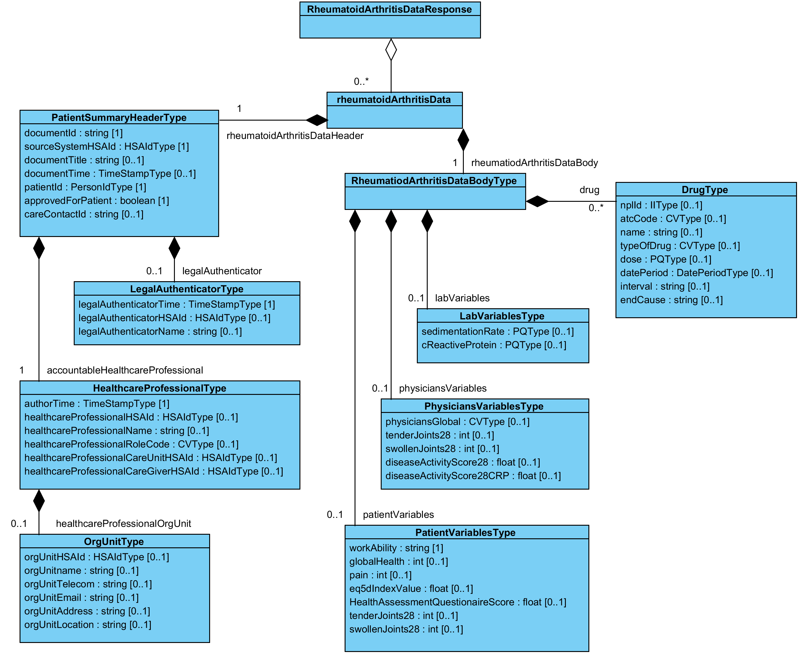

# 5 Tjänstedomänens meddelandemodeller - clinicalprocess: healthcond: rheuma — Reumatismdata v1.0.0

* [**Table of Contents**](toc.md)
* **5 Tjänstedomänens meddelandemodeller**

## 5 Tjänstedomänens meddelandemodeller

## Tjänstedomänens meddelandemodeller

> I källdokumentet är detta kapitel 6 och gemensamma informationskomponenter kapitel 5. Här följer IG:n mallens ordning.

Här beskrivs de meddelandemodeller som tjänstekontrakten bygger på. För varje meddelandemodell beskrivs hur mappning ser ut delvis mot V-TIM, här version 2.2 samt mot schema (XSD) för tjänstekontrakt.

### V-MIM Reumatismdata

 **V-MIM Reumatismdata**

| | | |
| :--- | :--- | :--- |
| rheumatoidArthritisData | Saknar motsvarighet i V-TIM 2.2 |   |
| RheumatoidArthritisDataHeader.documentId | Saknar motsvarighet i V-TIM 2.2 | rheumatoidArthritisData/RheumatoidArthritisDataHeader/documentId |
| RheumatoidArthritisDataHeader.sourceSystemHSAId | Saknar motsvarighet i V-TIM 2.2 | rheumatoidArthritisData/RheumatoidArthritisDataHeader/sourceSystemHSAId |
| RheumatoidArthritisDataHeader.patientId | Patient.person-id | rheumatoidArthritisData/RheumatoidArthritisDataHeader/patientId |
| rheumatoidArthritisDataHeader.accountableHealthcareProfessional | Saknar motsvarighet i V-TIM 2.2 | rheumatoidArthritisData/RheumatoidArthritisDataHeader/accountableHealthcareProfessional |
| AccountableHealthcareProfessional.authorTime | Saknar motsvarighet i V-TIM 2.2 | rheumatoidArthritisData/rheumatoidArthritisDataHeader/ accountableHealthcareProfessional /authorTime |
| AccountableHealthcareProfessional.healthcareProfessionalHSAId | Vård- och omsorgsutövare.personal id | rheumatoidArthritisData/rheumatoidArthritisDataHeader/accountableHealthcareProfessional/healthcareProfessionalHSAId |
| AccountableHealthcareProfessional.healthcareProfessionalName | Vård- och omsorgsutövare.personal namn | rheumatoidArthritisData/RheumatoidArthritisDataHeader/AccountableHealthcareProfessional/healthcareProfessionalName |
| AccountableHealthcareProfessional.healthcareProfessionalRoleCode | Saknar motsvarighet i V-TIM 2.2 | rheumatoidArthritisData/RheumatoidArthritisDataHeader/AccountableHealthcareProfessional/healthcareProfessionalRoleCode |
| HealthcareProfessionalOrgUnit.orgUnitHSAId | Vård- och omsorgsutövare.enhet id | rheumatoidArthritisData/RheumatoidArthritisDataHeader/AccountableHealthcareProfessional/HealthcareProfessionalOrgUnit/orgUnitHSAId |
| HealthcareProfessionalOrgUnit.orgUnitname | Vård- och omsorgsutövare.enhet namn | rheumatoidArthritisData/RheumatoidArthritisDataHeader/AccountableHealthcareProfessional/HealthcareProfessionalOrgUnit/orgUnitname |
| HealthcareProfessionalOrgUnit.orgUnitTelecom | Tele och eKommunikation.tele ekom adress | rheumatoidArthritisData/RheumatoidArthritisDataHeader/AccountableHealthcareProfessional/HealthcareProfessionalOrgUnit/orgUnitTelecom |
| HealthcareProfessionalOrgUnit.orgUnitEmail | Tele och eKommunikation.tele ekom adress | rheumatoidArthritisData/RheumatoidArthritisDataHeader/AccountableHealthcareProfessional/HealthcareProfessionalOrgUnit/orgUnitEmail |
| HealthcareProfessionalOrgUnit.orgUnitAddress | Adress.adress 1, / Adress.postnummer & / Adress.postort | rheumatoidArthritisData/RheumatoidArthritisDataHeader/AccountableHealthcareProfessional/HealthcareProfessionalOrgUnit/orgUnitAddress |
| HealthcareProfessionalOrgUnit.orgUnitLocation | Saknar motsvarighet i V-TIM 2.2 | rheumatoidArthritisData/RheumatoidArthritisDataHeader/AccountableHealthcareProfessional/HealthcareProfessionalOrgUnit/orgUnitLocation |
| AccountableHealthcareProfessional.healthcareProfessionalCareUnitHSAId | Informationsresurs.vårdenhet id | rheumatoidArthritisData/RheumatoidArthritisDataHeader/AccountableHealthcareProfessional/healthcareProfessionalCareUnitHSAId |
| AccountableHealthcareProfessional.healthcareProfessionalCareGiverHSAId | Informationsresurs.vårdgivare id | rheumatoidArthritisData/RheumatoidArthritisDataHeader/AccountableHealthcareProfessional/healthcareProfessionalCareGiverHSAId |
| LegalAuthenticator.legalAuthenticatorTime | Saknar motsvarighet i V-TIM 2.2 | rheumatoidArthritisData/RheumatoidArthritisDataHeader/LegalAuthenticator/legalAuthenticatorTime |
| LegalAuthenticator.legalAuthenticatorHSAId | Vård- och omsorgsutövare.personal id | rheumatoidArthritisData/RheumatoidArthritisDataHeader/LegalAuthenticator/legalAuthenticatorHSAId |
| LegalAuthenticator.legalAuthenticatorName | Vård- och omsorgsutövare.personal namn | rheumatoidArthritisData/RheumatoidArthritisDataHeader/ |
| RheumatoidArthritisDataHeader.approvedForPatient | Saknar motsvarighet i V-TIM 2.2 | rheumatoidArthritisData/RheumatoidArthritisDataHeader/approvedForPatient |
| RheumatoidArthritisDataHeader.careContactId | Informationsresurs.kontakt id | rheumatoidArthritisData/RheumatoidArthritisDataHeader/careContactId |
| rheumatoidArthritisDataBody | Saknar motsvarighet i V-TIM 2.2 |   |
| Drug.nplId | Specifikation läkemedel.specifikation läkemedel_id | rheumatoidArthritisData/rheumatoidArthritisDataBody/Drug/nplId |
| Drug.atcCode | Saknar motsvarighet i V-TIM 2.2 | rheumatoidArthritisData/rheumatoidArthritisDataBody/Drug/atcCode |
| Drug.name | Specifikation läkemedel.varumärke namn | rheumatoidArthritisData/rheumatoidArthritisDataBody/ |
| Drug.OfDrug | Läkemedelsform.läkemedelsform | rheumatoidArthritisData/rheumatoidArthritisDataBody/Drug/name |
| Drug.dose | Dosspecifikation.kvantitet | rheumatoidArthritisData/rheumatoidArthritisDataBody/Drug/dose |
| Drug.datePeriod | Sammansatta format.Dosering.starttidpunkt & / Sammansatta format.Dosering.sluttidpunkt | rheumatoidArthritisData/rheumatoidArthritisDataBody/Drug/datePeriod |
| Drug.interval | Dosspecifikation.frekvens | rheumatoidArthritisData/rheumatoidArthritisDataBody/Drug/interval |
| Drug.endCause | Saknar motsvarighet i V-TIM 2.2 | rheumatoidArthritisData/rheumatoidArthritisDataBody/Drug/endCause |
| LabVariables.sedimentationRate | Observerat uppfattat tillstånd Värde.enhet / & / Observerat uppfattat tillstånd Värde.värde | rheumatoidArthritisData/rheumatoidArthritisDataBody/LabVariables/sedimentationRate |
| LabVariables.cReactiveProtein | Observerat uppfattat tillstånd Värde.enhet / & / Observerat uppfattat tillstånd Värde.värde | rheumatoidArthritisData/rheumatoidArthritisDataBody/LabVariables/cReactiveProtein |
| PhysiciansVariables.physiciansGlobal | Bedömt tillstånd Svårighetsgrad.svårighetsgrad | rheumatoidArthritisData/rheumatoidArthritisDataBody/PhysiciansVariables/physiciansGlobal |
| PhysiciansVariables.tenderJoints28 | Observerat uppfattat tillstånd Värde.värde | rheumatoidArthritisData/rheumatoidArthritisDataBody/PhysiciansVariables/tenderJoints28 |
| PhysiciansVariables.swollenJoints28 | Observerat uppfattat tillstånd Värde.värde | rheumatoidArthritisData/rheumatoidArthritisDataBody/PhysiciansVariables/swollenJoints28 |
| PhysiciansVariables.diseaseActivityScore28 | Saknar motsvarighet i V-TIM 2.2 | rheumatoidArthritisData/rheumatoidArthritisDataBody/PhysiciansVariables/diseaseActivityScore28 |
| PhysiciansVariables.diseaseActivityScore28RCP | Saknar motsvarighet i V-TIM 2.2 | rheumatoidArthritisData/rheumatoidArthritisDataBody/PhysiciansVariables/diseaseActivityScore28RCP |
| PatientVariables.workAbility | Saknar motsvarighet i V-TIM 2.2 | rheumatoidArthritisData/rheumatoidArthritisDataBody/PatientVariables/workAbility |
| PatientVariables.globalHealth | Observerat uppfattat tillstånd Observation Uppfattning.observation uppfattning | rheumatoidArthritisData/rheumatoidArthritisDataBody/PatientVariables/globalHealth |
| PatientVariables.pain | Observerat uppfattat tillstånd Observation Uppfattning.observation uppfattning | rheumatoidArthritisData/rheumatoidArthritisDataBody/PatientVariables/pain |
| PatientVariables.eq5IndexValue | Saknar motsvarighet i V-TIM 2.2 | rheumatoidArthritisData/rheumatoidArthritisDataBody/PatientVariables/eq5IndexValue |
| PatientVariables.HealthAssessmentQuestionnaireScore | Saknar motsvarighet i V-TIM 2.2 | rheumatoidArthritisData/rheumatoidArthritisDataBody/PatientVariables/HealthAssessmentQuestionaireScore |
| PatientVariables.tenderJoints28 | Observerat uppfattat tillstånd Värde.värde | rheumatoidArthritisData/rheumatoidArthritisDataBody/PatientVariables/tenderJoints28 |
| PatientVariables.swollenJoints28 | Observerat uppfattat tillstånd Värde.värde | rheumatoidArthritisData/rheumatoidArthritisDataBody/PatientVariables/swollenJoints28 |

