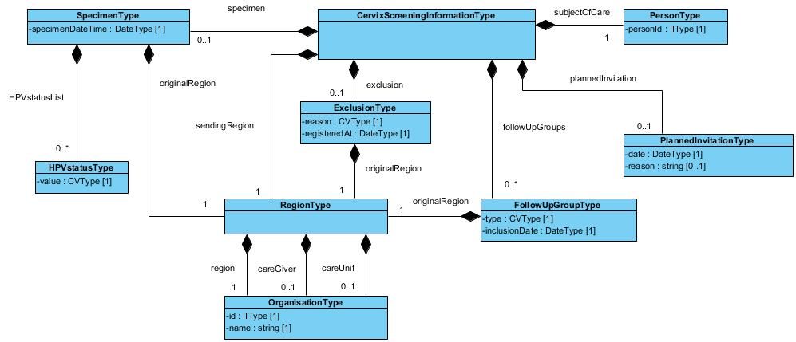

# 5 Tjänstedomänens meddelandemodeller - clinicalprocess: logistics: cervixscreening v1.0.0-rc4

* [**Table of Contents**](toc.md)
* **5 Tjänstedomänens meddelandemodeller**

## 5 Tjänstedomänens meddelandemodeller

# 5 Tjänstedomänens meddelandemodeller

Källa: **Tjänstekontraktsbeskrivning, Screeningstöd livmoderhals**, version 1.0_RC4 (2020-12-09), [TKB_clinicalprocess_logistics_cervixscreening.docx](TKB_clinicalprocess_logistics_cervixscreening.docx).

Här beskrivs de meddelandemodeller som tjänstekontrakten bygger på. För beskrivning av begreppsmodell och informationsmodell se [R3].

### 5.1 V-MIM

#### 5.1.1 process:cervix:screening:information

Nedanstående bild visar schemat för meddelandemodellen.

| | |
| :--- | :--- |
| Cervixscreeninginformation | CervixScreeningInformationType |
| Klassen innehåller inga attribut | - |
| Kvinna | PersonType |
| person-id | Personid |
| Organisation | OrganisationType |
| Id | Id |
| Namn | Name |
| Uppföljningsgrupp | FollowUpGroupType |
| Typ | Type |
| inklusionsdatum | inclusionDate |
| Senaste provtagning | SpecimenCollectionType |
| Tid | specimenDate |
| HPV-status | HPVstatusType |
| värde | Value |
| Exkludering från kallelse | ExclusionType |
| Orsak | Reason |
| registreringsdatum | registratedAt |
| Individuellt kallelsedatum | PlannedInvitationType |
| kallelsedatum | date |
| orsak | reason |

### 5.2 Formatregler

#### 5.2.1 Format för datum

Datum anges alltid på formatet ”ÅÅÅÅMMDD”, vilket motsvarar den ISO 8601 och ISO 8824-kompatibla formatbeskrivningen ”YYYYMMDD”

#### 5.2.2 Format för tidpunkter

Tidpunkter anges alltid på formatet ”ÅÅÅÅMMDDttmmss”, vilket motsvarar den ISO 8601 och ISO 8824-kompatibla formatbeskrivningen ”YYYYMMDDhhmmss”.

#### 5.2.3 Tidszon för tidpunkter

Tidszon anges inte i meddelandeformaten. All information om datum och tidpunkter som utbyts via tjänsterna ska ange datum och tidpunkter i den tidszon som gäller/gällde i Sverige vid den tidpunkt som respektive datum- eller tidpunktsfält bär information om. Såväl tjänstekonsumenter som tjänsteproducenter skall med andra ord förutsätta att datum och tidpunkter som utbyts är i tidszonerna CET (svensk normaltid) respektive CEST (svensk normaltid med justering för sommartid).

#### 5.2.4 Format på personidentitet

Endast svenskt personnummer på formatet ÅÅÅÅMMDDNNNN är tillåtet.

