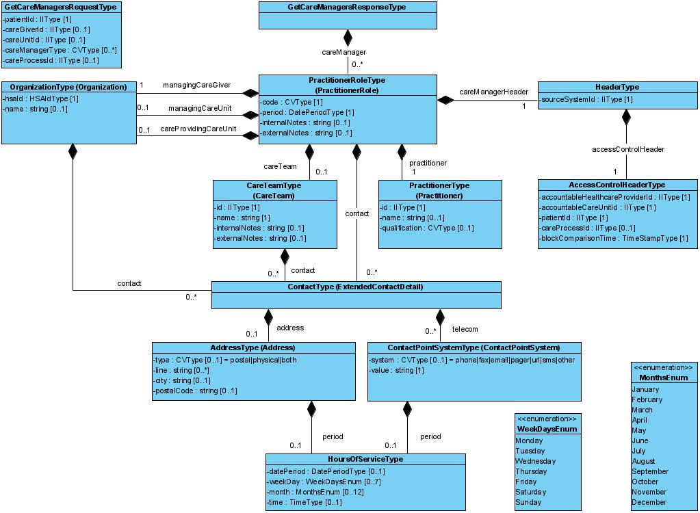

# 5 Tjänstedomänens meddelandemodeller - coreprocess: residentparticipation: residentparticipation v1.0.0-rc2

* [**Table of Contents**](toc.md)
* **5 Tjänstedomänens meddelandemodeller**

## 5 Tjänstedomänens meddelandemodeller

# 5 Tjänstedomänens meddelandemodeller

Källa: **Tjänstekontraktsbeskrivning för coreprocess: residentparticipation: residentparticipation**, version 1.0 RC2 (tagg 1.0_RC2, 2026-06-29), [TKB_coreprocess_residentparticipation_residentparticipation.docx](TKB_coreprocess_residentparticipation_residentparticipation.docx).

Här visas de modeller som beskriver informationsinnehållet i tjänstekontrakten inom tjänstedomänen samt en detaljerad beskrivning av modellernas datatyper. Flera av datatyperna återanvänds i olika relationer, i samma meddelandemodell.

Detaljerna för dessa datatyper beskrivs här i detta kapitel, var för sig, för att sedan refereras till under tjänstekontraktens attributbeskrivningar längre fram.

### 5.1 V-MIM



#### 5.1.1 HeaderType

Datatypen HeaderType är en generell gemensam datatyp som används för tjänstekontrakt/informationsmängder som faller under Sammanhållen vård- och omsorgsdokumentation (SVOD).

| | | | |
| :--- | :--- | :--- | :--- |
| sourceSystemId | IIType | Unik identitet för källsystemet som håller information om den fasta kontakten. Den unika identiteten kan exempelvis motsvara HSAId för SITHS funktion-certifikatet som källsystemet använder i sin kommunikation. | 1..1 |
| accessControlHeader | AccessControlHeaderType | Åtkomstgrundande information, se AccessControlHeader | 1..1 |

#### 5.1.2 AccessControlHeaderType

Datatypen AccesControlHeaderType är del av en generell gemensam datatyp som används för tjänstekontrakt/informationsmängder som faller under Sammanhållen vård- och omsorgsdokumentation (SVOD). Headern syftar till att bl a ge underlag för konsumenters följsamhet till eventuellt spärrade journaluppgifter.

| | | | |
| :--- | :--- | :--- | :--- |
| accountableHealthcareProviderId | IIType | Unik identitet för vårdgivaren som är personuppgiftsansvarig för informationen om den fasta kontakten. Den unika identiteten ska motsvara ett HSAId som utgör en vårdgivare i den nationella HSA-katalogen. / IIType.extension =`<HSAId för organisationen>`/ IIType.root = ”1.2.752.129.2.1.4.1” | 1..1 |
| accountableCareUnitId | IIType | Unik identitet för vårdenhet inom vårdgivare som är personuppgiftsansvarig och som håller informationen om den fasta kontakten. Den unika identiteten ska motsvara ett HSAId som utgör en vårdenhet i den nationella HSA-katalogen. / IIType.extension =`<HSAId för organisationen>`/ IIType.root = ”1.2.752.129.2.1.4.1” | 1..1 |
| patientId | IIType | Personnummer/samordningsnummer för patient som tilldelats den fasta kontakten. / Om källsystemet håller information om fasta kontakter, baserat på olika identifierare, exempelvis regionalt- eller nationellt reservnummer samt personnummer eller samordningsnummer, där identifierarna är sammanlänkade (utgör samma individ), ska källsystemet förmedla ett sammanställt svar. / IIType.extension =`<personnummer, samordningsnummer >`/ IIType.root: / Personnummer = ”1.2.752.129.2.1.3.1” / Samordningsnummer = ”1.2.752.129.2.1.3.3” | 1..1 |
| careProcessId | IIType | Referens till hälsoärende. / Socialstyrelsen definierar ett hälsoärende som ett ärende som håller samman vårddokumentation från en eller flera relaterade individanpassade vårdprocesser. / Attributet mappar gentemot FHIR resurs EpisodeOfCare. | 0..1 |
| blockComparisonTime | TimeStampType | Dokumentationstidpunkt (tidsstämpel) då journalföring skett. Tidsstämpeln utgör underlag för konsuments spärrkontroll. | 1..1 |

#### 5.1.3 PractitionerType

Datatypen PractitionerType håller information om den personal/medarbetare som innehar rollen fast kontakt alternativt en medlem i ett team som tillsammans utgör fast kontakt.

Datatypen mappar gentemot FHIR Practitioner.

| | | | |
| :--- | :--- | :--- | :--- |
| id | IIType | HSAId eller personnummer för medarbetaren som innehar rollen fast kontakt. Om HsaId för medarbetaren finns ska detta förmedlas i första hand. / IIType.extension =`<HSAId för personal/medarbetare>`/ IIType.root = ”1.2.752.129.2.1.4.1” / För personnummer ska Skatteverkets identifierare för personnummer ”1.2.752.129.2.1.3.1” användas i IIType.extension. / Det är producentens ansvar att säkerställa huruvida en konsumerande tjänst ska delges information om medarbetare som innehar rollen fast kontakt och som har skyddade personuppgifter. | 1..1 |
| name | string | Medarbetares namn | 0..1 |
| qualification | CVType | Medarbetares befattning enligt HSA-kodverk KV_Befattning. Se referens [R10]. / OID: 1.2.752.129.2.2.1.4 | 0..1 |

#### 5.1.4 ContactType

Datatypen ContactType håller information om de olika kontaktvägar som finns för att kontakta antingen en vårdande enhet eller en fast kontakt. Information om kontaktvägar kan, enligt tjänstekontraktet GetCareManagers’ meddelandeinformationsmodell, förmedlas kopplat till olika datatyper:

* Kontaktväg för att nå en medarbetare i någon av sin(a) roll(er) (typ av fast kontakt)
* Kontaktväg för att nå ett team
* Kontaktväg för att nå den ansvariga vård- eller omsorgsgivaren (organisationen)
* Kontaktväg för att nå den ansvariga vård- eller omsorgsenheten (organisationen)
* Kontaktväg för att nå den vårdutförande vård- eller omsorgsenheten (organisationen)

Det är frivilligt att förmedla kontaktväg(ar) kopplat till samtliga ovan nämnda datatyper, dock bör det förmedlas en kontaktväg på minst en nivå i svaret.

Datatypen mappar gentemot FHIR ExtendedContactDetail.

| | | | |
| :--- | :--- | :--- | :--- |
| telecom | ContactPointSystemType | Sätt/kanal för kontakt | 0..* |
| address | AddressType | Postadress | 0..1 |

#### 5.1.5 AddressType

Datatypen AddressType (post- eller besöksadress) är en del av datatypen ContactType och innehåller adressinformation som kan vara kopplad till:

* Vård- eller omsorgsgivaren
* Vård- eller omsorgsenhet
* Vårdutförande enhet
* Den fasta kontakten
* Team som tillsammans utgör den fasta kontakten

Datatypen mappar mot FHIR Address.

| | | | |
| :--- | :--- | :--- | :--- |
| type | CVType | Typ av adress. / Kan inneha något av värdena: / postal|physical|both / OID: 2.16.840.1.113883.4.642.3.69 | 0..1 |
| line | string | Adressrad | 0..* |
| city | string | Stad / kommun | 0..1 |
| postalCode | string | Postnummer | 0..1 |
| period | HoursOfService | Anger tidsperiod som adressen är giltig. | 0..1 |

#### 5.1.6 ContactPointSystemType

Datatypen ContactPointSystemType håller information om de olika kontaktsätt som finns för att kontakta antingen en vårdande enhet eller en fast kontakt.

Datatypen mappar gentemot FHIR ContactPointSystem.

| | | | |
| :--- | :--- | :--- | :--- |
| system | CVType | Sätt/teknik för hur kontakten kan ske. / Kan vara en av följande: / [phone|fax|email|pager|url|sms|other] / OID: 2.16.840.1.113883.4.642.1.72 | 1..1 |
| value | string | Adressen som gäller enligt kontaktsättet. / Kan exempelvis vara ett telefon-, fax- eller sökare-nummer, alternativt en URL till en e-tjänst. | 0..1 |
| period | HoursOfServiceType | Kalendertid då kontaktsättet är giltigt. Kan exempelvis uttrycka att kontaktsättet endast gäller specifika veckodagar, specifika månader, specifik datumperiod. Se mer detaljer under kapitel 5.2 Formatregler | 0..* |

#### 5.1.7 PractitionerRoleType

Datatypen PractitionerRoleType förmedlar medarbetarens roll/roller, så som fast kontakt. En medarbetare kan inneha mer än en roll (typ av fast kontakt).

Datatypen mappar gentemot FHIR PractitionerRole.

| | | | |
| :--- | :--- | :--- | :--- |
| code | CVType | Typ av roll (typ av fast kontakt). Se kodverk enligt referens [R7]. / Observera att kodverk kan komma att kompletteras över tid vilket medför att nyttjare av tjänstekontraktet behöver vara förberedda på att nya koder kan tillkomma utan att versionen på tjänstekontraktet uppdateras | 1..1 |
| practitioner | PractitionerType | Medarbetaren som tilldelats denna roll, så som fast kontakt | 1..1 |
| period | DatePeriodType | Tidsintervall då medarbetarens roll gäller. | 1..1 |
| internalNotes | string | Intern kommentar kopplat till medarbetaren i denna roll. Kommentaren kan visas internt inom professionen. Ska ej tillgängliggöras till patient eller patients eventuella vårdnadshavare/ombud. | 0..1 |
| externalNotes | string | Kommentar kopplat till medarbetaren i denna roll. Kommentaren kan visas till patienten eller patients eventuella vårdnadshavare/ombud. | 0..1 |
| managingCareGiver | OrganizationType | Vård- eller omsorgsgivare som medarbetaren har sitt uppdrag i, kopplat till denna roll | 1..1 |
| managingCareUnit | OrganizationType | Vård- eller omsorgsenhet som medarbetaren har sitt uppdrag i, kopplat till denna roll | 0..1 |
| careProvidingCareUnit | OrganizationType | Vårdutförande enhet som medarbetaren har sitt uppdrag i, kopplat till denna roll | 0..1 |
| contact | ContactType | Kontaktväg(ar) till medarbetaren, kopplat till medarbetarens roll | 0..* |
| careTeam | CareTeamType | Team av medarbetare som tillsammans utgör fast kontak. / Om exempelvis ett (1) team utgörs av två medarbetare ska två instanser av PractitionerRoleType förmedlas, en för respektive medarbetare. | 0..1 |

#### 5.1.8 CareTeamType

Datatypen håller information om det team som utgör den fasta kontakten på den vårdande enheten. Teamet syftar till att tillgodose vårdens möjlighet att organisera sig i team kring en patient.

Datatypen mappar gentemot FHIR datatypen CareTeam.

| | | | |
| :--- | :--- | :--- | :--- |
| id | IIType | Unik identifierare för teamet | 1..1 |
| name | string | Teamets namn. | 1..1 |
| internalNotes | string | Intern kommentar kopplat till teamet. Kommentaren kan visas internt inom professionen. Ska ej tillgängliggöras till patient. | 0..1 |
| externalNotes | string | Kommentar kopplat till teamet. Kommentaren kan visas till patienten. | 0..1 |
| contact | ContactType | Kontaktväg(ar) till teamet | 0..* |

#### 5.1.9 OrganizationType

Datatypen håller information om den vårdande enheten som den fasta kontakten tillhör och kan vara den fysiska plats som patienten kan besöka. En vårdande enhet kan antingen vara en vård- och omsorgsgivare eller en vård- och omsorgsenhet (enligt SVOD).

Datatypen mappar gentemot FHIR Organization.

| | | | |
| :--- | :--- | :--- | :--- |
| hsaId | IIType | HSAId för organisationen. Organisationen kan antingen vara: / * vård- eller omsorgsgivare / * vård- eller omsorgsenhet / * vårdutförande enhet / IIType.extension =`<HSAId för organisationen>`/ IIType.root = ”1.2.752.129.2.1.4.1” | 1..1 |
| name | string | Organisationens namn. | 0..1 |

#### 5.1.10 Mappning gentemot FHIR

Följande datatyper är mappade gentemot FHIR’s resurser eller FHIR’s datatyper.

| | |
| :--- | :--- |
| PractitionerType | CareManager |
| CareTeamType | EpisodeOfCare.careTeam |
| PractitionerRoleType | PractitionerRole |
| EpisodeOfCareType | EpisodeOfCare |
| ContactPointSystemType | ContactPointSystem |
| AddressType | Address |
| ContactType | ExtendedContactDetail |

### 5.2 Formatregler

#### 5.2.1 HoursOfServiceType

Datatypen HoursOfServiceType har möjlighet att uttrycka kalenderperioder, så som exempelvis specifika veckodagar, specifika månader, specifika klockslag och/eller datumperiod. Datatypen används exempelvis för att visa på när en tjänst är tillgänglig eller vilka öppettider en verksamhet har. Datatypen består av fyra attribut:

* datePeriod - datumspann
* weekDay - veckodag(ar)
* month - månad(er)
* time – tidsspann

Samtliga 4 attribut är frivilliga att förmedla. Om mer än ett attribut förekommer så ska samtliga förekommande attribut gälla (AND-logik).

Exempel 1:

Verksamheten har öppettider på vardagar mellan 8:00 och 17:00:

```
<hoursOfService>
  <weekDay>Monday</weekDay>
  <weekDay>Tuesday</weekDay>
  <weekDay>Wednesday</weekDay>
  <weekDay>Thursday</weekDay>
  <weekDay>Friday</weekDay>
  <time>
    <start>080000</start>
    <end>170000</end>
  </time>
</hoursOfService>

```

Exempel 2:

Verksamheten har sommarstängt år under juli 2025:

```
<hoursOfService>
  <datePeriod>
    <end>20250630</end>
  </datePeriod>
  <datePeriod>
    <start>20250801</end>
  </datePeriod>
</hoursOfService>

```

Exempel 3:

Verksamheten har sommarstängt år under juli 2025, för övrigt öppet på vardagar mellan 8:00 och 17:00:

```
<hoursOfService>
  <datePeriod>
    <end>20250630</end>
  </datePeriod>
  <datePeriod>
    <start>20250801</end>
  </datePeriod>
  <weekDay>Monday</weekDay>
  <weekDay>Tuesday</weekDay>
  <weekDay>Wednesday</weekDay>
  <weekDay>Thursday</weekDay>
  <weekDay>Friday</weekDay>
  <time>
    <start>080000</start>
    <end>170000</end>
  </time>
</hoursOfService>

```

Exempel 4:

Verksamheten är tillgänglig endast under mars månad och under maj månad under 2025:

```
<hoursOfService>
  <datePeriod>
    <start>20250301</end>
    <end>20250331</end>
  </datePeriod>
</hoursOfService>
<hoursOfService>
  <datePeriod>
    <start>20250501</end>
    <end>20250531</end>
  </datePeriod>
</hoursOfService>

```

