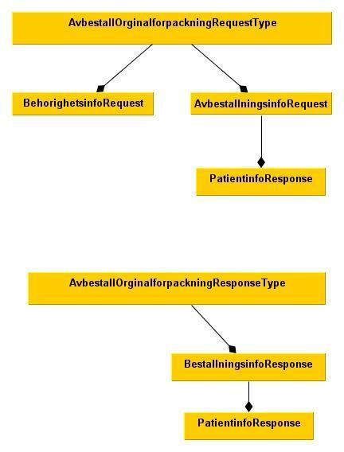
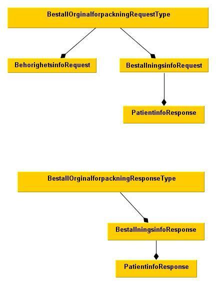
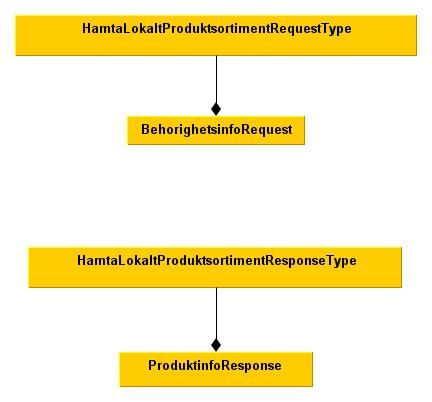
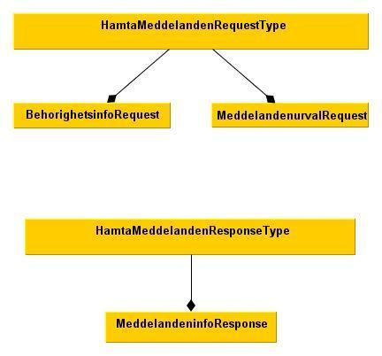
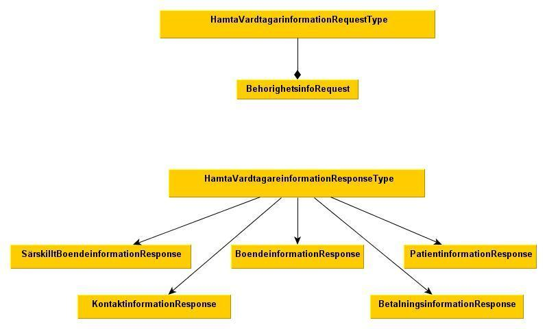
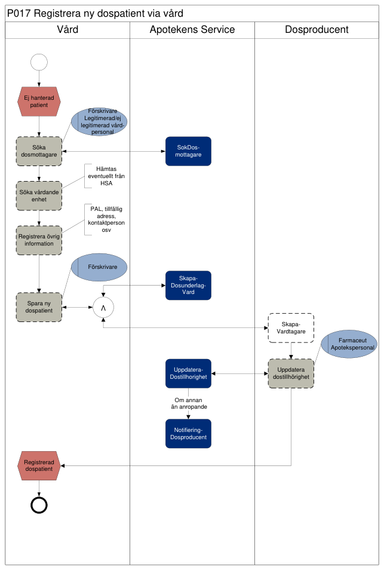
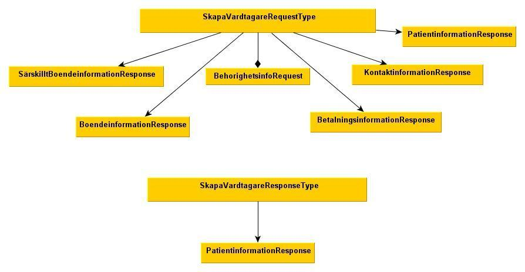
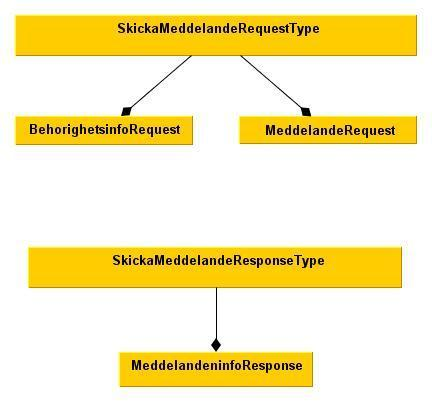
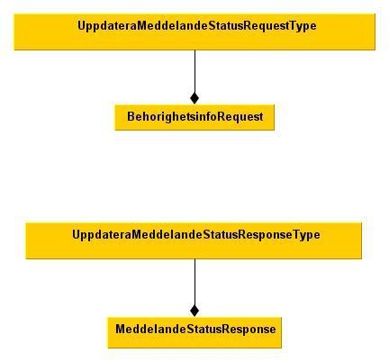
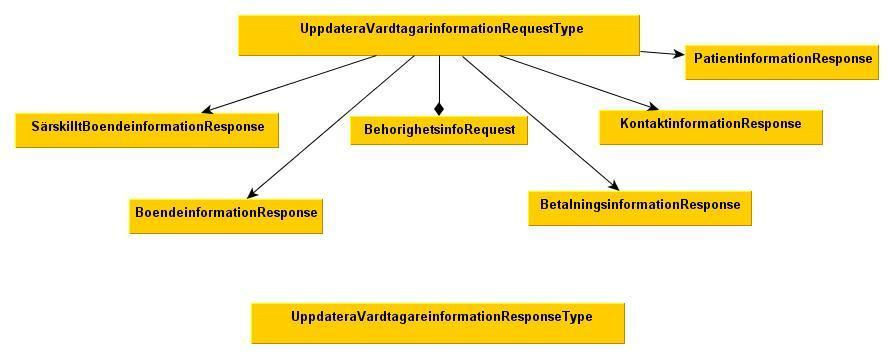

# 7 Tjänstekontrakt - druglogistics: dosedispensing — Dosdispensering v1.1.0

* [**Table of Contents**](toc.md)
* **7 Tjänstekontrakt**

## 7 Tjänstekontrakt

## Tjänstekontrakt

**SAKNAS I KÄLLDOKUMENT.** Det finns ingen TKB. För varje tjänstekontrakt återges i stället dess gränssnittsspecifikation (PDF), följt av fältreglerna ur schemat. Specifikationerna hänvisar till gemensamma objekt i ref[1], [Pascal – Objekt och felhantering](Objekt_och_felhantering.pdf), som återges i [avsnitt 4](4-tjanstedomanens-krav-och-regler.md) och [avsnitt 6](6-gemensamma-informationskomponenter.md). Alla kontrakt har SOAP-huvudet `LogicalAddress`. Fältnamnen i specifikationerna och i schemat skiljer sig ibland åt; schemat är normerande för de logiska modellerna.

### AvbestallOrginalforpackning

#### Version

1.0

| | |
| :--- | :--- |
| Namnrymd (tjänsteschema) | `urn:riv:druglogistics:dosedispensing:AvbestallOrginalforpackningResponder:1` |
| Namnrymd (WSDL) | `urn:riv:druglogistics:dosedispensing:AvbestallOrginalforpackning:1:rivtabp20` |
| SOAP-action | `urn:riv:druglogistics:dosedispensing:AvbestallOrginalforpackningResponder:1:AvbestallOrginalforpackning` |
| Interaktionstyp | Fråga-Svar |

#### Specifikation

Återgiven ur [AvbestallOrginalforpackning.pdf](AvbestallOrginalforpackning.pdf) (mekanisk konvertering från PDF; vid tveksamhet gäller PDF:en).

##### Avbeställ originalförpackning

Denna specifikation beskriver gränssnittet mellan vårdsystem och dosapotek för att avbeställa originalförpackning.

##### Definitioner och förkortningar

| | |
| :--- | :--- |
| Ordinationsid | Identitet för ordination i ordinationsregistret tilldelad av Apoteken Service |
| Beställningsid | Identitet för beställning tilldelad av dosproducenten |
| Radidentitet | Identitet för beställningsrad tilldelad av dosproducenten |
| GLN-kod | Identitet för dosapotek |
| Yrkeskod | Kod tilldelad yrkesgrupp i vården |

##### Verksamhetsregler

Vid avbeställning anges beställningsid samt radidentitet för de rader som ska avbeställas Patientidentitet ordinationsid och dosunderlagsversion valideras. Tjänsten returnerar samtliga ingående rader i beställningen med uppdaterad status (Mottagen, Avvisad, Expedierad, Avbeställd) En övergripande resultatkod med tillhörande meddelandetext och meddelandeid returneras.

##### Objektsbeskrivning

För detaljerad beskrivning av generella objekt, se dokument “Pascal – Objekt och felhantering.doc”. ref [1]

##### Fältbeskrivningar – Indata

| | | | | |
| :--- | :--- | :--- | :--- | :--- |
| Glnkod | Adresserat dosapotek | 13 | 1..1 |   |
| Behörighets information | Se ref [1] | Klass | 1..1 |   |
| Avbeställningsrader | Avbeställningsinfo |   | 1..* |   |
| Patientidentitet | Patientinformation, se ref[1] | Klass | 1..1 | Valideras |
| Beställningsid | UUID tilldelat vid beställning | 40 | 1..1 | Valideras |
| Radid | Unikt id för beställning och rad | 10 | 0..1 | Valideras |
| NPLPackId | Identitet på beställd förpackning | 16 | 0..1 | Valideras |
| Varunummer | Identitet på beställd förpackning | 8 | 0..1 | Valideras |
| Receptid | Identitet på recept | 40 | 0..1 | Valideras |
| OrdinationsId | Identitet på ordination | 20 | 1..1 | Valideras |
| Dosunderlagsversion | Underlag på dosrecept | 10 | 0..1 | Valideras |
| Meddelande | Meddelande till dosproducent | 1024 | 0..1 | Information |
| Önskad leveranstid |   | Kalender | 1..1 | Loggas |

##### Fältbeskrivningar – Utdata

| | | | | |
| :--- | :--- | :--- | :--- | :--- |
| Resultatkod | Resultat av samtliga avbeställningar | Kod | 1..1 | Valideras |
| Meddelandeid |   | Kod | 1..1 | Valideras |
| Meddelandetext |   | 80 | 1..1 | Loggas |
| Beställningsrader | BeställningsInfoResponse | Klass | 0..* |   |
| Beställningsid | UUID | 40 | 1..1 | Valideras |
| Radid | Unikt id för beställning och rad | 10 | 0..1 | Valideras |
| Patientidentitet | PatientinfoResponse, se ref [1] | Klass | 1..1 | Valideras |
| NPLPackId | Identitet på beställd förpackning | 16 | 0..1 | Valideras |
| Varunummer | Identitet på beställd förpackning | 8 | 0..1 | Valideras |
| ReceptId | Identitet på recept UUID | 40 | 0..1 | Valideras |
| OrdinationsId | Identitet på ordination | 20 | 1..1 | Valideras |
| Dosunderlagsversion |   | 10 | 0..1 | Valideras |
| Beställningsresultat | Resultat av avbeställning: Avbeställd eller Ej Avbeställd | Enum | 0..1 | Valideras |
| Beställningsstatus | Status på beställning | Enum | 0..1 | Valideras |
| Statustidpunkt |   | Kalender | 1..1 | Loggas |
| Beställningsstatustext |   | 256 | 0..1 | Loggas |
| Meddelande från dosapotek |   | 1024 | 0..1 | Loggas |
| Önskat leveranstid |   | Kalender | 0..1 | Loggas |
| Planerat leveranstid |   | Kalender | 0..1 | Loggas |
| Dosmottagaridentitet |   | 13 | 0..1 | Loggas |
| Dosmottagarnamn |   | 40 | 0..1 | Loggas |
| Beställnings tid |   | Kalender | 0..1 | Loggas |
| Beställares förnamn |   | 25 | 1..1 | Loggas |
| Beställares efternamn |   | 25 | 1..1 | Loggas |
| Beställares arbetsplats | Arbetsplats i klartext | 40 | 1..1 | Loggas |

#### Fältregler (XSD)

| | | | |
| :--- | :--- | :--- | :--- |
| **Begäran** |   |   |   |
| glnkod | string |   | 1..1 |
| Behorighetsinformation | BehorighetsinfoRequest |   | 1..1 |
| ../fornamn | string |   | 1..1 |
| ../efternamn | string |   | 1..1 |
| ../forskrivarkod | string |   | 0..1 |
| ../yrkeskod | YrkesKodEnum |   | 0..1 |
| ../arbetsplatskod | string |   | 1..1 |
| ../hsaid | string |   | 0..1 |
| ../personnummer | string |   | 0..1 |
| ../organisationsnummer | string |   | 0..1 |
| Avbestallningsinfo | AvbestallningsinfoRequest |   | 1..* |
| ../Patientinformation | PatientinfoResponse |   | 1..1 |
| ../../fornamn | string | Anvandarens fornamn. | 1..1 |
| ../../mellannamn | string | Anvandarens mellanamn. | 0..1 |
| ../../efternamn | string | Anvandarens efternamn. | 1..1 |
| ../../identitetstyp | IdentitetstypEnum |   | 1..1 |
| ../../personid | string | Anvandarens personid | 1..1 |
| ../../lanskod | string | Anvandarens folkbokforda lanskod | 0..1 |
| ../../kommunkod | string | Anvandarens folkbokforda kommunkod | 0..1 |
| ../bestallningsid | string |   | 1..1 |
| ../radid | string |   | 0..1 |
| ../NPLpackid | string |   | 0..1 |
| ../varunummer | string |   | 0..1 |
| ../receptid | string |   | 0..1 |
| ../ordinationsid | string |   | 1..1 |
| ../dosunderlagsversion | string |   | 0..1 |
| ../meddelandetillapotek | string |   | 0..1 |
| ../onskadleveranstid | dateTime |   | 0..1 |
| **Svar** |   |   |   |
| resultatkod | ResultatkodEnum |   | 1..1 |
| meddelandetext | string |   | 1..1 |
| meddelandeid | int |   | 1..1 |
| Bestallningsrader | BestallningsinfoResponse |   | 0..* |
| ../bestallningsid | string |   | 1..1 |
| ../radid | string |   | 0..1 |
| ../Patientinformation | PatientinfoResponse |   | 1..1 |
| ../../fornamn | string | Anvandarens fornamn. | 1..1 |
| ../../mellannamn | string | Anvandarens mellanamn. | 0..1 |
| ../../efternamn | string | Anvandarens efternamn. | 1..1 |
| ../../identitetstyp | IdentitetstypEnum |   | 1..1 |
| ../../personid | string | Anvandarens personid | 1..1 |
| ../../lanskod | string | Anvandarens folkbokforda lanskod | 0..1 |
| ../../kommunkod | string | Anvandarens folkbokforda kommunkod | 0..1 |
| ../NPLpackid | string |   | 0..1 |
| ../varunummer | string |   | 0..1 |
| ../receptid | string |   | 0..1 |
| ../ordinationsid | string |   | 1..1 |
| ../dosunderlagsversion | string |   | 0..1 |
| ../bestallningsresultat | int |   | 0..1 |
| ../bestallningsresultattext | string |   | 0..1 |
| ../bestallningsstatus | BestallningsStatusEnum |   | 1..1 |
| ../statustidpunkt | dateTime |   | 1..1 |
| ../bestallningstatustext | string |   | 0..1 |
| ../meddelandefranapotek | string |   | 0..1 |
| ../onskadleveranstid | dateTime |   | 0..1 |
| ../planeradleveranstid | dateTime |   | 0..1 |
| ../dosmottagareid | string |   | 0..1 |
| ../dosmottagarenamn | string |   | 0..1 |
| ../bestallningstid | dateTime |   | 0..1 |
| ../bestallarefornamn | string |   | 1..1 |
| ../bestallareefternamn | string |   | 1..1 |
| ../bestallarearbetsplats | string |   | 1..1 |

#### FHIR-artefakter

* [AvbestallOrginalforpackningRequest](StructureDefinition-avbestallorginalforpackning-request.md): logisk modell för begäran, inklusive SOAP-huvudena
* [AvbestallOrginalforpackning](StructureDefinition-avbestallorginalforpackning.md): logisk modell för svaret

#### Källfiler

| | |
| :--- | :--- |
| [AvbestallOrginalforpackningInteraction_1.0_RIVTABP20.wsdl](AvbestallOrginalforpackningInteraction_1.0_RIVTABP20.wsdl) | WSDL för tjänsteinteraktionen |
| [AvbestallOrginalforpackningResponder_1.0.xsd](AvbestallOrginalforpackningResponder_1.0.xsd) | Tjänsteschema |
| [AvbestallOrginalforpackning.pdf](AvbestallOrginalforpackning.pdf) | Gränssnittsspecifikation (PDF) |

### BestallOrginalforpackning

#### Version

1.0

| | |
| :--- | :--- |
| Namnrymd (tjänsteschema) | `urn:riv:druglogistics:dosedispensing:BestallOrginalforpackningResponder:1` |
| Namnrymd (WSDL) | `urn:riv:druglogistics:dosedispensing:BestallOrginalforpackning:1:rivtabp20` |
| SOAP-action | `urn:riv:druglogistics:dosedispensing:BestallOrginalforpackningResponder:1:BestallOrginalforpackning` |
| Interaktionstyp | Fråga-Svar |

#### Specifikation

Återgiven ur [BestallOrginalforpackning.pdf](BestallOrginalforpackning.pdf) (mekanisk konvertering från PDF; vid tveksamhet gäller PDF:en).

##### Beställ originalförpackning

Denna specifikation beskriver gränssnittet mellan vårdsystem och dosapotek för att beställa originalförpackning.

##### Dokumenthistorik

| | | | |
| :--- | :--- | :--- | :--- |
| 1.3 | 2011-10-05 | Jan Rozenbeek | Tidigare godkänd version |
| 1.4 | 2012-03-21 | Ronny Nordgren | Ändrat fältlängd på Dosmottagareid från 10 till 13 i Fältbeskrivningar – Utdata (Beställningrader) samt infört dokumenthistorik |

##### Definitioner och förkortningar

| | |
| :--- | :--- |
| Ordinationsid | Identitet för ordination i ordinationsregistret tilldelad av Apoteken Service |
| Beställningsid | Identitet för beställning tilldelad av beställare följer GUID format |
| Radidentitet | Identitet för beställningsrad tilldelad av dosproducenten |
| GLN-kod | Identitet för dosapotek |
| Yrkeskod | Kod tilldelad yrkesgrupp i vården |
| Dosunderlagversion | Version på dosrecept används för att säkerställa att korrekt underlag används |
| Receptid | Identitet som tilldelats e-recept |
| Dosmottagare | kundadress känd av dosproducenten till leverans ska ske , källa är EXPO, kan vara särskillt boende, vårdcentral, apotek eller dyl |

##### Verksamhetsregler

Beställning kan göras på NPLpackId eller varunummer.

Om en beställningsrad felar, misslyckas hela beställningen. En beställning kan ha följande tillstånd Mottagen – Validerad och godkänd av dosapoteket Avvisad – Validerad men ej godkänd av dosapoteket Avbeställd – Avbeställd av vårdpersonal Expedierad – Levererad till vård Beställningen ska innehålla antingen leveransadress till ordinärt eller särskilt boende, dvs. dosmottagare.

##### Objektsbeskrivning

För detaljerad beskrivning av generella objekt, se dokument “Pascal – Objekt och felhantering.doc”. ref[1]

##### Fältbeskrivningar – Indata

| | | | | |
| :--- | :--- | :--- | :--- | :--- |
| Glnkod | Adresserat dosapotek | 13 | 1..1 |   |
| Behörighetsinformation | Se ref[1] |   | 1..1 |   |
| Beställningsrader | BestallningsinfoRequest |   | 1..* |   |
| Patientidentiet | Patientinformation, se ref[1] | Klass | 1..1 | Valideras |
| Beställningsidentitet | Tilldelat id enligt UUID | 40 | 1..1 | Valideras |
| Radid | Identitet på rad | 10 | 0..1 | Valideras |
| NPLPackId | Identitet på beställd förpackning | 16 | 0..1 | Valideras |
| Varunummer | Identitet på beställd förpackning | 8 | 0..1 | Valideras |
| ReceptId | Identitet på recept | 40 | 0..1 | Loggas |
| OrdinationsId | Identitet på ordination | 20 | 1..1 | Valideras |
| Dosunderlagsversion |   | 10 | 0..1 | Valideras |
| Antal förpackningar |   | 10 | 1..1 | Valideras |
| Akutbeställning | Ja eller Nej | Enum | 0..1 | Valideras |
| Max veckodos |   | 10 | 0..1 | Valideras |
| Max dygnsdos |   | 10 | 0..1 | Valideras |
| Dosmottagares identitet |   | 13 | 1..1 | Valideras |
| Dosmottagare namn |   | 40 | 1..1 | Valideras |
| Meddelande | Meddelande till dosproducent | 1024 | 0..1 | Loggas |
| Önskat leveransdatum |   | Kalender | 0..1 | Valideras |

##### Fältbeskrivningar - Utdata

| | | | | |
| :--- | :--- | :--- | :--- | :--- |
| Resultatkod | Resultat av beställning | Kod | 1..1 | Valideras |
| Meddelandetext |   | 80 | 1..1 | Loggas |
| Meddelandeid |   | Enum | 1..1 | Valideras |
| Beställningrader |   |   | 0..* |   |
| Beställningsid | Tilldelat beställningsidentitet | GUID | 1..1 | Valideras |
| Radid | Tilldelat radidentitet | 10 | 0..1 | Valideras |
| Patientidentitet | Patientinformation, se ref[1] | Klass | 1..1 | Valideras |
| NPLPackid | Identitet på förpackning | 16 | 0..1 | Valideras |
| Varunummer | Identitet på förpackning | 8 | 0..1 | Valideras |
| Receptid | Identitet på recept | 40 | 0..1 | Valideras |
| Ordinationsid | Identitet på ordination | 20 | 1..1 | Valideras |
| Dosunderslagversion |   | 10 | 0..1 | Valideras |
| Beställningsresultat | Resultat av beställning | Kod | 0..1 | Valideras |
| Beställningsresultattext |   | 80 | 0..1 | Loggas |
| Beställningsstatus | Mottagen, Avvisad, Expedierad, Avbeställd | Enum | 1..1 | Valideras |
| Statustidpunkt |   | Kalender | 1..1 | Loggas |
| Beställningsstatustext |   | 256 | 1..1 | Loggas |
| Meddelande från apotek |   | 1024 | 0..1 | Loggas |
| Önskadleveranstid |   | Kalender | 0..1 | Loggas |
| Planeradleveranstid |   | Kalender | 0..1 | Loggas |
| Dosmottagareid |   | 13 | 0..1 | Loggas |
| Dosmottagarenamn |   | 256 | 0..1 | Loggas |
| Beställningstid |   | Kalender | 0..1 | Loggas |
| Beställare förnamn |   | 25 | 1..1 | Loggas |
| Beställare efternamn |   | 50 | 1..1 | Loggas |
| Beställare arbetsplats |   | 256 | 1..1 | Loggas |

#### Fältregler (XSD)

| | | | |
| :--- | :--- | :--- | :--- |
| **Begäran** |   |   |   |
| glnkod | string |   | 1..1 |
| Behorighetsinformation | BehorighetsinfoRequest |   | 1..1 |
| ../fornamn | string |   | 1..1 |
| ../efternamn | string |   | 1..1 |
| ../forskrivarkod | string |   | 0..1 |
| ../yrkeskod | YrkesKodEnum |   | 0..1 |
| ../arbetsplatskod | string |   | 1..1 |
| ../hsaid | string |   | 0..1 |
| ../personnummer | string |   | 0..1 |
| ../organisationsnummer | string |   | 0..1 |
| Bestallningsinfo | BestallningsinfoRequest |   | 1..* |
| ../Patientinformation | PatientinfoResponse |   | 1..1 |
| ../../fornamn | string | Anvandarens fornamn. | 1..1 |
| ../../mellannamn | string | Anvandarens mellanamn. | 0..1 |
| ../../efternamn | string | Anvandarens efternamn. | 1..1 |
| ../../identitetstyp | IdentitetstypEnum |   | 1..1 |
| ../../personid | string | Anvandarens personid | 1..1 |
| ../../lanskod | string | Anvandarens folkbokforda lanskod | 0..1 |
| ../../kommunkod | string | Anvandarens folkbokforda kommunkod | 0..1 |
| ../bestallningsid | string |   | 1..1 |
| ../radid | string |   | 0..1 |
| ../NPLpackid | string |   | 0..1 |
| ../varunummer | string |   | 0..1 |
| ../receptid | string |   | 0..1 |
| ../ordinationsid | string |   | 1..1 |
| ../dosunderlagsversion | string |   | 0..1 |
| ../antalforpackningar | string |   | 0..1 |
| ../akutbestallning | boolean |   | 0..1 |
| ../maxveckodos | string |   | 0..1 |
| ../maxdygnsdos | string |   | 0..1 |
| ../dosmottagareid | string |   | 0..1 |
| ../dosmottagarenamn | string |   | 0..1 |
| ../meddelandetillapotek | string |   | 0..1 |
| ../onskadleveransdatum | dateTime |   | 1..1 |
| **Svar** |   |   |   |
| resultatkod | ResultatkodEnum |   | 1..1 |
| meddelandetext | string |   | 1..1 |
| meddelandeid | int |   | 1..1 |
| Bestallningsrader | BestallningsinfoResponse |   | 0..* |
| ../bestallningsid | string |   | 1..1 |
| ../radid | string |   | 0..1 |
| ../Patientinformation | PatientinfoResponse |   | 1..1 |
| ../../fornamn | string | Anvandarens fornamn. | 1..1 |
| ../../mellannamn | string | Anvandarens mellanamn. | 0..1 |
| ../../efternamn | string | Anvandarens efternamn. | 1..1 |
| ../../identitetstyp | IdentitetstypEnum |   | 1..1 |
| ../../personid | string | Anvandarens personid | 1..1 |
| ../../lanskod | string | Anvandarens folkbokforda lanskod | 0..1 |
| ../../kommunkod | string | Anvandarens folkbokforda kommunkod | 0..1 |
| ../NPLpackid | string |   | 0..1 |
| ../varunummer | string |   | 0..1 |
| ../receptid | string |   | 0..1 |
| ../ordinationsid | string |   | 1..1 |
| ../dosunderlagsversion | string |   | 0..1 |
| ../bestallningsresultat | int |   | 0..1 |
| ../bestallningsresultattext | string |   | 0..1 |
| ../bestallningsstatus | BestallningsStatusEnum |   | 1..1 |
| ../statustidpunkt | dateTime |   | 1..1 |
| ../bestallningstatustext | string |   | 0..1 |
| ../meddelandefranapotek | string |   | 0..1 |
| ../onskadleveranstid | dateTime |   | 0..1 |
| ../planeradleveranstid | dateTime |   | 0..1 |
| ../dosmottagareid | string |   | 0..1 |
| ../dosmottagarenamn | string |   | 0..1 |
| ../bestallningstid | dateTime |   | 0..1 |
| ../bestallarefornamn | string |   | 1..1 |
| ../bestallareefternamn | string |   | 1..1 |
| ../bestallarearbetsplats | string |   | 1..1 |

#### FHIR-artefakter

* [BestallOrginalforpackningRequest](StructureDefinition-bestallorginalforpackning-request.md): logisk modell för begäran, inklusive SOAP-huvudena
* [BestallOrginalforpackning](StructureDefinition-bestallorginalforpackning.md): logisk modell för svaret

#### Källfiler

| | |
| :--- | :--- |
| [BestallOrginalforpackningInteraction_1.0_RIVTABP20.wsdl](BestallOrginalforpackningInteraction_1.0_RIVTABP20.wsdl) | WSDL för tjänsteinteraktionen |
| [BestallOrginalforpackningResponder_1.0.xsd](BestallOrginalforpackningResponder_1.0.xsd) | Tjänsteschema |
| [BestallOrginalforpackning.pdf](BestallOrginalforpackning.pdf) | Gränssnittsspecifikation (PDF) |

### HamtaLokaltProduktsortiment

#### Version

1.1

| | |
| :--- | :--- |
| Namnrymd (tjänsteschema) | `urn:riv:druglogistics:dosedispensing:HamtaLokaltProduktsortimentResponder:1` |
| Namnrymd (WSDL) | `urn:riv:druglogistics:dosedispensing:HamtaLokaltProduktsortiment:1:rivtabp20` |
| SOAP-action | `urn:riv:druglogistics:dosedispensing:HamtaLokaltProduktsortimentResponder:1:HamtaLokaltProduktsortiment` |
| Interaktionstyp | Fråga-Svar |

#### Specifikation

Återgiven ur [HamtaLokaltProduktsortiment.pdf](HamtaLokaltProduktsortiment.pdf) (mekanisk konvertering från PDF; vid tveksamhet gäller PDF:en).

##### Dokumentinformation

| | | | |
| :--- | :--- | :--- | :--- |
| 1.3 | 2011-10-05 | Beskriver version 1.0.1 | Jan Rozenbeek |
| 1.4 | 2013-09-02 | Beskriver version 1.1.0 Ny optionell inparameter ”landsting”. Mindre redaktionella ändringar. | Per Mützell |

##### Hämta lokalt produktsortiment

Denna specifikation beskriver gränssnittet mellan vårdsystem och dosapotek för att hämta det s k lokala produktsortimentet. Vården kan hämta ett specificerat dosapoteks egna dispenserbara produktsortiment. Detta sortiment styrs bl.a. av dosaktörens produktionsutrustning. Det är dosaktören som har definierat sitt sortiment. Vården behöver informationen t ex för att veta vilken produkt som bör förskrivas för att den ska kunna dispenseras av dosaktören som levererar till den aktuella dospatienten.

##### Versionsinformation

Version 1.0.0 / 1.0.1

Version 1.1.0 Ny optionell inparameter landsting för att kunna selektera produktsortimentet för dosapoteket kopplat till visst län via landstingskoden (även kallad länskoden). Ändringen är bakåt kompatibel med tidigare versionen av tjänstekontraktet: en tidigare tjänsteproducent fungerar med en nyare tjänstekonsument och vice versa. En tjänsteproducent som inte implementerar den nya versionen ska tyst ignorera den nya parametern

##### Verksamhetsregler

Det lokala sortimentet innehåller endast produkter som kan dispenseras.

##### Felhantering

En resultatkod (Information, Varning eller Fel) med tillhörande meddelandetext och identitet returneras.

##### Objektsbeskrivning

För detaljerad beskrivning av generella objekt, se dokument “Pascal – Objekt och felhantering.doc”.

##### Fältbeskrivningar - Indata

| | | | | |
| :--- | :--- | :--- | :--- | :--- |
| Glnkod | Adresserat dosapotek | 13 | 1..1 |   |
| Dosaktör | Namn på dosaktör Enbart för loggning | 20 | 1..1 |   |
| Landsting | Kod för län/region Länskod, även kallad landstingskod, är en tvåsiffrig kod för län i Sverige. Kan fås från Folkbokföringen kopplat till individen | 2 | 0..1 | Selekterar sortiment för länet/regionen om anges. Ignoreras av tjänsteproducent som inte stödjer attributet. |

##### Fältbeskrivningar – Utdata

| | | | | |
| :--- | :--- | :--- | :--- | :--- |
| Resultatkod |   | Enum: Information(1), Varning(2), Fel(3) | 1..1 | Valideras av konsument |
| Meddelandetext |   | 1-80 | 1..1 |   |
| Meddelandeid |   | integer | 1..1 |   |
| Dosaktör | Namn på dosaktör | 1-20 | 1..1 |   |
| Produktsortiment |   |   | 0..* |   |
| NPLid |   | 1-16 | 1..1 |   |
| NPLpackid |   | 1-16 | 1..1 |   |
| Glnkod |   | 13 | 0..* |   |

#### Fältregler (XSD)

| | | | |
| :--- | :--- | :--- | :--- |
| **Begäran** |   |   |   |
| glnkod | string |   | 1..1 |
| dosaktor | string |   | 1..1 |
| **Svar** |   |   |   |
| resultatkod | ResultatkodEnum |   | 1..1 |
| meddelandetext | string |   | 1..1 |
| meddelandeid | int |   | 1..1 |
| dosaktor | string |   | 1..1 |
| Produktsortiment | ProduktsortimentResponse |   | 0..* |
| ../nplid | string |   | 1..1 |
| ../nplpackid | string |   | 1..1 |
| ../glnkod | string |   | 0..* |

#### FHIR-artefakter

* [HamtaLokaltProduktsortimentRequest](StructureDefinition-hamtalokaltproduktsortiment-request.md): logisk modell för begäran, inklusive SOAP-huvudena
* [HamtaLokaltProduktsortiment](StructureDefinition-hamtalokaltproduktsortiment.md): logisk modell för svaret

#### Källfiler

| | |
| :--- | :--- |
| [HamtaLokaltProduktsortimentInteraction_1.0_RIVTABP20.wsdl](HamtaLokaltProduktsortimentInteraction_1.0_RIVTABP20.wsdl) | WSDL för tjänsteinteraktionen |
| [HamtaLokaltProduktsortimentInteraction_1.1_RIVTABP20.wsdl](HamtaLokaltProduktsortimentInteraction_1.1_RIVTABP20.wsdl) | WSDL för tjänsteinteraktionen |
| [HamtaLokaltProduktsortimentResponder_1.0.xsd](HamtaLokaltProduktsortimentResponder_1.0.xsd) | Tjänsteschema |
| [HamtaLokaltProduktsortimentResponder_1.1.xsd](HamtaLokaltProduktsortimentResponder_1.1.xsd) | Tjänsteschema |
| [HamtaLokaltProduktsortimentResponder_1.1_ext.xsd](HamtaLokaltProduktsortimentResponder_1.1_ext.xsd) | Tjänsteschema |
| [HamtaLokaltProduktsortiment.pdf](HamtaLokaltProduktsortiment.pdf) | Gränssnittsspecifikation (PDF) |

### HamtaMeddelanden

#### Version

1.0

| | |
| :--- | :--- |
| Namnrymd (tjänsteschema) | `urn:riv:druglogistics:dosedispensing:HamtaMeddelandenResponder:1` |
| Namnrymd (WSDL) | `urn:riv:druglogistics:dosedispensing:HamtaMeddelanden:1:rivtabp20` |
| SOAP-action | `urn:riv:druglogistics:dosedispensing:HamtaMeddelandenResponder:1:HamtaMeddelanden` |
| Interaktionstyp | Fråga-Svar |

#### Specifikation

Återgiven ur [HamtaMeddelanden.pdf](HamtaMeddelanden.pdf) (mekanisk konvertering från PDF; vid tveksamhet gäller PDF:en).

##### Hämta meddelanden

Denna specifikation beskriver gränssnittet mellan vårdsystem och dosapotek för att hämta meddelanden.

##### Dokumenthistorik

| | | | |
| :--- | :--- | :--- | :--- |
| 1.3 | 2011-10-05 | Jan Rozenbeek | Tidigare godkänd version |
| 1.4 | 2012-03-21 | Ronny Nordgren | Ändrat fältlängd på Sändare HSAid från 20 till 64 i Fältbeskrivningar – Utdata samt infört dokumenthistorik |
| 1.5 | 2012-03-27 | Jan Rozenbeek | Ändrat fältlängd till 64 för Vårdgivares personid - Indata |

##### Definitioner och förkortningar

| | |
| :--- | :--- |
| Ordinationsid | Identitet för ordination i ordinationsregistret tilldelad av Apoteken Service |
| GLN-kod | Identitet för dosapotek |
| Yrkeskod | Kod tilldelad yrkesgrupp i vården |
| Meddelandeid | Id tilldelat av dosapoteket för meddelandet |

##### Verksamhetsregler

Denna tjänst används endast av vårdpersonal när meddelande ska hämtas från det lokala dosapotekets register. Meddelanden kan ha skickats i båda riktningarna mellan vårdgivare och dosapotek.

Dosapoteket kan initiera kommunikationen antingen genom att ange förskrivares förskrivarkod som adressat, eller patientens personnummer. Gruppförskrivarkoder kan ej anges. Dosapoteket kan endast anges som mottagare om meddelande skickas till dosapotek. Utsökning görs på meddelandetyp och till och från tidpunkt. Utsökning av meddelanden görs enligt nedan

* Patientbundna – Samtliga meddelande kopplade till en patientidentitet (personnummer)
* Meddelandebundna – Samtliga meddelande som är kopplade till en meddelandeidentitet
* Ordinationsbundna – Samtliga meddelande kopplade till ordination (ordinationsidentitet)
* Avsändare – Samtliga meddelanden skickade från vårdtagare (personnummer) eller av dosapoteket adresserade meddelande till förskrivare.
* Fristående – Meddelanden skickade mellan vårdgivare och dosapotek

Vid utsökning kan även meddelandestatus ”Läst/Oläst” anges. Meddelanden som är markerade som ”Borttagna” returneras ej. Om inget till eller fråntidpunkt anges vid anrop hämtas samtliga meddelande som är kopplade till vårdtagare. Meddelande som skickats från Dosapoteket till vårdgivare baseras på vårdgivares personnummer. Meddelanden lagras i maximalt 15 månader. Dosaktören Apoteket AB kommer att hantera patientbundna och

##### Sökbegrepp

| | | | | | | | | | |
| :--- | :--- | :--- | :--- | :--- | :--- | :--- | :--- | :--- | :--- |
| Avsändare | JA | JA |   |   |   |   | JA | JA | JA |
| Meddelande |   |   | JA |   |   |   | JA | JA | JA |
| Ordination |   |   |   | JA |   |   | JA | JA | JA |
| Fristående |   |   |   |   | JA |   | JA | JA | JA |
| Personbundet |   |   |   |   |   | JA | JA | JA | JA |

##### Gruppförskrivarkoder

9000001 - Examinerad läkare som gör AT (AT-läkare)

9100009 - Examinerad läkare som saknar svensk legitimation och innehar vikariat

9200007 - Medicine studerande som innehar vikariat

9300005 - Examinerade nordiska läkare utan svensk legitimation

9400003 - Examinerade utomnordiska läkare utan svensk legitimation

9600008 - Diabetessköterskor

9610007 - Stomisköterskor

##### Objektsbeskrivning

För detaljerad beskrivning av generella objekt, se dokument “Pascal – Objekt och felhantering.doc”.

##### Fältbeskrivningar - Indata

| | | | | |
| :--- | :--- | :--- | :--- | :--- |
| Glnkod | Adresserat dosapotek | 13 | 1..1 |   |
| Behörighetsinformation | Ss ref[1] | Klass | 1..1 |   |
| Meddelande urval |   | Klass | 1..1 |   |
| Meddelandetyp | Patientbunden Ordinationsbunden Fristående Meddelandebunden Avsändarbundet | Enum | 1..1 | Valideras |
| Patientinformation | PatientinfoResponse, se ref[1] | Klass | 0..1 | Valideras |
| Meddelandeid | Obligatoriskt om meddelandetyp MeddelandeId | 10 | 0..1 | Valideras |
| Meddelande status | Läst Oläst Borttaget Alla | Enum | 1..1 | Valideras |
| Ordinationsid |   | 10 | 0..1 | Valideras |
| Vårdgivares personid | Obligatoriskt om meddelandetyp Avsändare HSAid | 64 | 0..1 | Valideras |
| Vårdgivares förskrivarkod | Obligatoriskt om meddelandetyp Avsändare | 7 | 0..1 | Valideras |
| Fråntidpunkt | Sändningstidpunkt from | Kalender | 0..1 | Valideras |
| Tilltidpunkt | Sändningtidpunkt Tom | Kalender | 0..1 | Valideras |

##### Fältbeskrivningar – Utdata

| | | | | |
| :--- | :--- | :--- | :--- | :--- |
| Resultatkod | Information, varning eller fel | Enum | 1..1 | Loggas |
| Meddelandeid |   | Kod | 1..1 | Loggas |
| Meddelandetext |   | 80 | 1..1 | Loggas |
| Meddelanden |   |   | 0..* |   |
| Meddelandeid |   | 10 | 1..1 |   |
| Patientinformation | PatientinfoResponse , se ref[1] | Klass | 0..1 | Loggas |
| Kommunikationsriktning | Från dosapotek eller Till dosapotek | Enum | 0..1 | Loggas |
| Tidigare meddelandeid |   | 10 | 0..1 | Loggas |
| Ordinationsid |   | 10 | 0..1 | Loggas |
| GLN-kod | Dosapotekets identitet | 13 | 0..1 | Loggas |
| Dosapotek namn | Dosapoteket namn | 40 | 0..1 | Loggas |
| Sändningstidpunkt |   | Kalender | 1..1 | Loggas |
| Sändare förnamn |   | 25 | 1..1 | Loggas |
| Sändare efternamn |   | 50 | 1..1 | Loggas |
| Sändare HSAid |   | 64 | 0..1 | loggas |
| Sändare yrkeskod |   | Enum | 0..1 | Loggas |
| Sändare arbetsplats |   | 40 | 1..1 | Loggas |
| Rubrik |   | 40 | 0..1 | Loggas |
| Prioritet | Hög, Normal eller Låg | Enum | 0..1 | Loggas |
| Meddelandestatus | Oläst eller Läst | Enum | 1..1 | Loggas |
| Meddelandestatus förnamn |   | 25 | 1..1 | Loggas |
| Meddelandestatus efternamn |   | 25 | 1..1 | Loggas |
| Meddelandestatus arbetsplats |   | 40 | 1..1 | Loggas |
| Meddelandestatus tidpunkt |   | Kalender | 1..1 | Loggas |
| Meddelande |   | 1024 | 1..1 | Loggas |

#### Fältregler (XSD)

| | | | |
| :--- | :--- | :--- | :--- |
| **Begäran** |   |   |   |
| glnkod | string |   | 1..1 |
| Behorighetsinformation | BehorighetsinfoRequest |   | 1..1 |
| ../fornamn | string |   | 1..1 |
| ../efternamn | string |   | 1..1 |
| ../forskrivarkod | string |   | 0..1 |
| ../yrkeskod | YrkesKodEnum |   | 0..1 |
| ../arbetsplatskod | string |   | 1..1 |
| ../hsaid | string |   | 0..1 |
| ../personnummer | string |   | 0..1 |
| ../organisationsnummer | string |   | 0..1 |
| Meddelandenutval | MeddelandenutvalRequest |   | 1..1 |
| ../Meddelandetyp | MeddelandetypEnum |   | 1..1 |
| ../Patientinformation | PatientinfoResponse |   | 0..1 |
| ../../fornamn | string | Anvandarens fornamn. | 1..1 |
| ../../mellannamn | string | Anvandarens mellanamn. | 0..1 |
| ../../efternamn | string | Anvandarens efternamn. | 1..1 |
| ../../identitetstyp | IdentitetstypEnum |   | 1..1 |
| ../../personid | string | Anvandarens personid | 1..1 |
| ../../lanskod | string | Anvandarens folkbokforda lanskod | 0..1 |
| ../../kommunkod | string | Anvandarens folkbokforda kommunkod | 0..1 |
| ../meddelandeid | string |   | 0..1 |
| ../meddelandestatus | MeddelandeStatusEnum |   | 0..1 |
| ../ordinationsid | string |   | 0..1 |
| ../vardgivarespersonid | string |   | 0..1 |
| ../forskrivarkod | string |   | 0..1 |
| ../frantid | dateTime |   | 0..1 |
| ../tilltid | dateTime |   | 0..1 |
| **Svar** |   |   |   |
| resultatkod | ResultatkodEnum |   | 1..1 |
| meddelandetext | string |   | 1..1 |
| meddelandeid | int |   | 1..1 |
| Meddelanden | HamtaMeddelandeninfoResponse |   | 0..* |
| ../meddelandeid | string |   | 1..1 |
| ../Patientinformation | PatientinfoResponse |   | 0..1 |
| ../../fornamn | string | Anvandarens fornamn. | 1..1 |
| ../../mellannamn | string | Anvandarens mellanamn. | 0..1 |
| ../../efternamn | string | Anvandarens efternamn. | 1..1 |
| ../../identitetstyp | IdentitetstypEnum |   | 1..1 |
| ../../personid | string | Anvandarens personid | 1..1 |
| ../../lanskod | string | Anvandarens folkbokforda lanskod | 0..1 |
| ../../kommunkod | string | Anvandarens folkbokforda kommunkod | 0..1 |
| ../kommunikationsriktning | KommunikationsriktningEnum |   | 0..1 |
| ../tidigaremeddelandeid | string |   | 0..1 |
| ../ordinationsid | string |   | 0..1 |
| ../glnkod | string |   | 0..1 |
| ../dosapoteknamn | string |   | 0..1 |
| ../sandningstidpunkt | dateTime |   | 1..1 |
| ../sandarefornamn | string |   | 1..1 |
| ../sandareefternamn | string |   | 1..1 |
| ../sandarehsaid | string |   | 0..1 |
| ../sandareyrkeskod | YrkesKodEnum |   | 0..1 |
| ../sandarearbetsplats | string |   | 0..1 |
| ../rubrik | string |   | 0..1 |
| ../prioritet | MeddelandePrioritetEnum |   | 0..1 |
| ../meddelandestatus | MeddelandeStatusEnum |   | 1..1 |
| ../meddelandestatusfornamn | string |   | 1..1 |
| ../meddelandestatusefternamn | string |   | 1..1 |
| ../meddelandestatusarbetsplats | string |   | 1..1 |
| ../statustidpunkt | dateTime |   | 1..1 |
| ../meddelande | string |   | 1..1 |

#### FHIR-artefakter

* [HamtaMeddelandenRequest](StructureDefinition-hamtameddelanden-request.md): logisk modell för begäran, inklusive SOAP-huvudena
* [HamtaMeddelanden](StructureDefinition-hamtameddelanden.md): logisk modell för svaret

#### Källfiler

| | |
| :--- | :--- |
| [HamtaMeddelandenInteraction_1.0_RIVTABP20.wsdl](HamtaMeddelandenInteraction_1.0_RIVTABP20.wsdl) | WSDL för tjänsteinteraktionen |
| [HamtaMeddelandenResponder_1.0.xsd](HamtaMeddelandenResponder_1.0.xsd) | Tjänsteschema |
| [HamtaMeddelanden.pdf](HamtaMeddelanden.pdf) | Gränssnittsspecifikation (PDF) |

### HamtaOrginalforpackning

#### Version

1.0

| | |
| :--- | :--- |
| Namnrymd (tjänsteschema) | `urn:riv:druglogistics:dosedispensing:HamtaOrginalforpackningResponder:1` |
| Namnrymd (WSDL) | `urn:riv:druglogistics:dosedispensing:HamtaOrginalforpackning:1:rivtabp20` |
| SOAP-action | `urn:riv:druglogistics:dosedispensing:HamtaOrginalforpackningResponder:1:HamtaOrginalforpackning` |
| Interaktionstyp | Fråga-Svar |

#### Specifikation

Återgiven ur [HamtaOrginalforpackning.pdf](HamtaOrginalforpackning.pdf) (mekanisk konvertering från PDF; vid tveksamhet gäller PDF:en).

##### Hämta beställningar

Denna specifikation beskriver gränssnittet mellan vårdsystem och dosapotek för att hämta beställningar av originalförpackning.

##### Definitioner och förkortningar

| | |
| :--- | :--- |
| Ordinationsid | Identitet för ordination i ordinationsregistret tilldelad av Apoteken Service |
| Beställningsid | Identitet för beställning tilldelad av beställare |
| Radidentitet | Identitet för beställningsrad tilldelad av dosproducenten |
| GLN-kod | Identitet för dosapotek |
| Yrkeskod | Kod tilldelad yrkesgrupp i vården |
| Dosmottagare | kundadress känd av dosproducenten till leverans ska ske, kan vara Vårdcentral, boende, apotek mm |

##### Verksamhetsregler

Utsökning kan göras baserat på nedan sökbegrepp

* Patientidentitet (personnummer)
* Dosmottagare (dosmottagaridentitet)
* Beställning (beställningsidentitet)
* Beställare (Vårdgivares personnummer)

Endast ett sökbegrepp kan anges. Om utsökningskriterier överskrider maxgränsen skall inga rader returneras endast en felkod och felmeddelande att sökbegreppet måste minskas. Vid utsökning på dosmottagare eller beställning kan en eller flera identiteter anges. Vid utsökning kan beställningens status anges, om ingen status anges returneras samtliga beställningar oavsett status. Om inga till eller från datum anges i utsökning, kan max antal träffas överskridas. Detta ska då framgå i övergripande resultatkod och resultattext, inga beställningsrader ska returneras. Max antal träffar definieras av dosapoteket. En resultatkod (Information, varning eller fel) med tillhörande meddelandetext och identitet returneras:

Sökbegrepp

| | | | | | | | |
| :--- | :--- | :--- | :--- | :--- | :--- | :--- | :--- |
| Patient | JA |   |   |   | JA | JA | JA |
| Dosmottagare |   | JA (en eller flera) |   |   | JA | JA | JA |
| Beställning |   |   | JA (en eller flera) |   | JA | JA | JA |
| Vårdgivare Objektbeskrivning |   |   |   | JA | JA | JA | JA |

För detaljerad beskrivning av generella objekt, se dokument “Pascal – Objekt och felhantering.doc”. ref[1]

##### Fältbeskrivningar - Indata

| | | | | |
| :--- | :--- | :--- | :--- | :--- |
| Glnkod | Adresserat dosapotek | 13 | 1..1 |   |
| Behörighets information | Behorighetsinfo Request, se ref[1] |   | 1..1 |   |
| Beställningsurval |   | Klass | 1..1 |   |
| Beställningsurval | Endast ett begrepp kan anges, Patienturval Dosmottagar Beställning Beställare | Enum |   | Valideras |
| Beställningsid | UUID | 40 | 0..* | Valideras |
| Patientidentiet | Personnummer enligt format YYYYMMDDX XXX | 12 | 0..1 | Valideras |
| Typ av identitet | Person, samordning eller reservnummer | Enum | 0..1 | Valideras |
| Patient förnamn |   | 25 | 0..1 | Loggas |
| Patient efternamn |   | 25 | 0..1 | Loggas |
| Vårdgivares identitet | HSAid | 64 | 0..1 | Valideras |
| Dosmottagare id |   | 10 | 0..* | Valideras |
| Beställningsstatus | Mottagen, Avvisad, Expedierad, Avbeställd | Enum | 0..1 | Valideras |
| Fråndatum |   | Kalender | 1..1 | Valideras |
| Tilldatum |   | Kalender | 1..1 | Valideras |

##### Fältbeskrivningar - Utdata

| | | | | |
| :--- | :--- | :--- | :--- | :--- |
| Resultatkod | Information, varning eller fel | Enum | 1..1 | Valideras |
| Meddelandetext |   | 80 | 1..1 | Loggas |
| Meddelandeid |   | Kod | 1..1 | Valideras |
| Beställningsrader |   | Klass | 0..* |   |
| Bestallningsidentitet |   | GUID | 1..1 | Valideras |
| Radid |   | 10 | 0..1 | Valideras |
| Patientidentiet | Patientinformation, se ref[1] | Klass | 1..1 | Valideras |
| Nplpackid |   | 16 | 0..1 | Valideras |
| Varunummer |   | 8 | 0..1 | Valideras |
| Receptid |   | 10 | 0..1 |   |
| Ordinationsid |   | 20 | 1..1 | Valideras |
| Dosunderlagsversion |   | 10 | 0..1 | Loggas |
| Beställningsresultat |   | 10 | 0..1 | Loggas |
| Beställningsresultat text |   | 80 | 0..1 | Loggas |
| Beställningsstatus | Mottagen, Avvisad, Expedierad, Avbeställd | Enum | 1..1 | Valideras |
| Statustidpunkt |   | Kalender | 1..1 | Loggas |
| Beställningstatustext |   | 80 | 0..1 | Loggas |
| Meddelande | Meddelande från dosapoteket | 1024 | 0..1 | Loggas |
| Önskat leveranstid |   | Kalender | 1..1 | Valideras |
| Planerat leveranstid |   | Kalender | 0..1 | Valideras |
| Dosmottagareid |   | 13 | 0..1 | Valideras |
| Dosmottagare namn |   | 40 | 0..1 | Valideras |
| Beställningstid |   | Kalender | 0..1 | Valideras |
| Beställare förnamn |   | 25 | 1..1 | Loggas |
| Beställare efternamn |   | 50 | 1..1 | Loggas |
| Beställares arbetsplats | Beställares arbetsplats | 256 | 1..1 | Valideras |

#### Fältregler (XSD)

| | | | |
| :--- | :--- | :--- | :--- |
| **Begäran** |   |   |   |
| glnkod | string |   | 1..1 |
| Behorighetsinformation | BehorighetsinfoRequest |   | 1..1 |
| ../fornamn | string |   | 1..1 |
| ../efternamn | string |   | 1..1 |
| ../forskrivarkod | string |   | 0..1 |
| ../yrkeskod | YrkesKodEnum |   | 0..1 |
| ../arbetsplatskod | string |   | 1..1 |
| ../hsaid | string |   | 0..1 |
| ../personnummer | string |   | 0..1 |
| ../organisationsnummer | string |   | 0..1 |
| Bestallningsutval | BestallningsutvalRequest |   | 1..1 |
| ../bestallningsurval | BestallningsurvalEnum |   | 1..1 |
| ../bestallningsid | string |   | 0..1 |
| ../patientid | string |   | 0..1 |
| ../patientidtyp | IdentitetstypEnum |   | 0..1 |
| ../patientfornamn | string |   | 0..1 |
| ../patientefternamn | string |   | 0..1 |
| ../vardgivarid | string |   | 0..1 |
| ../dosmottagareid | string |   | 0..* |
| ../bestallningsstatus | BestallningsStatusEnum |   | 1..1 |
| ../frandatum | dateTime |   | 1..1 |
| ../tilldatum | dateTime |   | 1..1 |
| **Svar** |   |   |   |
| resultatkod | ResultatkodEnum |   | 1..1 |
| meddelandetext | string |   | 1..1 |
| meddelandeid | int |   | 1..1 |
| Bestallningsrader | BestallningsinfoResponse |   | 0..* |
| ../bestallningsid | string |   | 1..1 |
| ../radid | string |   | 0..1 |
| ../Patientinformation | PatientinfoResponse |   | 1..1 |
| ../../fornamn | string | Anvandarens fornamn. | 1..1 |
| ../../mellannamn | string | Anvandarens mellanamn. | 0..1 |
| ../../efternamn | string | Anvandarens efternamn. | 1..1 |
| ../../identitetstyp | IdentitetstypEnum |   | 1..1 |
| ../../personid | string | Anvandarens personid | 1..1 |
| ../../lanskod | string | Anvandarens folkbokforda lanskod | 0..1 |
| ../../kommunkod | string | Anvandarens folkbokforda kommunkod | 0..1 |
| ../NPLpackid | string |   | 0..1 |
| ../varunummer | string |   | 0..1 |
| ../receptid | string |   | 0..1 |
| ../ordinationsid | string |   | 1..1 |
| ../dosunderlagsversion | string |   | 0..1 |
| ../bestallningsresultat | int |   | 0..1 |
| ../bestallningsresultattext | string |   | 0..1 |
| ../bestallningsstatus | BestallningsStatusEnum |   | 1..1 |
| ../statustidpunkt | dateTime |   | 1..1 |
| ../bestallningstatustext | string |   | 0..1 |
| ../meddelandefranapotek | string |   | 0..1 |
| ../onskadleveranstid | dateTime |   | 0..1 |
| ../planeradleveranstid | dateTime |   | 0..1 |
| ../dosmottagareid | string |   | 0..1 |
| ../dosmottagarenamn | string |   | 0..1 |
| ../bestallningstid | dateTime |   | 0..1 |
| ../bestallarefornamn | string |   | 1..1 |
| ../bestallareefternamn | string |   | 1..1 |
| ../bestallarearbetsplats | string |   | 1..1 |

#### FHIR-artefakter

* [HamtaOrginalforpackningRequest](StructureDefinition-hamtaorginalforpackning-request.md): logisk modell för begäran, inklusive SOAP-huvudena
* [HamtaOrginalforpackning](StructureDefinition-hamtaorginalforpackning.md): logisk modell för svaret

#### Källfiler

| | |
| :--- | :--- |
| [HamtaOrginalforpackningInteraction_1.0_RIVTABP20.wsdl](HamtaOrginalforpackningInteraction_1.0_RIVTABP20.wsdl) | WSDL för tjänsteinteraktionen |
| [HamtaOrginalforpackningResponder_1.0.xsd](HamtaOrginalforpackningResponder_1.0.xsd) | Tjänsteschema |
| [HamtaOrginalforpackning.pdf](HamtaOrginalforpackning.pdf) | Gränssnittsspecifikation (PDF) |

### HamtaVardtagareinformation

#### Version

1.0

| | |
| :--- | :--- |
| Namnrymd (tjänsteschema) | `urn:riv:druglogistics:dosedispensing:HamtaVardtagareinformationResponder:1` |
| Namnrymd (WSDL) | `urn:riv:druglogistics:dosedispensing:HamtaVardtagareinformation:1:rivtabp20` |
| SOAP-action | `urn:riv:druglogistics:dosedispensing:HamtaVardtagareinformationResponder:1:HamtaVardtagareinformation` |
| Interaktionstyp | Fråga-Svar |

#### Specifikation

Återgiven ur [HamtaVardtagareinformation.pdf](HamtaVardtagareinformation.pdf) (mekanisk konvertering från PDF; vid tveksamhet gäller PDF:en).

##### Hämta vårdtagarinformation

Denna specifikation beskriver gränssnittet mellan vårdsystem och dosapotek för att hämta information om en vårdtagare för dos. Tjänsten används i samband med att en ordination ska göras, eller att vårdtagarinformation ska uppdateras.

##### Definitioner och förkortningar

| | |
| :--- | :--- |
| GLN-kod | Identitet för dosapotek |
| Yrkeskod | Kod tilldelad yrkesgrupp i vården |

##### Verksamhetsregler

Utsökning sker på patientidentitet (personnummer) Patienten ska tidigare vara registrerad via tjänsten ”SkapaVårdtagare”. Innan uppgifter kan registreras hos dosapotek skall ett samtycke till dos vara inhämtat och registrerat av en behörig vårdgivare. Patienten ska även ha samtyckt till HKDB. Tjänsten har möjlighet att returnera nuvarande och framtida vårdtagarstatus. För dosaktör Apoteket AB returnera endast nuvarande status.

Giltig status är Aktiv – Patienten får leveranser Vilande – Inga leveranser Tillfällig adressändring – Patienten får leveranser men till en tillfällig adress (används ej) Avförd – Patienten får inga leveranser Avliden – Patienten får inga leveranser En resultatkod (Information, varning eller fel) med tillhörande meddelandetext och identitet returneras:

##### Objektsbeskrivning

För detaljerad beskrivning av generella objekt, se dokument “Pascal – Objekt och felhantering.doc”. ref[1]

##### Fältbeskrivningar – Indata

| | | | | |
| :--- | :--- | :--- | :--- | :--- |
| Glnkod | Adresserat dosapotek | 13 | 1..1 |   |
| Behörighetsinformation | BehorighetsinfoRequest, se ref[1] | Klass | 1..1 |   |
| Vårdtagarinformation |   |   | 1..1 |   |
| Typ av identitet | Person, samordning eller reservnummer | Enum | 1..1 | Valideras |
| Personid | Personnummer enligt format YYYYMMDDXXX X | 12 | 1..1 | Valideras |

##### Fältbeskrivningar – Utdata

| | | | | |
| :--- | :--- | :--- | :--- | :--- |
| Resultatkod | Information, varning eller fel | Enum | 1..1 |   |
| Meddelandetext |   | 80 | 1..1 |   |
| Meddelandeid |   | Kod | 1..1 |   |
| Vårdtagarinformation |   |   | 0..1 |   |
| Hemmaboende | Indikator om hemma boende (Ja/Nej) | Enum | 1..1 | Valideras |
| Dosapotek | GLN kod till dosapotek | 13 | 1..1 | Loggas |
| Dosapotek namn | Namn på dosapotek | 50 | 1..1 | Loggas |
| Första dosdag | Första dosdag | Kalendar | 1..1 | Valideras |
| Avvikandedosschema |   | Boolean | 1..1 | Valideras |
| Patientinformation | PatientinfoResponse, se ref [1] | Klass | 1..1 | Valideras |
| Hemmaboendeinformation | BoendeInfoResponse, se ref[1] | Klass | 0..1 | Valideras |
| Tillfälligadress | BoendeinfoResponse, se ref[1] | Klass | 0..1 | Valideras |
| Leveransadressinformation | LeveransadressinfoREsponse, se ref[1] | Klass | 0..1 | Valideras |
| Kontaktinformation | KontaktinfoResponse, se ref[1] | Klass | 1..1 | Valideras |
| Betalningsinformation | BetalningsinfoResponse, se ref[1] | Klass | 0..1 | Valideras |
| Produktionsinfo | ProduktionsinfoRespon se, se ref[1] | Klass | 0..1 | Valideras |
| Vardtagarstatus | Vardtagarstatusinfo, se ref[1] | Klass | 1..1 | Valideras |
| Vilandestatusorsak | Kompletterande information | 10 | 0..1 | Loggas |

#### Fältregler (XSD)

| | | | |
| :--- | :--- | :--- | :--- |
| **Begäran** |   |   |   |
| glnkod | string |   | 1..1 |
| Behorighetsinformation | BehorighetsinfoRequest |   | 1..1 |
| ../fornamn | string |   | 1..1 |
| ../efternamn | string |   | 1..1 |
| ../forskrivarkod | string |   | 0..1 |
| ../yrkeskod | YrkesKodEnum |   | 0..1 |
| ../arbetsplatskod | string |   | 1..1 |
| ../hsaid | string |   | 0..1 |
| ../personnummer | string |   | 0..1 |
| ../organisationsnummer | string |   | 0..1 |
| identitetstyp | IdentitetstypEnum |   | 1..1 |
| personid | string |   | 1..1 |
| **Svar** |   |   |   |
| resultatkod | ResultatkodEnum |   | 1..1 |
| meddelandetext | string |   | 1..1 |
| meddelandeid | int |   | 1..1 |
| Vardtagarinformation | Vardtagarinformation |   | 0..1 |
| ../hemmaboende | boolean |   | 1..1 |
| ../dosapoteksid | string |   | 1..1 |
| ../dosapoteknamn | string |   | 1..1 |
| ../forstadosdag | dateTime |   | 1..1 |
| ../avvikandedosschema | boolean |   | 1..1 |
| ../Patientinformation | PatientinfoResponse |   | 1..1 |
| ../../fornamn | string | Anvandarens fornamn. | 1..1 |
| ../../mellannamn | string | Anvandarens mellanamn. | 0..1 |
| ../../efternamn | string | Anvandarens efternamn. | 1..1 |
| ../../identitetstyp | IdentitetstypEnum |   | 1..1 |
| ../../personid | string | Anvandarens personid | 1..1 |
| ../../lanskod | string | Anvandarens folkbokforda lanskod | 0..1 |
| ../../kommunkod | string | Anvandarens folkbokforda kommunkod | 0..1 |
| ../Hemmaboendeinformation | BoendeinfoResponse |   | 0..1 |
| ../../adress | string |   | 0..1 |
| ../../postnummer | string |   | 0..1 |
| ../../ort | string |   | 0..1 |
| ../../telefon | string |   | 0..1 |
| ../../dosmottagareid | string |   | 0..1 |
| ../../dosmottagarenamn | string |   | 0..1 |
| ../Tillfalligadress | BoendeinfoResponse |   | 0..1 |
| ../../adress | string |   | 0..1 |
| ../../postnummer | string |   | 0..1 |
| ../../ort | string |   | 0..1 |
| ../../telefon | string |   | 0..1 |
| ../../dosmottagareid | string |   | 0..1 |
| ../../dosmottagarenamn | string |   | 0..1 |
| ../Leveransadressinformation | LeveransadressinfoResponse |   | 0..1 |
| ../../boendeenhetnamn | string |   | 1..1 |
| ../../boendeenhetid | string |   | 1..1 |
| ../../boendeenhetadress | string |   | 1..1 |
| ../../boendeenhetpostnummer | string |   | 1..1 |
| ../../boendeenhetpostort | string |   | 1..1 |
| ../../boendeenhetavdelning | string |   | 0..1 |
| ../../arbetsplatskod | string |   | 1..1 |
| ../../dosmottagareid | string |   | 0..1 |
| ../../dosmottagarenamn | string |   | 0..1 |
| ../Kontaktinformation | KontaktinfoResponse |   | 1..1 |
| ../../PALforskrivarkod | string |   | 0..1 |
| ../../PALfornamn | string |   | 0..1 |
| ../../PALefternamn | string |   | 0..1 |
| ../../anhorigkontaktnamn | string |   | 0..1 |
| ../../anhorigkontaktemail | string |   | 0..1 |
| ../../ansvarigkontaktnamn | string |   | 0..1 |
| ../../ansvarigkontaktemail | string |   | 0..1 |
| ../../ansvarigkontaktadress | string |   | 0..1 |
| ../../ansvarigkontaktpostnummer | string |   | 0..1 |
| ../../ansvarigkontaktpostort | string |   | 0..1 |
| ../../ansvarigkontakttelefon1 | string |   | 0..1 |
| ../../ansvarigkontakttelefon2 | string |   | 0..1 |
| ../../vardandeenhetid | string |   | 0..1 |
| ../../vardandeenhetnamn | string |   | 0..1 |
| ../../vardandeenhetpostort | string |   | 0..1 |
| ../../vardandeenhetpostnummer | string |   | 0..1 |
| ../Betalningsinformation | BetalningsinfoResponse |   | 0..1 |
| ../../form | string |   | 0..1 |
| ../../information | string |   | 0..1 |
| ../../betalningsansvarigfornamn | string |   | 0..1 |
| ../../betalningsansvarigefternamn | string |   | 0..1 |
| ../../betalningsansvarigadress | string |   | 0..1 |
| ../../betalningsansvarigpostnummer | string |   | 0..1 |
| ../../betalningsansvarigort | string |   | 0..1 |
| ../../betalningsansvarigtelefon | string |   | 0..1 |
| ../Produktionsinfo | ProduktionsinfoResponse |   | 0..1 |
| ../../dosaktor | string |   | 0..1 |
| ../../dosapotek | string |   | 1..1 |
| ../../dosapotekid | string |   | 1..1 |
| ../../stopptidbestallning | dateTime |   | 0..1 |
| ../../stopptidordination | dateTime |   | 0..1 |
| ../../forstadosdag | dateTime |   | 1..1 |
| ../../dosvecka | string |   | 0..1 |
| ../../doseringsschema | DoseringsschemaResponse |   | 1..1 |
| ../../../periodlangd | int | Antal dagar som dosering skall galla. Vid regelbunden dosering anges periodlangd = 1 Vid oregelbunden dosering anges antal dagar som intervallet omfattar. Exempelvis 2 om intag ska ske varannan dag. | 1..1 |
| ../../../intagstillfalle | IntagstillfalleResponse | Beskriver tid och mangd for intag av lakemedel. | 1..* |
| ../../../../intagstillfalle | int | Klockslag nar patienten ska inta medicinering. | 1..1 |
| ../../../../intagsmangd | double | Intagsmangd per tillfalle | 0..1 |
| ../../../../dagIPeriod | int | Dag i perioden nar intag skall goras. Exempel: Intag ska ske varje mandag och onsdag och startdatum ar pa en mandag. Mandag Insattningsdatum = 2010-01-01, Periodlangd=7, Dag i period= 1. Onsdag Insattningsdatum = 2010-01-01, Periodlangd=7, Dag i period=3. | 1..1 |
| ../../dosmottagareid | string |   | 0..1 |
| ../../dosmottagarenamn | string |   | 0..1 |
| ../Vardtagarstatus | Vardtagarstatusinfo |   | 0..* |
| ../../statuskod | VardtagarStatusEnum |   | 1..1 |
| ../../frantid | dateTime |   | 0..1 |
| ../../tilltid | dateTime |   | 0..1 |
| ../vilandestatusorsak | string |   | 0..* |

#### FHIR-artefakter

* [HamtaVardtagareinformationRequest](StructureDefinition-hamtavardtagareinformation-request.md): logisk modell för begäran, inklusive SOAP-huvudena
* [HamtaVardtagareinformation](StructureDefinition-hamtavardtagareinformation.md): logisk modell för svaret

#### Källfiler

| | |
| :--- | :--- |
| [HamtaVardtagareinformationInteraction_1.0_RIVTABP20.wsdl](HamtaVardtagareinformationInteraction_1.0_RIVTABP20.wsdl) | WSDL för tjänsteinteraktionen |
| [HamtaVardtagareinformationResponder_1.0.xsd](HamtaVardtagareinformationResponder_1.0.xsd) | Tjänsteschema |
| [HamtaVardtagareinformation.pdf](HamtaVardtagareinformation.pdf) | Gränssnittsspecifikation (PDF) |

### SkapaVardtagare

#### Version

1.0

| | |
| :--- | :--- |
| Namnrymd (tjänsteschema) | `urn:riv:druglogistics:dosedispensing:SkapaVardtagareResponder:1` |
| Namnrymd (WSDL) | `urn:riv:druglogistics:dosedispensing:SkapaVardtagare:1:rivtabp20` |
| SOAP-action | `urn:riv:druglogistics:dosedispensing:SkapaVardtagareResponder:1:SkapaVardtagare` |
| Interaktionstyp | Fråga-Svar |

#### Specifikation

Återgiven ur [SkapaVardtagare.pdf](SkapaVardtagare.pdf) (mekanisk konvertering från PDF; vid tveksamhet gäller PDF:en).

##### Skapa ny vårdtagare för dos

Denna specifikation beskriver gränssnittet mellan vårdsystem och dosapotek för att registrera en ny vårdtagare för dos.

##### Definitioner och förkortningar

| | |
| :--- | :--- |
| Yrkeskod | Kod tilldelad yrkesgrupp i vården |
| Leveransenhet | Kundadress känd av dosproducenten till leverans ska ske |

##### Verksamhetsregler

Registrering av ny vårdtagare görs av förskrivare eller annan vårdpersonal. Uppgifter om till vem samtycke till dos getts registreras. I dagsläget kan endast samtycke ges till förskrivare med personlig förskrivarkod. Dosapoteket uppdaterar samtycket via Apotekens Service tjänster och skapar dosunderlaget. I dosunderlaget görs kopplingen till dosapotek. Innan dosunderlaget är skapat kan inga ordinationer skapas. Vårdtagaren ska ha ett HKDB konto för att bli dospatient. Betalningsinformation hanteras ej av denna tjänst. Ett separat avtal måste ifyllas, undertecknas och skickas till dosapoteket för att betalningsinformation ska registreras. Patienten registreras med betalningsformen kontant. Vid registrering av PAL valideras förskrivarkod. En resultatkod (Information, varning eller fel) med tillhörande meddelandetext och identitet returneras efter anrop.

##### Processbeskrivning

##### Objektsbeskrivning

För detaljerad beskrivning av generella objekt, se dokument “Pascal – Objekt och felhantering.doc”. ref [1]

##### Fältbeskrivningar - Indata

| | | | | |
| :--- | :--- | :--- | :--- | :--- |
| Glnkod | Adresserat dosapotek | 13 | 1..1 |   |
| Behörighetsinformation | BehorighetsinfoResponse, se ref [1] | Klass | 1..1 |   |
| Förskrivares samtycke förnamn |   | 25 | 1..1 |   |
| Förskrivares samtycke efternamn |   | 50 | 1..1 |   |
| Förskrivare samtycke förskrivarkod |   | 7 | 1..1 |   |
| Förskrivare samtycke arbetsplatskod |   | 13 | 1..1 |   |
| Förskrivare samtycke yrkeskod |   | Enum | 1..1 |   |
| Vårdtagarinformation | Vardtagareinform ation, se ref [1] | Klass | 1..1 |   |
| akut |   | Boolean | 1..1 |   |
| meddelande till apotek |   | 1024 | 0..1 |   |

##### Fältbeskrivningar - Utdata

| | | | | |
| :--- | :--- | :--- | :--- | :--- |
| Resultatkod | Information, varning eller fel | Kod | 1..1 | Valideras |
| Meddelandetext |   | 80 | 1..1 | Loggas |
| Meddelandeid |   | Enum | 1..1 | Valideras |
| Patientidentitet | Patientinformation, se ref [1] | Patientinf ormation | 0..1 | Valideras |
| Produktionsinformation | Information om stopptider, grundschema mm, se ref [1] | Produktio nsinforma tion | 0..1 | Valideras |

#### Fältregler (XSD)

| | | | |
| :--- | :--- | :--- | :--- |
| **Begäran** |   |   |   |
| glnkod | string |   | 1..1 |
| Behorighetsinformation | BehorighetsinfoRequest |   | 1..1 |
| ../fornamn | string |   | 1..1 |
| ../efternamn | string |   | 1..1 |
| ../forskrivarkod | string |   | 0..1 |
| ../yrkeskod | YrkesKodEnum |   | 0..1 |
| ../arbetsplatskod | string |   | 1..1 |
| ../hsaid | string |   | 0..1 |
| ../personnummer | string |   | 0..1 |
| ../organisationsnummer | string |   | 0..1 |
| forskrivaresamtyckefornamn | string |   | 1..1 |
| forskrivaresamtyckeefternamn | string |   | 1..1 |
| forskrivaresamtyckeforskrivarkod | string |   | 1..1 |
| forskrivaresamtyckearbetsplatskod | string |   | 1..1 |
| forskrivaresamtyckeyrkeskod | YrkesKodEnum |   | 1..1 |
| Vardtagarinformation | Vardtagarinformation |   | 1..1 |
| ../hemmaboende | boolean |   | 1..1 |
| ../dosapoteksid | string |   | 1..1 |
| ../dosapoteknamn | string |   | 1..1 |
| ../forstadosdag | dateTime |   | 1..1 |
| ../avvikandedosschema | boolean |   | 1..1 |
| ../Patientinformation | PatientinfoResponse |   | 1..1 |
| ../../fornamn | string | Anvandarens fornamn. | 1..1 |
| ../../mellannamn | string | Anvandarens mellanamn. | 0..1 |
| ../../efternamn | string | Anvandarens efternamn. | 1..1 |
| ../../identitetstyp | IdentitetstypEnum |   | 1..1 |
| ../../personid | string | Anvandarens personid | 1..1 |
| ../../lanskod | string | Anvandarens folkbokforda lanskod | 0..1 |
| ../../kommunkod | string | Anvandarens folkbokforda kommunkod | 0..1 |
| ../Hemmaboendeinformation | BoendeinfoResponse |   | 0..1 |
| ../../adress | string |   | 0..1 |
| ../../postnummer | string |   | 0..1 |
| ../../ort | string |   | 0..1 |
| ../../telefon | string |   | 0..1 |
| ../../dosmottagareid | string |   | 0..1 |
| ../../dosmottagarenamn | string |   | 0..1 |
| ../Tillfalligadress | BoendeinfoResponse |   | 0..1 |
| ../../adress | string |   | 0..1 |
| ../../postnummer | string |   | 0..1 |
| ../../ort | string |   | 0..1 |
| ../../telefon | string |   | 0..1 |
| ../../dosmottagareid | string |   | 0..1 |
| ../../dosmottagarenamn | string |   | 0..1 |
| ../Leveransadressinformation | LeveransadressinfoResponse |   | 0..1 |
| ../../boendeenhetnamn | string |   | 1..1 |
| ../../boendeenhetid | string |   | 1..1 |
| ../../boendeenhetadress | string |   | 1..1 |
| ../../boendeenhetpostnummer | string |   | 1..1 |
| ../../boendeenhetpostort | string |   | 1..1 |
| ../../boendeenhetavdelning | string |   | 0..1 |
| ../../arbetsplatskod | string |   | 1..1 |
| ../../dosmottagareid | string |   | 0..1 |
| ../../dosmottagarenamn | string |   | 0..1 |
| ../Kontaktinformation | KontaktinfoResponse |   | 1..1 |
| ../../PALforskrivarkod | string |   | 0..1 |
| ../../PALfornamn | string |   | 0..1 |
| ../../PALefternamn | string |   | 0..1 |
| ../../anhorigkontaktnamn | string |   | 0..1 |
| ../../anhorigkontaktemail | string |   | 0..1 |
| ../../ansvarigkontaktnamn | string |   | 0..1 |
| ../../ansvarigkontaktemail | string |   | 0..1 |
| ../../ansvarigkontaktadress | string |   | 0..1 |
| ../../ansvarigkontaktpostnummer | string |   | 0..1 |
| ../../ansvarigkontaktpostort | string |   | 0..1 |
| ../../ansvarigkontakttelefon1 | string |   | 0..1 |
| ../../ansvarigkontakttelefon2 | string |   | 0..1 |
| ../../vardandeenhetid | string |   | 0..1 |
| ../../vardandeenhetnamn | string |   | 0..1 |
| ../../vardandeenhetpostort | string |   | 0..1 |
| ../../vardandeenhetpostnummer | string |   | 0..1 |
| ../Betalningsinformation | BetalningsinfoResponse |   | 0..1 |
| ../../form | string |   | 0..1 |
| ../../information | string |   | 0..1 |
| ../../betalningsansvarigfornamn | string |   | 0..1 |
| ../../betalningsansvarigefternamn | string |   | 0..1 |
| ../../betalningsansvarigadress | string |   | 0..1 |
| ../../betalningsansvarigpostnummer | string |   | 0..1 |
| ../../betalningsansvarigort | string |   | 0..1 |
| ../../betalningsansvarigtelefon | string |   | 0..1 |
| ../Produktionsinfo | ProduktionsinfoResponse |   | 0..1 |
| ../../dosaktor | string |   | 0..1 |
| ../../dosapotek | string |   | 1..1 |
| ../../dosapotekid | string |   | 1..1 |
| ../../stopptidbestallning | dateTime |   | 0..1 |
| ../../stopptidordination | dateTime |   | 0..1 |
| ../../forstadosdag | dateTime |   | 1..1 |
| ../../dosvecka | string |   | 0..1 |
| ../../doseringsschema | DoseringsschemaResponse |   | 1..1 |
| ../../../periodlangd | int | Antal dagar som dosering skall galla. Vid regelbunden dosering anges periodlangd = 1 Vid oregelbunden dosering anges antal dagar som intervallet omfattar. Exempelvis 2 om intag ska ske varannan dag. | 1..1 |
| ../../../intagstillfalle | IntagstillfalleResponse | Beskriver tid och mangd for intag av lakemedel. | 1..* |
| ../../../../intagstillfalle | int | Klockslag nar patienten ska inta medicinering. | 1..1 |
| ../../../../intagsmangd | double | Intagsmangd per tillfalle | 0..1 |
| ../../../../dagIPeriod | int | Dag i perioden nar intag skall goras. Exempel: Intag ska ske varje mandag och onsdag och startdatum ar pa en mandag. Mandag Insattningsdatum = 2010-01-01, Periodlangd=7, Dag i period= 1. Onsdag Insattningsdatum = 2010-01-01, Periodlangd=7, Dag i period=3. | 1..1 |
| ../../dosmottagareid | string |   | 0..1 |
| ../../dosmottagarenamn | string |   | 0..1 |
| ../Vardtagarstatus | Vardtagarstatusinfo |   | 0..* |
| ../../statuskod | VardtagarStatusEnum |   | 1..1 |
| ../../frantid | dateTime |   | 0..1 |
| ../../tilltid | dateTime |   | 0..1 |
| ../vilandestatusorsak | string |   | 0..* |
| akut | boolean |   | 0..1 |
| meddelandetillapotek | string |   | 1..1 |
| **Svar** |   |   |   |
| resultatkod | ResultatkodEnum |   | 1..1 |
| meddelandetext | string |   | 1..1 |
| meddelandeid | int |   | 1..1 |
| Patientinformation | PatientinfoResponse |   | 0..1 |
| ../fornamn | string | Anvandarens fornamn. | 1..1 |
| ../mellannamn | string | Anvandarens mellanamn. | 0..1 |
| ../efternamn | string | Anvandarens efternamn. | 1..1 |
| ../identitetstyp | IdentitetstypEnum |   | 1..1 |
| ../personid | string | Anvandarens personid | 1..1 |
| ../lanskod | string | Anvandarens folkbokforda lanskod | 0..1 |
| ../kommunkod | string | Anvandarens folkbokforda kommunkod | 0..1 |
| Produktionsinformation | ProduktionsinfoResponse |   | 0..1 |
| ../dosaktor | string |   | 0..1 |
| ../dosapotek | string |   | 1..1 |
| ../dosapotekid | string |   | 1..1 |
| ../stopptidbestallning | dateTime |   | 0..1 |
| ../stopptidordination | dateTime |   | 0..1 |
| ../forstadosdag | dateTime |   | 1..1 |
| ../dosvecka | string |   | 0..1 |
| ../doseringsschema | DoseringsschemaResponse |   | 1..1 |
| ../../periodlangd | int | Antal dagar som dosering skall galla. Vid regelbunden dosering anges periodlangd = 1 Vid oregelbunden dosering anges antal dagar som intervallet omfattar. Exempelvis 2 om intag ska ske varannan dag. | 1..1 |
| ../../intagstillfalle | IntagstillfalleResponse | Beskriver tid och mangd for intag av lakemedel. | 1..* |
| ../../../intagstillfalle | int | Klockslag nar patienten ska inta medicinering. | 1..1 |
| ../../../intagsmangd | double | Intagsmangd per tillfalle | 0..1 |
| ../../../dagIPeriod | int | Dag i perioden nar intag skall goras. Exempel: Intag ska ske varje mandag och onsdag och startdatum ar pa en mandag. Mandag Insattningsdatum = 2010-01-01, Periodlangd=7, Dag i period= 1. Onsdag Insattningsdatum = 2010-01-01, Periodlangd=7, Dag i period=3. | 1..1 |
| ../dosmottagareid | string |   | 0..1 |
| ../dosmottagarenamn | string |   | 0..1 |

#### FHIR-artefakter

* [SkapaVardtagareRequest](StructureDefinition-skapavardtagare-request.md): logisk modell för begäran, inklusive SOAP-huvudena
* [SkapaVardtagare](StructureDefinition-skapavardtagare.md): logisk modell för svaret

#### Källfiler

| | |
| :--- | :--- |
| [SkapaVardtagareInteraction_1.0_RIVTABP20.wsdl](SkapaVardtagareInteraction_1.0_RIVTABP20.wsdl) | WSDL för tjänsteinteraktionen |
| [SkapaVardtagareResponder_1.0.xsd](SkapaVardtagareResponder_1.0.xsd) | Tjänsteschema |
| [SkapaVardtagare.pdf](SkapaVardtagare.pdf) | Gränssnittsspecifikation (PDF) |

### SkickaMeddelanden

#### Version

1.0

| | |
| :--- | :--- |
| Namnrymd (tjänsteschema) | `urn:riv:druglogistics:dosedispensing:SkickaMeddelandenResponder:1` |
| Namnrymd (WSDL) | `urn:riv:druglogistics:dosedispensing:SkickaMeddelanden:1:rivtabp20` |
| SOAP-action | `urn:riv:druglogistics:dosedispensing:SkickaMeddelandenResponder:1:SkickaMeddelanden` |
| Interaktionstyp | Fråga-Svar |

#### Specifikation

Återgiven ur [SkickaMeddelanden.pdf](SkickaMeddelanden.pdf) (mekanisk konvertering från PDF; vid tveksamhet gäller PDF:en).

##### Skicka meddelanden

Denna specifikation beskriver gränssnittet mellan vårdsystem och dosapotek för att skicka meddelande.

##### Definitioner och förkortningar

| | |
| :--- | :--- |
| Ordinationsid | Identitet för ordination i ordinationsregistret tilldelad av Apoteken Service |
| GLN-kod | Identitet för dosapotek |
| Yrkeskod | Kod tilldelad av yrkesgrupp i vården |

##### Verksamhetsregler

Denna tjänst används av vårdpersonal när de ska skicka ett meddelande till dosapoteket. Dosapoteket använder en annan funktion i respektive expedionsstödssystem. Lagring av meddelanden gör hos dosapoteket Meddelanden kan vara patientbundna, ordinationsbundna eller fristående. Meddelande kan skickas i båda riktningar mellanvården och dosapotek. Meddelandet kan vara Patientbundet, kopplat till en patientidentitet Meddelandebundet, dvs. kopplat till en tidigare meddelandeidentitet Ordinationsbundet, dvs. kopplat till en ordinationsidentitet Fristående, dvs. endast Apoteksidentitet angiven.

Meddelandeidentitet tilldelas av dosapoteket.

Objektsbeskrivning

För detaljerad beskrivning av generella objekt, se dokument “Pascal – Objekt och felhantering.doc”. ref[1]

##### Fältbeskrivningar - Indata

| | | | | |
| :--- | :--- | :--- | :--- | :--- |
| Glnkod | Adresserat dosapotek | 13 | 1..1 |   |
| Behörighetsinformation | BehorighetsinfoRequest Se ref[1] |   | 1..1 |   |
| Meddelandeinformation |   |   | 1..1 |   |
| Meddelandetyp | Patientbunden Ordinationsbunden Fristående Meddelandebunden | Enum | 1..1 |   |
| Patientidentiet | Patientinformation, se ref[1] | Klass | 0..1 | Valideras |
| Kommunikationsriktning | Till dosapotek eller från dosapotek | Enum | 0..1 | Loggas |
| Tidigare | Anges om | 10 | 0..1 | Valideras |
| meddelandeidentitet | meddelandet ska kopplas till ett tidigare |   |   |   |
| Ordinationsid |   | 10 | 0..1 | Valideras |
| Apoteksid | Mottagande dosapotek (GLNkod) | 10 | 0..1 | Valideras |
| Sändningstidpunkt | Tidpunkt i sändande system | Kalender | 1..1 | Loggas |
| Rubrik |   | 40 | 0..1 | Loggas |
| Prioritet | Hög, Normal eller Låg | Enum | 0..1 | Loggas |
| Meddelande |   | 1024 | 1..1 | Loggas |

##### Fältbeskrivningar - Utdata

| | | | | |
| :--- | :--- | :--- | :--- | :--- |
| Resultatkod | Information, varning eller fel | Kod | 1..1 | Valideras |
| meddelandetext |   | 80 | 1..1 | Loggas |
| meddelandeid |   | Enum | 1..1 | Valideras |
| Meddelande | Tilldelad identitet från dosapotek | 10 | 0..1 | Loggas |

#### Fältregler (XSD)

| | | | |
| :--- | :--- | :--- | :--- |
| **Begäran** |   |   |   |
| glnkod | string |   | 1..1 |
| Behorighetsinformation | BehorighetsinfoRequest |   | 1..1 |
| ../fornamn | string |   | 1..1 |
| ../efternamn | string |   | 1..1 |
| ../forskrivarkod | string |   | 0..1 |
| ../yrkeskod | YrkesKodEnum |   | 0..1 |
| ../arbetsplatskod | string |   | 1..1 |
| ../hsaid | string |   | 0..1 |
| ../personnummer | string |   | 0..1 |
| ../organisationsnummer | string |   | 0..1 |
| Meddelandeninfo | MeddelandeninfoRequest |   | 1..1 |
| ../Meddelandetyp | MeddelandetypEnum |   | 1..1 |
| ../Patientinformation | PatientinfoResponse |   | 0..1 |
| ../../fornamn | string | Anvandarens fornamn. | 1..1 |
| ../../mellannamn | string | Anvandarens mellanamn. | 0..1 |
| ../../efternamn | string | Anvandarens efternamn. | 1..1 |
| ../../identitetstyp | IdentitetstypEnum |   | 1..1 |
| ../../personid | string | Anvandarens personid | 1..1 |
| ../../lanskod | string | Anvandarens folkbokforda lanskod | 0..1 |
| ../../kommunkod | string | Anvandarens folkbokforda kommunkod | 0..1 |
| ../kommunikationsriktning | KommunikationsriktningEnum |   | 0..1 |
| ../tidigaremeddelandeid | string |   | 0..1 |
| ../ordinationsid | string |   | 0..1 |
| ../glnkod | string |   | 0..1 |
| ../sandningstidpunkt | dateTime |   | 1..1 |
| ../rubrik | string |   | 0..1 |
| ../prioritet | MeddelandePrioritetEnum |   | 0..1 |
| ../meddelande | string |   | 1..1 |
| **Svar** |   |   |   |
| resultatkod | ResultatkodEnum |   | 1..1 |
| meddelandetext | string |   | 1..1 |
| meddelandeid | int |   | 1..1 |
| meddelande | int |   | 0..1 |

#### FHIR-artefakter

* [SkickaMeddelandenRequest](StructureDefinition-skickameddelanden-request.md): logisk modell för begäran, inklusive SOAP-huvudena
* [SkickaMeddelanden](StructureDefinition-skickameddelanden.md): logisk modell för svaret

#### Källfiler

| | |
| :--- | :--- |
| [SkickaMeddelandenInteraction_1.0_RIVTABP20.wsdl](SkickaMeddelandenInteraction_1.0_RIVTABP20.wsdl) | WSDL för tjänsteinteraktionen |
| [SkickaMeddelandenResponder_1.0.xsd](SkickaMeddelandenResponder_1.0.xsd) | Tjänsteschema |
| [SkickaMeddelanden.pdf](SkickaMeddelanden.pdf) | Gränssnittsspecifikation (PDF) |

### SokVardandeEnhet

#### Version

1.0

| | |
| :--- | :--- |
| Namnrymd (tjänsteschema) | `urn:riv:druglogistics:dosedispensing:SokVardandeEnhetResponder:1` |
| Namnrymd (WSDL) | `urn:riv:druglogistics:dosedispensing:SokVardandeEnhet:1:rivtabp20` |
| SOAP-action | `urn:riv:druglogistics:dosedispensing:SokVardandeEnhetResponder:1:SokVardandeEnhet` |
| Interaktionstyp | Fråga-Svar |

#### Specifikation

Återgiven ur [SokVardandeEnhetInteraction.pdf](SokVardandeEnhetInteraction.pdf) (mekanisk konvertering från PDF; vid tveksamhet gäller PDF:en).

##### Sök vårdande enhet

Denna specifikation beskriver gränssnittet mellan vårdsystem och dosapotek för att söka vårdande enheter.

##### Definitioner och förkortningar

| | |
| :--- | :--- |
| Vårdande enhet | Vårdcentral eller sjukhus som vårdtagare tillhör |
| Kortnamn | Dosapotekets identitet på vårdande enhet |

##### Verksamhetsregler

Vid utsökning av vårdande enhet ska både del av namn och ort anges. Om utsökning resulterar i mer en max antal träffar (100) ska ett varningsmeddelande visas tillsammans med sökresultatet.

##### Objektsbeskrivning

För detaljerad beskrivning av generella objekt, se dokument “Pascal – Objekt och felhantering.doc”. ref [1]

##### Fältbeskrivningar - Indata

| | | | | |
| :--- | :--- | :--- | :--- | :--- |
| Glnkod | Adresserat dosapotek | 13 | 1..1 |   |
| Behörighetsinformation | BehorighetsinfoResponse, se ref [1] | Klass | 1..1 |   |
| Vårdande enhets namn |   | 25 | 1..1 |   |
| Vårdande enhets ort |   | 25 | 1..1 |   |

##### Fältbeskrivningar - Utdata

| | | | | |
| :--- | :--- | :--- | :--- | :--- |
| Resultatkod | Information, varning eller fel | Kod | 1..1 | Valideras |
| Meddelandetext |   | 80 | 1..1 | Loggas |
| Meddelandeid |   | Enum | 1..1 | Valideras |
| Vårdande enheter |   | Klass | 0..* |   |
| Apoteksid | GLNkod för dosapotek som vårdande enhet tillhör | 13 | 1..1 | Valideras |
| Vårdande enhets kortnamn |   | 25 | 0..1 | Loggas |
| Vårdande enhets namn |   | 25 | 0..1 | Loggas |
| Vårdande enhets ort |   | 25 | 0..1 | Loggas |

#### Fältregler (XSD)

| | | | |
| :--- | :--- | :--- | :--- |
| **Begäran** |   |   |   |
| glnkod | string |   | 1..1 |
| dosaktor | string |   | 1..1 |
| vardandeenhetnamn | string |   | 1..1 |
| vardandeenhetort | string |   | 1..1 |
| **Svar** |   |   |   |
| resultatkod | ResultatkodEnum |   | 1..1 |
| meddelandetext | string |   | 1..1 |
| meddelandeid | int |   | 1..1 |
| dosaktor | string |   | 1..1 |
| VardandeEnhet | VardandeEnhetResponse |   | 0..* |
| ../vardandeenhetid | string |   | 1..1 |
| ../vardandeenhetnamn | string |   | 1..1 |
| ../vardandeenhetpostort | string |   | 1..1 |
| ../glnkod | string |   | 1..1 |

#### FHIR-artefakter

* [SokVardandeEnhetRequest](StructureDefinition-sokvardandeenhet-request.md): logisk modell för begäran, inklusive SOAP-huvudena
* [SokVardandeEnhet](StructureDefinition-sokvardandeenhet.md): logisk modell för svaret

#### Källfiler

| | |
| :--- | :--- |
| [SokVardandeEnhetInteraction_1.0_RIVTABP20.wsdl](SokVardandeEnhetInteraction_1.0_RIVTABP20.wsdl) | WSDL för tjänsteinteraktionen |
| [SokVardandeEnhetResponder_1.0.xsd](SokVardandeEnhetResponder_1.0.xsd) | Tjänsteschema |
| [SokVardandeEnhetInteraction.pdf](SokVardandeEnhetInteraction.pdf) | Gränssnittsspecifikation (PDF) |

### UppdateraMeddelandeStatus

#### Version

1.0

| | |
| :--- | :--- |
| Namnrymd (tjänsteschema) | `urn:riv:druglogistics:dosedispensing:UppdateraMeddelandeStatusResponder:1` |
| Namnrymd (WSDL) | `urn:riv:druglogistics:dosedispensing:UppdateraMeddelandeStatus:1:rivtabp20` |
| SOAP-action | `urn:riv:druglogistics:dosedispensing:UppdateraMeddelandeStatusResponder:1:UppdateraMeddelandeStatus` |
| Interaktionstyp | Fråga-Svar |

#### Specifikation

Återgiven ur [UppdateraMeddelandeStatus.pdf](UppdateraMeddelandeStatus.pdf) (mekanisk konvertering från PDF; vid tveksamhet gäller PDF:en).

##### Uppdatera meddelandestatus

Denna specifikation beskriver gränssnittet mellan vårdsystem och dosapotek för att uppdatera meddelandestatus för ett eller flera meddelanden som skickats mellan vårdsystem och dosapotek .

##### Definitioner och förkortningar

-

##### Verksamhetsregler

Meddelande kan uppdateras från status ”Oläst” till ”Läst” ”Oläst” till ”Borttaget” ”Läst” till ”Borttaget” Ett eller flera meddelande kan ändra status i samma anrop. Borttagna meddelanden visas ej när tjänsten HämtaMeddelanden används. En resultatkod (Information, varning eller fel) med tillhörande meddelandetext och identitet returneras:

##### Objektsbeskrivning

För detaljerad beskrivning av generella objekt, se dokument “Pascal – Objekt och felhantering.doc”. ref[1]

##### Fältbeskrivningar - Indata

| | | | | |
| :--- | :--- | :--- | :--- | :--- |
| Glnkod | Adresserat dosapotek | 13 | 1..1 |   |
| Behörighetsinformation | Se ref[1] | Klass | 1..1 |   |
| UppdateraMeddelandestatus |   | Klass | 1..* |   |
| Meddelandeidentitet |   | 10 | 1..1 |   |
| Meddelandestatus | Läst eller Oläst | Enum | 1..1 |   |
| Statustidpunkt |   | Kalender | 1..1 |   |

##### Fältbeskrivningar – Utdata

| | | | | |
| :--- | :--- | :--- | :--- | :--- |
| Resultatkod | Information, varning eller fel | Enum | 1..1 | Valideras |
| Meddelandetext |   | 80 | 1..1 | Loggas |
| Meddelandeid |   | Kod | 1..1 | Valideras |
| Meddelandeninfo |   |   | 0..* |   |
| Meddelandeidentitet |   | 10 | 1..1 |   |
| Meddelandestatus | Läst eller Borttaget | Enum | 1..1 |   |
| Statustidpunkt |   | Kalender | 1..1 |   |

#### Fältregler (XSD)

| | | | |
| :--- | :--- | :--- | :--- |
| **Begäran** |   |   |   |
| glnkod | string |   | 1..1 |
| Behorighetsinformation | BehorighetsinfoRequest |   | 1..1 |
| ../fornamn | string |   | 1..1 |
| ../efternamn | string |   | 1..1 |
| ../forskrivarkod | string |   | 0..1 |
| ../yrkeskod | YrkesKodEnum |   | 0..1 |
| ../arbetsplatskod | string |   | 1..1 |
| ../hsaid | string |   | 0..1 |
| ../personnummer | string |   | 0..1 |
| ../organisationsnummer | string |   | 0..1 |
| Meddelandeninfo | UppdateraMeddelandestatus |   | 1..* |
| ../meddelandeid | string |   | 1..1 |
| ../meddelandestatus | MeddelandeStatusEnum |   | 1..1 |
| ../statustidpunkt | dateTime |   | 1..1 |
| **Svar** |   |   |   |
| resultatkod | ResultatkodEnum |   | 1..1 |
| meddelandetext | string |   | 1..1 |
| meddelandeid | int |   | 1..1 |
| Meddelandeninfo | UppdateraMeddelandestatus |   | 0..* |
| ../meddelandeid | string |   | 1..1 |
| ../meddelandestatus | MeddelandeStatusEnum |   | 1..1 |
| ../statustidpunkt | dateTime |   | 1..1 |

#### FHIR-artefakter

* [UppdateraMeddelandeStatusRequest](StructureDefinition-uppdaterameddelandestatus-request.md): logisk modell för begäran, inklusive SOAP-huvudena
* [UppdateraMeddelandeStatus](StructureDefinition-uppdaterameddelandestatus.md): logisk modell för svaret

#### Källfiler

| | |
| :--- | :--- |
| [UppdateraMeddelandeStatusInteraction_1.0_RIVTABP20.wsdl](UppdateraMeddelandeStatusInteraction_1.0_RIVTABP20.wsdl) | WSDL för tjänsteinteraktionen |
| [UppdateraMeddelandeStatusResponder_1.0.xsd](UppdateraMeddelandeStatusResponder_1.0.xsd) | Tjänsteschema |
| [UppdateraMeddelandeStatus.pdf](UppdateraMeddelandeStatus.pdf) | Gränssnittsspecifikation (PDF) |

### UppdateraVardtagareinformation

#### Version

1.0

| | |
| :--- | :--- |
| Namnrymd (tjänsteschema) | `urn:riv:druglogistics:dosedispensing:UppdateraVardtagareinformationResponder:1` |
| Namnrymd (WSDL) | `urn:riv:druglogistics:dosedispensing:UppdateraVardtagareinformation:1:rivtabp20` |
| SOAP-action | `urn:riv:druglogistics:dosedispensing:UppdateraVardtagareinformationResponder:1:UppdateraVardtagareinformation` |
| Interaktionstyp | Fråga-Svar |

#### Specifikation

Återgiven ur [UppdateraVardtagareinformation.pdf](UppdateraVardtagareinformation.pdf) (mekanisk konvertering från PDF; vid tveksamhet gäller PDF:en).

##### Uppdatera vårdtagarinformation

Denna specifikation beskriver gränssnittet mellan vårdsystem och dosapotek för att uppdatera information om en vårdtagare för dos

##### Definitioner och förkortningar

| | |
| :--- | :--- |
| GLN-kod | Identitet för dosapotek |
| Yrkeskod | Kod tilldelad yrkesgrupp i vården |

##### Verksamhetsregler

Innan denna tjänst används måste vårdtagarinformation först hämtats via tjänsten HämtaVårdtagarinformation. Detta för att säkerställa att information som inte förändras behåller sina värden. Om ett tomt eller blankt värde skickas med vid uppdatering innebär detta att information tas bort. Värden som inte är uppdateringsbara skickas med för validering. En resultatkod (Information, varning eller fel) med tillhörande meddelandetext och identitet returneras: Vårdtagarstatus ”avliden” kan anges vilket innebär att produktionen blir vilande. Denna status hanteras även via notifieringstjänst från Apoteken Service . För vårdtagarstatus ”avliden” och ”avförd” anges inget slutdatum. Vid uppdatering måste ett boende anges.

##### Objektsbeskrivning

För detaljerad beskrivning av generella objekt, se dokument “Pascal – Objekt och felhantering.doc” ref[1].

##### Fältbeskrivningar – Indata

| | | | | |
| :--- | :--- | :--- | :--- | :--- |
| Glnkod | Adresserat dosapotek | 13 | 1..1 |   |
| Behörighetsinformation | För detaljer se ref[1] |   | 1..1 |   |
| Vårdtagarinformation | För detaljer se ref[1] |   | 1..1 |   |
| Meddelande till dosapotek |   | 1024 | 0..1 | Loggas |

##### Fältbeskrivningar – Utdata

| | | | | |
| :--- | :--- | :--- | :--- | :--- |
| Resultatkod | Information, varning eller fel | Enum | 1..1 |   |
| Meddelandetext |   | 80 | 1..1 |   |
| Meddelandeid |   | Kod | 1..1 |   |
| Patient | PatientinfoResponse , se ref [1] | Klass | 0..1 |   |

#### Fältregler (XSD)

| | | | |
| :--- | :--- | :--- | :--- |
| **Begäran** |   |   |   |
| glnkod | string |   | 1..1 |
| Behorighetsinformation | BehorighetsinfoRequest |   | 1..1 |
| ../fornamn | string |   | 1..1 |
| ../efternamn | string |   | 1..1 |
| ../forskrivarkod | string |   | 0..1 |
| ../yrkeskod | YrkesKodEnum |   | 0..1 |
| ../arbetsplatskod | string |   | 1..1 |
| ../hsaid | string |   | 0..1 |
| ../personnummer | string |   | 0..1 |
| ../organisationsnummer | string |   | 0..1 |
| Vardtagare | Vardtagarinformation |   | 1..1 |
| ../hemmaboende | boolean |   | 1..1 |
| ../dosapoteksid | string |   | 1..1 |
| ../dosapoteknamn | string |   | 1..1 |
| ../forstadosdag | dateTime |   | 1..1 |
| ../avvikandedosschema | boolean |   | 1..1 |
| ../Patientinformation | PatientinfoResponse |   | 1..1 |
| ../../fornamn | string | Anvandarens fornamn. | 1..1 |
| ../../mellannamn | string | Anvandarens mellanamn. | 0..1 |
| ../../efternamn | string | Anvandarens efternamn. | 1..1 |
| ../../identitetstyp | IdentitetstypEnum |   | 1..1 |
| ../../personid | string | Anvandarens personid | 1..1 |
| ../../lanskod | string | Anvandarens folkbokforda lanskod | 0..1 |
| ../../kommunkod | string | Anvandarens folkbokforda kommunkod | 0..1 |
| ../Hemmaboendeinformation | BoendeinfoResponse |   | 0..1 |
| ../../adress | string |   | 0..1 |
| ../../postnummer | string |   | 0..1 |
| ../../ort | string |   | 0..1 |
| ../../telefon | string |   | 0..1 |
| ../../dosmottagareid | string |   | 0..1 |
| ../../dosmottagarenamn | string |   | 0..1 |
| ../Tillfalligadress | BoendeinfoResponse |   | 0..1 |
| ../../adress | string |   | 0..1 |
| ../../postnummer | string |   | 0..1 |
| ../../ort | string |   | 0..1 |
| ../../telefon | string |   | 0..1 |
| ../../dosmottagareid | string |   | 0..1 |
| ../../dosmottagarenamn | string |   | 0..1 |
| ../Leveransadressinformation | LeveransadressinfoResponse |   | 0..1 |
| ../../boendeenhetnamn | string |   | 1..1 |
| ../../boendeenhetid | string |   | 1..1 |
| ../../boendeenhetadress | string |   | 1..1 |
| ../../boendeenhetpostnummer | string |   | 1..1 |
| ../../boendeenhetpostort | string |   | 1..1 |
| ../../boendeenhetavdelning | string |   | 0..1 |
| ../../arbetsplatskod | string |   | 1..1 |
| ../../dosmottagareid | string |   | 0..1 |
| ../../dosmottagarenamn | string |   | 0..1 |
| ../Kontaktinformation | KontaktinfoResponse |   | 1..1 |
| ../../PALforskrivarkod | string |   | 0..1 |
| ../../PALfornamn | string |   | 0..1 |
| ../../PALefternamn | string |   | 0..1 |
| ../../anhorigkontaktnamn | string |   | 0..1 |
| ../../anhorigkontaktemail | string |   | 0..1 |
| ../../ansvarigkontaktnamn | string |   | 0..1 |
| ../../ansvarigkontaktemail | string |   | 0..1 |
| ../../ansvarigkontaktadress | string |   | 0..1 |
| ../../ansvarigkontaktpostnummer | string |   | 0..1 |
| ../../ansvarigkontaktpostort | string |   | 0..1 |
| ../../ansvarigkontakttelefon1 | string |   | 0..1 |
| ../../ansvarigkontakttelefon2 | string |   | 0..1 |
| ../../vardandeenhetid | string |   | 0..1 |
| ../../vardandeenhetnamn | string |   | 0..1 |
| ../../vardandeenhetpostort | string |   | 0..1 |
| ../../vardandeenhetpostnummer | string |   | 0..1 |
| ../Betalningsinformation | BetalningsinfoResponse |   | 0..1 |
| ../../form | string |   | 0..1 |
| ../../information | string |   | 0..1 |
| ../../betalningsansvarigfornamn | string |   | 0..1 |
| ../../betalningsansvarigefternamn | string |   | 0..1 |
| ../../betalningsansvarigadress | string |   | 0..1 |
| ../../betalningsansvarigpostnummer | string |   | 0..1 |
| ../../betalningsansvarigort | string |   | 0..1 |
| ../../betalningsansvarigtelefon | string |   | 0..1 |
| ../Produktionsinfo | ProduktionsinfoResponse |   | 0..1 |
| ../../dosaktor | string |   | 0..1 |
| ../../dosapotek | string |   | 1..1 |
| ../../dosapotekid | string |   | 1..1 |
| ../../stopptidbestallning | dateTime |   | 0..1 |
| ../../stopptidordination | dateTime |   | 0..1 |
| ../../forstadosdag | dateTime |   | 1..1 |
| ../../dosvecka | string |   | 0..1 |
| ../../doseringsschema | DoseringsschemaResponse |   | 1..1 |
| ../../../periodlangd | int | Antal dagar som dosering skall galla. Vid regelbunden dosering anges periodlangd = 1 Vid oregelbunden dosering anges antal dagar som intervallet omfattar. Exempelvis 2 om intag ska ske varannan dag. | 1..1 |
| ../../../intagstillfalle | IntagstillfalleResponse | Beskriver tid och mangd for intag av lakemedel. | 1..* |
| ../../../../intagstillfalle | int | Klockslag nar patienten ska inta medicinering. | 1..1 |
| ../../../../intagsmangd | double | Intagsmangd per tillfalle | 0..1 |
| ../../../../dagIPeriod | int | Dag i perioden nar intag skall goras. Exempel: Intag ska ske varje mandag och onsdag och startdatum ar pa en mandag. Mandag Insattningsdatum = 2010-01-01, Periodlangd=7, Dag i period= 1. Onsdag Insattningsdatum = 2010-01-01, Periodlangd=7, Dag i period=3. | 1..1 |
| ../../dosmottagareid | string |   | 0..1 |
| ../../dosmottagarenamn | string |   | 0..1 |
| ../Vardtagarstatus | Vardtagarstatusinfo |   | 0..* |
| ../../statuskod | VardtagarStatusEnum |   | 1..1 |
| ../../frantid | dateTime |   | 0..1 |
| ../../tilltid | dateTime |   | 0..1 |
| ../vilandestatusorsak | string |   | 0..* |
| meddelandetillapotek | string |   | 0..1 |
| **Svar** |   |   |   |
| resultatkod | ResultatkodEnum |   | 1..1 |
| meddelandetext | string |   | 1..1 |
| meddelandeid | int |   | 1..1 |
| Patientinformation | PatientinfoResponse |   | 0..1 |
| ../fornamn | string | Anvandarens fornamn. | 1..1 |
| ../mellannamn | string | Anvandarens mellanamn. | 0..1 |
| ../efternamn | string | Anvandarens efternamn. | 1..1 |
| ../identitetstyp | IdentitetstypEnum |   | 1..1 |
| ../personid | string | Anvandarens personid | 1..1 |
| ../lanskod | string | Anvandarens folkbokforda lanskod | 0..1 |
| ../kommunkod | string | Anvandarens folkbokforda kommunkod | 0..1 |

#### FHIR-artefakter

* [UppdateraVardtagareinformationRequest](StructureDefinition-uppdateravardtagareinformation-request.md): logisk modell för begäran, inklusive SOAP-huvudena
* [UppdateraVardtagareinformation](StructureDefinition-uppdateravardtagareinformation.md): logisk modell för svaret

#### Källfiler

| | |
| :--- | :--- |
| [UppdateraVardtagareinformationInteraction_1.0_RIVTABP20.wsdl](UppdateraVardtagareinformationInteraction_1.0_RIVTABP20.wsdl) | WSDL för tjänsteinteraktionen |
| [UppdateraVardtagareinformationResponder_1.0.xsd](UppdateraVardtagareinformationResponder_1.0.xsd) | Tjänsteschema |
| [UppdateraVardtagareinformation.pdf](UppdateraVardtagareinformation.pdf) | Gränssnittsspecifikation (PDF) |

### Gemensamma källfiler

| | |
| :--- | :--- |
| [druglogistics_dosedispensing_1.0.xsd](druglogistics_dosedispensing_1.0.xsd) | Domänschema |
| [Objekt_och_felhantering.pdf](Objekt_och_felhantering.pdf) | Pascal – Objekt och felhantering (ref[1]) |
| [releasenotes.txt](releasenotes.txt) | Releasenoteringar |

