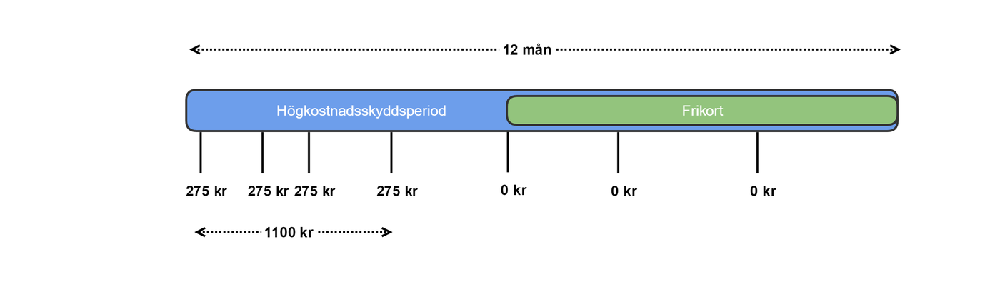
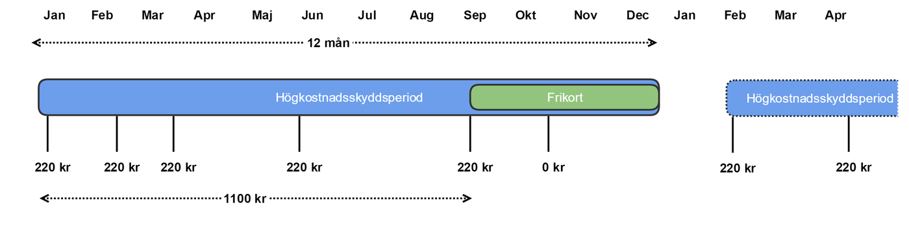

# 7 Tjänstekontrakt - financial: patientfees: exemption v1.0.0

* [**Table of Contents**](toc.md)
* **7 Tjänstekontrakt**

## 7 Tjänstekontrakt

# 7 Tjänstekontrakt

Källa: **Högkostnadsskydd**, tjänstekontraktbeskrivning version 1.0 (2024-03-25), [TKB_financial_patientfees_exemption.docx](TKB_financial_patientfees_exemption.docx).

Motsvarar TKB kapitel 6 **Tjänstekontrakt** (7.1 = TKB 6.1 osv.). Efter TKB:ns text följer för varje kontrakt fälten enligt schemat, tjänsteinteraktionen enligt WSDL, källfilerna och de genererade FHIR-artefakterna.

### RequestExemptionStatuses

Detta tjänstekontrakt används för att begära ut högkostandsskyddstatus samt alla transaktioner 12 månader bakåt i tiden för det patientId som anges i begäran. Genom att anropa tjänstekontraktet initieras en begäran om ett utlämnande. Den efterfrågade informationen skickas sedan av utlämnande part via tjänstekontraktet ProcessExemptionStatuses.

#### 7.1.1 Version

1.0

#### 7.1.2 Fältregler

Nedanstående tabell beskriver varje element i begäran och svar. Har namnet en * finns ytterligare regler för detta element och beskrivs mer i detalj i stycket Övriga Regler.

| | | | |
| :--- | :--- | :--- | :--- |
| Begäran |   |   |   |
| requestId | IIType | Unikt Id för begäran om utlämnandet. Det är konsuments ansvar att säkerställa identifierarens unikitet. Producent kommer därefter att använda denna identifierare i sitt svar som sker asynkront via tjänstekontraktet ProcessExemptionStatuses | 1..1 |
| ../root | string | Unikt Id för begäran om utlämnandet, ska förmedlas så som ett uuid. | 1..1 |
| ../extension |   | Ska utelämnas, då id förmedlas som ett uuid. | 0..0 |
| patientId | IIType | Id för patienten där fältet id sätts till patientens identifierare. Anges med 12 tecken utan avskiljare. / Tjänsteproducenten skall i svaret leverera all information på en begäran riktad mot individens huvudidentitet, dvs även information som tidigare har registrerats på andra till individen kopplade identiteter (LRID, NRID, tidigare SNR, eller tidigare PNR) / Fältet type sätts till OID för typ av identifierare. / 1) För PNR skall Skatteverkets oid för PNR (1.2.752.129.2.1.3.1) användas. / 2) För SNR skall Skatteverkets oid för SNR (1.2.752.129.2.1.3.3) användas. / 3) För NRID skall Ineras oid för NRID (1.2.752.74.9.1) användas. / 4) Tjänsteproducenter skall även stödja sökning på LRID med hjälp av att ange lokalt definierade oid’ar för LRID, exempelvis SLL’s LRID(1.2.752.97.3.1.3). / OBS LRID kan ej användas tillsammans med EI och aggregerande tjänster då dessa komponenter idag inte är anpassade för att stödja typ av id, inga uppdateringar till EI skall göras av en tjänsteproducent för LRID. / En tjänstekonsument som vill begära mha LRID måste därmed använda sig av systemadressering och ha vetskap om vilken LRID-oid som gäller vid anrop mot en specifik tjänsteproducent. | 1..1 |
| actor | ActorType | Aktören som begär utlämnandet. / Aktören är antingen invånare som begär ut sin information alternativt vårdnadshavare som begär ut barnets information. / Aktören kan även vara en vårdgivare som begär ut patients information från annan vårdgivare. | 1..1 |
| actor.actorTypeEnum | ActorTypeEnum | Enumeration som visar typ av aktör. Kan vara en av följande: / CITIZEN / GUARDIAN / CAREGIVER | 1..1 |
| actor.actorId | IIType | Beroende på typ av aktör anges antingen aktörens personnummer eller HSAId. / För CITIZEN och GUARDIAN anges ett personnummer, se attributet patientId för hur personnummer anges. / För CAREGIVER anges ett HSAId för vårdpersonal. I det fall sätts: / actor.actorId.root = 1.2.752.129.2.1.4.1 / actor.actorId.extension =`<HSA Id>` | 1..1 |
| actor.careGiverId | IIType | Om aktören är CAREGIVER ska HSAId för vårdgivare anges. Annars ska detta fält utelämnas. / För vårdgivare sätts: / actor.careGiverId.root = 1.2.752.129.2.1.4.1 / actor.careGiverId.extension =`<HSA Id>` | 0..1 |
| responseLogicalAddress | String | Logisk adress dit utlämnandet senare ska skickas. Anropande part av detta tjänstekontrakt måste således även vara producent för tjänstekontraktet ProcessExemptionStatuses, dit svaret/utlämnandet senare skickas asynkront. Det betyder att anropande part behöver vara upplagd i tjänsteadresseringskatalogen (TAK) som producent samt att konsument av ProcessExemptionStatuses givits anropsbehörighet till anropande part. | 1..1 |

| | | | |
| :--- | :--- | :--- | :--- |
| Tomt svar |   |   |   |

#### 7.1.3 Övriga regler

Se tillägg om header (ProcessingStatus) i referens [R8] - RIV Tekniska Anvisningar Basic Profile Valfria tillägg 2.1.

##### 7.1.3.1 Icke funktionella krav

N/A

###### 7.1.3.1.1 SLA-krav

Inga avvikande SLA-krav

#### 7.1.4 Fältregler enligt schema (XSD)

Tabellen är genererad ur tjänsteschemat. Typerna beskrivs i [avsnitt 6](6-gemensamma-informationskomponenter.md).

| | | | |
| :--- | :--- | :--- | :--- |
| **Begäran** |   |   |   |
| requestId | IIType |   | 1..1 |
| ../root | string |   | 1..1 |
| ../extension | string |   | 0..1 |
| patientId | IIType |   | 1..1 |
| ../root | string |   | 1..1 |
| ../extension | string |   | 0..1 |
| actor | ActorType |   | 1..1 |
| ../actorTypeEnum | ActorTypeEnum |   | 1..1 |
| ../actorId | IIType |   | 1..1 |
| ../../root | string |   | 1..1 |
| ../../extension | string |   | 0..1 |
| ../careGiverId | IIType |   | 0..1 |
| ../../root | string |   | 1..1 |
| ../../extension | string |   | 0..1 |
| responseLogicalAddress | string |   | 1..1 |
| **Svar** |   |   |   |
| **(tomt)** |   | Svaret innehåller inga element utöver utökningspunkter. |   |

#### 7.1.5 Tjänsteinteraktion enligt WSDL

SOAPAction: `urn:riv:financial:patientfees:exemption:RequestExemptionStatusesResponder:1:RequestExemptionStatuses`

#### 7.1.6 Källfiler (RIV-TA)

| | |
| :--- | :--- |
| [RequestExemptionStatusesInteraction_1.0_RIVTABP21.wsdl](RequestExemptionStatusesInteraction_1.0_RIVTABP21.wsdl) | WSDL (tjänsteinteraktion) |
| [RequestExemptionStatusesResponder_1.0.xsd](RequestExemptionStatusesResponder_1.0.xsd) | Tjänsteschema |
| [financial_patientfees_exemption_1.0.xsd](financial_patientfees_exemption_1.0.xsd) | Domänschema (delat) |
| [financial_patientfees_exemption_enum_1.0.xsd](financial_patientfees_exemption_enum_1.0.xsd) | Uppräkningar (delat) |
| [itintegration_registry_1.0.xsd](itintegration_registry_1.0.xsd) | LogicalAddress (SOAP-huvud) |
| [SjD_Hogkostnadsskydd_BegarandePart.docx](SjD_Hogkostnadsskydd_BegarandePart.docx) | Självdeklaration |

#### 7.1.7 FHIR-artefakter

Följande FHIR-artefakter har genererats från schemat:

* **Logisk modell (request):** [StructureDefinition/requestexemptionstatuses-request](StructureDefinition-requestexemptionstatuses-request.md)
* **Logisk modell (response):** ingen. Svaret innehåller bara `xs:any` (kontraktet är asynkront; resultatet skickas med ProcessExemptionStatuses), så ingen svarsmodell har genererats.
* **Kodsystem:** [CodeSystem/patientfees-exemption-actortype-cs](CodeSystem-patientfees-exemption-actortype-cs.md)
* **ValueSet:** [ValueSet/patientfees-exemption-actortype-vs](ValueSet-patientfees-exemption-actortype-vs.md)

### ProcessExemptionStatuses

Detta tjänstekontrakt används för att lämna ut högkostandsskyddstatus samt alla transaktioner 12 månader bakåt i tiden för det patientId som begärts ut.

Tjänstekontraktet kan förmedla utfärdade frikort hos region samt samtliga transaktioner som finns registrerade hos region.

Tjänstekontraktet anropas av utlämnande part efter att en begäran tidigare har mottagits – se tjänstekontraktet RequestExemptionStatuses ovan för begäran om utlämnande. Observera att det inte är tillåtet att använda tjänstekontraktet ProcessExemptionStatuses om inte annan part tidigare anropat region via RequestExemptionStatuses.

Om RequestExemptionStatuses anropats med aktören invånare eller vårdnadshavare ska ProcessExemptionStatuses innehålla både exemptions och transactions om sådana finns registrerade hos region, se nedan.

Om RequestExemptionStatuses anropats med aktören vårdgivare ska ProcessExemptionStatuses innehålla utfärdat frikort (exemptions). Om inget frikort finns utfärdat hos region för berörd person ska ProcessExemptionStatuses innehålla de hos region registrerade transaktionerna. I det fall ska transaktionerna inte innehålla ursprunglig vårdgivare/vårdenhet där avgiften genererats.

#### 7.2.1 Version

1.0

#### 7.2.2 Fältregler

Nedanstående tabell beskriver varje element i begäran och svar. Har namnet en * finns ytterligare regler för detta element och beskrivs mer i detalj i stycket Övriga Regler.

| | | | |
| :--- | :--- | :--- | :--- |
| Begäran |   |   |   |
| requestId | IIType | Unikt Id för begäran om utlämnandet. Det är begärande parts ansvar att säkerställa identifierarens unikitet. Detta Id ska således återspegla det requestId som tidigare skickats via tjänstekontraktet RequestExemptionStatuses. | 1..1 |
| ../root | string | Unikt Id för begäran om utlämnandet, ska förmedlas så som ett uuid. | 1..1 |
| ../extension |   | Ska utelämnas, då id förmedlas som ett uuid. | 0..0 |
| feeExemption | FeeExemptionType | Returnerar en patients högkostnadsskyddstatus | 0..* |
| ../patientId | IIType | Id för patienten (samma som i begäran), även kopplade identiteter till en huvudidentitet i begäran skall returneras av tjänsteproducenten. / Dvs information som registrerats på t.ex tidigare NRID, LRID, SNR eller PNR. / Fältet extension sätts till patientens identifierare, anges med 12 siffror utan avskiljare. / Fältet root sätts till typ av identifierare. / För personnummer ska Skatteverkets identifierare för personnummer (1.2.752.129.2.1.3.1) användas. / För samordningsnummer ska Skatteverkets identifierare för samordningsnummer (1.2.752.129.2.1.3.3) användas. / För reservidentiterer ska identifierare för nationell reservidentitet (1.2.752.74.9.1) användas. / Exempel: /`<patientId>`/`<root>`1.2.752.129.2.1.3.1`</root>`/`<extension>`196705053723`</extension>`/`</patientId>` | 1..1 |
| ../transaction | TransactionType | Alla avgifter patienten har betalat för besök inom hälsa och sjukvård (öppen vård). | 0..* |
| ../../fee* | AmountType | Patientavgift, den avgift patienten har betalat vid tillfället. / Avgifter på 0 SEK skall inte visas (t.ex makulerade transaktioner). | 0..1 |
| ../../../amount | decimal | Belopp med högst två decimaler. | 1..1 |
| ../../../currency* | CVType | Typ av valuta anges med oid 1.0.4217 samt den ISO-kod för valutan summan avser. Ska alltid vara SEK. / code: SEK / codeSystem: ”1.0.4217” | 1..1 |
| ../../dateOfVisit* | DateType | Datum för besök, måste ha ett värde om typeOfFee är CARE_VISIT | 0..1 |
| ../../timeOfRegistration* | TimeStampType | Datum och tidpunkt när avgiften registrerades i källsystemet. / Måste ha ett värde om typeOfFee är CARE_VISIT | 0..1 |
| ../../typeOfFee* | TypeOfExemptionEnum | Denna version av tjänstedomänen tillåter endast värdet: / CARE_VISIT - Öppen sjukvård | 1..1 |
| ../../careGiver* | IIType | HSA-id för Vårdgivare där besöket genomfördes, obligatorisk när typeOfFee är satt till CARE_VISIT. | 0..1 |
| ../../careUnit* | IIType | HSA-id för Vårdenhet där besöket genomfördes, obligatorisk när typeOfFee är satt till CARE_VISIT. | 0..1 |
| ../exemption | ExemptionType | Frikort / (Observera att nuvarande version av tjänstedomänen endast tillåter ../exemption.typeOfExemption = CARE_VISIT, vilket i praktiken innebär att kardinaliteten för exemptions i meddelandet bara kan vara [0..1]) | 0..* |
| ../../id | string | Unikt frikortsnummer eller serienummer för frikortet. Frikortsnumret genereras av källsystemet: ID’t är således unikt per källsystem. | 1..1 |
| ../../highCostProtectionPeriod* | DatePeriodType | Högkostnadsperioden är från första besöket hos vårdgivare till 12 månader framåt. / Nästa högkostnadsskydds period börjar när den senaste frikortsperioden är avslutad. / Se övriga regler. | 1..1 |
| ../../../start | DateType | Startdatum för högkostnadsskydd. | 0..1 |
| ../../../end | DateType | Slutdatum för högkostnadsskydd. | 0..1 |
| ../../exemptionPeriod* | DatePeriodType | Den period som frikortet gäller, se övriga regler. | 1..1 |
| ../../../start | DateType | Startdatum för frikort. | 0..1 |
| ../../../end | DateType | Slutdatum för frikort. | 0..1 |
| ../../typeOfExemption* | TypeOfExemptionEnum | Denna version av tjänstedomänen tillåter endast värdet: / CARE_VISIT - Öppen sjukvård | 1..1 |
| ../../region | IIType | HSA-id för den region som fattade beslut om att utfärda frikort. | 1..1 |

| | | | |
| :--- | :--- | :--- | :--- |
| resultCode | ResultCodeEnum | Kan vara ett av följande: / OK / INFO / ERROR | 1..1 |
| resultText | string | Producent förväntas skicka ett tillräckligt informativt meddelande som underlättar felsökning i de fall resultCode == ERROR | 0..1 |

#### 7.2.3 Övriga regler

Till denna informationsmängd finns regler som ej uttrycks i schemafilerna och tabellen ovan. Dessa återfinns nedan.

[sch]= validering i schematron. I schematronfilen contraints.xml är id´t på regeln samma som i Id-kolumnen i tabellen.

Gemensamt för alla regler som valideras m h a schematron är att om fältet inte är obligatoriskt och inte finns med i nyttolasten så kommer regeln inte ge ett fel.

Fält exemptionPeriod

’

| | | |
| :--- | :--- | :--- |
| rule001 [sch] | //transaction/dateOfVisit | Datumet får inte vara i framtiden |
| rule002 [sch] | //transaction/dateOfVisit | Får ej vara äldre än 12 månader |
| rule003 [sch] | //exemption/typeOfExemption | Får endast sättas till CARE_VISIT |
| rule004 [sch] | //transaction/typeOfFee | Får endast sättas till CARE_VISIT |
| rule005 [sch] | count(//exemptions) == 0 and / actor.actorTypeEnum[text() = CAREGIVER] | När antal exemptions är noll och actor.actorTypeEnum var satt till CAREGIVER i motsvarande föregångna anrop (RequestExemptionStatuses) som initierat begäran om utlämnande så ska transaction.careUnit och transaction.careGiver uteslutas. |
| rule006 [sch] | //transaction/timeOfRegistration | Får ej vara äldre än dateOfVisit |
| rule007 [sch] | //transaction/timeOfRegistration | Får ej vara i framtiden |
| rule008 [sch] | //patientId/root | Tillåtna värden är oid för personnummer, samordningsnummer enligt skatteverket samt nationell reservidentitet. |
| rule009 [sch] | //fee/currency/code | Får endast sättas till SEK |
| rule010 [sch] | //fee/currency/codeSystem | Får endast sättas till 1.0.4217 |
| rule011 [sch] | Element av typen CVType | Endast codeSystem och code ska ha värden. |
| rule012 [sch] | //transaction/typeOfFee, //transaction/dateOfVisit, //transaction/timeOfRegistration | För öppenvård måste både timeOfRegistration samt dateOfVisit vara med. |
| rule013 [sch] | typeOfExemption[text() = CARE_VISIT] | När typeOfExemption är satt till CARE_VISIT så är careUnit och careGiver obligatoriska. |
| rule014 [sch] | highCostProtectionPeriod.end = ../exemptionPeriod.end | Slutdatum på högkostnadsperioden skall vara samma som slutdatum för frikortsperioden. |
| rule015 [sch] | //amount | Inga transaktioner med summa 0 får skickas med. |
| rule016 [sch] | actor.actorTypeEnum[text() = CITIZEN OR text() = GUARDIAN] | actor.actorTypeEnum var satt till CITIZEN eller GUARDIAN i motsvarande föregångna anrop (RequestExemptionStatuses) som initierat begäran om utlämnande så är careUnit och careGiver obligatoriska. |
| rule017 [sch] | count(//exemptions) == 0 and / actor.actorTypeEnum[text() = CAREGIVER] | När antal exemptions är noll och actor.actorTypeEnum var satt till CAREGIVER i motsvarande föregångna anrop (RequestExemptionStatuses) som initierat begäran om utlämnande så ska meddelande innehålla en lista med transactions, om sådana finns registrerade hos den utlämnande regionen. |
| rule018 [sch] | count(//exemptions) != 0 and / actor.actorTypeEnum[text() = CAREGIVER] | När antal exemptions är skiljt från 0 och actor.actorTypeEnum var satt till CAREGIVER i motsvarande föregångna anrop (RequestExemptionStatuses) som initierat begäran om utlämnande så ska meddelandet inte innehålla en lista med transactions. / (Observera att nuvarande version av tjänstedomänen endast tillåter TypeOfFee = CARE_VISIT, vilket i praktiken innebär att kardinaliteten för exemptions i meddelandet bara kan vara [0..1]) |

Krav på hur en tjänstekonsument skall tolka

Finns det ett frikort

Summera transaktionerna de senaste 12 månaderna

Titta på transaktioner inom en högkostnad

##### 7.2.3.1 Icke funktionella krav

N/A

###### 7.2.3.1.1 SLA-krav

Inga avvikande SLA-krav

#### 7.2.4 Fältregler enligt schema (XSD)

Tabellen är genererad ur tjänsteschemat. Typerna beskrivs i [avsnitt 6](6-gemensamma-informationskomponenter.md).

| | | | |
| :--- | :--- | :--- | :--- |
| **Begäran** |   |   |   |
| requestId | IIType |   | 1..1 |
| ../root | string |   | 1..1 |
| ../extension | string |   | 0..1 |
| feeExemption | FeeExemptionType |   | 0..* |
| ../patientId | IIType |   | 1..1 |
| ../../root | string |   | 1..1 |
| ../../extension | string |   | 0..1 |
| ../transactions | TransactionType |   | 0..* |
| ../../fee | AmountType |   | 0..1 |
| ../../../amount | decimal |   | 1..1 |
| ../../../currency | CVType |   | 1..1 |
| ../../../../code | string |   | 0..1 |
| ../../../../codeSystem | string |   | 0..1 |
| ../../../../codeSystemName | string |   | 0..1 |
| ../../../../codeSystemVersion | string |   | 0..1 |
| ../../../../displayName | string |   | 0..1 |
| ../../../../originalText | string |   | 0..1 |
| ../../dateOfVisit | DateType |   | 0..1 |
| ../../timeOfRegistration | TimeStampType |   | 0..1 |
| ../../typeOfFee | TypeOfExemptionEnum |   | 1..1 |
| ../../careGiver | IIType |   | 0..1 |
| ../../../root | string |   | 1..1 |
| ../../../extension | string |   | 0..1 |
| ../../careUnit | IIType |   | 0..1 |
| ../../../root | string |   | 1..1 |
| ../../../extension | string |   | 0..1 |
| ../exemptions | ExemptionType |   | 0..* |
| ../../id | string |   | 1..1 |
| ../../highCostProtectionPeriod | DatePeriodType |   | 1..1 |
| ../../../start | DateType |   | 0..1 |
| ../../../end | DateType |   | 0..1 |
| ../../exemptionPeriod | DatePeriodType |   | 1..1 |
| ../../../start | DateType |   | 0..1 |
| ../../../end | DateType |   | 0..1 |
| ../../typeOfExemption | TypeOfExemptionEnum |   | 1..1 |
| ../../region | IIType |   | 1..1 |
| ../../../root | string |   | 1..1 |
| ../../../extension | string |   | 0..1 |
| **Svar** |   |   |   |
| resultCode | ResultCodeEnum |   | 1..1 |
| resultText | string |   | 0..1 |

#### 7.2.5 Tjänsteinteraktion enligt WSDL

SOAPAction: `urn:riv:financial:patientfees:exemption:ProcessExemptionStatusesResponder:1:ProcessExemptionStatuses`

#### 7.2.6 Källfiler (RIV-TA)

| | |
| :--- | :--- |
| [ProcessExemptionStatusesInteraction_1.0_RIVTABP21.wsdl](ProcessExemptionStatusesInteraction_1.0_RIVTABP21.wsdl) | WSDL (tjänsteinteraktion) |
| [ProcessExemptionStatusesResponder_1.0.xsd](ProcessExemptionStatusesResponder_1.0.xsd) | Tjänsteschema |
| [financial_patientfees_exemption_1.0.xsd](financial_patientfees_exemption_1.0.xsd) | Domänschema (delat) |
| [financial_patientfees_exemption_enum_1.0.xsd](financial_patientfees_exemption_enum_1.0.xsd) | Uppräkningar (delat) |
| [itintegration_registry_1.0.xsd](itintegration_registry_1.0.xsd) | LogicalAddress (SOAP-huvud) |
| [SjD_Hogkostnadsskydd_UtlamnandePart.docx](SjD_Hogkostnadsskydd_UtlamnandePart.docx) | Självdeklaration |

#### 7.2.7 FHIR-artefakter

Följande FHIR-artefakter har genererats från schemat:

* **Logisk modell (request):** [StructureDefinition/processexemptionstatuses-request](StructureDefinition-processexemptionstatuses-request.md)
* **Logisk modell (response):** [StructureDefinition/processexemptionstatuses](StructureDefinition-processexemptionstatuses.md)
* **Kodsystem:** [CodeSystem/patientfees-exemption-resultcode-cs](CodeSystem-patientfees-exemption-resultcode-cs.md)
* **ValueSet:** [ValueSet/patientfees-exemption-resultcode-vs](ValueSet-patientfees-exemption-resultcode-vs.md)
* **Kodsystem:** [CodeSystem/patientfees-exemption-typeofexemption-cs](CodeSystem-patientfees-exemption-typeofexemption-cs.md)
* **ValueSet:** [ValueSet/patientfees-exemption-typeofexemption-vs](ValueSet-patientfees-exemption-typeofexemption-vs.md)

