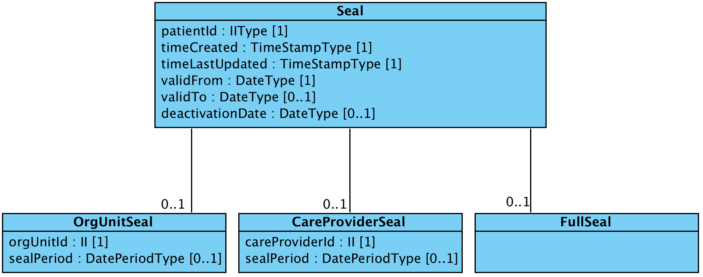
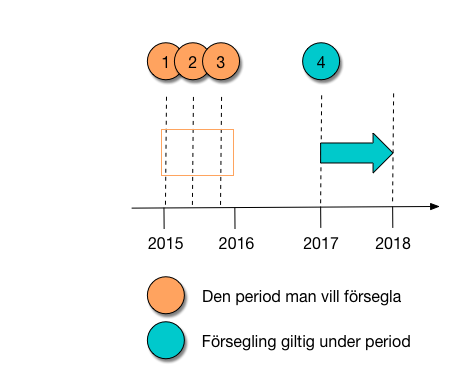
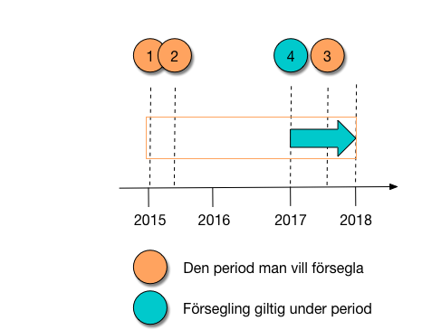
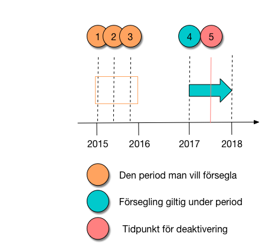

# 5 Tjänstedomänens meddelandemodeller - informationsecurity: authorization: pip v1.0.0-rc1.snapshot

* [**Table of Contents**](toc.md)
* **5 Tjänstedomänens meddelandemodeller**

## 5 Tjänstedomänens meddelandemodeller

# 5 Tjänstedomänens meddelandemodeller

Källa: **Tjänstekontraktsbeskrivning informationsecurity: authorization: pip**, version 1.0_RC1 (2017-06-28), [TKB_informationsecurity_authorization_pip.docx](TKB_informationsecurity_authorization_pip.docx).

Här beskrivs de meddelandemodeller som tjänstekontrakten bygger på. För mappning mot Nationell Informationsstruktur 2017, se informationsspecifikationen.

### 5.1 V-MIM

#### 5.1.1 GetSeals

### 5.2 Formatregler

#### 5.2.1 Format för datum och tidpunkter

Datum anges på formatet ”ÅÅÅÅMMDD”. Detta motsvarar den ISO 8601 och ISO 8824-kompatibla formatbeskrivningen ”YYYYMMDD” (se referens [R3]).

Tidpunkter anges alltid på formatet ”ÅÅÅÅMMDDttmmss”, vilket motsvarar den ISO 8601 och ISO 8824-kompatibla formatbeskrivningen ”YYYYMMDDhhmmss”.

#### 5.2.2 Tidszon för tidpunkter

Tidszon anges inte i meddelandeformaten. All information om datum och tidpunkter som utbyts via tjänsterna ska ange datum och tidpunkter i den tidszon som gäller/gällde i Sverige vid den tidpunkt som respektive datum- eller tidpunktsfält bär information om. Såväl tjänstekonsumenter som tjänsteproducenter skall med andra ord förutsätta att datum och tidpunkter som utbyts är i tidszonerna CET (svensk normaltid) respektive CEST (svensk normaltid med justering för sommartid).

#### 5.2.3 Format för patientidentitet

Format för personnummer: ”ÅÅÅÅMMDDNNNN”

### Kompletterande figurer: tidsperioder för försegling

Figurerna finns inte i TKB:n utan i domänens arbetsmaterial (`docs/work_material/exports/`, tillagda 2017-06-19 "to help understand seal period and validity period"). De illustrerar tidsperioderna som fälten validFrom, validTo, deactivationDate och sealPeriod hänvisar till (informationsspecifikationen kapitel 7.6 [R4]).

**Förseglad period (1–3) utanför förseglingens giltighetsperiod (4).**

**Förseglad period som både ligger utanför och inom giltighetsperioden.**

**Deaktivering av en försegling.**

