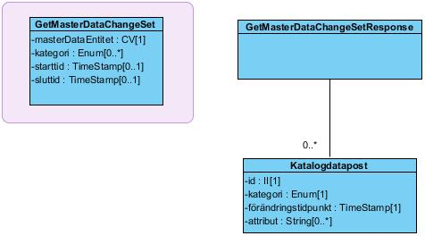

# 5 Tjänstedomänens meddelandemodeller - infrastructure: directory: synchronization v1.0.0-rc3

* [**Table of Contents**](toc.md)
* **5 Tjänstedomänens meddelandemodeller**

## 5 Tjänstedomänens meddelandemodeller

# 5 Tjänstedomänens meddelandemodeller

Källa: **Tjänstekontraktsbeskrivning för katalogtjänstsynkronisering**, version 1.0_RC3 (2018-09-21), [TKB_infrastructure_directory_synchronization.docx](TKB_infrastructure_directory_synchronization.docx).

Här beskrivs de meddelandemodeller som tjänstekontrakten bygger på. För varje meddelandemodell beskrivs hur mappning ser ut mot schema (XSD) för tjänstekontrakt.

### 5.1 V-MIM

#### 5.1.1 GetMasterDataChangeSet

Begäran visas nedan med lila bakgrund och svaret med vit bakgrund.

##### 5.1.1.1 Begäran

| | |
| :--- | :--- |
| GetMasterDataChangeSet | GetMasterDataChangeSet |
| Interaktion | Interaction |
| masterDataEntitet | masterDataEntity |
| kategori | category |
| starttid | /timePeriod/start |
| sluttid | /timePeriod/end |

##### 5.1.1.2 Svar

| | |
| :--- | :--- |
| GetMasterDataChangeSetResponse | GetMasterDataChangeSetResponse |
| Katalogdatapost | MasterDataChangeSet |
| id | Id |
| kategori | Category |
| förändringstidpunkt | ChangeTime |
| attribut | Attributes/attribute |

### 5.2 Formatregler

#### 5.2.1 Format för datum och tidpunkter

Datum anges på formatet ”ÅÅÅÅMMDD”. Detta motsvarar den ISO 8601 och ISO 8824-kompatibla formatbeskrivningen ”YYYYMMDD” (se referens [R6]).

Tidpunkter anges alltid på formatet ”ÅÅÅÅMMDDttmmss”, vilket motsvarar den ISO 8601 och ISO 8824-kompatibla formatbeskrivningen ”YYYYMMDDhhmmss” (se referens [R6]).

##### 5.2.1.1 Tidszon för tidpunkter

Tidszon anges inte i meddelandeformaten. All information om datum och tidpunkter som utbyts via tjänsterna ska ange datum och tidpunkter i den tidszon som gäller/gällde i Sverige vid den tidpunkt som respektive datum- eller tidpunktsfält bär information om. Såväl tjänstekonsumenter som tjänsteproducenter skall med andra ord förutsätta att datum och tidpunkter som utbyts är i tidszonerna CET (svensk normaltid) respektive CEST (svensk normaltid med justering för sommartid).

#### 5.2.2 URI

URI står för Uniform Resource Identifier som består av en sträng av tecken som används för att identifiera eller namnge en resurs. Används främst för att referera till en resurs över ett nätverk. En Uniform Resource Locator, URL, är en URI, som förutom att identifiera en resurs även ger information hur man når resursen och var den finns.

Exempel: URL:en http://example.com/ är en URI som identifierar en resurs och som visar att en representation av den resursen (ingångssidans HTML-kod) kan hämtas med HTTP från en värddator med namnet example.com.

