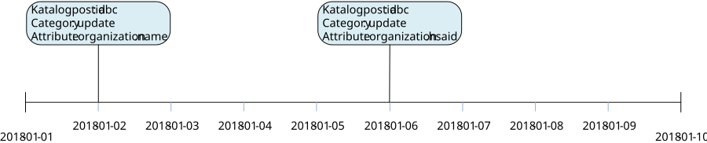
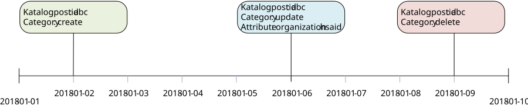

# 7 Tjänstekontrakt - infrastructure: directory: synchronization v1.0.0-rc3

* [**Table of Contents**](toc.md)
* **7 Tjänstekontrakt**

## 7 Tjänstekontrakt

# 7 Tjänstekontrakt

Källa: **Tjänstekontraktsbeskrivning för katalogtjänstsynkronisering**, version 1.0_RC3 (2018-09-21), [TKB_infrastructure_directory_synchronization.docx](TKB_infrastructure_directory_synchronization.docx).

Motsvarar TKB kapitel 6 **Tjänstekontrakt** (7.1 = TKB 6.1 osv.). Efter TKB:ns text följer för varje kontrakt fälten enligt schemat, tjänsteinteraktionen enligt WSDL, källfilerna och de genererade FHIR-artefakterna.

### GetMasterDataChangeSet

Hämtar information om masterdata som förändrats i en masterdatakälla baserat på sökkriterier. Sökkriterierna specificerar typ av förändring, datum för förändringen samt vilken typ av masterdata som efterfrågas. Masterdatakällan svarar med en lista innehållande id på poster som förändrats enligt sökkriterierna.

#### 7.1.1 Version

1.0

#### 7.1.2 Fältregler

Nedanstående tabell beskriver varje element i begäran och svar. Har namnet en * finns ytterligare regler för detta element och beskrivs mer i detalj i stycket Regler. Text i kolumnen ’Beskrivning’ som anges på första raden och är fetmarkerad motsvarar den benämning som används i meddelandemodellen.

| | | | |
| :--- | :--- | :--- | :--- |
| Begäran |   |   |   |
| masterDataEntity | CVType | Masterdataentitet / Angivelse av vilken typ masterdata som begäran avser. | 1 |
| ../code | String | Kod som anger typ av masterdata i källan. / Definierar vilken typ av information i masterdatakällan som efterfrågas med hjälp av kod i kodsystem. | 1 |
| ../codeSystem | String | Kodsystem som anger masterdatakälla. / OID för t.ex. utbud | 1 |
| ../codeSystemVersion | String | Versionsnummer för kodsystem | 0..1 |
| ../displayName | String | Textuell beskrivning av det som koden anger. / Koden beskriven i fritext. | 0..1 |
| ../codeSystemName | String | Namn på kodsystem | 0..1 |
| ../originalText | String | Skall ej anges | 0..0 |
| timePeriod | TimePeriodType | Tidsintervall för förändringar. / Begränsning av sökning i tid. Resultatet innehåller information om poster som förändrats i masterdatakällan under angiven tidsperiod. Minst en av start- och endattributen ska anges om attributet timeInterval anges. | 0..1 |
| ../start | TimeStamp | Starttid / Starttid för när en post förändrats. Endast katalogposter som förändrats efter denna tidpunkt ska tas med i svaret. | 0..1 |
| ../end | TimeStamp | Sluttid / Slut för när en post förändrats. Endast katalogposter som förändrats före denna tidpunkt ska tas med i svaret. | 0..1 |
| category | Enum | Kategori / Kategorisering av förändring. Enum med tillåtna värden: create, update, delete. | 0..* |
| Svar |   |   |   |
| MasterDataChangeSet | MasterDataChangeSetType |   | 0..* |
| ../id | IIType | Id / Identifierare som unikt pekar ut en katalogdatapost i källsystemet. Idt kan användas för att hämta posten med tjänstekontraktet som pekas ut i förfrågan. | 1 |
| ../id/root | string | En universellt unik identifierare eller en identifierare som tillsammans med värdet för ”extension” / ger en universellt unik identifierare. | 1 |
| ../id/extension | string | En textsträng som tillsammans med värdet för "root" bildar en unik identifierare. Används om värdet på "root" inte är universellt unikt. | 0..1 |
| ../category | Enum | Kategori / Kategorisering av förändring. / Enum med tillåtna värden: create, update, delete. | 1 |
| ../changeTime | TimeStamp | Förändringstidpunkt / Tidpunkt för när förändringen genomfördes i masterdatakällan. | 1 |
| ../attributes | AttributeType | Angivelse av förändrade attribut för katalogposten. / Om category är update kan förändrade fält anges i svaret, så att konsumenten kan härleda om uppdateringen är relevant för att trigga en hämtning av hela posten. | 0..* |
| ../../attribute | String | Attribut / Det förändrade attributet pekas ut med klass och attribut separerat med punktnotation. Exempel: Organisation.namn / Vilka attribut som kan anges beror helt på masterdatakällan. | 1 |

#### 7.1.3 Övriga regler

Regel #1: När en tjänstekonsument anger en masterDataEntity som producenten inte stödjer ska tjänsteproducenten svara med ett SoapException.

Regel #2: Tjänstekonsumenten ska begränsa sitt sökvillkor i begäran i syfte att minimera storleken på svarsmeddelandet.

Regel #3: Tjänsteproducentens hantering av flera förändringar av samma katalogdatapost under sökperioden, som anges i begäran, kan hanteras på olika sätt beroende på tjänsteproducentens förmåga och användningsområde. I exemplet i Figur 1 uppdateras samma post två gånger. En begäran med sökintervall 2018-01-01 - 2018-01-10 får hanteras på 2 olika sätt:

**Figur 1. Katalogpost med id=abc uppdateras två gånger under tidsperioden 2018-01-01 - 2018-01-10**

Tjänsteproducent som endast kan tillhandahålla senaste versionen av en katalogpost via sitt huvudkontrakt anger en post i svaret med datum för senaste uppdateringen och antingen ingen attributangivelse, eller båda attributen som förändrats under tidsintervallet.

Tjänsteproducent som kan och vill tillhandahålla historiska versioner av katalogposter via sitt huvudkontrakt anger två poster i svaret. Attributangivelse i respektive post är frivilligt.

I Figur 2 visas hur en katalogpost blir skapad, uppdaterad och borttagen under ett tidsintervall. En begäran med sökintervall 2018-01-01 - 2018-01-10 får hanteras på 2 olika sätt:

**Figur 2. Katalogpost med id=abc skapas, uppdateras och tas bort under tidsperioden 2018-01-01 - 2018-01-10**

För en tjänsteproducent som endast kan tillhandahålla senaste versionen av en katalogpost via sitt huvudkontrakt ska svaret innehålla en post med information om borttagning.

Tjänsteproducent som kan och vill tillhandahålla historiska versioner av katalogposter via sitt huvudkontrakt anger tre poster i svaret. Attributangivelse i uppdateringsposten är frivillig.

##### 7.1.3.1 Icke funktionella krav

###### 7.1.3.1.1 SLA-krav

Se generella SLA-krav för tjänstedomänen.

#### 7.1.4 Annan information om kontraktet

Ingen.

#### 7.1.5 Fältregler enligt schema (XSD)

Tabellen är genererad ur tjänsteschemat. Typerna beskrivs i [avsnitt 6](6-gemensamma-informationskomponenter.md).

| | | | |
| :--- | :--- | :--- | :--- |
| **Begäran** |   |   |   |
| masterDataEntity | CVType |   | 1..1 |
| ../code | string |   | 1..1 |
| ../codeSystem | string |   | 1..1 |
| ../codeSystemName | string |   | 0..1 |
| ../codeSystemVersion | string |   | 0..1 |
| ../displayName | string |   | 0..1 |
| ../originalText | string |   | 0..1 |
| category | CategoryEnum |   | 0..1 |
| timePeriod | TimePeriodType | Används för att specificera ett datumintervall med hjälp av start- och slutdatum. start: Startdatum på formatet YYYYMMDDhhmmss end: Slutdatum på formatet YYYYMMDDhhmmss | 0..1 |
| ../start | TimeStampType |   | 0..1 |
| ../end | TimeStampType |   | 0..1 |
| **Svar** |   |   |   |
| masterDataChangeSet | MasterDataChangeSetType |   | 0..* |
| ../id | IIType |   | 1..1 |
| ../../root | string |   | 1..1 |
| ../../extension | string |   | 1..1 |
| ../category | CategoryEnum |   | 1..1 |
| ../changeTime | TimeStampType |   | 0..1 |
| ../attributes | MasterDataAttributeType |   | 0..* |
| ../../masterDataAttribute | string |   | 1..1 |

#### 7.1.6 Tjänsteinteraktion enligt WSDL

SOAPAction: `urn:riv:infrastructure:directory:synchronization:GetMasterDataChangeSetResponder:1:GetMasterDataChangeSet`

#### 7.1.7 Källfiler (RIV-TA)

| | |
| :--- | :--- |
| [GetMasterDataChangeSetInteraction_1.0_RIVTABP21.wsdl](GetMasterDataChangeSetInteraction_1.0_RIVTABP21.wsdl) | WSDL (tjänsteinteraktion) |
| [GetMasterDataChangeSetResponder_1.0.xsd](GetMasterDataChangeSetResponder_1.0.xsd) | Tjänsteschema |
| [infrastructure_directory_synchronization_1.0.xsd](infrastructure_directory_synchronization_1.0.xsd) | Domänschema (delat) |
| [infrastructure_directory_synchronization_1.0_enum.xsd](infrastructure_directory_synchronization_1.0_enum.xsd) | Uppräkningar (delat) |
| [itintegration_registry_1.0.xsd](itintegration_registry_1.0.xsd) | LogicalAddress (SOAP-huvud) |

#### 7.1.8 FHIR-artefakter

Följande FHIR-artefakter har genererats från schemat:

* **Logisk modell (request):** [StructureDefinition/getmasterdatachangeset-request](StructureDefinition-getmasterdatachangeset-request.md)
* **Logisk modell (response):** [StructureDefinition/getmasterdatachangeset](StructureDefinition-getmasterdatachangeset.md)
* **Kodsystem:** [CodeSystem/directory-synchronization-category-cs](CodeSystem-directory-synchronization-category-cs.md)
* **ValueSet:** [ValueSet/directory-synchronization-category-vs](ValueSet-directory-synchronization-category-vs.md)

