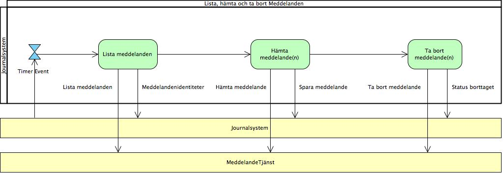
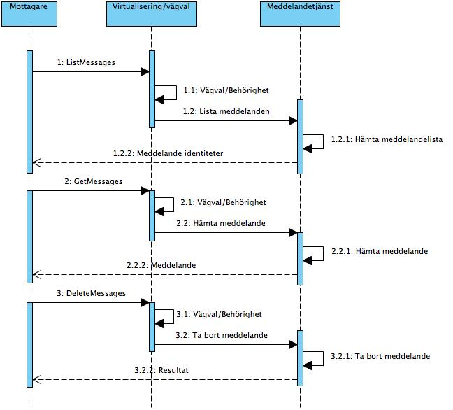

# 3 Tjänstedomänens arkitektur - infrastructure: itintegration: messagebox v1.0.0

* [**Table of Contents**](toc.md)
* **3 Tjänstedomänens arkitektur**

## 3 Tjänstedomänens arkitektur

# 3 Tjänstedomänens arkitektur

Källa: **Tjänstekontraktsbeskrivning Meddelandetjänst**, version 1.0.0 (2013-12-04), [Tjanstekontrakt_Meddelandetjanst_Beskrivning.doc](Tjanstekontrakt_Meddelandetjanst_Beskrivning.doc).

Detta kapitel beskriver de flöden som är relevanta för tjänstedomänen. Beskrivningarna är i form av modeller, för varje flöde finns dels ett arbetsflöde som beskriver vilka steg som ingår i flödet och dels ett sekvensdiagram som tar hänsyn till vilka tjänstekontrakt som nyttjas i de olika stegen.

### 3.1 Lista, hämta och ta bort meddelanden

Nedanstående diagram visar hur meddelanden listas, hämtas och tas bort.

#### 3.1.1 Arbetsflöde

**Figur 2. Arbetsflöde: lista, hämta och ta bort meddelanden**

##### 3.1.1.1 Roller

| | |
| :--- | :--- |
| Journalsystem | Aktören är i detta fallet ett system, dvs ingen individ är inblandad. |

##### 3.1.1.2 Arbetssteg

| | |
| :--- | :--- |
| Lista meddelanden | Ett anrop görs för att se om det finns meddelanden, anropet kan begränsas map verksamheter och tjänstekontrakt. De meddelanden som eventuellt finns returneras med identiteter som svar på denna förfrågan. |
| Hämta meddelanden | Ett anrop görs med meddelande identiteter för att hämta hela meddelanden. |
| Ta bort meddelanden | Efter att ha sparat meddelandet görs ett anrop för att ta bort dessa från tjänsten. |

##### 3.1.1.3 Informationsmängder

| | |
| :--- | :--- |
| Meddelandeidentiteter | Begränsad informationsmängd som identifierar meddelande. |
| Meddelande | Den informationsmängd som utgör ett helt meddelande. |

##### 3.1.1.4 Informationslager

| | |
| :--- | :--- |
| Journalsystem | System som använder Meddelandetjänsten som mellanlagring av meddelanden adresserade till verksamheter som systemet hanterar. |
| Meddelandetjänsten | Ett system för mellanlagring av meddelanden. |

#### 3.1.2 Sekvensdiagram

Nedanstående sekvensdiagram beskriver vilka tjänstekontrakt som används i det ovan beskrivna flödet. Tjänstekontrakt som används är ListMessages, GetMessages och DeleteMessages.

**Figur 3. Sekvensdiagram: lista, hämta och ta bort meddelanden**

Ovanstående sekvensdiagram visar:

* Hur ett journalsystem listar, hämtar och tar bort meddelanden i Meddelandetjänsten.

### 3.2 Obligatoriska kontrakt

Följande tabell anger vilka kontrakt som är obligatoriska att realisera för respektive flöde.

| | |
| :--- | :--- |
| ListMessages | X |
| GetMessage | X |
| DeleteMessage | X |

### 3.3 Adressering

#### 3.3.1 Lista, hämta och ta bort meddelanden

De logiska adresserna är till meddelandetjänsten, som representeras av Ineras organisationnummer.

### 3.4 Aggregering och engagemangsindex

Används ej i denna version.

