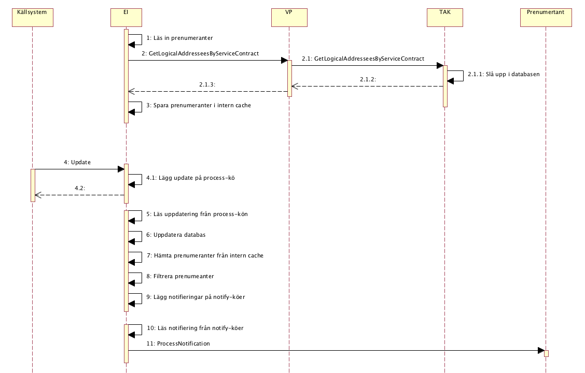
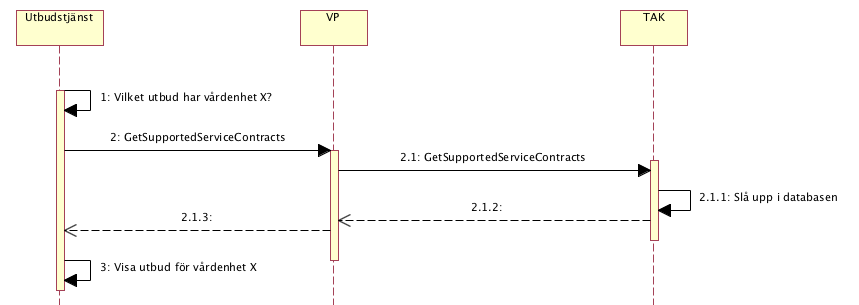

# 3 Tjänstedomänens arkitektur - infrastructure: itintegration: registry v2

* [**Table of Contents**](toc.md)
* **3 Tjänstedomänens arkitektur**

## 3 Tjänstedomänens arkitektur

## Tjänstedomänens arkitektur

Detta kapitel beskriver de flöden som är relevanta för tjänstedomänen. Beskrivningarna är i form av modeller, för varje flöde finns dels ett arbetsflöde som beskriver vilka steg som ingår i flödet och dels ett sekvensdiagram som tar hänsyn till vilka tjänstekontrakt som nyttjas i de olika stegen.

### Flöden

#### EI läser in aktuella prenumeranter Arbetsflöde

##### Arbetsflöde

När EI tar emot index uppdateringar via sin Update-metod så skall registrerade prenumeranter notifieras genom att EI anropar dess ProcessNotification tjänst. Prenumeranter registreras i TAK och nås av EI genom att anropa TAK’ens Registry tjänst GetLogicalAddresseesByServiceContract. Inargumentet serviceConsumerHsaId sätter EI till sitt eget HsaId och inargumentet serviceContractNameSpace anges till namespacet för EI tjänsten ProcessNotification. Den uppläsa informationen sparas internt i en minnes-cache i EI och används då inkomna index-uppdateringar skall leda till att notifieringar skickas till berörda prenumeranter. Se beskrivning av tjänstekontraktet GetLogicalAddresseesByServiceContract nedan för beskrivning av filtreringslogik mm.

##### Roller

##### Sekvensdiagram

#### En utbudstjänst vill veta vilka tjänstekontrakt en viss vårdenhet stödjer

##### Arbetsflöde

För bakgrund se https://code.google.com/p/rivta/issues/detail?id=129 Utbudstjänster och liknande konsumenter med avancerade process-logik behöver veta vilka tjänstekontrakt en viss vårdenhet stödjer. Genom att anropa tjänstekontraktet GetSupportedServiceContracts så kan en sådan konsument få reda på det.

##### Roller

##### Sekvensdiagram

#### Obligatoriska kontrakt

Följande tabell specificerar vilka kontrakt som är obligatoriska att realisera för respektive flöde.

| | | |
| :--- | :--- | :--- |
| GetLogicalAddresseesByServiceContract | X |   |
| GetSupportedServiceContracts |   | X |

### Adressering

Tjänstedomänen tillämpar verksamhetsbaserad adressering. Följande logiska adresser skall användas: Regionens organisationsnummer (HSA-id) för regionspecifika registry-tjänster. Inera AB:s organisationsnummer för nationell registry-tjänst.

### Aggregering och engagemangsindex

Varken aggregering och/eller engagemangsindex är en förutsättning för att använda tjänsterna i denna domän.

### Annat…

Inte i nuläget.

