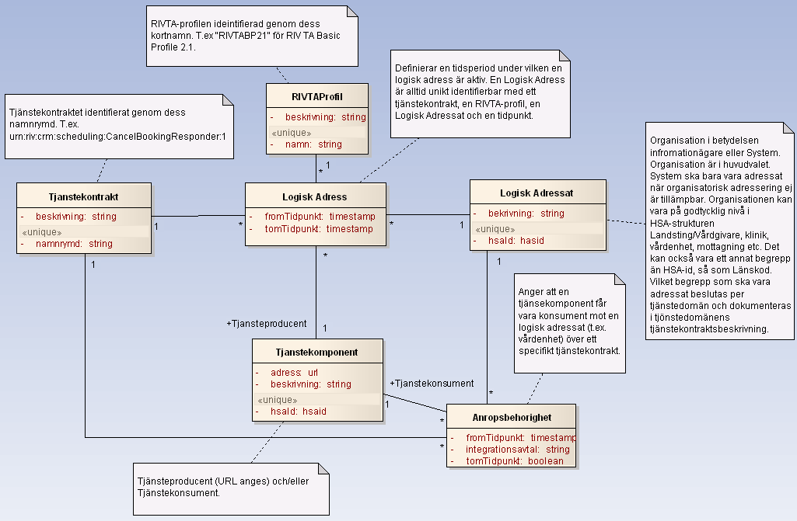

# 2 Informationsmodell - itintegration: registry v1.0.0

* [**Table of Contents**](toc.md)
* **2 Informationsmodell**

## 2 Informationsmodell

# 2 Informationsmodell

Källa: **Itintegration - registry, Tjänstekontrakt**, utgåva A (2012-04-14), [Tjanstekontrakt_Itintegration_Registry_Beskrivning.doc](Tjanstekontrakt_Itintegration_Registry_Beskrivning.doc).

Tjänstekontrakten i denna tjänstedomän speglar T-bokens tjänsteadresseringsmodell. En tjänsteproducent ska hantera tjänsteadresseringsinformation på ett sätt som speglar följande informationsmodell:

**Figur 1. Informationsmodell för tjänsteadressering.**

| | | | |
| :--- | :--- | :--- | :--- |
| RIVTAProfil | RIVTA-Profil. Namnges med aktuell profils kortnamn (se kodverk). | Definieras av RIVTA-förvaltningen. Dokumenteras på av förvaltningen anvisad plats. När denna text skrevs förvaltas RIVTA av Cehis tekniska expertgrupp på projektplatsen http://code.google.com/p/rivta/ |   |
| Tjänstekontrakt | Tjänstekontraktets namnrymd enligt tjänsteschema. Namnrymden omfattar både tjänstedomän och tjänstens namn. | Uppbyggnaden av namnrymd definieras av anvisning för Tjänsteschema (del av RIV TA).Tjänstedomänen fastställs av RIVTA-förvaltningen. |   |
| Logisk adressat |   | Konceptet definieras av T-boken. Identifierare och innebörd beslutas per tjänstedomän och dokumenteras i respektive tjänstedomäns tjänstekontraktsbeskrivning. |   |
| Tjänste-komponent | Ett begrepp för en mjukvarukomponent som driftsätts i syfte att publicera en tjänstekomponent eller att konsumera en tjänst. Multiplicitet och regler för attributen beror av roll (konsument/producent). | Kodverk saknas på nationell nivå. Landsting och leverantörer har olika angreppssätt för namnsättning och katalogisering av komponenter i sitt systemlandskap. |   |
| Anrops-behörighet | En relationsklass som bygger upp en behörighet för en tjänstekonsument (Tjänstekomponent i rollen konsument) att anropa en tjänsteproducent genom att den associeras till en Logisk Adressat (t.ex. en vårdenhet) och ett Tjänstekontrakt (t.ex. ”urn:riv:crm:scheduling:MakeBookingResponder:1”. Behörigheten är löst kopplad till tjänsteproducenten. En vårdenhet som erbjuder direktbokning via Mina Vårdkontakter kan därmed byta tjänsteproducent (bokningssystem) utan att anropsbehörigheten påverkas. |   |   |
| Logisk adress | En relationsklass som beskriver en addresserbar tjänst. En adresserbar tjänst har ett Tjänstekontrakt som tillgängliggörs av en Logisk Adressat (en verksamhet) genom dess tjänsteproducent (Tjänstekomponent i rollen tjänsteproducent) enligt en viss RIVTA-profil. |   |   |

