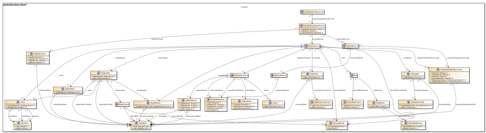

# 5 Tjänstedomänens meddelandemodeller - masterdata: citizen: citizen v2.0.0

* [**Table of Contents**](toc.md)
* **5 Tjänstedomänens meddelandemodeller**

## 5 Tjänstedomänens meddelandemodeller

# 5 Tjänstedomänens meddelandemodeller

Källa: **Personuppgifter – Tjänstekontraktsbeskrivning**, version 2.0 (2016-02-24, revision RC3 2016-04-22), [TKB_masterdata_citizen_citizen.docx](TKB_masterdata_citizen_citizen.docx).

### 5.1 V-MIM

Meddelandeinformationsmodellen följer Skatteverkets Navets informationsstruktur. Mappning till Skatteverkets attribut/termer återfinns i Informationsspecifikationen.

### 5.2 Formatregler

#### 5.2.1 Personidentitet

Personidentitet anges på formatet ÅÅÅÅMMDDXXXX. Samma format gäller för olika typer av personidentiteter(Personnummer och samordningsnummer), dvs 12 tecken.

#### 5.2.2 Datum

Kontraktet använder sig av en datumtyp som är ett ofullständigt datum (PartialDate) där man inte alltid vet det exakta datumet utan bara vet månaden eller året för händelsen. Tillåtna format är "YYYY-MM-DD", "YYYY-MM" och "YYYY".

#### 5.2.3 Datum och Tid

Tid och datum anges alltid på formatet ”ÅÅÅÅ-MM-DDThh:mm:ss” enligt RFC 3339 [R5]. Exempel: 2010-11-26T09:12:33. W3C-datatypen dateTime används i tjänstekontrakten för att realisera detta.

##### 5.2.3.1 Tidszon

Om inte tidszon anges i kommunikation med tjänsterna ska man förutsätta att det är tidszon i Sverige vid den tidpunkt som respektive datum eller tidpunktsfält bär information om. Såväl tjänstekonsumenter som tjänsteproducenter skall med andra ord förutsätta att datum och tidpunkter som utbyts är i tidszonerna CET (svensk normaltid) respektive CEST (svensk normaltid med justering för sommartid) om inte tidszon anges, se W3C-dataypen dateTime.

##### 5.2.3.2 Landskod

Kod för land anges om inget annat specificeras enligt ISO 3166-1 alpha-2.

### 5.3 Profiler

Alla tillämpningar har inte samma behov av information från Skatteverket/Navet. Det är önskvärt att tillåta olika delmängder av informationen för olika ändamål, bl.a. av prestandaskäl.

Kontraktet LookupResidentsForProfile använder sig därför av profiler för att inte skicka tillbaka onödigt mycket data till tjänstekonsumenten. Tjänstekonsumenten anger önskad profil i anropet. Se vidare i kapitel 8. Aktuella profiler

