# 7 Tjänstekontrakt - supportprocess: logistics: scheduling v2.0.0

* [**Table of Contents**](toc.md)
* **7 Tjänstekontrakt**

## 7 Tjänstekontrakt

# 7 Tjänstekontrakt

Källa: **Tjänstekontraktsbeskrivning Tidbokning**, version 2.0 RC2 (2023-11-01), [TKB_supportprocess_logistics_scheduling.docx](TKB_supportprocess_logistics_scheduling.docx).

Motsvarar TKB kapitel 6 **Tjänstekontrakt** (7.1 = TKB 6.1 osv.). Efter TKB:ns text följer för varje kontrakt fälten enligt schemat, tjänsteinteraktionen enligt WSDL, källfilerna och de genererade FHIR-artefakterna.

### CancelAppointment

Tjänstekontraktet ger aktören möjlighet att avboka en befintlig bokning, baserat på kombinationen av unikt bokningsid samt personnummer för patienten som bokningen gäller.

#### 7.1.1 Frivillighet

Tjänstekontraktet är obligatorisk för vårdenheter som erbjuder avbokning och således kan svara ”sant” i fältet ”cancelAppointmentAllowed” för bokningens tidstyp (appointment.timeslot.timeType.cancelAppointmentAllowed)

I övriga fall är tjänsten frivillig.

#### 7.1.2 Version

Tjänstekontraktet finns sedan version 1.0. Aktuell version är 2.0. Tjänstekontraktets meddelandeinformationsmodell har förändrats sedan föregående version med följd att kompatibiliteten bakåt har brutits.

#### 7.1.3 Meddelandeinformationsmodell (MIM)

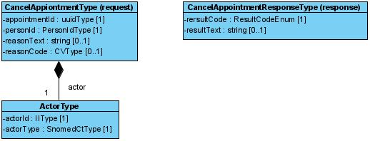

#### 7.1.4 Fältregler

Nedanstående tabell beskriver varje element i begäran och svar. Har namnet en * finns ytterligare regler för detta element och beskrivs mer i detalj i stycket Regler.

| | | | |
| :--- | :--- | :--- | :--- |
| Begäran |   |   |   |
| actor | ActorType | Typ av aktör som anropar tjänstekontraktet. Se kapitel Definition av komplexa typer för detaljerad information om hur de underliggande attributen populeras. | 1..1 |
| appointmentId | uuidType | Unikt id för bokningen. Ska uttryckas som ett uuid (universally unique identifier). | 1..1 |
| personId | PersonIdType (IIType) | Patientens personnummer, för den patient som tidbokningen gäller. | 1..1 |
| reasonText | string | Patientens anledning till avbokningen, uttryckt som fritext | 0..1 |
| reasonCode | CVType | Patientens anledning till avbokningen, uttryckt som anledningskod. Möjliga val som ges till patienten bestäms av tidbokningssystemet. Tidbokningssystemet ges möjlighet att erbjuda lista med möjliga val per tidstyp. Tidbokningssystemet bestämmer själv koder och kodsystem att använda | 0..1 |
| reasonCode.code | string | Kod för anledningen till avbokningen | 1..1 |
| reasonCode.codeSystem | string | Definierar vilket kodsystem som fältet code tillhör. | 1..1 |
| reasonCode.displayName | string | Den text som beskriver koden och ska visas till invånaren | 1..1 |
| Svar |   |   |   |
| resultCode | ResultCodeEnum (string) | Status för den gjorda avbokningen. | 1..1 |
| resultText | string | Ev. meddelande kopplat till resultatkoden. | 0..1 |

#### 7.1.5 Övriga regler

Till denna informationsmängd finns regler som ej uttrycks i schemafilerna och tabellen ovan. Dessa återfinns nedan.

#### 7.1.6 Fältregler enligt schema (XSD)

Tabellen är genererad ur tjänsteschemat. Typerna beskrivs i [avsnitt 6](6-gemensamma-informationskomponenter.md).

| | | | |
| :--- | :--- | :--- | :--- |
| **Begäran** |   |   |   |
| actor | ActorType |   | 1..1 |
| ../actorId | IIType |   | 1..1 |
| ../../root | string |   | 1..1 |
| ../../extension | string |   | 0..1 |
| ../actorType | SnomedCtType |   | 1..1 |
| ../../code | string |   | 1..1 |
| ../../codeSystem | string | Tillåtna värden: 1.2.752.116.2.1.1. | 1..1 |
| ../../codeSystemName | string |   | 0..1 |
| ../../codeSystemVersion | string |   | 0..1 |
| ../../displayName | string |   | 0..1 |
| ../../originalText | string |   | 0..1 |
| appointmentId | uuidType |   | 1..1 |
| personId | PersonIdType |   | 1..1 |
| ../root | string | Tillåtna värden: 1.2.752.129.2.1.3.1, 1.2.752.129.2.1.3.3. | 1..1 |
| ../extension | string |   | 1..1 |
| reasonText | string |   | 0..1 |
| reasonCode | CVType |   | 0..1 |
| ../code | string |   | 1..1 |
| ../codeSystem | string |   | 1..1 |
| ../codeSystemName | string |   | 0..1 |
| ../codeSystemVersion | string |   | 0..1 |
| ../displayName | string |   | 0..1 |
| ../originalText | string |   | 0..1 |
| **Svar** |   |   |   |
| resultCode | ResultCodeEnum |   | 1..1 |
| resultText | string |   | 0..1 |

#### 7.1.7 Tjänsteinteraktion enligt WSDL

Tjänsteinteraktionens namn: CancelAppointmentInteraction
 Beskrivning:
 Avboka planerad aktivitet
 Revisioner:
 Tjänstedomän: supportprocess:logistics:scheduling
 Tjänsteinteraktionstyp: Fråga-Svar
 WS-profil: RIVTABP21
 Förvaltas av: Sveriges Kommuner och Landsting

SOAPAction: `urn:riv:supportprocess:logistics:scheduling:CancelAppointmentResponder:2:CancelAppointment`

#### 7.1.8 Källfiler (RIV-TA)

| | |
| :--- | :--- |
| [CancelAppointmentInteraction_2.0_RIVTABP21.wsdl](CancelAppointmentInteraction_2.0_RIVTABP21.wsdl) | WSDL (tjänsteinteraktion) |
| [CancelAppointmentResponder_2.0.xsd](CancelAppointmentResponder_2.0.xsd) | Tjänsteschema |
| [supportprocess_logistics_scheduling_2.0.xsd](supportprocess_logistics_scheduling_2.0.xsd) | Domänschema (delat) |
| [itintegration_registry_1.0.xsd](itintegration_registry_1.0.xsd) | LogicalAddress (SOAP-huvud) |
| [interoperability_headers_1.0.xsd](interoperability_headers_1.0.xsd) | Interoperabilitetshuvuden |
| [SjD_TP_CancelAppointment_2.0.docx](SjD_TP_CancelAppointment_2.0.docx) | Självdeklaration (tjänsteproducent) |

#### 7.1.9 FHIR-artefakter

Följande FHIR-artefakter har genererats från schemat:

* **Logisk modell (request):** [StructureDefinition/cancelappointment-request](StructureDefinition-cancelappointment-request.md)
* **Logisk modell (response):** [StructureDefinition/cancelappointment](StructureDefinition-cancelappointment.md)
* **Kodsystem:** [CodeSystem/scheduling-resultcode-cs](CodeSystem-scheduling-resultcode-cs.md)
* **ValueSet:** [ValueSet/scheduling-resultcode-vs](ValueSet-scheduling-resultcode-vs.md)

### ConfirmAppointment

Tjänstekontraktet ger aktören möjlighet att bekräfta en tidbokning som verksamheten bokat åt patienten, baserat på kombinationen av ett unikt boknings-id samt personnummer för patienten som bokningen gäller.

#### 7.2.1 Frivillighet

Tjänstekontraktet är frivilligt.

#### 7.2.2 Version

Tjänstekontraktet är nytt fr o m denna version. Aktuell version är 1.0.

#### 7.2.3 Meddelandeinformationsmodell (MIM)

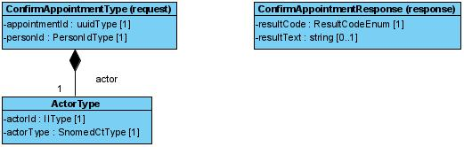

#### 7.2.4 Fältregler

Nedanstående tabell beskriver varje element i begäran och svar. Har namnet en * finns ytterligare regler för detta element och beskrivs mer i detalj i stycket Regler.

| | | | |
| :--- | :--- | :--- | :--- |
| Begäran |   |   |   |
| actor | ActorType | Typ av aktör som anropar tjänstekontraktet. Se kapitel Definition av komplexa typer för detaljerad information om hur de underliggande attributen populeras. | 1..1 |
| appointmentId | uuidType | Unikt id för bokningen som ska bekräftas. Ska uttryckas som uuid (universally unique identifier). | 1..1 |
| personId | PersonIdType (IIType) | Patientens personnummer, för den patient som tidbokningen gäller. Se kapitel Definition av komplexa typer för detaljerad information om hur de underliggande attributen populeras. | 1..1 |
| Svar |   |   |   |
| resultCode | ResultCodeEnum | Kan endast vara OK, INFO eller ERROR. | 1..1 |
| resultText | string | Kan utelämnas om resultCode = OK. / Producent förväntas skicka ett tillräckligt informativt meddelande som underlättar felsökning i de fall resultCode == ERROR | 0..1 |

#### 7.2.5 Övriga regler

Till denna informationsmängd finns regler som ej uttrycks i schemafilerna och tabellen ovan. Dessa återfinns nedan.

#### 7.2.6 Fältregler enligt schema (XSD)

Tabellen är genererad ur tjänsteschemat. Typerna beskrivs i [avsnitt 6](6-gemensamma-informationskomponenter.md).

| | | | |
| :--- | :--- | :--- | :--- |
| **Begäran** |   |   |   |
| actor | ActorType |   | 1..1 |
| ../actorId | IIType |   | 1..1 |
| ../../root | string |   | 1..1 |
| ../../extension | string |   | 0..1 |
| ../actorType | SnomedCtType |   | 1..1 |
| ../../code | string |   | 1..1 |
| ../../codeSystem | string | Tillåtna värden: 1.2.752.116.2.1.1. | 1..1 |
| ../../codeSystemName | string |   | 0..1 |
| ../../codeSystemVersion | string |   | 0..1 |
| ../../displayName | string |   | 0..1 |
| ../../originalText | string |   | 0..1 |
| appointmentId | uuidType |   | 1..1 |
| personId | PersonIdType |   | 1..1 |
| ../root | string | Tillåtna värden: 1.2.752.129.2.1.3.1, 1.2.752.129.2.1.3.3. | 1..1 |
| ../extension | string |   | 1..1 |
| **Svar** |   |   |   |
| resultCode | ResultCodeEnum |   | 1..1 |
| resultText | string |   | 0..1 |

#### 7.2.7 Tjänsteinteraktion enligt WSDL

SOAPAction: `urn:riv:supportprocess:logistics:scheduling:ConfirmAppointmentResponder:1:ConfirmAppointment`

#### 7.2.8 Källfiler (RIV-TA)

| | |
| :--- | :--- |
| [ConfirmAppointmentInteraction_1.0_RIVTABP21.wsdl](ConfirmAppointmentInteraction_1.0_RIVTABP21.wsdl) | WSDL (tjänsteinteraktion) |
| [ConfirmAppointmentResponder_1.0.xsd](ConfirmAppointmentResponder_1.0.xsd) | Tjänsteschema |
| [supportprocess_logistics_scheduling_2.0.xsd](supportprocess_logistics_scheduling_2.0.xsd) | Domänschema (delat) |
| [itintegration_registry_1.0.xsd](itintegration_registry_1.0.xsd) | LogicalAddress (SOAP-huvud) |
| [interoperability_headers_1.0.xsd](interoperability_headers_1.0.xsd) | Interoperabilitetshuvuden |
| [SjD_TP_ConfirmAppointment_1.0.docx](SjD_TP_ConfirmAppointment_1.0.docx) | Självdeklaration (tjänsteproducent) |

#### 7.2.9 FHIR-artefakter

Följande FHIR-artefakter har genererats från schemat:

* **Logisk modell (request):** [StructureDefinition/confirmappointment-request](StructureDefinition-confirmappointment-request.md)
* **Logisk modell (response):** [StructureDefinition/confirmappointment](StructureDefinition-confirmappointment.md)
* **Kodsystem:** [CodeSystem/scheduling-resultcode-cs](CodeSystem-scheduling-resultcode-cs.md)
* **ValueSet:** [ValueSet/scheduling-resultcode-vs](ValueSet-scheduling-resultcode-vs.md)

### GetAppointment

Tjänstekontraktet hämtar detalj-information om en befintlig tidbokning vid en vårdenhet, baserat på kombinationen av ett unikt boknings-id samt personnummer för patienten som bokningen gäller.

#### 7.3.1 Frivillighet

Tjänstekontraktet är obligatoriskt att stödja för tjänsteproducent.

#### 7.3.2 Version

Tjänstekontraktet finns sedan version 1.0. men har bytt namn från GetBookingDetails till GetAppointment. Nuvarande version är 2.0

#### 7.3.3 Meddelandeinformationsmodell (MIM)

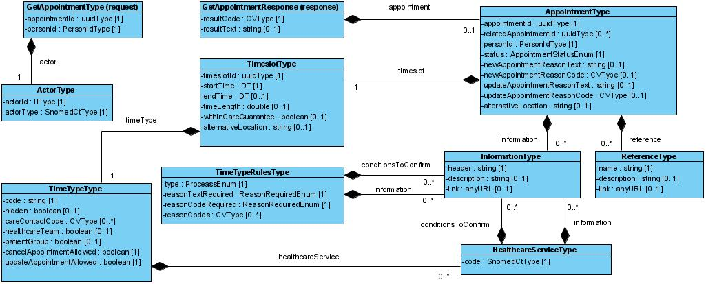

#### 7.3.4 Fältregler

Nedanstående tabell beskriver varje element i begäran och svar. Har namnet en * finns ytterligare regler för detta element och beskrivs mer i detalj i stycket Regler.

| | | | |
| :--- | :--- | :--- | :--- |
| Begäran |   |   |   |
| actor | ActorType | Typ av aktör som anropar tjänstekontraktet. Se kapitel Definition av komplexa typer för detaljerad information om hur de underliggande attributen populeras. | 1..1 |
| appointmentId | uuidType | Unikt id för bokningen. Ska uttryckas som uuid (universally unique identifier). | 1..1 |
| personId | PersonIdType (IIType) | Patientens personnummer, för den patient som tidbokningen gäller. Se kapitel Definition av komplexa typer för detaljerad information om hur de underliggande attributen populeras. | 1..1 |
| Svar |   |   |   |
| appointment | AppointmentType | Information om den aktuella tidbokningen. / Svaret tillåts vara tomt i fallet där tidbokningssystemet inte kan matcha det angivna boknings-id eller personnumret som skickades i begäran | 0..1 |
| appointment.appointmentId | uuidType | Unikt id för bokningen. Ska uttryckas som uuid (universally unique identifier). | 1..1 |
| appointment.relatedAppointmentId | uuidType | Unikt id för tidbokning(ar) som är relaterade till denna tidbokning. Ska uttryckas som uuid (universally unique identifier). | 0..* |
| appointment.timeslot | TimeslotType | Tidslucka som tidbokningen gäller | 1..1 |
| appointment.timeslot.timeslotId | uuidType | Unikt id för tidsluckan. Ska uttryckas som uuid (universally unique identifier). | 1..1 |
| appointment.timeslot.timeType | TimeTypeType | Typ av tid som uttrycker var bokningen/besöket avser | 1..1 |
| appointment.timeslot.timeType.code | string | Kod för tidstypen | 1..1 |
| appointment.timeslot.timeType.hidden | boolean | Visar huruvida tidstypen är märkt som skyddad av verksamheten – hidden=TRUE. / En skyddad tidstyp ska inte vara valbar för invånare från en lista med tidstyper som vårdcentralen erbjuder, t ex vid ett nybokningsflöde. Skyddade tidstyper ska bara kunna bokas av invånare om verksamheten tilldelat tidstypen till invånaren, t ex genom en digital kallelse eller om invånare blivit triagerad i ett försteg och resultatet därifrån resulterat i tidstypen. Om attributet utelämnas ska tidstypen anses vara ”ej skyddad”. | 0..1 |
| appointment.timeslot.timeType.careContactCode | CVType | Anger vilken typ av vårdkontakt som bokningen avser. Se Kv kontakttyp för vidare information (https://inera.atlassian.net/wiki/download/attachments/2648506471/kv_kontakttyp.xlsx?api=v2). / Observera att schemat definierar kardinaliteten så som [0..*]. Schemats kardinalitet är applicerbart då tidstypen förmedlas tillsammans med en ledig tid (tidslucka) och då verksamheten erbjuder tiden valbart så som olika kontakttyper (t ex fysiskt besök eller videomöte). När vårdkontaktstypen förmedlas tillsammans med bokningen är det redan bestämt på vilket sätt besöket ska utföras. Därav kardinaliteten [0..1] i detta kontext. | 0..1 |
| appointment.timeslot.timeType.healthcareService | HealthcareServiceType | Anger vilken typ av vårdtjänst |   |
| appointment.timeslot.timeType.healthcareTeam | boolean | Anger huruvida patienten möter ett team av personal vid besöket. Om attributet utelämnas anses besöket ej vara av typen teambokning. | 0..1 |
| appointment.timeslot.timeType.patientGroup | boolean | Bokning av tid där flera personer/patienter i grupp möter vården för samma typ av vårdtjänst. Om attributet utelämnas anses besöket ej vara av typen gruppbokning | 0..1 |
| appointment.timeslot.timeType.cancelAppointmentAllowed | boolean | Anger huruvida invånaren tillåts att avboka bokningen via e-tjänst | 1..1 |
| appointment.timeslot.timeType.updateAppointmentAllowed | boolean | Anger huruvida invånaren tillåts att omboka bokningen via e-tjänst | 1..1 |
| appointment.timeslot.timeType.appointmentRule | TimeTypeRulesType | Regler och inställningar som ska appliceras vid ett ny-/om- och avbokningsflöde. Observera kardinaliteten för attributet, endast en instans av appointmentRule får anges per flödestyp (Nybokning/Ombokning/Avbokning). | 0..3 |
| appointment.timeslot.startTime | TS (string) | Startdatum och klockslag för bokad tid, på formatet ÅÅÅÅMMDDttmmss. | 1..1 |
| appointment.timeslot endTime | TS (string) | Slutdatum och klockslag för bokad tid, på formatet ÅÅÅÅMMDDttmmss. | 1..1 |
| appointment.timeslot.timeLength | double | Längd på besöket i minuter | 0..1 |
| appointment.timeslot healthcareFacility | OrgUnitType | Vårdenheten som bokningen gäller hos | 1..1 |
| appointment.timeslot practitioner | PractitionerType | HoS-person som besöket är bokat hos. | 0..* |
| appointment.timeslot.resource | ResourceType | En resurs är något som kan tas i anspråk för eller krävs för genomförande av aktiviteter eller processer inom vård och omsorg och som inte avser personer eller organisationer. Exempel är olika typer av medicintekniska produkter inom hälso- och sjukvård och pengar som betalas ut till brukaren inom socialtjänst. | 0..* |
| appointment.timeslot.withinCareGuarantee | boolean | Flagga som visar huruvida denna tidslucka ligger inom Vårdgarantin. Flaggan är intressant att förmedla i samband med exempelvis ett nybokningsflöde, då invånaren söker efter lediga tider. Flaggan relaterar således till den tidpunkt då invånaren begärde att söka efter lediga tider. | 0..1 |
| appointment.timeslot.alternativeAddress | string | En alternativ adress som kan anges av verksamheten, kopplat till den specifika tidsluckan. Om vårdcentralen vill förmedla en alternativ adress mer generellt rekommenderas motsvarande attribut i OrgUnitType | 0..1 |
| appointment.personId | PersonIdType / (IIType) | Patientens personnummer, för den patient som tidbokningen gäller | 1..1 |
| appointment.personId.root | string | OID som definierar typ av identifierare. / 1) För PNR ska Skatteverkets oid för PNR (1.2.752.129.2.1.3.1) användas. / 2) För SNR ska Skatteverkets oid för SNR (1.2.752.129.2.1.3.3) användas. | 1..1 |
| appointment.personId.extension | string | Personnummer eller samordningsnummer | 1..1 |
| appointment.information | InformationType | Information som verksamheten vill förmedla inför besöket | 0..1 |
| appointment.status | AppointmentStatusEnum | Visar vilket tillstånd bokningen är i. Giltiga tillstånd: / 1) confirm = bokningen är bekräftad av patienten / 2) preliminary = bokningen är ännu inte bekräftad av patienten | 1..1 |
| appointment.newAppointmentReasonText | string | Patientens angivna anledning till nybokningen i fritext. | 0..1 |
| appointment.newAppointmentReasonCode | CVType | Patientens angivna anledning till nybokningen, representerad som kod. | 0..1 |
| appointment.updateAppointmentReasonText | string | Patientens angivna anledning till ombokningen i fritext. Om bokningen har ombokats i flera omgångar ska senaste anledningen anges. | 0..1 |
| appointment.updateAppointmentReasonCode | CVType | Patientens angivna anledning till ombokningen, representerad som kod. Om bokningen har ombokats i flera omgångar ska senaste anledningen anges. | 0..1 |
| appointment.alternativeLocation | string | En alternativ adress för bokningen att presentera för invånaren. En alternativ adress kan vara intressant att förmedla om besöket ska ske på annan adress än där mottagningen normalt utför besök. Fältet är frivilligt. | 0..1 |
| appointment.reference | ReferenceType | Referenser som ska förmedlas till patienten kopplat till besöket. Referenserna kan exempelvis peka på websidor öppna på nätet. | 0..* |
| resultCode | ResultCodeEnum | Kan endast vara OK, INFO eller ERROR. | 1..1 |
| resultText | string | Kan utelämnas om resultCode = OK. / Producent förväntas skicka ett tillräckligt informativt meddelande som underlättar felsökning i de fall resultCode == ERROR | 0..1 |

#### 7.3.5 Övriga regler

Till denna informationsmängd finns regler som ej uttrycks i schemafilerna och tabellen ovan. Dessa återfinns nedan.

#### 7.3.6 Fältregler enligt schema (XSD)

Tabellen är genererad ur tjänsteschemat. Typerna beskrivs i [avsnitt 6](6-gemensamma-informationskomponenter.md).

| | | | |
| :--- | :--- | :--- | :--- |
| **Begäran** |   |   |   |
| actor | ActorType |   | 1..1 |
| ../actorId | IIType |   | 1..1 |
| ../../root | string |   | 1..1 |
| ../../extension | string |   | 0..1 |
| ../actorType | SnomedCtType |   | 1..1 |
| ../../code | string |   | 1..1 |
| ../../codeSystem | string | Tillåtna värden: 1.2.752.116.2.1.1. | 1..1 |
| ../../codeSystemName | string |   | 0..1 |
| ../../codeSystemVersion | string |   | 0..1 |
| ../../displayName | string |   | 0..1 |
| ../../originalText | string |   | 0..1 |
| appointmentId | uuidType |   | 1..1 |
| personId | PersonIdType |   | 1..1 |
| ../root | string | Tillåtna värden: 1.2.752.129.2.1.3.1, 1.2.752.129.2.1.3.3. | 1..1 |
| ../extension | string |   | 1..1 |
| **Svar** |   |   |   |
| appointment | AppointmentType |   | 0..1 |
| ../appointmentId | uuidType |   | 1..1 |
| ../relatedAppointmentId | uuidType |   | 0..* |
| ../timeslot | TimeslotType |   | 1..1 |
| ../../timeslotId | uuidType |   | 1..1 |
| ../../timeType | TimeTypeType |   | 1..1 |
| ../../../code | string |   | 1..1 |
| ../../../hidden | boolean |   | 0..1 |
| ../../../careContactCode | CVType |   | 0..1 |
| ../../../../code | string |   | 1..1 |
| ../../../../codeSystem | string |   | 1..1 |
| ../../../../codeSystemName | string |   | 0..1 |
| ../../../../codeSystemVersion | string |   | 0..1 |
| ../../../../displayName | string |   | 0..1 |
| ../../../../originalText | string |   | 0..1 |
| ../../../healthcareService | HealthcareServiceType |   | 0..* |
| ../../../../code | SnomedCtType |   | 1..1 |
| ../../../../../code | string |   | 1..1 |
| ../../../../../codeSystem | string | Tillåtna värden: 1.2.752.116.2.1.1. | 1..1 |
| ../../../../../codeSystemName | string |   | 0..1 |
| ../../../../../codeSystemVersion | string |   | 0..1 |
| ../../../../../displayName | string |   | 0..1 |
| ../../../../../originalText | string |   | 0..1 |
| ../../../../information | InformationType |   | 0..* |
| ../../../../../header | string |   | 1..1 |
| ../../../../../description | string |   | 0..1 |
| ../../../../../link | anyURI |   | 0..1 |
| ../../../../conditionsToConfirm | InformationType |   | 0..* |
| ../../../../../header | string |   | 1..1 |
| ../../../../../description | string |   | 0..1 |
| ../../../../../link | anyURI |   | 0..1 |
| ../../../healthcareTeam | boolean |   | 0..1 |
| ../../../patientGroup | boolean |   | 0..1 |
| ../../../cancelAppointmentAllowed | boolean |   | 1..1 |
| ../../../updateAppointmentAllowed | boolean |   | 1..1 |
| ../../../appointmentRule | TimeTypeRulesType |   | 0..3 |
| ../../../../type | ProcessEnum |   | 1..1 |
| ../../../../reasonTextRequired | ReasonRequiredEnum |   | 1..1 |
| ../../../../reasonCodeRequired | ReasonRequiredEnum |   | 1..1 |
| ../../../../reasonCodes | CVType |   | 0..* |
| ../../../../../code | string |   | 1..1 |
| ../../../../../codeSystem | string |   | 1..1 |
| ../../../../../codeSystemName | string |   | 0..1 |
| ../../../../../codeSystemVersion | string |   | 0..1 |
| ../../../../../displayName | string |   | 0..1 |
| ../../../../../originalText | string |   | 0..1 |
| ../../../../information | InformationType |   | 0..* |
| ../../../../../header | string |   | 1..1 |
| ../../../../../description | string |   | 0..1 |
| ../../../../../link | anyURI |   | 0..1 |
| ../../../../conditionToConfirm | InformationType |   | 0..* |
| ../../../../../header | string |   | 1..1 |
| ../../../../../description | string |   | 0..1 |
| ../../../../../link | anyURI |   | 0..1 |
| ../../startTime | TS |   | 1..1 |
| ../../endTime | TS |   | 0..1 |
| ../../timeLength | double |   | 0..1 |
| ../../healthcareFacilityHSAId | HSAIdType |   | 1..1 |
| ../../../root | string |   | 1..1 |
| ../../../extension | string |   | 1..1 |
| ../../practitioner | PractitionerType |   | 0..* |
| ../../../HSAId | HSAIdType |   | 1..1 |
| ../../../../root | string |   | 1..1 |
| ../../../../extension | string |   | 1..1 |
| ../../../firstName | string |   | 1..1 |
| ../../../lastName | string |   | 1..1 |
| ../../../title | string |   | 0..1 |
| ../../resource | ResourceType |   | 0..* |
| ../../../typeOfResource | CVType |   | 0..1 |
| ../../../../code | string |   | 1..1 |
| ../../../../codeSystem | string |   | 1..1 |
| ../../../../codeSystemName | string |   | 0..1 |
| ../../../../codeSystemVersion | string |   | 0..1 |
| ../../../../displayName | string |   | 0..1 |
| ../../../../originalText | string |   | 0..1 |
| ../../../resourceAttribute | CVType |   | 0..1 |
| ../../../../code | string |   | 1..1 |
| ../../../../codeSystem | string |   | 1..1 |
| ../../../../codeSystemName | string |   | 0..1 |
| ../../../../codeSystemVersion | string |   | 0..1 |
| ../../../../displayName | string |   | 0..1 |
| ../../../../originalText | string |   | 0..1 |
| ../../../description | string |   | 0..1 |
| ../../withinCareGuarantee | boolean |   | 0..1 |
| ../../alternativeLocation | string |   | 0..1 |
| ../personId | PersonIdType |   | 1..1 |
| ../../root | string | Tillåtna värden: 1.2.752.129.2.1.3.1, 1.2.752.129.2.1.3.3. | 1..1 |
| ../../extension | string |   | 1..1 |
| ../information | InformationType |   | 0..* |
| ../../header | string |   | 1..1 |
| ../../description | string |   | 0..1 |
| ../../link | anyURI |   | 0..1 |
| ../status | AppointmentStatusEnum |   | 1..1 |
| ../newAppointmentReasonText | string |   | 0..1 |
| ../newAppointmentReasonCode | CVType |   | 0..1 |
| ../../code | string |   | 1..1 |
| ../../codeSystem | string |   | 1..1 |
| ../../codeSystemName | string |   | 0..1 |
| ../../codeSystemVersion | string |   | 0..1 |
| ../../displayName | string |   | 0..1 |
| ../../originalText | string |   | 0..1 |
| ../updateAppointmentReasonText | string |   | 0..1 |
| ../updateAppointmentReasonCode | CVType |   | 0..1 |
| ../../code | string |   | 1..1 |
| ../../codeSystem | string |   | 1..1 |
| ../../codeSystemName | string |   | 0..1 |
| ../../codeSystemVersion | string |   | 0..1 |
| ../../displayName | string |   | 0..1 |
| ../../originalText | string |   | 0..1 |
| ../alternativeLocation | string |   | 0..1 |
| ../reference | ReferenceType |   | 0..* |
| ../../name | string |   | 1..1 |
| ../../description | string |   | 0..1 |
| ../../link | anyURI |   | 0..1 |
| resultCode | ResultCodeEnum |   | 1..1 |
| resultText | string |   | 0..1 |

#### 7.3.7 Tjänsteinteraktion enligt WSDL

Tjänsteinteraktionens namn: GetAppointmentInteraction
 Beskrivning:
 Hämtar information om en befintlig bokning, baserat på bokningens unika Id.
 Revisioner:
 Tjänstedomän: supportprocess:logistics:scheduling
 Tjänsteinteraktionstyp: Fråga-Svar
 WS-profil: RIVTABP21
 Förvaltas av: Sveriges Kommuner och Landsting

SOAPAction: `urn:riv:supportprocess:logistics:scheduling:GetAppointmentResponder:2:GetAppointment`

#### 7.3.8 Källfiler (RIV-TA)

| | |
| :--- | :--- |
| [GetAppointmentInteraction_2.0_RIVTABP21.wsdl](GetAppointmentInteraction_2.0_RIVTABP21.wsdl) | WSDL (tjänsteinteraktion) |
| [GetAppointmentResponder_2.0.xsd](GetAppointmentResponder_2.0.xsd) | Tjänsteschema |
| [supportprocess_logistics_scheduling_2.0.xsd](supportprocess_logistics_scheduling_2.0.xsd) | Domänschema (delat) |
| [itintegration_registry_1.0.xsd](itintegration_registry_1.0.xsd) | LogicalAddress (SOAP-huvud) |
| [interoperability_headers_1.0.xsd](interoperability_headers_1.0.xsd) | Interoperabilitetshuvuden |
| [SjD_TP_GetAppointment_2.0.docx](SjD_TP_GetAppointment_2.0.docx) | Självdeklaration (tjänsteproducent) |

#### 7.3.9 FHIR-artefakter

Följande FHIR-artefakter har genererats från schemat:

* **Logisk modell (request):** [StructureDefinition/getappointment-request](StructureDefinition-getappointment-request.md)
* **Logisk modell (response):** [StructureDefinition/getappointment](StructureDefinition-getappointment.md)
* **Kodsystem:** [CodeSystem/scheduling-appointmentstatus-cs](CodeSystem-scheduling-appointmentstatus-cs.md)
* **ValueSet:** [ValueSet/scheduling-appointmentstatus-vs](ValueSet-scheduling-appointmentstatus-vs.md)
* **Kodsystem:** [CodeSystem/scheduling-process-cs](CodeSystem-scheduling-process-cs.md)
* **ValueSet:** [ValueSet/scheduling-process-vs](ValueSet-scheduling-process-vs.md)
* **Kodsystem:** [CodeSystem/scheduling-reasonrequired-cs](CodeSystem-scheduling-reasonrequired-cs.md)
* **ValueSet:** [ValueSet/scheduling-reasonrequired-vs](ValueSet-scheduling-reasonrequired-vs.md)
* **Kodsystem:** [CodeSystem/scheduling-resultcode-cs](CodeSystem-scheduling-resultcode-cs.md)
* **ValueSet:** [ValueSet/scheduling-resultcode-vs](ValueSet-scheduling-resultcode-vs.md)

### GetAppointments

Tjänstekontraktet hämtar lista med invånarens samtliga tidbokningar, baserat på personnummer för patienten som bokningen/bokningarna gäller. Konsument kan välja att begära filtrering på ett tidsspann, en specifik tidstyp eller vårdtjänst.

Tjänstekontraktet kan adresseras gentemot en aggregerande, sammanställande tjänst eller direkt mot en specifik vårdenhet. Svaret är en lista med paret - unika boknings-id’n per HSAId för vårdenhet.

#### 7.4.1 Frivillighet

Tjänstekontraktet är obligatoriskt att stödja för tjänsteproducent.

#### 7.4.2 Version

Ett motsvarande tjänstekontrakt som kan hämta en sammanställning av patientens bokningar finns sedan version 1.0. men har bytt namn från GetSubjectOfCareSchedule till GetAppointments. GetAppointments returnerar bara unika identifierare för tidbokningarna och vårdenheterna. Nuvarande version är 2.0

#### 7.4.3 Meddelandeinformationsmodell (MIM)

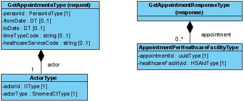

#### 7.4.4 Fältregler

Nedanstående tabell beskriver varje element i begäran och svar. Har namnet en * finns ytterligare regler för detta element och beskrivs mer i detalj i stycket Regler.

| | | | |
| :--- | :--- | :--- | :--- |
| Begäran |   |   |   |
| actor | ActorType | Typ av aktör som anropar tjänstekontraktet. Se kapitel Definition av komplexa typer för detaljerad information om hur de underliggande attributen populeras. | 1..1 |
| personId | PersonIdType (IIType) | Patientens personnummer, för den patient som tidbokningen gäller. Se kapitel Definition av komplexa typer för detaljerad information om hur de underliggande attributen populeras. | 1..1 |
| fromDate | DT | Filtrering på tidbokningar som ska äga rum fr o m datum. | 0..1 |
| toDate | DT | Filtrering på tidbokningar som ska äga rum t o m datum. | 0..1 |
| timetypeCode | string | Filtrering på tidbokningar som gäller en specifik tidstyps-kod. | 0..1 |
| healthcareServiceCode | string | Filtrering på tidbokningar som gäller en specifik vårdtjänst. Koden förväntas vara hämtad från svenska utgåvan av Snomed-CT (OID: 1.2.752.116.2.1.1) | 0..1 |
| Svar |   |   |   |
| appointment | AppointmentPerHealthcareFacilityType | Lista med tidbokningar per vårdenhet. Svaret innehåller en lista där endast den unika identifieraren för tidbokningen samt HSAId för vårdenheten returneras. | 0..* |
| appointment.appointmentId | uuidType | Unikt id för bokningen. Ska uttryckas som uuid (universally unique identifier). | 1..1 |

#### 7.4.5 Övriga regler

Till denna informationsmängd finns regler som ej uttrycks i schemafilerna och tabellen ovan. Dessa återfinns nedan.

#### 7.4.6 Fältregler enligt schema (XSD)

Tabellen är genererad ur tjänsteschemat. Typerna beskrivs i [avsnitt 6](6-gemensamma-informationskomponenter.md).

| | | | |
| :--- | :--- | :--- | :--- |
| **Begäran** |   |   |   |
| actor | ActorType |   | 1..1 |
| ../actorId | IIType |   | 1..1 |
| ../../root | string |   | 1..1 |
| ../../extension | string |   | 0..1 |
| ../actorType | SnomedCtType |   | 1..1 |
| ../../code | string |   | 1..1 |
| ../../codeSystem | string | Tillåtna värden: 1.2.752.116.2.1.1. | 1..1 |
| ../../codeSystemName | string |   | 0..1 |
| ../../codeSystemVersion | string |   | 0..1 |
| ../../displayName | string |   | 0..1 |
| ../../originalText | string |   | 0..1 |
| personId | PersonIdType |   | 1..1 |
| ../root | string | Tillåtna värden: 1.2.752.129.2.1.3.1, 1.2.752.129.2.1.3.3. | 1..1 |
| ../extension | string |   | 1..1 |
| fromDate | DT |   | 0..1 |
| toDate | DT |   | 0..1 |
| timeTypeCode | string |   | 0..1 |
| healthcareServiceCode | string |   | 0..1 |
| **Svar** |   |   |   |
| appointment | AppointmentPerHealthcareFacilityType |   | 0..* |
| ../appointmentId | uuidType |   | 1..1 |
| ../healthcareFacilityId | HSAIdType |   | 1..1 |
| ../../root | string |   | 1..1 |
| ../../extension | string |   | 1..1 |

#### 7.4.7 Tjänsteinteraktion enligt WSDL

Tjänsteinteraktionens namn: GetAppointmentsInteraction
 Beskrivning:
 Hämtar information om en eller flera befintliga bokningar.
 Revisioner:
 Tjänstedomän: supportprocess:logistics:scheduling
 Tjänsteinteraktionstyp: Fråga-Svar
 WS-profil: RIVTABP21
 Förvaltas av: Sveriges Kommuner och Landsting

SOAPAction: `urn:riv:supportprocess:logistics:scheduling:GetAppointmentsResponder:2:GetAppointments`

#### 7.4.8 Källfiler (RIV-TA)

| | |
| :--- | :--- |
| [GetAppointmentsInteraction_2.0_RIVTABP21.wsdl](GetAppointmentsInteraction_2.0_RIVTABP21.wsdl) | WSDL (tjänsteinteraktion) |
| [GetAppointmentsResponder_2.0.xsd](GetAppointmentsResponder_2.0.xsd) | Tjänsteschema |
| [supportprocess_logistics_scheduling_2.0.xsd](supportprocess_logistics_scheduling_2.0.xsd) | Domänschema (delat) |
| [itintegration_registry_1.0.xsd](itintegration_registry_1.0.xsd) | LogicalAddress (SOAP-huvud) |
| [interoperability_headers_1.0.xsd](interoperability_headers_1.0.xsd) | Interoperabilitetshuvuden |
| [SjD_TP_GetAppointments_2.0.docx](SjD_TP_GetAppointments_2.0.docx) | Självdeklaration (tjänsteproducent) |

#### 7.4.9 FHIR-artefakter

Följande FHIR-artefakter har genererats från schemat:

* **Logisk modell (request):** [StructureDefinition/getappointments-request](StructureDefinition-getappointments-request.md)
* **Logisk modell (response):** [StructureDefinition/getappointments](StructureDefinition-getappointments.md)

### GetTimeTypes

Tjänstekontraktet hämtar alla tidstyper som kan användas vid nybokning hos angiven vårdenhet. Tidstyperna kan filtreras för vald vårdtjänst, vårdpersonal och per invånare. Samtliga filter är frivilliga. En vårdenhet förväntas returnera alla tillgängliga tidstyper i fallet då konsument frågar utan att förmedla ett personnummer, ett scenario som skulle kunna vara tillämpbart i fallet då konsument implementerar administrativa funktioner kring tidstyper.

Vårdenhet har samtidigt möjlighet att märka utvalda tidstyper som skyddade. Konsumerande tjänst förväntas erbjuda dessa tidstyper endast om invånarens nybokningsflöde har föregåtts av ett kvalificerings-steg (triagering).

#### 7.5.1 Frivillighet

Tjänstekontraktet är obligatoriskt att stödja för tjänsteproducent om tjänsteproducenten stödjer nybokning.

I övrigt är tjänstekontraktet frivilligt.

#### 7.5.2 Version

Tjänstekontraktet finns sedan version 1.0. men har bytt namn från GetAllTimeTypes till GetTimeTypes. Tjänstekontraktets meddelandeinformationsmodell har samtidigt ändrats, ändringen är kompatibilitetsbrytande gentemot version 1.0. Nuvarande version är 2.0

#### 7.5.3 Meddelandeinformationsmodell (MIM)

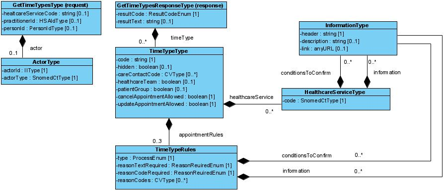

#### 7.5.4 Fältregler

Nedanstående tabell beskriver varje element i begäran och svar. Har namnet en * finns ytterligare regler för detta element och beskrivs mer i detalj i stycket Regler.

| | | | |
| :--- | :--- | :--- | :--- |
| Begäran |   |   |   |
| actor | ActorType | Typ av aktör som anropar tjänstekontraktet. Se kapitel Definition av komplexa typer för detaljerad information om hur de underliggande attributen populeras. Om anropet sker i ett flöde där lediga datum ska hämtas utan att aktören är känd ska fältet actor och fältet personId utelämnas. Detta kan exempelvis vara applicerbart om anropet sker då ingen aktör autentiserat sig (”ej inloggat läge”). | 0..1 |
| healthcareServiceCode | string | Filtrering på tidstyper som kan utföra en specifik vårdtjänst. Vårdtjänstkoden som anges här ska motsvara en kod enligt SNOMED-CT (svenska upplagan) | 0..1 |
| practitionerId | HSAIdType | Filtrering på tidstyper som erbjuds av specifik vårdpersonal | 0..1 |
| personId | PersonIdType (IIType) | Filtrering av tidstyper baserat på invånares personnummer. | 0..1 |
| Svar |   |   |   |
| timeType | TimeTypeType | Lista med tidstyper. | 0..* |
| timeType.code | string | Kod för tidstypen | 1..1 |
| timeType.hidden | boolean | Visar huruvida tidstypen är märkt som skyddad av verksamheten – hidden=TRUE. / En skyddad tidstyp ska inte vara valbar för invånare från en lista med tidstyper som vårdcentralen erbjuder, t ex vid ett nybokningsflöde. Skyddade tidstyper ska bara kunna bokas av invånare om verksamheten tilldelat tidstypen till invånaren, t ex genom en digital kallelse eller om invånare blivit triagerad i ett försteg och resultatet därifrån resulterat i tidstypen. / Om attributet utelämnas ska tidstypen anses vara ”ej skyddad”. | 0..1 |
| timeType.careContactCode | CVType | Anger vilken typ av vårdkontakt som bokningen avser. Se Kv kontakttyp för vidare information (https://inera.atlassian.net/wiki/download/attachments/2648506471/kv_kontakttyp.xlsx?api=v2). | 0..1 |
| timeType.healthcareService | boolean | Anger vilken typ av vårdtjänst | 0..* |
| timeType.healthcareTeam | boolean | Anger huruvida patienten möter ett team av personal vid besöket. Om attributet utelämnas anses besöket ej vara av typen teambokning. | 0..1 |
| timeType.patientGroup | boolean | Bokning av tid där flera personer/patienter i grupp möter vården för samma typ av vårdtjänst. Om attributet utelämnas anses besöket ej vara av typen gruppbokning. | 0..1 |
| timeType.cancelAppointmentAllowed | boolean | Anger huruvida invånaren tillåts att avboka bokningen via e-tjänst |   |
| timeType.updateAppointmentAllowed | boolean | Anger huruvida invånaren tillåts att omboka bokningen via e-tjänst |   |
| resultCode | ResultCodeEnum | Kan endast vara OK, INFO eller ERROR. | 1..1 |
| resultText | string | Kan utelämnas om resultCode = OK. / Producent förväntas skicka ett tillräckligt informativt meddelande som underlättar felsökning i de fall resultCode == ERROR | 0..1 |

#### 7.5.5 Övriga regler

Till denna informationsmängd finns regler som ej uttrycks i schemafilerna och tabellen ovan. Dessa återfinns nedan.

#### 7.5.6 Fältregler enligt schema (XSD)

Tabellen är genererad ur tjänsteschemat. Typerna beskrivs i [avsnitt 6](6-gemensamma-informationskomponenter.md).

| | | | |
| :--- | :--- | :--- | :--- |
| **Begäran** |   |   |   |
| actor | ActorType |   | 0..1 |
| ../actorId | IIType |   | 1..1 |
| ../../root | string |   | 1..1 |
| ../../extension | string |   | 0..1 |
| ../actorType | SnomedCtType |   | 1..1 |
| ../../code | string |   | 1..1 |
| ../../codeSystem | string | Tillåtna värden: 1.2.752.116.2.1.1. | 1..1 |
| ../../codeSystemName | string |   | 0..1 |
| ../../codeSystemVersion | string |   | 0..1 |
| ../../displayName | string |   | 0..1 |
| ../../originalText | string |   | 0..1 |
| healthcareServiceCode | string |   | 0..1 |
| practitionerId | HSAIdType |   | 0..1 |
| ../root | string |   | 1..1 |
| ../extension | string |   | 1..1 |
| personId | PersonIdType |   | 0..1 |
| ../root | string | Tillåtna värden: 1.2.752.129.2.1.3.1, 1.2.752.129.2.1.3.3. | 1..1 |
| ../extension | string |   | 1..1 |
| **Svar** |   |   |   |
| timeType | TimeTypeType |   | 0..* |
| ../code | string |   | 1..1 |
| ../hidden | boolean |   | 0..1 |
| ../careContactCode | CVType |   | 0..1 |
| ../../code | string |   | 1..1 |
| ../../codeSystem | string |   | 1..1 |
| ../../codeSystemName | string |   | 0..1 |
| ../../codeSystemVersion | string |   | 0..1 |
| ../../displayName | string |   | 0..1 |
| ../../originalText | string |   | 0..1 |
| ../healthcareService | HealthcareServiceType |   | 0..* |
| ../../code | SnomedCtType |   | 1..1 |
| ../../../code | string |   | 1..1 |
| ../../../codeSystem | string | Tillåtna värden: 1.2.752.116.2.1.1. | 1..1 |
| ../../../codeSystemName | string |   | 0..1 |
| ../../../codeSystemVersion | string |   | 0..1 |
| ../../../displayName | string |   | 0..1 |
| ../../../originalText | string |   | 0..1 |
| ../../information | InformationType |   | 0..* |
| ../../../header | string |   | 1..1 |
| ../../../description | string |   | 0..1 |
| ../../../link | anyURI |   | 0..1 |
| ../../conditionsToConfirm | InformationType |   | 0..* |
| ../../../header | string |   | 1..1 |
| ../../../description | string |   | 0..1 |
| ../../../link | anyURI |   | 0..1 |
| ../healthcareTeam | boolean |   | 0..1 |
| ../patientGroup | boolean |   | 0..1 |
| ../cancelAppointmentAllowed | boolean |   | 1..1 |
| ../updateAppointmentAllowed | boolean |   | 1..1 |
| ../appointmentRule | TimeTypeRulesType |   | 0..3 |
| ../../type | ProcessEnum |   | 1..1 |
| ../../reasonTextRequired | ReasonRequiredEnum |   | 1..1 |
| ../../reasonCodeRequired | ReasonRequiredEnum |   | 1..1 |
| ../../reasonCodes | CVType |   | 0..* |
| ../../../code | string |   | 1..1 |
| ../../../codeSystem | string |   | 1..1 |
| ../../../codeSystemName | string |   | 0..1 |
| ../../../codeSystemVersion | string |   | 0..1 |
| ../../../displayName | string |   | 0..1 |
| ../../../originalText | string |   | 0..1 |
| ../../information | InformationType |   | 0..* |
| ../../../header | string |   | 1..1 |
| ../../../description | string |   | 0..1 |
| ../../../link | anyURI |   | 0..1 |
| ../../conditionToConfirm | InformationType |   | 0..* |
| ../../../header | string |   | 1..1 |
| ../../../description | string |   | 0..1 |
| ../../../link | anyURI |   | 0..1 |
| resultCode | ResultCodeEnum |   | 1..1 |
| resultText | string |   | 0..1 |

#### 7.5.7 Tjänsteinteraktion enligt WSDL

Tjänsteinteraktionens namn: GetTimeTypesInteraction
 Beskrivning:
 Lista besökstyper för nybokning
 Revisioner:
 Tjänstedomän: supportprocess:logistics:scheduling
 Tjänsteinteraktionstyp: Fråga-Svar
 WS-profil: RIVTABP21
 Förvaltas av: Sveriges Kommuner och Landsting

SOAPAction: `urn:riv:supportprocess:logistics:scheduling:GetTimeTypesResponder:2:GetTimeTypes`

#### 7.5.8 Källfiler (RIV-TA)

| | |
| :--- | :--- |
| [GetTimeTypesInteraction_2.0_RIVTABP21.wsdl](GetTimeTypesInteraction_2.0_RIVTABP21.wsdl) | WSDL (tjänsteinteraktion) |
| [GetTimeTypesResponder_2.0.xsd](GetTimeTypesResponder_2.0.xsd) | Tjänsteschema |
| [supportprocess_logistics_scheduling_2.0.xsd](supportprocess_logistics_scheduling_2.0.xsd) | Domänschema (delat) |
| [itintegration_registry_1.0.xsd](itintegration_registry_1.0.xsd) | LogicalAddress (SOAP-huvud) |
| [interoperability_headers_1.0.xsd](interoperability_headers_1.0.xsd) | Interoperabilitetshuvuden |
| [SjD_TP_GetTimeTypes_2.0.docx](SjD_TP_GetTimeTypes_2.0.docx) | Självdeklaration (tjänsteproducent) |

#### 7.5.9 FHIR-artefakter

Följande FHIR-artefakter har genererats från schemat:

* **Logisk modell (request):** [StructureDefinition/gettimetypes-request](StructureDefinition-gettimetypes-request.md)
* **Logisk modell (response):** [StructureDefinition/gettimetypes](StructureDefinition-gettimetypes.md)
* **Kodsystem:** [CodeSystem/scheduling-process-cs](CodeSystem-scheduling-process-cs.md)
* **ValueSet:** [ValueSet/scheduling-process-vs](ValueSet-scheduling-process-vs.md)
* **Kodsystem:** [CodeSystem/scheduling-reasonrequired-cs](CodeSystem-scheduling-reasonrequired-cs.md)
* **ValueSet:** [ValueSet/scheduling-reasonrequired-vs](ValueSet-scheduling-reasonrequired-vs.md)
* **Kodsystem:** [CodeSystem/scheduling-resultcode-cs](CodeSystem-scheduling-resultcode-cs.md)
* **ValueSet:** [ValueSet/scheduling-resultcode-vs](ValueSet-scheduling-resultcode-vs.md)

### GetAvailableDates

Tjänstekontraktet hämtar datum med lediga tider för angivet datumintervall. Vid anrop för att hämta datum med lediga tider gällande en ombokning skickar konsument den ursprungliga tidbokningens unika bokningsId. På så sätt kan en producent ta hänsyn till vilken vårdpersonal eller vilken/vilka resurs(er) som var allokerade för ursprungsbokningen och därmed endast returnera sådana datum som matchar de kriterier som vårdenhet bestämt. Observera att passerade tider inte ska returneras av producenten.

Tjänstekontraktet returnerar datum med lediga tider som är bokningsbara online för angiven invånare. För varje datum som returneras kan producenten dessutom ange hur många lediga tider det finns för datumet. Om konsument inte angivit tidstypskod, HSAId för vårdpersonal eller vårdtjänstkod i begäran och de lediga tiderna är relaterade till olika tidstyper, vårdpersonal eller vårdtjänster ska producent returnera samma datum flera gånger, en gång per kombination av dessa.

#### 7.6.1 Frivillighet

Tjänstekontraktet är obligatorisk om vårdenhet (producenten) erbjuder flöde för nybokning eller ombokning. För övriga flöden är tjänsten frivillig.

#### 7.6.2 Version

Tjänstekontraktet finns sedan version 1.0. Aktuell version är 2.0. Tjänstekontraktets meddelandeinformationsmodell har förändrats sedan föregående version med följd att kompatibiliteten har brutits.

#### 7.6.3 Meddelandeinformationsmodell (MIM)

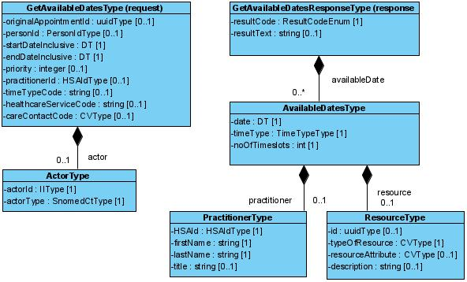

#### 7.6.4 Fältregler

Nedanstående tabell beskriver varje element i begäran och svar. Har namnet en * finns ytterligare regler för detta element och beskrivs mer i detalj i stycket Regler.

| | | | |
| :--- | :--- | :--- | :--- |
| Begäran |   |   |   |
| actor | ActorType | Typ av aktör som anropar tjänstekontraktet. Se kapitel Definition av komplexa typer för detaljerad information om hur de underliggande attributen populeras. Om anropet sker i ett flöde där lediga datum ska hämtas utan att aktören är känd ska fältet actor och fältet personId utelämnas. Detta kan exempelvis vara applicerbart om anropet sker då ingen aktör autentiserat sig (”ej inloggat läge”). | 0..1 |
| originalAppointementId | uuidType | Unikt id för ursprungsbokningen Används för att indikera ombokning, så att tjänsteproducenten kan anpassa svaret till tider som är giltiga för ombokning av angiven ursprungsbokning. Ska uttryckas som uuid (universally unique identifier). | 0..1 |
| personId | PersonIdType (IIType) | Filtrering av tidstyper baserat på invånares personnummer. Se kapitel Definition av komplexa typer för detaljerad information om hur de underliggande attributen populeras. | 0..1 |
| startDateInclusive | DT (string) | Datum från och med för de lediga tider som skall sökas ut, på formatet ÅÅÅÅMMDD. | 1..1 |
| endDateInclusive | DT (string) | Datum till och med för de lediga tider som skall sökas ut, på formatet ÅÅÅÅMMDD. | 1..1 |
| priority | integer | Konsumentens prioritering av behovet för bokning/besök. Prioritet bestäms av ett steg som föregås av tidbokningen. Exempel på sådant försteg kan vara en tjänst som triagerar invånaren/patienten. Prioritet bör inte gå att väljas av invånaren själv. | 0..1 |
| practitionerId | HsaIdType (string) | HSA-id för HoS-personal att filtrera lediga tider på. | 0..1 |
| timeTypeCode | string | Tidstyp att söka lediga datum för. / En konsument kan välja att söka lediga tider på antingen tidstyp eller vårdtjänst. Båda ska inte sättas i samma anrop. | 0..1 |
| healthcareServiceCode | string | Vårdtjänst att söka lediga datum för. En konsument kan välja att söka lediga tider på antingen tidstyp eller vårdtjänst. Båda ska inte sättas i samma anrop. Koden som anges ska motsvara en SnomedCT-kod | 0..1 |
| careContactCode | CVType | Kontaktsätt att söka lediga datum för. | 0..1 |
| careContactCode.code | string | Kod för det kontaktsätt som konsument söker efter lediga datum | 1..1 |
| careContactCode.codeSystem | string | Konsument rekommenderas att även ange vilket kodsystem som kod för kontaktsätt innefattas i. | 0..1 |
| Svar |   |   |   |
| availableDate | AvailableDateType | Lista med datum där det finns lediga tider | 0..* |
| availableDate .date | DT | Ledigt datum. | 1..1 |
| availableDate.noOfTimeslots | integer | Antal lediga tider som finns på datumet | 1..1 |
| availableDate.timeType | TimeTypeType | Tidstyp som de lediga tiderna gäller | 1..1 |
| availableDate.practitioner | PractionerType | Personal som är relaterad till de lediga tiderna | 0..1 |
| availableDate.resource | ResourceType | Resurs som är relaterad till de lediga tiderna | 0..1 |
| resultCode | ResultCodeEnum | Kan endast vara OK, INFO eller ERROR. | 1..1 |
| resultText | string | Kan utelämnas om resultCode = OK. / Producent förväntas skicka ett tillräckligt informativt meddelande som underlättar felsökning i de fall resultCode == ERROR | 0..1 |

#### 7.6.5 Fältregler enligt schema (XSD)

Tabellen är genererad ur tjänsteschemat. Typerna beskrivs i [avsnitt 6](6-gemensamma-informationskomponenter.md).

| | | | |
| :--- | :--- | :--- | :--- |
| **Begäran** |   |   |   |
| actor | ActorType |   | 0..1 |
| ../actorId | IIType |   | 1..1 |
| ../../root | string |   | 1..1 |
| ../../extension | string |   | 0..1 |
| ../actorType | SnomedCtType |   | 1..1 |
| ../../code | string |   | 1..1 |
| ../../codeSystem | string | Tillåtna värden: 1.2.752.116.2.1.1. | 1..1 |
| ../../codeSystemName | string |   | 0..1 |
| ../../codeSystemVersion | string |   | 0..1 |
| ../../displayName | string |   | 0..1 |
| ../../originalText | string |   | 0..1 |
| originalAppointmentId | uuidType |   | 0..1 |
| personId | PersonIdType |   | 0..1 |
| ../root | string | Tillåtna värden: 1.2.752.129.2.1.3.1, 1.2.752.129.2.1.3.3. | 1..1 |
| ../extension | string |   | 1..1 |
| startDateInclusive | DT |   | 1..1 |
| endDateInclusive | DT |   | 1..1 |
| priority | int |   | 0..1 |
| practitionerId | HSAIdType |   | 0..1 |
| ../root | string |   | 1..1 |
| ../extension | string |   | 1..1 |
| timeTypeCode | string |   | 0..1 |
| healthcareServiceCode | string |   | 0..1 |
| careContactCode | CVType |   | 0..1 |
| ../code | string |   | 1..1 |
| ../codeSystem | string |   | 1..1 |
| ../codeSystemName | string |   | 0..1 |
| ../codeSystemVersion | string |   | 0..1 |
| ../displayName | string |   | 0..1 |
| ../originalText | string |   | 0..1 |
| **Svar** |   |   |   |
| availableDate | AvailableDateType |   | 0..* |
| ../date | DT |   | 1..1 |
| ../noOfTimeslots | int |   | 1..1 |
| ../timeType | TimeTypeType |   | 1..1 |
| ../../code | string |   | 1..1 |
| ../../hidden | boolean |   | 0..1 |
| ../../careContactCode | CVType |   | 0..1 |
| ../../../code | string |   | 1..1 |
| ../../../codeSystem | string |   | 1..1 |
| ../../../codeSystemName | string |   | 0..1 |
| ../../../codeSystemVersion | string |   | 0..1 |
| ../../../displayName | string |   | 0..1 |
| ../../../originalText | string |   | 0..1 |
| ../../healthcareService | HealthcareServiceType |   | 0..* |
| ../../../code | SnomedCtType |   | 1..1 |
| ../../../../code | string |   | 1..1 |
| ../../../../codeSystem | string | Tillåtna värden: 1.2.752.116.2.1.1. | 1..1 |
| ../../../../codeSystemName | string |   | 0..1 |
| ../../../../codeSystemVersion | string |   | 0..1 |
| ../../../../displayName | string |   | 0..1 |
| ../../../../originalText | string |   | 0..1 |
| ../../../information | InformationType |   | 0..* |
| ../../../../header | string |   | 1..1 |
| ../../../../description | string |   | 0..1 |
| ../../../../link | anyURI |   | 0..1 |
| ../../../conditionsToConfirm | InformationType |   | 0..* |
| ../../../../header | string |   | 1..1 |
| ../../../../description | string |   | 0..1 |
| ../../../../link | anyURI |   | 0..1 |
| ../../healthcareTeam | boolean |   | 0..1 |
| ../../patientGroup | boolean |   | 0..1 |
| ../../cancelAppointmentAllowed | boolean |   | 1..1 |
| ../../updateAppointmentAllowed | boolean |   | 1..1 |
| ../../appointmentRule | TimeTypeRulesType |   | 0..3 |
| ../../../type | ProcessEnum |   | 1..1 |
| ../../../reasonTextRequired | ReasonRequiredEnum |   | 1..1 |
| ../../../reasonCodeRequired | ReasonRequiredEnum |   | 1..1 |
| ../../../reasonCodes | CVType |   | 0..* |
| ../../../../code | string |   | 1..1 |
| ../../../../codeSystem | string |   | 1..1 |
| ../../../../codeSystemName | string |   | 0..1 |
| ../../../../codeSystemVersion | string |   | 0..1 |
| ../../../../displayName | string |   | 0..1 |
| ../../../../originalText | string |   | 0..1 |
| ../../../information | InformationType |   | 0..* |
| ../../../../header | string |   | 1..1 |
| ../../../../description | string |   | 0..1 |
| ../../../../link | anyURI |   | 0..1 |
| ../../../conditionToConfirm | InformationType |   | 0..* |
| ../../../../header | string |   | 1..1 |
| ../../../../description | string |   | 0..1 |
| ../../../../link | anyURI |   | 0..1 |
| ../practitioner | PractitionerType |   | 0..1 |
| ../../HSAId | HSAIdType |   | 1..1 |
| ../../../root | string |   | 1..1 |
| ../../../extension | string |   | 1..1 |
| ../../firstName | string |   | 1..1 |
| ../../lastName | string |   | 1..1 |
| ../../title | string |   | 0..1 |
| ../resource | ResourceType |   | 0..1 |
| ../../typeOfResource | CVType |   | 0..1 |
| ../../../code | string |   | 1..1 |
| ../../../codeSystem | string |   | 1..1 |
| ../../../codeSystemName | string |   | 0..1 |
| ../../../codeSystemVersion | string |   | 0..1 |
| ../../../displayName | string |   | 0..1 |
| ../../../originalText | string |   | 0..1 |
| ../../resourceAttribute | CVType |   | 0..1 |
| ../../../code | string |   | 1..1 |
| ../../../codeSystem | string |   | 1..1 |
| ../../../codeSystemName | string |   | 0..1 |
| ../../../codeSystemVersion | string |   | 0..1 |
| ../../../displayName | string |   | 0..1 |
| ../../../originalText | string |   | 0..1 |
| ../../description | string |   | 0..1 |
| resultCode | ResultCodeEnum |   | 1..1 |
| resultText | string |   | 0..1 |

#### 7.6.6 Tjänsteinteraktion enligt WSDL

Tjänsteinteraktionens namn: GetAvailableDatesInteraction
 Beskrivning:
 Lista datum med bokningsbara tider
 Revisioner:
 Tjänstedomän: supportprocess:logistics:scheduling
 Tjänsteinteraktionstyp: Fråga-Svar
 WS-profil: RIVTABP21
 Förvaltas av: Sveriges Kommuner och Landsting

SOAPAction: `urn:riv:supportprocess:logistics:scheduling:GetAvailableDatesResponder:2:GetAvailableDates`

#### 7.6.7 Källfiler (RIV-TA)

| | |
| :--- | :--- |
| [GetAvailableDatesInteraction_2.0_RIVTABP21.wsdl](GetAvailableDatesInteraction_2.0_RIVTABP21.wsdl) | WSDL (tjänsteinteraktion) |
| [GetAvailableDatesResponder_2.0.xsd](GetAvailableDatesResponder_2.0.xsd) | Tjänsteschema |
| [supportprocess_logistics_scheduling_2.0.xsd](supportprocess_logistics_scheduling_2.0.xsd) | Domänschema (delat) |
| [itintegration_registry_1.0.xsd](itintegration_registry_1.0.xsd) | LogicalAddress (SOAP-huvud) |
| [interoperability_headers_1.0.xsd](interoperability_headers_1.0.xsd) | Interoperabilitetshuvuden |
| [SjD_TP_GetAvailableDates_2.0.docx](SjD_TP_GetAvailableDates_2.0.docx) | Självdeklaration (tjänsteproducent) |

#### 7.6.8 FHIR-artefakter

Följande FHIR-artefakter har genererats från schemat:

* **Logisk modell (request):** [StructureDefinition/getavailabledates-request](StructureDefinition-getavailabledates-request.md)
* **Logisk modell (response):** [StructureDefinition/getavailabledates](StructureDefinition-getavailabledates.md)
* **Kodsystem:** [CodeSystem/scheduling-process-cs](CodeSystem-scheduling-process-cs.md)
* **ValueSet:** [ValueSet/scheduling-process-vs](ValueSet-scheduling-process-vs.md)
* **Kodsystem:** [CodeSystem/scheduling-reasonrequired-cs](CodeSystem-scheduling-reasonrequired-cs.md)
* **ValueSet:** [ValueSet/scheduling-reasonrequired-vs](ValueSet-scheduling-reasonrequired-vs.md)
* **Kodsystem:** [CodeSystem/scheduling-resultcode-cs](CodeSystem-scheduling-resultcode-cs.md)
* **ValueSet:** [ValueSet/scheduling-resultcode-vs](ValueSet-scheduling-resultcode-vs.md)

### GetAvailableTimeslots

Tjänstekontraktet hämtar lediga tider för angivet datumintervall. Vid anrop för ombokning skickar konsument den ursprungliga tidbokningens unika bokningsId. På så sätt kan en producent ta hänsyn till vilken vårdpersonal eller vilken/vilka resurs(er) som var allokerade för ursprungsbokningen och därmed endast returnera sådana datum som matchar de kriter som vårdenhet bestämt. Observera att passerade tider inte ska returneras av tjänstekontraktet.

Tjänstekontraktet returnerar lediga tider som är bokningsbara online för angiven invånare.

Vid anrop för ombokning styr tidstyp och resurs från ursprungsbokningen vilka datum som returneras. Om det är nybokning hämtas tillgängliga datum utifrån tidstyp. Observera att passerade tider inte ska returneras av tjänsten (tider som är historiskt bokbara).

#### 7.7.1 Frivillighet

Tjänsten är obligatorisk om vårdenhet erbjuder nybokning eller ombokning. För övriga är tjänsten frivillig.

#### 7.7.2 Version

Tjänsten finns sedan version 1.0. Tjänsten har inte förändrats sedan version 1.1. Aktuell version är 2.0.

#### 7.7.3 Meddelandeinformationsmodell (MIM)

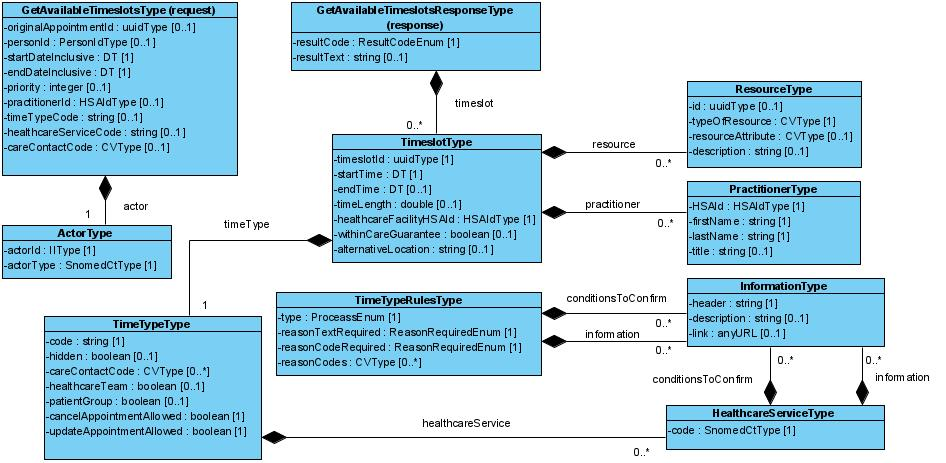

#### 7.7.4 Fältregler

Nedanstående tabell beskriver varje element i begäran och svar. Har namnet en * finns ytterligare regler för detta element och beskrivs mer i detalj i stycket Regler.

| | | | |
| :--- | :--- | :--- | :--- |
| Begäran |   |   |   |
| actor | ActorType | Typ av aktör som anropar tjänstekontraktet. Se kapitel Definition av komplexa typer för detaljerad information om hur de underliggande attributen populeras. Om anropet sker i ett flöde där lediga tider ska hämtas utan att aktören är känd ska fältet actor och fältet personId utelämnas. Detta kan exempelvis vara applicerbart om anropet sker då ingen aktör autentiserat sig (”ej inloggat läge”). | 0..1 |
| originalAppointementId | uuidType | Unikt id för ursprungsbokningen Används för att indikera ombokning, så att tjänsteproducenten kan anpassa svaret till tider som är giltiga för ombokning av angiven ursprungsbokning. Ska uttryckas som uuid (universally unique identifier). | 0..1 |
| personId | PersonIdType (IIType) | Filtrering av tidstyper baserat på invånares personnummer. Se kapitel Definition av komplexa typer för detaljerad information om hur de underliggande attributen populeras. | 0..1 |
| startDateInclusive | DT (string) | Datum från och med för de lediga tider som skall sökas ut, på formatet ÅÅÅÅMMDD. | 1..1 |
| endDateInclusive | DT (string) | Datum till och med för de lediga tider som skall sökas ut, på formatet ÅÅÅÅMMDD. | 1..1 |
| priority | Integer | Konsumentens prioritering av behovet för bokning/besök. Prioritet bestäms av ett steg som föregås av tidbokningen. Exempel på sådant försteg kan vara en tjänst som triagerar invånaren/patienten. Prioritet bör inte gå att väljas av invånaren själv. | 0..1 |
| practitionerId | HsaIdType (string) | HSA-id för HoS-personal. | 0..1 |
| timeTypeCode | string | Tidstyp att söka lediga datum för. / En konsument kan välja att söka lediga tider på antingen tidstyp eller vårdtjänst. Båda ska inte sättas i samma anrop. | 0..1 |
| healthcareServiceCode | string | Vårdtjänst att söka lediga datum för. En konsument kan välja att söka lediga tider på antingen tidstyp eller vårdtjänst. Båda ska inte sättas i samma anrop. Kod för vårdtjänst ska uttryckas som en Snomed-CT kod (svensk utgåva). | 0..1 |
| careContactCode | CVType | Kontaktsätt att söka lediga datum för. | 0..1 |
| Svar |   |   |   |
| timeslot | TimeslotType | List med lediga tider | 0..* |
| timeslot.timeslotId | uuidType | Unikt id för tidsluckan. Ska uttryckas som uuid (universally unique identifier). | 1..1 |
| timeslot.timeType | TimeTypeType | Typ av tid som uttrycker var bokningen/besöket avser. Se datatypen TimeTypeType för vidare information. | 1..1 |
| timeslot.startTime | TS (string) | Startdatum och klockslag för bokad tid, på formatet ÅÅÅÅMMDDttmmss. | 1..1 |
| timeslot.endTime | TS (string) | Slutdatum och klockslag för bokad tid, på formatet ÅÅÅÅMMDDttmmss. | 0..1 |
| timeslot.timeLength | double | Längd på besöket i minuter | 0..1 |
| timeslot.healthcareFacilityHSAId | HSAIdType | HSAId för vårdenheten som bokningen gäller hos. | 1..1 |
| timeslot.practitioner | PractitionerType | HoS-person som besöket är bokat hos. Se datatypen PractitionerType för vidare information. | 0..* |
| timeslot.resource | ResourceType | En resurs är något som kan tas i anspråk för eller krävs för genomförande av aktiviteter eller processer inom vård och omsorg och som inte avser personer eller organisationer. Exempel är olika typer av medicintekniska produkter inom hälso- och sjukvård och pengar som betalas ut till brukaren inom socialtjänst. / Se datatypen ResourceType för vidare information. | 0..1 |
| timeslot.withinCareGuarantee | boolean | Flagga som visar huruvida denna tidslucka ligger inom Vårdgarantin. Flaggan är intressant att förmedla i samband med exempelvis ett nybokningsflöde, då invånaren söker efter lediga tider. Flaggan relaterar således till den tidpunkt då invånaren begärde att söka efter lediga tider. Om attributet utesluts kan en konsument inte dra slutsatser huruvida den erbjudna lediga tiden ligger inom eller utom vårdgarantin. | 0..1 |
| timeslot.alternativeAddress | string | En alternativ adress som kan anges av verksamheten, kopplat till den specifika tidsluckan. Om vårdcentralen vill förmedla en alternativ adress mer generellt rekommenderas motsvarande attribut i OrgUnitType | 0..1 |
| resultCode | ResultCodeEnum | Kan endast vara OK, INFO eller ERROR. | 1..1 |
| resultText | string | Kan utelämnas om resultCode = OK. / Producent förväntas skicka ett tillräckligt informativt meddelande som underlättar felsökning i de fall resultCode == ERROR | 0..1 |

#### 7.7.5 Fältregler enligt schema (XSD)

Tabellen är genererad ur tjänsteschemat. Typerna beskrivs i [avsnitt 6](6-gemensamma-informationskomponenter.md).

| | | | |
| :--- | :--- | :--- | :--- |
| **Begäran** |   |   |   |
| actor | ActorType |   | 0..1 |
| ../actorId | IIType |   | 1..1 |
| ../../root | string |   | 1..1 |
| ../../extension | string |   | 0..1 |
| ../actorType | SnomedCtType |   | 1..1 |
| ../../code | string |   | 1..1 |
| ../../codeSystem | string | Tillåtna värden: 1.2.752.116.2.1.1. | 1..1 |
| ../../codeSystemName | string |   | 0..1 |
| ../../codeSystemVersion | string |   | 0..1 |
| ../../displayName | string |   | 0..1 |
| ../../originalText | string |   | 0..1 |
| originalAppointmentId | uuidType |   | 0..1 |
| personId | PersonIdType |   | 0..1 |
| ../root | string | Tillåtna värden: 1.2.752.129.2.1.3.1, 1.2.752.129.2.1.3.3. | 1..1 |
| ../extension | string |   | 1..1 |
| startDateInclusive | DT |   | 1..1 |
| endDateInclusive | DT |   | 1..1 |
| priority | int |   | 0..1 |
| practitionerId | HSAIdType |   | 0..1 |
| ../root | string |   | 1..1 |
| ../extension | string |   | 1..1 |
| timeTypeCode | string |   | 0..1 |
| healthcareServiceCode | string |   | 0..1 |
| careContactCode | CVType |   | 0..* |
| ../code | string |   | 1..1 |
| ../codeSystem | string |   | 1..1 |
| ../codeSystemName | string |   | 0..1 |
| ../codeSystemVersion | string |   | 0..1 |
| ../displayName | string |   | 0..1 |
| ../originalText | string |   | 0..1 |
| **Svar** |   |   |   |
| timeslot | TimeslotType |   | 0..* |
| ../timeslotId | uuidType |   | 1..1 |
| ../timeType | TimeTypeType |   | 1..1 |
| ../../code | string |   | 1..1 |
| ../../hidden | boolean |   | 0..1 |
| ../../careContactCode | CVType |   | 0..1 |
| ../../../code | string |   | 1..1 |
| ../../../codeSystem | string |   | 1..1 |
| ../../../codeSystemName | string |   | 0..1 |
| ../../../codeSystemVersion | string |   | 0..1 |
| ../../../displayName | string |   | 0..1 |
| ../../../originalText | string |   | 0..1 |
| ../../healthcareService | HealthcareServiceType |   | 0..* |
| ../../../code | SnomedCtType |   | 1..1 |
| ../../../../code | string |   | 1..1 |
| ../../../../codeSystem | string | Tillåtna värden: 1.2.752.116.2.1.1. | 1..1 |
| ../../../../codeSystemName | string |   | 0..1 |
| ../../../../codeSystemVersion | string |   | 0..1 |
| ../../../../displayName | string |   | 0..1 |
| ../../../../originalText | string |   | 0..1 |
| ../../../information | InformationType |   | 0..* |
| ../../../../header | string |   | 1..1 |
| ../../../../description | string |   | 0..1 |
| ../../../../link | anyURI |   | 0..1 |
| ../../../conditionsToConfirm | InformationType |   | 0..* |
| ../../../../header | string |   | 1..1 |
| ../../../../description | string |   | 0..1 |
| ../../../../link | anyURI |   | 0..1 |
| ../../healthcareTeam | boolean |   | 0..1 |
| ../../patientGroup | boolean |   | 0..1 |
| ../../cancelAppointmentAllowed | boolean |   | 1..1 |
| ../../updateAppointmentAllowed | boolean |   | 1..1 |
| ../../appointmentRule | TimeTypeRulesType |   | 0..3 |
| ../../../type | ProcessEnum |   | 1..1 |
| ../../../reasonTextRequired | ReasonRequiredEnum |   | 1..1 |
| ../../../reasonCodeRequired | ReasonRequiredEnum |   | 1..1 |
| ../../../reasonCodes | CVType |   | 0..* |
| ../../../../code | string |   | 1..1 |
| ../../../../codeSystem | string |   | 1..1 |
| ../../../../codeSystemName | string |   | 0..1 |
| ../../../../codeSystemVersion | string |   | 0..1 |
| ../../../../displayName | string |   | 0..1 |
| ../../../../originalText | string |   | 0..1 |
| ../../../information | InformationType |   | 0..* |
| ../../../../header | string |   | 1..1 |
| ../../../../description | string |   | 0..1 |
| ../../../../link | anyURI |   | 0..1 |
| ../../../conditionToConfirm | InformationType |   | 0..* |
| ../../../../header | string |   | 1..1 |
| ../../../../description | string |   | 0..1 |
| ../../../../link | anyURI |   | 0..1 |
| ../startTime | TS |   | 1..1 |
| ../endTime | TS |   | 0..1 |
| ../timeLength | double |   | 0..1 |
| ../healthcareFacilityHSAId | HSAIdType |   | 1..1 |
| ../../root | string |   | 1..1 |
| ../../extension | string |   | 1..1 |
| ../practitioner | PractitionerType |   | 0..* |
| ../../HSAId | HSAIdType |   | 1..1 |
| ../../../root | string |   | 1..1 |
| ../../../extension | string |   | 1..1 |
| ../../firstName | string |   | 1..1 |
| ../../lastName | string |   | 1..1 |
| ../../title | string |   | 0..1 |
| ../resource | ResourceType |   | 0..* |
| ../../typeOfResource | CVType |   | 0..1 |
| ../../../code | string |   | 1..1 |
| ../../../codeSystem | string |   | 1..1 |
| ../../../codeSystemName | string |   | 0..1 |
| ../../../codeSystemVersion | string |   | 0..1 |
| ../../../displayName | string |   | 0..1 |
| ../../../originalText | string |   | 0..1 |
| ../../resourceAttribute | CVType |   | 0..1 |
| ../../../code | string |   | 1..1 |
| ../../../codeSystem | string |   | 1..1 |
| ../../../codeSystemName | string |   | 0..1 |
| ../../../codeSystemVersion | string |   | 0..1 |
| ../../../displayName | string |   | 0..1 |
| ../../../originalText | string |   | 0..1 |
| ../../description | string |   | 0..1 |
| ../withinCareGuarantee | boolean |   | 0..1 |
| ../alternativeLocation | string |   | 0..1 |
| resultCode | ResultCodeEnum |   | 1..1 |
| resultText | string |   | 0..1 |

#### 7.7.6 Tjänsteinteraktion enligt WSDL

Tjänsteinteraktionens namn: GetAvailableTimeslotsInteraction
 Beskrivning:
 Lista bokningsbara tider
 Revisioner:
 Tjänstedomän: supportprocess:logistics:scheduling
 Tjänsteinteraktionstyp: Fråga-Svar
 WS-profil: RIVTABP21
 Förvaltas av: Sveriges Kommuner och Landsting

SOAPAction: `urn:riv:supportprocess:logistics:scheduling:GetAvailableTimeslotsResponder:2:GetAvailableTimeslots`

#### 7.7.7 Källfiler (RIV-TA)

| | |
| :--- | :--- |
| [GetAvailableTimeslotsInteraction_2.0_RIVTABP21.wsdl](GetAvailableTimeslotsInteraction_2.0_RIVTABP21.wsdl) | WSDL (tjänsteinteraktion) |
| [GetAvailableTimeslotsResponder_2.0.xsd](GetAvailableTimeslotsResponder_2.0.xsd) | Tjänsteschema |
| [supportprocess_logistics_scheduling_2.0.xsd](supportprocess_logistics_scheduling_2.0.xsd) | Domänschema (delat) |
| [itintegration_registry_1.0.xsd](itintegration_registry_1.0.xsd) | LogicalAddress (SOAP-huvud) |
| [interoperability_headers_1.0.xsd](interoperability_headers_1.0.xsd) | Interoperabilitetshuvuden |
| [SjD_TP_GetAvailableTimeslots_2.0.docx](SjD_TP_GetAvailableTimeslots_2.0.docx) | Självdeklaration (tjänsteproducent) |

#### 7.7.8 FHIR-artefakter

Följande FHIR-artefakter har genererats från schemat:

* **Logisk modell (request):** [StructureDefinition/getavailabletimeslots-request](StructureDefinition-getavailabletimeslots-request.md)
* **Logisk modell (response):** [StructureDefinition/getavailabletimeslots](StructureDefinition-getavailabletimeslots.md)
* **Kodsystem:** [CodeSystem/scheduling-process-cs](CodeSystem-scheduling-process-cs.md)
* **ValueSet:** [ValueSet/scheduling-process-vs](ValueSet-scheduling-process-vs.md)
* **Kodsystem:** [CodeSystem/scheduling-reasonrequired-cs](CodeSystem-scheduling-reasonrequired-cs.md)
* **ValueSet:** [ValueSet/scheduling-reasonrequired-vs](ValueSet-scheduling-reasonrequired-vs.md)
* **Kodsystem:** [CodeSystem/scheduling-resultcode-cs](CodeSystem-scheduling-resultcode-cs.md)
* **ValueSet:** [ValueSet/scheduling-resultcode-vs](ValueSet-scheduling-resultcode-vs.md)

### GetHealthcareFacilities

Tjänstekontrakt för att hämta alla vårdenheter som erbjuds för nybokning eller ombokning för aktuell invånare (vårdenhet i begäran representerar då den kallande organisationen). Detta tjänstekontrakt följer inte riktigt samma mönster som övriga tjänstekontrakt, genom att vårdenheten som får begäran i någon mening agerar ställföreträdare för en sortiments- och utbudskatalog och därigenom svarar för andra vårdenheters räkning. Det är dock underförstått att de vårdenheter som listas i svaret utför samma typ av behandling som den vårdenhet som fick begäran och följer samma kodverk för AppointmentType (tidstyp), HealthcareService(s) (vårdtjänster) etc. Det är den svarande vårdenhetens ansvar att de vårdenheter som listas i svaret är bokningsbara, rent avtalsmässigt och att de har stöd för online-bokning enligt dessa tjänstekontrakt.

Tjänstekontraktet returnerar en lista av vårdenheter som kan bokas online av angiven invånare. Om originalAppointmentId är med i begäran, returneras endast vårdenheter som är valbara vid ombokning av just angiven bokning.

Förtydligande:

I listan med vårdenheter i svaret ska även den vårdenhet som svarar på frågan finnas med om denna erbjuder tider för aktuell behandling. D.v.s. det ska inte vara underförstått för konsumenten att den svarande vårdenheten alltid kan utföra det som efterfrågas. Exempel på situationer när den svarande vårdenheten inte ska finnas med i listan är om denna är en så kallad virtuell vårdcentral/vårdenhet som exempelvis används som avsändare vid kallelser för screening men som inte utför vårdtjänsten.

#### 7.8.1 Frivillighet

Tjänstekontraktet är frivilligt att implementera för producent.

#### 7.8.2 Version

Tjänstekontraktet finns sedan 1.1 och finns kvar för att bibehålla funktionalitet tillgänglig i 1.1. Nuvarande version är 2.0

#### 7.8.3 Meddelandeinformationsmodell (MIM)

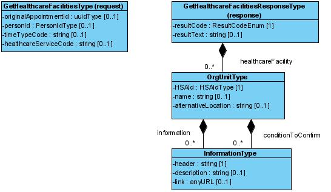

#### 7.8.4 Fältregler

Nedanstående tabell beskriver varje element i begäran och svar. Har namnet en * finns ytterligare regler för detta element och beskrivs mer i detalj i stycket Regler.

| | | | |
| :--- | :--- | :--- | :--- |
| Begäran |   |   |   |
| originalAppointementId | uuidType | Unikt id för ursprungsbokningen Används för att indikera ombokning, så att tjänsteproducenten kan anpassa svaret till tider som är giltiga för ombokning av angiven ursprungsbokning. Ska uttryckas som uuid (universally unique identifier). | 0..1 |
| personId | PersonIdType (IIType) | Filtrering av tidstyper baserat på invånares personnummer. Se kapitel Definition av komplexa typer för detaljerad information om hur de underliggande attributen populeras. | 0..1 |
| timeTypeCode | string | Tidstyp att söka lediga datum för. / En konsument kan välja att söka lediga tider på antingen tidstyp eller vårdtjänst. Båda ska inte sättas i samma anrop. | 0..1 |
| healthcareServiceCode | string | Vårdtjänst att söka lediga datum för. En konsument kan välja att söka lediga tider på antingen tidstyp eller vårdtjänst. Båda ska inte sättas i samma anrop. | 0..1 |
| Svar |   |   |   |
| healthcareFacility | OrgUnitType | Lista med tillgängliga vårdcentraler/vårdenheter. | 0..* |
| resultCode | ResultCodeEnum | Kan endast vara OK, INFO eller ERROR. | 1..1 |
| resultText | string | Kan utelämnas om resultCode = OK. / Producent förväntas skicka ett tillräckligt informativt meddelande som underlättar felsökning i de fall resultCode == ERROR | 0..1 |

#### 7.8.5 Fältregler enligt schema (XSD)

Tabellen är genererad ur tjänsteschemat. Typerna beskrivs i [avsnitt 6](6-gemensamma-informationskomponenter.md).

| | | | |
| :--- | :--- | :--- | :--- |
| **Begäran** |   |   |   |
| originalAppointmentId | uuidType |   | 0..1 |
| personId | PersonIdType |   | 0..1 |
| ../root | string | Tillåtna värden: 1.2.752.129.2.1.3.1, 1.2.752.129.2.1.3.3. | 1..1 |
| ../extension | string |   | 1..1 |
| timeTypeCode | string |   | 0..1 |
| healthcareServiceCode | string |   | 0..1 |
| **Svar** |   |   |   |
| healthcareFacility | OrgUnitType |   | 0..* |
| ../HSAId | HSAIdType |   | 1..1 |
| ../../root | string |   | 1..1 |
| ../../extension | string |   | 1..1 |
| ../name | string |   | 0..1 |
| ../alternativeLocation | string |   | 0..1 |
| ../information | InformationType |   | 0..* |
| ../../header | string |   | 1..1 |
| ../../description | string |   | 0..1 |
| ../../link | anyURI |   | 0..1 |
| ../conditionToConfirm | InformationType |   | 0..* |
| ../../header | string |   | 1..1 |
| ../../description | string |   | 0..1 |
| ../../link | anyURI |   | 0..1 |
| resultCode | ResultCodeEnum |   | 1..1 |
| resultText | string |   | 0..1 |

#### 7.8.6 Tjänsteinteraktion enligt WSDL

Tjänsteinteraktionens namn: GetHealthcareFacilitiesInteraction
 Beskrivning:
 Lista enheter som invånare kan boka om till.
 Revisioner:
 Tjänstedomän: supportprocess:logistics:scheduling
 Tjänsteinteraktionstyp: Fråga-Svar
 WS-profil: RIVTABP21
 Förvaltas av: Sveriges Kommuner och Landsting

SOAPAction: `urn:riv:supportprocess:logistics:scheduling:GetHealthcareFacilitiesResponder:2:GetHealthcareFacilities`

#### 7.8.7 Källfiler (RIV-TA)

| | |
| :--- | :--- |
| [GetHealthcareFacilitiesInteraction_2.0_RIVTABP21.wsdl](GetHealthcareFacilitiesInteraction_2.0_RIVTABP21.wsdl) | WSDL (tjänsteinteraktion) |
| [GetHealthcareFacilitiesResponder_2.0.xsd](GetHealthcareFacilitiesResponder_2.0.xsd) | Tjänsteschema |
| [supportprocess_logistics_scheduling_2.0.xsd](supportprocess_logistics_scheduling_2.0.xsd) | Domänschema (delat) |
| [itintegration_registry_1.0.xsd](itintegration_registry_1.0.xsd) | LogicalAddress (SOAP-huvud) |
| [interoperability_headers_1.0.xsd](interoperability_headers_1.0.xsd) | Interoperabilitetshuvuden |
| [SjD_TP_GetHealthcareFacilities_2.0.docx](SjD_TP_GetHealthcareFacilities_2.0.docx) | Självdeklaration (tjänsteproducent) |

#### 7.8.8 FHIR-artefakter

Följande FHIR-artefakter har genererats från schemat:

* **Logisk modell (request):** [StructureDefinition/gethealthcarefacilities-request](StructureDefinition-gethealthcarefacilities-request.md)
* **Logisk modell (response):** [StructureDefinition/gethealthcarefacilities](StructureDefinition-gethealthcarefacilities.md)
* **Kodsystem:** [CodeSystem/scheduling-resultcode-cs](CodeSystem-scheduling-resultcode-cs.md)
* **ValueSet:** [ValueSet/scheduling-resultcode-vs](ValueSet-scheduling-resultcode-vs.md)

### GetHealthcareFacility

Tjänstekontrakt för att hämta detaljerad information om en vårdenhet. Den detaljerade informationen kan innefatta en alternativ adress, om vårdenheten väljer att uttrycka en sådan. Den detaljerade informationen kan också innefatta information eller villkorstext som vårdenheten vill förmedla till invånaren/patienten i samband med bokningen.

Begäran för detta tjänstekontrakt är tomt. Tjänstekontraktet adresseras, liksom tjänstedomänens samtliga tjänstekontrakt, gentemot vårdenheten enligt logicalAddress.

#### 7.9.1 Frivillighet

Tjänstekontraktet är obligatoriskt att implementera för producent om producent stödjer nybokning, ombokning eller avbokning. I annat fall är tjänstekontraktet frivilligt att implementera för producent.

#### 7.9.2 Version

Tjänstekontraktet är nytt fr o m 2.0. Nuvarande version är 2.0

#### 7.9.3 Meddelandeinformationsmodell (MIM)

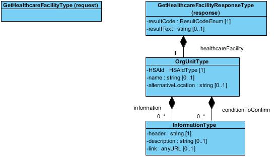

#### 7.9.4 Fältregler

Nedanstående tabell beskriver varje element i begäran och svar. Har namnet en * finns ytterligare regler för detta element och beskrivs mer i detalj i stycket Regler.

| | | | |
| :--- | :--- | :--- | :--- |
| Begäran |   |   |   |
| Inga attribut i begäran |   |   |   |
| Svar |   |   |   |
| healthcareFacility | OrgUnitType | Detaljer om vårdenheten. | 1..1 |
| resultCode | ResultCodeEnum | Kan endast vara OK, INFO eller ERROR. | 1..1 |
| resultText | string | Kan utelämnas om resultCode = OK. / Producent förväntas skicka ett tillräckligt informativt meddelande som underlättar felsökning i de fall resultCode == ERROR | 0..1 |

#### 7.9.5 Fältregler enligt schema (XSD)

Tabellen är genererad ur tjänsteschemat. Typerna beskrivs i [avsnitt 6](6-gemensamma-informationskomponenter.md).

| | | | |
| :--- | :--- | :--- | :--- |
| **Begäran** |   |   |   |
| **Svar** |   |   |   |
| healthcareFacility | OrgUnitType |   | 1..1 |
| ../HSAId | HSAIdType |   | 1..1 |
| ../../root | string |   | 1..1 |
| ../../extension | string |   | 1..1 |
| ../name | string |   | 0..1 |
| ../alternativeLocation | string |   | 0..1 |
| ../information | InformationType |   | 0..* |
| ../../header | string |   | 1..1 |
| ../../description | string |   | 0..1 |
| ../../link | anyURI |   | 0..1 |
| ../conditionToConfirm | InformationType |   | 0..* |
| ../../header | string |   | 1..1 |
| ../../description | string |   | 0..1 |
| ../../link | anyURI |   | 0..1 |
| resultCode | ResultCodeEnum |   | 1..1 |
| resultText | string |   | 0..1 |

#### 7.9.6 Tjänsteinteraktion enligt WSDL

Tjänsteinteraktionens namn: GetHealthcareFacilityInteraction
 Beskrivning:
 Lista enheter som invånare kan boka om till.
 Revisioner:
 Tjänstedomän: supportprocess:logistics:scheduling
 Tjänsteinteraktionstyp: Fråga-Svar
 WS-profil: RIVTABP21
 Förvaltas av: Sveriges Kommuner och Landsting

SOAPAction: `urn:riv:supportprocess:logistics:scheduling:GetHealthcareFacilityResponder:2:GetHealthcareFacility`

#### 7.9.7 Källfiler (RIV-TA)

| | |
| :--- | :--- |
| [GetHealthcareFacilityInteraction_2.0_RIVTABP21.wsdl](GetHealthcareFacilityInteraction_2.0_RIVTABP21.wsdl) | WSDL (tjänsteinteraktion) |
| [GetHealthcareFacilityResponder_2.0.xsd](GetHealthcareFacilityResponder_2.0.xsd) | Tjänsteschema |
| [supportprocess_logistics_scheduling_2.0.xsd](supportprocess_logistics_scheduling_2.0.xsd) | Domänschema (delat) |
| [itintegration_registry_1.0.xsd](itintegration_registry_1.0.xsd) | LogicalAddress (SOAP-huvud) |
| [interoperability_headers_1.0.xsd](interoperability_headers_1.0.xsd) | Interoperabilitetshuvuden |
| [SjD_TP_GetHealthcareFacility_2.0.docx](SjD_TP_GetHealthcareFacility_2.0.docx) | Självdeklaration (tjänsteproducent) |

#### 7.9.8 FHIR-artefakter

Följande FHIR-artefakter har genererats från schemat:

* **Logisk modell (request):** [StructureDefinition/gethealthcarefacility-request](StructureDefinition-gethealthcarefacility-request.md)
* **Logisk modell (response):** [StructureDefinition/gethealthcarefacility](StructureDefinition-gethealthcarefacility.md)
* **Kodsystem:** [CodeSystem/scheduling-resultcode-cs](CodeSystem-scheduling-resultcode-cs.md)
* **ValueSet:** [ValueSet/scheduling-resultcode-vs](ValueSet-scheduling-resultcode-vs.md)

### GetPractitioners

Tjänstekontrakt för att hämta en lista över medarbetare i vårdprofessionen som är bokningsbara online hos angiven vårdenhet för aktuell invånare. Tjänsteproducenten ansvarar för att tillämpa verksamhetens regelverk för att filtrera svaret (t.ex. en vårdenhet som bara tillåter invånare att boka tid enligt listad doktor).

Tjänstekontrakt returnerar en lista med information om utförare (en medarbetare). För varje personal ska HSA-id vara med.

#### 7.10.1 Frivillighet

Tjänstekontrakt är frivilligt att implementera.

#### 7.10.2 Version

Tjänstekontrakt finns sedan 1.1 men har döpts om från GetAllPerformers till GetPractitioners. Aktuell version är 2.0.

#### 7.10.3 Meddelandeinformationsmodell (MIM)

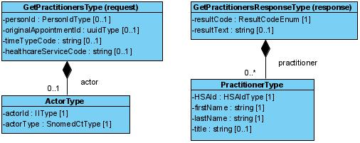

#### 7.10.4 Fältregler

Nedanstående tabell beskriver varje element i begäran och svar. Har namnet en * finns ytterligare regler för detta element och beskrivs mer i detalj i stycket Regler.

| | | | |
| :--- | :--- | :--- | :--- |
| Begäran |   |   |   |
| actor | ActorType | Typ av aktör som anropar tjänstekontraktet. Se kapitel Definition av komplexa typer för detaljerad information om hur de underliggande attributen populeras. Om anropet sker i ett flöde där lediga tider ska hämtas utan att aktören är känd ska fältet actor och fältet personId utelämnas. Detta kan exempelvis vara applicerbart om anropet sker då ingen aktör autentiserat sig (”ej inloggat läge”). | 0..1 |
| personId | PersonIdType (IIType) | Filtrering av tidstyper baserat på invånares personnummer. . Se kapitel Definition av komplexa typer för detaljerad information om hur de underliggande attributen populeras. | 0..1 |
| originalAppointementId | uuidType | Unikt id för ursprungsbokningen Används för att indikera ombokning, så att tjänsteproducenten kan anpassa svaret till tider som är giltiga för ombokning av angiven ursprungsbokning. Ska uttryckas som uuid (universally unique identifier). | 0..1 |
| timeTypeCode | string | Tidstyp att söka personal för. / En konsument kan välja att söka personal baserat på antingen tidstyp eller vårdtjänst. Båda ska inte sättas i samma anrop. | 0..1 |
| healthcareServiceCode | string | Vårdtjänst att söka personal för. En konsument kan välja att söka personal baserat på antingen tidstyp eller vårdtjänst. Båda ska inte sättas i samma anrop. Kod för vårdtjänster uttrycks som SNOMED-CT koder (svensk upplaga). | 0..1 |
| Svar |   |   |   |
| practitioner | PractitionerType | Information om bokningsbar vårdpersonal. | 0..* |
| practitioner.HSAId | HSAIdType | Bokningsbar vårdpersonals HsaId |   |
| practitioner.firstName | string | Vårdpersonals förnamn. | 1..1 |
| practitioner.lastName | string | Vårdpersonals efternamn. | 1..1 |
| practitioner.title | string | Vårdpersonals titel. | 0..1 |
| resultCode | ResultCodeEnum | Kan endast vara OK, INFO eller ERROR. | 1..1 |
| resultText | string | Kan utelämnas om resultCode = OK. / Producent förväntas skicka ett tillräckligt informativt meddelande som underlättar felsökning i de fall resultCode == ERROR | 0..1 |

#### 7.10.5 Fältregler enligt schema (XSD)

Tabellen är genererad ur tjänsteschemat. Typerna beskrivs i [avsnitt 6](6-gemensamma-informationskomponenter.md).

| | | | |
| :--- | :--- | :--- | :--- |
| **Begäran** |   |   |   |
| actor | ActorType |   | 0..1 |
| ../actorId | IIType |   | 1..1 |
| ../../root | string |   | 1..1 |
| ../../extension | string |   | 0..1 |
| ../actorType | SnomedCtType |   | 1..1 |
| ../../code | string |   | 1..1 |
| ../../codeSystem | string | Tillåtna värden: 1.2.752.116.2.1.1. | 1..1 |
| ../../codeSystemName | string |   | 0..1 |
| ../../codeSystemVersion | string |   | 0..1 |
| ../../displayName | string |   | 0..1 |
| ../../originalText | string |   | 0..1 |
| personId | PersonIdType |   | 0..1 |
| ../root | string | Tillåtna värden: 1.2.752.129.2.1.3.1, 1.2.752.129.2.1.3.3. | 1..1 |
| ../extension | string |   | 1..1 |
| originalAppointmentId | uuidType |   | 0..1 |
| timeTypeCode | string |   | 0..1 |
| healthcareServiceCode | string |   | 0..1 |
| **Svar** |   |   |   |
| practitioner | PractitionerType |   | 0..* |
| ../HSAId | HSAIdType |   | 1..1 |
| ../../root | string |   | 1..1 |
| ../../extension | string |   | 1..1 |
| ../firstName | string |   | 1..1 |
| ../lastName | string |   | 1..1 |
| ../title | string |   | 0..1 |
| resultCode | ResultCodeEnum |   | 1..1 |
| resultText | string |   | 0..1 |

#### 7.10.6 Tjänsteinteraktion enligt WSDL

Tjänsteinteraktionens namn: GetPractitionersInteraction
 Beskrivning:
 Lista utförare (medarbetare)
 Revisioner:
 Tjänstedomän: supportprocess:logistics:scheduling
 Tjänsteinteraktionstyp: Fråga-Svar
 WS-profil: RIVTABP21
 Förvaltas av: Sveriges Kommuner och Landsting

SOAPAction: `urn:riv:supportprocess:logistics:scheduling:GetPractitionersResponder:2:GetPractitioners`

#### 7.10.7 Källfiler (RIV-TA)

| | |
| :--- | :--- |
| [GetPractitionersInteraction_2.0_RIVTABP21.wsdl](GetPractitionersInteraction_2.0_RIVTABP21.wsdl) | WSDL (tjänsteinteraktion) |
| [GetPractitionersResponder_2.0.xsd](GetPractitionersResponder_2.0.xsd) | Tjänsteschema |
| [supportprocess_logistics_scheduling_2.0.xsd](supportprocess_logistics_scheduling_2.0.xsd) | Domänschema (delat) |
| [itintegration_registry_1.0.xsd](itintegration_registry_1.0.xsd) | LogicalAddress (SOAP-huvud) |
| [interoperability_headers_1.0.xsd](interoperability_headers_1.0.xsd) | Interoperabilitetshuvuden |
| [SjD_TP_GetPractitioners_2.0.docx](SjD_TP_GetPractitioners_2.0.docx) | Självdeklaration (tjänsteproducent) |

#### 7.10.8 FHIR-artefakter

Följande FHIR-artefakter har genererats från schemat:

* **Logisk modell (request):** [StructureDefinition/getpractitioners-request](StructureDefinition-getpractitioners-request.md)
* **Logisk modell (response):** [StructureDefinition/getpractitioners](StructureDefinition-getpractitioners.md)
* **Kodsystem:** [CodeSystem/scheduling-resultcode-cs](CodeSystem-scheduling-resultcode-cs.md)
* **ValueSet:** [ValueSet/scheduling-resultcode-vs](ValueSet-scheduling-resultcode-vs.md)

### MakeAppointment

Tjänstekontrakt för nybokning vid en vårdenhet. Tjänsten returnerar det unika boknings-id för bokningen vid lyckad genomförd nybokning.

#### 7.11.1 Frivillighet

Tjänstekontraktet är obligatoriskt att stödja för vårdenheter som erbjuder nybokning.

#### 7.11.2 Version

Tjänstekontrakt finns sedan 1.1 men har döpts om från MakeBooking till MakeAppointment.

Aktuell version är 2.0.

#### 7.11.3 Meddelandeinformationsmodell (MIM)

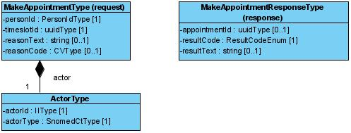

#### 7.11.4 Fältregler

Nedanstående tabell beskriver varje element i begäran och svar. Har namnet en * finns ytterligare regler för detta element och beskrivs mer i detalj i stycket Regler.

| | | | |
| :--- | :--- | :--- | :--- |
| Begäran |   |   |   |
| actor | ActorType | Typ av aktör som anropar tjänstekontraktet. Se kapitel Definition av komplexa typer för detaljerad information om hur de underliggande attributen populeras. | 1..1 |
| personId | PersonIdType (IIType) | Filtrering av tidstyper baserat på invånares personnummer. Se kapitel Definition av komplexa typer för detaljerad information om hur de underliggande attributen populeras. | 1..1 |
| timeslotId | uuidType | Unik identifierare för tidsluckan som ska bokas. Ska uttryckas som uuid (universally unique identifier). | 1..1 |
| reasonText | string | Patientens anledning till bokningen, uttryckt som fritext | 0..1 |
| reasonCode | CVType | Patientens anledning till bokningen, uttryckt som anledningskod. Möjliga val som ges till patienten bestäms av tidbokningssystemet. Tidbokningssystemet ges möjlighet att erbjuda lista med möjliga val per tidstyp. Tidbokningssystemet bestämmer själva koder och kodsystem att använda | 0..1 |
| reasonCode.code | string | Kod för anledningen till bokningen | 1..1 |
| reasonCode.codeSystem | string | Definierar vilket kodsystem som fältet code tillhör. | 1..1 |
| reasonCode.displayName | string | Den text som beskriver koden och ska visas till invånaren | 1..1 |
| Svar |   |   |   |
| appointmentId | uuidType | Unikt id för nya bokningen. Ska uttryckas som uuid (universally unique identifier). | 0..1 |
| resultCode | ResultCodeEnum (string) | Status för den gjorda bokningen. | 1..1 |
| resultText | string | Ev. meddelande kopplat till resultatkoden. | 0..1 |

#### 7.11.5 Övriga regler

Till denna informationsmängd finns regler som ej uttrycks i schemafilerna och tabellen ovan. Dessa återfinns nedan.

#### 7.11.6 Fältregler enligt schema (XSD)

Tabellen är genererad ur tjänsteschemat. Typerna beskrivs i [avsnitt 6](6-gemensamma-informationskomponenter.md).

| | | | |
| :--- | :--- | :--- | :--- |
| **Begäran** |   |   |   |
| actor | ActorType |   | 1..1 |
| ../actorId | IIType |   | 1..1 |
| ../../root | string |   | 1..1 |
| ../../extension | string |   | 0..1 |
| ../actorType | SnomedCtType |   | 1..1 |
| ../../code | string |   | 1..1 |
| ../../codeSystem | string | Tillåtna värden: 1.2.752.116.2.1.1. | 1..1 |
| ../../codeSystemName | string |   | 0..1 |
| ../../codeSystemVersion | string |   | 0..1 |
| ../../displayName | string |   | 0..1 |
| ../../originalText | string |   | 0..1 |
| personId | PersonIdType |   | 1..1 |
| ../root | string | Tillåtna värden: 1.2.752.129.2.1.3.1, 1.2.752.129.2.1.3.3. | 1..1 |
| ../extension | string |   | 1..1 |
| timeslotId | uuidType |   | 1..1 |
| reasonText | string |   | 0..1 |
| reasonCode | CVType |   | 0..1 |
| ../code | string |   | 1..1 |
| ../codeSystem | string |   | 1..1 |
| ../codeSystemName | string |   | 0..1 |
| ../codeSystemVersion | string |   | 0..1 |
| ../displayName | string |   | 0..1 |
| ../originalText | string |   | 0..1 |
| **Svar** |   |   |   |
| appointmentId | uuidType |   | 0..1 |
| resultCode | ResultCodeEnum |   | 1..1 |
| resultText | string |   | 0..1 |

#### 7.11.7 Tjänsteinteraktion enligt WSDL

Tjänsteinteraktionens namn: MakeAppointmentInteraction
 Beskrivning:
 Boka planerad aktivitet
 Revisioner:
 Tjänstedomän: supportprocess:logistics:scheduling
 Tjänsteinteraktionstyp: Fråga-Svar
 WS-profil: RIVTABP21
 Förvaltas av: Sveriges Kommuner och Landsting

SOAPAction: `urn:riv:supportprocess:logistics:scheduling:MakeAppointmentResponder:2:MakeAppointment`

#### 7.11.8 Källfiler (RIV-TA)

| | |
| :--- | :--- |
| [MakeAppointmentInteraction_2.0_RIVTABP21.wsdl](MakeAppointmentInteraction_2.0_RIVTABP21.wsdl) | WSDL (tjänsteinteraktion) |
| [MakeAppointmentResponder_2.0.xsd](MakeAppointmentResponder_2.0.xsd) | Tjänsteschema |
| [supportprocess_logistics_scheduling_2.0.xsd](supportprocess_logistics_scheduling_2.0.xsd) | Domänschema (delat) |
| [itintegration_registry_1.0.xsd](itintegration_registry_1.0.xsd) | LogicalAddress (SOAP-huvud) |
| [interoperability_headers_1.0.xsd](interoperability_headers_1.0.xsd) | Interoperabilitetshuvuden |
| [SjD_TP_MakeAppointment_2.0.docx](SjD_TP_MakeAppointment_2.0.docx) | Självdeklaration (tjänsteproducent) |

#### 7.11.9 FHIR-artefakter

Följande FHIR-artefakter har genererats från schemat:

* **Logisk modell (request):** [StructureDefinition/makeappointment-request](StructureDefinition-makeappointment-request.md)
* **Logisk modell (response):** [StructureDefinition/makeappointment](StructureDefinition-makeappointment.md)
* **Kodsystem:** [CodeSystem/scheduling-resultcode-cs](CodeSystem-scheduling-resultcode-cs.md)
* **ValueSet:** [ValueSet/scheduling-resultcode-vs](ValueSet-scheduling-resultcode-vs.md)

### UpdateAppointment

Tjänstekontrakt för att uppdatera en befintlig bokning med nytt datum och tid, alltså en ombokning.

Tjänstekontraktet returnerar en status för genomförd ombokning.

#### 7.12.1 Frivillighet

Tjänsten är obligatorisk för vårdenheter som erbjuder ombokning och således kan svara ”sant” i fältet ”timeslot.timeType.updateAppointmentAllowed” för någon av följande tjänster:

GetAppoitment

GetAppointments

GetAvailableTimeslots

I övriga fall är tjänsten frivillig.

#### 7.12.2 Version

Tjänstekontrakt finns sedan 1.1 men har döpts om från UpdateBooking till UpdateAppointment. Aktuell version är 2.0.

#### 7.12.3 Meddelandeinformationsmodell (MIM)

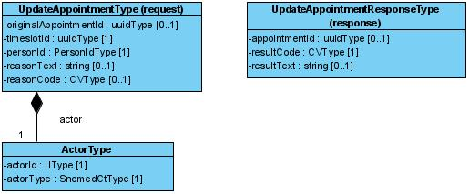

#### 7.12.4 Fältregler

Nedanstående tabell beskriver varje element i begäran och svar. Har namnet en * finns ytterligare regler för detta element och beskrivs mer i detalj i stycket Regler.

| | | | |
| :--- | :--- | :--- | :--- |
| Begäran |   |   |   |
| actor | ActorType | Typ av aktör som anropar tjänstekontraktet. Se kapitel Definition av komplexa typer för detaljerad information om hur de underliggande attributen populeras. | 1..1 |
| personId | PersonIdType (IIType) | Filtrering av tidstyper baserat på invånares personnummer. Se kapitel Definition av komplexa typer för detaljerad information om hur de underliggande attributen populeras. | 1..1 |
| originalAppointementId | uuidType | Unikt id för ursprungsbokningen Används för att indikera. Ska uttryckas som uuid (universally unique identifier).ombokning, så att tjänsteproducenten kan anpassa svaret till tider som är giltiga för ombokning av angiven ursprungsbokning. | 0..1 |
| timeslotId | uuidType | Unik identifierare för tidsluckan som ska bokas. Ska uttryckas som uuid (universally unique identifier). | 1..1 |
| reasonText | string | Patientens anledning till ombokningen, uttryckt som fritext | 0..1 |
| reasonCode | CVType | Patientens anledning till ombokningen, uttryckt som anledningskod. Möjliga val som ges till patienten bestäms av tidbokningssystemet. Tidbokningssystemet ges möjlighet att erbjuda lista med möjliga val per tidstyp. Tidbokningssystemet bestämmer själv koder och kodsystem att använda | 0..1 |
| reasonCode.code | string | Kod för anledningen till ombokningen | 1..1 |
| reasonCode.codeSystem | string | Definierar vilket kodsystem som fältet code tillhör. | 1..1 |
| reasonCode.displayName | string | Den text som beskriver koden och ska visas till invånaren | 1..1 |
| Svar |   |   |   |
| appointmentId | uuidType | Unikt id för nya bokningen. Tidbokningssystemet kan välja att skapa ett nytt unikt id för nya bokningen eller återanvända id för ursprungsbokningen. Ska uttryckas som uuid (universally unique identifier). | 0..1 |
| resultCode | ResultCodeEnum (string) | Status för den gjorda avbokningen. | 1..1 |
| resultText | string | Ev. meddelande kopplat till resultatkoden. | 0..1 |

#### 7.12.5 Övriga regler

Till denna informationsmängd finns regler som ej uttrycks i schemafilerna och tabellen ovan. Dessa återfinns nedan.

#### 7.12.6 Fältregler enligt schema (XSD)

Tabellen är genererad ur tjänsteschemat. Typerna beskrivs i [avsnitt 6](6-gemensamma-informationskomponenter.md).

| | | | |
| :--- | :--- | :--- | :--- |
| **Begäran** |   |   |   |
| actor | ActorType |   | 1..1 |
| ../actorId | IIType |   | 1..1 |
| ../../root | string |   | 1..1 |
| ../../extension | string |   | 0..1 |
| ../actorType | SnomedCtType |   | 1..1 |
| ../../code | string |   | 1..1 |
| ../../codeSystem | string | Tillåtna värden: 1.2.752.116.2.1.1. | 1..1 |
| ../../codeSystemName | string |   | 0..1 |
| ../../codeSystemVersion | string |   | 0..1 |
| ../../displayName | string |   | 0..1 |
| ../../originalText | string |   | 0..1 |
| originalAppointmentId | uuidType |   | 1..1 |
| timeslotId | uuidType |   | 1..1 |
| personId | PersonIdType |   | 1..1 |
| ../root | string | Tillåtna värden: 1.2.752.129.2.1.3.1, 1.2.752.129.2.1.3.3. | 1..1 |
| ../extension | string |   | 1..1 |
| reasonText | string |   | 0..1 |
| reasonCode | CVType |   | 0..1 |
| ../code | string |   | 1..1 |
| ../codeSystem | string |   | 1..1 |
| ../codeSystemName | string |   | 0..1 |
| ../codeSystemVersion | string |   | 0..1 |
| ../displayName | string |   | 0..1 |
| ../originalText | string |   | 0..1 |
| **Svar** |   |   |   |
| appointmentId | uuidType |   | 0..1 |
| resultCode | ResultCodeEnum |   | 1..1 |
| resultText | string |   | 0..1 |

#### 7.12.7 Tjänsteinteraktion enligt WSDL

Tjänsteinteraktionens namn: UpdateAppointmentInteraction
 Beskrivning:
 Ändra tid för en bokning
 Revisioner:
 Tjänstedomän: supportprocess:logistics:scheduling
 Tjänsteinteraktionstyp: Fråga-Svar
 WS-profil: RIVTABP21
 Förvaltas av: Sveriges Kommuner och Landsting

SOAPAction: `urn:riv:supportprocess:logistics:scheduling:UpdateAppointmentResponder:2:UpdateAppointment`

#### 7.12.8 Källfiler (RIV-TA)

| | |
| :--- | :--- |
| [UpdateAppointmentInteraction_2.0_RIVTABP21.wsdl](UpdateAppointmentInteraction_2.0_RIVTABP21.wsdl) | WSDL (tjänsteinteraktion) |
| [UpdateAppointmentResponder_2.0.xsd](UpdateAppointmentResponder_2.0.xsd) | Tjänsteschema |
| [supportprocess_logistics_scheduling_2.0.xsd](supportprocess_logistics_scheduling_2.0.xsd) | Domänschema (delat) |
| [itintegration_registry_1.0.xsd](itintegration_registry_1.0.xsd) | LogicalAddress (SOAP-huvud) |
| [interoperability_headers_1.0.xsd](interoperability_headers_1.0.xsd) | Interoperabilitetshuvuden |
| [SjD_TP_UpdateAppointment_2.0.docx](SjD_TP_UpdateAppointment_2.0.docx) | Självdeklaration (tjänsteproducent) |

#### 7.12.9 FHIR-artefakter

Följande FHIR-artefakter har genererats från schemat:

* **Logisk modell (request):** [StructureDefinition/updateappointment-request](StructureDefinition-updateappointment-request.md)
* **Logisk modell (response):** [StructureDefinition/updateappointment](StructureDefinition-updateappointment.md)
* **Kodsystem:** [CodeSystem/scheduling-resultcode-cs](CodeSystem-scheduling-resultcode-cs.md)
* **ValueSet:** [ValueSet/scheduling-resultcode-vs](ValueSet-scheduling-resultcode-vs.md)

