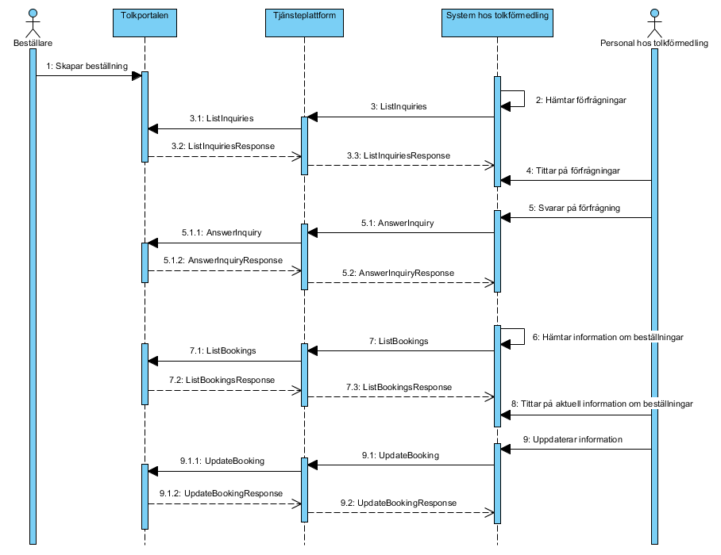
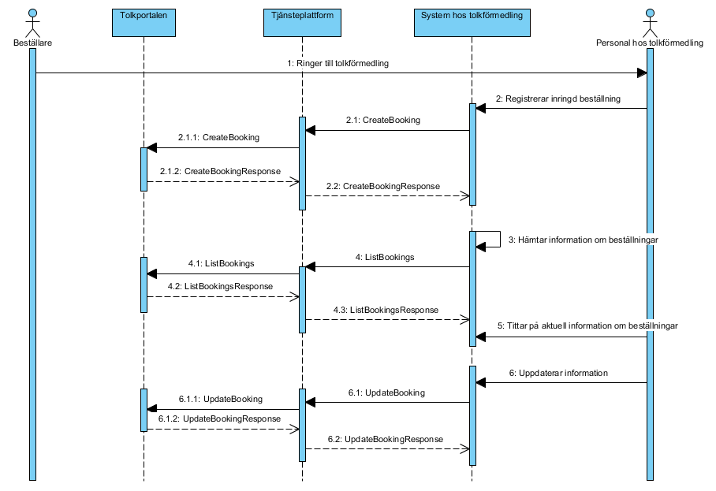

# 3 Tjänstedomänens arkitektur - supportprocess: personalresources: interpretation — Tolkförmedling v1.0.0

* [**Table of Contents**](toc.md)
* **3 Tjänstedomänens arkitektur**

## 3 Tjänstedomänens arkitektur

## Tjänstedomänens arkitektur

### Flöden

I detta avsnitt beskrivs domänens sekvensdiagram. För arbetsflöden, informationsspecifikationen [R3]. Följande aktörer och system förekommer i flödena:

| | |
| :--- | :--- |
| Beställare | Person som arbetar inom hälso- och sjukvården och som initierar beställning av ett tolkuppdrag. |
| Tolkportalen | Stockholms läns landstings system för beställning och hantering av tolkbeställningar. |
| Tjänsteplattform | Regional tjänsteplattform. |
| System hos tolkförmedling | Administrativt system hos tolkförmedlingen där förfrågningar besvaras och beställningar hanteras. |
| Personal hos tolkförmedling | Person som arbetar åt en tolkförmedling med att besvara och administrera förfrågningar om tolkuppdrag. |

#### Beställning av tolk

Flödet beskriver de steg som genomförs i de fall då beställaren registrerar beställningen själv i Tolkportalen. Beställaren skapar beställning och personal hos tolkförmedling kan titta på aktuella förfrågningar. Tolkförmedlingen hämtar med fördel förfrågningar automatiskt med jämna mellanrum, t.ex. en gång per minut (men inte oftare, se avsnitt 4.2.3). Personal hos tolkförmedlingen svarar på förfrågning och beställaren kan då se beställningen i sin helhet, inklusive information om vilken tolk som är inbokad för uppdraget. Vid behov kan bland annat denna information även uppdateras senare. Efter utfört tolkuppdrag ska beställaren kvittera uppdraget i Tolkportalen.

##### Sekvenssteg

I nedanstående tabell beskrivs huvudstegen i sekvensdiagrammet.

| | |
| :--- | :--- |
| 1 Skapar beställning | Beställaren skapar beställning i Tolkportalen, vilket leder till att en förfrågning går ut ut till tolkförmedlingarna enligt givna regler. |
| 2-3 Hämtar förfrågningar | System hos tolkförmedling hämtar tillgängliga förfrågningar via tjänstekontraktet ListInquiries. Detta sker förslagsvis schemalagt en gång i minuten, men kan också göras manuellt. |
| 4 Tittar på förfrågningar | Personal hos tolkförmedlingen tittar i tolkförmedlingssystemet på de förfrågningar som hämtats in från Tolkportalen. |
| 5 Svarar på förfrågning | Tolkförmedlingen svarar på en tillgänglig förfrågan, antingen genom att acceptera den eller tacka nej. Tolkförmedlingen anger också vilken tolk som är tilltänkt för uppdraget. Informationen förmedlas via tjänstekontraktet AnswerInquiry. |
| 6-7 Hämtar information om beställningar | System hos tolkförmedling hämtar information om sina aktuella beställningar via tjänstekontraktet ListBookings. Detta sker förslagsvis schemalagt en gång i minuten, men kan också göras manuellt. |
| 8 Tittar på aktuell information om beställning | Personal hos tolkförmedlingen tittar på de beställningar som tillhör den egna förmedlingen i sitt system. Beställaren kan när som helst avboka en beställning, dvs. ställa in tolkuppdraget, och förmedlaren kommer då att se detta när aktuell information om beställningar hämtas. |
| 9 Uppdaterar information | Personal hos tolkförmedlingen uppdaterar information om ett tolkuppdrag och det överförs till Tolkportalen via tjänstekontraktet UpdateBooking så att beställaren kan se det. |

#### Inringd beställning av tolk

Flödet beskriver de steg som genomförs i de fall då beställaren ringer in sin beställning till tolkförmedlingen, som därefter registrerar beställningen i sitt administrativa system och därmed också i Tolkportalen. När beställningen är registrerad kan den hanteras på samma sätt som i flödet ”Beställning av tolk”, dvs. tittas på, uppdateras, avbokas m.m.

##### Sekvenssteg

I nedanstående tabell beskrivs huvudstegen i sekvensdiagrammet.

| | |
| :--- | :--- |
| 1 Ringer till tolkförmedling | Beställaren ringer direkt till en tolkförmedling och frågar om de har en tillgänglig tolk för tolkuppdraget. |
| 2 Registrerar inringd beställning | Om tolkförmedlingen accepterar den inringda beställningen registrerar personalen på tolkförmedlingen den i sitt administrativa system och beställningen skickas till Tolkportalen via tjänstekontraktet CreateBooking. |
| 3-4 Hämtar information om beställningar | System hos tolkförmedling hämtar information om sina aktuella beställningar via tjänstekontraktet ListBookings. Detta sker förslagsvis schemalagt en gång i minuten, men kan också göras manuellt. |
| 5 Tittar på aktuell information om beställning | Personal hos tolkförmedlingen tittar på de beställningar som tillhör den egna förmedlingen i sitt system. Beställaren kan när som helst avboka en beställning, dvs. ställa in tolkuppdraget, och förmedlaren kommer då att se detta när aktuell information om beställningar hämtas. |
| 6 Uppdaterar information | Personal hos tolkförmedlingen uppdaterar information om ett tolkuppdrag och det överförs till Tolkportalen via tjänstekontraktet UpdateBooking så att beställaren kan se det. |

#### Obligatoriska kontrakt

Följande tabell specificerar vilka kontrakt som är obligatoriska att realisera för respektive flöde.

| | | |
| :--- | :--- | :--- |
| CreateBooking |   | X |
| ListInquiries | X |   |
| AnswerInquiry | X |   |
| ListBookings | X | X |
| UpdateBooking | X | X |

### Adressering

Samtliga tjänstekontrakt nyttjar en systembaserad adressering där adressen går till SLL Tolkportalen.

### Aggregering och engagemangsindex

Aggregering och uppdatering av engagemangsindex är ej aktuellt för denna domän eftersom tjänsterna inte hanterar patientidentiteter.

