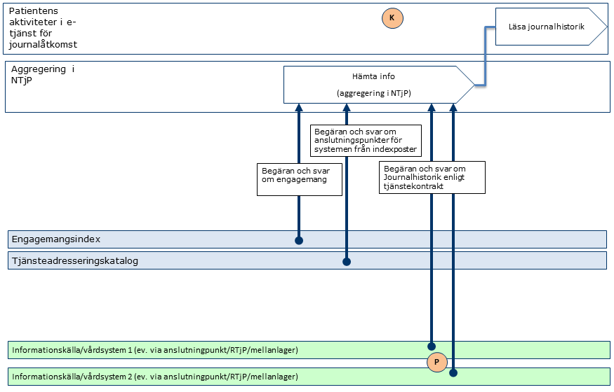
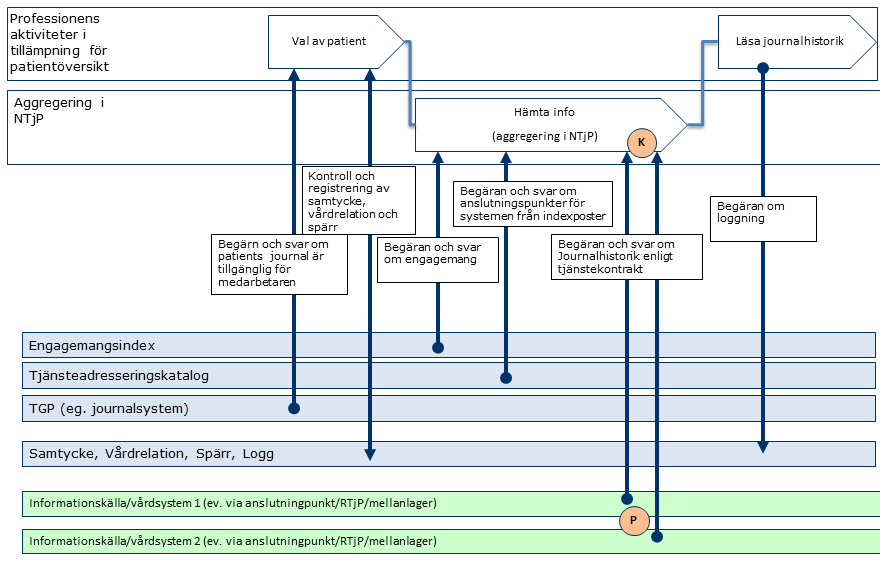
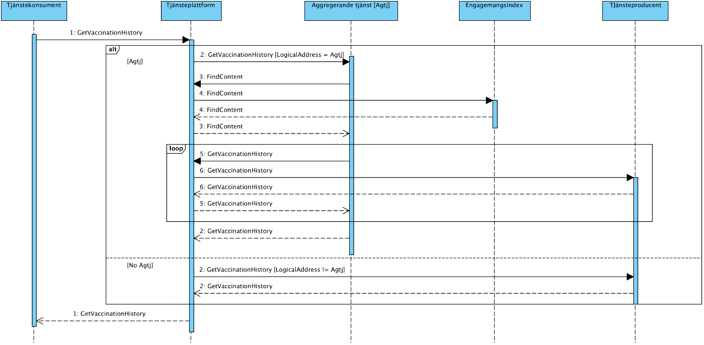
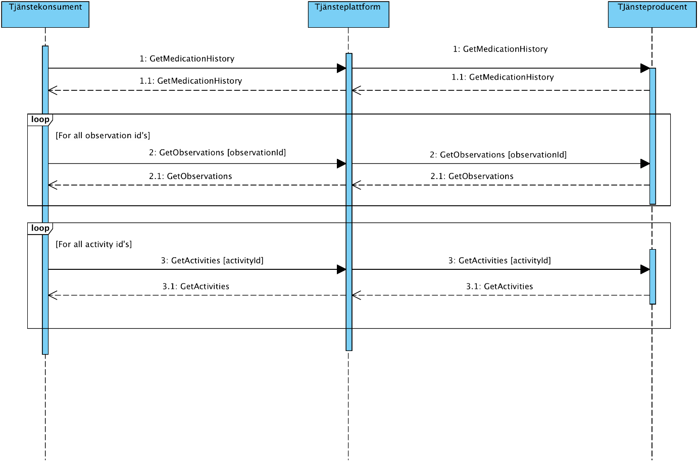
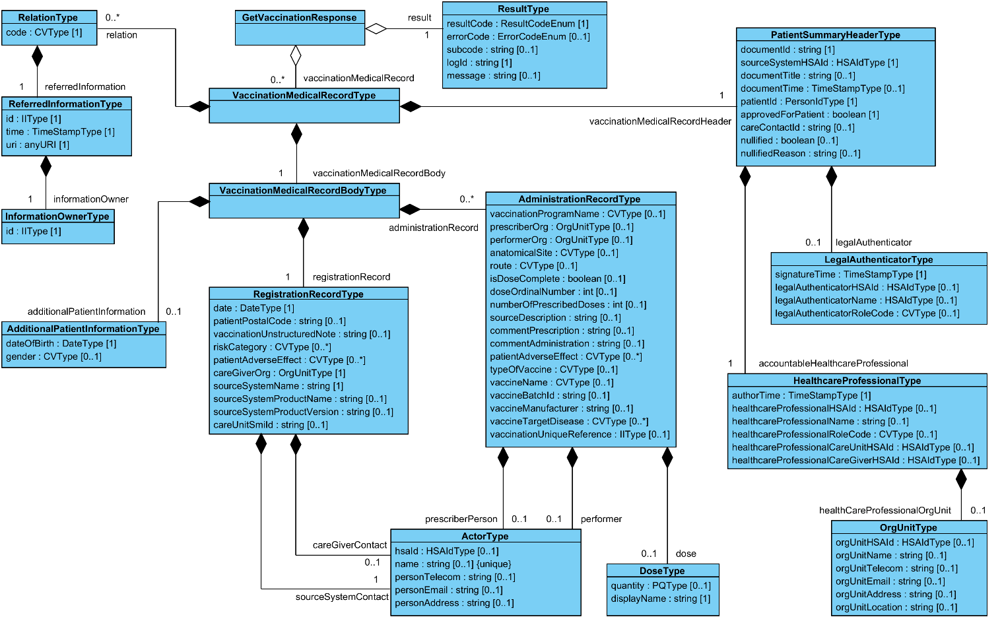
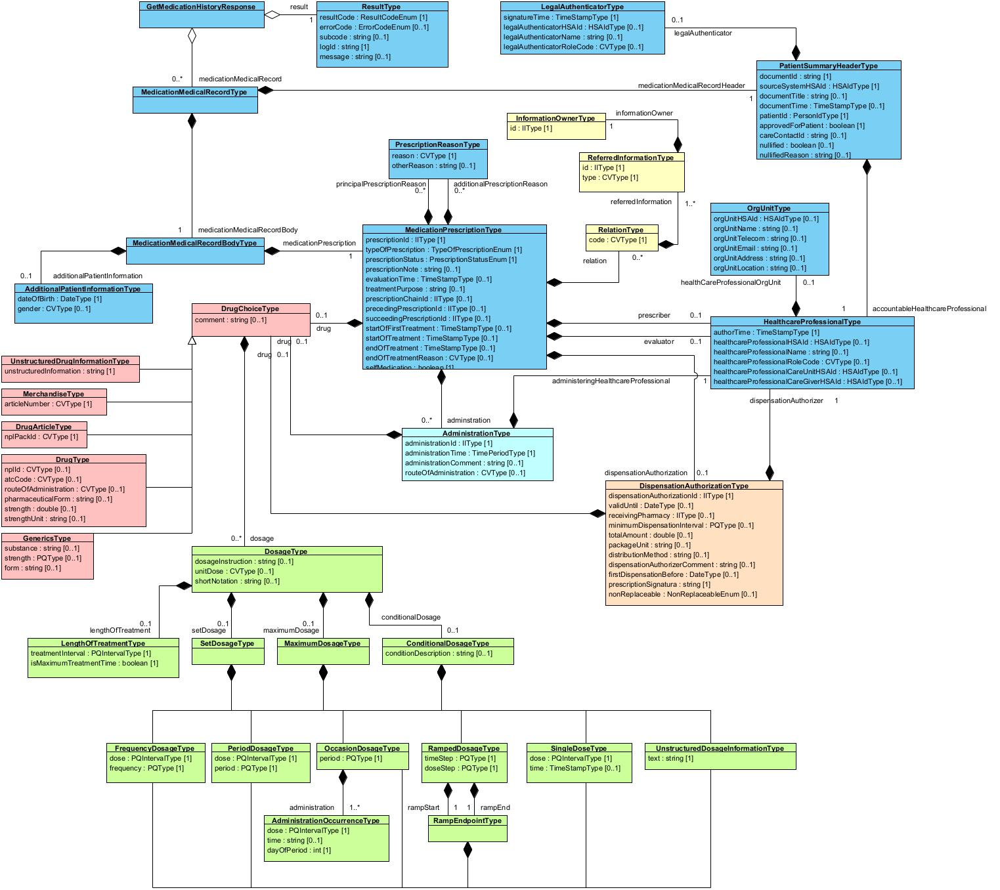

Tjänstekontraktsbeskrivning Version 2.2.1 
2025-03-17

Innehållsförteckning
1	Inledning	12
1.1	Svenskt namn	12
1.2	Webbeskrivning	12
2	Versionsinformation	13
2.1	Version 2.2.1	13
2.1.1	Oförändrade tjänstekontrakt	13
2.1.2	Nya tjänstekontrakt	13
2.1.3	Förändrade tjänstekontrakt	13
2.1.4	Utgångna tjänstekontrakt	14
2.2	Version tidigare	14
3	Tjänstedomänens arkitektur	14
3.1	Flöden	14
3.1.1	Flöde 1	15
3.1.2	Obligatoriska kontrakt	19
3.2	Adressering	19
3.2.1	Sammanfattning av adresseringsmodell	19
3.3	Aggregering och engagemangsindex	19
4	Tjänstedomänens krav och regler	20
4.1	Uppdatering av engagemangsindex	20
4.2	Informationssäkerhet och juridik	22
4.2.1	Medarbetarens direktåtkomst	22
4.2.2	Patientens direktåtkomst	23
4.2.3	Generellt	23
4.3	Icke funktionella krav	24
4.3.1	SLA krav	24
4.3.2	Övriga krav och regler	25
4.4	Felhantering	26
4.4.1	Krav på en tjänsteproducent	26
4.4.2	Krav på en tjänstekonsument	26
5	Tjänstedomänens meddelandemodeller	27
5.1	GetVaccinationHistory	27
5.2	GetMedicationHistory	34
6	Gemensamma informationskomponenter	49
7	Tjänstekontrakt	51
7.1	GetVaccinationHistory	51
7.1.1	Version	51
7.1.2	Gemensamma informationskomponenter	51
7.1.3	Särskilda förutsättningar beroende på typ av konsument med hänsyn till historisk information (i äldre system)	51
7.1.4	Fältregler	51
7.1.5	Övriga regler	61
7.2	GetMedicationHistory	64
7.2.1	Version	64
7.2.2	Gemensamma informationskomponenter	64
7.2.3	Fältregler	64
7.2.4	Övriga regler	125
Revisionshistorik

| Version | Datum | Författare | Kommentar |
| :--- | :--- | :--- | :--- |
| PA1 | 2013-05-01 | Marcus Claus | Arbetsdokument, baserat på motsvarande för Hälsorelaterat tillstånd, utfall av aktivitet. |
| PA2 | 2013-05-21 | Marcus Claus | Ändringar baserat på diskussioner och möten 20-21 maj med JE, FS, MC, VL, JG m.fl. |
| PA3 | 2013-05-22 | Marcus Claus | Slutgiltiga ändringar från möte 21maj för första versionen för anslutning Svevac, konformitet med TC, samt aggregerad tjänst. Introduktion av CodedValueType, notering om att kontraktet i legacy system där HSAid-data ej finns stringent, ändå stödjer invånar/patienttjänster. Rättat formateringsfel. Hänvisar i TK till gemensamma komponenter för bättre läsbarhet. |
| PA4 | 2013-05-23 | Marcus Claus | Lokal DC kan anges i EI-anrop. Städat bland gemensamma komponenter för domänen |
| PA5 | 2013-05-27 | Marcus Claus | Ändrat ’deleted’ till ’nullified’ enligt diskussion med JE, FS om HL7s begrepp för makulerade poster. Tydliggjort att gemensamma typer som är enkla ska anges som ’simple type’ i schemana |
| PA6 | 2013-05-28 | Johan Eltes | Kvalitetssäkring inför granskning av CeHis. Justeringar i olika textavsnitt, samt kommentar om att engelsk text behöver översättas. |
| PA7 | 2013-05-28 | Marcus Claus | Engelska texterna översatta till svenska. Justerat stavfel och fel rubriknivå i avsnittet Informationssäkerhet. Lagt till DIM/V-MIM modell. |
| PA8 | 2013-06-27 | Göran Oettinger | Ändring av beskrivningen för inparametern TimePeriod och DocumentTime i PatientSummaryHeader samt AuthorTime i AuthorType |
| PA9 | 2013-09-03 | Björn Genfors | Förtydligat innebörden av author. |
| PA10 | 2013-09-06 | Göran Oettinger | Tog bort fältet patientPostalCode.
Ändrade merparten av obligatoriska fält till frivilliga för att stödja att vaccinationsinformation kan komma från annan källa t.ex. utlandet / Beskrivning av documentTitle borttagen |
| PA11 | 2013-09-12 | Göran Oettinger | Återinförde patientPostalCode men nu med ny beskrivning |
| PA12 | 2013-09-19 | Marcus Claus | Infört de nya domän-överskridande gemensamma datatyperna enl TK-utv.gruppens beslut 19/9-13. / Mappat mot rapportkraven och xml-schemats variabler för nationella vaccinationsregistret (SMI; NVR) och adderat några fält. Ändringarna är markerade med gult i avsnitt 6.1. |
| PA13 | 2013-09-23 | Göran Oettinger | Bytte vaccActorType till VaccActorType |
| PA14 | 2013-09-24 | Björn Genfors | Normerat gemensamma typer (tagit bort VaccActorType till förmån för ActorType, och redigerat ActorType enligt beslutade gemensamma komponenter). / Följdändrade hänvisningar i vaccinationskontraktet. |
| PA15 | 2013-09-23 | Björn Genfors | Redaktionell ändring, en hänvisning till AuthorType ändrades till hänvisning till HealthcareProfessionalType |
| PA16 | 2013-09-30 | Björn Genfors | Fällt ut strukturen för header. / Justerat positionen på de fält som adderades i PA12 (de ligger i body) / Ändrat namngivining och justerat beskrivning för dessa fält. |
| PA17 | 2013-10-03 | Johan Eltes | Justerat anvädning av versal/camelcase i fält med ”healthcare” i namnet. / Ändrat ”nullified” till 1..1 i GetVaccinationHistory. |
| PA18 | 2013-10-17 | Björn Genfors | Lagt till Sourcesystem i Engagemangsindex / Justerat beskrivningen av adress i OrtUnitType. / Korrigerat beskrivningen av documentId i PatientSummaryHeader. |
| PA19 | 2013-10-21 | Johan Eltes | Förtydligat kravet på filtrering av svar enligt logicalAddress (lagt till avsnitt 5.4). / Markerat i flödesmodeller att anslutningskatalog inte är del av dagens arkitektur. / Bytt namn på fältet vaccinationUniqueReference från tidigare vaccineUniqueReference / Förtydligat användningen av IIType för fältet vaccinationUniqueReference |
| PA20 | 2013-11-04 | Johan Eltes | Ersatt termen PDL-enhet med vårdenhet (i löpande text) / Uppdaterat avsnittet om informationssäkerhet efter CeHis-granskning |
| PA21 | 2013-11-20 | Marcus Claus | Förtydligat beskrivningen för fält som är enhets-id för organisationer respektive personal-id för vård- och omsorgspersonal så att NPÖ:s riv-spec v2.2.0 skrivelse i avsnitt 4.1.6 (för Enhet) respektive 4.1.39 (för Personal) följs: Enhets-id respektive personal-id har värdemängd HSAid men även beslutsregeln ”I de fall då HSA-id inte finns tillgängligt i systemet kan Orgnr+lokalt id anges.” |
| ._ | 2017-06-21 | Björn Genfors | Bytt dokumentmall / Lagt till GetMedicationHistory / Bytt namn på DosageType till DoseType i GVH. / Lagt till ResultType i GVH. |
| 2.0_RC1 | 2014-05-23 | Khaled Daham | vaccineType har bytt namn till typeOfVaccine för att följa kutym |
| 2.0_RC1 | 2014-05-27 | Björn Genfors, Khaled Daham | Lagt till additionalPatientInformation för GetVaccinationHistory. / Lagt till relation för GetVaccinationHistory |
| 2.0_RC1 | 2014-06-05 | Khaled Daham | Ändrat activeOnly till prescriptionStatus och en enum |
| 2.0_RC2 | 2014-11-25 | Björn Genfors | Ändrat kardinaliteten på ordinationshuvudorsak. |
| 2.0_RC2 |  | Khaled Daham | Uppdaterat formulering för begäran, speciellt rörande reservnummer. / Lagt till Ineras HSAid för aggregerande tjänster. / sourceSystemHSAId krävs vid begäran på reservnummer / Tagit bort alternativet att använda GetUpdates(index-pull) för EI då den inte är implementerad och det pågår diskussioner om att den ska tas bort ifrån TKB för EI. / Uppdaterat sekvensdiagram. / Ändrat skrivelse kring medarbetarens åtkomst till att peka på SOSFS 2008:14 istället för PDL-i-praktiken. / Åtgärdat följande issues på https://code.google.com/p/rivta/issues / 281 clinicalprocess_activityprescription_actoutcome_2.0.xsd – RampEndpointType duplicerat / 287 prescriptionStatus, PrescriptionStatusEnum eller CVType? / 290 GetMedicationHistory: Ordinationsorsak / 291 Major version för GetMedicationHistory service och operation diffar / 292 Kardinalitet för prescriptionChainId inkonsisten / Ändrat namn i TKB ifrån GetMedicationMedicalHistory till GetMedicationHistory. |
| 2.0_RC2 | 2015-01-09 | Khaled Daham | Ändrat kodverk för typeOfPrescription ifrån Insättning till I, Utsättning till U |
| 2.0_RC3 | 2015-04-09 | Khaled Daham / Björn Genfors | Flyttat logiska fel till ett eget kapitel. / Tagit bort relation för båda kontrakten i domänen efter beslut av Inera / Ny regel som säger att totalAmount och packageUnit måste anges tillsammans. / Ett element ”drug” av typen ”DrugChoiceType” har lagts till i förskrivning ”dispensationAuthorization”. Notera att dosering (”dosage”) inte är applicerbart i detta fall. / Två sökparametrar har fått uppdaterad lydelse: / Sökning på ordinationskedje-id returnerar nu hela ordinationskedjan, inte bara senaste ordination. / Sökning på tid söker efter ett tidsintervall, inte enbart registreringstidpunkt. Se formulering för elementet datePeriod I fältregel-tabellen. |
| 2.0_RC4 | 2015-04-16 | Khaled Daham | Rättat en kommentar som innehöll ett felaktigt elementnamn (packageAmount till packageUnit). |
| 2.0_RC4 | 2015-04-20 | Khaled Daham | Lagt till följande fält / pharmaceuticalForm, strength, strengthUnit för produktinformation i DrugType. |
| 2.0_RC5 | 2015-04-29 | Khaled Daham | Inga ändringar i TKB, endast uppdaterat test för Date Boundaries för GetMedicationHistory i SOAPui test-sviten som ligger under katalogen test-suite. |
| 2.0_RC6 | 2015-05-13 | Khaled Daham | Korrigerat HSA-id som ska användas vid addressering till Inera. |
| 2.0_RC7 | 2015-06-04 | Khaled Daham | Issue 338, flyttat isMaximumTreatmentTime och lengthOfTreatment till en gemensam typ. / Slagit ihop HSA-id för QA och Prod då de är exakt samma. |
| 2.0 | 2015-06-10 | Khaled Daham | Fastställande av GetVaccinationHistory |
| 2.0.1 | 2015-07-01 | Khaled Daham | Förtydligande beskrivning av authorTime i headern. / Fastställande av GetMedicationHistory |
| 2.0.2 | 2015-09-04 | Khaled Daham | Korrigerat elementnamn fältregeltabellen så att de stämmer överens med schemat (careUnitHSAid, sourceSystemHSAid) |
| 2.0.2 | 2015-09-09 | Björn Genfors | Lagt till en kolumn för NPÖ-mappning för GMH / Korrigerat beskrivningen av de två förekomsterna av ”utvärderingstidpunkt” i GMH / Hänvisar till ny bilaga för gemensamma typer |
| 2.0.2 | 2015-09-18 | Björn Genfors | Korrigerat stavfel och NPÖ-mappning för treatmentInterval (GMH) |
| 2.0.2 | 2015-09-28 | Khaled Daham | Lagt till en undantagsregel för NPÖ-13606-adaper när den inte får något nplId ifrån producerande system. https://skl-tp.atlassian.net/browse/SERVICE-335 |
| 2.0.2 | 2015-10-26 | Björn Genfors, Khaled Daham | Uppdaterat referens R9 / Förtydligat informationen kring ordinationsorsaken ”Annan ordinationsorsak”. / Uppdaterat SLA för svarstider från 15s till 30s |
| 2.0.2 | 2015-11-24 | Björn Genfors | Korrigerat fältregel för firstDispensationBefore (lagt på rätt djup) / Tagit bort ett redigeringsfel (underelement till prescriptionStatus är nu borttagna) / Uppdaterat regel för documentId i GMH. |
|  | 2015-12-15 | Björn Genfors | Lagt till referens rörande kända svårigheter med GMH (issue 310 på Bitbucket). |
| 2.0.3 | 2016-02-23 | Björn Genfors Helena Antonsson | Uppdaterat dokumentation styrka rörande kombinationspreparat i GMH. (issue 355 på Bitbucket) |
| 2.0.4 | 2016-02-25 | Ranjdar Fallyih | Uppdaterat beskrivningen för legalAuthenticator (när informationen har låsts utan signering) (issue 334 på Bitbucket) |
| 2.0.5 | 2016-04-12 | Khaled Daham | Rättat ett fel i schemat för GetVaccinationHistory, se issue 358 på bitbucket |
| 2.0.6 / 2.1_RC1 | 2016-08-22 / 2020-04-29 | Khaled Daham | Tagit bort gulmarkeringar och ändrat färg ifrån rött till svart på 1..1 kardinaliteter, det var något missvisande då vi använder röd färg för fält som ej ska skickas med. / Lagt till länkar till bitbucket-issues |
| 2.0.6 / 2.1_RC1 | 2016-09-22 / 2020-04-29 | Marjan Akhavan / Helena Antonsson | Ändringar på fältregler i svarsdelen för GetMedicalHistory / Uppdatering av MIM för GMH |
| 2.0.6 / 2.1_RC1 | 2016-10-25 / 2020-04-29 | Khaled Daham / Björn Genfors | Uppdaterat juridikkapitlet med information om spärr av del av meddelandepost / Lagt till ett sekvensdiagram för GetMedicationHistory och interaktioner med GetActivities samt GetObservations. / Rättat fältregellistan / Uppdaterat tekniska artefakter för den nya sambandsklassen / Lagt till möjlighet att generiskt relatera från ordination till annan information i GMH. / Lagt till schematron-regel för validering av relation/referreredInformation/type / Korrigerat textuella fel i fältregellistan för GMH enl. Bb issue #374, #375 & #376 |
| 2.1_RC1 | 2016-11-10 / 2020-04-29 | Björn Genfors | Rättat fel i schemahänvisning för förskrivare i referensmodellsmappningstabell |
| 2.1_RC2 | 2016-11-25 | Khaled Daham | Uppdaterat version och datum i dokument. |
| 2.1_RC2 | 2016-12-20 | Björn Genfors / Helena Antonsson | Dokumentuppdaterat enligt ärende #378 (vaccineName) |
| 2.1_RC3 | 2017-02-14 | Björn Genfors | Lagt till ”Bilaga Råd vid användning GetMedicationHistory v2.1.docx” |
| 2.1_RC4 | 2017-04-19 | Björn Pettersson | Testsviter uppdaterade |
| 2.0.6 / 2.1_RC1 | 2018-03-05 |  | Uppdaterat enligt ärende https://bitbucket.org/rivta-domains/riv.clinicalprocess.logistics.logistics/issues/364/byt-till-soap-fault |
| 2.1_RC5 |  | Magnus Söderlind / Andreas Mårtensson / Jan Söderman | Test: Uppdateringar i SJD och testförbättringar i testsviter, framförallt tidsfiltrering. Testsvit 7 tillkommit. / Rättat issue #384 avs urval av  DrugChoiseType / Rättat issue #382 avs regel kopplad till utsättning av läkedel / Testsvit 8 har tillkommit i GMH |
| 2.1 | 2020-04-29 / 2020-05-05 | Claudia Ehrentraut | Ändrat versionsinformation från 2.0.6 till 2.1_RC1 i revisionshistoriken eftersom Tjänstekontraktsförvaltningen från dagens perspektiv anser att ändringarna blev en del av 2.1 versionen. / Fastställt GMH version 2.1. |
| 2.1.1 | 2020-11-25 | Claudia Ehrentraut | Uppdaterat versionsinformation |
| 2.1.2 | 2020-12-17 / 2021-01-15 | Tobias Blomberg | Uppdaterat beskrivningen för attributen doseOrdinalNumber och numberOfPrescribedDoses i GVH. / Uppdaterat länkar i referenslista. / Markerat attributet LegalAuthenticatorRoleCode i GMH som inaktuellt för denna version. / Tagit bort mappningar mot NPÖ och V-TIM från mappningstabellerna för respektive tjänstekontrakt samt övriga referenser till mappningen, efter arkitektursektionens beslut om att mappningar ska tas bort. / Justerat ställningen på tre attribut i GMH; pharmaceuticalForm, strength och strengthUnit på två ställen i kontraktet. / Ändrat användning av vård- och omsorg (tex vård och omsorgspersonal) till hälso- och sjukvård (tex hälso- och sjukvårdspersonal). / Ersätt SOSFS 2008:14 med HSLF-FS 2016:40 / Uppdaterat beskrivning av documentId i PatientSummaryHeader / Byt ut alla förekomster av skall till ska och förekomster av oid till OID. / Förtydligat skrivning under avsnitt 4.3 Icke funktionella krav om hur dubbletter i olika verksamhetssystem ska hanteras samt lagt till referens till ARK_0040. / Flyttat ut regler i fältreglerna till Övriga regler. |
| 2.1.3 | 2021-03-04 / 2021-03-22 | Claudia Ehrentraut | Förtydligat beskrivningen av tidsattributet i begäran (som används för tidsfiltrering) för GVH och GMH / Lagt till information om låsning för GMH (som redan fanns för GVH) / Rättat rubriksättning under 3.1, 4 och 6 |
| 2.1.4_RC1 | 2021-10-04 | Tobias Blomberg | Ändrat beskrivning av attributet vaccineName i GVH. / Tagit bort skrivning om Narrative Blocks i attributet vaccinationUnstructuredNote i GVH då referens saknas. / Uppdaterat beskrivning av MostRecentContent under avsnitt 4.1 / Uppdaterat beskrivningen av domänen samt beskrivningen av dess tjänstekontrakt. |
| 2.1.5 | 2022-02-16 | Tobias Blomberg | Uppdaterat version |
| 2.1.6 | 2023-05-16 | Tobias Blomberg | Lagt in i ny mall. / Justerat länkar i referenslista / Ändrat från Datainspektionen till Integrationsmyndigheten / Ändrat svarstiden under kapitel 4.3.1 från 30 sek till 27 sek. / Tagit bort avsnittet Förkortningar då dessa ej användes i texten. / Tagit bort texten ang. låsning i attributet ”../../legalAuthenticator” i GVH och GMH i då det ej längre är möjligt att låsa journalinformation som inte signerats. TJN-205 / Uppdaterat beskrivningen för sourceSystemHSAId i GVH och GMH / Uppdaterat avsnitten övriga regler för att innefatta schematronregler. / Uppdaterat beskrivningen av domänen i avsnitt 3. / Ändrat från ”Bilaga_Gemensamma_typer_5.pdf” till ”Bilaga_Gemensamma_typer_8.pdf” under både GMH och GVH som refererade till version 5 när den rätta versionen som skulle refereras till var version 8. / Justerat antal ”indragningar” (../) under referredInformation då dessa inte stämde. / Tagit bort information om NPÖ-13606-adaptern då denna inte finns längre. |
| 2.1.7 | 2023-10-25 | Tobias Blomberg | Lagt till referens R16 ”Lagen om sammanhållen vård- och omsorgsdokumentation (2022:913)” samt bytt den referens som fanns till PDL under avsnitt 4.2.1 till R16. / Ändrat i beskrivningen för ../../../dose/displayName i GetVaccinationHistory vilken tidigare uppmanade till att ange både dosmängd, vaccinnamn och dosnummer i fritext. Detta är fel och fältet ska enbart innehålla dosmängd i fritext. TJN-368 / Uppdaterat beskrivningarna i flera fält i begäran och headern i GetVaccinationHistory samt GetMedicationHistory för att stämma överens med den gemensamma dokumentationen för hur begäran och header ska utformas. / Lagt till referens 17: Förtydliganden Vårdgivare Vårdenhet |
| 2.2 | 2024-06-14 | Tobias Blomberg | Lagt till dispensationAuthorization/drug/drug I mappningstabellen för MIM i GMH så den saknades. / Ändrat kardinaliteten för följande fält i GMH: ../medicationMedicalRecordBody/medicationPrescription/drug/drug/nplId från 1..1 till 0..1 då det inte är nödvändigt att skicka npl-id för ordinationer. TJN-399 |
| 2.2.1 | 2025-03-17 | Tobias Blomberg | Rättat ett skrivfel i tre fält i GMH för routeOfAdministration/originalText. Stod tidigare ”…doseringsenheten anges i originalText”. Ändrat till ”…administreringssätt anges i originalText”. / Justerat ett antal fält i GMH där det funnits en ../ för många. Se TJN-444 |
Referenser

| Namn | Dokument | Kommentar | Länk |
| :--- | :--- | :--- | :--- |
| R1 | AB_clinicalprocess_healthcond_ / actoutcome.docx | Obligatoriskt | Bilaga |
| R2 | RIVTA flera dokument | Finns på Webben | Länk |
| R3 | RIV Tekniska Anvisningar - Översikt | Finns på Webben | Länk |
| R4 | Tabell över godkända tjänstedomäner |  | Länk |
| R5 | Bilaga_Gemensamma_typer_8.pdf |  | Bilaga |
| R6 | Lista över vanligt förekommande kodverk och identifierare |  | Länk |
| R7 | ISO 8601-standarden för tidsformat |  | Länk |
| R8 | Senaste version av HSLF-FS 2016:40 Socialstyrelsens föreskrifter och allmänna råd om journalföring och behandling av personuppgifter i hälso- och sjukvården | Finns på Webben | Länk |
| R | Journalföring och behandling av personuppgifter i hälso- och sjukvården - Handbok vid tillämpningen av Socialstyrelsens föreskrifter och allmänna råd (HSLF-FS 2016:40) om journalföring och behandling av personuppgifter i hälso- och sjukvården. | Finns på Webben | Länk |
| R | RIV Tekniska Anvisningar - Parallella huvudversioner av ett tjänstekontrakt | Finns på webben | Länk |
| R11 | Integrationshandledning Nationell källa för ordinationsorsak – behandlingsorsaker. |  | Länk |
| R12 | Informationsmodell för NOD 1.1.5 |  | Länk |
| R13 | Bilaga_Kända svårigheter med GetMedicationHistory v1.0.docx |  | Bilaga |
| R | Nationell informationsstruktur |  | Länk |
| R | HSA Innehåll Befattning |  | Länk |
| R16 | Lagen om sammanhållen vård- och omsorgsdokumentation (2022:913) | Finns på webben | Länk |
| R17 | Förtydliganden Vårdgivare Vårdenhet | Från HSA Katalogtjänst. | Länk |

## Inledning
Detta är beskrivningen av tjänstekontrakten i tjänstedomänen
clinicalprocess: activityprescription: actoutcome
Tjänstekontrakten är baserade på RIVTA 2.1 [R2] och reglerade genom arkitekturella beslut [R1].
Tjänstekontraktsbeskrivningen är en kravspecifikation. Den ska fungera som ett teknikneutralt, formellt regelverk som reglerar integrationskrav för parter (tjänstekonsumenter och tjänsteproducenter) som avser ansluta system för samverkan enligt dessa tjänstekontrakt. Tjänstekontraktsbeskrivningen är också ett viktigt underlag för skapande av de tekniska kontrakten (scheman och WSDL-filer).
Detta dokument kompletterar reglerna i de tekniska kontrakten. Tjänsteproducenter och tjänstekonsumenter ska m.a.o. följa såväl de maskintolkbara reglerna i de tekniska kontrakten, så väl som de regler som uttrycks verbalt i detta dokument.

### Svenskt namn
vård- och omsorg kärnprocess: hantera aktiviteter: ordinationsutfall
ordinationsutfall

### Webbeskrivning
Denna domän hanterat information gällande en patients ordinationer, förskrivning och administrering av läkemedel och vaccinationer. Domänen syftar till att tillmötesgå vårdprofessionens behov av direktåtkomst till patientens vårdinformation (så kallad sammanhållen journalföring) såväl som patientens egen åtkomst till sin vårdinformation. Domänens kontrakt stödjer tjänsteinteraktioner där konsumenten är i behov av att läsa informationen från ett eller flera källsystem.

## Versionsinformation
Denna revision av tjänstekontraktsbeskrivningen beskriver version 2.1.7.
Observera att version för detta dokument och domänen måste vara lika. Detta för att spårbarheten inte ska brytas.

### Version 2.2.1

#### Oförändrade tjänstekontrakt
Följande oförändrade tjänstekontrakt finns från och med denna version:
GetVaccinationHistory 2.0

#### Nya tjänstekontrakt
Inga nya tjänstekontrakt.

#### Förändrade tjänstekontrakt
GetMedicationHistory är uppdaterad från 2.1 till 2.1
Nedan redovisas kompatibilitet mellan konsument och producent för tjänstekontrakten som finns i flera versioner. Kompatibilitet avser här såväl format som semantik. För definition av kompatibilitet mellan format, se RIV Tekniska Anvisningar, Översikt.

| Tjänstekontrakt | Konsument | Producent | Kompatibilitet |
| :--- | :--- | :--- | :--- |
| GetMedicationHistory | 2.0 | 2.1 | Kompatibel |
|  | 2.1 | 2.0 | Kompatibel |
|  | 2.1 | 2.2 | Ej kompatibel, se arkitekturella beslut för detaljerad information om kompabilitet i detta fall [R1] |
|  | 2.2 | 2.1 | Kompatibel |

#### Utgångna tjänstekontrakt
Inga tjänstekontrakt har utgått.

### Version tidigare
Föregående version av tjänstekontraktsbeskrivningen är 2.2

## Tjänstedomänens arkitektur
I detta avsnitt beskrivs hur T-boken tillämpats i tjänstedomänen. Avsnittet syftar till att ge läsaren överblick och förståelse. Avsnittet innehåller inga regler, men ger ett sammanhang för de regler som beskrivs i övriga delar av dokumentet.
Tjänstedomänen möjliggör hantering av information kopplad till patients ordinationer, förskrivning och administrering av läkemedel och vaccinationer. Utgångspunkten för tjänsterna i denna tjänstedomän är i första hand patientens och professionens behov av direktåtkomst till en patients vård- och omsorgshistorik sett ur ett nationellt eller ett regionalt perspektiv. I båda fallen är syftet att historisk information sammanställs från det eller de källsystem där det finns historik via s.k. aggregerande tjänster, snarare än att begära information från ett specifikt system eller en specifik verksamhet.
Tjänstekontrakten erbjuder även möjlighet att nå information från ett specifikt system eller en specifik verksamhet. Behovet av att rikta en fråga till ett specifikt system uppstår främst när tjänstekonsumenten också är prenumerant på notifieringar från engagemangsindex och på det sättet (via ProcessNotification) får information om en händelse i ett specifikt system. Det är då ändamålsenligt att adressera det specifika systemet, istället för den aggregerande tjänsten.
Följande flödesmodeller beskriver översiktligt hur tjänstekontrakten är tänkta att användas. Tjänstekonsument (K) och tjänsteproducenter (P) är markerade i figurerna.

### Flöden
Nedanstående diagram visar hur flödet principiellt ser ut när information ur kontrakt i tjänstedomänen efterfrågas och hanteras.

#### Flöde 1

##### Arbetsflöde

*Figur 1. Exempel: Adressering vid anrop till aggregerande tjänst från patienttjänst (t.ex. från Mina Vårdkontakters tjänst för journalåtkomst).*

*Figur 2. Exempel: Adressering vid anrop till aggregerande vårdgivartjänst (t.ex. från NPÖ-tillämpningen).*

###### Roller

| Namn/beteckning | Beskrivning alt. referens |
| :--- | :--- |
| Patienten | Den patient som vill få tillgång till sina vårddata. |
| Professionen | Den vård- och omsorgsperson som vill få tillgång till patientens data. |

##### Sekvensdiagram för alla tjänstekontrakt inom domänen

*Figur 3. Sekvensdiagram över sökning efter information där GetVaccinationHistory används som exempel men samma princip gäller för alla kontrakt i tjänstedomänen, diagrammet visar på två alternativa sekvenser där det första alternativet gäller när aggregerande tjänster adresseras och det andra alternativet gäller när källsystemet adresseras.*

| Namn | Beskrivning |
| :--- | :--- |
| Tjänstekonsument | Det system som används för att konsumera information. Dvs det system som använder tjänster enligt ett tjänstekontrakt. |
| Tjänsteplattform | Tjänsteplattformen är det lager som hanterar virtuella tjänster, aggregerande tjänster samt anpassningstjänster. |
| Aggregerande tjänst | En aggregerande tjänst är en integrationstjänst som för en tjänstekonsument sammanställer en nationell vy av informationen av den typ som är aktuell för tjänsten i fråga. Är beroende av engagemangsindex för att begränsa sökningen till relevanta informationsägare. |
| Engagemangsindex | En tjänst där det finns uppdaterade nationella index över vilka informationsägare som har information kring en viss invånare/patient. |
| Tjänsteproducent | Det system som i detta fall utgör källsystemet som vårdpersonal direkt registrerar/uppdaterar/raderar information i. |

##### Sekvensdiagram för GetMedicationHistory
Följande sekvensdiagram beskriver en tjänstekonsuments interaktioner där läkemedelshistoriken har samband med aktiviteter och/eller observationer.

*Figur 4. Sekvensdiagram över sökning efter information där producenten av GetMedicationHistory svarar att den även har information som kan hämtas via kontrakten GetActivities samt GetObservations, i GetMedicationHistory finns den information som behövs för att veta vilket tjänstekontrakt och vilken logisk adress som ska användas för att hämta relaterad information. Observera att det här flödet är förenklat genom att ta bort engagemangsindex och aggregerande tjänster som finns med i kap 3.1.1.2. Och det endast för att tydliggöra användnigsfallet.*

| Namn | Beskrivning |
| :--- | :--- |
| Tjänstekonsument | Det system som används för att konsumera information. Dvs det system som använder tjänster enligt ett tjänstekontrakt. |
| Tjänsteplattform | Tjänsteplattformen är det lager som hanterar virtuella tjänster, aggregerande tjänster samt anpassningstjänster. |
| Tjänsteproducent | Det system som i detta fall utgör källsystemet som vårdpersonal direkt registrerar/uppdaterar/raderar information i. |

#### Obligatoriska kontrakt
Domänen definierar inga flöden och har därmed inga obligatoriska kontrakt att uppfylla.

### Adressering
Tjänstedomänen tillämpar källsystem-adressering. Observera att tjänstekonsumenter främst anropar aggregerande tjänster. Källsystemet adresserar därför den aggregerande tjänsten med antingen nationellt HSA-id (Ineras HSA-id) eller HSA-id för aktuell huvudman om det är en regional/huvudmanna-specifik (t.ex. ”regional”) aggregerande tjänst som ska adresseras.
Det finns också fall då en tjänstekonsument adresserar ett källsystem. Det förutsätter att tjänstekonsumenten känner till källsystemets HSA-id. Det sker genom att ett sådant anrop föregås av ett anrop till en aggregerande tjänst (källsystemets HSA-id finns då i svarsmeddelandet) eller genom att tjänstekonsumenten är producent för Engagemangsindex notifieringskontrakt (ProcessNotification). Notifieringen innehåller information om en händelse rörande en patients information i ett specifikt källsystem. Genom att använda informationen om källsystemets HSA-id kan tjänstekonsumenten direktadressera källsystemet i syfte att hämta information om den händelse som just notifierats för patienten.
Adressering sker i enlighet med RIV Tekniska Anvisningar Översikt, avsnitt 8.3 (referens [R3]), där mer information kan hittas.

#### Sammanfattning av adresseringsmodell

| Åtkomstbehov för patientens journalhistorik | Logisk adress |
| :--- | :--- |
| Nationellt | Ineras HSA-id: 5565594230 |
| För en huvudman/region | Huvudmannens/regionens HSA-id |
| För ett källsystem | Källsystemets HSA-id |

### Aggregering och engagemangsindex
Det behövs en aggregerande tjänst för varje tjänstekontrakt som läser data i denna domän.
Aggregerande tjänster har samma tjänstekontrakt och anropsadress som en traditionell virtuell tjänst, men nås via olika logiska adresser.
Om ett källsystemets HSA-id anges som logisk adress, kommer frågemeddelandet att dirigeras vidare direkt till källsystemet utav tjänsteplattformen utan att passera en aggregerande tjänst.
Om logisk adress HSA-id för Inera eller en huvudman kommer anropet att dirigeras till aggregerande tjänsten som i sin tur – efter att ha konsulterat engagemangsindex – vidarebefordrar frågan till de källsystem som har information om patienten.

## Tjänstedomänens krav och regler
Dessa gäller alla tjänstekontrakt i hela tjänstedomänen om inte undantag görs för specifika tjänstekontrakt senare i dokumentet.

### Uppdatering av engagemangsindex
Alla källsystem ska uppdatera engagemangsindex. Engagemangsindex ska uppdateras så snart en händelse inträffar som påverkar indexposterna enligt beskrivningen nedan.
All uppdatering av engagemangsindex sker genom att källsystemet anropar engagemangsindex genom tjänstekontraktet urn:riv:itintegration:engagementindex:UpdateResponder:1 (”index-push”).
Ladda hem Engagemangsindex WSDL, scheman och tjänstekontraktsbeskrivning för detaljer (se referens [R4]).
Följande regler gäller för innehållet i begäran till engagemangsindex för uppdateringar som rör denna tjänstedomän:

| Attribut | Beskrivning | Format | Kardinalitet | Kodverk/värde-mängd 
/ev begränsningar | Beslutsregler och kommentar |
| :--- | :--- | :--- | :--- | :--- | :--- |
| Service domain* | Den tjänstedomän som förekomsten avser. | URN på formen <regelverk>:<huvuddomän>:<underdomän>. | 1..1 | Värdet ska vara ”riv:clinicalprocess:activityprescription:actoutcome” | Del av instansens unikhet |
| Categori-zation* | Kategorisering enligt kodverk som är specifikt för tjänste-domänen | Text bestående av bokstäver i ASCII. | 1..1 | Informationsmängd som finns i källsystemet för angiven patient och som indexposten avser. Anges med kortform enligt tabell nedan. | Del av instansens unikhet |
| Logical address* | Referens till informationskällan enligt tjänste-domänens definition | Logisk adress enligt adresseringsmodell för den tjänstedomän som anges av fältet Service Domain. | 1..1 | Samma värde som fältet Source System. | Del av instansens unikhet |
| Business object Instance Identifier* | Unik identifierare för händelse-bärande objekt | Text | 1..1 | ”NA” – dvs ej tillämpat för tjänstedomänen. | Del av instansens unikhet |
| Clinical process interest Id | Hälsoärende-id | GUID | 1..1 | ”NA” (ännu ej tillämpat i tjänstedomänen) | Del av instansens unikhet |
| Most Recent Content* | Tidpunkt för senaste uppdatering av den informationstyp och patient i den källa som denna indexpost avser. | DT | 1..1 | Tidpunkt för senaste händelse som matchar indexposten. Kan även avse borttag. Ex: En indexpost representerar 2 bef. dokument. Ett av dem tas bort. Det markeras genom att bef. post uppdateras med tidpunkt för borttagshändelsen. |  |
| Creation / Time | Tidpunkten då index-posten regi-strerades | DT | 1..1 | Sätts automatiskt av EI-instansen. | Genereras automatiskt av kontraktets tjänste-producent |
| Update Time | Tidpunkten då index-posten senast upp-daterades | DT | 0..1 | Sätts automatiskt av EI-instansen. | Upp-datering innebär ny post som matchar samtliga attribut som är del av en instans unikitet. |
| Source system | Käll-systemet som genererade engagemangs-posten via Update-tjänsten | Systemets HSA-id.  För system-adresserade tjänstedomäner motsvarar detta LogicalAddress vid anrop till tjänster i tjänstedomänen i fråga. Detta är inte anslutningspunktens HSA-id utan systemet som operativt hanterar informationen i verksamheten. | 1..1 | Systemadressering tillämpas. Detta värde används som LogicalAddress vid tjänsteanrop. | Del av instansens unikhet |
| Data Controller | Personuppgitsansvarig organisation | Ett värde som i källsystemet med id SourceSystem unikt identifierar PU-ansvarig organisation. | 1..1 | ”SE”<organisationsnummer>, (t ex: ”SE5565594230”), HSA-id, eller systemspecifik identitet. | Del av instansens unikhet |
Regler för tilldelning av värde i fältet Categorization i engagemangsposten i denna domän:

| Infomängd enl. Tjänstekontrakt | Värde på Categorization |
| :--- | :--- |
| GetVaccinationHistory | caa-gvh |
| GetMedicationHistory | caa-gmh |

### Informationssäkerhet och juridik

#### Medarbetarens direktåtkomst
Vid sammanhållen journalföring ansvarar verksamheten som erbjuder sina medarbetare direktåtkomst till sammanhållen journal för att Lagen om sammanhållen vård- och omsorgsdokumentation (2022:913) [R16] efterlevs. Det innebär bl.a. att spärrkontroll kan behöva genomföras innan information kan visas. Det innebär också att regelverket för samtycke, vårdrelation och åtkomstloggning måste följas. Dessutom finns krav från Integritetsskyddsmyndigheten om ytterligare teknisk åtkomstkontroll.
HSLF-FS 2016:40 [R8] ställer också krav (via handboken "Journalföring och behandling av personuppgifter i hälso- och sjukvården" [R9]) på att medarbetaren är starkt autentiserad om medarbetarens inloggning sker i nät som delas med flera vårdgivare och att uppdragsval görs i samband med autentisering (vårdenhet).
Det kompletta regelverket finns i handboken samt i anvisningar för tillgänglig patient.
Observera att tjänstekontrakten i sig inte påtvingar sammanhållen journalföring. Krav rörande sammanhållen journalföring och eller krav på spärrhantering uppstår först om tjänstekonsumenten (e-tjänsten) för medarbetaren tillgängliggör information som härrör från andra vårdgivare (sammanhållen journalföring) eller andra vårdenheter inom egna vårdgivaren (spärrkrav).

##### Spärrkontroll
Den spärrkontroll som behöver utföras kan behöva utföras i två nivåer.
På meddelandeposten i sin helhet
Är meddelandeposten spärrad ska hela posten filtreras bort innan presentation för användare.
På delar av en meddelandepost
I vissa tjänstekontrakt finns möjlighet att i en meddelandepost peka ut annan journalinformation (andra meddelandeposter som kan hämtas via samma eller annat tjänstekontrakt), till vilken ett samband finns från meddelandeposten ifråga. Denna utpekade information kan i sig vara spärrad. Den del av meddelandeposten som håller information om relaterad information som är spärrad måste filtreras bort innan presentation för användare.

#### Patientens direktåtkomst
Alla tjänstekontrakten i denna tjänstedomän har en svarsflagga som anger om verksamheten (informationsägaren) godkänt att informationen får visas för patient. Det kan t.ex. ha skett genom menprövning eller rådrum. För vissa tjänstekontrakt, såsom Vård- och omsorgskontakter, kanske informationsägaren policymässigt har menprövat all information. Det är varje vårdgivares ansvar att tjänsteproducenten sätter ”kan visas för patient”-flaggan i enlighet med vårdgivarens verksamhetsregler.

#### Generellt
Tjänsteproducenten ansvarar för att information endast lämnas ut till de tjänstekonsumenter som informationsägaren godkänt. Det är inte ett juridiskt krav, men tydliggörs här eftersom det avviker från T-boken i det att tjänsteplattformen då inte ansvarar för den tekniska åtkomstkontrollen (ej möjligt när systembaserad adressering tillämpas). Om informationsägaren har behov av att reglera åtkomst per tjänstekonsument, ska tjänsteproducenten filtrera svaret enligt informationsägarens önskemål. Observera att det är regionala policyer snarare än lagar och förordningar som styr i vilken grad tjänsteproducenten ska begränsa åtkomst för en viss tjänstekonsument. Kunskapen om tjänstekonsumentens (tjänstens) identitet (d.v.s. ursprunglig tjänstekonsument i anropskedjan) får bara användas för teknisk åtkomstbegränsning på så sätt att svaret blir som om de vårdenheter vars verksamhetschef inte godkänner aktuell tjänstekonsument varit exkluderade i frågan.

### Icke funktionella krav
Det är den informationsproducerande vårdgivarens ansvar att endast ett källsystem tillhandahåller informationen via lästjänst och engagemangsindex där patientdata lagras i flera källsystem. Konsumenter som är anslutna till flera majorversioner av samma kontrakt måste hantera dubblettborttagning mellan dessa. Detta sker genom att jämföra identiteter på postnivå och endast behålla en av de poster som returnerats, se referens R10.

#### SLA krav
Följande generella SLA-krav gäller för alla tjänsteproducenter som tillhandahåller tjänster. Dessa krav gäller där inget annat anges för ett specifikt tjänstekontrakt.
Följande SLA-krav gäller för producenter av tjänstekontrakten i denna domän:

| Kategori | Värde | Beskrivning |
| :--- | :--- | :--- |
| Svarstid | Svarstiden för ett anrop får inte överstiga 27 sekunder. | Svarstid |
| Tillgänglighet | 24x7, 99,5% | Tillgänglighet |
| Last | Tjänsteproducenten ska kunna hantera minst dubbla mängden frågor per dygn i förhållande till antalet journaluppdatering per dygn. | Last |
| Aktualitet | Kraven på aktualitet varierar för olika tjänstekonsumenter. Det behöver inte vara absolut aktualitet i förhållande till källsystemet, men ju mindre fördröjning desto bättre. Ett riktmärke är att försöka undvika längre fördröjning än 60 minuter. Fördröjningen avser både journaldata och uppdatering av engagemangsindex. / Uppdatering av engagemangspost måste ske så att engagemangsposten refererar data som är omedelbart tillgängligt via tjänstekontraktet. | Aktualitet |
| Robusthet | Om komplett tidsintervall inte angivits i frågan kan tjänsteproducenten kan välja att lämna ett delsvar i syfte att uppfylla svarstidskravet. Delsvaret måste då vara avgränsat i tiden genom att det finns äldre men inte nyare data än det äldsta som returnerats. | Robusthet |
| Samtidighet | Tjänsteproducenten ska hantera minst 10 samtidiga frågor. | Samtidighet |

#### Övriga krav och regler

##### Gemensamma konsumentregler
R1: Filtrera enligt flagga ”approvedForPatient”
R2: Tillämpa regelverk enl. PDL

##### Gemensamma producentregler
R1: Filtrera enligt RIVTA-headern LogicalAddress. Svarsmeddelandet får endast innehålla information som skapats i det källsystem som anges av frågemeddelandets LogicalAddress.

##### Format för datum och tidpunkter
Datum anges på formatet ”ÅÅÅÅMMDD”. Detta motsvarar den ISO 8601 och ISO 8824-kompatibla formatbeskrivningen ”YYYYMMDD” (se referens [R7]).
Tidpunkter anges alltid på formatet ”ÅÅÅÅMMDDttmmss”, vilket motsvarar den ISO 8601 och ISO 8824-kompatibla formatbeskrivningen ”YYYYMMDDhhmmss”.

##### Tidszon för tidpunkter
Tidszon anges inte i meddelandeformaten. All information om datum och tidpunkter som utbyts via tjänsterna ska ange datum och tidpunkter i den tidszon som gäller/gällde i Sverige vid den tidpunkt som respektive datum- eller tidpunktsfält bär information om. Såväl tjänstekonsumenter som tjänsteproducenter ska med andra ord förutsätta att datum och tidpunkter som utbyts är i tidszonerna CET (svensk normaltid) respektive CEST (svensk normaltid med justering för sommartid).

### Felhantering

#### Krav på en tjänsteproducent

##### Logiska fel
Vid ett logiskt fel ska result.resultCode sättas till ERROR och result.errorCode enligt nedanstående tabell, om result.message innehåller ett meddelande så ska det vara sådant att det kan visas för en användare. Respektive kontrakt beskriver närmare vilka logiska fel som ska returneras.

| Felkod | Värde | Beskrivning |
| :--- | :--- | :--- |
| Ogiltig begäran | INVALID_REQUEST | Informationsmängden som skickats är ej korrekt utifrån de regler som gäller för tjänstekontraktet. En förklarande result.message kan närmare peka på vilken regel som ej efterföljts. / En omsändning av information kommer att ge samma fel. |

##### Tekniska fel
Vid ett tekniskt fel levereras ett generellt undantag (Soap Fault). Exempel på detta kan vara deadlock i databasen eller följdeffekter av programmeringsfel. Tekniska fel får inte förmedla personuppgifter. Istället rekommenderas att ett log-id förmedlas, som ger möjlighet för tjänsteproducentens förvaltning att bistå tjänstekonsumentens förvaltning med felsökning. Ett log-id bör vara en UUID. Ett log-id får under inga omständigheter förmedla information som är spårbar till patienten.

#### Krav på en tjänstekonsument

##### Logiska fel
Inga krav på konsument.

##### Tekniska fel
Inga krav på konsument.

## Tjänstedomänens meddelandemodeller
Här beskrivs de meddelandemodeller som tjänstekontrakten bygger på. För varje meddelandemodell beskrivs hur mappning ser ut mot schema (XSD) för tjänstekontrakt.

### GetVaccinationHistory
Modellen beskriver den logiska strukturen för ett svarsmeddelande. Informationsinnehåll och -struktur baseras på en genomgång och analys av ett antal vaccinationsjournalsystem (SMI:s Svevac, TakeCare:s vaccinationsmodul med avstämning även med vissa andra) samt informationskraven som ställs av nationella vaccinationsregistret (sedan 1 januari 2013).
Vidare ställer lagen om rapportering av nationella vaccinationsprogram vissa informationskrav, som har valts att inkluderas i nedan tjänstekontrakt i syfte att möjliggöra användning av detta tjänstekontrakt för att samla information för rapportering till SMI enligt lagkrav.

*Figur 5. MIM över vaccinationsdata.*

| Klass.attribut | Mappning mot XSD schema |
| :--- | :--- |
| VaccinationMedicalRecordType | vaccinationMedicalRecord |
| VaccinationMedicalRecordHeaderType.documentId | vaccinationMedicalRecord/vaccinationMedicalRecordHeader/documentId |
| VaccinationMedicalRecordHeaderType.sourceSystemHSAId | vaccinationMedicalRecord/vaccinationMedicalRecordHeader/sourceSystemHSAId |
| VaccinationMedicalRecordHeaderType.documentTitle | vaccinationMedicalRecord/vaccinationMedicalRecordHeader/documentTitle |
| VaccinationMedicalRecordHeaderType.documentTime | vaccinationMedicalRecord/vaccinationMedicalRecordHeader/documentTime |
| VaccinationMedicalRecordHeaderType.patientId | vaccinationMedicalRecord/vaccinationMedicalRecordHeader/patientId |
| VaccinationMedicalRecordHeaderType.accountableHealthcareProfessional | vaccinationMedicalRecord/vaccinationMedicalRecordHeader/accountableHealthcareProfessional |
| HealthcareProfessionalType.authorTime | vaccinationMedicalRecord/vaccinationMedicalRecordHeader/ accountableHealthcareProfessional /authorTime |
| HealthcareProfessionalType.healthcareProfessionalHSAId | vaccinationMedicalRecord/vaccinationMedicalRecordHeader/accountableHealthcareProfessional/healthcareProfessionalHSAId |
| HealthcareProfessionalType.healthcareProfessionalName | vaccinationMedicalRecord/vaccinationMedicalRecordHeader/accountableHealthcareProfessional/healthcareProfessionalName |
| HealthcareProfessionalType.healthcareProfessionalRoleCode | vaccinationMedicalRecord/vaccinationMedicalRecordHeader/accountableHealthcareProfessional/healthcareProfessionalRoleCode |
| OrgUnitType.orgUnitHSAId | vaccinationMedicalRecord/vaccinationMedicalRecordHeader/accountableHealthcareProfessional/healthcareProfessionalOrgUnit/orgUnitHSAId |
| OrgUnitType.orgUnitname | vaccinationMedicalRecord/vaccinationMedicalRecordHeader/accountableHealthcareProfessional/healthcareProfessionalOrgUnit/orgUnitname |
| OrgUnitType.orgUnitTelecom | vaccinationMedicalRecord/vaccinationMedicalRecordHeader/accountableHealthcareProfessional/healthcareProfessionalOrgUnit/orgUnitTelecom |
| OrgUnitType.orgUnitEmail | vaccinationMedicalRecord/vaccinationMedicalRecordHeader/accountableHealthcareProfessional/healthcareProfessionalOrgUnit/orgUnitEmail |
| OrgUnitType.orgUnitAddress | vaccinationMedicalRecord/vaccinationMedicalRecordHeader/accountableHealthcareProfessional/healthcareProfessionalOrgUnit/orgUnitAddress |
| OrgUnitType.orgUnitLocation | vaccinationMedicalRecord/vaccinationMedicalRecordHeader/accountableHealthcareProfessional/healthcareProfessionalOrgUnit/orgUnitLocation |
| HealthcareProfessionalType.healthcareProfessionalCareUnitHSAId | vaccinationMedicalRecord/vaccinationMedicalRecordHeader/accountableHealthcareProfessional/healthcareProfessionalCareUnitHSAId |
| HealthcareProfessionalType.healthcareProfessionalCareGiverHSAId | vaccinationMedicalRecord/vaccinationMedicalRecordHeader/accountableHealthcareProfessional/healthcareProfessionalCareGiverHSAId |
| LegalAuthenticatorType.signatureTime | vaccinationMedicalRecord/vaccinationMedicalRecordHeader/legalAuthenticator/signatureTime |
| LegalAuthenticatorType.legalAuthenticatorHSAId | vaccinationMedicalRecord/vaccinationMedicalRecordHeader/legalAuthenticator/legalAuthenticatorHSAId |
| LegalAuthenticatorType.legalAuthenticatorName | vaccinationMedicalRecord/vaccinationMedicalRecordHeader/legalAuthenticator/legalAuthenticatorName |
| VaccinationMedicalRecordHeaderType.approvedForPatient | vaccinationMedicalRecord/vaccinationMedicalRecordHeader/approvedForPatient |
| VaccinationMedicalRecordHeaderType.careContactId | vaccinationMedicalRecord/vaccinationMedicalRecordHeader/careContactId |
| VaccinationMedicalRecordHeaderType.nullified | vaccinationMedicalRecord/vaccinationMedicalRecordHeader/nullified |
| VaccinationMedicalRecordHeaderType.nullifiedReason | vaccinationMedicalRecord/vaccinationMedicalRecordHeader/nullifiedReason |
| VaccinationMedicalRecordBodyType | vaccinationMedicalRecord/vaccinationMedicalRecordBody/ |
| AdditionalPatientInformationType.dateOfBirth | medicationMedicalRecord/medicationMedicalRecordBody/additionalPatientInformation/dateOfBirth |
| AdditionalPatientInformationType.gender | medicationMedicalRecord/medicationMedicalRecordBody/additionalPatientInformation/gender |
| RegistrationRecordType.date | vaccinationMedicalRecord/vaccinationMedicalRecordBody/registrationRecord/date |
| RegistrationRecordType.patientPostalCode | vaccinationMedicalRecord/vaccinationMedicalRecordBody/registrationRecord/patientPostalCode |
| RegistrationRecordType.vaccinationUnstructuredNote | vaccinationMedicalRecord/vaccinationMedicalRecordBody/registrationRecord/vaccinationUnstructuredNote |
| RegistrationRecordType.riskCategory | vaccinationMedicalRecord/vaccinationMedicalRecordBody/registrationRecord/riskCategory |
| RegistrationRecordType.patientAdverseEffect | vaccinationMedicalRecord/vaccinationMedicalRecordBody/registrationRecord/patientAdverseEffect |
| RegistrationRecordType.careGiverOrg | vaccinationMedicalRecord/vaccinationMedicalRecordBody/registrationRecord/careGiverOrg |
| OrgUnitType.orgUnitHSAId | vaccinationMedicalRecord/vaccinationMedicalRecordBody/registrationRecord/careGiverOrg/orgUnitHSAId |
| OrgUnitType.orgUnitName | vaccinationMedicalRecord/vaccinationMedicalRecordBody/registrationRecord/careGiverOrg/orgUnitName |
| OrgUnitType.orgUnitTelecom | vaccinationMedicalRecord/vaccinationMedicalRecordBody/registrationRecord/careGiverOrg/orgUnitTelecom |
| OrgUnitType.orgUnitEmail | vaccinationMedicalRecord/vaccinationMedicalRecordBody/registrationRecord/careGiverOrg/orgUnitEmail |
| OrgUnitType.orgUnitAddress | vaccinationMedicalRecord/vaccinationMedicalRecordBody/registrationRecord/careGiverOrg/orgUnitAddress |
| OrgUnitType.orgUnitLocation | vaccinationMedicalRecord/vaccinationMedicalRecordBody/registrationRecord/careGiverOrg/orgUnitLocation |
| RegistrationRecordType.careGiverContact | vaccinationMedicalRecord/vaccinationMedicalRecordBody/registrationRecord/careGiverContact |
| ActorType.hsaId | vaccinationMedicalRecord/vaccinationMedicalRecordBody/registrationRecord/careGiverContact/hsaId |
| ActorType.personName | vaccinationMedicalRecord/vaccinationMedicalRecordBody/registrationRecord/careGiverContact/name |
| ActorType.personEmail | vaccinationMedicalRecord/vaccinationMedicalRecordBody/registrationRecord/careGiverContact/personEmail |
| ActorType.personTelecom | vaccinationMedicalRecord/vaccinationMedicalRecordBody/registrationRecord/careGiverContact/personTelecom |
| ActorType.personAddress | vaccinationMedicalRecord/vaccinationMedicalRecordBody/registrationRecord/careGiverContact/personAddress |
| RegistrationRecordType.sourceSystemName | vaccinationMedicalRecord/vaccinationMedicalRecordBody/registrationRecord/sourceSystemName |
| RegistrationRecordType.sourceSystemProductName | vaccinationMedicalRecord/vaccinationMedicalRecordBody/registrationRecord/ sourceSystemProductName |
| RegistrationRecordType.sourceSystemProductVersion | vaccinationMedicalRecord/vaccinationMedicalRecordBody/registrationRecord/sourceSystemProductVersion |
| RegistrationRecordType.sourceSystemContact | vaccinationMedicalRecord/vaccinationMedicalRecordBody/registrationRecord/ sourceSystemContact |
| ActorType.hsaId | vaccinationMedicalRecord/vaccinationMedicalRecordBody/registrationRecord/ sourceSystemContact/hsaId |
| ActorType.personName | vaccinationMedicalRecord/vaccinationMedicalRecordBody/registrationRecord/ sourceSystemContact/name |
| ActorType.personEmail | vaccinationMedicalRecord/vaccinationMedicalRecordBody/registrationRecord/ sourceSystemContact/personEmail |
| ActorType.personTelecom | vaccinationMedicalRecord/vaccinationMedicalRecordBody/registrationRecord/ sourceSystemContact/personTelecom |
| ActorType.personAddress | vaccinationMedicalRecord/vaccinationMedicalRecordBody/registrationRecord/ sourceSystemContact/personAddress |
| RegistrationRecordType.careUnitSmiId | vaccinationMedicalRecord/vaccinationMedicalRecordBody/registrationRecord/careUnitSmiId |
| AdministrationRecordType.vaccinationProgramName | vaccinationMedicalRecord/vaccinationMedicalRecordBody/administrationRecord/vaccionationProgramName |
| AdministrationRecordType.prescriberOrg | vaccinationMedicalRecord/vaccinationMedicalRecordBody/administrationRecord/prescriberOrg |
| OrgUnitType.orgUnitHSAId | vaccinationMedicalRecord/vaccinationMedicalRecordBody/administrationRecord/prescriberOrg/orgUnitHSAId |
| OrgUnitType.orgUnitName | vaccinationMedicalRecord/vaccinationMedicalRecordBody/administrationRecord/prescriberOrg/orgUnitName |
| OrgUnitType.orgUnitTelecom | vaccinationMedicalRecord/vaccinationMedicalRecordBody/administrationRecord/prescriberOrg/orgUnitTelecom |
| OrgUnitType.orgUnitEmail | vaccinationMedicalRecord/vaccinationMedicalRecordBody/administrationRecord/prescriberOrg/orgUnitEmail |
| OrgUnitType.orgUnitAddress | vaccinationMedicalRecord/vaccinationMedicalRecordBody/administrationRecord/prescriberOrg/orgUnitAddress |
| OrgUnitType.orgUnitLocation | vaccinationMedicalRecord/vaccinationMedicalRecordBody/administrationRecord/prescriberOrg/orgUnitLocation |
| AdministrationRecordType.prescriberPerson | vaccinationMedicalRecord/vaccinationMedicalRecordBody/administrationRecord/prescriberPerson |
| ActorType.hsaId | vaccinationMedicalRecord/vaccinationMedicalRecordBody/administrationRecord/prescriberPerson/hsaId |
| ActorType.personName | vaccinationMedicalRecord/vaccinationMedicalRecordBody/administrationRecord/prescriberPerson/name |
| ActorType.personEmail | vaccinationMedicalRecord/vaccinationMedicalRecordBody/administrationRecord/prescriberPerson/personEmail |
| ActorType.personTelecom | vaccinationMedicalRecord/vaccinationMedicalRecordBody/administrationRecord/prescriberPerson/personTelecom |
| ActorType.personAddress | vaccinationMedicalRecord/vaccinationMedicalRecordBody/administrationRecord/prescriberPerson/personAddress |
| AdministrationRecordType.performerOrg | vaccinationMedicalRecord/vaccinationMedicalRecordBody/administrationRecord/performerOrg |
| OrgUnitType.orgUnitHSAId | vaccinationMedicalRecord/vaccinationMedicalRecordBody/administrationRecord/performerOrg/orgUnitHSAId |
| OrgUnitType.orgUnitName | vaccinationMedicalRecord/vaccinationMedicalRecordBody/administrationRecord/performerOrg/orgUnitName |
| OrgUnitType.orgUnitTelecom | vaccinationMedicalRecord/vaccinationMedicalRecordBody/administrationRecord/performerOrg/orgUnitTelecom |
| OrgUnitType.orgUnitEmail | vaccinationMedicalRecord/vaccinationMedicalRecordBody/administrationRecord/performerOrg/orgUnitEmail |
| OrgUnitType.orgUnitAddress | vaccinationMedicalRecord/vaccinationMedicalRecordBody/administrationRecord/performerOrg/orgUnitAddress |
| OrgUnitType.orgUnitLocation | vaccinationMedicalRecord/vaccinationMedicalRecordBody/administrationRecord/performerOrg/orgUnitLocation |
| AdministrationRecordType.performer | vaccinationMedicalRecord/vaccinationMedicalRecordBody/administrationRecord/performer |
| ActorType.hsaId | vaccinationMedicalRecord/vaccinationMedicalRecordBody/administrationRecord/performer/hsaId |
| ActorType.personName | vaccinationMedicalRecord/vaccinationMedicalRecordBody/administrationRecord/performer/name |
| ActorType.personEmail | vaccinationMedicalRecord/vaccinationMedicalRecordBody/administrationRecord/performer/personEmail |
| ActorType.personTelecom | vaccinationMedicalRecord/vaccinationMedicalRecordBody/administrationRecord/performer/personTelecom |
| ActorType.personAddress | vaccinationMedicalRecord/vaccinationMedicalRecordBody/administrationRecord/performer/personAddress |
| AdministrationRecordType.anatomicalSite | vaccinationMedicalRecord/vaccinationMedicalRecordBody/administrationRecord/anatomicalSite |
| AdministrationRecordType.route | vaccinationMedicalRecord/vaccinationMedicalRecordBody/administrationRecord/route |
| AdministrationRecordType.dosage | vaccinationMedicalRecord/vaccinationMedicalRecordBody/administrationRecord/dosage |
| DoseType.quantity.value | vaccinationMedicalRecord/vaccinationMedicalRecordBody/administrationRecord/dose/quantity/value |
| DoseType.quantity.unit | vaccinationMedicalRecord/vaccinationMedicalRecordBody/administrationRecord/dose/quantity/unit |
| DoseType.displayName | vaccinationMedicalRecord/vaccinationMedicalRecordBody/administrationRecord/dose/displayName |
| AdministrationRecordType.isDoseComplete | vaccinationMedicalRecord/vaccinationMedicalRecordBody/administrationRecord/isDoseComplete |
| AdministrationRecordType.doseOrdinalNumber | vaccinationMedicalRecord/vaccinationMedicalRecordBody/administrationRecord/doseOrdinalNumber |
| AdministrationRecordType.numberOfPrescribedDoses | vaccinationMedicalRecord/vaccinationMedicalRecordBody/administrationRecord/numberOfPrescribedDoses |
| AdministrationRecordType.sourceDescription | vaccinationMedicalRecord/vaccinationMedicalRecordBody/administrationRecord/sourceDescription |
| AdministrationRecordType.commentPrescription | vaccinationMedicalRecord/vaccinationMedicalRecordBody/administrationRecord/commentPrescription |
| AdministrationRecordType.commendAdministration | vaccinationMedicalRecord/vaccinationMedicalRecordBody/administrationRecord/commendAdministration |
| AdministrationRecordType.patientAdverseEffect | vaccinationMedicalRecord/vaccinationMedicalRecordBody/administrationRecord/patientAdverseEffect |
| AdministrationRecordType.typeOfVaccine | vaccinationMedicalRecord/vaccinationMedicalRecordBody/administrationRecord/typeOfVaccine |
| AdministrationRecordType.vaccineName | vaccinationMedicalRecord/vaccinationMedicalRecordBody/administrationRecord/vaccineName |
| AdministrationRecordType.vaccineBatchId | vaccinationMedicalRecord/vaccinationMedicalRecordBody/administrationRecord/vaccineBatchId |
| AdministrationRecordType.vaccineManufacturer | vaccinationMedicalRecord/vaccinationMedicalRecordBody/administrationRecord/vaccineManufacturer |
| AdministrationRecordType.vaccineTargetDisease | vaccinationMedicalRecord/vaccinationMedicalRecordBody/administrationRecord/vaccineTargetDisease |
| AdministrationRecordType.vaccinationUniqueReference | vaccinationMedicalRecord/vaccinationMedicalRecordBody/administrationRecord/vaccinationUniqueReference |
| ResultType | result |
| ResultType.resultCode | result/resultCode |
| ResultType.errorCode | result/errorCode |
| ResultType.subcode | result/subcode |
| ResultType.logId | result/logId |
| ResultType.message | result/message |

### GetMedicationHistory
Modellen beskriver den logiska strukturen för ett svarsmeddelande. Tjänsten baseras bl.a. på en genomgång av NPÖ RIV 2.2.0 och NOD 1.1.5 [ref. R12].
En terminologisk detalj att hålla i huvudet: termerna ordination (medicationPrescription) och förskrivning (dispensationAuthorization) används här icke-synonymt. Något förenklat är (läkemedels)ordination läkarens beslut att patienten ska läkemedelsbehandlas, och förskrivning är läkarens auktorisering till apoteket att lämna ut förskrivet läkemedel till patienten. Varje förskrivning föregås alltid av en ordination.

*Figur 6. MIM över läkemedelsdata.*

| Klass.attribut | Mappning mot XSD schema |
| :--- | :--- |
| MedicationMedicalRecordType |  |
| MedicationMedicalRecordHeaderType.documentId | medicationMedicalRecord/medicationMedicalRecordHeader/documentId |
| MedicationMedicalRecordHeaderType.sourceSystemHSAId | medicationMedicalRecord/medicationMedicalRecordHeader/sourceSystemHSAId |
| MedicationMedicalRecordHeaderType.patientId | medicationMedicalRecord/medicationMedicalRecordHeader/patientId |
| MedicationMedicalRecordHeaderType.accountableHealthcareProfessional / (registrerande person) | medicationMedicalRecord/medicationMedicalRecordHeader/accountableHealthcareProfessional |
| HealthcareProfessionalType.authorTime | medicationMedicalRecord/medicationMedicalRecordHeader/accountableHealthcareProfessional/authorTime |
| HealthcareProfessionalType.healthcareProfessionalHSAId | medicationMedicalRecord/medicationMedicalRecordHeader/accountableHealthcareProfessional/healthcareProfessionalHSAId |
| HealthcareProfessionalType.healthcareProfessionalName | medicationMedicalRecord/medicationMedicalRecordHeader/accountableHealthcareProfessional/healthcareProfessionalName |
| HealthcareProfessionalType.healthcareProfessionalRoleCode | medicationMedicalRecord/medicationMedicalRecordHeader/accountableHealthcareProfessional/healthcareProfessionalRoleCode |
| OrgUnitType.orgUnitHSAId | medicationMedicalRecord/medicationMedicalRecordHeader/accountableHealthcareProfessional/healthcareProfessionalOrgUnit/orgUnitHSAId |
| OrgUnitType.orgUnitname | medicationMedicalRecord/medicationMedicalRecordHeader/accountableHealthcareProfessional/healthcareProfessionalOrgUnit/orgUnitname |
| OrgUnitType.orgUnitTelecom | medicationMedicalRecord/medicationMedicalRecordHeader/accountableHealthcareProfessional/healthcareProfessionalOrgUnit/orgUnitTelecom |
| OrgUnitType.orgUnitEmail | medicationMedicalRecord/medicationMedicalRecordHeader/accountableHealthcareProfessional/healthcareProfessionalOrgUnit/orgUnitEmail |
| OrgUnitType.orgUnitAddress | medicationMedicalRecord/medicationMedicalRecordHeader/accountableHealthcareProfessional/healthcareProfessionalOrgUnit/orgUnitAddress |
| OrgUnitType.orgUnitLocation | medicationMedicalRecord/medicationMedicalRecordHeader/accountableHealthcareProfessional/healthcareProfessionalOrgUnit/orgUnitLocation |
| HealthcareProfessionalType.healthcareProfessionalCareUnitHSAId | medicationMedicalRecord/medicationMedicalRecordHeader/accountableHealthcareProfessional/healthcareProfessionalCareUnitHSAId |
| HealthcareProfessionalType.healthcareProfessionalCareGiverHSAId | medicationMedicalRecord/medicationMedicalRecordHeader/accountableHealthcareProfessional/healthcareProfessionalCareGiverHSAId |
| LegalAuthenticatorType.signatureTime | medicationMedicalRecord/medicationMedicalRecordHeader/legalAuthenticator/signatureTime |
| LegalAuthenticatorType.legalAuthenticatorHSAId | medicationMedicalRecord/medicationMedicalRecordHeader/legalAuthenticator/legalAuthenticatorHSAId |
| LegalAuthenticatorType.legalAuthenticatorName | medicationMedicalRecord/medicationMedicalRecordHeader/legalAuthenticator/legalAuthenticatorName |
| MedicationMedicalRecordHeaderType.approvedForPatient | medicationMedicalRecord/medicationMedicalRecordHeader/approvedForPatient |
| MedicationMedicalRecordHeaderType.careContactId | medicationMedicalRecord/medicationMedicalRecordHeader/careContactId |
| MedicationMedicalRecordBodyType |  |
| AdditionalPatientInformationType.dateOfBirth | medicationMedicalRecord/medicationMedicalRecordBody/additionalPatientInformation/dateOfBirth |
| AdditionalPatientInformationType.gender | medicationMedicalRecord/medicationMedicalRecordBody/additionalPatientInformation/gender |
| MedicationPrescriptionType.prescriptionId | medicationMedicalRecord/medicationMedicalRecordBody/medicationPrescription/prescriptionId |
| MedicationPrescriptionType.typeOfPrescription | medicationMedicalRecord/medicationMedicalRecordBody/medicationPrescription/typeOfPrescription |
| MedicationPrescriptionType.prescriptionStatus | medicationMedicalRecord/medicationMedicalRecordBody/medicationPrescription/prescriptionStatus |
| MedicationPrescriptionType.prescriptionNote | medicationMedicalRecord/medicationMedicalRecordBody/medicationPrescription/prescriptionNote |
| MedicationPrescriptionType.evaluationTime | medicationMedicalRecord/medicationMedicalRecordBody/medicationPrescription/evaluationTime |
| MedicationPrescriptionType.treatmentPurpose | medicationMedicalRecord/medicationMedicalRecordBody/medicationPrescription/treatmentPurpose |
| MedicationPrescriptionType.prescriptionChainId | medicationMedicalRecord/medicationMedicalRecordBody/medicationPrescription/prescriptionChainId |
| MedicationPrescriptionType.precedingPrescriptionId | medicationMedicalRecord/medicationMedicalRecordBody/medicationPrescription/precedingPrescriptionId |
| MedicationPrescriptionType.succeedingPrescriptionId | medicationMedicalRecord/medicationMedicalRecordBody/medicationPrescription/succeedingPrescriptionId |
| MedicationPrescriptionType.startOfFirstTreatment | medicationMedicalRecord/medicationMedicalRecordBody/medicationPrescription/startOfFirstTreatment |
| MedicationPrescriptionType.startOfTreatment | medicationMedicalRecord/medicationMedicalRecordBody/medicationPrescription/startOfTreatment |
| MedicationPrescriptionType.endOfTreatment | medicationMedicalRecord/medicationMedicalRecordBody/medicationPrescription/endOfTreatment |
| MedicationPrescriptionType.endOfTreatmentReason | medicationMedicalRecord/medicationMedicalRecordBody/medicationPrescription/endOfTreatmentReason |
| MedicationPrescriptionType.selfMedication | medicationMedicalRecord/medicationMedicalRecordBody/medicationPrescription/selfMedication |
| PrescriptionReasonType.reason | medicationMedicalRecord/medicationMedicalRecordBody/medicationPrescription/principalPrescriptionReason/reason / och / medicationMedicalRecord/medicationMedicalRecordBody/medicationPrescription/additionalPrescriptionReason/reason |
| PrescriptionReasonType.otherReason | medicationMedicalRecord/medicationMedicalRecordBody/medicationPrescription/principalPrescriptionReason/otherReason / och / medicationMedicalRecord/medicationMedicalRecordBody/medicationPrescription/additionalPrescriptionReason/otherReason |
| HealthcareProfessionalType.authorTime / (ordinatör) | medicationMedicalRecord/medicationMedicalRecordBody/medicationPrescription/prescriber/authorTime |
| HealthcareProfessionalType.healthcareProfessionalHSAId | medicationMedicalRecord/medicationMedicalRecordBody/medicationPrescription/prescriber/healthcareProfessionalHSAId |
| HealthcareProfessionalType.healthcareProfessionalName | medicationMedicalRecord/medicationMedicalRecordBody/medicationPrescription/prescriber/healthcareProfessionalName |
| HealthcareProfessionalType.healthcareProfessionalRoleCode | medicationMedicalRecord/medicationMedicalRecordBody/medicationPrescription/prescriber/healthcareProfessionalRoleCode |
| OrgUnitType.orgUnitHSAId | medicationMedicalRecord/medicationMedicalRecordBody/medicationPrescription/prescriber/healthcareProfessionalOrgUnit/orgUnitHSAId |
| OrgUnitType.orgUnitName | medicationMedicalRecord/medicationMedicalRecordBody/medicationPrescription/prescriber/healthcareProfessionalOrgUnit/orgUnitName |
| OrgUnitType.orgUnitTelecom | medicationMedicalRecord/medicationMedicalRecordBody/medicationPrescription/prescriber/healthcareProfessionalOrgUnit/orgUnitTelecom |
| OrgUnitType.orgUnitEmail | medicationMedicalRecord/medicationMedicalRecordBody/medicationPrescription/prescriber/healthcareProfessionalOrgUnit/orgUnitEmail |
| OrgUnitType.orgUnitAddress | medicationMedicalRecord/medicationMedicalRecordBody/medicationPrescription/prescriber/healthcareProfessionalOrgUnit/orgUnitAddress |
| OrgUnitType.orgUnitLocation | medicationMedicalRecord/medicationMedicalRecordBody/medicationPrescription/prescriber/healthcareProfessionalOrgUnit/orgUnitLocation |
| HealthcareProfessionalType.authorTime / (utvärderande person) | medicationMedicalRecord/medicationMedicalRecordBody/medicationPrescription/evaluator/authorTime |
| HealthcareProfessionalType.healthcareProfessionalHSAId | medicationMedicalRecord/medicationMedicalRecordBody/medicationPrescription/evaluator/healthcareProfessionalHSAId |
| HealthcareProfessionalType.healthcareProfessionalName | medicationMedicalRecord/medicationMedicalRecordBody/medicationPrescription/evaluator/healthcareProfessionalName |
| HealthcareProfessionalType.healthcareProfessionalRoleCode | medicationMedicalRecord/medicationMedicalRecordBody/medicationPrescription/evaluator/healthcareProfessionalRoleCode |
| OrgUnitType.orgUnitHSAId | medicationMedicalRecord/medicationMedicalRecordBody/medicationPrescription/evaluator/healthcareProfessionalOrgUnit/orgUnitHSAId |
| OrgUnitType.orgUnitName | medicationMedicalRecord/medicationMedicalRecordBody/medicationPrescription/evaluator/healthcareProfessionalOrgUnit/orgUnitName |
| OrgUnitType.orgUnitTelecom | medicationMedicalRecord/medicationMedicalRecordBody/medicationPrescription/evaluator/healthcareProfessionalOrgUnit/orgUnitTelecom |
| OrgUnitType.orgUnitEmail | medicationMedicalRecord/medicationMedicalRecordBody/medicationPrescription/evaluator/healthcareProfessionalOrgUnit/orgUnitEmail |
| OrgUnitType.orgUnitAddress | medicationMedicalRecord/medicationMedicalRecordBody/medicationPrescription/evaluator/healthcareProfessionalOrgUnit/orgUnitAddress |
| OrgUnitType.orgUnitLocation | medicationMedicalRecord/medicationMedicalRecordBody/medicationPrescription/evaluator/healthcareProfessionalOrgUnit/orgUnitLocation |
| AdministrationType.administrationId | medicationMedicalRecord/medicationMedicalRecordBody/medicationPrescription/adminstration/administrationId |
| AdministrationType.administrationTime | medicationMedicalRecord/medicationMedicalRecordBody/medicationPrescription/adminstration/administrationTime |
| AdministrationType.administrationComment | medicationMedicalRecord/medicationMedicalRecordBody/medicationPrescription/adminstration/administrationComment |
| AdministrationType.routeOfAdministration | medicationMedicalRecord/medicationMedicalRecordBody/medicationPrescription/adminstration/routeOfAdministration |
| HealthcareProfessionalType.authorTime / (administrerande person) | medicationMedicalRecord/medicationMedicalRecordBody/medicationPrescription/adminstration/administeringHealthcareProfessional/authorTime |
| HealthcareProfessionalType.healthcareProfessionalHSAId | medicationMedicalRecord/medicationMedicalRecordBody/medicationPrescription/adminstration/administeringHealthcareProfessional/healthcareProfessionalHSAId |
| HealthcareProfessionalType.healthcareProfessionalName | medicationMedicalRecord/medicationMedicalRecordBody/medicationPrescription/adminstration/administeringHealthcareProfessional/healthcareProfessionalName |
| HealthcareProfessionalType.healthcareProfessionalRoleCode | medicationMedicalRecord/medicationMedicalRecordBody/medicationPrescription/adminstration/administeringHealthcareProfessional/healthcareProfessionalRoleCode |
| OrgUnitType.orgUnitHSAId | medicationMedicalRecord/medicationMedicalRecordBody/medicationPrescription/adminstration/administeringHealthcareProfessional/healthcareProfessionalOrgUnit/orgUnitHSAId |
| OrgUnitType.orgUnitName | medicationMedicalRecord/medicationMedicalRecordBody/medicationPrescription/adminstration/administeringHealthcareProfessional/healthcareProfessionalOrgUnit/orgUnitName |
| OrgUnitType.orgUnitTelecom | medicationMedicalRecord/medicationMedicalRecordBody/medicationPrescription/adminstration/administeringHealthcareProfessional/healthcareProfessionalOrgUnit/orgUnitTelecom |
| OrgUnitType.orgUnitEmail | medicationMedicalRecord/medicationMedicalRecordBody/medicationPrescription/adminstration/administeringHealthcareProfessional/healthcareProfessionalOrgUnit/orgUnitEmail |
| OrgUnitType.orgUnitAddress | medicationMedicalRecord/medicationMedicalRecordBody/medicationPrescription/adminstration/administeringHealthcareProfessional/healthcareProfessionalOrgUnit/orgUnitAddress |
| OrgUnitType.orgUnitLocation | medicationMedicalRecord/medicationMedicalRecordBody/medicationPrescription/adminstration/administeringHealthcareProfessional/healthcareProfessionalOrgUnit/orgUnitLocation |
| DrugChoiceType.comment | medicationMedicalRecord/medicationMedicalRecordBody/medicationPrescription/drug/comment / och / medicationMedicalRecord/medicationMedicalRecordBody/medicationPrescription/administration/drug/comment |
| UnstructuredDrugInformationType.unstructuredInformation | medicationMedicalRecord/medicationMedicalRecordBody/medicationPrescription/drug/unstructuredDrugInformation/unstructuredInformation / och / medicationMedicalRecord/medicationMedicalRecordBody/medicationPrescription/administration/drug/unstructuredDrugInformation/unstructuredInformation |
| MerchandiseType.articleNumber | medicationMedicalRecord/medicationMedicalRecordBody/medicationPrescription/drug/merchandise/articleNumber / och / medicationMedicalRecord/medicationMedicalRecordBody/medicationPrescription/administration/drug/merchandise/articleNumber |
| DrugArticleType.nplPackId | medicationMedicalRecord/medicationMedicalRecordBody/medicationPrescription/drug/drugArticle/nplPackId / och / medicationMedicalRecord/medicationMedicalRecordBody/medicationPrescription/administration/drug/drugArticle/nplPackId |
| DrugType.nplId | medicationMedicalRecord/medicationMedicalRecordBody/medicationPrescription/drug/drug/nplId / och / medicationMedicalRecord/medicationMedicalRecordBody/medicationPrescription/dispensationAuthorization/drug/drug/nplId / och / medicationMedicalRecord/medicationMedicalRecordBody/medicationPrescription/administration/drug/drug/nplId |
| DrugType.atcCode | medicationMedicalRecord/medicationMedicalRecordBody/medicationPrescription/drug/drug/atcCode / och / medicationMedicalRecord/medicationMedicalRecordBody/medicationPrescription/dispensationAuthorization/drug/drug/atcCode / och / medicationMedicalRecord/medicationMedicalRecordBody/medicationPrescription/administration/drug/drug/atcCode |
| DrugType.routeOfAdministration | medicationMedicalRecord/medicationMedicalRecordBody/medicationPrescription/drug/drug/routeOfAdministration / och / medicationMedicalRecord/medicationMedicalRecordBody/medicationPrescription/dispensationAuthorization/drug/drug/ routeOfAdministration / och / medicationMedicalRecord/medicationMedicalRecordBody/medicationPrescription/administration/drug/drug/routeOfAdministration |
| DrugType.pharmaceuticalForm | medicationMedicalRecord/medicationMedicalRecordBody/medicationPrescription/drug/drug/pharmaceuticalForm / och / medicationMedicalRecord/medicationMedicalRecordBody/medicationPrescription/dispensationAuthorization/drug/drug/pharmaceuticalForm / och / medicationMedicalRecord/medicationMedicalRecordBody/medicationPrescription/administration/drug/drug/pharmaceuticalForm |
| DrugType.strength | medicationMedicalRecord/medicationMedicalRecordBody/medicationPrescription/drug/drug/strength / och / medicationMedicalRecord/medicationMedicalRecordBody/medicationPrescription/dispensationAuthorization/drug/drug/strength / och / medicationMedicalRecord/medicationMedicalRecordBody/medicationPrescription/administration/drug/drug/strength |
| DrugType.strengthUnit | medicationMedicalRecord/medicationMedicalRecordBody/medicationPrescription/drug/drug/strengthUnit / och / medicationMedicalRecord/medicationMedicalRecordBody/medicationPrescription/dispensationAuthorization/drug/drug/strengthUnit / och / medicationMedicalRecord/medicationMedicalRecordBody/medicationPrescription/administration/drug/drug/strengthUnit |
| GenericsType.substance | medicationMedicalRecord/medicationMedicalRecordBody/medicationPrescription/drug/generics/substance / och / medicationMedicalRecord/medicationMedicalRecordBody/medicationPrescription/administration/drug/generics/substance |
| GenericsType.strength | medicationMedicalRecord/medicationMedicalRecordBody/medicationPrescription/drug/generics/strength / och / medicationMedicalRecord/medicationMedicalRecordBody/medicationPrescription/administration/drug/generics/strength |
| GenericsType.form | medicationMedicalRecord/medicationMedicalRecordBody/medicationPrescription/drug/generics/form / och / medicationMedicalRecord/medicationMedicalRecordBody/medicationPrescription/administration/drug/generics/form |
| DosageType.LengthOfTreatmentType.treatmentInterval | medicationMedicalRecord/medicationMedicalRecordBody/medicationPrescription/drug/dosage/lengthOfTreatment/treatmentInterval / och / medicationMedicalRecord/medicationMedicalRecordBody/medicationPrescription/administration/drug/dosage/treatmentInterval |
| DosageType. LengthOfTreatmentType .isMaximumTreatmentTime | medicationMedicalRecord/medicationMedicalRecordBody/medicationPrescription/drug/dosage/ lengthOfTreatment/isMaximumTreatmentTime / och / medicationMedicalRecord/medicationMedicalRecordBody/medicationPrescription/administration/drug/dosage/ lengthOfTreatment/isMaximumTreatmentTime |
| DosageType.dosageInstruction | medicationMedicalRecord/medicationMedicalRecordBody/medicationPrescription/drug/dosage/dosageInstruction / och / medicationMedicalRecord/medicationMedicalRecordBody/medicationPrescription/administration/drug/dosage/dosageInstruction |
| DosageType.unitDose | medicationMedicalRecord/medicationMedicalRecordBody/medicationPrescription/drug/dosage/unitDose / och / medicationMedicalRecord/medicationMedicalRecordBody/medicationPrescription/administration/drug/dosage/unitDose |
| DosageType.shortNotation | medicationMedicalRecord/medicationMedicalRecordBody/medicationPrescription/drug/dosage/shortNotation / och / medicationMedicalRecord/medicationMedicalRecordBody/medicationPrescription/administration/drug/dosage/shortNotation |
| SetDosageType | medicationMedicalRecord/medicationMedicalRecordBody/medicationPrescription/drug/dosage/setDosage / och / medicationMedicalRecord/medicationMedicalRecordBody/medicationPrescription/administration/drug/dosage/setDosage |
| MaximumDosageType | medicationMedicalRecord/medicationMedicalRecordBody/medicationPrescription/drug/dosage/maximumDosage / och / medicationMedicalRecord/medicationMedicalRecordBody/medicationPrescription/administration/drug/dosage/maximumDosage |
| ConditionalDosageType.conditionDescription | medicationMedicalRecord/medicationMedicalRecordBody/medicationPrescription/drug/dosage/conditionalDosage/conditionDescription / och / medicationMedicalRecord/medicationMedicalRecordBody/medicationPrescription/administration/drug/dosage/conditionalDosage/conditionDescription |
| FrequencyDosageType.dose | medicationMedicalRecord/medicationMedicalRecordBody/medicationPrescription/drug/dosage/frequencyDosage/dose / och / medicationMedicalRecord/medicationMedicalRecordBody/medicationPrescription/administration/drug/dosage/frequencyDosage/dose |
| FrequencyDosageType.frequency | medicationMedicalRecord/medicationMedicalRecordBody/medicationPrescription/drug/dosage/frequencyDosage/frequency / och / medicationMedicalRecord/medicationMedicalRecordBody/medicationPrescription/administration/drug/dosage/frequencyDosage/frequency |
| PeriodDosageType.dose | medicationMedicalRecord/medicationMedicalRecordBody/medicationPrescription/drug/dosage/periodDosage/dose / och / medicationMedicalRecord/medicationMedicalRecordBody/medicationPrescription/administration/drug/dosage/periodDosage/dose |
| PeriodDosageType.period | medicationMedicalRecord/medicationMedicalRecordBody/medicationPrescription/drug/dosage/periodDosage/period / och / medicationMedicalRecord/medicationMedicalRecordBody/medicationPrescription/administration/drug/dosage/periodDosage/period |
| OccasionDosageType.period | medicationMedicalRecord/medicationMedicalRecordBody/medicationPrescription/drug/dosage/occasionDosage/period / och / medicationMedicalRecord/medicationMedicalRecordBody/medicationPrescription/administration/drug/dosage/occasionDosage /period |
| AdministrationOccurrenceType.dose | medicationMedicalRecord/medicationMedicalRecordBody/medicationPrescription/drug/dosage/occasionDosage/administrationOccurrence/dose / och / medicationMedicalRecord/medicationMedicalRecordBody/medicationPrescription/administration/drug/dosage/occasionDosage/administrationOccurrence/dose |
| AdministrationOccurrenceType.time | medicationMedicalRecord/medicationMedicalRecordBody/medicationPrescription/drug/dosage/occasionDosage/administrationOccurrence/time / och / medicationMedicalRecord/medicationMedicalRecordBody/medicationPrescription/administration/drug/dosage/occasionDosage/administrationOccurrence/time |
| AdministrationOccurrenceType.dayOfPeriod | medicationMedicalRecord/medicationMedicalRecordBody/medicationPrescription/drug/dosage/occasionDosage/administrationOccurrence/dayOfPeriod / och / medicationMedicalRecord/medicationMedicalRecordBody/medicationPrescription/administration/drug/dosage/occasionDosage/administrationOccurrence/dayOfPeriod |
| RampedDosageType.timeStep | medicationMedicalRecord/medicationMedicalRecordBody/medicationPrescription/drug/dosage/rampedDosage/timeStep / och / medicationMedicalRecord/medicationMedicalRecordBody/medicationPrescription/administration/drug/dosage/rampedDosage/timeStep |
| RampedDosageType.doseStep | medicationMedicalRecord/medicationMedicalRecordBody/medicationPrescription/drug/dosage/rampedDosage/doseStep / och / medicationMedicalRecord/medicationMedicalRecordBody/medicationPrescription/administration/drug/dosage/rampedDosage/doseStep |
| RamEndpointType | medicationMedicalRecord/medicationMedicalRecordBody/medicationPrescription/drug/dosage/rampedDosage/rampStart / och / medicationMedicalRecord/medicationMedicalRecordBody/medicationPrescription/administration/drug/dosage/rampedDosage/rampStart / och / medicationMedicalRecord/medicationMedicalRecordBody/medicationPrescription/drug/dosage/rampedDosage/rampEnd / och / medicationMedicalRecord/medicationMedicalRecordBody/medicationPrescription/administration/drug/dosage/rampedDosage/rampEnd |
| SingleDoseType.dose | medicationMedicalRecord/medicationMedicalRecordBody/medicationPrescription/drug/dosage/singleDose/dose / och / medicationMedicalRecord/medicationMedicalRecordBody/medicationPrescription/administration/drug/dosage/singleDose/dose |
| SingleDoseType.time | medicationMedicalRecord/medicationMedicalRecordBody/medicationPrescription/drug/dosage/singleDose/time / och / medicationMedicalRecord/medicationMedicalRecordBody/medicationPrescription/administration/drug/dosage/singleDose/time |
| UnstructuredDosageInformationType.text | medicationMedicalRecord/medicationMedicalRecordBody/medicationPrescription/drug/dosage/unstructuredDosageInformation/text / och / medicationMedicalRecord/medicationMedicalRecordBody/medicationPrescription/administration/drug/dosage/unstructuredDosageInformation/text |
| DispensationAuthorizationType.dispensationAuthorizationId | medicationMedicalRecord/medicationMedicalRecordBody/medicationPrescription/dispensationAuthorization/dispensationAuthorizationId |
| DispensationAuthorizationType.validUntil | medicationMedicalRecord/medicationMedicalRecordBody/medicationPrescription/dispensationAuthorization/validUntil |
| DispensationAuthorizationType.receivingPharmacy | medicationMedicalRecord/medicationMedicalRecordBody/medicationPrescription/dispensationAuthorization/receivingPharmacy |
| DispensationAuthorizationType.minimumDispensationInterval | medicationMedicalRecord/medicationMedicalRecordBody/medicationPrescription/dispensationAuthorization/minimumDispensationInterval |
| DispensationAuthorizationType.totalAmount | medicationMedicalRecord/medicationMedicalRecordBody/medicationPrescription/dispensationAuthorization/totalAmount |
| DispensationAuthorizationType.packageUnit | medicationMedicalRecord/medicationMedicalRecordBody/medicationPrescription/dispensationAuthorization/packageUnit |
| DispensationAuthorizationType.distributionMethod | medicationMedicalRecord/medicationMedicalRecordBody/medicationPrescription/dispensationAuthorization/distributionMethod |
| DispensationAuthorizationType.dispensationAuthorizerComment | medicationMedicalRecord/medicationMedicalRecordBody/medicationPrescription/dispensationAuthorization/dispensationAuthorizerComment |
| DispensationAuthorizationType.firstDispensationBefore | medicationMedicalRecord/medicationMedicalRecordBody/medicationPrescription/dispensationAuthorization/firstDispensationBefore |
| DispensationAuthorizationType.prescriptionSignatura | medicationMedicalRecord/medicationMedicalRecordBody/medicationPrescription/dispensationAuthorization/prescriptionSignatura |
| DispensationAuthorizationType.nonReplaceable | medicationMedicalRecord/medicationMedicalRecordBody/medicationPrescription/dispensationAuthorization/nonReplaceable |
| HealthcareProfessionalType.authorTime / (förskrivare) | medicationMedicalRecord/medicationMedicalRecordBody/medicationPrescription/dispensationAuthorization/dispensationAuthorizer/authorTime |
| HealthcareProfessionalType.healthcareProfessionalHSAId | medicationMedicalRecord/medicationMedicalRecordBody/medicationPrescription/dispensationAuthorization/dispensationAuthorizer/healthcareProfessionalHSAId |
| HealthcareProfessionalType.healthcareProfessionalName | medicationMedicalRecord/medicationMedicalRecordBody/medicationPrescription/dispensationAuthorization/dispensationAuthorizer/healthcareProfessionalName |
| HealthcareProfessionalType.healthcareProfessionalRoleCode | medicationMedicalRecord/medicationMedicalRecordBody/medicationPrescription/dispensationAuthorization/dispensationAuthorizer/healthcareProfessionalRoleCode |
| OrgUnitType.orgUnitHSAId | medicationMedicalRecord/medicationMedicalRecordBody/medicationPrescription/dispensationAuthorization/dispensationAuthorizer/healthcareProfessionalOrgUnit/orgUnitHSAId |
| OrgUnitType.orgUnitName | medicationMedicalRecord/medicationMedicalRecordBody/medicationPrescription/dispensationAuthorization/dispensationAuthorizer/healthcareProfessionalOrgUnit/orgUnitName |
| OrgUnitType.orgUnitTelecom | medicationMedicalRecord/medicationMedicalRecordBody/medicationPrescription/dispensationAuthorization/dispensationAuthorizer/healthcareProfessionalOrgUnit/orgUnitTelecom |
| OrgUnitType.orgUnitEmail | medicationMedicalRecord/medicationMedicalRecordBody/medicationPrescription/dispensationAuthorization/dispensationAuthorizer/healthcareProfessionalOrgUnit/orgUnitEmail |
| OrgUnitType.orgUnitAddress | medicationMedicalRecord/medicationMedicalRecordBody/medicationPrescription/dispensationAuthorization/dispensationAuthorizer/healthcareProfessionalOrgUnit/orgUnitAddress |
| OrgUnitType.orgUnitLocation | medicationMedicalRecord/medicationMedicalRecordBody/medicationPrescription/dispensationAuthorization/dispensationAuthorizer/healthcareProfessionalOrgUnit/orgUnitLocation |
| RelationType | medicationMedicalRecord/medicationMedicalRecordBody/medicationPrescription/relation |
| RelationType.code | medicationMedicalRecord/medicationMedicalRecordBody/medicationPrescription/relation/code |
| ReferredInformationType | medicationMedicalRecord/medicationMedicalRecordBody/medicationPrescription/relation/referredInformation |
| ReferredInformationType.id | medicationMedicalRecord/medicationMedicalRecordBody/medicationPrescription/relation/referredInformation/id |
| ReferredInformationType.type | medicationMedicalRecord/medicationMedicalRecordBody/medicationPrescription/relation/referredInformation/type |
| InformationOwnerType | medicationMedicalRecord/medicationMedicalRecordBody/medicationPrescription/relation/referredInformation/informationOwner |
| InformationOwnerType.id | medicationMedicalRecord/medicationMedicalRecordBody/medicationPrescription/relation/referredInformation/informationOwner/id |
| ResultType | result |
| ResultType.resultCode | result/resultCode |
| ResultType.errorCode | result/errorCode |
| ResultType.subcode | result/subcode |
| ResultType.logId | result/logId |
| ResultType.message | result/message |

## Gemensamma informationskomponenter
I tjänstekontraktsbeskrivningarna används ett antal komponenter som är gemensamma för vissa meddelanden i flera domäner eller inom denna domän. Observera att med anledning av att tjänstekontrakten även kan stödjas av producentsystem som saknar (fullständig) HSA-id-information så är HSA-id-attribut i beskrivningarna nedan valfria. Se även avsnittet ”Informationssäkerhet och juridik” ovan.
De gemensamma typerna beskrivs i bilaga/bilagor med namn ”Bilaga_Gemensamma_typer_<version>.pdf”. Hänvisad <version> anges vid respektive tjänstekontrakt enligt nedan.

## Tjänstekontrakt

### GetVaccinationHistory
Tjänsten returnerar ordinerade och/eller administrerade vaccinationer för en patient.

#### Version
2.0

#### Gemensamma informationskomponenter
De gemensamma informationskomponenter som används i detta kontrakt beskrivs i bilagan ”Bilaga_Gemensamma_typer_8.pdf” [R5]

#### Särskilda förutsättningar beroende på typ av konsument med hänsyn till historisk information (i äldre system)
Relaterat till notering ovan i avsnittet ”Informationssäkerhet och juridik” är att vid konsumtion av tjänstekontraktet från en patient-/invånartjänst så kan fält som är valfria i kontraktet utelämnas i svaret i de fall som information saknas i producerande system.
Observera att utelämnat HSA-id för Vårdgivare eller Vårdenhet begränsar verksamhetens möjlighet att tillgängliggöra information för egna och andras medarbetare genom olika etjänster riktade till professionen.

#### Fältregler
Nedanstående tabell beskriver varje element i begäran och svar. Finns ytterligare regler för ett element är det noterat med referens till regeln i beskrivningen och beskrivs mer i detalj i kapitel 7.1.5 Övriga regler.

| Namn | Typ | Kommentar | Kardinalitet |
| :--- | :--- | :--- | :--- |
| Begäran | Begäran | Begäran | Begäran |
| careUnitHSAid | HSAIdType | Begränsar sökningen till angivna informationsägande vårdenheter. Anges med HSA-id. Motsvarar careUnitHSAid i HealthCareProfessionalType i svaret. / root sätts till OID för HSA-katalogen (1.2.752.129.2.1.4.1). / extension sätts till HSA-id för informationsägande vårdenhet. | 0..* |
| patientId | PersonIdType | Begränsar sökningen till angiven personidentifierare för en patient. Tjänsteproducenten ska i svaret leverera alla uppgifter kopplade till patienten, dvs. även uppgifter som har registrerats på andra, till individen, kopplade personidentifierare. / id sätts till patientens identifierare. Anges med 12 tecken utan avskiljare. / type sätts till OID för typ av personidentifierare. / För personnummer ska Skatteverkets OID för personnummer (1.2.752.129.2.1.3.1) användas. / För samordningsnummer skall Skatteverkets OID för samordningsnummer (1.2.752.129.2.1.3.3) användas. / För andra typer av personidentifierare sätts type till aktuell OID. | 1..1 |
| timePeriod | DatePeriodType | Begränsar sökningen till det angivna intervallet. Begränsningen innebär att endast poster returneras där tidpunkterna documentTime, authorTime, signatureTime eller registrationrecord.date i svaret ligger inom sökintervallets start- och slutdatum. / Notera att sökintervallet beskrivs som ett datumintervall. Vid jämförelse med tidpunkter ska hela det dygn som anges i slutdatum betraktas som en del av sökintervallet. | 0..1 |
| sourceSystemHSAid | HSAIdType | Begränsar sökningen till journalposter som är skapade i det angivna källsystemet. Tjänsteproducenten förväntas enbart returnera poster som tillhör efterfrågat källsystem. / Värdet på detta fält måste överensstämma med värdet på logicalAddress i anropets tekniska kuvertering (ex. SOAP-header). / Det innebär i praktiken att aggregerande tjänster inte används när detta fält anges. / Ska anges om careContactId angivits. / Ska anges vid begäran på LRID. / Om sourceSystemHSAId och logicalAddress är olika ska ett svar endast innehålla en resultType med result.resultCode satt till ERROR samt result.errorCode satt till INVALID_REQUEST / Om careContactId är satt och sourceSystemHSAId är tomt ska ett svar endast innehålla en resultType med  result.resultCode satt till ERROR samt result.errorCode satt till INVALID_REQUEST. | 0..1 |
| careContactId | string | Begränsar sökningen till den vård- och omsorgskontakt som föranlett den information som omfattas av dokumentet. Identiteten är unik inom källsystemet | 0..* |
| Svar | Svar | Svar | Svar |
| vaccinationMedicalRecord | VaccinationMedicalRecordType | En strukturerad vaccinationsjournal. | 0..* |
| ../vaccinationMedicalRecordHeader | PatientSummaryHeaderType | Innehåller basinformation om dokumentet. | 1..1 |
| ../../documentId | string | Identifierare för uppgift i patientjournal. / Identifieraren ska vara konsistent och beständig mellan olika majorversioner av ett tjänstekontrakt. Detta för att en tjänstekonsument ska kunna ta bort dubbletter från de tjänsteproducenter som producerar via flera majorversioner. Ett exempel på detta är att en vårdkontakt ska ha samma identifierare i majorversion 3 och 4 av ett tjänstekontrakt för att läsa vårdkontakter. / Identifieraren ska även vara konsistent och beständig mellan olika tjänstekontrakt. Ett exempel på detta är att samma remiss-identitet ska användas i ett tjänstekontrakt för att läsa remisser, samt tjänstekontraktet som läser remissvar som refererar till den ursprungliga remissen. | 1..1 |
| ../../sourceSystemHSAId | HSAIdType | Det källsystem som uppgiften lagras i. / Sätts till OID för HSA-katalogen (1.2.752.129.2.1.4.1) | 1..1 |
| ../../documentTitle | string | Titel som beskriver den information som tillgängliggörs. | 0..1 |
| ../../documentTime | TimeStampType | Händelsetidpunkt. Tidsangivelse för den vaccinationstidpunkt dokumentet gäller. | 0..1 |
| ../../patientId | PersonIdType | Personidentifierare för patienten. | 1..1 |
| ../../../id | string | Sätts till patientens identifierare. Anges med 12 tecken utan avskiljare. | 1..1 |
| ../../../type | string | Sätts till OID för typ av personidentifierare. / För personnummer ska Skatteverkets OID för personnummer (1.2.752.129.2.1.3.1) användas. / För samordningsnummer skall Skatteverkets OID för samordningsnummer (1.2.752.129.2.1.3.3) användas. / För andra typer av personidentifierare sätts type till aktuell OID. | 1..1 |
| ../../accountableHealthCareProfessional | HealthCareProfessionalType | Information avseende dokumentation av uppgiften som tillgängliggörs. / Notera att den som registrerar uppgiften från annan källa, exempelvis en medicinsk sekreterare som transkriberar ett diktat, inte avses. | 1..1 |
| ../../../authorTime | TimeStampType | Tidpunkt då uppgiften dokumenterades eller senast uppdaterades. / I de fall då uppgiften ursprungligen dokumenterats eller uppdaterats i ett annat informationssystem än tjänsteproducentens källsystem (t.ex. laboratorieinformationssystem), ska tidpunkten spegla informationen från systemet där uppgiften ursprungligen dokumenterades. | 1..1 |
| ../../../healthcareProfessionalHSAId | HSAIdType | HSA-id för hälso- och sjukvårdspersonal som dokumenterat uppgiften som tillgängliggörs. / I de fall då HSA-id inte finns tillgängligt i systemet kan Orgnr + lokalt id anges. | 0..1 |
| ../../../healthcareProfessionalName | string | Namn på hälso- och sjukvårdspersonal. Anges med tilltalsnamn och efternamn. | 0..1 |
| ../../../healthcareProfessionalRoleCode | CVType | Information om hälso- och sjukvårdspersonalens befattning så som den var angiven i HSA-katalogen vid dokumentationstidpunkten. / Anges med HSAs kodverk Befattning (OID: 1.2.752.129.2.2.1.4) [R6]. / Om kod inte är tillgänglig anges befattning som klartext i datatypens attribut originalText. | 0..1 |
| ../../../../code | string | Befattningskod. / Om code anges ska också codeSystem samt displayName anges. | 0..1 |
| ../../../../codeSystem | string | Kodsystem för befattningskod. / Om codeSystem anges ska också code samt displayName anges. | 0..1 |
| ../../../../codeSystemName | string | Namn på kodsystem för befattningskod. | 0..1 |
| ../../../../codeSystemVersion | string | Version på kodsystem för befattningskod. | 0..1 |
| ../../../../displayName | string | Befattningskoden i klartext. Om separat displayName inte finns i producerande system ska samma värde som i code anges. | 0..1 |
| ../../../../originalText | string | Om befattning är beskriven i ett lokalt kodverk utan OID, eller när kod helt saknas, kan en beskrivande text anges i originalText. / Om originalText anges ska inget annat värde i healthcareProfessionalRoleCode anges. | 0..1 |
| ../../../healthcareProfessionalOrgUnit | OrgUnitType | Den organisation som hälso- och sjukvårdspersonen är uppdragstagare på | 0..1 |
| ../../../../orgUnitHSAId | HSAIdType | HSA-id för organisationsenhet. / I de fall då HSA-id inte finns tillgängligt i systemet kan Orgnr + lokalt id anges. | 0..1 |
| ../../../../orgUnitName | string | Namnet på den organisation som hälso- och sjukvårdspersonen är uppdragstagare på. | 0..1 |
| ../../../../orgUnitTelecom | string | Telefon till organisationsenhet | 0..1 |
| ../../../../orgUnitEmail | string | E-post till organisationsenhet | 0..1 |
| ../../../../orgUnitAddress | string | Postadress för den organisation som hälso- och sjukvårdspersonen är uppdragstagare på. Skrivs på ett så naturligt sätt som möjligt, exempelvis:
”Storgatan 12
468 91 Lilleby” | 0..1 |
| ../../../../orgUnitLocation | string | Text som anger namnet på plats eller ort för organisationens fysiska placering | 0..1 |
| ../../../healthcareProfessionalCareUnitHSAId | HSAIdType | HSA-id för vårdenheten där uppgiften är dokumenterad. För mer information av vad som avses med vårdenhet, se [R17]. / I de fall då HSA-id inte finns tillgängligt i systemet ska lokalt id anges (unikt inom källsystemet). / Regel 1.1 | 0..1 |
| ../../../healthcareProfessionalCareGiverHSAId | HSAIdType | Id för uppgiftsägande vårdgivare. För mer information av vad som avses med vårdgivare, se [R17]. / I första hand HSA-id, i andra hand organisationsnummer. / Regel 1.1 | 0..1 |
| ../../legalAuthenticator | LegalAuthenticatorType | Information avseende signering av uppgiften som tillgängliggörs. | 0..1 |
| ../../../signatureTime | TimeStampType | Tidpunkt då uppgiften signerades. | 1..1 |
| ../../../legalAuthenticatorHSAId | HSAIdType | HSA-id för hälso- och sjukvårdspersonal som signerat uppgiften som tillgängliggörs. / I de fall då HSA-id inte finns tillgängligt i systemet kan Orgnr + lokalt id anges. | 0..1 |
| ../../../legalAuthenticatorName | string | Namn på hälso- och sjukvårdspersonal. Anges med tilltalsnamn och efternamn. | 0..1 |
| ../../approvedForPatient | boolean | Ansvarig vårdpersonals beslut, alternativt verksamhetens policy och regler (men- och sekretessprövning), huruvida uppgiften får delas till patient för ändamålet patients åtkomst (Individens direktåtkomst). / Om uppgiften beslutas delas sätts värdet till true, i annat fall till false. False innebär att uppgiften inte får delas till patient. / Notera att värdet kan, för samma uppgift, förändras med tiden på grund av att rådrumstid har passerats, eller att verksamheten ändrat policy för vad som lämnas ut till patient. I sådana fall skall källsystemet uppdatera engagemangsindex. | 1..1 |
| ../../careContactId | string | Identitetet för den vård- och omsorgskontakt som föranlett den information som omfattas av dokumentet. Identiteten är unik inom källsystemet | 0..1 |
| ../../nullified | boolean | Anger om dokumentet makulerats i källsystemet. Sätts i så fall till true annars false. Används bl.a. i statistik-/rapportuttag med hjälp av tjänstekontrakten. | 1..1 |
| ../../nullifiedReason | string | Anger orsak till makulering. Får endast anges i kombination med att nullified = true | 0..1 |
| ../vaccinationMedicalRecordBody | VaccinationMedicalRecordBodyType | Består av en registrationData med ytterligare administrativ information samt en eller flera vaccinationData om utförda vaccinationer vid vaccinationstillfället. | 1..1 |
| ../../registrationRecord | RegistrationRecordType | Annan information än ovan som registreras vid eller relaterat till vaccinationstillfället | 1..1 |
| ../../../date | DateType | Datum då nedan vaccination(er) gavs | 1..1 |
| ../../../patientPostalCode | string | Postnummer för patientens senast kända bostadsadress | 0..1 |
| ../../../vaccinationUnstructuredNote | string | Enligt CDA:s konvention med läsbar fritextsammanfattning av den strukturerade information kan också använda här. / Not: Om endast ostrukturerad vaccinationsinformation finns, kan, detta kontrakt produceras men i så fall inga administrationRecords nedan returneras. | 0..1 |
| ../../../riskCategory | CVType | Information om patientens eventuella riskgruppstillhörighet, känd vid vaccinationstillfället, baserad på i förekommande fall patientens hälsodeklaration | 0..* |
| ../../../patientAdverseEffect | CVType | Information om patienten erfarit någon eller några reaktioner hänför bara till vaccinationstillfället men ej specifik vaccination (i fall som när flera vaccin givits vid samma tillfälle) | 0..* |
| ../../../careGiverOrg | OrgUnitType | Information om juridisk vårdgivare; hsaid (om finns) och kontaktuppgifter namn, e-post, tel, adress etc. | 1..1 |
| ../../../careGiverContact | ActorType | Kontaktperson hos juridiskt ansvarig vårdgivare | 0..1 |
| ../../../sourceSystemName | String | Klartextnamn på källsystemet. / Detta fält fylls med namnet på den organisationen som ansvarar för vaccinationen, till exempel privat företag eller vårdgivarens huvudman. | 1..1 |
| ../../../sourceSystemProductName | String | Klartextnamn på källsystemets produktnamn | 0..1 |
| ../../../sourceSystemProductVersion | String | Klartextnamn på källsystemets produktversion | 0..1 |
| ../../../sourceSystemContact | ActorType | Kontaktuppgifter till källsystemsansvarig | 1..1 |
| ../../../careUnitSmiId | String | Utförande vårdenhetens registreringsId hos SMI | 0..1 |
| ../../administrationRecord | AdministrationRecordType | Information om utförd(a) vaccination(er) vid tillfället. Ordinerad men av någon anledning ej given vaccination kan inkluderas. | 0..* |
| ../../../vaccinationProgramName | CVType | Information om vaccinationsprogram om vaccinationen är del av sådant program. Tillåter kodat värde liksom endast namn genom bruk av originalText i CVType. | 0..1 |
| ../../../prescriberOrg | OrgUnitType | Information om var vaccinationen ordinerats (eller i fallet med förskrivna vaccinationsläkemedel, förskrivits) | 0..1 |
| ../../../prescriberPerson | ActorType | Information om vem som ordinerat/förskrivit vaccinationen | 0..1 |
| ../../../performerOrg | OrgUnitType | Information om vårdenhet som utfört vaccinationen | 0..1 |
| ../../../performer | ActorType | Information om vem som utfört (administrerat) vaccineringen | 0..1 |
| ../../../anatomicalSite | CVType | Information om var på kroppen vaccinet givits. | 0..1 |
| ../../../route | CVType | Information om hur vaccinet givits. Ibland kallat ”administrationsväg” | 0..1 |
| ../../../dose | DoseType | Mängd vaccin som givits | 0..1 |
| ../../../../quantity | PQType | Mängd preparat som givits dvs 1 ml etc. / Ska anges om möjligt i denna strukturerade form med värde(float) samt enhet. Annars i nästa fält om det endast finns angivet som text. | 0..1 |
| ../../../../displayName | string | Fritextbeskrivning av mängd vaccin som givits. T ex ”1 ml” / Anges även om quantity angivits ovan. | 1..1 |
| ../../../isDoseComplete | boolean | True om vaccineringen räknas som hel dos eller efter flera delvaccinationer fullt utförd. Annars false (dvs för de fall som ytterligare delvaccinationer ska ges innan full dos är uppnådd) | 0..1 |
| ../../../doseOrdinalNumber | integer | Anger vilken dos i ordningen som administrerats då vaccineringen är en del av flera vaccinationer som ska utföras för att räknas som full dos uppnådd. Värden 1,2,3,… 1 om endast en vaccinering utgör full dos. / Exempel: om tre doser krävs för att vaccinationen ska uppnå full dos och patient erhåller den andra i ordningen anges detta värde som 2. | 0..1 |
| ../../../numberOfPrescribedDoses | integer | Anger antalet delvaccinationer som ska utföras för att vaccinationen ska räknas som full dos uppnådd. Värden 1,2,3,… 1 om endast en vaccinering utgör full dos / Exempel: om tre doser krävs för att vaccinationen ska uppnå full dos anges detta värde som 3. | 0..1 |
| ../../../sourceDescription | string | Fritextinformation som anger källa för vaccinering som efterregistrerats. T ex namn på annan vårdenhet, intyg, land el. dyl. | 0..1 |
| ../../../commentPrescription | string | Fritextinformation. T.ex. instruktioner som noterats i ordinationen av vaccineringen | 0..1 |
| ../../../commentAdministration | string | Fritextinformation. Generella kommentarer gjorde vid vaccineringen av den som utfört den | 0..1 |
| ../../../patientAdverseEffect | CVType | Information om patienten erfarit någon eller några reaktioner hänför bara till den specifika administreringen | 0..* |
| ../../../typeOfVaccine | CVType | Information om givet vaccin. Beskriver vaccintyp i praktiken genom att beskriva vilka sjukdomar som vaccinet skyddar emot (exempel på koder: Hep A, MPR och säsongsinfluensa). | 0..1 |
| ../../../vaccineName | CVType | Information om givet vaccins produktnamn. I code ska anges företrädelsevis NPL-id (codeSystem =1.2.752.129.2.1.5.1, codeSystemName = ”NPL”). Om standardkodverk ej används anges endast namnet på vaccinet i attributet originalText. | 0..1 |
| ../../../vaccineBatchId | string | Identifiering av batchnummer för vaccinets tillverkning | 0..1 |
| ../../../vaccineManufacturer | string | Namn på tillverkaren av vaccinet. | 0..1 |
| ../../../vaccineTargetDisease | CVType | Information om den/de sjukdomar vaccinet skyddar emot. | 0..* |
| ../../../vaccinationUniqueReference | IIType | Unika referensen till källsystemets vaccinationsinformation. | 0..1 |
| ../../../../root | string | Om identiteten i källsystemet är globalt unik kan den anges här (t.ex. om den är en UUID). Annars anges källsystemets HSA-id här och källsystemets lokala ID för vaccinationen anges i ”extention”. | 1..1 |
| ../../../../extension | string | Används vid behov. Se beskrivning för ”root”. | 0..1 |
| ../../additionalPatientInformation | AdditionalPatientInformationType | Ytterligare information om patienten som inte går att få tag på via en gemensam PU-slagning. | 0..1 |
| ../../../dateOfBirth | DateType | Patientens födelsedatum. | 1..1 |
| ../../../gender | CVType | Patientens kön. KV Kön (1.2.752.129.2.2.1.1) bör användas. | 0..1 |
| ../../../../code | string | Kod som anger kön. | 1..1 |
| ../../../../codeSystem | string | OID för kodsystem för kön. | 1..1 |
| ../../../../codeSystemName | string | Namn på kodsystem för kön. | 0..1 |
| ../../../../codeSystemVersion | string | Version på kodsystem för kön. | 0..1 |
| ../../../../displayName | string | Könet i klartext. | 1..1 |
| ../../../../originalText | string | originalText får ej användas för kön. | 0..0 |
| result | ResultType | Innehåller information om begäran gick bra eller ej. | 1..1 |
| ../resultCode | ResultCodeEnum | Kan endast vara OK, INFO eller ERROR | 1..1 |
| ../errorCode | ErrorCodeEnum | Sätts endast om resultCode är ERROR, se kapitel 4.4 för mer information. | 0..1 |
| ../subcode | string | Inga subkoder är specificerade. | 0..1 |
| ../logId | string | En UUID som kan användas vid felanmälan för att användas vid felsökning av producent. | 1..1 |
| ../message | string | En beskrivande text som kan visas för användaren. | 0..1 |

#### Övriga regler
Till detta tjänstekontrakt finns regler som ej uttrycks i schemafilerna och tabellen ovan. Dessa återfinns nedan. I kolumnen ”Namn i schematron” finns namnet på motsvarande regel i schematron (constraints).

| ID | Namn i schematron | Kontext | Beskrivning |
| :--- | :--- | :--- | :--- |
| Svar | Svar | Svar | Svar |
| 1.1 | - | vaccinationMedicalRecordHeader / accountableHealthcareProfessional/ healthcareProfessionalCareUnitHSAId / vaccinationMedicalRecordHeader / accountableHealthcareProfessional/ healthcareProfessionalcareGiverHSAId | Krävs för spärrhantering, åtkomstkontroll samt loggning enligt PDL. Om HSA-id för vårdenhet och vårdgivare inte kan lämnas kommer elementet inte visas upp av konsumenter inom sammanhållen journalföring. |
| 1.2 | Verify unique id:s | documentId / vaccinationUniqueReference | ID:t måste vara unikt inom källsystemet. |
|  |  |  |  |
| 1.3 | vaccinationMedicalRecordHeader | nullifiedReason | nullifiedReason får inte anges om nullified = false |
| Allmänna regler | Allmänna regler | Allmänna regler | Allmänna regler |
| 2.1 | pattern.CvType | healthcareProfessionalRoleCode / riskCategory / patientAdverseEffect / vaccinationProgramName / anatomicalSite / route / patientAdverseEffect / typeOfVaccine / vaccineName / vaccineTargetDisease / gender | code ELLER originaltext SKALL anges / Om code anges SKA codeSystem OCH displayName anges / Om codeSystem anges SKA code OCH displayName anges / codeSystem SKA vara en OID / Om displayName anges SKA code OCH codeSystem anges / Om originalText anges SKA INTE code, codeSystem eller displayName anges. |
| 2.2 | Verify non-empty elements | Alla attribut i svaret. | Tomma värden får inte anges. |

##### Icke funktionella krav
Inga övriga icke funktionella krav.

###### SLA-krav
Inga avvikande SLA-krav.

### GetMedicationHistory
Tjänsten returnerar ordinerade, förskrivna och/eller administrerade läkemedel för en patient.
Då tjänstekontraktet är tämligen omfattande rekommenderas den som har tänkt att implementera kontraktet, antingen som producent eller konsument, starkt att ta en titt på referens [R13].
I detta tjänstekontrakt hanteras endast en patient per gång det innebär att vi hanterar aktiviteter och därmed inte har behov av aktivitetsgrupper.
I den nya sambandsklassen hanteras endas aktiviteter. Idag finns inga behov av att hantera observationer i sambandsklassen.

#### Version
2.1

#### Gemensamma informationskomponenter
De gemensamma informationskomponenter som används i detta kontrakt beskrivs i bilagan ”Bilaga_Gemensamma_typer_8.pdf” [R5]

#### Fältregler
Nedanstående tabell beskriver varje element i begäran och svar. Finns ytterligare regler för ett element är det noterat med referens till regeln i beskrivningen och beskrivs mer i detalj i kapitel 7.2.4 Övriga regler.

| Namn | Typ | Kommentar | Kardi- / nalitet |
| :--- | :--- | :--- | :--- |
| Begäran | Begäran | Begäran | Begäran |
| careUnitHSAId | HSAIdType | Begränsar sökningen till angivna informationsägande vårdenheter. Anges med HSA-id. Motsvarar careUnitHSAId i healthcareProfessionalType i svaret. / root sätts till OID för HSA-katalogen (1.2.752.129.2.1.4.1). / extension sätts till HSA-id för informationsägande vårdenhet. | 0..* |
| careGiverHSAId | HSAIdType | Begränsar sökningen till angivna informationsägande vårdgivare. Anges I första hand HSAid, i andra hand organisationsnummer. Motsvarar careGiverHSAId i healthcareProfessionalType i svaret. / Om HSAid används: / root sätts till OID för HSA-katalogen (1.2.752.129.2.1.4.1) / extension sätts till HSA-id / Om organisationsnummer används: / root sätts till OID för organisationsnummer (1.2.752.29.4.3) / extension sätts till organisationsnumret. Enskild näringsidkare har i rollen som juridisk person sitt personnummer som organisationsnummer. | 0..* |
| patientId | PersonIdType | Begränsar sökningen till angiven personidentifierare för en patient. Tjänsteproducenten ska i svaret leverera alla uppgifter kopplad till patienten, dvs. även uppgifter som har registrerats på andra, till individen, kopplade personidentifierare. / id sätts till patientens identifierare. Anges med 12 tecken utan avskiljare. / type sätts till OID för typ av personidentifierare. / För personnummer ska Skatteverkets OID för personnummer (1.2.752.129.2.1.3.1) användas. / För samordningsnummer skall Skatteverkets OID för samordningsnummer (1.2.752.129.2.1.3.3) användas. / För andra typer av personidentifierare sätts type till aktuell OID. | 1..1 |
| datePeriod | DatePeriodType | Begränsar sökningen till det angivna intervallet. Begränsningen innebär att endast poster returneras där datumintervallet, som bildas av ordinationstidpunkt (medicationMedicalRecordBody/medicationPrescription/prescriber/authorTime) och utsättningstidpunkt (medicationMedicalRecordBody/endOfTreatment) i svaret, helt eller delvis överlappar med det angivna sökintervallet, dvs. / det bildade intervallets startdatum ligger inom sökintervallets start- och slutdatum / det bildade intervallets slutdatum ligger inom sökintervallets start- och slutdatum / det bildade intervallets startdatum ligger före sökintervallets startdatum och slutdatum ligger efter sökintervallets slutdatum / I de fall ordinationstidpunkt inte är angivet ersätts denna tidpunkt med insättningstidpunkt (medicationMedicalRecordBody/startOfTreatment). Om även insättningstidpunkt saknas ersätts denna tidpunkt med registreringstidpunkt (medicationMedicalRecordHeader/accountableHealthcareProfessional/authorTime). / I de fall utsättningstidpunkt inte finns angivet är det bildade intervallet öppet från ordinationstidpunkten och framåt i tiden. / Notera att sökintervallet beskrivs som ett datumintervall. Vid jämförelse konverteras datapostens tidpunkter till datum. | 0..1 |
| sourceSystemHSAId | HSAIdType | Begränsar sökningen till journalposter som är skapade i det angivna källsystemet. Tjänsteproducenten förväntas enbart returnera poster som tillhör efterfrågat källsystem. / Värdet på detta fält måste överensstämma med värdet på logicalAddress i anropets tekniska kuvertering (ex. SOAP-header). / Det innebär i praktiken att aggregerande tjänster inte används när detta fält anges. / Ska anges om careContactId angivits. / Ska anges vid begäran på LRID. / Om sourceSystemHSAId och logicalAddress är olika ska ett svar endast innehålla en resultType med result.resultCode satt till ERROR samt result.errorCode satt till INVALID_REQUEST / Om careContactId är satt och sourceSystemHSAId är tomt ska ett svar endast innehålla en resultType med  result.resultCode satt till ERROR samt result.errorCode satt till INVALID_REQUEST. | 0..1 |
| careContactId | string | Begränsar sökningen till den läkemedelsinformation som föranletts av den vård- och omsorgskontakt som anges. Identiteten är unik inom källsystemet. Alla typer av ordinationer (insättningar, ändringar och utsättningar) som gjorts vid vård-och omsorgskontakten omfattas här. | 0..* |
| prescriptionChainId | IIType | Ordinationskedje-id. / Används för att endast ge poster avseende en viss ordinationskedja. Om producenten saknar stöd för kedjor, så returneras alla poster med angiven status (och som möter övriga sökvillkor) | 0..1 |
| prescriptionStatus | PrescriptionStatusEnum | Begränsar sökningen till endast de ordinationer som är aktiva eller inaktiva, om inget anges ska alla ordinationer returneras, om den är satt till Active ska enbart den ”aktuella läkemedelslistan” returneras. | 0..1 |

| Namn | Typ | Kommentar | Kardi- / nalitet |
| :--- | :--- | :--- | :--- |
| Svar | Svar | Svar | Svar |
| medicationMedicalRecord | MedicationMedicalRecordType | Patientens läkemedelshistorik | 0..* |
| ../medicationMedicalRecordHeader | PatientSummaryHeaderType | Innehåller basinformation om dokumentet, inklusive information om vid vilken vårdkontakt som ordinationen skedde. / Notera: accountableHealthCareProfessional anges till den som registrerat informationen. Ordinatör, förskrivare och administrerande vårdpersonal anges i Bodyn. | 1..1 |
| ../../documentId | string | Identifierare för uppgift i patientjournal. / (**vanligtvis ordinations-id eller ordinations-id kompletterad med löpnummer i de fall där källsystemet har 1..N st förskrivningar knutna till en enskild ordination). / Identifieraren ska vara konsistent och beständig mellan olika majorversioner av ett tjänstekontrakt. Detta för att en tjänstekonsument ska kunna ta bort dubbletter från de tjänsteproducenter som producerar via flera majorversioner. Ett exempel på detta är att en vårdkontakt ska ha samma identifierare i majorversion 3 och 4 av ett tjänstekontrakt för att läsa vårdkontakter. / Identifieraren ska även vara konsistent och beständig mellan olika tjänstekontrakt. Ett exempel på detta är att samma remiss-identitet ska användas i ett tjänstekontrakt för att läsa remisser, samt tjänstekontraktet som läser remissvar som refererar till den ursprungliga remissen. | 1..1 |
| ../../sourceSystemHSAId | HSAIdType | Det källsystem som uppgiften lagras i. Sätts till källsystemets HSA-id. | 1..1 |
| ../../documentTitle | string | Titel som beskriver den information som tillgängliggörs. | 0..1 |
| ../../documentTime |  | Ska ej anges | 0..0 |
| ../../patientId | PersonIdType | Personidentifierare för patienten. | 1..1 |
| ../../../id | string | Sätts till patientens identifierare. Anges med 12 tecken utan avskiljare. | 1..1 |
| ../../../type | string | Sätts till OID för typ av personidentifierare. / För personnummer ska Skatteverkets OID för personnummer (1.2.752.129.2.1.3.1) användas. / För samordningsnummer skall Skatteverkets OID för samordningsnummer (1.2.752.129.2.1.3.3) användas. / För andra typer av personidentifierare sätts type till aktuell OID. | 1..1 |
| ../../accountableHealthcareProfessional | HealthcareProfessionalType | Information avseende dokumentation av uppgiften som tillgängliggörs. / Notera att den som registrerar uppgiften från annan källa, exempelvis en medicinsk sekreterare som transkriberar ett diktat, inte avses. | 1..1 |
| ../../../authorTime | TimeStampType | Tidpunkt då uppgiften dokumenterades eller senast uppdaterades. | 1..1 |
| ../../../healthcareProfessionalHSAId | HSAIdType | HSA-id för hälso- och sjukvårdspersonal som dokumenterat uppgiften som tillgängliggörs. | 0..1 |
| ../../../healthcareProfessionalName | string | Namn på hälso- och sjukvårdspersonal. Anges med tilltalsnamn och efternamn. | 0..1 |
| ../../../healthcareProfessionalRoleCode | CVType | Information om hälso- och sjukvårdspersonalens befattning så som den var angiven i HSA-katalogen vid dokumentationstidpunkten. / Anges med HSAs kodverk Befattning  (OID: 1.2.752.129.2.2.1.4) [R6]. / Om kod inte är tillgänglig anges befattning som klartext i datatypens attribut originalText. | 0..1 |
| ../../../../code | string | Befattningskod. / Om code anges ska också codeSystem samt displayName anges. | 0..1 |
| ../../../../codeSystem | string | Kodsystem för befattningskod. / Om codeSystem anges ska också code samt displayName anges. | 0..1 |
| ../../../../codeSystemName | string | Namn på kodsystem för befattningskod. | 0..1 |
| ../../../../codeSystemVersion | string | Version på kodsystem för befattningskod. | 0..1 |
| ../../../../displayName | string | Befattningskoden i klartext. Om separat displayName inte finns i producerande system ska samma värde som i code anges. | 0..1 |
| ../../../../originalText | string | Om befattning är beskriven i ett lokalt kodverk utan OID, eller när kod helt saknas, kan en beskrivande text anges i originalText. / Om originalText anges ska inget annat värde i healthcareProfessionalRoleCode anges. | 0..1 |
| ../../../healthcareProfessionalOrgUnit | OrgUnitType | Den organisation som hälso- och sjukvårdspersonalen är uppdragstagare på. | 0..1 |
| ../../../../orgUnitHSAId | HSAIdType | HSA-id för organisationsenhet. / I de fall då HSA-id inte finns tillgängligt i systemet ska lokalt id anges (unikt inom källsystemet). | 0..1 |
| ../../../../orgUnitName | string | Namnet på organisationsenhet. | 0..1 |
| ../../../../orgUnitTelecom | string | Telefon till organisationsenhet. | 0..1 |
| ../../../../orgUnitEmail | string | E-post till organisationsenhet. | 0..1 |
| ../../../../orgUnitAddress | string | Postadress till organisationsenhet. | 0..1 |
| ../../../../orgUnitLocation | string | Text som anger namnet på plats eller ort för organisationens fysiska placering. | 0..1 |
| ../../../healthcareProfessionalcareUnitHSAId | HSAIdType | HSA-id för vårdenheten där uppgiften är dokumenterad. För mer information av vad som avses med vårdenhet, se [R17]. / I de fall då HSA-id inte finns tillgängligt i systemet ska lokalt id anges (unikt inom källsystemet). / Regel 1.1 | 0..1 |
| ../../../healthcareProfessionalcareGiverHSAId | HSAIdType | Id för uppgiftsägande vårdgivare. För mer information av vad som avses med vårdgivare, se [R17]. / I första hand HSA-id, i andra hand organisationsnummer. / Regel 1.1 | 0..1 |
| ../../legalAuthenticator | LegalAuthenticatorType | Information avseende signering av uppgiften som tillgängliggörs. | 0..1 |
| ../../../signatureTime | TimeStampType | Tidpunkt då uppgiften signerades. | 1..1 |
| ../../../legalAuthenticatorHSAId | HSAIdType | HSA-id för hälso- och sjukvårdspersonal som signerat uppgiften som tillgängliggörs. | 0..1 |
| ../../../legalAuthenticatorName | string | Namn på hälso- och sjukvårdspersonal. Anges med tilltalsnamn och efternamn. | 0..1 |
| ../../../legalAuthenticatorRoleCode | CVType | legalAuthenticatorRoleCode är en del av den gemensamma datatypen LegalAuthenticatorType men används inte i denna tillämpning. | 0..0 |
| ../../approvedForPatient | boolean | Ansvarig vårdpersonals beslut, alternativt verksamhetens policy och regler (men- och sekretessprövning), huruvida uppgiften får delas till patient för ändamålet patients åtkomst (Individens direktåtkomst). / Om uppgiften beslutas delas sätts värdet till true, i annat fall till false. False innebär att uppgiften inte får delas till patient. / Notera att värdet kan, för samma uppgift, förändras med tiden på grund av att rådrumstid har passerats, eller att verksamheten ändrat policy för vad som lämnas ut till patient. I sådana fall ska källsystemet uppdatera engagemangsindex. | 1..1 |
| ../../careContactId | string | Identitetet för den vård- och omsorgskontakt som föranlett den information som omfattas av dokumentet. Identiteten är unik inom källsystemet. | 0..1 |
| ../../nullified |  | Ska ej anges. | 0..0 |
| ../../nullifiedReason |  | Ska ej anges. | 0..0 |
| ../medicationMedicalRecordBody | MedicationMedicalRecordBodyType |  | 1..1 |
| ../../medicationPrescription | MedicationPrescriptionType | LÄKEMEDELSORDINATION. / Ordination som avser läkemedelsbehandling. De individuella läkemedelsordinationerna kan indelas i ordination som avser utsättning, förändrande läkemedelsordination, ordination som avser insättning och bekräftande läkemedelsordination. I slutenvård görs endast ordination, men i öppenvård krävs vanligtvis även en förskrivning (se nedan). | 1..1 |
| ../../../prescriptionId | IIType | Ordinations-id. / Unik identifierare för aktuell läkemedelsordination. Fältet extension motsvarar värdet documentId i headern, om inte ordinations-id är en UUID, då root-elementet istället motsvarar documentId i headern. | 1..1 |
| ../../../../root | String | Antingen en UUID som utgör hela ordinations-id, eller en OID som pekar på källsystem. Om ingendera finns används nationell OID för lokala id:n: 1.2.752.129.2.1.2.1 | 1..1 |
| ../../../../extension | String | Ordinations-id som är unikt inom källsystemet. Används nationell OID för lokala id:n (se fältet ovan) ska detta värde anges som HSA-id för det system inom vilket ordinations-id är unikt + ”:” +  det lokala id:t. | 0..1 |
| ../../../typeOfPrescription | TypeOfPrescriptionEnum | Ordinationstyp. / Uppgift som anger om aktuell ordination ska räknas som en insättningsordination eller utsättningsordination (utsättningsordination = ordination som beskriver avslut av läkemedelsbehandling). Insättning används när läkemedlet är insatt, dvs. även en ändrad eller förnyad ordination har typen insättning. Kodverk: I, U. | 1..1 |
| ../../../prescriptionStatus | PrescriptionStatusEnum | Ordinationsstatus. / Anger ordinationens aktuella status [Active, Inactive] / En aktiv ordination är den sista i sin ordinationskedja. Alla andra ordinationer i samma ordinationskedja är inaktiva. | 1..1 |
| ../../../prescriptionNote | String | Notat. / Text som beskriver läkemedelsordinationen som utgör del av Läkemedelsberättelse. Exempel: Text som beskriver varför man satt in eller gjort dosändringar. | 0..1 |
| ../../../principalPrescriptionReason | PrescriptionReasonType | Ordinationshuvudorsak. / Den eller de viktigaste av de ordinationsorsaker som anges, om fler än en. | 0..* |
| ../../../../reason | CVType | Ordinationsorsak. / Skäl till en viss ordination. Anges enligt Socialstyrelsens kodsystem för ordinationsorsaker (NKOO, Nationell källa för ordinationsorsak). Se [R8]. | 1..1 |
| ../../../../../code | string | Kod för ordinationsorsak. | 1..1 |
| ../../../../../codeSystem | string | Kodsystem för ordinationsorsakskod. | 1..1 |
| ../../../../../codeSystemName | string | Namn på kodsystem för ordinationsorsakskod. | 0..1 |
| ../../../../../codeSystemVersion | string | Version på kodsystem för ordinationsorsakskod. | 0..1 |
| ../../../../../displayName | string | Ordinationsorsakskoden i klartext. Om separat displayName inte finns i producerande system ska samma värde som i code anges. | 1..1 |
| ../../../../../originalText | string | originalText får ej användas för ordinationsorsak. | 0..0 |
| ../../../../otherReason | string | Om koden för ”Annan ordinationsorsak” (SNOMED: 46021000052104) väljs för föregående kod så anges beskrivning här. | 0..1 |
| ../../../additionalPrescriptionReason | PrescriptionReasonType | Övriga ordinationsorsaker. / Anges en övrig ordinationsorsak måste minst en ordinationshuvudorsak vara angiven. | 0..* |
| ../../../../reason | CVType | Ordinationsorsak. / Skäl till en viss ordination. Anges enligt Socialstyrelsens kodsystem för ordinationsorsaker (NKOO). Se [R8]. | 1..1 |
| ../../../../../code | string | Kod för ordinationsorsak. | 1..1 |
| ../../../../../codeSystem | string | Kodsystem för ordinationsorsakskod. | 1..1 |
| ../../../../../codeSystemName | string | Namn på kodsystem för ordinationsorsakskod. | 0..1 |
| ../../../../../codeSystemVersion | string | Version på kodsystem för ordinationsorsakskod. | 0..1 |
| ../../../../../displayName | string | Ordinationsorsakskoden i klartext. Om separat displayName inte finns i producerande system ska samma värde som i code anges. | 1..1 |
| ../../../../../originalText | string | originalText får ej användas för ordinationsorsak. | 0..0 |
| ../../../../otherReason | string | Om koden för ”Annan ordinationsorsak” (SNOMED: 46021000052104) väljs för föregående kod så anges beskrivning här. | 0..1 |
| ../../../evaluationTime | TimeStampType | Utvärderingstidpunkt (nästa planerade utvärderingstidpunkt). / Tidpunkt vid vilken behandlingen ska utvärderas. | 0..1 |
| ../../../treatmentPurpose | string | Behandlingsändamål. / Text som beskriver avsikten med läkemedelsbehandlingen för vård- och omsorgstagaren. Exempel: Mot högt blodtryck. | 0..1 |
| ../../../prescriptionChainId | IIType | Ordinationskedje-id. / Lokal identifierare för den ordinationskedja i vilken aktuell ordination ingår. Serie av läkemedelsordinationer med gemensam indikation, gemensam verksam substans och gemensam läkemedelsform | 0..1 |
| ../../../../root | string | Antingen en UUID som utgör hela ordinationskedje-id, eller en OID som pekar på källsystem. Om ingendera finns används nationell OID för lokala id:n: 1.2.752.129.2.1.2.1 | 1..1 |
| ../../../../extension | string | Ordinationskedje-id som är unikt inom källsystemet. Används nationell OID för lokala id:n (se fältet ovan) ska detta värde anges som HSA-id för det system inom vilket ordinationskedje-id är unikt + ”:” +  det lokala id:t. | 0..1 |
| ../../../precedingPrescriptionId | IIType | Föregående ordinations-id. / Referens till föregående ordination i ordinationskedja. | 0..1 |
| ../../../../root | string | Antingen en UUID som utgör hela ordinations-id, eller en OID som pekar på källsystem. Om ingendera finns används nationell OID för lokala id:n: 1.2.752.129.2.1.2.1 | 1..1 |
| ../../../../extension | string | Ordinations-id som är unikt inom källsystemet. Används nationell OID för lokala id:n (se fältet ovan) ska detta värde anges som HSA-id för det system inom vilket ordinations-id är unikt + ”:” +  det lokala id:t. | 0..1 |
| ../../../succeedingPrescriptionId | IIType | Efterföljande ordinations-id. / Referens till efterföljande ordination i ordinationskedja. | 0..1 |
| ../../../../root | string | Antingen en UUID som utgör hela ordinations-id, eller en OID som pekar på källsystem. Om ingendera finns används nationell OID för lokala id:n: 1.2.752.129.2.1.2.1 | 1..1 |
| ../../../../extension | string | Ordinations-id som är unikt inom källsystemet. Används nationell OID för lokala id:n (se fältet ovan) ska detta värde anges som HSA-id för det system inom vilket ordinations-id är unikt + ”:” +  det lokala id:t. | 0..1 |
| ../../../prescriber | HealthcareProfessionalType | Ordinatör. / Icke att beblanda med den person som den som registrerat informationen, och som är den person som återfinns i accountableHealthcareProfessional i medicationMedicalRecordHeader. / Måste anges om selfMedication = false. | 0..1 |
| ../../../../authorTime | TimeStampType | Beslutstidpunkt/ordinationstidpunkt. / Tidpunkt då beslut fattas om läkemedelsbehandling (gäller för insättning, utsättning, makulering etc) / Inte nödvändigtvis samma som behandlingsstart. | 1..1 |
| ../../../../healthcareProfessionalHSAId | HSAIdType | Ordinatörens HSA-id. | 0..1 |
| ../../../../healthcareProfessionalName | string | Namn på ordinatören. Om tillgängligt ska detta anges. | 0..1 |
| ../../../../healthcareProfessionalRoleCode | CVType | Information om ordinatörens befattning. Om möjligt ska KV Befattning (OID 1.2.752.129.2.2.1.4) användas, se referens [R6]. | 0..1 |
| ../../../../../code | string | Befattningskod. Om code anges ska också codeSystem samt displayName anges. | 0..1 |
| ../../../../../codeSystem | string | Kodsystem för befattningskod. Om codeSystem anges ska också code samt displayName anges. | 0..1 |
| ../../../../../codeSystemName | string | Namn på kodsystem för befattningskod. | 0..1 |
| ../../../../../codeSystemVersion | string | Version på kodsystem för befattningskod. | 0..1 |
| ../../../../../displayName | string | Befattningskoden i klartext. Om separat displayName inte finns i producerande system ska samma värde som i code anges. | 0..1 |
| ../../../../../originalText | string | Om befattning är beskriven i ett lokalt kodverk utan OID, eller när kod helt saknas, kan en beskrivande text anges i originalText. / Om originalText anges ska inget annat värde i healthcareProfessionalRoleCode anges. | 0..1 |
| ../../../../healthcareProfessionalOrgUnit | OrgUnitType | Den organisation som ordinatören är uppdragstagare på. | 0..1 |
| ../../../../../orgUnitHSAId | HSAIdType | HSA-id för organisationsenhet. / I de fall då HSA-id inte finns tillgängligt i systemet ska lokalt id anges (unikt inom källsystemet). | 0..1 |
| ../../../../../orgUnitName | string | Namnet på den organisation som hälso- och sjukvårdspersonalen är uppdragstagare på. | 0..1 |
| ../../../../../orgUnitTelecom | string | Telefon till organisationsenhet. | 0..1 |
| ../../../../../orgUnitEmail | string | E-post till organisationsenhet. | 0..1 |
| ../../../../../orgUnitAddress | string | Postadress för den organisation som hälso- och sjukvårdspersonalen är uppdragstagare på. | 0..1 |
| ../../../../../orgUnitLocation | string | Text som anger namnet på plats eller ort för organisationens fysiska placering. | 0..1 |
| ../../../../healthcareProfessionalcareUnitHSAId |  | Ska ej anges. | 0..0 |
| ../../../../healthcareProfessionalcareGiverHSAId |  | Ska ej anges. | 0..0 |
| ../../../evaluator | HealthcareProfessionalType | ”Utvärderat av”. / Den hälso- och sjukvårdsperson/-enhet som utvärderat utfallet av ordinationen/förskrivningen. | 0..1 |
| ../../../../authorTime | TimeStampType | Utvärderingstidpunkt (faktisk utvärderingstidpunkt). / Tidpunkt vid vilken ordinationen har utvärderats. | 1..1 |
| ../../../../healthcareProfessionalHSAId | HSAIdType | Utvärderande persons HSA-id. | 0..1 |
| ../../../../healthcareProfessionalName | string | Namn på utvärderande person. Om tillgängligt ska detta anges. | 0..1 |
| ../../../../healthcareProfessionalRoleCode | CVType | Information om utvärderande persons befattning. Om möjligt ska KV Befattning (OID 1.2.752.129.2.2.1.4) användas, se referens [R6]. | 0..1 |
| ../../../../../code | string | Befattningskod. Om code anges ska också codeSystem samt displayName anges. | 0..1 |
| ../../../../../codeSystem | string | Kodsystem för befattningskod. Om codeSystem anges ska också code samt displayName anges. | 0..1 |
| ../../../../../codeSystemName | string | Namn på kodsystem för befattningskod. | 0..1 |
| ../../../../../codeSystemVersion | string | Version på kodsystem för befattningskod. | 0..1 |
| ../../../../../displayName | string | Befattningskoden i klartext. Om separat displayName inte finns i producerande system ska samma värde som i code anges. | 0..1 |
| ../../../../../originalText | string | Om befattning är beskriven i ett lokalt kodverk utan OID, eller när kod helt saknas, kan en beskrivande text anges i originalText. / Om originalText anges ska inget annat värde i healthcareProfessionalRoleCode anges. | 0..1 |
| ../../../../healthcareProfessionalOrgUnit | OrgUnitType | Den organisation som utvärderande person är uppdragstagare på. | 0..1 |
| ../../../../../orgUnitHSAId | HSAIdType | HSA-id för organisationsenhet. / I de fall då HSA-id inte finns tillgängligt i systemet ska lokalt id anges (unikt inom källsystemet). | 0..1 |
| ../../../../../orgUnitName | string | Namnet på den organisation som utvärderande person är uppdragstagare på. | 0..1 |
| ../../../../../orgUnitTelecom | string | Telefon till organisationsenhet. | 0..1 |
| ../../../../../orgUnitEmail | string | E-post till organisationsenhet. | 0..1 |
| ../../../../../orgUnitAddress | string | Postadress för den organisation som utvärderande person är uppdragstagare på. | 0..1 |
| ../../../../../orgUnitLocation | string | Text som anger namnet på plats eller ort för organisationens fysiska placering. | 0..1 |
| ../../../../healthcareProfessionalcareUnitHSAId |  | Ska ej anges. | 0..0 |
| ../../../../healthcareProfessionalcareGiverHSAId |  | Ska ej anges. | 0..0 |
| ../../../startOfFirstTreatment | TimeStampType | Första insättningstidpunkt. / Beräknas som insättningstidpunkt för första ordinationen i ordinationskedjan. | 0..1 |
| ../../../startOfTreatment | TimeStampType | Insättningstidpunkt. / Datum då patienten ska börja ta sitt läkemedel/läkemedlet ska administreras för första gången. Vid ordinationstyp ”Insättning” sätts detta till samma som registreringstidpunkt (authorTime i  headern) om inget annat anges här. / Är obligatorisk vid ordinationstyp ”Insättning”. | 0..1 |
| ../../../endOfTreatment | TimeStampType | Utsättningstidpunkt. / Datum då patienten ska upphöra ta sitt läkemedel/då läkemedlet ska sluta administreras. OBS, kan anges både vid ordinationer av typ ”Insättning” och ”Utsättning”. | 0..1 |
| ../../../endOfTreatmentReason | CVType | Utsättningsorsak. / Orsak som ordinatör anger för utsättning. | 0..1 |
| ../../../../code | string | Kod för utsättningsorsak. Om code anges ska också codeSystem samt displayName anges. | 0..1 |
| ../../../../codeSystem | string | Kodsystem för utsättningsorsakskod. Om codeSystem anges ska också code samt displayName anges. | 0..1 |
| ../../../../codeSystemName | string | Namn på kodsystem för utsättningsorsakskod. | 0..1 |
| ../../../../codeSystemVersion | string | Version på kodsystem för utsättningsorsakskod. | 0..1 |
| ../../../../displayName | string | Utsättningsorsakskod i klartext. Om separat displayName inte finns i producerande system ska samma värde som i code anges. | 0..1 |
| ../../../../originalText | string | Om utsättningsorsak är beskriven i ett lokalt kodverk utan OID, eller när kod helt saknas, kan en beskrivande text anges i originalText. / Om originalText anges ska inget annat värde i prescriptionStatus anges. | 0..1 |
| ../../../selfMedication | boolean | Egenmedicinering. / Anger om ordinationen är utfärdad av patienten själv | 1..1 |
| ../../../drug | DrugChoiceType | Läkemedelsval. / OBS: Ett och endast ett av följande alternativ: / unstructuredDrugInformation (fritextval/extemporeberedning) / merchandise (handelsvara) / drugArticle (läkemedelsartikel) / drug (läkemedelsprodukt) / generics (generika/utbytesgrupp) | 0..1 |
| ../../../../comment | string | Kommentar om läkemedelsval. / Text som innehåller en kommentar till det ordinerade läkemedlet. Fältet kan användas för att specificera ytterligare läkemedel eller läkemedelsnära produkter, t.ex. i samband med spädning och infusion där läkemedlet består av en huvudingrediens men där spädningsvätskor eller motsvarande också kan behöva anges. | 0..1 |
| ../../../../unstructuredDrugInformation | UnstructuredDrugInformationType | Fritextval. / Används för extemporeberedning, licensläkemedel etc. | 0..1 |
| ../../../../../unstructuredInformation | string | Fritextbeskrivning. | 1..1 |
| ../../../../merchandise | MerchandiseType | Handelsvara. | 0..1 |
| ../../../../../articleNumber | CVType | Varunummer. / Från SIL. Identifierare för ordinerad handelsvara (exempel: spruta). Bör anges med id ur Apotekets varunummerregister. OID: 1.2.752.129.2.2.3.1.1. / Får ej anges för läkemedel. | 1..1 |
| ../../../../../../code | string | Varunummer. | 1..1 |
| ../../../../../../codeSystem | string | Kodsystem för varunummer. | 1..1 |
| ../../../../../../codeSystemName | string | Namn på kodsystem för varunummer. | 0..1 |
| ../../../../../../codeSystemVersion | string | Version på kodsystem för varunummer. | 0..1 |
| ../../../../../../displayName | string | Varunummer i klartext. Om separat displayName inte finns i producerande system ska samma värde som i code anges. | 1..1 |
| ../../../../../../originalText | string | originalText får ej användas för varunummer. | 0..0 |
| ../../../../drugArticle | DrugArticleType | Läkemedelsartikel. | 0..1 |
| ../../../../../nplPackId | CVType | NPL pack-id. / Unik identifierare enligt NPL för läkemedelsvaran. Satt om varunummer beskriver en godkänd läkemedelsvara. Kan vara satt om varunummer beskriver en licensvara. OID: 1.2.752.129.2.1.5.2. | 1..1 |
| ../../../../../../code | string | NPL-pack-id. | 1..1 |
| ../../../../../../codeSystem | string | Kodsystem för NPL-pack-id: 1.2.752.129.2.1.5.2. | 1..1 |
| ../../../../../../codeSystemName | string | ”NPL pack”. | 0..1 |
| ../../../../../../codeSystemVersion | string | Version på NPL-pack-id-kodsystem. | 0..1 |
| ../../../../../../displayName | string | Artikelnamn (varunamn). / Handelsnamn i SIL. Text som anger namnet på den aktuella läkemedelsartikeln (produktnamn + förpackning). | 1..1 |
| ../../../../../../originalText | string | originalText får ej användas för NPL pack-id. | 0..0 |
| ../../../../drug | DrugType | Läkemedelsprodukt. | 0..1 |
| ../../../../../nplId | CVType | NPL-id. / Nationellt Produktregister för Läkemedelsprodukter. OID: 1.2.752.129.2.1.5.1. / Alla producenter av kontraktet ska skicka code, codeSystem samt displayName. / Antingen nplId eller atcCode måste anges. | 0..1 |
| ../../../../../../code | string | NPL-id. | 1..1 |
| ../../../../../../codeSystem | string | Kodsystem för NPL-id: 1.2.752.129.2.1.5.1. | 1..1 |
| ../../../../../../codeSystemName | string | ”NPL”. | 0..1 |
| ../../../../../../codeSystemVersion | string | Version på NPL-id-kodsystem. | 0..1 |
| ../../../../../../displayName | string | Produktnamn. / Handelsnamn i SIL. Text som anger namnet på den aktuella läkemedelsprodukten. | 1..1 |
| ../../../../../../originalText | string | originalText får ej användas för NPL-id. | 0..0 |
| ../../../../../atcCode | CVType | ATC-kod. / atcKod + atcKodBeskrivning i SIL. / Klassificeringskod för läkemedlet på sjuställig nivå. OID: / 1.2.752.129.2.2.3.1.1. / Underhålls av WHO Collaborating Centre for Drug Statistics Methodology, Oslo, Norge http://www.whocc.no/atcddd/ / I Sverige oklart vilken instans som ansvarar men Läkemedelsverket har övergripande ansvar för läkemedelsfrågor www.lakemedelsverket.se/ / ATC-kod, (Anatomic Therapeutic Chemical classification system), är ett klassificeringssystem för läkemedel. Läkemedlen indelas i olika grupper efter indikationsområde. / Antingen nplId eller atcCode måste anges. | 0..1 |
| ../../../../../../code | string | ATC-kod. | 1..1 |
| ../../../../../../codeSystem | string | Kodsystem för ATC-kod: 1.2.752.129.2.2.3.1.1. | 1..1 |
| ../../../../../../codeSystemName | string | ”ATC”. | 0..1 |
| ../../../../../../codeSystemVersion | string | Version på ATC -kodsystem. | 0..1 |
| ../../../../../../displayName | string | Klartext på kemisk substansnivå (motsvarande sjuställig kod). | 1..1 |
| ../../../../../../originalText | string | originalText får ej användas för ATC-kod. | 0..0 |
| ../../../../../routeOfAdministration | CVType | Administreringssätt. / Hur produkten ska intas/administreras. Kan anges med SNOMED-kod. | 0..1 |
| ../../../../../../code | string | Kod för administreringssätt. Om code anges ska också codeSystem samt displayName anges. | 0..1 |
| ../../../../../../codeSystem | string | Kodsystem för administreringssättskod. Om codeSystem anges ska också code samt displayName anges. | 0..1 |
| ../../../../../../codeSystemName | string | Namn på kodsystem för administreringssättskod. | 0..1 |
| ../../../../../../codeSystemVersion | string | Version på kodsystem för administreringssättskod. | 0..1 |
| ../../../../../../displayName | string | Administreringssätt i klartext. Om separat displayName inte finns i producerande system ska samma värde som i code anges. | 0..1 |
| ../../../../../../originalText | string | Om administreringssätt är beskriven i ett lokalt kodverk utan OID, eller när kod helt saknas, kan en administreringssättet anges i originalText. Om originalText anges ska inget annat värde i routeOfAdministration anges. | 0..1 |
| ../../../../../pharmaceuticalForm | string | Läkemedelsform enligt SIL, t.ex Tablett | 0..1 |
| ../../../../../strength | double | Styrka enligt SIL, t.ex 20.0 / I de fall läkemedlet är ett kombinationspreparat anges styrka (värde) för substans 1. | 0..1 |
| ../../../../../strengthUnit | string | Enhet på styrka enligt SIL, t.ex mg. / I de fall läkemedlet är ett kombinationspreparat anges enhet för substans 1, snedstreck,  styrka (värde) för substans 2, enhet för substans 2. Exempel: ”mg/12.5 mg” | 0..1 |
| ../../../../generics | GenericsType | Generiskt läkemedelsval. | 0..1 |
| ../../../../../substance | string | Substansgrupp. / Text som anger namn på den grupp som innehåller den läkemedel med den substans som önskas i aktuell läkemedelsordination. | 0..1 |
| ../../../../../strength | PQType | Styrka. / Önskad styrka på det generiska läkemedel som önskas i aktuell läkemedelsordination. | 0..1 |
| ../../../../../../value | double | Värde för styrka. / I de fall läkemedlet är ett kombinationspreparat anges styrka (värde) för substans 1. | 1..1 |
| ../../../../../../unit | string | Enhet för styrka. Anges enligt UCUM [R3]. / I de fall läkemedlet är ett kombinationspreparat anges enhet för substans 1, snedstreck, styrka (värde) för substans 2, enhet för substans 2. Exempel: ”mg/12.5 mg” | 1..1 |
| ../../../../../form | string | Läkemedelsform. / Text som anger namn på den grupp som innehåller de läkemedel med den läkemedelsform som önskas i aktuell läkemedelsordination | 0..1 |
| ../../../../dosage | DosageType | Dosering. / Socialstyrelsens termbank: Terminologirådet; uppgift om mängd och periodicitet. / setDosage (fastdosering), maxiumumDosage (maxdosering) och conditionalDosage (villkorsdosering) anger samtliga mängd och periodicitet under en avgränsad tid, men med olika syfte. Normalt består en dosering av ett av dessa val men den kan även bestå av flera stycken, t.ex. vid upp- och nedtrappning av läkemedel. Dessa följer då varandra i tiden och utgör tillsammans den kompletta doseringen. De tre angivna attributen kan alltså, men behöver inte, förekomma samtidigt. Däremot måste minst ett av attributen fast dosering eller villkorsdosering alltid anges. / Anges ej vid ordinationstyp Utsättning. | 0..* |
| ../../../../../lengthOfTreatment | LengthOfTreatmentType | Behandlingstid. | 0..1 |
| ../../../../../../treatmentInterval | PQIntervalType | Behandlingstid. / Tidsintervall under vilket läkemedlet ska användas enligt ordination. Exempel: 5-6 veckor. | 1..1 |
| ../../../../../../../low | double | Det lägre värdet i intervallet. Minst ett av fälten low och high måste anges. | 0..1 |
| ../../../../../../../high | double | Det högre värdet i intervallet. Minst ett av fälten low och high måste anges. | 0..1 |
| ../../../../../../../unit | string | Enheten. Anges enligt UCUM [R3]. | 1..1 |
| ../../../../../../isMaximumTreatmentTime | boolean | Logiskt villkor som anger om attributet behandlingstid avser den maximala tid som läkemedlet får användas. / Sant = Behandlingstiden är en maxtid / Falskt = Behandlingstiden är inte en maxtid. | 1..1 |
| ../../../../../dosageInstruction | string | Doseringsanvisning. / Källa: Socialstyrelsens termbank: Terminologirådet; beskrivning av dosering, användning och ändamål riktad till patient. / Text som beskriver doseringen. | 1..1 |
| ../../../../../unitDose | CVType | Doseringsenhet. / Kod som anger den enhet som doseringen avser. / Exempel: tablett, ml, droppe / I dagsläget existerar ingen kvalitetssäkrad kodifierad förteckning över doseringsenheter, men kan anges med SNOMED-kod. / Via SIL kan doseringsenhet som text erhållas för vissa läkemedel. | 0..1 |
| ../../../../../../code | string | Kod för doseringsenhet. Om code anges ska också codeSystem samt displayName anges. | 0..1 |
| ../../../../../../codeSystem | string | Kodsystem för doseringsenhetskod. Om codeSystem anges ska också code samt displayName anges. | 0..1 |
| ../../../../../../codeSystemName | string | Namn på kodsystem för doseringsenhetskod. | 0..1 |
| ../../../../../../codeSystemVersion | string | Version på kodsystem för doseringsenhetskod. | 0..1 |
| ../../../../../../displayName | string | Doseringsenhet i klartext. Om separat displayName inte finns i producerande system ska samma värde som i code anges. | 0..1 |
| ../../../../../../originalText | string | Om doseringsenhet är beskriven i ett lokalt kodverk utan OID, eller när kod helt saknas, kan en doseringsenheten anges i originalText. Om originalText anges ska inget annat värde i unitDose anges. | 0..1 |
| ../../../../../shortNotation | string | Kortnotation. / Text som ger en kort beskrivning av doseringen. / Exempel: 1x2 | 0..1 |
| ../../../../../setDosage | SetDosageType | Fastdosering. / Dosering där ordinatören har bestämt mängd och periodicitet, t.ex. 2 tabletter 3 gånger / dagligen. / Fastdosering kan utgöra Frekvensdosering, Perioddosering, Tillfällesdosering, Rampdosering, Engångsdosering och / Fritextdosering. Dessa alla har det gemensamt att de anger mängd och periodicitet, men på lite olika sätt. | 0..1 |
| ../../../../../maximumDosage | MaximumDosageTyp | Maxdosering. / Dosering som anger den högsta tillåtna mängden under en viss period, t.ex. högst 5 tabletter per vecka | 0..1 |
| ../../../../../conditionalDosage | ConditionalDosageType | Villkorsdosering. / Ordinerad mängd och periodicitet som gäller / om ett visst villkor är uppfyllt, t.ex. 1-2 tabletter till natten | 0..1 |
| ../../../../../../conditionDescription / [1.2] | string | Villkorstext. / Text som anger villkor kopplat till en villkorsdosering, t.ex. "vid behov". / Det finns en diskrepans i multipliciteten för detta attribut mellan tjänstekontraktsbeskrivningen och XSD-schemat. Se arkitekturella beslut för denna domän för mer information om detta. | 0..1 |
| ../../../../../../frequencyDosage | FrequencyDosageType | Frekvensdosering. / Beskriver dosering uttryckt som mängd och periodicitet i form av ett antal intag eller appliceringar under en viss tidsenhet, dvs. frekvensen. | 0..1 |
| ../../../../../../../dose | PQIntervalType | Den mängd läkemedel som ska intas eller appliceras vid varje tillfälle, t.ex. 2 tabletter | 1..1 |
| ../../../../../../../../low | double | Det lägre värdet i intervallet. Minst ett av fälten low och high måste anges. | 0..1 |
| ../../../../../../../../high | double | Det högre värdet i intervallet. Minst ett av fälten low och high måste anges. | 0..1 |
| ../../../../../../../../unit | string | Enheten. Anges enligt UCUM [R3]. | 1..1 |
| ../../../../../../../frequency | PQType | Periodicitet för intaget eller appliceringen uttryck som antal gånger per tidsenhet, t.ex. 3 gånger dagligen (3/dag). | 1..1 |
| ../../../../../../../../value | double | Värde. | 1..1 |
| ../../../../../../../../unit | string | Enhet. Anges enligt UCUM [R3]. | 1..1 |
| ../../../../../../periodDosage | PeriodDosageType | Perioddosering. / Beskriver dosering uttryckt som mängd och periodicitet i form av den tid som ska flyta mellan varje intag eller applicering. | 0..1 |
| ../../../../../../../dose | PQIntervalType | Den mängd läkemedel som ska intas eller appliceras vid varje tillfälle, t.ex. 2 tabletter | 1..1 |
| ../../../../../../../../low | double | Det lägre värdet i intervallet. Minst ett av fälten low och high måste anges. | 0..1 |
| ../../../../../../../../high | double | Det högre värdet i intervallet. Minst ett av fälten low och high måste anges. | 0..1 |
| ../../../../../../../../unit | string | Enheten. Anges enligt UCUM [R3]. | 1..1 |
| ../../../../../../../period | PQType | Periodicitet för intaget eller appliceringen uttryck som förfluten tid mellan varje intag eller applicering, t.ex. var 6:e timme (1/6 tim). | 1..1 |
| ../../../../../../../../value | double | Värde. | 1..1 |
| ../../../../../../../../unit | string | Enhet. Anges enligt UCUM [R3]. | 1..1 |
| ../../../../../../occasionDose | OccasionDosageType | Tillfällesdosering. / Beskriver dosering uttryckt som mängd och periodicitet i form av ett eller flera enskilda Doseringstillfällen som är knutna till tidpunkter eller händelser inom en viss period, vanligtvis ett dygn. | 0..1 |
| ../../../../../../../period | PQType | Periodtid för intagen i dagar. Vid daglig dosering är periodlängd = 1 dag, vid intag varannan dag är periodlängd = 2 dagar osv. Värde är >0 och <= 28. | 1..1 |
| ../../../../../../../../value | double | Värde. | 1..1 |
| ../../../../../../../../unit | string | Enhet. Anges enligt UCUM [R3]. | 1..1 |
| ../../../../../../../administration | AdministrationOccurrenceType | Det eller de doseringstillfällen som anger mängd och tidpunkt inom perioden. | 1..* |
| ../../../../../../../../dose | PQIntervalType | Den mängd läkemedel som ska intas eller appliceras. | 1..1 |
| ../../../../../../../../../low | double | Det lägre värdet i intervallet. Minst ett av fälten low och high måste anges. | 0..1 |
| ../../../../../../../../../high | double | Det högre värdet i intervallet. Minst ett av fälten low och high måste anges. | 0..1 |
| ../../../../../../../../../unit | string | Enheten. Anges enligt UCUM [R3]. | 1..1 |
| ../../../../../../../../time | string | Den tidpunkt eller det tillfälle under dygnet när läkemedlet ska intas eller appliceras. Exempelvis ”Klockan 19:30” eller ”innan lunch”. | 0..1 |
| ../../../../../../../../dayOfPeriod | int | Dag i perioden när intag ska ske. Tillåtna värden 1-14. | 1..1 |
| ../../../../../../rampedDosage | RampedDosageType | Rampdosering. / Innehåller uppgifter om en successiv ökning eller minskning av läkemedelsdosen under en angiven tid. Detta innebär i praktiken att en trappstegsfunktion skapas i den slutliga doseringsanvisningen. | 0..1 |
| ../../../../../../../doseStep | PQType | Den mängd som dosen ska ökas eller minskas med vid varje tidssteg (vid varje ”trappsteg”). | 1..1 |
| ../../../../../../../../value / [1.2] | double | Värdet. / Det finns en diskrepans i multipliciteten för detta attribut mellan tjänstekontraktsbeskrivningen och XSD-schemat. Se arkitekturella beslut för denna domän för mer information om detta. | 0..1 |
| ../../../../../../../../unit | string | Enheten. Anges enligt UCUM [R3]. | 1..1 |
| ../../../../../../../timeStep | PQType | Den tid som ska förflyta mellan varje ändring av dosen (längden på ”trappsteget”). | 1..1 |
| ../../../../../../../../value | double | Värde. | 1..1 |
| ../../../../../../../../unit | string | Enhet. Anges enligt UCUM [R3]. | 1..1 |
| ../../../../../../../rampStart | RampEndpointType | Den dosering som gäller vid doseringsstegets start. | 1..1 |
| ../../../../../../../../frequencyDosage | FrequencyDosageType | Frekvensdosering. / Beskriver dosering uttryckt som mängd och periodicitet i form av ett antal intag eller appliceringar under en viss tidsenhet, dvs. frekvensen. | 0..1 |
| ../../../../../../../../../dose | PQIntervalType | den mängd läkemedel som ska intas eller appliceras vid varje tillfälle, t.ex. 2 tabletter | 1..1 |
| ../../../../../../../../../../low | double | Det lägre värdet i intervallet. Minst ett av fälten low och high måste anges. | 0..1 |
| ../../../../../../../../../../high | double | Det högre värdet i intervallet. Minst ett av fälten low och high måste anges. | 0..1 |
| ../../../../../../../../../../unit | string | Enheten. Anges enligt UCUM [R3]. | 1..1 |
| ../../../../../../../../../frequency | PQType | Periodicitet för intaget eller appliceringen uttryck som antal gånger per tidsenhet, t.ex. 3 gånger dagligen (3/dag). | 1..1 |
| ../../../../../../../../../../value | double | Värde. | 1..1 |
| ../../../../../../../../../../unit | string | Enhet. Anges enligt UCUM [R3]. | 1..1 |
| ../../../../../../../../periodDosage | PeriodDosageType | Perioddosering. / Beskriver dosering uttryckt som mängd och periodicitet i form av den tid som ska flyta mellan varje intag eller applicering. | 0..1 |
| ../../../../../../../../../dose | PQIntervalType | Den mängd läkemedel som ska intas eller appliceras vid varje tillfälle, t.ex. 2 tabletter | 1..1 |
| ../../../../../../../../../../low | double | Det lägre värdet i intervallet. Minst ett av fälten low och high måste anges. | 0..1 |
| ../../../../../../../../../../high | double | Det högre värdet i intervallet. Minst ett av fälten low och high måste anges. | 0..1 |
| ../../../../../../../../../../unit | string | Enheten. Anges enligt UCUM [R3]. | 1..1 |
| ../../../../../../../../../period | PQType | Periodicitet för intaget eller appliceringen uttryck som förfluten tid mellan varje intag eller applicering, t.ex. var 6:e timme (1/6 tim). | 1..1 |
| ../../../../../../../../../../value | double | Värde. | 1..1 |
| ../../../../../../../../../../unit | string | Enhet. Anges enligt UCUM [R3]. | 1..1 |
| ../../../../../../../../occasionDose | OccasionDosageType | Tillfällesdosering. / Beskriver dosering uttryckt som mängd och periodicitet i form av ett eller flera enskilda Doseringstillfällen som är knutna till tidpunkter eller händelser inom en viss period, vanligtvis ett dygn. | 0..1 |
| ../../../../../../../../../period | PQType | Periodtid för intagen i dagar. Vid daglig dosering är periodlängd = 1 dag, vid intag varannan dag är periodlängd = 2 dagar osv. Värde är >0 och <= 28. | 1..1 |
| ../../../../../../../../../../value | double | Värde. | 1..1 |
| ../../../../../../../../../../unit | string | Enhet. Anges enligt UCUM [R3]. | 1..1 |
| ../../../../../../../../../administration | AdministrationOccurrenceType | Det eller de doseringstillfällen som anger mängd och tidpunkt inom perioden. | 1..* |
| ../../../../../../../../../../dose | PQIntervalType | Den mängd läkemedel som ska intas eller appliceras. | 1..1 |
| ../../../../../../../../../../../low | double | Det lägre värdet i intervallet. Minst ett av fälten low och high måste anges. | 0..1 |
| ../../../../../../../../../../../high | double | Det högre värdet i intervallet. Minst ett av fälten low och high måste anges. | 0..1 |
| ../../../../../../../../../../../unit | string | Enheten. Anges enligt UCUM [R3]. | 1..1 |
| ../../../../../../../../../../time | string | Den tidpunkt eller det tillfälle under dygnet när läkemedlet ska intas eller appliceras. Exempelvis ”Klockan 19:30” eller ”innan lunch”. | 0..1 |
| ../../../../../../../../../../dayOfPeriod | int | Dag i perioden när intag ska ske. Tillåtna värden 1-14. | 1..1 |
| ../../../../../../../../rampedDosage |  | Ska ej anges. | 0..0 |
| ../../../../../../../../singleDose | SingleDoseType | Engångsdosering. / Beskriver att intag eller applicering ska ske vid ett enda tillfälle. | 0..1 |
| ../../../../../../../../../dose | PQIntervalType | Den mängd läkemedel som ska intas eller appliceras. | 1..1 |
| ../../../../../../../../../../low | double | Det lägre värdet i intervallet. Minst ett av fälten low och high måste anges. | 0..1 |
| ../../../../../../../../../../high | double | Det högre värdet i intervallet. Minst ett av fälten low och high måste anges. | 0..1 |
| ../../../../../../../../../../unit | string | Enheten. Anges enligt UCUM [R3]. | 1..1 |
| ../../../../../../../../../time | TimeStampType | Den tid eller det tillfälle under dygnet när läkemedlet ska intas eller appliceras. Tidpunkt kan anges som en specifik dag, (datum, veckodag eller antal dagar från Doseringsstegets början) eller som ett tillfälle eller klockslag inom dygnet eller som en kombination av dessa. Om tid utelämnas tolkas det som "omgående". | 0..1 |
| ../../../../../../../../unstructuredDosageInformation | UnstructuredDosageInformationType | Fritextdosering / Beskriver en dosering i klartext. Denna doseringstyp används för de fall då doseringen är för komplex eller av andra skäl inte kan anges inom ramen för någon av de andra doseringstyperna | 0..1 |
| ../../../../../../../../../text | string | Dosering angiven i klartext | 1..1 |
| ../../../../../../../rampEnd | RampEndpointType | Den dosering som gäller vid doseringsstegets slut. | 1..1 |
| ../../../../../../../../frequencyDosage | FrequencyDosageType | Frekvensdosering. / Beskriver dosering uttryckt som mängd och periodicitet i form av ett antal intag eller appliceringar under en viss tidsenhet, dvs. frekvensen. | 0..1 |
| ../../../../../../../../../dose | PQIntervalType | Den mängd läkemedel som ska intas eller appliceras vid varje tillfälle, t.ex. 2 tabletter | 1..1 |
| ../../../../../../../../../../low | double | Det lägre värdet i intervallet. Minst ett av fälten low och high måste anges. | 0..1 |
| ../../../../../../../../../../high | double | Det högre värdet i intervallet. Minst ett av fälten low och high måste anges. | 0..1 |
| ../../../../../../../../../../unit | string | Enheten. Anges enligt UCUM [R3]. | 1..1 |
| ../../../../../../../../../frequency | PQType | Periodicitet för intaget eller appliceringen uttryck som antal gånger per tidsenhet, t.ex. 3 gånger dagligen (3/dag). | 1..1 |
| ../../../../../../../../../../value | double | Värde. | 1..1 |
| ../../../../../../../../../../unit | string | Enhet. Anges enligt UCUM [R3]. | 1..1 |
| ../../../../../../../../periodDosage | PeriodDosageType | Perioddosering. / Beskriver dosering uttryckt som mängd och periodicitet i form av den tid som ska flyta mellan varje intag eller applicering. | 0..1 |
| ../../../../../../../../../dose | PQIntervalType | Den mängd läkemedel som ska intas eller appliceras vid varje tillfälle, t.ex. 2 tabletter | 1..1 |
| ../../../../../../../../../../low | double | Det lägre värdet i intervallet. Minst ett av fälten low och high måste anges. | 0..1 |
| ../../../../../../../../../../high | double | Det högre värdet i intervallet. Minst ett av fälten low och high måste anges. | 0..1 |
| ../../../../../../../../../../unit | string | Enheten. Anges enligt UCUM [R3]. | 1..1 |
| ../../../../../../../../../period | PQType | Periodicitet för intaget eller appliceringen uttryck som förfluten tid mellan varje intag eller applicering, t.ex. var 6:e timme (1/6 tim). | 1..1 |
| ../../../../../../../../../../value | double | Värde. | 1..1 |
| ../../../../../../../../../../unit | string | Enhet. Anges enligt UCUM [R3]. | 1..1 |
| ../../../../../../../../occasionDose | OccasionDosageType | Tillfällesdosering. / Beskriver dosering uttryckt som mängd och periodicitet i form av ett eller flera enskilda Doseringstillfällen som är knutna till tidpunkter eller händelser inom en viss period, vanligtvis ett dygn. | 0..1 |
| ../../../../../../../../../period | PQType | Periodtid för intagen i dagar. Vid daglig dosering är periodlängd = 1 dag, vid intag varannan dag är periodlängd = 2 dagar osv. Värde är >0 och <= 28. | 1..1 |
| ../../../../../../../../../../value | double | Värde. | 1..1 |
| ../../../../../../../../../../unit | string | Enhet. Anges enligt UCUM [R3]. | 1..1 |
| ../../../../../../../../../administration | AdministrationOccurrenceType | Det eller de doseringstillfällen som anger mängd och tidpunkt inom perioden. | 1..* |
| ../../../../../../../../../../dose | PQIntervalType | Den mängd läkemedel som ska intas eller appliceras. | 1..1 |
| ../../../../../../../../../../../low | double | Det lägre värdet i intervallet. Minst ett av fälten low och high måste anges. | 0..1 |
| ../../../../../../../../../../../high | double | Det högre värdet i intervallet. Minst ett av fälten low och high måste anges. | 0..1 |
| ../../../../../../../../../../../unit | string | Enheten. Anges enligt UCUM [R3]. | 1..1 |
| ../../../../../../../../../../time | string | Den tidpunkt eller det tillfälle under dygnet när läkemedlet ska intas eller appliceras. Exempelvis ”Klockan 19:30” eller ”innan lunch”. | 0..1 |
| ../../../../../../../../../../dayOfPeriod | int | Dag i perioden när intag ska ske. Tillåtna värden 1-14. | 1..1 |
| ../../../../../../../../rampedDosage |  | Ska ej anges. | 0..0 |
| ../../../../../../../../singleDose | SingleDoseType | Engångsdosering. / Beskriver att intag eller applicering ska ske vid ett enda tillfälle. | 0..1 |
| ../../../../../../../../../dose | PQIntervalType | Den mängd läkemedel som ska intas eller appliceras. | 1..1 |
| ../../../../../../../../../../low | double | Det lägre värdet i intervallet. Minst ett av fälten low och high måste anges. | 0..1 |
| ../../../../../../../../../../high | double | Det högre värdet i intervallet. Minst ett av fälten low och high måste anges. | 0..1 |
| ../../../../../../../../../../unit | string | Enheten. Anges enligt UCUM [R3]. | 1..1 |
| ../../../../../../../../../time | TimeStampType | Den tid eller det tillfälle under dygnet när läkemedlet ska intas eller appliceras. Tidpunkt kan anges som en specifik dag, (datum, veckodag eller antal dagar från Doseringsstegets början) eller som ett tillfälle eller klockslag inom dygnet eller som en kombination av dessa. Om tid utelämnas tolkas det som "omgående". | 0..1 |
| ../../../../../../../../unstructuredDosageInformation | UnstructuredDosageInformationType | Fritextdosering / Beskriver en dosering i klartext. Denna doseringstyp används för de fall då doseringen är för komplex eller av andra skäl inte kan anges inom ramen för någon av de andra doseringstyperna | 0..1 |
| ../../../../../../../../../text | string | Dosering angiven i klartext | 1..1 |
| ../../../../../../singleDose | SingleDoseType | Engångsdosering. / Beskriver att intag eller applicering ska ske vid ett enda tillfälle. | 0..1 |
| ../../../../../../../dose | PQIntervalType | Den mängd läkemedel som ska intas eller appliceras. | 1..1 |
| ../../../../../../../../low | double | Det lägre värdet i intervallet. Minst ett av fälten low och high måste anges. | 0..1 |
| ../../../../../../../../high | double | Det högre värdet i intervallet. Minst ett av fälten low och high måste anges. | 0..1 |
| ../../../../../../../../unit | string | Enheten. Anges enligt UCUM [R3]. | 1..1 |
| ../../../../../../../time | TimeStampType | Den tid eller det tillfälle under dygnet när läkemedlet ska intas eller appliceras. Tidpunkt kan anges som en specifik dag, (datum, veckodag eller antal dagar från Doseringsstegets början) eller som ett tillfälle eller klockslag inom dygnet eller som en kombination av dessa. Om tid utelämnas tolkas det som "omgående". | 0..1 |
| ../../../../../../unstructuredDosageInformation | UnstructuredDosageInformationType | Fritextdosering / Beskriver en dosering i klartext. Denna doseringstyp används för de fall då doseringen är för komplex eller av andra skäl inte kan anges inom ramen för någon av de andra doseringstyperna | 0..1 |
| ../../../../../../../text | string | Dosering angiven i klartext | 1..1 |
| ../../../dispensationAuthorization | DispensationAuthorizationType | Förskrivning. / Källa: Socialstyrelsens termbank, Terminologirådet: recept, rekvisition, livsmedelsanvisning, hjälpmedelskort eller dosrecept. / En förskrivning föregås alltid av en ordination. Varje förskrivning (förutom den första) är per definition ett nytt beslut, och därmed en ny ordination. I slutenvård görs endast ordination, men i öppenvård krävs även en förskrivning. / Utelämnas alltid om ordinationstypen är Utsättning. | 0..1 |
| ../../../../dispensationAuthorizationId | IIType | Förskrivnings-id. / Unik identifierare för aktuell förskrivning | 1..1 |
| ../../../../../root | string | Antingen en UUID som utgör hela förskrivnings-id, eller en OID som pekar på källsystem. Om ingendera finns används nationell OID för lokala id:n: 1.2.752.129.2.1.2.1 | 1..1 |
| ../../../../../extension | string | Förskrivnings-id som är unikt inom källsystemet. Används nationell OID för lokala id:n (se fältet ovan) ska detta värde anges som HSA-id för det system inom vilket förskrivnings-id är unikt + ”:” +  det lokala id:t. | 0..1 |
| ../../../../validUntil | DateType | Sista giltighetsdag. / Expeditionsunderlagets sista giltighetsdag. | 0..1 |
| ../../../../receivingPharmacy | IIType | Mottagande apotek. / Apoteks-id (GLN eller EAN) vid direktadressering av expedieringsunderlag. | 0..1 |
| ../../../../../root | string | OID för GLN eller EAN. | 1..1 |
| ../../../../../extension | string | Apoteks-id som är unikt inom kodsystemet. | 1..1 |
| ../../../../minimumDispensationInterval | PQType | Utlämningsintervall. / Minsta tidsintervall, i dagar, som ska förflyta mellan två utlämningar. Minsta värde: 1 dag / Största värde: 12 månader. | 0..1 |
| ../../../../../value | double | Utlämningsintervall värde. | 1..1 |
| ../../../../../unit | string | Utlämningsintervall enhet. / Enhet för det utlämningsintervall. Kan anges i dagar, veckor eller månader. | 1..1 |
| ../../../../totalAmount | double | Totalmängd. / Den totala mängd (i förpackningsenheter) av ordinerat läkemedel som får lämnas ut enligt denna förskrivning oavsett om det sker vid ett eller flera tillfällen. Om totalAmount anges måste också packageUnit anges. | 0..1 |
| ../../../../packageUnit | string | Förpackningsenhet. / Text som anger den enhet som används för att uttrycka mängd i de förpackningar som säljs. Exempel: styck, ml, mg. Om packageUnit anges måste också totalAmount anges. | 0..1 |
| ../../../../distributionMethod | string | Distributionssätt. / Text som beskriver hur det förskrivna läkemedlet ska distribueras till vård- och omsorgstagaren. Exempel Apodos, Hemleverans, Hämtas. | 0..1 |
| ../../../../dispensationAuthorizer | HealthcareProfessionalType | Förskrivare. / Hälso- och sjukvårdspersonal med förskrivningsrätt. | 1..1 |
| ../../../../../authorTime | TimeStampType | Beslutstidpunkt/förskrivningsstidpunkt. / Tidpunkt då beslut fattas om förskrivning. | 1..1 |
| ../../../../../healthcareProfessionalHSAId | HSAIdType | Förskrivarens HSA-id. | 0..1 |
| ../../../../../healthcareProfessionalName | string | Namn på förskrivaren. Om tillgängligt ska detta anges. | 0..1 |
| ../../../../../healthcareProfessionalRoleCode | CVType | Information om förskrivarens befattning. Om möjligt ska KV Befattning (OID 1.2.752.129.2.2.1.4) användas, se referens [R6]. | 0..1 |
| ../../../../../../code | string | Befattningskod. Om code anges ska också codeSystem samt displayName anges. | 0..1 |
| ../../../../../../codeSystem | string | Kodsystem för befattningskod. Om codeSystem anges ska också code samt displayName anges. | 0..1 |
| ../../../../../../codeSystemName | string | Namn på kodsystem för befattningskod. | 0..1 |
| ../../../../../../codeSystemVersion | string | Version på kodsystem för befattningskod. | 0..1 |
| ../../../../../../displayName | string | Befattningskoden i klartext. Om separat displayName inte finns i producerande system ska samma värde som i code anges. | 0..1 |
| ../../../../../../originalText | string | Om befattning är beskriven i ett lokalt kodverk utan OID, eller när kod helt saknas, kan en beskrivande text anges i originalText. / Om originalText anges ska inget annat värde i healthcareProfessionalRoleCode anges. | 0..1 |
| ../../../../../healthcareProfessionalOrgUnit | OrgUnitType | Den organisation som förskrivaren är uppdragstagare på. | 0..1 |
| ../../../../../../orgUnitHSAId | HSAIdType | HSA-id för organisationsenhet. I de fall då HSA-id inte finns tillgängligt i systemet ska lokalt id anges (unikt inom källsystemet). | 0..1 |
| ../../../../../../orgUnitName | string | Namnet på den organisation som Hälso- och sjukvårdspersonalen är uppdragstagare på. | 0..1 |
| ../../../../../../orgUnitTelecom | string | Telefon till organisationsenhet. | 0..1 |
| ../../../../../../orgUnitEmail | string | E-post till organisationsenhet. | 0..1 |
| ../../../../../../orgUnitAddress | string | Postadress för den organisation som förskrivaren är uppdragstagare på. | 0..1 |
| ../../../../../../orgUnitLocation | string | Text som anger namnet på plats eller ort för organisationens fysiska placering. | 0..1 |
| ../../../../../healthcareProfessionalcareUnitHSAId |  | Ska ej anges. | 0..0 |
| ../../../../../healthcareProfessionalcareGiverHSAId |  | Ska ej anges. | 0..0 |
| ../../../../dispensationAuthorizerComment | string | Förskrivares kommentar. / Kommentar till apoteket. | 0..1 |
| ../../../../firstDispensationBefore | DateType | Första uttag före. / Datum före vilket första uttag av läkemedel måste göras. | 0..1 |
| ../../../../prescriptionSignatura | string | Doseringstext på recept. / Instruktion till patienten. | 1..1 |
| ../../../../nonReplaceable | NonReplaceableEnum | Bytes ej. / Anger att ordinatör eller patient beslutat att förskriven artikel ej får bytas ut. / Tillåtna värden: Prescriber, Patient / Lämnas fältet tomt antas det betyda att läkemedlet får bytas ut. | 0..1 |
| ../../../../drug | DrugChoiceType | Läkemedelsval. / OBS: Ett och endast ett av följande alternativ: / unstructuredDrugInformation (fritextval/extemporeberedning) / merchandise (handelsvara) / drugArticle (läkemedelsartikel) / drug (läkemedelsprodukt) / generics (generika/utbytesgrupp) | 0..1 |
| ../../../../../comment | string | Kommentar om läkemedelsval. / Text som innehåller en kommentar till det ordinerade läkemedlet. Fältet kan användas för att specificera ytterligare läkemedel eller läkemedelsnära produkter, t.ex. i samband med spädning och infusion där läkemedlet består av en huvudingrediens men där spädningsvätskor eller motsvarande också kan behöva anges. | 0..1 |
| ../../../../../unstructuredDrugInformation | UnstructuredDrugInformationType | Fritextval. / Används för extemporeberedning, licensläkemedel etc. | 0..1 |
| ../../../../../../unstructuredInformation | string | Fritextbeskrivning. | 1..1 |
| ../../../../../merchandise | MerchandiseType | Handelsvara. | 0..1 |
| ../../../../../../articleNumber | CVType | Varunummer. / Från SIL. Identifierare för ordinerad handelsvara (exempel: spruta). Bör anges med id ur Apotekets varunummerregister. OID: 1.2.752.129.2.2.3.1.1. / Får ej anges för läkemedel. | 1..1 |
| ../../../../../../../code | string | Varunummer. | 1..1 |
| ../../../../../../../codeSystem | string | Kodsystem för varunummer. | 1..1 |
| ../../../../../../../codeSystemName | string | Namn på kodsystem för varunummer. | 0..1 |
| ../../../../../../../codeSystemVersion | string | Version på kodsystem för varunummer. | 0..1 |
| ../../../../../../../displayName | string | Varunummer i klartext. Om separat displayName inte finns i producerande system ska samma värde som i code anges. | 1..1 |
| ../../../../../../../originalText | string | originalText får ej användas för varunummer. | 0..0 |
| ../../../../../drugArticle | DrugArticleType | Läkemedelsartikel. | 0..1 |
| ../../../../../../nplPackId | CVType | NPL pack-id. / Unik identifierare enligt NPL för läkemedelsvaran. Satt om varunummer beskriver en godkänd läkemedelsvara. Kan vara satt om varunummer beskriver en licensvara. OID: 1.2.752.129.2.1.5.2. | 1..1 |
| ../../../../../../../code | string | NPL-pack-id. | 1..1 |
| ../../../../../../../codeSystem | string | Kodsystem för NPL-pack-id: 1.2.752.129.2.1.5.2. | 1..1 |
| ../../../../../../../codeSystemName | string | ”NPL pack”. | 0..1 |
| ../../../../../../../codeSystemVersion | string | Version på NPL-pack-id-kodsystem. | 0..1 |
| ../../../../../../../displayName | string | Artikelnamn (varunamn). / Handelsnamn i SIL. Text som anger namnet på den aktuella läkemedelsartikeln (produktnamn + förpackning). | 1..1 |
| ../../../../../../../originalText | string | originalText får ej användas för NPL pack-id. | 0..0 |
| ../../../../../drug | DrugType | Läkemedelsprodukt. | 0..1 |
| ../../../../../../nplId | CVType | NPL-id. / Nationellt Produktregister för Läkemedelsprodukter. OID: 1.2.752.129.2.1.5.1. | 1..1 |
| ../../../../../../../code | string | NPL-id. | 1..1 |
| ../../../../../../../codeSystem | string | Kodsystem för NPL-id: 1.2.752.129.2.1.5.1. | 1..1 |
| ../../../../../../../codeSystemName | string | ”NPL”. | 0..1 |
| ../../../../../../../codeSystemVersion | string | Version på NPL-id-kodsystem. | 0..1 |
| ../../../../../../../displayName | string | Produktnamn. / Handelsnamn i SIL. Text som anger namnet på den aktuella läkemedelsprodukten. | 1..1 |
| ../../../../../../../originalText | string | originalText får ej användas för NPL-id. | 0..0 |
| ../../../../../../atcCode | CVType | ATC-kod. / atcKod + atcKodBeskrivning i SIL. / Klassificeringskod för läkemedlet på sjuställig nivå. OID: / 1.2.752.129.2.2.3.1.1. / Underhålls av WHO Collaborating Centre for Drug Statistics Methodology, Oslo, Norge http://www.whocc.no/atcddd/ / I Sverige oklart vilken instans som ansvarar men Läkemedelsverket har övergripande ansvar för läkemedelsfrågor www.lakemedelsverket.se/ / ATC-kod, (Anatomic Therapeutic Chemical classification system), är ett klassificeringssystem för läkemedel. Läkemedlen indelas i olika grupper efter indikationsområde. | 0..1 |
| ../../../../../../../code | string | ATC-kod. | 1..1 |
| ../../../../../../../codeSystem | string | Kodsystem för ATC-kod: 1.2.752.129.2.2.3.1.1. | 1..1 |
| ../../../../../../../codeSystemName | string | ”ATC”. | 0..1 |
| ../../../../../../../codeSystemVersion | string | Version på ATC -kodsystem. | 0..1 |
| ../../../../../../../displayName | string | Klartext på kemisk substansnivå (motsvarande sjuställig kod). | 1..1 |
| ../../../../../../../originalText | string | originalText får ej användas för ATC-kod. | 0..0 |
| ../../../../../../routeOfAdministration | CVType | Administreringssätt. / Hur produkten ska intas/administreras. Kan anges med SNOMED-kod. | 0..1 |
| ../../../../../../../code | string | Kod för administreringssätt. Om code anges ska också codeSystem samt displayName anges. | 0..1 |
| ../../../../../../../codeSystem | string | Kodsystem för administreringssättskod. Om codeSystem anges ska också code samt displayName anges. | 0..1 |
| ../../../../../../../codeSystemName | string | Namn på kodsystem för administreringssättskod. | 0..1 |
| ../../../../../../../codeSystemVersion | string | Version på kodsystem för administreringssättskod. | 0..1 |
| ../../../../../../../displayName | string | Administreringssätt i klartext. Om separat displayName inte finns i producerande system ska samma värde som i code anges. | 0..1 |
| ../../../../../../../originalText | string | Om administreringssätt är beskriven i ett lokalt kodverk utan OID, eller när kod helt saknas, kan administreringssätt anges i originalText. Om originalText anges ska inget annat värde i routeOfAdministration anges. | 0..1 |
| ../../../../../../pharmaceuticalForm | string | Läkemedelsform enligt SIL, t.ex Tablett | 0..1 |
| ../../../../../../strength | double | Styrka enligt SIL, t.ex 20.0 / I de fall läkemedlet är ett kombinationspreparat anges styrka (värde) för substans 1. | 0..1 |
| ../../../../../../strengthUnit | string | Enhet på styrka enligt SIL, t.ex mg. / I de fall läkemedlet är ett kombinationspreparat anges enhet för substans 1, snedstreck,  styrka (värde) för substans 2, enhet för substans 2. Exempel: ”mg/12.5 mg” | 0..1 |
| ../../../../../generics | GenericsType | Generiskt läkemedelsval. | 0..1 |
| ../../../../../../substance | string | Substansgrupp. / Text som anger namn på den grupp som innehåller den läkemedel med den substans som önskas i aktuell läkemedelsordination. | 0..1 |
| ../../../../../../strength | PQType | Styrka. / Önskad styrka på det generiska läkemedel som önskas i aktuell läkemedelsordination. | 0..1 |
| ../../../../../../../value | double | Värde för styrka. / I de fall läkemedlet är ett kombinationspreparat anges styrka (värde) för substans 1. | 1..1 |
| ../../../../../../../unit | string | Enhet för styrka. Anges enligt UCUM [R3]. / I de fall läkemedlet är ett kombinationspreparat anges enhet för substans 1, snedstreck,  styrka (värde) för substans 2, enhet för substans 2. Exempel: ”mg/12.5 mg” | 1..1 |
| ../../../../../../form | string | Läkemedelsform. / Text som anger namn på den grupp som innehåller de läkemedel med den läkemedelsform som önskas i aktuell läkemedelsordination | 0..1 |
| ../../../../../../dosage | DosageType | Ska ej anges (anges i ordinationen). | 0..0 |
| ../../../administration | AdministrationType | Information om administrering av läkemedel. Bara administreringstillfällen som faktiskt ägt rum kan anges, planerade administreringstillfällen kan inte anges i detta kontrakt. | 0..* |
| ../../../../ administrationId | IIType | Administrerings-id. / Unik identifierare för aktuell administrering. | 1..1 |
| ../../../../../root | string | Antingen en UUID som utgör hela administrerings-id, eller en OID som pekar på källsystem. Om ingendera finns används nationell OID för lokala id:n: 1.2.752.129.2.1.2.1 | 1..1 |
| ../../../../../extension | string | Administrerings-id som är unikt inom källsystemet. Används nationell OID för lokala id:n (se fältet ovan) ska detta värde anges som HSA-id för det system inom vilket administrerings-id är unikt + ”:” +  det lokala id:t. | 0..1 |
| ../../../../administrationTime | TimePeriodType | Tidsintervall för läkemedelsadministreringen. Om administreringen sker vid en viss tidpunkt sätts start och end till samma tidpunkt. | 1..1 |
| ../../../../../start | TimeStampType | Starttid för administrering. Minst ett av fälten start och end ska anges. | 0..1 |
| ../../../../../end | TimeStampType | Sluttid för administrering. Minst ett av fälten start och end ska anges. | 0..1 |
| ../../../../administrationComment | string | Kommentar till administrering av vårdpersonal. Exempelvis ”patienten kräktes 30 minuter efter administrering”. | 0..1 |
| ../../../../routeOfAdministration | CVType | Administreringssätt. / Hur produkten ska intas/administreras. / Kan anges med SNOMED-kod. | 0..1 |
| ../../../../../code | string | Kod för administreringssätt. Om code anges ska också codeSystem samt displayName anges. | 0..1 |
| ../../../../../codeSystem | string | Kodsystem för administreringssättskod. Om codeSystem anges ska också code samt displayName anges. | 0..1 |
| ../../../../../codeSystemName | string | Namn på kodsystem för administreringssättskod. | 0..1 |
| ../../../../../codeSystemVersion | string | Version på kodsystem för administreringssättskod. | 0..1 |
| ../../../../../displayName | string | Administreringssätt i klartext. Om separat displayName inte finns i producerande system ska samma värde som i code anges. | 0..1 |
| ../../../../../originalText | string | Om administreringssätt är beskriven i ett lokalt kodverk utan OID, eller när kod helt saknas, kan administreringssätt anges i originalText. Om originalText anges ska inget annat värde i routeOfAdministration anges. | 0..1 |
| ../../../../administeringHealthcareProfessional | HealthcareProfessionalType | Information om administrerande vårdpersonal och -organisation. | 1..1 |
| ../../../../../authorTime | TimeStampType | Tidpunkt för signering av administrering. | 1..1 |
| ../../../../../healthcareProfessionalHSAId | HSAIdType | Administrerande personals HSA-id. | 0..1 |
| ../../../../../healthcareProfessionalName | string | Namn på administrerande personal. Om tillgängligt ska detta anges. | 0..1 |
| ../../../../../healthcareProfessionalRoleCode | CVType | Information om administrerande persons befattning. Om möjligt ska KV Befattning (OID 1.2.752.129.2.2.1.4) användas, se referens [R6]. | 0..1 |
| ../../../../../../code | string | Befattningskod. Om code anges ska också codeSystem samt displayName anges. | 0..1 |
| ../../../../../../codeSystem | string | Kodsystem för befattningskod. Om codeSystem anges ska också code samt displayName anges. | 0..1 |
| ../../../../../../codeSystemName | string | Namn på kodsystem för befattningskod. | 0..1 |
| ../../../../../../codeSystemVersion | string | Version på kodsystem för befattningskod. | 0..1 |
| ../../../../../../displayName | string | Befattningskoden i klartext. Om separat displayName inte finns i producerande system ska samma värde som i code anges. | 0..1 |
| ../../../../../../originalText | string | Om befattning är beskriven i ett lokalt kodverk utan OID, eller när kod helt saknas, kan en beskrivande text anges i originalText. / Om originalText anges ska inget annat värde i healthcareProfessionalRoleCode anges. | 0..1 |
| ../../../../../healthcareProfessionalOrgUnit | OrgUnitType | Den organisation som administrerande personal är uppdragstagare på. | 0..1 |
| ../../../../../../orgUnitHSAId | HSAIdType | HSA-id för organisationsenhet. I de fall då HSA-id inte finns tillgängligt i systemet ska lokalt id anges (unikt inom källsystemet). | 0..1 |
| ../../../../../../orgUnitName | string | Namnet på den organisation som administrerande personal är uppdragstagare på. | 0..1 |
| ../../../../../../orgUnitTelecom | string | Telefon till organisationsenhet. | 0..1 |
| ../../../../../../orgUnitEmail | string | E-post till organisationsenhet. | 0..1 |
| ../../../../../../orgUnitAddress | string | Postadress för den organisation som administrerande personal är uppdragstagare på. | 0..1 |
| ../../../../../../orgUnitLocation | string | Text som anger namnet på plats eller ort för organisationens fysiska placering. | 0..1 |
| ../../../../../healthcareProfessionalcareUnitHSAId |  | Ska ej anges. | 0..0 |
| ../../../../../healthcareProfessionalcareGiverHSAId |  | Ska ej anges. | 0..0 |
| ../../../../drug | DrugChoiceType | Läkemedelsval. / OBS: Ett och endast ett av följande alternativ: / unstructuredDrugInformation (fritextval/extemporeberedning) / merchandise (handelsvara) / drugArticle (läkemedelsartikel) / drug (läkemedelsprodukt) / generics (generika/utbytesgrupp) | 0..1 |
| ../../../../../comment | string | Kommentar om läkemedelsval. / Text som innehåller en kommentar till det administrerade läkemedlet. Fältet kan användas för att specificera ytterligare läkemedel eller läkemedelsnära produkter, t.ex. i samband med spädning och infusion där läkemedlet består av en huvudingrediens men där spädningsvätskor eller motsvarande också kan behöva anges. | 0..1 |
| ../../../../../unstructuredDrugInformation | UnstructuredDrugInformationType | Fritextval. / Används för extemporeberedning, licensläkemedel etc. | 0..1 |
| ../../../../../../unstructuredInformation | string | Fritextbeskrivning. | 1..1 |
| ../../../../../merchandise | MerchandiseType | Handelsvara. | 0..1 |
| ../../../../../../articleNumber | CVType | Varunummer. / Från SIL. Identifierare för ordinerad handelsvara (exempel: spruta). Bör anges med id ur Apotekets varunummerregister. OID: 1.2.752.129.2.2.3.1.1. / Får ej anges för läkemedel. | 1..1 |
| ../../../../../../../code | string | Varunummer. | 1..1 |
| ../../../../../../../codeSystem | string | Kodsystem för varunummer. | 1..1 |
| ../../../../../../../codeSystemName | string | Namn på kodsystem för varunummer. | 0..1 |
| ../../../../../../../codeSystemVersion | string | Version på kodsystem för varunummer. | 0..1 |
| ../../../../../../../displayName | string | Varunummer i klartext. Om separat displayName inte finns i producerande system ska samma värde som i code anges. | 1..1 |
| ../../../../../../../originalText | string | originalText får ej användas för varunummer. | 0..0 |
| ../../../../../drugArticle | DrugArticleType | Läkemedelsartikel. | 0..1 |
| ../../../../../../nplPackId | CVType | NPL pack-id. / Unik identifierare enligt NPL för läkemedelsvaran. Satt om varunummer beskriver en godkänd läkemedelsvara. Kan vara satt om varunummer beskriver en licensvara. OID: 1.2.752.129.2.1.5.2. | 1..1 |
| ../../../../../../../code | string | NPL-pack-id. | 1..1 |
| ../../../../../../../codeSystem | string | Kodsystem för NPL-pack-id: 1.2.752.129.2.1.5.2. | 1..1 |
| ../../../../../../../codeSystemName | string | ”NPL pack”. | 0..1 |
| ../../../../../../../codeSystemVersion | string | Version på NPL-pack-id-kodsystem. | 0..1 |
| ../../../../../../../displayName | string | Artikelnamn (varunamn). / Handelsnamn i SIL. Text som anger namnet på den aktuella läkemedelsartikeln (produktnamn + förpackning). | 1..1 |
| ../../../../../../../originalText | string | originalText får ej användas för NPL pack-id. | 0..0 |
| ../../../../../drug | DrugType | Läkemedelsprodukt. | 0..1 |
| ../../../../../../nplId | CVType | NPL-id. / Nationellt Produktregister för Läkemedelsprodukter. OID: 1.2.752.129.2.1.5.1. | 0..1 |
| ../../../../../../../code | string | NPL-id. | 1..1 |
| ../../../../../../../codeSystem | string | Kodsystem för NPL-id: 1.2.752.129.2.1.5.1. | 1..1 |
| ../../../../../../../codeSystemName | string | ”NPL”. | 0..1 |
| ../../../../../../../codeSystemVersion | string | Version på NPL-id-kodsystem. | 0..1 |
| ../../../../../../../displayName | string | Produktnamn. / Handelsnamn i SIL. Text som anger namnet på den aktuella läkemedelsprodukten. | 1..1 |
| ../../../../../../../originalText | string | originalText får ej användas för NPL-id. | 0..0 |
| ../../../../../../atcCode | CVType | ATC-kod. / atcKod + atcKodBeskrivning i SIL. / Klassificeringskod för läkemedlet på sjuställig nivå. OID: / 1.2.752.129.2.2.3.1.1. / Underhålls av WHO Collaborating Centre for Drug Statistics Methodology, Oslo, Norge http://www.whocc.no/atcddd/ / I Sverige oklart vilken instans som ansvarar men Läkemedelsverket har övergripande ansvar för läkemedelsfrågor www.lakemedelsverket.se/ / ATC-kod, (Anatomic Therapeutic Chemical classification system), är ett klassificeringssystem för läkemedel. Läkemedlen indelas i olika grupper efter indikationsområde. | 0..1 |
| ../../../../../../../code | string | ATC-kod. | 1..1 |
| ../../../../../../../codeSystem | string | Kodsystem för ATC-kod: 1.2.752.129.2.2.3.1.1. | 1..1 |
| ../../../../../../../codeSystemName | string | ATC. | 0..1 |
| ../../../../../../../codeSystemVersion | string | Version på ATC -kodsystem. | 0..1 |
| ../../../../../../../displayName | string | Produktnamn. / Handelsnamn i SIL. Text som anger namnet på den aktuella läkemedelsprodukten. | 1..1 |
| ../../../../../../../originalText | string | originalText får ej användas för ATC-kod. | 0..0 |
| ../../../../../../routeOfAdministration | CVType | Administreringssätt. / Hur produkten ska intas/administreras. Kan anges med SNOMED-kod. | 0..1 |
| ../../../../../../../code | string | Kod för administreringssätt. Om code anges ska också codeSystem samt displayName anges. | 0..1 |
| ../../../../../../../codeSystem | string | Kodsystem för administreringssättskod. Om codeSystem anges ska också code samt displayName anges. | 0..1 |
| ../../../../../../../codeSystemName | string | Namn på kodsystem för administreringssättskod. | 0..1 |
| ../../../../../../../codeSystemVersion | string | Version på kodsystem för administreringssättskod. | 0..1 |
| ../../../../../../../displayName | string | Administreringssätt i klartext. Om separat displayName inte finns i producerande system ska samma värde som i code anges. | 0..1 |
| ../../../../../../../originalText | string | Om administreringssätt är beskriven i ett lokalt kodverk utan OID, eller när kod helt saknas, kan administreringssätt anges i originalText. Om originalText anges ska inget annat värde i routeOfAdministration anges. | 0..1 |
| ../../../../../../pharmaceuticalForm | string | Läkemedelsform enligt SIL, t.ex Tablett | 0..1 |
| ../../../../../../strength | double | Styrka enligt SIL, t.ex 20.0 / I de fall läkemedlet är ett kombinationspreparat anges styrka (värde) för substans 1. | 0..1 |
| ../../../../../../strengthUnit | string | Enhet på styrka enligt SIL, t.ex mg. / I de fall läkemedlet är ett kombinationspreparat anges enhet för substans 1, snedstreck,  styrka (värde) för substans 2, enhet för substans 2. Exempel: ”mg/12.5 mg” | 0..1 |
| ../../../../../generics | GenericsType | Generiskt läkemedelsval. | 0..1 |
| ../../../../../../substance | string | Substansgrupp. / Text som anger namn på den grupp som innehåller den läkemedel med den substans som önskas i aktuell läkemedelsordination. | 0..1 |
| ../../../../../../strength | PQType | Styrka. / Önskad styrka på det generiska läkemedel som önskas i aktuell läkemedelsordination. | 0..1 |
| ../../../../../../../value | double | Värde för styrka. / I de fall läkemedlet är ett kombinationspreparat anges styrka (värde) för substans 1. | 1..1 |
| ../../../../../../../unit | string | Enhet för styrka. Anges enligt UCUM [R3]. / I de fall läkemedlet är ett kombinationspreparat anges enhet för substans 1, snedstreck,  styrka (värde) för substans 2, enhet för substans 2. Exempel: ”mg/12.5 mg” | 1..1 |
| ../../../../../../form | string | Läkemedelsform. / Text som anger namn på den grupp som innehåller de läkemedel med den läkemedelsform som önskas i aktuell läkemedelsordination | 0..1 |
| ../../../../../dosage | DosageType | Dosering. / Socialstyrelsens termbank: Terminologirådet; uppgift om mängd och periodicitet. / setDosage (fastdosering), maxiumumDosage (maxdosering) och conditionalDosage (villkorsdosering) anger samtliga mängd och periodicitet under en avgränsad tid, men med olika syfte. Normalt består en dosering av ett av dessa val men den kan även bestå av flera stycken, t.ex. vid upp- och nedtrappning av läkemedel. Dessa följer då varandra i tiden och utgör tillsammans den kompletta doseringen. De tre angivna attributen kan alltså, men behöver inte, förekomma samtidigt. Däremot måste minst ett av attributen fast dosering eller villkorsdosering alltid anges. | 0..* |
| ../../../../../../lengthOfTreatment | LengthOfTreatmentType | Ska ej anges. | 0..0 |
| ../../../../../../unitDose | CVType | Doseringsenhet. / Kod som anger den enhet som doseringen avser. / Exempel: tablett, ml, droppe / I dagsläget existerar ingen kvalitetssäkrad kodifierad förteckning över doseringsenheter, men kan anges med SNOMED-kod. / Via SIL kan doseringsenhet som text erhållas för vissa läkemedel. | 0..1 |
| ../../../../../../../code | string | Kod för doseringsenhet. Om code anges ska också codeSystem samt displayName anges. | 0..1 |
| ../../../../../../../codeSystem | string | Kodsystem för doseringsenhetskod. Om codeSystem anges ska också code samt displayName anges. | 0..1 |
| ../../../../../../../codeSystemName | string | Namn på kodsystem för doseringsenhetskod. | 0..1 |
| ../../../../../../../codeSystemVersion | string | Version på kodsystem för doseringsenhetskod. | 0..1 |
| ../../../../../../../displayName | string | Doseringsenhet i klartext. Om separat displayName inte finns i producerande system ska samma värde som i code anges. | 0..1 |
| ../../../../../../../originalText | string | Om doseringsenhet är beskriven i ett lokalt kodverk utan OID, eller när kod helt saknas, kan en doseringsenheten anges i originalText. Om originalText anges ska inget annat värde i unitDose anges. | 0..1 |
| ../../../../../../shortNotation | string | Kortnotation. / Text som ger en kort beskrivning av doseringen. / Exempel: 1x2 | 0..1 |
| ../../../../../../setDosage | SetDosageType | Fastdosering. / Dosering där ordinatören har bestämt mängd och periodicitet, t.ex. 2 tabletter 3 gånger / dagligen. / Fastdosering kan utgöra Frekvensdosering, Perioddosering, Tillfällesdosering, Rampdosering, Engångsdosering och / Fritextdosering. Dessa alla har det gemensamt att de anger mängd och periodicitet, men på lite olika sätt. | 0..1 |
| ../../../../../../maximumDosage | MaximumDosageTyp | Maxdosering. / Dosering som anger den högsta tillåtna mängden under en viss period, t.ex. högst 5 tabletter per vecka | 0..1 |
| ../../../../../../conditionalDosage | ConditionalDosageType | Villkorsdosering. / Ordinerad mängd och periodicitet som gäller / om ett visst villkor är uppfyllt, t.ex. 1-2 tabletter till natten | 0..1 |
| ../../../../../../../conditionDescription / [1.2] | string | Villkorstext. / Text som anger villkor kopplat till en villkorsdosering, t.ex. "vid behov". / Det finns en diskrepans i multipliciteten för detta attribut mellan tjänstekontraktsbeskrivningen och XSD-schemat. Se arkitekturella beslut för denna domän för mer information om detta. | 0..1 |
| ../../../../../../../frequencyDosage | FrequencyDosageType | Frekvensdosering. / Beskriver dosering uttryckt som mängd och periodicitet i form av ett antal intag eller appliceringar under en viss tidsenhet, dvs. frekvensen. | 0..1 |
| ../../../../../../../../dose | PQIntervalType | den mängd läkemedel som ska intas eller appliceras vid varje tillfälle, t.ex. 2 tabletter | 1..1 |
| ../../../../../../../../../low | double | Det lägre värdet i intervallet. Minst ett av fälten low och high måste anges. | 0..1 |
| ../../../../../../../../../high | double | Det högre värdet i intervallet. Minst ett av fälten low och high måste anges. | 0..1 |
| ../../../../../../../../../unit | string | Enheten. Anges enligt UCUM [R3]. | 1..1 |
| ../../../../../../../../frequency | PQType | Periodicitet för intaget eller appliceringen uttryck som antal gånger per tidsenhet, t.ex. 3 gånger dagligen (3/dag). | 1..1 |
| ../../../../../../../../../value | double | Värde. | 1..1 |
| ../../../../../../../../../unit | string | Enhet. Anges enligt UCUM [R3]. | 1..1 |
| ../../../../../../../periodDosage | PeriodDosageType | Perioddosering. / Beskriver dosering uttryckt som mängd och periodicitet i form av den tid som ska flyta mellan varje intag eller applicering. | 0..1 |
| ../../../../../../../../dose | PQIntervalType | Den mängd läkemedel som ska intas eller appliceras vid varje tillfälle, t.ex. 2 tabletter | 1..1 |
| ../../../../../../../../../low | double | Det lägre värdet i intervallet. Minst ett av fälten low och high måste anges. | 0..1 |
| ../../../../../../../../../high | double | Det högre värdet i intervallet. Minst ett av fälten low och high måste anges. | 0..1 |
| ../../../../../../../../../unit | string | Enheten. Anges enligt UCUM [R3]. | 1..1 |
| ../../../../../../../../period | PQType | Periodicitet för intaget eller appliceringen uttryck som förfluten tid mellan varje intag eller applicering, t.ex. var 6:e timme (1/6 tim). | 1..1 |
| ../../../../../../../../../value | double | Värde. | 1..1 |
| ../../../../../../../../../unit | string | Enhet. Anges enligt UCUM [R3]. | 1..1 |
| ../../../../../../../occasionDose | OccasionDosageType | Tillfällesdosering. / Beskriver dosering uttryckt som mängd och periodicitet i form av ett eller flera enskilda Doseringstillfällen som är knutna till tidpunkter eller händelser inom en viss period, vanligtvis ett dygn. | 0..1 |
| ../../../../../../../../period | PQType | Periodtid för intagen i dagar. Vid daglig dosering är periodlängd = 1 dag, vid intag varannan dag är periodlängd = 2 dagar osv. Värde är >0 och <= 28. | 1..1 |
| ../../../../../../../../../value | double | Värde. | 1..1 |
| ../../../../../../../../../unit | string | Enhet. Anges enligt UCUM [R3]. | 1..1 |
| ../../../../../../../../administration | AdministrationOccurrenceType | Det eller de doseringstillfällen som anger mängd och tidpunkt inom perioden. | 1..* |
| ../../../../../../../../../dose | PQIntervalType | Den mängd läkemedel som ska intas eller appliceras. | 1..1 |
| ../../../../../../../../../../low | double | Det lägre värdet i intervallet. Minst ett av fälten low och high måste anges. | 0..1 |
| ../../../../../../../../../../high | double | Det högre värdet i intervallet. Minst ett av fälten low och high måste anges. | 0..1 |
| ../../../../../../../../../../unit | string | Enheten. Anges enligt UCUM [R3]. | 1..1 |
| ../../../../../../../../../time | string | Den tidpunkt eller det tillfälle under dygnet när läkemedlet ska intas eller appliceras. Exempelvis ”Klockan 19:30” eller ”innan lunch”. | 0..1 |
| ../../../../../../../../../dayOfPeriod | int | Dag i perioden när intag ska ske. Tillåtna värden 1-14. | 1..1 |
| ../../../../../../../rampedDosage | RampedDosageType | Rampdosering. / Innehåller uppgifter om en successiv ökning eller minskning av läkemedelsdosen under en angiven tid. | 0..1 |
| ../../../../../../../../doseStep | PQType | Den mängd som dosen ska ökas eller minskas med vid varje tidssteg | 1..1 |
| ../../../../../../../../../value | double | Värdet. | 1..1 |
| ../../../../../../../../../unit | string | Enheten. Anges enligt UCUM [R3]. | 1..1 |
| ../../../../../../../../timeStep | PQType | Den tid som ska förflyta mellan varje ändring av dosen | 1..1 |
| ../../../../../../../../../value | double | Värde. | 1..1 |
| ../../../../../../../../../unit | string | Enhet. Anges enligt UCUM [R3]. | 1..1 |
| ../../../../../../../../rampStart | RampEndpointType | den dosering som gäller vid Doseringsstegets start | 1..1 |
| ../../../../../../../../../frequencyDosage | FrequencyDosageType | Frekvensdosering. / Beskriver dosering uttryckt som mängd och periodicitet i form av ett antal intag eller appliceringar under en viss tidsenhet, dvs. frekvensen. | 0..1 |
| ../../../../../../../../../../dose | PQIntervalType | Den mängd läkemedel som ska intas eller appliceras vid varje tillfälle, t.ex. 2 tabletter | 1..1 |
| ../../../../../../../../../../../low | double | Det lägre värdet i intervallet. Minst ett av fälten low och high måste anges. | 0..1 |
| ../../../../../../../../../../../high | double | Det högre värdet i intervallet. Minst ett av fälten low och high måste anges. | 0..1 |
| ../../../../../../../../../../../unit | string | Enheten. Anges enligt UCUM [R3]. | 1..1 |
| ../../../../../../../../../../frequency | PQType | Periodicitet för intaget eller appliceringen uttryck som antal gånger per tidsenhet, t.ex. 3 gånger dagligen (3/dag). | 1..1 |
| ../../../../../../../../../../../value | double | Värde. | 1..1 |
| ../../../../../../../../../../../unit | string | Enhet. Anges enligt UCUM [R3]. | 1..1 |
| ../../../../../../../../../periodDosage | PeriodDosageType | Perioddosering. / Beskriver dosering uttryckt som mängd och periodicitet i form av den tid som ska flyta mellan varje intag eller applicering. | 0..1 |
| ../../../../../../../../../../dose | PQIntervalType | Den mängd läkemedel som ska intas eller appliceras vid varje tillfälle, t.ex. 2 tabletter | 1..1 |
| ../../../../../../../../../../../low | double | Det lägre värdet i intervallet. Minst ett av fälten low och high måste anges. | 0..1 |
| ../../../../../../../../../../../high | double | Det högre värdet i intervallet. Minst ett av fälten low och high måste anges. | 0..1 |
| ../../../../../../../../../../../unit | string | Enheten. Anges enligt UCUM [R3]. | 1..1 |
| ../../../../../../../../../../period | PQType | Periodicitet för intaget eller appliceringen uttryck som förfluten tid mellan varje intag eller applicering, t.ex. var 6:e timme (1/6 tim). | 1..1 |
| ../../../../../../../../../../../value | double | Värde. | 1..1 |
| ../../../../../../../../../../../unit | string | Enhet. Anges enligt UCUM [R3]. | 1..1 |
| ../../../../../../../../../occasionDose | OccasionDosageType | Tillfällesdosering. / Beskriver dosering uttryckt som mängd och periodicitet i form av ett eller flera enskilda Doseringstillfällen som är knutna till tidpunkter eller händelser inom en viss period, vanligtvis ett dygn. | 0..1 |
| ../../../../../../../../../../period | PQType | Periodtid för intagen i dagar. Vid daglig dosering är periodlängd = 1 dag, vid intag varannan dag är periodlängd = 2 dagar osv. Värde är >0 och <= 28. | 1..1 |
| ../../../../../../../../../../../value | double | Värde. | 1..1 |
| ../../../../../../../../../../../unit | string | Enhet. Anges enligt UCUM [R3]. | 1..1 |
| ../../../../../../../../../../administration | AdministrationOccurrenceType | Det eller de doseringstillfällen som anger mängd och tidpunkt inom perioden. | 1..* |
| ../../../../../../../../../../../dose | PQIntervalType | Den mängd läkemedel som ska intas eller appliceras. | 1..1 |
| ../../../../../../../../../../../../low | double | Det lägre värdet i intervallet. Minst ett av fälten low och high måste anges. | 0..1 |
| ../../../../../../../../../../../../high | double | Det högre värdet i intervallet. Minst ett av fälten low och high måste anges. | 0..1 |
| ../../../../../../../../../../../../unit | string | Enheten. Anges enligt UCUM [R3]. | 1..1 |
| ../../../../../../../../../../../time | string | Den tidpunkt eller det tillfälle under dygnet när läkemedlet ska intas eller appliceras. Exempelvis ”Klockan 19:30” eller ”innan lunch”. | 0..1 |
| ../../../../../../../../../../../dayOfPeriod | int | Dag i perioden när intag ska ske. Tillåtna värden 1-14. | 1..1 |
| ../../../../../../../../../rampedDosage |  | Ska ej anges. | 0..0 |
| ../../../../../../../../../singleDose | SingleDoseType | Engångsdosering. / Beskriver att intag eller applicering ska ske vid ett enda tillfälle. | 0..1 |
| ../../../../../../../../../../dose | PQIntervalType | Den mängd läkemedel som ska intas eller appliceras. | 1..1 |
| ../../../../../../../../../../../low | double | Det lägre värdet i intervallet. Minst ett av fälten low och high måste anges. | 0..1 |
| ../../../../../../../../../../../high | double | Det högre värdet i intervallet. Minst ett av fälten low och high måste anges. | 0..1 |
| ../../../../../../../../../../../unit | string | Enheten. Anges enligt UCUM [R3]. | 1..1 |
| ../../../../../../../../../../time | TimeStampType | Den tid eller det tillfälle under dygnet när läkemedlet ska intas eller appliceras. Tidpunkt kan anges som en specifik dag, (datum, veckodag eller antal dagar från Doseringsstegets början) eller som ett tillfälle eller klockslag inom dygnet eller som en kombination av dessa. Om tid utelämnas tolkas det som "omgående". | 0..1 |
| ../../../../../../../../../unstructuredDosageInformation | UnstructuredDosageInformationType | Fritextdosering / Beskriver en dosering i klartext. Denna doseringstyp används för de fall då doseringen är för komplex eller av andra skäl inte kan anges inom ramen för någon av de andra doseringstyperna | 0..1 |
| ../../../../../../../../../../text | string | Dosering angiven i klartext | 1..1 |
| ../../../../../../../../rampEnd | RampEndpointType | den dosering som gäller vid Doseringsstegets slut | 1..1 |
| ../../../../../../../../../frequencyDosage | FrequencyDosageType | Frekvensdosering. / Beskriver dosering uttryckt som mängd och periodicitet i form av ett antal intag eller appliceringar under en viss tidsenhet, dvs. frekvensen. | 0..1 |
| ../../../../../../../../../../dose | PQIntervalType | den mängd läkemedel som ska intas eller appliceras vid varje tillfälle, t.ex. 2 tabletter | 1..1 |
| ../../../../../../../../../../../low | double | Det lägre värdet i intervallet. Minst ett av fälten low och high måste anges. | 0..1 |
| ../../../../../../../../../../../high | double | Det högre värdet i intervallet. Minst ett av fälten low och high måste anges. | 0..1 |
| ../../../../../../../../../../../unit | string | Enheten. Anges enligt UCUM [R3]. | 1..1 |
| ../../../../../../../../../../frequency | PQType | Periodicitet för intaget eller appliceringen uttryck som antal gånger per tidsenhet, t.ex. 3 gånger dagligen (3/dag). | 1..1 |
| ../../../../../../../../../../../value | double | Värde. | 1..1 |
| ../../../../../../../../../../../unit | string | Enhet. Anges enligt UCUM [R3]. | 1..1 |
| ../../../../../../../../../periodDosage | PeriodDosageType | Perioddosering. / Beskriver dosering uttryckt som mängd och periodicitet i form av den tid som ska flyta mellan varje intag eller applicering. | 0..1 |
| ../../../../../../../../../../dose | PQIntervalType | Den mängd läkemedel som ska intas eller appliceras vid varje tillfälle, t.ex. 2 tabletter | 1..1 |
| ../../../../../../../../../../../low | double | Det lägre värdet i intervallet. Minst ett av fälten low och high måste anges. | 0..1 |
| ../../../../../../../../../../../high | double | Det högre värdet i intervallet. Minst ett av fälten low och high måste anges. | 0..1 |
| ../../../../../../../../../../../unit | string | Enheten. Anges enligt UCUM [R3]. | 1..1 |
| ../../../../../../../../../../period | PQType | Periodicitet för intaget eller appliceringen uttryck som förfluten tid mellan varje intag eller applicering, t.ex. var 6:e timme (1/6 tim). | 1..1 |
| ../../../../../../../../../../../value | double | Värde. | 1..1 |
| ../../../../../../../../../../../unit | string | Enhet. Anges enligt UCUM [R3]. | 1..1 |
| ../../../../../../../../../occasionDose | OccasionDosageType | Tillfällesdosering. / Beskriver dosering uttryckt som mängd och periodicitet i form av ett eller flera enskilda Doseringstillfällen som är knutna till tidpunkter eller händelser inom en viss period, vanligtvis ett dygn. | 0..1 |
| ../../../../../../../../../../period | PQType | Periodtid för intagen i dagar. Vid daglig dosering är periodlängd = 1 dag, vid intag varannan dag är periodlängd = 2 dagar osv. Värde är >0 och <= 28. | 1..1 |
| ../../../../../../../../../../../value | double | Värde. | 1..1 |
| ../../../../../../../../../../../unit | string | Enhet. Anges enligt UCUM [R3]. | 1..1 |
| ../../../../../../../../../../administration | AdministrationOccurrenceType | Det eller de doseringstillfällen som anger mängd och tidpunkt inom perioden. | 1..* |
| ../../../../../../../../../../../dose | PQIntervalType | Den mängd läkemedel som ska intas eller appliceras. | 1..1 |
| ../../../../../../../../../../../../low | double | Det lägre värdet i intervallet. Minst ett av fälten low och high måste anges. | 0..1 |
| ../../../../../../../../../../../../high | double | Det högre värdet i intervallet. Minst ett av fälten low och high måste anges. | 0..1 |
| ../../../../../../../../../../../../unit | string | Enheten. Anges enligt UCUM [R3]. | 1..1 |
| ../../../../../../../../../../../time | string | Den tidpunkt eller det tillfälle under dygnet när läkemedlet ska intas eller appliceras. Exempelvis ”Klockan 19:30” eller ”innan lunch”. | 0..1 |
| ../../../../../../../../../../../dayOfPeriod | int | Dag i perioden när intag ska ske. Tillåtna värden 1-14. | 1..1 |
| ../../../../../../../../../rampedDosage |  | Ska ej anges. | 0..0 |
| ../../../../../../../../../singleDose | SingleDoseType | Engångsdosering. / Beskriver att intag eller applicering ska ske vid ett enda tillfälle. | 0..1 |
| ../../../../../../../../../../dose | PQIntervalType | Den mängd läkemedel som ska intas eller appliceras. | 1..1 |
| ../../../../../../../../../../../low | double | Det lägre värdet i intervallet. Minst ett av fälten low och high måste anges. | 0..1 |
| ../../../../../../../../../../../high | double | Det högre värdet i intervallet. Minst ett av fälten low och high måste anges. | 0..1 |
| ../../../../../../../../../../../unit | string | Enheten. Anges enligt UCUM [R3]. | 1..1 |
| ../../../../../../../../../../time | TimeStampType | Den tid eller det tillfälle under dygnet när läkemedlet ska intas eller appliceras. Tidpunkt kan anges som en specifik dag, (datum, veckodag eller antal dagar från Doseringsstegets början) eller som ett tillfälle eller klockslag inom dygnet eller som en kombination av dessa. Om tid utelämnas tolkas det som "omgående". | 0..1 |
| ../../../../../../../../../unstructuredDosageInformation | UnstructuredDosageInformationType | Fritextdosering / Beskriver en dosering i klartext. Denna doseringstyp används för de fall då doseringen är för komplex eller av andra skäl inte kan anges inom ramen för någon av de andra doseringstyperna | 0..1 |
| ../../../../../../../../../../text | string | Dosering angiven i klartext | 1..1 |
| ../../../../../../../singleDose | SingleDoseType | Engångsdosering. / Beskriver att intag eller applicering ska ske vid ett enda tillfälle. | 0..1 |
| ../../../../../../../../dose | PQIntervalType | Den mängd läkemedel som ska intas eller appliceras. | 1..1 |
| ../../../../../../../../../low | double | Det lägre värdet i intervallet. Minst ett av fälten low och high måste anges. | 0..1 |
| ../../../../../../../../../high | double | Det högre värdet i intervallet. Minst ett av fälten low och high måste anges. | 0..1 |
| ../../../../../../../../../unit | string | Enheten. Anges enligt UCUM [R3]. | 1..1 |
| ../../../../../../../../time | TimeStampType | Den tid eller det tillfälle under dygnet när läkemedlet ska intas eller appliceras. Tidpunkt kan anges som en specifik dag, (datum, veckodag eller antal. dagar från Doseringsstegets början) eller som ett tillfälle eller klockslag inom dygnet eller som en kombination av dessa. Om tid utelämnas tolkas det som "omgående". | 0..1 |
| ../../../../../../../unstructuredDosageInformation | UnstructuredDosageInformationType | Fritextdosering / Beskriver en dosering i klartext. Denna doseringstyp används för de fall då doseringen är för komplex eller av andra skäl inte kan anges inom ramen för någon av de andra doseringstyperna | 0..1 |
| ../../../../../../../../text | string | Dosering angiven i klartext | 1..1 |
| ../../../relation | RelationType | Sambandsklass / Alla de meddelandeposter (angivna med referredInformation.id) som i ordinationen pekas ut med samma relation.code ska anges i samma relation (teknisk aggregering). | 0..* |
| ../../../../code | CVType | Beskriver hur ordinationen relaterar till den refererade informationsmängden. / Denna kod bör, i den mån det är tillämpligt, hämtas från den lista av sambandstyper som publiceras i senaste version av nationell informationsstruktur (NI) (ref R14). / Exempel: om ordinationsbeslutet baseras på en diagnosticerad postoperativ infektion, så bör detta anges genom användande av SNOMED CT-koden “416083004 \| har orsak”. | 1..1 |
| ../../../../../code | string | Kod för relationsangivelse. Om code anges ska också codeSystem samt displayName anges. | 0..1 |
| ../../../../../codeSystem | string | Kodsystem för relationsangivelse. Om codeSystem anges ska också code samt displayName anges. | 0..1 |
| ../../../../../codeSystemName | string | Namn på kodsystem för relationsangivelse. | 0..1 |
| ../../../../../codeSystemVersion | string | Version på kodsystem för relationsangivelse. | 0..1 |
| ../../../../../displayName | string | Relationsangivelse i klartext. Om separat displayName inte finns i producerande system ska samma värde som i code anges. | 0..1 |
| ../../../../../originalText | string | Om relationen är beskriven i ett lokalt kodverk utan OID, eller när kod helt saknas, kan en beskrivande text anges i originalText. / Om originalText anges ska inget annat värde i relation anges. / Detta alternativ bör användas med största försiktighet. | 0..1 |
| ../../../../referredInformation | ReferredInformationType | Information kring den refererade informationsmängden som tjänstekonsument behöver för att avgöra om och hur den refererade informationen ska hämtas. | 1..* |
| ../../../../../id | IIType | Id till den aktivitet eller observation som refereras. | 1..1 |
| ../../../../../id/root | string | Ska sättas till den logiska address som tjänstekonsumenten ska använda | 1..1 |
| ../../../../../id/extension | string | Ska sättas till det id som tjänstekonsumenten ska använda vid begäran. Dvs observationId för GetObservations eller activityId för GetActivities. | 1..1 |
| ../../../../../type | CVType | Typ av interaktion som behöver nyttjas för att ta del av den refererade informationen. Motsvarar fältet categorization i engagemangsindex. / I skrivande stund finns inget OID-satt kodverk över olika categorization-typer, vilket betyder att fältet originalText behöver användas. Från den dag ett OID-satt kodverk finns tillgängligt bör detta användas istället. / type.originalText får enbart sättas till ett av följande / caa-ga för att referera till aktiviteter som tjänstekonsument kan hämta mha GetActivities / chb-go för att referera till observationer som tjänstekonsument kan hämta mha GetObservations | 1..1 |
| ../../../../../../code | string | Kod för interaktion. Om code anges ska också codeSystem samt displayName anges. | 0..1 |
| ../../../../../../codeSystem | string | Kodsystem för interaktion. Om codeSystem anges ska också code samt displayName anges. | 0..1 |
| ../../../../../../codeSystemName | string | Namn på kodsystem för interaktion. | 0..1 |
| ../../../../../../codeSystemVersion | string | Version på kodsystem för interaktion. | 0..1 |
| ../../../../../../displayName | string | Interaktion i klartext. Om separat displayName inte finns i producerande system ska samma värde som i code anges. | 0..1 |
| ../../../../../../originalText | string | Om interaktionen är beskriven i ett lokalt kodverk utan OID, eller när kodverk helt saknas, kan en beskrivande text anges i originalText. / Om originalText anges ska inget annat värde i type anges. / Detta alternativ bör användas med största försiktighet. | 0..1 |
| ../../../../../informationOwner | InformationOwnerType | Vårdgivare som är informationsägare av den refererade informationen. / Används av tjänstekonsument för spärrhantering. | 1..1 |
| ../../../../../../id | IIType | Informationsägande vårdgivare | 1..1 |
| ../../../../../../id/root | string | Sätts till OID för HSA-id: 1.2.752.129.2.1.4.1 | 1..1 |
| ../../../../../../id/extension | string | Vårdgivarens HSA-id. | 1..1 |
| ../../additionalPatientInformation | AdditionalPatientInformationType | Ytterligare information om patienten som inte går att få tag på via en gemensam PU-slagning. | 0..1 |
| ../../../dateOfBirth | DateType | Patientens födelsedatum. | 1..1 |
| ../../../gender | CVType | Patientens kön. KV Kön (1.2.752.129.2.2.1.1) bör användas (se referens [R6]). | 0..1 |
| ../../../../code | string | Kod som anger kön. | 1..1 |
| ../../../../codeSystem | string | OID för kodsystem för kön. | 1..1 |
| ../../../../codeSystemName | string | Namn på kodsystem för kön. | 0..1 |
| ../../../../codeSystemVersion | string | Version på kodsystem för kön. | 0..1 |
| ../../../../displayName | string | Könet i klartext. | 1..1 |
| ../../../../originalText | string | originalText får ej användas för kön. | 0..0 |
| result | ResultType | Innehåller information om begäran gick bra eller ej. | 1..1 |
| ../resultCode | ResultCodeEnum | Kan endast vara OK, INFO eller ERROR | 1..1 |
| ../errorCode | ErrorCodeEnum | Sätts endast om resultCode är ERROR, se kapitel 4.4 för mer information. | 0..1 |
| ../subcode | string | Inga subkoder är specificerade. | 0..1 |
| ../logId | string | En UUID som kan användas vid felanmälan för att användas vid felsökning av producent. | 1..1 |
| ../message | string | En beskrivande text som kan visas för användaren. | 0..1 |

#### Övriga regler
Till detta tjänstekontrakt finns regler som ej uttrycks i schemafilerna och tabellen ovan. Dessa återfinns nedan. I kolumnen ”Namn i schematron” finns namnet på motsvarande regel i schematron (constraints).

| ID | Namn i schematron | Kontext | Beskrivning |
| :--- | :--- | :--- | :--- |
| Svar | Svar | Svar | Svar |
| 1.1 | - | medicationMedicalRecordHeader/ accountableHealthcareProfessional/ healthcareProfessionalCareUnitHSAId / medicationMedicalRecordHeader/ accountableHealthcareProfessional/ healthcareProfessionalcareGiverHSAId | Krävs för spärrhantering, åtkomstkontroll samt loggning enligt PDL. Om HSA-id för vårdenhet och vårdgivare inte kan lämnas kommer elementet inte visas upp av konsumenter inom sammanhållen journalföring |
| 1.2 | - | conditionDescription / rampedDosage/dosageStep/value | Dessa attribut är obligatoriska enligt XSD-schemat och ska således anges som obligatorisk vid nyanslutning, se arkitekturella beslut för domänen [R1]. |
| 1.3 | pattern.dosage | medicalPrescription/dosage / administration/dosage | Minst en av följande ska anges: / setDosage
conditionalDosage |
| 1.4 | pattern.drugChoiceType | medicationPrescription / administration / dispensationAuthorization | Endast en av följande får anges: / unstructuredDrugInformation / merchandise / drugArticle / drug / generics |
| 1.5 | pattern.IITypeStrict | receivingPharmacy / informationOwner/id | extension SKA anges |
| 1.6 | pattern.CvTypeStrict | reason / articleNumber / atcCode / nplId / nplPackId / gender | code SKA anges / codeSystem SKA anges / displayName SKA anges / originalText SKA INTE anges |
| 1.7 | Verify unique id:s | documentId / prescriptionId / dispensationAuthorizationId / administrationId | ID:t måste vara unikt inom källsystemet. |
| 1.8 | LogicalRules | prescriber | Fältet är obligatorisk om selfMedication = false |
| 1.8 | LogicalRules | typeOfPrescription | om typeOfPrescription = I är startOfTreatment obligatorisk |
| 1.8 | LogicalRules | administrationTime | Minst ett av fälten start och end ska anges. |
| 1.8 | LogicalRules | occasionDose | Elementet period/value måste vara mellan 1–28. / Elementet dayOfPeriod måste vara mellan 1–14. |
| 1.8 | LogicalRules | dispensationAuthorization | Om ett av elementen totalAmount och packageUnit anges måste också det andra anges. |
| 1.8 | LogicalRules | referredInformation/type/
originalText | Får enbart sättas till caa-ga eller chb-go |
| 1.9 | pattern.AccountableHealthcareProfessional | medicationPrescription.prescriber / dispensationAuthorizer / medicationPrescription.evaluator / administeringHealthcareProfessional | Följande fält får inte anges: / healthcareProfessionalCareUnitHSAId / healthcareProfessionalCareGiverHSAId |
| 1.10 | NotAllowed_medicationMedicalRecordHeader | documentTime / nullified / nullifiedReason | Får inte anges |
| 1.11 | NotAllowed_medicationMedicalRecordBody | administration/drug/dosage | Följande fält får inte anges: / lengthOfTreatment / isMaximumTreatmentTime / dosageInstruction |
| 1.11 | NotAllowed_medicationMedicalRecordBody | dispensationAuthorization/drug/generics | Följande fält få inte anges: / dosage |
| Allmänna regler | Allmänna regler | Allmänna regler | Allmänna regler |
| 2.1 | pattern.CvType | healthcareProfessionalRoleCode / legalAuthenticatorRoleCode / endOfTreatmentReason / relation / referredInformationType / routeOfAdministration / unitDose | Om code anges SKA codeSystem OCH displayName anges / Om codeSystem anges SKA code OCH displayName anges / codeSystem SKA vara en OID / Om originalText anges SKA INTE code, codeSystem, codeSystemName, codeSystemVersion eller displayName anges. |
| 2.2 | pattern.PQIntervalType | treatmentInterval / dose | Minst ett av elementen low eller high måste anges. |
| 2.3 | Verify non-empty elements | Alla attribut i svaret. | Tomma värden får inte anges. |

##### Icke funktionella krav
Inga övriga icke funktionella krav.

###### SLA-krav
Inga avvikande SLA-krav.
