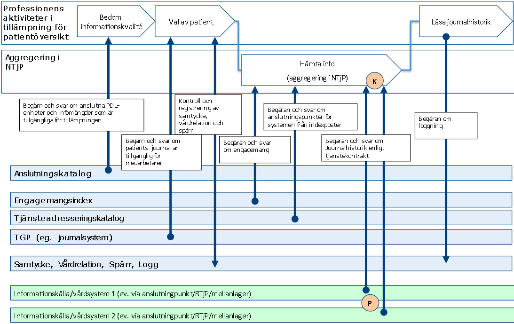
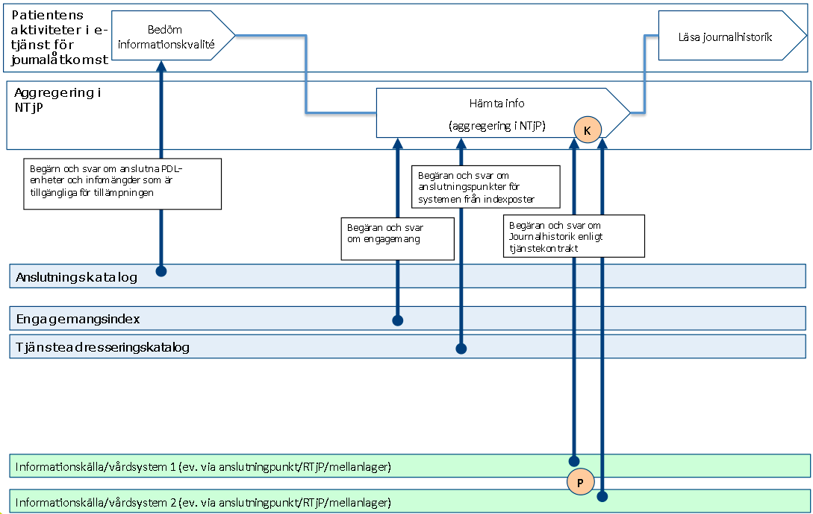
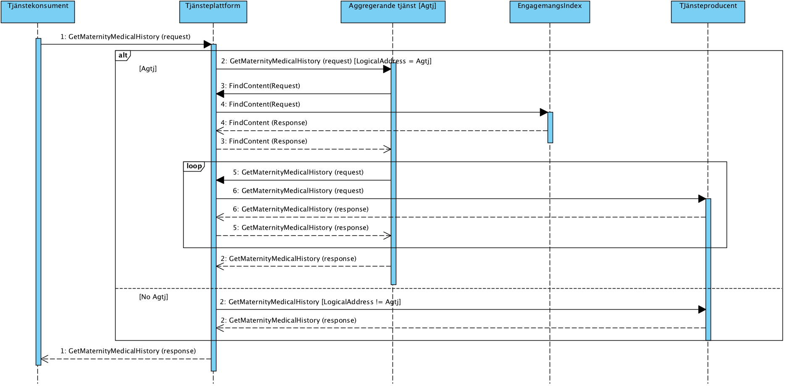
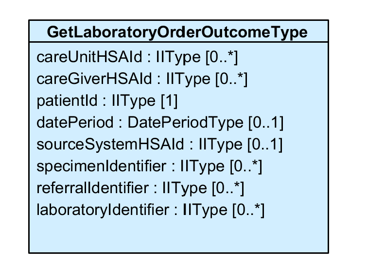
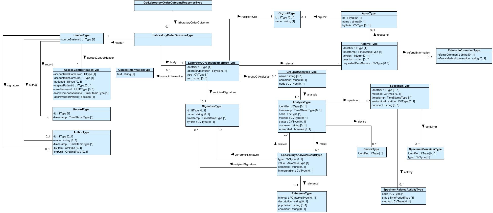
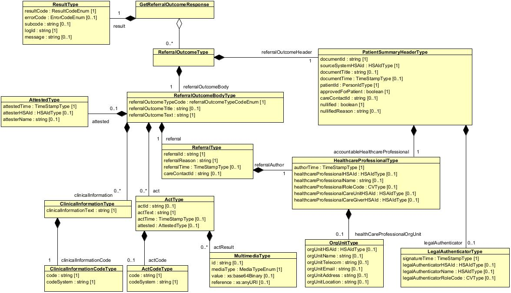
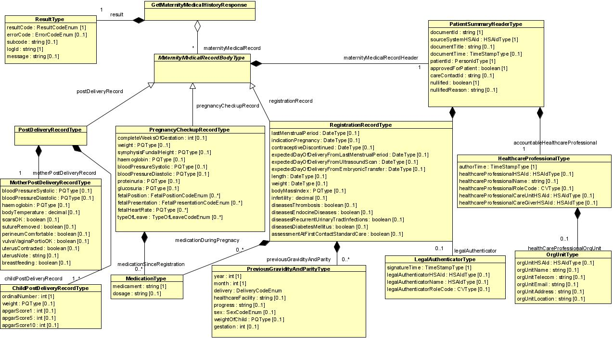
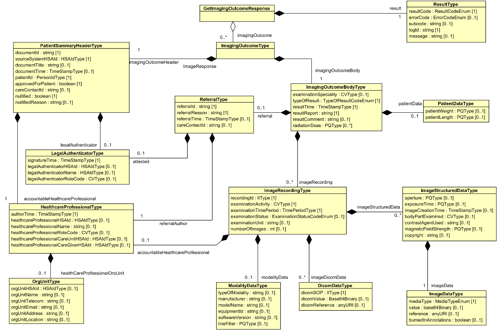

clinicalprocess healthcond actoutcome
Tjänstekontraktsbeskrivning 
Version 4.2.2 
2025-10-14

Innehållsförteckning
1	Inledning	9
1.1	Svenskt namn	9
2	Versionsinformation	10
2.1	Version 4.2	10
2.1.1	Nya tjänstekontrakt	10
2.1.2	Förändrade tjänstekontrakt	10
2.1.3	Utgångna tjänstekontrakt	11
2.2	Version tidigare	11
3	Tjänstedomänens arkitektur	11
3.1	Flöden	11
3.1.1.1	Arbetsflöde	12
3.1.1.2	Sekvensdiagram	14
3.1.2	Obligatoriska kontrakt	15
3.2	Adressering	15
3.2.1	Sammanfattning av adresseringsmodell	15
3.3	Aggregering och engagemangsindex	15
3.4	Annat	16
4	Tjänstedomänens krav och regler	17
4.1	Uppdatering av engagemangsindex	17
4.2	Informationssäkerhet och juridik	19
4.2.1	Medarbetarens direktåtkomst	19
4.2.2	Patientens direktåtkomst	20
4.2.3	Generellt	20
4.3	Icke funktionella krav	20
4.3.1	SLA krav	20
4.3.2	Övriga krav	21
4.3.2.1	Gemensamma konsumentregler	21
4.3.2.2	Gemensamma producentregler	21
4.4	Felhantering	21
4.4.1	Krav på en tjänsteproducent	21
4.4.1.1	Logiska fel	21
4.4.1.2	Tekniska fel	22
4.4.2	Krav på en tjänstekonsument	22
4.4.2.1	Logiska fel	22
4.4.2.2	Tekniska fel	22
5	Gemensamma informationskomponenter	23
5.1.1.1	CVType	23
5.1.1.2	DatePeriodType	25
5.1.1.3	DateType	25
5.1.1.4	HSAIdType	25
5.1.1.5	IIType	25
5.1.1.6	PersonIdType	26
5.1.1.7	PQIntervalType	26
5.1.1.8	PQType	27
5.1.1.9	TimePeriodType	27
5.1.1.10	TimeStampType	28
6	Tjänstedomänens meddelandemodeller	29
6.1	GetLaboratoryOrderOutcome	29
6.2	GetReferralOutcome	34
6.3	GetMaternityMedicalHistory	37
6.4	GetImagingOutcome	42
6.5	Formatregler	46
6.5.1	Format för Datum	46
6.5.2	Format för tid	46
6.5.3	Tidszon för tidpunkter	46
6.5.4	Format för patient-id	46
6.5.4.1	Personnummer	46
6.5.4.2	Samordningsnummer	46
6.5.4.3	Lokal reservidentitet	46
7	Tjänstekontrakt	47
7.1	GetLaboratoryOrderOutcome	47
7.1.1	Version	47
7.1.2	Gemensamma informationskomponenter	47
7.1.2.1	OrgUnitType	47
7.1.3	Fältregler	48
7.1.4	Övriga regler	62
7.1.4.1	Icke funktionella krav	64
7.1.4.2	SLA-krav	64
7.1.5	Annan information om kontraktet	64
7.2	GetReferralOutcome	65
7.2.1	Version	65
7.2.2	Fältregler	65
7.2.3	Övriga regler	72
7.2.3.1	Icke funktionella krav	72
7.2.3.2	SLA-krav	72
7.2.4	Annan information om kontraktet	72
7.3	GetMaternityMedicalHistory	73
7.3.1	Version	73
7.3.2	Fältregler	73
7.3.3	Övriga regler	81
7.3.3.1	Icke funktionella krav	82
7.3.3.2	SLA-krav	82
7.3.4	Annan information om kontraktet	82
7.4	GetImagingOutcome	83
7.4.1	Version	83
7.4.2	Fältregler	83
7.4.3	Övriga regler	92
7.4.3.1	Icke funktionella krav	92
7.4.3.2	SLA-krav	93
7.4.4	Annan information om kontraktet	93
Revisionshistorik

| Version | Datum | Författare | Kommentar |
| :--- | :--- | :--- | :--- |
| 4.0 | 2020-08-27 | Torbjörn Dahlin/ Khaled Daham | Ny version av GetLaboratoryOrderOutcome (4.0) som kan hantera samtliga typer av laboratoriesvar. |
| 4.0.1 | 2020-09-10 | Thomas Siltberg | Tagit bort kontraktet GetECGOutcome. / Tagit bort dubblett av contactInformation i fältreglerna för kontraktet GetLaboratoryOrderOutcome. |
| 4.0.1 | 2021-03-10 | Tobias Blomberg | Ändrat förklaringar till förkortningar / Uppdaterat inledningen till avsnitt 4.3 / Uppdaterat information om låsning i legalAuthenticatorType i GIO och GMMH / Uppdaterat beskrivning av documentId i PatientSummaryHeader i samtliga tjänstekontrakt / Uppdaterat beskrivning av tidsfiltrering i samtliga tjänstekontrakt / Uppdaterat beskrivning av attributet Most Recent Content i avsnitt 4.1. / Uppdaterat beskrivningen av attributet authorTime i strukturen ImageRecording i GIO. issue#352 / Uppdaterat beskrivningen av attributet imagingOutcomeBody.typeOfResult i GIO. issue#359 / Uppdaterat datatyp för attributet //*:header/*:signature i GLOO för att stämma överend med XSD. Issue#401 / Ändreat stavfel i GLOO / Uttdaterat OID till aktuell version för attribut //*:body/*:type i GLOO / Uppdaterat namn på urval enligt infospecen. |
| 4.0.2_ RC1 | 2021-03-10 | Thomas Siltberg | Lagt till typ på //*:header/*:author / Justerat kardinalitet på //*:header/*:author/*:timestamp / Justerat typ på //*:header/*:author/*:timestamp / Justerat kardinalitet på //*:header/*:signature/*:timestamp / Justerat typ på //*:header/*: signature /*:timestamp |
| 4.0.2_ RC1 | 2021-08-17 | Anneli Duveborg | Uppdaterat bildtexter i avsnitt 3.1.1.1 som tidigare var förväxlade |
| 4.0.2 | 2021-09-07 | Tobias Blomberg | GetMaternityMedicalHistory backad från version 3.0 till version 2.0, då version 3.0 inte är fastställd. / Uppdaterat beskrivningarna för samtliga tjänstekontrakt |
| 4.0.2_ RC1 | 2021-11-29 | Tobias Blomberg | Uppdaterat OID för SNOMED CT i GIO ../../../../bodyPartExamined / Lagt till rule004 i GLOO |
| 4.0.2_ RC1 | 2021-12-07 | Tobias Blomberg | Uppdaterat beskrivningarna för ../../documentTime och ../../../authorTime i GRO och GMMH |
| 4.0.2_RC2 | 2022-01-20 | Tobias Blomberg | Lagt tillbaks attributet ../../../plasmaGlucose i GMMH för att undvika fel. Attributet ska dock ej användas. |
| 4.0.2_RC3 | 2022-02-22 | Tobias Blomberg | Justerat V-mim för GMMH samt återigen tagit bort ../../../plasmaGlucose för att stämma med schemat / Lagt till referens till ”Tillämpningsanvisning: laboratoriemedicin” |
| 4.0.2 | 2022-03-25 | Tobias Blomberg | Domänversion fastställd |
| 4.1_RC1 | 2023-06-16 | Tobias Blomberg / Rebecca Ceder | Lagt till en kommentar under fältet //*:header/*:record/*:id i GLOO för att beskriva hur man ska använda fältet. TJN-331 / Uppdaterat kap 5 för att innefatta alla gemensamma datatyper för domänen. / Lagt till kommentar gällande hantering av datatypen IIType i GLOO. TJN-331 och TJN-333 / Lagt till OID för kodverket Befattning där det omnämns. / Lagt till fyra element under attributet //*:body/*:referral/*:requester i GLOO då dessa inte beskrivs i de gemensamma typerna på korrekt sätt. TJN-333 / Tagit bort färgkodning för multiplicitet i GLOO / Ändrat Datainspektionen till Integritetsskyddsmyndigheten på grund av namnbyte hos myndighet / Ändrat svarstiden under kap 4.3.1 från 30 sek till 27 sek enligt regler i RIV-TA. Totaltiden är fortfarande 30 sek men 3 sek behövs för bearbetning hos tjänstekonsumtenten. / Uppdaterat kapitlet ”Övriga regler” i samtliga tjänstekontrakt för att tydligare beskriva användning av CVType. / Rödmarkerat attributet lockTime i GLOO samt lagt till regel 005 om att attributet inte ska användas då låsning ej är tillåten längre. / Tagit bort följande text från attributet signatureTime i GMMH, GIO, GRO / då låsning ej är tillåtet längre: / I de fall där informationen har låsts utan signering, representeras detta genom att signatureTime sätts till tidpunkten för låsning, och resterande fält i LegalAuthenticatorType lämnas tomma. / Flyttat innehåll i TKB till senaste TKB-mallen men Ineras nya grafiska profil. / Uppdaterat beskrivningar av signaturer i GLOO enl. TJN-337 / Lagt till frivilligt fält //*:header/*:accessControlHeader/*:patientId i GLOO enl. TJN-332 / Lagt till frivilligt fält //*:header/*:author/*:orgUnit i GLOO enl. TJN-332 / Uppdaterat mappningen under kap. 6.2 för att innefatta de nya fälten //*:header/*:accessControlHeader/*:patientId och //*:header/*:author/*:orgUnit. / Tagit bort förkortningar för tjänsteproducent och tjänstekonsument i avsnittet Förkortningar då dessa inte är vedertagna. / Lagt till referens R15 som beskriver begreppen vårdgivare och vårdenhet. / Lagt alla tjänstekontraktens MIMar i samma ordning som tjänstekontraktens fältregler presenteras. / Rödmarkerat fältet ../../../legalAuthenticatorRoleCode i GIO / Uppdaterat innehållsförteckning. / Lagt till beskrivning i alla header-fält i GLOO från separat JoL-header och därmed tagit bort referens R7 som gick till JoL-headern. / Uppdaterat referens R12 så att den pekar rätt. / Tagit bort referens R13 som pekade på Interaktionsöverenskommelser för tillväxtkurvor som inte är aktuell för denna domän. / Ändrat beskrivning för fältet //*:sourceSystemHSAId i GLOO samt skrivit om regel 1.2 för att bli tydligare. / Rättat kardinaliteten för //*:header/*:author från 1..1 till 0..1 för att överensstämma med schemat. |
| 4.1 | 2023-08-29 | Tobias Blomberg | RC1 godkänd inför publicering |
| 4.1.1 | 2023-09-28 | Tobias Blomberg | Uppdaterat beskrivningen av den gemensamma datakomponenten PQIntervalType för att stämma överens med schemat. |
| 4.1.2 | 2024-01-31 | Tobias Blomberg | Stegrad domänversion. Inga uppdateringar i detta dokument. |
| 4.1.3 | 2024-02-14 | Tobias Blomberg | Stegrad domänversion. Inga uppdateringar i detta dokument. |
| 4.2 | 2024-03-26 / 2024-04-23 / 2024-06-25 | Tobias Blomberg / Rebecca Ceder | Ändrat kardinaliteten för två fält i GetLaborotoryOrderOutcome: //*:body/*:referral/*:requester från 1..1 till 0..1 / //*:body/*:referral/*:requester/*:name från 1..1 till 0..1 (TJN-392) samt uppdaterat MIM för att överensstämma med detta. Se AB-2.8. / Justerat beskrivningen för fältet //*:header/*:record i GetLaborotoryOrderOutcome för att tydliggöra hur fältet hanteras vid migrering av data. (TJN-395) / Lagt till referralInformation under klassen referral samt uppdaterat MIM (TJN-400) / Ändrat multipliciteten OrgUnitType.id i kap. 7.1.2.1 (gemensamma informationskomponenter för GLOO) från 1..1 till 0..1 för att stämma överens med schemat. / Tillägg av regel 3.4 och 3.5 för kodade värden i GLOO för att tydliggöra att urval kan komma att uppdateras över tid. / Textuella justeringar som inte påverkar innehållet förutom att göra det tydligare. |
| 4.2.1 | 2024-09-18 | Tobias Blomberg | Ändrat kardinaliteten för ../../referralOutcomeTitle i GetReferralOutcome från 1..1 till 0..1. Detta gäller både fältregeltabell och MIM. / Ändrat beskrivningen för GRO för att tydliggöra at tjänstekontraktet även omfattar begäran om övertagande av vårdansvar för en patient. |
| 4.2.2 | 2025-10-14 | Tobias Blomberg | Uppdaterad domänversion på grund av förnyade tester. Inga förändringar i detta dokument. |
Referenser

| Namn | Dokument | Kommentar | Länk |
| :--- | :--- | :--- | :--- |
| R 1 | AB_clinicalprocess_healthcond_actoutcome | Arkitekturella beslut. Finns i domänpaketet. |  |
| R 2 | RIVTA flera dokument | - | Länk |
| R 3 | Lista över vanligt förekommande kodverk och identifierare | - | Länk |
| R 4 | Handbok vid tillämpningen av Socialstyrelsens föreskrifter och allmänna råd (HSLF-FS 2016:40) om journalföring och behandling av personuppgifter i hälso- och sjukvården | - | Länk |
| R5 | Ärendehantering | - | Länk |
| R6 | IS_clinicalprocess_healthcond_actoutcome_getLaboratoryOrderOutcome | Informationsspecifikation. Finns i domänpaketet. |  |
| R8 | De facto-konventioner för datatyper | - | Länk |
| R9 | ARK-0040 - RIV Tekniska Anvisningar - Parallella huvudversioner av ett tjänstekontrakt | - | Länk |
| R10 | ”Kodverk i Nationella tjänstekontrakt” - Sammanställning av kodverk och urval på Inera | - | Länk |
| R11 | Tillämpningsanvisning: laboratoriemedicin | - | Länk |
| R12 | RIV Tekniska Anvisningar Binära bilagor | - | Länk |
| R14 | Mappning av XML-element mellan olika majorversioner av kontrakt | - | Länk |
| R15 | Förtydliganden Vårdgivare Vårdenhet | Från HSA Katalogtjänst. | Länk |
| R16 | Urval ur NPU-kodverket för att beskriva analyser inom laboratoriemedicin. | - | Länk |
Förkortningar

| Förkortning | Betydelse | Kommentar |
| :--- | :--- | :--- |
| NTjP | Nationell tjänsteplattform | Se referens [R2] |
| RTjP | Regional tjänsteplattform | Se referens [R2] |
| TGP | Tillgänglig patient | Se referens [R2] |

## Inledning
Detta är beskrivningen av tjänstekontrakten i tjänstedomänen
clinicalprocess: healthcond: actoutcome
Denna domän hanterar information gällande utfall av olika undersökningar och aktiviteter, till exempel laboratoriesvar och bilddiagnostik. Tjänstekontrakten är baserade på RIVTA 2.1 [R2] och reglerade genom arkitekturella beslut [R1].
Tjänstekontraktsbeskrivningen är en kravspecifikation. Den ska fungera som ett teknikneutralt, formellt regelverk som reglerar integrationskrav för parter (tjänstekonsumenter och tjänsteproducenter) som avser ansluta system för samverkan enligt dessa tjänstekontrakt.
Detta dokument kompletterar reglerna i de tekniska kontrakten. Tjänsteproducenter och tjänstekonsumenter ska m.a.o. följa såväl de maskintolkbara reglerna i de tekniska kontrakten, såväl som de regler som uttrycks verbalt i detta dokument.

### Svenskt namn
vård- och omsorg kärnprocess: hantera hälsorelaterade tillstånd: utfall av aktivitet utfall av aktivitet

## Versionsinformation
Denna revision av tjänstekontraktsbeskrivningen handlar om domänen clinicalprocess: healthcond: actoutcome. Observera att version för detta dokument och domänen måste vara lika. Detta för att spårbarheten inte ska brytas.

### Version 4.2.2

#### Nya tjänstekontrakt
Inga nya tjänstekontrakt.

#### Förändrade tjänstekontrakt
GetLaboratoryOrderOutcome är uppdaterad från 4.1 till 4.2
GetReferralOutcome är uppdaterad från 3.1 till 3.2
Nedan redovisas kompatibilitet mellan tjänstekonsument och tjänsteproducent för tjänstekontrakten som finns i flera versioner. Kompatibilitet avser här såväl format som semantik. För definition av kompatibilitet mellan format, se RIV Tekniska Anvisningar, Översikt.

| Tjänstekontrakt | Konsument | Producent | Kompatibilitet |
| :--- | :--- | :--- | :--- |
| GetLaboratoryOrderOutcome | 3.1 | 4.0 | Ej kompatibel |
| GetLaboratoryOrderOutcome | 4.0 | 3.1 | Ej kompatibel |
| GetLaboratoryOrderOutcome | 4.0 | 4.1 | Ej kompatibel, se arkitekturella beslut för detaljerad information om kompabilitet i detta fall [R1] |
| GetLaboratoryOrderOutcome | 4.1 | 4.0 | Kompatibel |
| GetLaboratoryOrderOutcome | 4.1 | 4.2 | Ej kompatibel, se arkitekturella beslut för detaljerad information om kompabilitet i detta fall [R1] |
| GetLaboratoryOrderOutcome | 4.2 | 4.1 | Kompatibel |
| GetLaboratoryOrderOutcome | 4.0 | 4.2 | Ej kompatibel, se arkitekturella beslut för detaljerad information om kompabilitet i detta fall [R1] |
| GetLaboratoryOrderOutcome | 4.2 | 4.0 | Kompatibel |
| GetReferralOurcome | 3.1 | 3.2 | Ej kompatibel, se arkitekturella beslut för detaljerad information om kompabilitet i detta fall [R1] |
|  | 3.2 | 3.1 | Kompatibel |

#### Utgångna tjänstekontrakt
Inga tjänstekontrakt har utgått.

### Version tidigare
4.2.1

## Tjänstedomänens arkitektur
I detta avsnitt beskrivs hur T-boken tillämpats i tjänstedomänen. Avsnittet syftar till att ge läsaren överblick och förståelse. Avsnittet innehåller inga regler, men ger ett sammanhang för de regler som beskrivs i övriga delar av dokumentet.
Tjänsterna för beskrivning av hälsorelaterade tillstånd erbjuder sökning av information i vårdgivarnas system för patientadministration och vårddokumentation. Utgångspunkten för tjänsterna i denna tjänstedomän är i första hand patientens och professionens behov av direktåtkomst till en patients hälso- och sjukvårdshistorik sett ur ett nationellt eller ett regionalt perspektiv. I båda fallen är syftet att historisk information sammanställs från det eller de källsystem där det finns historik via s.k. aggregerande tjänster, snarare än att begära information från ett specifikt system eller en specifik verksamhet.
Tjänstekontrakten erbjuder även möjlighet att nå information från ett specifikt system eller en specifik verksamhet. Behovet av att rikta en fråga till ett specifikt system uppstår främst när tjänstekonsumenten också är prenumerant på notifieringar från engagemangsindex och på det sättet (via ProcessNotification) får information om en händelse i ett specifikt system. Det är då ändamålsenligt att adressera det specifika systemet, istället för den aggregerande tjänsten.
Följande flödesmodeller beskriver översiktligt hur tjänstekontrakten är tänkta att användas. Tjänstekonsument (K) och tjänsteproducenter (P) är markerade i figurerna.

### Flöden
Nedanstående diagram visar hur flödet principiellt ser ut när information ur kontrakt i tjänstedomänen efterfrågas och hanteras.

##### Arbetsflöde

**
Figur 1. Exempel: Adressering vid anrop till aggregerande vårdgivartjänst (t.ex. från NPÖ).

*Figur 2. Exempel: Adressering vid anrop till aggregerande tjänst från patienttjänst (t.ex. från 1177 Journal).*

###### Roller

| Namn/beteckning | Beskrivning alt. referens |
| :--- | :--- |
| Patienten | Den patient som vill få tillgång till information som tjänsterna tillhandahåller. |
| Professionen | Den hälso- och sjukvårdspersonal som vill få tillgång till patientens data. |

##### Sekvensdiagram

*Figur 3. Sekvensdiagram över sökning efter information där GetMaternityMedicalHistory används som exempel men samma princip gäller för alla läskontrakt i tjänstedomänen, diagrammet visar på två alternativa sekvenser där det första alternativet gäller när aggregerande tjänster adresseras och det andra alternativet gäller när källsystemet adresseras direkt av tjänstekonsument.*

| Namn | Beskrivning |
| :--- | :--- |
| Tjänstekonsument | Det system som används för att konsumera information. Dvs. det system som använder tjänster enligt ett tjänstekontrakt. |
| Tjänsteplattform | Det lager som hanterar virtuella tjänster, aggregerande tjänster samt anpassningstjänster. |
| Aggregerande tjänst | En integrationstjänst som för en tjänstekonsument sammanställer en nationell vy av informationen av den typ som är aktuell för tjänsten i fråga. Är beroende av engagemangsindex för att begränsa sökningen till relevanta informationsägare. |
| Engagemangsindex | En tjänst där det finns uppdaterade nationella index över vilka informationsägare som har information kring en viss invånare/patient. |
| Tjänsteproducent | Det system som i detta fall utgör källsystemet som vårdpersonal direkt registrerar/uppdaterar/raderar information i. |

#### Obligatoriska kontrakt
Tjänstedomänen specificerar inga flöden, alla tjänstekontrakt är frivilliga.

### Adressering
Tjänstedomänen tillämpar källsystem-adressering. Observera att tjänstekonsumenter främst anropar aggregerande tjänster.
Tjänstekonsumenten adresserar den aggregerande tjänsten med antingen nationellt HSA-id (Ineras HSA-id) eller HSA-id för aktuell huvudman om det är en regional- eller huvudmanna-specifik (t.ex. ”regional”) aggregerande tjänst som ska adresseras.
Det finns också fall då en tjänstekonsument adresserar ett källsystem. Det förutsätter att tjänstekonsumenten känner till källsystemets HSA-id. Det sker genom att ett sådant anrop föregås av ett anrop till en aggregerande tjänst (källsystemets HSA-id finns då i svarsmeddelandet) eller genom att tjänstekonsumenten är producent för Engagemangsindex notifieringskontrakt (ProcessNotification). Notifieringen innehåller information om en händelse rörande en patients information i ett specifikt källsystem. Genom att använda informationen om källsystemets HSA-id kan tjänstekonsumenten direktadressera källsystemet i syfte att hämta information om den händelse som just notifierats för patienten.
Adressering sker i enlighet med RIV Tekniska Anvisningar Översikt, Rev PD2, avsnitt 8.3 [R2], där mer information kan hittas.

#### Sammanfattning av adresseringsmodell

| Åtkomstbehov för patientens journalhistorik | Logisk adress |
| :--- | :--- |
| Nationellt | Ineras HSA-id: 5565594230 |
| För en huvudman/region | Huvudmannens/regionens HSA-id |
| För ett källsystem | Källsystemets HSA-id |

### Aggregering och engagemangsindex
Det behövs en aggregerande tjänst för varje tjänstekontrakt som läser data i denna domän.
Aggregerande tjänster har samma tjänstekontrakt och anropsadress som en traditionell virtuell tjänst, men nås via olika logiska adresser.
Om ett källsystems HSA-id anges som logisk adress, kommer frågemeddelandet att dirigeras vidare direkt till källsystemet av tjänsteplattformen utan att passera en aggregerande tjänst.
Om logisk adress är HSA-id för Inera eller en huvudman kommer anropet att dirigeras till aggregerande tjänsten som i sin tur – efter att ha konsulterat engagemangsindex – vidarebefordrar frågan till de källsystem som har information om patienten.

### Annat
Det finns ej annat att beskriva kring tjänstedomänens arkitektur.

## Tjänstedomänens krav och regler
Dessa gäller alla tjänstekontrakt i hela tjänstedomänen om inte undantag görs för specifika tjänstekontrakt senare i dokumentet.

### Uppdatering av engagemangsindex
Alla källsystem ska uppdatera engagemangsindex. Engagemangsindex ska uppdateras så snart en händelse inträffar som påverkar indexposterna enligt beskrivningen nedan.
All uppdatering av engagemangsindex sker genom att källsystemet anropar engagemangsindex genom tjänstekontraktet urn:riv:itintegration:engagementindex:UpdateResponder:1 (”index-push”). Ladda hem Engagemangsindex WSDL, scheman och tjänstekontraktsbeskrivning, för detaljer se referens [R2].
Följande regler gäller för innehållet i begäran till engagemangsindex för uppdateringar som rör denna tjänstedomän:

| Attribut | Beskrivning | Format | Kardinalitet | Kodverk/värdemängd 
/ev. begränsningar | Beslutsregler och kommentar |
| :--- | :--- | :--- | :--- | :--- | :--- |
| Registered ResidentIdent Identification | Invånarens personnummer | Person eller samordningsnummer enligt skatteverkets definition (12 tecken). / Lokal reservidentitet får ej anges | 1..1 | Validering med xml-regexp uttryckt enligt: / [0-9]{8}[0-9A-Zptf]{4} | Del av instansens unikhet |
| Service domain* | Den tjänstedomän som förekomsten avser. | URN på formen <regelverk>:<huvuddomän>:<underdomän>. | 1..1 | Värdet ska vara ”riv:clinicalprocess:healthcond:actoutcome” | Del av instansens unikhet |
| Categori-zation* | Kategorisering enligt kodverk som är specifikt för tjänste-domänen | Text bestående av bokstäver i ASCII. | 1..1 | Informationsmängd som finns i källsystemet för angiven patient och som indexposten avser. Anges med kortform enligt tabell nedan. | Del av instansens unikhet |
| Logical address* | Referens till informationskällan enligt tjänste-domänens definition | Logisk adress enligt adresseringsmodell för den tjänstedomän som anges av fältet Service Domain. | 1..1 | Samma värde som fältet Source System. | Del av instansens unikhet |
| Business object Instance Identifier* | Unik identifierare för händelse-bärande objekt | Text | 1..1 | ”NA” – dvs. ej tillämpat för tjänstedomänen. | Del av instansens unikhet |
| Clinical process interest Id | Hälsoärende-id | GUID | 1..1 | ”NA” (ännu ej tillämpat i tjänstedomänen) | Del av instansens unikhet |
| Most Recent Content* | Tidpunkt för senaste uppdatering av den informationstyp och patient i den källa som denna indexpost avser. | DT | 1..1 | Tidpunkt för senaste händelse som matchar indexposten. Kan även avse borttagning. Ex: En indexpost representerar 2 bef. dokument. Ett av dem tas bort. Det markeras genom att bef. post uppdateras med tidpunkt för borttagningshändelsen. |  |
| Creation / Time | Tidpunkten då index-posten registrerades | DT | 1..1 | Sätts automatiskt av EI-instansen. | Genereras automatiskt av kontraktets tjänste-producent |
| Update Time | Tidpunkten då index-posten senast upp-daterades | DT | 0..1 | Sätts automatiskt av EI-instansen. | Uppdatering innebär ny post som matchar samtliga attribut som är del av en instans unikhet. |
| Source system | Käll-systemet som genererade engagemangs-posten via Update-tjänsten | Systemets HSA-id.  För system-adresserade tjänstedomäner motsvarar detta LogicalAddress vid anrop till tjänster i tjänstedomänen i fråga. Detta är inte anslutningspunktens HSA-id utan systemet som operativt hanterar informationen i verksamheten. | 1..1 | Systemadressering tillämpas. Detta värde används som LogicalAddress vid tjänsteanrop. | Del av instansens unikhet |
| Data Controller | Personuppgiftsansvarig organisation | Ett värde som i källsystemet med id SourceSystem unikt identifierar PU-ansvarig organisation. | 1..1 | ”SE”<organisationsnummer>, (t ex: ”SE5565594230”), HSA-id, eller systemspecifik identitet. | Del av instansens unikhet |
Regler för tilldelning av värde i fältet Categorization i engagemangsposten i denna domän:

| Infomängd enl. Tjänstekontrakt | Värde på Categorization |
| :--- | :--- |
| GetMaternityMedicalHistory | utr-mtr |
| GetReferralOutcome | und-kon-ure |
| GetLaboratoryOrderOutcome | und-kkm-ure |
| GetImagingOutcome | und-bdi-ure |

### Informationssäkerhet och juridik

#### Medarbetarens direktåtkomst
Vid sammanhållen journalföring ansvarar verksamheten som erbjuder sina medarbetare direktåtkomst till detta för att patientdatalagen efterlevs. Det innebär bl.a. att spärrkontroll kan behöva genomföras innan information kan visas. Det innebär också att regelverket för samtycke, vårdrelation och åtkomstloggning måste följas. Dessutom finns krav från Integritetsskyddsmyndigheten om ytterligare teknisk åtkomstkontroll.
HSLF-FS 2016:40 ställer också krav (via ”Handbok vid tillämpningen av Socialstyrelsens föreskrifter och allmänna råd (HSLF-FS 2016:40) om journalföring och behandling av personuppgifter i hälso- och sjukvården”, se referens R4) på att medarbetaren är starkt autentiserad om medarbetarens inloggning sker i nät som delas med flera vårdgivare och att uppdragsval görs i samband med autentisering (vårdenhet). Det kompletta regelverket finns i handboken samt i anvisningar för tillgänglig patient.
Observera att tjänstekontrakten i sig inte påtvingar sammanhållen journalföring. Krav rörande sammanhållen journalföring och eller krav på spärrhantering uppstår först om tjänstekonsumenten (e-tjänsten) för medarbetaren tillgängliggör information som härrör från andra vårdgivare (sammanhållen journalföring) eller andra vårdenheter inom egna vårdgivaren (spärrkrav).

#### Patientens direktåtkomst
Alla tjänstekontrakten i denna tjänstedomän har en svarsflagga som anger om verksamheten (informationsägaren) godkänt att informationen får visas för patient. Det kan t.ex. ha skett genom menprövning eller rådrum. För vissa informationsmängder, exempelvis vårdkontakter, kan informationsägaren policymässigt har menprövat all information. Det är varje vårdgivares ansvar att tjänsteproducenten sätter ”kan visas för patient”-flaggan i enlighet med vårdgivarens verksamhetsregler.

#### Generellt
Tjänsteproducenten ansvarar för att information endast lämnas ut till de tjänstekonsumenter som informationsägaren godkänt. Det är inte ett juridiskt krav, men tydliggörs här eftersom det avviker från T-boken i det att tjänsteplattformen då inte ansvarar för den tekniska åtkomstkontrollen (ej möjligt när systembaserad adressering tillämpas). Om informationsägaren har behov av att reglera åtkomst per tjänstekonsument, ska tjänsteproducenten filtrera svaret enligt informationsägarens önskemål. Observera att det är regionala policyer snarare än lagar och förordningar som styr i vilken grad tjänsteproducenten ska begränsa åtkomst för en viss tjänstekonsument. Kunskapen om tjänstekonsumentens (tjänstens) identitet (dvs. ursprunglig tjänstekonsument i anropskedjan) får bara användas för teknisk åtkomstbegränsning på så sätt att svaret blir som om de vårdenheter vars verksamhetschef inte godkänner aktuell tjänstekonsument varit exkluderade i frågan.

### Icke funktionella krav
Det är den informationsproducerande vårdgivarens ansvar att endast ett källsystem tillhandahåller informationen via lästjänst och engagemangsindex där patientdata lagras i flera källsystem. Konsumenter som är anslutna till flera majorversioner av samma kontrakt måste hantera dubblettborttagning mellan dessa. Detta sker genom att jämföra identiteter på postnivå och endast behålla en av de poster som returnerats, se R9.

#### SLA krav
Följande generella SLA-krav gäller för alla tjänsteproducenter som tillhandahåller tjänster. Dessa krav gäller där inget annat anges för ett specifikt tjänstekontrakt.
Följande SLA-krav gäller för producenter av tjänstekontrakten i denna domän.

| Kategori | Värde |
| :--- | :--- |
| Svarstid | Svarstiden för ett anrop får inte överstiga 27 sekunder. |
| Tillgänglighet | 24x7, 99,5% |
| Last | Tjänsteproducenten ska kunna hantera minst dubbla mängden frågor per dygn i förhållande till antalet journaluppdateringar per dygn. |
| Aktualitet | Kraven på aktualitet varierar för olika tjänstekonsumenter. Det behöver inte vara absolut aktualitet i förhållande till källsystemet, men ju mindre fördröjning desto bättre. Ett riktmärke är att försöka undvika längre fördröjning än 60 minuter. Fördröjningen avser både journaldata och uppdatering av engagemangsindex. / Uppdatering av engagemangspost måste ske så att engagemangsposten refererar data som är omedelbart tillgängligt via tjänstekontraktet. |
| Robusthet | Om komplett tidsintervall inte angivits i frågan kan tjänsteproducenten välja att lämna ett delsvar i syfte att uppfylla svarstidskravet. Delsvaret måste då vara avgränsat i tiden genom att det finns äldre men inte nyare data än det äldsta som returnerats. |
| Samtidighet | Tjänsteproducenten ska hantera minst 10 samtidiga frågor. |

#### Övriga krav

##### Gemensamma konsumentregler
R1: Filtrera enligt flagga ”approvedForPatient”
R2: Tillämpa regelverk enl. PDL
R3: Aggregerande sökning förutsätter användning av individens senast gällande huvudidentitet, användning av andra identiteter för individ är enbart tillåten i vid anrop till ett källsystem.

##### Gemensamma producentregler
R1: Filtrera enligt RIVTA-headern LogicalAddress. Svarsmeddelandet får endast innehålla information som skapats i det källsystem som anges av frågemeddelandets LogicalAddress.
R2: Tjänsteproducenten ska i svaret leverera all information på en begäran riktad mot en giltig personidentifierare, dvs. även information som tidigare har registrerats på andra till individen kopplade identiteter (lokal reservidentitet, tidigare samordningsnummer eller tidigare personnummer)

### Felhantering

#### Krav på en tjänsteproducent

##### Logiska fel
N/A

##### Tekniska fel
Vid ett tekniskt fel levereras ett generellt undantag (SOAP Fault). Exempel på detta kan vara deadlock i databasen eller följdeffekter av programmeringsfel. Tekniska fel får inte förmedla personuppgifter. Istället rekommenderas att ett logg-id förmedlas, som ger möjlighet för tjänsteproducentens förvaltning att bistå tjänstekonsumentens förvaltning med felsökning. Ett logg-id bör vara en UUID.

#### Krav på en tjänstekonsument

##### Logiska fel
Inga krav på konsument.

##### Tekniska fel
Inga krav på konsument.

## Gemensamma informationskomponenter
Gemensamma informationskomponenter är typer gemensamma för användning i tjänstekontrakt i flera domäner. Nedan listas de gemensamma typer som används i domänen. Dessa är hämtade från version 20 av de gemensamma datatyperna [R8].

##### CVType
En CVType är en referens till ett begrepp som definieras i ett externt kodverk (kodsystem, terminologi eller ontologi). Se vanligt förekommande kodverk [R3]. En CVType kan innehålla en enkel kod, det vill säga en hänvisning till ett begrepp som definieras direkt av det refererade kodverket, eller den kan innehålla ett uttryck i någon syntax definierad av det refererade kodverket som kan utvärderas, exempelvis begreppet "vänster fot" som är ett postkoordinerat uttryck byggt från den primära koden "FOT" och bestämningen "VÄNSTER".

| Namn | Datatyp | Beskrivning | Kardinalitet |
| :--- | :--- | :--- | :--- |
| code | string | Kod eller uttryck definierad enligt kodverket. | 0..1 |
| codeSystem | string | Kodverket som definierar koden. | 0..1 |
| codeSystemName | string | Kodverkets namn i klartext. | 0..1 |
| codeSystemVersion | string | Versionsangivelse som har definierats specifikt för det givna kodverket. | 0..1 |
| displayName | string | Den läsbara representationen (klartext) av koden eller uttrycket som definieras av kodverket. | 0..1 |
| originalText | string | Texten så som sedd och/eller vald av användaren som har matat in den, och som representerar användarens avsedda betydelse. | 0..1 |

###### Regler CVType
code
code ska vara en exakt match till en kod eller ett uttryck definierat av kodverket, som refereras till i codeSystem. Om kodverket definierar en kod eller ett uttryck som inkluderar mellanslag, ska koden inkludera mellanslaget. Ett uttryck kan endast användas där kodverket antingen definierar en uttryckssyntax, eller där det finns en allmänt accepterad syntax för kodverket.
Det åligger det mottagande systemet att bedöma om man kontrollerar huruvida det är ett uttryck som har skickats istället för en enkel kod, och utvärdera uttrycket istället för att behandla uttrycket som en kod. I vissa fall kan det vara oklart eller tvetydigt om koden representerar en enda symbol eller ett uttryck. Detta uppstår vanligtvis där kodverket definierar ett uttrycksspråk och sedan definierar prekoordinerade begrepp med symboler som matchar deras uttryck, t.ex. UCUM. I andra fall är det säkert att behandla uttrycket som en symbol. Det finns ingen garanti för att detta alltid är säkert: definitionerna i kodverket bör alltid konsulteras för att avgöra hur man ska hantera potentiella uttryck.
codeSystem
Kodverk ska refereras till genom en globalt unik identifierare, som möjliggör entydig hänvisning till standardkodverk eller andra lokala kodverk. Identifieraren ska vara en Universally Unique Identifier (UUID), Object Identifier (OID), eller Uniform Resource Identifier (URI). En CVType som har ett kodattribut ska ha ett kodverk som specificerar begreppsystemet som definierar koden.
codeSystemName
Syftet med ett kodverksnamn är att hjälpa en mänsklig tolkare av en kod att tolka codeSystem. Tjänstekonsumenter och tjänsteproducenter som använder codeSystemName ska INTE funktionellt förlita sig på kodverkets namn. Dessutom KAN de välja att inte implementera kodverkets namn men ska INTE avvisa instanser då namnet finns.
codeSystemVersion
Olika versioner av ett kodverk måste vara kompatibla. Per definition ska en kod ha samma betydelse i alla versioner av ett kodverk. Mellan versioner kan koder inaktiveras men inte tas bort eller återanvändas. Om klartexten av en kod ändras måste den fortfarande vara kompatibel (lika) mellan olika kodverksversioner.
displayName
Om ifylld, ska klartexten vara den läsbara representationen av koden eller uttrycket som definieras av kodverket vid tiden för datainmatningen. Om kodverket inte definierar en klartext för koden eller uttrycket, kan ingen tillhandahållas. Tjänstekonsumenter och tjänsteproducenter som hävdar direkt eller indirekt överensstämmelse KAN välja att inte implementera klartext men ska INTE avvisa instanser då klartext finns.
Huvudsyfte med klartexten är att stödja implementationsfelsökning, men kan även användas till andra tillämpningsspecifika ändamål som till exempel visning för användaren i gränssnittet.
originalText
Det finns två godkända tillämpningar av elementet originalText:
OriginalText kan användas för att beskriva det en användare angav och som representeras av koden. I en situation där användaren dikterar eller skriver text är originalText den text som matats in eller yttrats av användaren.
OriginalText kan användas i de fall producenten avser ange ett värde som saknar kod. I dessa fall motsvarar originalText benämningen för värdet som saknar kod. Behov att tillföra nya koder till kodverket förmedlas till den som ansvarar för kodverkets innehåll.
OriginalText ska vara den exakta text så som den presenteras i originalkällan utan att på något sätt bearbetas eller omvandlas. Således ska originalText representeras i vanlig textform.

##### DatePeriodType
Ett datumintervall anges normalt sett med ett start- och ett slutdatum, men öppna intervall är tillåtna. Huruvida ändpunkterna inkluderas i intervallet eller ej bör tydligt beskrivas vid varje enskild tillämpning.

| Namn | Datatyp | Beskrivning | Kardinalitet |
| :--- | :--- | :--- | :--- |
| start | DateType | Periodens startdatum. Minst ett av start och end skall anges. | 0..1 |
| end | DateType | Periodens startdatum. Minst ett av start och end skall anges. | 0..1 |

##### DateType
Datum anges som en sträng med formatet ”ÅÅÅÅMMDD”. Detta motsvarar den ISO 8601 och ISO 8824-kompatibla formatbeskrivningen ”YYYYMMDD”. Tidszon anges inte. Datum ska anges i tidszonerna CET (svensk normaltid) respektive CEST (svensk normaltid med justering för sommartid).

##### HSAIdType

| Namn | Datatyp | Beskrivning | Kardinalitet |
| :--- | :--- | :--- | :--- |
| hsaId | string | HSA­id enligt definition från Inera AB. I de fall då HSA­id inte finns tillgängligt ska ett för källsystemet lokalt id användas. Lokala id:n får enbart användas i OrgUnitType, och då endast i undantagsfall | 1..1 |

##### IIType
En IIType är en numerisk eller alfanumerisk sträng som kan härledas till ett enskilt objekt eller entitet i ett känt system. Exempel är ett personnummer eller ett vårdkontakts-id. Se identifierare i nationella tjänstekontrakt [R3].

| Namn | Datatyp | Beskrivning | Kardinalitet |
| :--- | :--- | :--- | :--- |
| root | string | En identifierare som i sig själv eller tillsammans med värdet för extension är universellt unik. Om extension anges är root en unik identifierare av namnrymden för värdet som anges i extension. | 1..1 |
| extension | string | En identifierare som tillsammans med värdet för root är universellt unik. Används om värdet på root inte är universellt unikt. / OBS! I schemafilen för GetLaboratoryOrderOutcome finns ett fel som innebär att både extension och root måste anges i datatypen IIType när information skickas med detta tjänstekontrakt. Se AB-2.7 i arkitekturella beslut för mer information [R1] | 0..1 |

###### Regler för IIType
root
När root används som en identifierare av en namnrymd ska identifieraren vara en Universally Unique Identifier (UUID), Object Identifier (OID), eller Uniform Resource Identifier (URI).
extension
Vissa scheman för identifierare definierar formateringsmöjligheter för deras kodvärden. Till exempel så skrivs personnumret vanligtvis med bindestreck, 19121212-1212. Bindestrecket bär dock ingen betydelse och kan utelämnas, som i 191212121212.

##### PersonIdType
Person-id är vanligtvis ett personnummer, men kan även vara samordningsnummer eller reservnummer. Syftar till att identifiera en privatperson.

| Namn | Datatyp | Beskrivning | Kardinalitet |
| :--- | :--- | :--- | :--- |
| id | string | Identiteten enligt den identitetstyp (type) som angivits. Om identiteten är av typ personnummer eller samordningsnummer skall denna anges med 12 tecken utan skiljetecken. | 1..1 |
| type | string | OID för typ av identifierare. | 1..1 |

##### PQIntervalType
Typ som baseras på datatypen IVL_PQ enligt HL7, och som beskriver överföring av intervaller av mätbara värden (”Physical Quantity”). Ett intervall som är öppet i ena änden kan anges.
Tillåtna värden för ”unit” bestäms av http://unitsofmeasure.org/ucum.html. Dimension ska preciseras av fältregel vid tillämpning (ex. ”Massa”). Vaksamhet skall iakttagas vid konvertering mellan enheter.
Notera att den specialiserade datatypen decimal-primitive används istället för xmltyperna double/decimal. Decimal-primitive behåller signifikanta avslutande 0:or, till skillnad från de föregående. Denna lösning är tagen från HL7 FHIR Release 4 - datatyper.

| Namn | Datatyp | Beskrivning | Kardinalitet |
| :--- | :--- | :--- | :--- |
| low | decimal-primitive | Mätetal mätt i enheten som anges av ”unit”. Minst ett av fälten low och high måste anges. | 0..1 |
| lowClosed | boolean | Angivelse av om värdet är en del av intervallet eller ej. / Exempel: / lowClosed = true och low = 5 motsvarar intervallet ≥ 5 / lowClosed = false och low = 5 motsvarar intervallet > 5 | 0..1 |
| high | decimal-primitive | Mätetal mätt i enheten som anges av ”unit”. Minst ett av fälten low och high måste anges. | 0..1 |
| highClosed | boolean | Angivelse av om värdet är en del av intervallet eller ej. / Exempel: / highClosed = true och high = 5 motsvarar intervallet ≤ 5 / highClosed = false och high = 5 motsvarar intervallet <5 | 0..1 |
| unit | string | Enhet enligt [http://unitsofmeasure.org/ucum.html UCUM] | 1..1 |

##### PQType
Typ som baseras på datatypen PQ enligt HL7, och som beskriver överföring av mätbara värden (”Physical Quantity”). Tillåtna värden för ”unit” bestäms av http://unitsofmeasure.org/ucum.html. Dimension ska preciseras av fältregel vid tillämpning (ex. ”Massa”). Vaksamhet skall iakttagas vid konvertering mellan enheter.
Notera att den specialiserade datatypen decimal-primitive används istället för xmltyperna double/decimal. Decimal-primitive behåller signifikanta avslutande 0:or, till skillnad från de föregående. Denna lösning är tagen från HL7 FHIR Release 4 - datatyper.

| Namn | Datatyp | Beskrivning | Kardinalitet |
| :--- | :--- | :--- | :--- |
| value | decimal-primitive | Mätetal mätt i enheten som anges av ”unit”. | 1..1 |
| unit | string | Enhet enligt [http://unitsofmeasure.org/ucum.html UCUM] | 1..1 |

##### TimePeriodType
Ett tidsintervall anges normalt sett med en start- och en sluttidpunkt, men öppna intervall är tillåtna. Huruvida ändpunkterna inkluderas i intervallet eller ej bör tydligt beskrivas vid varje enskild tillämpning.

| Namn | Datatyp | Beskrivning | Kardinalitet |
| :--- | :--- | :--- | :--- |
| start | TimeStampType | Periodens starttid. Minst ett av start och end skall anges. | 0..1 |
| end | TimeStampType | Periodens sluttid. Minst ett av start och end skall anges. | 0..1 |

##### TimeStampType
Tidpunkt anges som en sträng med formatet ”ÅÅÅÅMMDDttmmss”. Detta motsvarar den ISO 8601 och ISO 8824-kompatibla formatbeskrivningen ”YYYYMMDDhhmmss”. Tidszon anges inte. Tidpunkt ska anges i tidszonerna CET (svensk normaltid) respektive CEST (svensk normaltid med justering för sommartid).

## Tjänstedomänens meddelandemodeller
Här beskrivs meddelandemodeller för respektive tjänstekontrakt.

### GetLaboratoryOrderOutcome
Begäran

Svar

Nedanstående tabell mappar mellan de svenska klass- och attributnamnen i informationsspecifikation och tillämpningsanvisning, xml-schematyperna från det tekniska kontraktet samt referensinformationsmodellen Nationell Informationsstruktur 2020:1 från Socialstyrelsen.

| XSD schema | Informationsmodell | Nationell Informationsstruktur 2020:1 |
| :--- | :--- | :--- |
| //*:body/*:groupOfAnalyses/*:analysis/*:specimen/*:activity/*:code | Provrelaterad aktivitet.kod | Aktivitet.kod |
| //*:body/*:groupOfAnalyses/*:analysis/*:specimen/*:activity/*:time | Provrelaterad aktivitet.tid | Aktivitet.tid |
| //*:body/*:groupOfAnalyses/*:analysis/*:specimen/*:activity/*:method | Provrelaterad aktivitet.metod | Aktivitet.metod |
| //*:body/*:groupOfAnalyses/*:analysis/*:specimen/*:container/*:identifier | Provbehållare.id | Resurs.id |
| //*:body/*:groupOfAnalyses/*:analysis/*:specimen/*:container/*:type | Provbehållare.typ | Resurs.typ |
| //*:header/*:accessControlHeader/*:patientId / samt / //*:header/*:accessControlHeader/*:originalPatientId | Patient.id | Patient.id |
| //*:header/*:accessControlHeader/*:patientId / samt / //*:header/*:accessControlHeader/*:originalPatientId | Person.id | Person.person-id |
| saknar motsvarighet | Person.namn | Person.förnamn / samt / Person.efternamn / samt / Person.mellannamn |
| saknar motsvarighet | Person.födelsetidpunkt | Person.födelsedatum |
| saknar motsvarighet | Person.kön | Person.kön |
| //*:header/*:record/*:id / samt / //*:body/*:identifier | Laboratoriesvar.id | saknar motsvarighet |
| //*:body/*:laboratoryIdentifier | Laboratoriesvar.laboratorie-id | Organisation.id |
| //*:body/*:type | Laboratoriesvar.typ | saknar motsvarighet |
| //*:body/*:text | Laboratoriesvar.text | saknar motsvarighet |
| //*:header/*:record/*:timestamp | Laboratoriesvar.svarstidpunkt | saknar motsvarighet |
| //*:body/*:contactInformation/*:text | Kontaktinformation.text | saknar motsvarighet. kan avse / Organisation.namn / Organisation.adress / Organisation.elektroniskAdress / eller / Hälso- och sjukvårdspersonal.adress / Hälso- och sjukvårdspersonal.elektroniskAdress |
| //*:body/*:referral/*:identifier | Remiss.remiss-id | saknar motsvarighet |
| //*:body/*:referral/*:timestamp | Remiss.remisstidpunkt | Vårdbegäran.tidpunkt |
| //*:body/*:referral/*:version | Remiss.versionsnummer | saknar motsvarighet |
| //*:body/*:referral/*:question | Remiss.frågeställning | Vårdbegäran.orsak |
| //*:body/*:referral/*:requestedCareService | Remiss.efterfrågad tjänst | Aktivitet.kod |
| //*:body/*:referral/*:referralInformation/*:referralComment | Remiss.kommentar från beställare | saknar motsvarighet |
| //*:body/*:referral/*:referralInformation/*referralMedicalInformation | Remiss.medicinsk information | saknar motsvarighet |
| //*:body/*:groupOfAnalyses/*:analysis/*:specimen/*:identifier | Prov.id | Resurs.id |
| //*:body/*:groupOfAnalyses/*:analysis/*:specimen/*:material/*:code och codesystem / eller / //*:body/*:groupOfAnalyses/*:analysis/*:specimen/*:material/*:originalText | Prov.material | saknar direkt motsvarighet men kan uttryckas med / Resursegenskap.typ / Resursegenskap.värde |
| //*:body/*:groupOfAnalyses/*:analysis/*:specimen/*:timestamp | Prov.provtagningstidpunkt | saknar direkt motsvarighet men kan uttryckas med / Resursegenskap.typ / Resursegenskap.värde |
| //*:body/*:groupOfAnalyses/*:analysis/*:specimen/*:anatomicalLocation/*:code och codesystem / eller / //*:body/*:groupOfAnalyses/*:analysis/*:specimen/*:anatomicalLocation/*:originalText | Prov.anatomisk lokalisation | saknar direkt motsvarighet men kan uttryckas med / Resursegenskap.typ / Resursegenskap.värde |
| //*:body/*:groupOfAnalyses/*:analysis/*:specimen/*:comment | Prov.kommentar | saknar direkt motsvarighet men kan uttryckas med / Resursegenskap.typ / Resursegenskap.värde |
| //*:body/*:groupOfAnalyses/*:name | Analysgrupp.namn | saknar direkt motsvarighet |
| //*:body/*:groupOfAnalyses/*:code | Analysgrupp.listkod | Observation.typ |
| //*:body/*:groupOfAnalyses/*:comment | Analysgrupp.gruppkommentar | Observation.beskrivning |
| //*:header/*:accessControlHeader/*:accountableCareGiver / samt / //*:header/*:accessControlHeader/*:accountableCareUnit / samt / //*:body/*:referral/*:requester/*:orgUnit/*:id / samt / //*:body/*:recipientUnit/*:id / samt / //*:header/*:author/*:orgUnit/*:id | Organisatorisk enhet.id | Organisation.id |
| //*:body/*:referral/*:requester/*:orgUnit/*:name / samt / //*:body/*:recipientUnit/*:name / samt / //*:header/*:author/*:orgUnit/*:name | Organisatorisk enhet.namn | Organisation.namn |
| saknar motsvarighet i TKB | Organisatorisk enhet.typ av verksamhet | Organisation.typ |
| //*:header/*:author/*:id / samt / //*:header/*:signature/*:id / samt / //*:body/*:groupOfAnalyses/*:analysis/*:result/*:recipientSignature/*:id / samt / //*:body/*:groupOfAnalyses/*:analysis/*:result/*:performerSignature/*:id / samt / //*:body/*:recipientSignature/*:id / samt / //*:body/*:referral/*:requester/*:id | Hälso- och sjukvårdspersonal.id | Hälso- och sjukvårdspersonal.id |
| //*:body/*:referral/*:requester/*:name / samt / //*:header/*:author/*:name / samt / //*:header/*:signature/*:name / samt / //*:body/*:recipientSignature/*:name / samt / //*:body/*:groupOfAnalyses/*:analysis/*:result/*:recipientSignature/*:name / samt / //*:body/*:groupOfAnalyses/*:analysis/*:result/*:performerSignature/*:name | Hälso- och sjukvårdspersonal.namn | Person.förnamn / samt / Person.efternamn / samt / Person.mellannamn |
| //*:header/*:author/*:byRole / samt / //*:body/*:recipientSignature/*:byRole / samt / //*:body/*:groupOfAnalyses/*:analysis/*:result/*:recipientSignature/*:byRole / samt / //*:body/*:groupOfAnalyses/*:analysis/*:result/*:performerSignature/*:byRole / samt / //*:header/*:signature/*:byRole / samt / //*:body/*:referral/*:requester/*:byRole | Hälso- och sjukvårdspersonal.befattning | Hälso- och sjukvårdspersonal.befattning |
| //*:body/*:groupOfAnalyses/*:analysis/*:device/*:identifier | Analysutrustning.id | Resurs.id |
| saknar motsvarighet | Analysutrustning.typ | Resurs.typ |
| saknar motsvarighet | Analysutrustning.beskrivning | saknar motsvarighet |
| //*:body/*:groupOfAnalyses/*:analysis/*:identifier | Laboratorieanalys.id | Uppgift i patientjournal.id |
| //*:body/*:groupOfAnalyses/*:analysis/*:status | Laboratorieanalys.status | Aktivitet.status |
| //*:body/*:groupOfAnalyses/*:analysis/*:code | Laboratorieanalys.kod | Aktivitet.kod |
| //*:body/*:groupOfAnalyses/*:analysis/*:timestamp | Laboratorieanalys.tid | Aktivitet.tid |
| //*:body/*:groupOfAnalyses/*:analysis/*:method | Laboratorieanalys.metod | Aktivitet.metod |
| //*:body/*:groupOfAnalyses/*:analysis/*:comment | Laboratorieanalys.kommentar | Aktivitet.beskrivning |
| //*:body/*:groupOfAnalyses/*:analysis/*:accredited | Laboratorieanalys.ackrediterad metod | saknar motsvarighet |
| //*:body/*:groupOfAnalyses/*:analysis/*:result/*:reference/*:interval | Referens.intervall | saknar motsvarighet |
| //*:body/*:groupOfAnalyses/*:analysis/*:result/*:reference/*:description | Referens.text | saknar motsvarighet |
| //*:body/*:groupOfAnalyses/*:analysis/*:result/*:reference/*:population | Referens.population | saknar motsvarighet |
| //*:body/*:groupOfAnalyses/*:analysis/*:result/*:reference/*:comment | Referens.kommentar | saknar motsvarighet |
| //*:body/*:groupOfAnalyses/*:analysis/*:result/*:type | Laboratorieanalysresultat.typ | Observation.typ |
| //*:body/*:groupOfAnalyses/*:analysis/*:result/*:value | Laboratorieanalysresultat.värde | Observation.värde |
| //*:body/*:groupOfAnalyses/*:analysis/*:result/*:comment | Laboratorieanalysresultat.kommentar | Observation.beskrivning |
| //*:body/*:groupOfAnalyses/*:analysis/*:result/*:interpretation | Laboratorieanalysresultat.tolkning | saknar direkt motsvarighet men kan uttryckas med / Observation.värde Observation.beskrivning |
| saknar motsvarighet | Laboratorieanalysresultat.negation | Observation.negation |
| //*:body/*:groupOfAnalyses/*:analysis/*:result/*:performerSignature/*:timestamp / samt / //*:body/*:groupOfAnalyses/*:analysis/*:result/*:recipientSignature/*:timestamp / samt / //*:header/*:signature/*:timestamp / samt / //*:body/*:recipientSignature/*:timestamp | Signering.tidpunkt | Deltagande.tid |
| //*:header/*:accessControlHeader/*:careProcessId | kan ej mappas | Individanpassad vårdprocess.id |
| .//*:header/*:accessControlHeader/*:lockTime | kan ej mappas | kan ej mappas |
| //*:header/*:accessControlHeader/*:blockComparisonTime | kan ej mappas | kan ej mappas |
| //*:header/*:accessControlHeader/*:approvedForPatient | kan ej mappas | kan ej mappas |
| //*:header/*:sourceSystemId | kan ej mappas | kan ej mappas |
| //*:header/*:author/*:timestamp | kan ej mappas | kan ej mappas |

### GetReferralOutcome
Meddelandeformatet är kompatibelt med HL7v3 CDA v.2.

| Klass.attribut | Mappning mot XSD schema |
| :--- | :--- |
| ReferralOutcomeType |  |
| ReferralOutcomeHeaderType.documentId | referralOutcome/referralOutcomeHeader/documentId |
| ReferralOutcomeHeaderType.sourceSystemHSAId | referralOutcome/referralOutcomeHeader/sourceSystemHSAId |
| ReferralOutcomeHeaderType.documentTitle | referralOutcome/referralOutcomeHeader/documentTitle |
| ReferralOutcomeHeaderType.documentTime | referralOutcome/referralOutcomeHeader/documentTime |
| ReferralOutcomeHeaderType.patientId | referralOutcome/referralOutcomeHeader/patientId |
| ReferralOutcomeHeaderType.accountableHealthcareProfessional | referralOutcome/referralOutcomeHeader/accountableHealthcareProfessional |
| HealthcareProfessionalType.authorTime | referralOutcome/referralOutcomeHeader/ accountableHealthcareProfessional /authorTime |
| HealthcareProfessionalType.healthcareProfessionalHSAId | referralOutcome/referralOutcomeHeader/accountableHealthcareProfessional/healthcareProfessionalHSAId |
| HealthcareProfessionalType.healthcareProfessionalName | referralOutcome/referralOutcomeHeader/accountableHealthcareProfessional/healthcareProfessionalName |
| HealthcareProfessionalType.healthcareProfessionalRoleCode | referralOutcome/referralOutcomeHeader/accountableHealthcareProfessional/healthcareProfessionalRoleCode |
| OrgUnitType.orgUnitHSAId | referralOutcome/referralOutcomeHeader/accountableHealthcareProfessional/healthcareProfessionalOrgUnit/orgUnitHSAId |
| OrgUnitType.orgUnitname | referralOutcome/referralOutcomeHeader/accountableHealthcareProfessional/healthcareProfessionalOrgUnit/orgUnitname |
| OrgUnitType.orgUnitTelecom | referralOutcome/referralOutcomeHeader/accountableHealthcareProfessional/healthcareProfessionalOrgUnit/orgUnitTelecom |
| OrgUnitType.orgUnitEmail | referralOutcome/referralOutcomeHeader/accountableHealthcareProfessional/healthcareProfessionalOrgUnit/orgUnitEmail |
| OrgUnitType.orgUnitAddress | referralOutcome/referralOutcomeHeader/accountableHealthcareProfessional/healthcareProfessionalOrgUnit/orgUnitAddress |
| OrgUnitType.orgUnitLocation | referralOutcome/referralOutcomeHeader/accountableHealthcareProfessional/healthcareProfessionalOrgUnit/orgUnitLocation |
| HealthcareProfessionalType.healthcareProfessionalCareUnitHSAId | referralOutcome/referralOutcomeHeader/accountableHealthcareProfessional/healthcareProfessionalCareUnitHSAId |
| HealthcareProfessionalType.healthcareProfessionalCareGiverHSAId | referralOutcome/referralOutcomeHeader/accountableHealthcareProfessional/healthcareProfessionalCareGiverHSAId |
| LegalAuthenticatorType.signatureTime | referralOutcome/referralOutcomeHeader/legalAuthenticator/signatureTime |
| LegalAuthenticatorType.legalAuthenticatorHSAId | referralOutcome/referralOutcomeHeader/legalAuthenticator/legalAuthenticatorHSAId |
| LegalAuthenticatorType.legalAuthenticatorName | referralOutcome/referralOutcomeHeader/legalAuthenticator/legalAuthenticatorName |
| ReferralOutcomeHeaderType.approvedForPatient | referralOutcome/referralOutcomeHeader/approvedForPatient |
| ReferralOutcomeHeaderType.careContactId | referralOutcome/referralOutcomeHeader/careContactId |
| ReferralOutcomeBodyType |  |
| ReferralOutcomeBodyType.referralOutcomeTypeCode | referralOutcome/referralOutcomeBody/referralOutcomeTypeCode |
| ReferralOutcomeBodyType.referralOutcomeTitle | referralOutcome/referralOutcomeBody/referralOutcomeTitle |
| ReferralOutcomeBodyType.referralOutcomeText | referralOutcome/referralOutcomeBody/referralOutcomeText |
| ClinicalInformationType.clinicalInformationCode | referralOutcome/referralOutcomeBody/clinicalInformation/clinicalInformationCode |
| ClinicalInformationType.clinicalInformationText | referralOutcome/referralOutcomeBody/clinicalInformation/clinicalInformationText |
| ActType.actId | referralOutcome/referralOutcomeBody/act/actId |
| ActType.actCode | referralOutcome/referralOutcomeBody/act/actCode |
| ActType.actText | referralOutcome/referralOutcomeBody/act/actText |
| ActType.actTime | referralOutcome/referralOutcomeBody/act/actTime |
| ActType.actResult | referralOutcome/referralOutcomeBody/act/actResult |
| ReferralType.referralId | referralOutcome/referralOutcomeBody/referral/referralId |
| ReferralType.referralReason | referralOutcome/referralOutcomeBody/referral/referralReason |
| ReferralType.referralTime | referralOutcome/referralOutcomeBody/referral/referralTime |
| ReferralType.referralAuthor | referralOutcome/referralOutcomeBody/referral/referralAuthor |
| HealthcareProfessionalType.authorTime | referralOutcome/referralOutcomeBody/referral/referralAuthor/authorTime |
| HealthcareProfessionalType.healthcareProfessionalHSAId | referralOutcome/referralOutcomeBody/referral/referralAuthor/healthcareProfessionalHSAId |
| HealthcareProfessionalType.healthcareProfessionalName | referralOutcome/referralOutcomeBody/referral/referralAuthor/healthcareProfessionalName |
| HealthcareProfessionalType.healthcareProfessionalRoleCode | referralOutcome/referralOutcomeBody/referral/referralAuthor/healthcareProfessionalRoleCode |
| HealthcareProfessionalType.healthcareProfessionalOrgUnit.orgUnitHSAId | referralOutcome/referralOutcomeBody/referral/referralAuthor/healthcareProfessionalOrgUnit/orgUnitHSAId |
| HealthcareProfessionalType.healthcareProfessionalOrgUnit.orgUnitName | referralOutcome/referralOutcomeBody/referral/referralAuthor/healthcareProfessionalOrgUnit/orgUnitName |
| HealthcareProfessionalType.healthcareProfessionalOrgUnit.orgUnitTelecom | referralOutcome/referralOutcomeBody/referral/referralAuthor/healthcareProfessionalOrgUnit/orgUnitTelecom |
| HealthcareProfessionalType.healthcareProfessionalOrgUnit.orgUnitEmail | referralOutcome/referralOutcomeBody/referral/referralAuthor/healthcareProfessionalOrgUnit/orgUnitEmail |
| HealthcareProfessionalType.healthcareProfessionalOrgUnit.orgUnitAddress | referralOutcome/referralOutcomeBody/referral/referralAuthor/healthcareProfessionalOrgUnit/orgUnitAddress |
| HealthcareProfessionalType.healthcareProfessionalOrgUnit.orgUnitLocation | referralOutcome/referralOutcomeBody/referral/referralAuthor/healthcareProfessionalOrgUnit/orgUnitLocation |
| ReferralType.careContactId | referralOutcome/referralOutcomeBody/referral/careContactId |
| ResultType | result |
| ResultType.resultCode | result/resultCode |
| ResultType.errorCode | result/errorCode |
| ResultType.subcode | result/subcode |
| ResultType.logId | result/logId |
| ResultType.message | result/message |

### GetMaternityMedicalHistory
Modellen beskriver den logiska strukturen för ett svarsmeddelande. Tjänsten baseras på Socialstyrelsens blanketter för mödravårdsjournal.

| Klass.attribut | Mappning mot XSD schema |
| :--- | :--- |
| MaternityMedicalHistoryType |  |
| MaternityMedicalHistoryHeaderType.documentId | maternityMedicalHistory/maternityMedicalHistoryHeader/documentId |
| MaternityMedicalHistoryHeaderType.sourceSystemHSAId | maternityMedicalHistory/maternityMedicalHistoryHeader/sourceSystemHSAId |
| MaternityMedicalHistoryHeaderType.patientId | maternityMedicalHistory/maternityMedicalHistoryHeader/patientId |
| MaternityMedicalHistoryHeaderType.accountableHealthcareProfessional | maternityMedicalHistory/maternityMedicalHistoryHeader/accountableHealthcareProfessional |
| HealthcareProfessionalType.authorTime | maternityMedicalHistory/maternityMedicalHistoryHeader/accountableHealthcareProfessional /authorTime |
| HealthcareProfessionalType.healthcareProfessionalHSAId | maternityMedicalHistory/maternityMedicalHistoryHeader/accountableHealthcareProfessional/healthcareProfessionalHSAId |
| HealthcareProfessionalType.healthcareProfessionalName | maternityMedicalHistory/maternityMedicalHistoryHeader/accountableHealthcareProfessional/healthcareProfessionalName |
| HealthcareProfessionalType.healthcareProfessionalRoleCode | maternityMedicalHistory/maternityMedicalHistoryHeader/accountableHealthcareProfessional/healthcareProfessionalRoleCode |
| OrgUnitType.orgUnitHSAId | maternityMedicalHistory/maternityMedicalHistoryHeader/accountableHealthcareProfessional/healthcareProfessionalOrgUnit/orgUnitHSAId |
| OrgUnitType.orgUnitname | maternityMedicalHistory/maternityMedicalHistoryHeader/accountableHealthcareProfessional/healthcareProfessionalOrgUnit/orgUnitname |
| OrgUnitType.orgUnitTelecom | maternityMedicalHistory/maternityMedicalHistoryHeader/accountableHealthcareProfessional/healthcareProfessionalOrgUnit/orgUnitTelecom |
| OrgUnitType.orgUnitEmail | maternityMedicalHistory/maternityMedicalHistoryHeader/accountableHealthcareProfessional/healthcareProfessionalOrgUnit/orgUnitEmail |
| OrgUnitType.orgUnitAddress | maternityMedicalHistory/maternityMedicalHistoryHeader/accountableHealthcareProfessional/healthcareProfessionalOrgUnit/orgUnitAddress |
| OrgUnitType.orgUnitLocation | maternityMedicalHistory/maternityMedicalHistoryHeader/accountableHealthcareProfessional/healthcareProfessionalOrgUnit/orgUnitLocation |
| HealthcareProfessionalType.healthcareProfessionalCareUnitHSAId | maternityMedicalHistory/maternityMedicalHistoryHeader/accountableHealthcareProfessional/healthcareProfessionalCareUnitHSAId |
| HealthcareProfessionalType.healthcareProfessionalCareGiverHSAId | maternityMedicalHistory/maternityMedicalHistoryHeader/accountableHealthcareProfessional/healthcareProfessionalCareGiverHSAId |
| LegalAuthenticatorType.signatureTime | maternityMedicalHistory/maternityMedicalHistoryHeader/legalAuthenticator/signatureTime |
| LegalAuthenticatorType.legalAuthenticatorHSAId | maternityMedicalHistory/maternityMedicalHistoryHeader/legalAuthenticator/legalAuthenticatorHSAId |
| LegalAuthenticatorType.legalAuthenticatorName | maternityMedicalHistory/maternityMedicalHistoryHeader/legalAuthenticator/legalAuthenticatorName |
| MaternityMedicalHistoryHeaderType.approvedForPatient | maternityMedicalHistory/maternityMedicalHistoryHeader/approvedForPatient |
| MaternityMedicalHistoryHeaderType.careContactId | maternityMedicalHistory/maternityMedicalHistoryHeader/careContactId |
| MaternityMedicalHistoryBodyType |  |
| RegistrationRecordType.lastMenstrualPeriod | maternityMedicalHistory/maternityMedicalHistoryBody/registrationRecord/lastMenstrualPeriod |
| RegistrationRecordType.indicationPregnancy | maternityMedicalHistory/maternityMedicalHistoryBody/registrationRecord/indicationPregnancy |
| RegistrationRecordType.contraceptiveDiscontinued | maternityMedicalHistory/maternityMedicalHistoryBody/registrationRecord/contraceptiveDiscontinued |
| RegistrationRecordType.expectedDayOfDeliveryFromLastMenstrualPeriod | maternityMedicalHistory/maternityMedicalHistoryBody/registrationRecord/expectedDayOfDeliveryFromLastMentrualPeriod |
| RegistrationRecordType.expectedDayOfDeliveryFromUltrasoundScan | maternityMedicalHistory/maternityMedicalHistoryBody/registrationRecord/expectedDayOfDeliveryFromUltrasoundScan |
| RegistrationRecordType.expectedDayOfDeliveryFromEmbryonicTransfer | maternityMedicalHistory/maternityMedicalHistoryBody/registrationRecord/expectedDayOfDeliveryFromEmbryonicTransfer |
| RegistrationRecordType.length | maternityMedicalHistory/maternityMedicalHistoryBody/registrationRecord/length |
| RegistrationRecordType.weight | maternityMedicalHistory/maternityMedicalHistoryBody/registrationRecord/weight |
| RegistrationRecordType.bodyMassIndex | maternityMedicalHistory/maternityMedicalHistoryBody/registrationRecord/bodyMassIndex |
| RegistrationRecordType.infertility | maternityMedicalHistory/maternityMedicalHistoryBody/registrationRecord/infertility |
| PreviousGravidityAndParityType.year | maternityMedicalHistory/maternityMedicalHistoryBody/registrationRecord/previousGravidityAndParity/year |
| PreviousGravidityAndParityType.delivery | maternityMedicalHistory/maternityMedicalHistoryBody/registrationRecord/previousGravidityAndParity/delivery |
| PreviousGravidityAndParityType.healthcareFacility | maternityMedicalHistory/maternityMedicalHistoryBody/registrationRecord/previousGravidityAndParity/healthcareFacility |
| PreviousGravidityAndParityType.progress | maternityMedicalHistory/maternityMedicalHistoryBody/registrationRecord/previousGravidityAndParity/progress |
| PreviousGravidityAndParityType.sex | maternityMedicalHistory/maternityMedicalHistoryBody/registrationRecord/previousGravidityAndParity/sex |
| PreviousGravidityAndParityType.weightOfChild | maternityMedicalHistory/maternityMedicalHistoryBody/registrationRecord/previousGravidityAndParity/weightOfChild |
| PreviousGravidityAndParityType.gestation | maternityMedicalHistory/maternityMedicalHistoryBody/registrationRecord/previousGravidityAndParity/gestation |
| PreviousGravidityAndParityType.diseasesThrombosis | maternityMedicalHistory/maternityMedicalHistoryBody/registrationRecord/previousGravidityAndParity/diseasesThrombosis |
| PreviousGravidityAndParityType.diseasesEndocrineDiseases | maternityMedicalHistory/maternityMedicalHistoryBody/registrationRecord/previousGravidityAndParity/diseasesEndocrineDiseases |
| PreviousGravidityAndParityType.diseasesReccurentUrinaryTractInfections | maternityMedicalHistory/maternityMedicalHistoryBody/registrationRecord/previousGravidityAndParity/diseasesRecurrentUrinaryTractInfections |
| PreviousGravidityAndParityType.diseasesDiabetesMellitus | maternityMedicalHistory/maternityMedicalHistoryBody/registrationRecord/previousGravidityAndParity/diseasesDiabetesMellitus |
| PreviousGravidityAndParityType.assessmentAtFirstContactStandardCare | maternityMedicalHistory/maternityMedicalHistoryBody/registrationRecord/previousGravidityAndParity/assessmentAtFirstContactStandardCare |
| PregnancyCheckupRecordType.completeWeeksOfGestation | maternityMedicalHistory/maternityMedicalHistoryBody/pregnancyCheckupRecord/completeWeeksOfGestation |
| PregnancyCheckupRecordType.weight | maternityMedicalHistory/maternityMedicalHistoryBody/pregnancyCheckupRecord/weight |
| PregnancyCheckupRecordType.symphysisFundalHeight | maternityMedicalHistory/maternityMedicalHistoryBody/pregnancyCheckupRecord/symphysisFundalHeight |
| PregnancyCheckupRecordType.haemoglobin | maternityMedicalHistory/maternityMedicalHistoryBody/pregnancyCheckupRecord/haemoglobin |
| PregnancyCheckupRecordType.bloodPressureSystolic | maternityMedicalHistory/maternityMedicalHistoryBody/pregnancyCheckupRecord/bloodPressureSystolic |
| PregnancyCheckupRecordType.bloodPressureDiastolic | maternityMedicalHistory/maternityMedicalHistoryBody/pregnancyCheckupRecord/bloodPressureDiastolic |
| PregnancyCheckupRecordType.proteinuria | maternityMedicalHistory/maternityMedicalHistoryBody/pregnancyCheckupRecord/proteinuria |
| PregnancyCheckupRecordType.glycosuria | maternityMedicalHistory/maternityMedicalHistoryBody/pregnancyCheckupRecord/glycosuria |
| PregnancyCheckupRecordType.fetalPosition | maternityMedicalHistory/maternityMedicalHistoryBody/pregnancyCheckupRecord/fetalPosition |
| PregnancyCheckupRecordType.fetalPresentation | maternityMedicalHistory/maternityMedicalHistoryBody/pregnancyCheckupRecord/fetalPresentation |
| PregnancyCheckupRecordType.fetalHeartRate | maternityMedicalHistory/maternityMedicalHistoryBody/pregnancyCheckupRecord/fetalHeartRate |
| PregnancyCheckupRecordType.typeOfLeave | maternityMedicalHistory/maternityMedicalHistoryBody/pregnancyCheckupRecord/typeOfLeave |
| MotherPostDeliveryRecordType.breastfeeding | maternityMedicalHistory/maternityMedicalHistoryBody/pregnancyCheckupRecord/completeWeeksOfGestation |
| MotherPostDeliveryRecordType.bloodPressureSystolic | maternityMedicalHistory/maternityMedicalHistoryBody/postDeliveryRecord/motherPostDeliveryRecord/bloodPressureSystolic |
| MotherPostDeliveryRecordType.bloodPressureDiastolic | maternityMedicalHistory/maternityMedicalHistoryBody/postDeliveryRecord/motherPostDeliveryRecord/bloodPressureDiastolic |
| MotherPostDeliveryRecordType.haemoglobin | maternityMedicalHistory/maternityMedicalHistoryBody/postDeliveryRecord/motherPostDeliveryRecord/haemoglobin |
| MotherPostDeliveryRecordType.bodyTemperature | maternityMedicalHistory/maternityMedicalHistoryBody/postDeliveryRecord/motherPostDeliveryRecord/bodyTemperature |
| MotherPostDeliveryRecordType.scarsOK | maternityMedicalHistory/maternityMedicalHistoryBody/postDeliveryRecord/motherPostDeliveryRecord/scarsOK |
| MotherPostDeliveryRecordType.sutureRemoved | maternityMedicalHistory/maternityMedicalHistoryBody/postDeliveryRecord/motherPostDeliveryRecord/sutureRemoved |
| MotherPostDeliveryRecordType.perineumComfortable | maternityMedicalHistory/maternityMedicalHistoryBody/postDeliveryRecord/motherPostDeliveryRecord/perineumComfortable |
| MotherPostDeliveryRecordType.vulvaVaginaPortioOK | maternityMedicalHistory/maternityMedicalHistoryBody/postDeliveryRecord/motherPostDeliveryRecord/vulvaVaginaPortioOK |
| MotherPostDeliveryRecordType.uterusContracted | maternityMedicalHistory/maternityMedicalHistoryBody/postDeliveryRecord/motherPostDeliveryRecord/uterusContracted |
| MotherPostDeliveryRecordType.uterusNote | maternityMedicalHistory/maternityMedicalHistoryBody/postDeliveryRecord/motherPostDeliveryRecord/uterusNote |
| ChildPostDeliveryRecordType.ordinalNumber | maternityMedicalHistory/maternityMedicalHistoryBody/postDeliveryRecord/childPostDeliveryRecord/ordinalNumber |
| ChildPostDeliveryRecordType.weight | maternityMedicalHistory/maternityMedicalHistoryBody/postDeliveryRecord/childPostDeliveryRecord/weight |
| ChildPostDeliveryRecordType.apgarScore1 | maternityMedicalHistory/maternityMedicalHistoryBody/postDeliveryRecord/childPostDeliveryRecord/apgarScore1 |
| ChildPostDeliveryRecordType.apgarScore5 | maternityMedicalHistory/maternityMedicalHistoryBody/postDeliveryRecord/childPostDeliveryRecord/apgarScore5 |
| ChildPostDeliveryRecordType.apgarScore10 | maternityMedicalHistory/maternityMedicalHistoryBody/postDeliveryRecord/childPostDeliveryRecord/apgarScore10 |
| MedicationType.medicament | maternityMedicalHistory/maternityMedicalHistoryBody/registrationRecord/previousGravidityAndParity/medicationDuringPregnancy/medicament / samt / maternityMedicalHistory/maternityMedicalHistoryBody/pregnancyCheckupRecord/medicationSinceRegistration/medicament |
| MedicationType.dosage | maternityMedicalHistory/maternityMedicalHistoryBody/pregnancyCheckupRecord/medicationSinceRegistration/dosage |
| ResultType | result |
| ResultType.resultCode | result/resultCode |
| ResultType.errorCode | result/errorCode |
| ResultType.subcode | result/subcode |
| ResultType.logId | result/logId |
| ResultType.message | result/message |

### GetImagingOutcome

| Klass.attribut | Mappning mot XSD schema |
| :--- | :--- |
| PatientSummaryHeaderType.documentId | ImagingOutcome/ImagingOutcomeHeader/documentId |
| PatientSummaryHeaderType.sourceSystemHSAId | ImagingOutcome/ImagingOutcomeHeader/sourceSystemHSAId |
| PatientSummaryHeaderType.documentTitle | ImagingOutcome/ImagingOutcomeHeader/documentTitle |
| PatientSummaryHeaderType.documentTime | ImagingOutcome/ImagingOutcomeHeader/documentTime |
| PatientSummaryHeaderType.patientId | ImagingOutcome/ImagingOutcomeHeader/patientId |
| PatientSummaryHeaderType.approvedForPatient | ImagingOutcome/ImagingOutcomeHeader/approvedForPatient |
| PatientSummaryHeaderType.careContactId | ImagingOutcome/ImagingOutcomeHeader/careContactId |
| PatientSummaryHeaderType.nullified | ImagingOutcome/ImagingOutcomeHeader/nullified |
| PatientSummaryHeaderType.nullifiedReason | ImagingOutcome/ImagingOutcomeHeader/nullifiedReason |
| HealthcareProfessionalType.authorTime | ImagingOutcome/ImagingOutcomeHeader/AccountableHealthcareProfessional/authorTime |
| HealthcareProfessionalType.healthcareProfessionalHSAId | ImagingOutcome/ImagingOutcomeHeader/AccountableHealthcareProfessional/healthcareProfessionalHSAId |
| HealthcareProfessionalType.healthcareProfessionalName | ImagingOutcome/ImagingOutcomeHeader/AccountableHealthcareProfessional/healthcareProfessionalName |
| HealthcareProfessionalType.healthcareProfessionalRoleCode | ImagingOutcome/ImagingOutcomeHeader/AccountableHealthcareProfessional/healthcareProfessionalRoleCode |
| HealthcareProfessionalType.healthcareProfessionalCareUnitHSAId | ImagingOutcome/ImagingOutcomeHeader/AccountableHealthcareProfessional/healthcareProfessionalCareUnitHSAId |
| HealthcareProfessionalType.healthcareProfessionalCareGiverHSAId | ImagingOutcome/ImagingOutcomeHeader/AccountableHealthcareProfessional/healthcareProfessionalCareGiverHSAId |
| OrgUnitType.orgUnitHSAId | ImagingOutcome/ImagingOutcomeHeader/AccountableHealthcareProfessional/HealthcareProfessionalOrgUnit/orgUnitHSAId |
| OrgUnitType.orgUnitName | ImagingOutcome/ImagingOutcomeHeader/AccountableHealthcareProfessional/HealthcareProfessionalOrgUnit/orgUnitName |
| OrgUnitType.orgUnitTelecom | ImagingOutcome/ImagingOutcomeHeader/AccountableHealthcareProfessional/HealthcareProfessionalOrgUnit/orgUnitTelecom |
| OrgUnitType.orgUnitEmail | ImagingOutcome/ImagingOutcomeHeader/AccountableHealthcareProfessional/HealthcareProfessionalOrgUnit/orgUnitEmail |
| OrgUnitType.orgUnitAddress | ImagingOutcome/ImagingOutcomeHeader/AccountableHealthcareProfessional/HealthcareProfessionalOrgUnit/orgUnitAddress |
| OrgUnitType.orgUnitLocation | ImagingOutcome/ImagingOutcomeHeader/AccountableHealthcareProfessional/HealthcareProfessionalOrgUnit/orgUnitLocation |
| LegalAuthenticatorType.signatureTime | ImagingOutcome/ImagingOutcomeHeader/LegalAuthenticator/signatureTime |
| LegalAuthenticatorType.legalAuthenticatorHSAId | ImagingOutcome/ImagingOutcomeHeader/LegalAuthenticator/legalAuthenticatorHSAId |
| LegalAuthenticatorType.legalAuthenticatorName | ImagingOutcome/ImagingOutcomeHeader/LegalAuthenticator/legalAuthenticatorName |
| LegalAuthenticatorType.legalAuthenticatorRoleCode | ImagingOutcome/ImagingOutcomeHeader/LegalAuthenticator/legalAuthenticatorRoleCode |
| ImageBodyType |  |
| ImageBodyType.examinationSpeciality | ImagingOutcome/ImagingOutcomeBody/examinationSpeciality |
| PatientDataType.patientWeight | ImagingOutcome/ImagingOutcomeBody/PatientData/patientWeight |
| PatientDataType.patientLength | ImagingOutcome/ImagingOutcomeBody/PatientData/patientLength |
| ImageBodyType.typeOfResult | ImagingOutcome/ImagingOutcomeBody/typeOfResult |
| ImageBodyType.resultTime | ImagingOutcome/ImagingOutcomeBody/resultTime |
| ImageBodyType.resultReport | ImagingOutcome/ImagingOutcomeBody/resultReport |
| ImageBodyType.resultComment | ImagingOutcome/ImagingOutcomeBody/resultComment |
| ImageBodyType.radiationDose | ImagingOutcome/ImagingOutcomeBody/radiationDose |
| ReferralType.referralId | ImagingOutcome/ImagingOutcomeBody/Referral/referralId |
| ReferralType.referralReason | ImagingOutcome/ImagingOutcomeBody/Referral/referralReason |
| ReferralType.anamnesis | ImagingOutcome/ImagingOutcomeBody/Referral/anamnesis |
| ReferralType.careContactId | ImagingOutcome/ImagingOutcomeBody/Referral/careContactId |
| HealthcareProfessionalType.authorTime | ImagingOutcome/ImagingOutcomeBody/Referral/AccountableHealthcareProfessional/authorTime |
| HealthcareProfessionalType.healthcareProfessionalHSAId | ImagingOutcome/ImagingOutcomeBody/Referral/AccountableHealthcareProfessional/healthcareProfessionalHSAId |
| HealthcareProfessionalType.healthcareProfessionalName | ImagingOutcome/ImagingOutcomeBody/Referral/AccountableHealthcareProfessional/healthcareProfessionalName |
| HealthcareProfessionalType.healthcareProfessionalRoleCode | ImagingOutcome/ImagingOutcomeBody/Referral/AccountableHealthcareProfessional/healthcareProfessionalRoleCode |
| HealthcareProfessionalType.healthcareProfessionalCareUnitHSAId | ImagingOutcome/ImagingOutcomeBody/Referral/AccountableHealthcareProfessional/healthcareProfessionalCareUnitHSAId |
| HealthcareProfessionalType.healthcareProfessionalCareGiverHSAId | ImagingOutcome/ImagingOutcomeBody/Referral/AccountableHealthcareProfessional/healthcareProfessionalCareGiverHSAId |
| OrgUnitType.orgUnitHSAId | ImagingOutcome/ImagingOutcomeBody/Referral/AccountableHealthcareProfessional/HealthcareProfessionalOrgUnit/orgUnitHSAId |
| OrgUnitType.orgUnitName | ImagingOutcome/ImagingOutcomeBody/Referral/AccountableHealthcareProfessional/HealthcareProfessionalOrgUnit/orgUnitName |
| OrgUnitType.orgUnitTelecom | ImagingOutcome/ImagingOutcomeBody/Referral/AccountableHealthcareProfessional/HealthcareProfessionalOrgUnit/orgUnitTelecom |
| OrgUnitType.orgUnitEmail | ImagingOutcome/ImagingOutcomeBody/Referral/AccountableHealthcareProfessional/HealthcareProfessionalOrgUnit/orgUnitEmail |
| OrgUnitType.orgUnitAddress | ImagingOutcome/ImagingOutcomeBody/Referral/AccountableHealthcareProfessional/HealthcareProfessionalOrgUnit/orgUnitAddress |
| OrgUnitType.orgUnitLocation | ImagingOutcome/ImagingOutcomeBody/Referral/AccountableHealthcareProfessional/HealthcareProfessionalOrgUnit/orgUnitLocation |
| ReferralType.attested | ImagingOutcome/ImagingOutcomeBody/Referral/Attested |
| LegalAuthenticatorType.signatureTime | ImagingOutcome/ImagingOutcomeBody/Referral/Attested/signatureTime |
| LegalAuthenticatorType.legalAuthenticatorHSAId | ImagingOutcome/ImagingOutcomeBody/Referral/Attested/legalAuthenticatorHSAId |
| LegalAuthenticatorType.legalAuthenticatorName | ImagingOutcome/ImagingOutcomeBody/Referral/Attested/legalAuthenticatorName |
| LegalAuthenticatorType.legalAuthenticatorRoleCode | ImagingOutcome/ImagingOutcomeBody/Referral/Attested/legalAuthenticatorRoleCode |
| ImageRecordingType.id | ImagingOutcome/ImagingOutcomeBody/ImageRecording/id |
| ImageRecordingType.examinationActivity | ImagingOutcome/ImagingOutcomeBody/ImageRecording/examinationActivity |
| ImageRecordingType.examinationTimePeriod | ImagingOutcome/ImagingOutcomeBody/ImageRecording/examinationTimePeriod |
| ImageRecordingType.examinationStatus | ImagingOutcome/ImagingOutcomeBody/ImageRecording/examinationStatus |
| ImageRecordingType.examinationUnit | ImagingOutcome/ImagingOutcomeBody/ImageRecording/examinationUnit |
| ImageRecordingType.numberOfImages | ImagingOutcome/ImagingOutcomeBody/ImageRecording/numberOfImages |
| ImageDicomDataType.dicomSOP | ImagingOutcome/ImagingOutcomeBody/ImageRecording/ImageDicomData/dicomSOP |
| ImageDicomData.dicomValue | ImagingOutcome/ImagingOutcomeBody/ImageRecording/ImageDicomData/dicomValue |
| ImageDicomData.dicomReference | ImagingOutcome/ImagingOutcomeBody/ImageRecording/ImageDicomData/dicomReference |
| ModalityDataType.typeOfModality | ImagingOutcome/ImagingOutcomeBody/ImageRecording/ModalityData/typeOfModality |
| ModalityData.manufacturer | ImagingOutcome/ImagingOutcomeBody/ImageRecording/ModalityData/manufacturer |
| ModalityData.modelName | ImagingOutcome/ImagingOutcomeBody/ImageRecording ModalityData/modelName |
| ModalityData.equipmentId | ImagingOutcome/ImagingOutcomeBody/ImageRecording/ModalityData/equipmentId |
| ModalityData.softwareVersion | ImagingOutcome/ImagingOutcomeBody/ImageRecording/ModalityData/softwareVersion |
| ImageStaticDataType.aperture | ImagingOutcome/ImagingOutcomeBody/ImageRecording/ImageStructuredData/aperture |
| ImageStaticDataType.exposureTime | ImagingOutcome/ImagingOutcomeBody/ImageRecording/ImageStructuredData/exposureTime |
| ImageStaticDataType.imageCreationTime | ImagingOutcome/ImagingOutcomeBody/ImageRecording/ImageStructuredData/imageCreationTime |
| ImageStaticDataType.bodyPartExamined | ImagingOutcome/ImagingOutcomeBody/ImageRecording/ImageStructuredData/bodyPartExamined |
| ImageStaticDataType.contrastAgentUsed | ImagingOutcome/ImagingOutcomeBody/ImageRecording/ImageStructuredData/contrastAgentUsed |
| ImageStaticDataType.magneticFieldStrength | ImagingOutcome/ImagingOutcomeBody/ImageRecording/ImageStructuredData/magneticFieldStrength |
| ImageStaticDataType.copyRight | ImagingOutcome/ImagingOutcomeBody/ImageRecording/ImageStructuredData/copyRight |
| ImageDataType.mediaType | ImagingOutcome/ImagingOutcomeBody/ImageRecording/ImageStructuredData/ImageData/mediaType |
| ImageDataType.value | ImagingOutcome/ImagingOutcomeBody/ImageRecording/ImageStructuredData/ImageData/value |
| ImageDataType.reference | ImagingOutcome/ImagingOutcomeBody/ImageRecording/ImageStructuredData/ImageData/reference |
| ImageDataType.burnedInAnnotations | ImagingOutcome/ImagingOutcomeBody/ImageRecording/ImageStructuredData/ImageData/burnedInAnnotations |
| ResultType | Result |
| ResultType.resultCode | Result/resultCode |
| ResultType.errorCode | Result/errorCode |
| ResultType.subcode | Result/subcode |
| ResultType.logId | Result/logId |
| ResultType.message | Result/message |

### Formatregler

#### Format för Datum
Datum anges alltid på formatet ”ÅÅÅÅMMDD”, vilket motsvarar den ISO 8601- och ISO 8824-kompatibla formatbeskrivningen ”YYYYMMDD”.

#### Format för tid
Tid anges på formatet ”ttmmss”, vilket motsvarar den ISO 8601- och ISO 8824-kompatibla formatbeskrivningen ”hhmmss”.

#### Tidszon för tidpunkter
Tidszon anges inte i meddelandeformaten. All information om datum och tidpunkter som utbyts via tjänsterna ska ange datum och tidpunkter i den tidszon som gäller/gällde i Sverige vid den tidpunkt som respektive datum- eller tidpunktsfält bär information om. Såväl tjänstekonsumenter som tjänsteproducenter ska med andra ord förutsätta att datum och tidpunkter som utbyts är i tidszonerna CET (svensk normaltid) respektive CEST (svensk normaltid med justering för sommartid).

#### Format för patient-id

##### Personnummer
Personnummer anges enligt format ÅÅÅÅMMDDNNNN.

##### Samordningsnummer
Samordningsnummer anges enligt format ÅÅÅÅMMDDNNNN.

##### Lokal reservidentitet
Format för lokal reservidentitet: Olika format för varje landsting/region och därmed krav på flexibel hantering. Några exempel på reservidentiteter i olika regioner:
201612345678, 19521234TA3C, 20081234-0123, 123456-DA0A, 123456789A.

## Tjänstekontrakt

### GetLaboratoryOrderOutcome
GetLaboratoryOrderOutcome returnerar multidisciplinära laboratoriesvar för en patient.

#### Version
4.2

#### Gemensamma informationskomponenter
Nedan listas de gemensamma datatyper som används i GetLaboratoryOrderOurcome. Användning av datatyperna sker i enlighet med hur de är definierade, dvs. regler som anges för respektive datatyp och kardinalitet för de olika attributen ska följas.
Datatyperna nedan är hämtade från version 9 av de gemensamma datatyperna [R8].

##### OrgUnitType

| Namn | Datatyp | Beskrivning | Kardinalitet |
| :--- | :--- | :--- | :--- |
| id | IIType | Id för organisationsenheten där vårdpersonen verkat på uppdrag av. Om tillgängligt skall HSAid anges. Notera att det är den verksamhet där utrustningen använts som avses, inte utrustningens ägare. I de fall HSAid saknas kan ett för källsystemet unikt id användas varvid fältet root sätts till källsystemets HSAid och fältet extions sätts till lokalt id i källsystemet. Om HSAid används sätts fältet root till OID för HSA-katalogen (1.2.752.129.2.1.4.1) och fältet extension sätts till HSAid. Om organisationsnummer används skall fältet root sättas till OID för Skatteverkets organisationsnummer (2.5.4.97) och fältet extension sättas till organisationsnumret. | 0..1 |
| name | string | Namn på organisationsenhet. Om tillgängligt skall detta anges. | 1..1 |

#### Fältregler
Nedanstående tabell beskriver varje element i begäran och svar. Referens till ytterligare regler för enskilda element anges i kolumnen ”Namn”. Dessa regler beskrivs mer i detalj i kapitlet ”Övriga regler”.

| Namn | Typ | Beskrivning | Kardinalitet |
| :--- | :--- | :--- | :--- |
| Begäran |  |  |  |
| //*:careUnitHSAId | IIType | Filtrering på vårdenhet vilket motsvarar accountableCareUnit i svaret. / root sätts till OID (1.2.752.129.2.1.4.1) för HSA / extension sätts till HSA-id på vårdenhet | 0..* |
| //*:careGiverHSAId | IIType | Filtrering på vårdgivare vilket motsvarar accountableCareGiver i svaret. / root sätts till OID (1.2.752.129.2.1.4.1) för HSA / extension sätts till HSA-id på vårdgivare | 0..* |
| //*:patientId / Regel 1.1 | IIType | Begränsar sökningen till angiven personidentifierare för en patient. Tjänsteproducenten ska i svaret leverera alla uppgifter kopplad till patienten, dvs. även uppgifter som har registrerats på andra, till individen, kopplade personidentifierare. / root sätts till OID för typ av personidentifierare. / För personnummer ska Skatteverkets OID för personnummer (1.2.752.129.2.1.3.1) användas. / För samordningsnummer skall Skatteverkets OID för samordningsnummer (1.2.752.129.2.1.3.3) användas. / För andra typer av personidentifierare sätts root till aktuell OID. / extension sätts till patientens identifierare. Anges med 12 tecken utan avskiljare. / OBS lokal reservidentitet kan ej användas tillsammans med EI och aggregerande tjänster då dessa komponenter idag inte är anpassade för att stödja typ av id, inga uppdateringar till EI ska göras av en tjänsteproducent för lokal reservidentitet. / En tjänstekonsument som vill begära mha. lokal reservidentitet måste därmed använda sig av systemadressering och ha vetskap om vilken OID för den specifika lokala reservidentitet som gäller vid anrop mot en specifik tjänsteproducent. | 1..1 |
| //*:datePeriod | DatePeriodType | Begränsar sökningen till det angivna intervallet. Begränsningen innebär att endast poster returneras där provtagningstidpunkten (//*:body/*:groupOfAnalyses /*:analysis/*:specimen /*:timestamp) i svaret ligger inom sökintervallets start- och slutdatumet. / Notera att sökintervallet beskrivs som ett datumintervall. Vid jämförelse med tidpunkter ska hela det dygn som anges i slutdatum betraktas som en del av sökintervallet. / Om svaret omfattar analyser på flera prover tagna vid olika tidpunkter räcker det om någon av dessa ligger inom sökintervallet. | 0..1 |
| //*:sourceSystemHSAId / Regel 1.2 | IIType | Begränsar sökningen till anteckningar som är skapade i angivet system. / root sätts till OID för HSA-katalogen (1.2.752.129.2.1.4.1) / extension sätts till källsystemets HSA-id. | 0..1 |
| //*:specimenIdentifier | IIType | Begränsar sökningen till angivna prov-identiteter. | 0..* |
| //*:referralIdentifier | IIType | Begränsar sökningen till angivna remiss-identiteter | 0..* |
| Svar |  |  |  |
| //*:laboratoryOrderOutcome | LaboratoryOrderOutcomeType | Ett eller flera laboratoriesvar som matchar begäran. | 0..* |
| //*:header | HeaderType | Innehåller information som är gemensam för uppgifter i patientjournalen som tillgängliggörs, exempelvis information om vilken hälso- och sjukvårdspersonal som är angiven som författare av en uppgift samt information om signering. | 1..1 |
| //*:header/*:accessControlHeader | AccessControlHeaderType | Information som används för kontroll av åtkomst. Tjänstekonsumenten får enbart ta del av uppgifterna i AccessControlHeaderType innan övrig information om uppgift i patientjournal kan bearbetas. | 1..1 |
| //*:header/*:accessControlHeader/*:accountableCareGiver / Regel 2.1 | IIType | Id för uppgiftsägande vårdgivare [R15]. / I första hand HSA-id, i andra hand organisationsnummer. / Om HSA-id används: / root sätts till OID för HSA-katalogen (1.2.752.129.2.1.4.1) / extension sätts till HSA-id / Om organisationsnummer används: / root sätts till OID för organisationsnummer (1.2.752.29.4.3) / extension sätts till organisationsnumret. Enskild näringsidkare har i rollen som juridisk person sitt personnummer som organisationsnummer. | 1..1 |
| //*:header/*:accessControlHeader/*:accountableCareUnit / Regel 2.1 | IIType | HSA-id för vårdenheten [R15] där uppgiften är dokumenterad. / root sätts till OID för HSA-katalogen (1.2.752.129.2.1.4.1) / extension sätts till HSA-id | 1..1 |
| //*:header/*:accessControlHeader/*:patientId | IIType | Personidentifierare för patienten. / root sätts till OID för typ av personidentifierare. / För personnummer ska Skatteverkets OID för personnummer (1.2.752.129.2.1.3.1) användas. / För samordningsnummer skall Skatteverkets OID för samordningsnummer (1.2.752.129.2.1.3.3) användas. / För andra typer av personidentifierare sätts root till aktuell OID. / extension sätts till patientens identifierare. Anges med 12 tecken utan avskiljare. / Obligatorisk vid nyanslutning | 0..1 |
| //*:header/*:accessControlHeader/*:originalPatientId | IIType | Personidentifieraren som den tillgängliggjorda uppgiften lagrades under då den skapades. Detta fält anges endast då det skiljer sig från patientId, exempelvis då patienten tidigare erhållit vård som dokumenterats under ett samordningsnummer för att sedan bli folkbokförd i Sverige och få ett personnummer. / root sätts till OID för typ av personidentifierare. / För personnummer ska Skatteverkets OID för personnummer (1.2.752.129.2.1.3.1) användas. / För samordningsnummer skall Skatteverkets OID för samordningsnummer (1.2.752.129.2.1.3.3) användas. / För andra typer av personidentifierare sätts root till aktuell OID. / extension sätts till patientens identifierare. Anges med 12 tecken utan avskiljare. | 0..1 |
| //*:header/*:accessControlHeader/*:careProcessId | UUIDType | Id för den individanpassade vårdprocess som uppgiften journalförts inom ramen för. Består av ett lokalt genererat UUID. | 0..1 |
| .//*:header/*:accessControlHeader/*:lockTime / Regel 2.2 | TimeStampType |  | 0..0 |
| //*:header/*:accessControlHeader/*:blockComparisonTime | TimeStampType | Den tidpunkt mot vilken spärrkontroll sker vid åtkomst med syftet sammanhållen journalföring. Gäller både yttre (mellan vårdgivare) och inre (mellan vårdenheter) spärr. / I detta fält anges provtagningstidpunkt. Om ett svar innehåller analyser utförda på olika prov anges tidpunkt för det senast tagna provet. | 1..1 |
| //*:header/*:accessControlHeader/*:approvedForPatient | boolean | Ansvarig vårdpersonals beslut, alternativt verksamhetens policy och regler (men- och sekretessprövning), huruvida uppgiften får delas till patient för ändamålet patients åtkomst (Individens direktåtkomst). / Om uppgiften beslutas delas sätts värdet till true, i annat fall till false. False innebär att uppgiften inte får delas till patient. / Notera att värdet kan, för samma uppgift, förändras med tiden på grund av att rådrumstid har passerats, eller att verksamheten ändrat policy för vad som lämnas ut till patient. I sådana fall skall källsystemet uppdatera engagemangsindex. | 1..1 |
| //*:header/*:sourceSystemId | IIType | Det källsystem som uppgiften lagras i. / root sätts till OID för HSA-katalogen (1.2.752.129.2.1.4.1) / extension sätts till källsystemets HSA-id | 1..1 |
| //*:header/*:record | RecordType | Information avseende uppgiften som tillgängliggörs. | 1..1 |
| //*:header/*:record/*:id | IIType | Identifierare för uppgift i patientjournal. / Identifieraren ska vara konsistent och beständig mellan olika majorversioner av ett tjänstekontrakt. Detta för att en tjänstekonsument ska kunna ta bort dubbletter från de tjänsteproducenter som producerar via flera majorversioner. Ett exempel på detta är att en vårdkontakt ska ha samma identifierare i majorversion 3 och 4 av ett tjänstekontrakt för att läsa vårdkontakter. / Identifieraren ska även vara konsistent och beständig mellan olika tjänstekontrakt. Ett exempel på detta är att samma remiss-identitet ska användas i ett tjänstekontrakt för att läsa remisser, samt tjänstekontraktet som läser remissvar som refererar till den ursprungliga remissen. / Motsvarar Laboratoriesvar.id i informationsspecifikationen [R6] | 1..1 |
| //*:header/*:record/*:timestamp | TimeStampType | Den tidpunkt då uppgiften skapades i tjänsteproducentens källsystem. Denna information ska vara beständig även om tjänsteproducenten migrerat uppgiften från ett källsystem till en annat. / Motsvarar Laboratoriesvar.svarstidpunkt i informationsspecifikationen [R6] | 1..1 |
| //*:header/*:author | AuthorType | Information avseende dokumentation av uppgiften som tillgängliggörs. / Notera att den som registrerar uppgiften från annan källa, exempelvis en medicinsk sekreterare som transkriberar ett diktat, inte avses. | 0..1 |
| //*:header/*:author/*:id | IIType | HSA-id för hälso- och sjukvårdspersonal som dokumenterat uppgiften som tillgängliggörs. / root sätts till OID för HSA-id (1.2.752.129.2.1.4.1) / extension sätts till HSA-id | 0..1 |
| //*:header/*:author/*:name | string | Namn på hälso- och sjukvårdspersonal. Anges med tilltalsnamn och efternamn. | 0..1 |
| //*:header/*:author/*:timestamp | TimeStampType | Tidpunkt då uppgiften dokumenterades eller senast uppdaterades. / I de fall då uppgiften ursprungligen dokumenterats eller uppdaterats i ett annat informationssystem än tjänsteproducentens källsystem (t.ex. laboratorieinformationssystem), ska tidpunkten spegla informationen från systemet där uppgiften ursprungligen dokumenterades. | 1..1 |
| //*:header/*:author/*:byRole | CVType | Information om hälso- och sjukvårdspersonalens befattning så som den var angiven i HSA-katalogen vid dokumentationstidpunkten. / Anges med HSAs kodverk Befattning  (OID: 1.2.752.129.2.2.1.4). / Om kod inte är tillgänglig anges befattning som klartext i datatypens attribut originalText. | 0..1 |
| //*:header/*:author/*:orgUnit | OrgUnitType | Den organisation som hälso- och sjukvårdspersonalen är uppdragstagare på. | 0..1 |
| //*:header/*:signature | AuthorType | Information avseende signering av laboratoriesvaret. / Laboratoriesvaret signeras av en medicinskt ansvarig hälso- och sjukvårdspersonal på den ansvariga enheten. / Den ansvariga enheten kan vara den remissmottagande enheten eller den utförande enheten (exempelvis vid patientnära analyser). | 0..1 |
| //*:header/*:signature/*:id | IIType | HSA-id för hälso- och sjukvårdspersonal som signerat uppgiften som tillgängliggörs. / root sätts till OID för HSA-id (1.2.752.129.2.1.4.1) / extension sätts till HSA-id | 0..1 |
| //*:header/*:signature/*:name | string | Namn på hälso- och sjukvårdspersonal. Anges med tilltalsnamn och efternamn. | 0..1 |
| //*:header/*:signature/*:timestamp | TimeStampType | Tidpunkt då uppgiften signerades. | 1..1 |
| //*:header/*:signature/*:byRole | CVType | Information om hälso- och sjukvårdspersonalens befattning så som den var angiven i HSA-katalogen vid signeringstidpunkten. / Anges med HSAs kodverk Befattning  (OID: 1.2.752.129.2.2.1.4). / Om kod inte är tillgänglig anges befattning i klartext i datatypens attribut originalText. | 0..1 |
| //*:header/*:signature/*:orgUnit | OrgUnitType | Anges ej för Signature | 0..0 |
| //*:body | LaboratoryOrderOutcomeBodyType | Information om laboratoriesvaret. | 1..1 |
| //*:body/*:identifier | IIType | Angivelse av identitetsbeteckning för laboratoriesvaret. | 1..1 |
| //*:body/*:laboratoryIdentifier | IIType | Angivelse av identitetsbeteckning för laboratoriets arbetsorder. / Benämns även som LID. | 0..1 |
| //*:body/*:type | CVType | Kod för status av laboratoriesvar. Använd FHIR value set Diagnostic Report Status. Giltiga koder är final, partial eller preliminary. Se kodverket för beskrivning av respektive kod. / code:  En av koderna final, partial eller preliminary / codeSystem:  2.16.840.1.113883.4.642.3.235 / displayName: Klartext motsvarande den använda koden. | 1..1 |
| //*:body/*:text | string | Angivelse av utlåtande eller kommentar som gäller hela laboratoriesvaret. | 0..1 |
| //*:body/*:referral | ReferralType | Den remiss som ligger till grund för svaret. | 0..1 |
| //*:body/*:referral/*:identifier | IIType | Angivelse av identitetsbeteckning för remissen. / root: logisk adress / extension: remissens id, även kallad RID | 1..1 |
| //*:body/*:referral/*:timestamp | TimeStampType | Tidsangivelse för när remiss skapats. | 1..1 |
| //*:body/*:referral/*:version | int | Version av remiss. | 0..1 |
| //*:body/*:referral/*:question | string | Remissens frågeställning. | 0..1 |
| //*:body/*:referral/*:requestedCareService | CVType | Kod för efterfrågad tjänst från utbudskatalog. / Det finns inget kodverk eller urval utpekat för detta attribut. Regel 3.4 / Om kod ej kan anges kan datatypens attribut originalText användas för en fritextrepresentation. | 0..* |
| //*:body/*:referral/*:requester | ActorType | Hälso- och sjukvårdspersonal som skrivit remiss. | 0..1 |
| //*:body/*:referral/*:requester/*:id | IIType | HSA-id för hälso- och sjukvårdspersonal. / root sätts till OID för HSA-id (1.2.752.129.2.1.4.1) / extension sätts till HSA-id | 0..1 |
| //*:body/*:referral/*:requester/*:name | string | Namn på hälso- och sjukvårdspersonal | 0..1 |
| //*:body/*:referral/*:requester/*:byRole | CVType | Information om hälso- och sjukvårdspersonalens befattning. Om möjligt skall kod från HSA:s kodverk Befattning (OID: 1.2.752.129.2.2.1.4) [R3] användas för att ange personens befattning så som den var angiven i HSA-katalogen vid tidpunkten. Om kod inte är tillgänglig anges befattning i klartext i CV-typens attribut originalText. | 0..1 |
| //*:body/*:referral/*:requester/*:orgUnit | OrgUnitType | Den organisation som remittenten är uppdragstagare på. För detta fält är det obligatoriskt att ange både orgUnitType.id samt orgUnitType.name. | 0..1 |
| //*:body/*:referral/*:referralInformation | ReferralInformationType | Ytterligare information från beställaren. | 0..1 |
| //*:body/*:referral/*:referralInformation/*:referralComment | String | Kommentar på beställningen av laboratorieundersökningen. | 0..1 |
| //*:body/*:referral/*:referralInformation/*referralMedicalInformation | String | Medicinsk information som angetts i beställningen relaterad till laboratorieundersökningen. | 0..1 |
| //*:body/*:groupOfAnalyses / Regel 3.1 | GroupOfAnalysesType | Grupperar ett antal analyser som utförs på ett eller flera prov från samma provgivare och som man väljer att betrakta som en enhet. Detta är en möjlighet för ett laboratorium att för ett givet svar kommentera en egen vald mängd analyser med en gemensam gruppkommentar. En grupp som endast innehåller en enda analys utan angivelse av name eller code ska tolkas som att analysen inte är grupperad. Det är inte tillåtet att ha en grupp med flera analyser utan att ange attributet name eller code. | 0..* |
| //*:body/*:groupOfAnalyses /*:name | string | Namn eller benämning för hela analysgruppen. / Obligatorisk om attributet comment anges. | 0..1 |
| //*:body/*:groupOfAnalyses /*:comment | string | Kommentar för hela analysgruppen. Om en kommentar anges ska även attributet name anges. | 0..1 |
| //*:body/*:groupOfAnalyses /*:code | CVType | Listkoder (NPU) som fungerar som en rubrik-kod för de ingående analyserna. / code.code: Kod från “Urval analyskoder laboratoriemedicin” (se [R16]) / code.codeSystem: 1.2.752.108.1 / Regel 3.5 / Om kod ej kan anges kan datatypens attribut originalText användas för en fritextrepresentation. | 0..1 |
| //*:body/*:groupOfAnalyses /*:analysis | AnalysisType | Utförd analys. | 1..* |
| //*:body/*:groupOfAnalyses /*:analysis/*:identifier | IIType | Id för utförd analys. | 0..1 |
| //*:body/*:groupOfAnalyses /*:analysis/*:timestamp | TimeStampType | Den tidpunkt då analysen utfördes. | 0..1 |
| //*:body/*:groupOfAnalyses /*:analysis/*:code | CVType | Kod (NPU) för den analys som utförts. / code.code: Kod från “Urval analyskoder laboratoriemedicin” (se [R16]) / code.codeSystem: 1.2.752.108.1 / Regel 3.5 / Om kod ej kan anges kan datatypens attribut originalText användas för en fritextrepresentation. | 1..1 |
| //*:body/*:groupOfAnalyses /*:analysis/*:method | CVType | Kod (SNOMED-CT-SE) för den typ av tillvägagångssätt för utförandet av analysen som avses. / code.code: Kod från Urval analysmetod laboratoriemedicin (OID 1.2.752.129.5.1.18) (se [R10]) / code.codeSystem:  1.2.752.116.2.1.1 / Regel 3.5 / Om kod ej kan anges kan datatypens attribut originalText användas för en fritextrepresentation. | 0..1 |
| //*:body/*:groupOfAnalyses /*:analysis/*:status | CVType | Kod (SNOMED-CT-SE) för analysens status. / code.code: Kod från Urval analysstatus laboratoriemedicin (OID 1.2.752.129.5.1.6) (se [R10]) / code.codeSystem:  1.2.752.116.2.1.1 / Regel 3.5 / Om status utelämnas ska detta tolkas som att analysen är slutförd. Fritextalternativ kan ej anges i datatypens attribut originalText. | 0..1 |
| //*:body/*:groupOfAnalyses /*:analysis/*:comment | string | Kommentar för enskild analys, exempelvis att svaret inte får användas för biobanksinfo. | 0..1 |
| //*:body/*:groupOfAnalyses /*:analysis/*:accredited | boolean | Om analysen är ackrediterad sätts fältet till true. / Om analysen inte är ackrediterad sätts fältet till false. / Om analysens ackrediteringsstatus är okänd utelämnas elementet. | 0..1 |
| //*:body/*:groupOfAnalyses /*:analysis/*:specimen / Regel 3.2 | SpecimenType | Information om ett prov. | 0..* |
| //*:body/*:groupOfAnalyses /*:analysis/*:specimen /*:identifier | IIType | Identitetsbeteckning för ett prov. | 0..1 |
| //*:body/*:groupOfAnalyses /*:analysis/*:specimen /*:material | CVType | Kod (SNOMED-CT-SE) för typ av provmaterial. / Koden för provmaterial kan även innefatta information om provtagningsmetod. / code: Kod från Urval provtyp laboratoriemedicin (OID 1.2.752.129.5.1.13) (se [R10]) / codeSystem: 1.2.752.116.2.1.1 / Regel 3.5 / Om kodad representation av provmaterialtyp från nationellt urval saknas kan datatypens attribut originalText användas för en fritextrepresentation. | 0..1 |
| //*:body/*:groupOfAnalyses /*:analysis/*:specimen /*:timestamp | TimeStampType | Angivelse av den tidpunkt då provet är taget. | 1..1 |
| //*:body/*:groupOfAnalyses /*:analysis/*:specimen /*:anatomicalLocation | CVType | Kod (SNOMED-CT-SE) som anger var provet är taget. / Exempel: höger arm, vänster njure. / code: Kod från Urval anatomisk lokalisation laboratoriemedicin (OID 1.2.752.129.5.1.7) (se [R10]) / codeSystem: 1.2.752.116.2.1.1 / Regel 3.5 / Om kodad representation av lokalisation från nationellt urval saknas används endast CV-attributet originalText för att ange textuellt alternativ. | 0..1 |
| //*:body/*:groupOfAnalyses /*:analysis/*:specimen /*:comment | string | Angivelse av kommentar om enskilt prov. | 0..1 |
| //*:body/*:groupOfAnalyses /*:analysis/*:specimen /*:activity | SpecimenRelatedActivityType | Håller information om aktiviteter relaterade till hantering av provet. / Inkluderar även t.ex. aktiviteter i samband med transport, frysning, förvaring, bearbetning och delning i sekundärprov. | 0..* |
| //*:body/*:groupOfAnalyses /*:analysis/*:specimen /*:activity/*:code | CVType | Kod (SNOMED-CT-SE) för provrelaterad aktivitet. / code: Kod från  SNOMED-CT-SE / codeSystem: 1.2.752.116.2.1.1 / Det finns inget urval utpekat för detta attribut. Regel 3.4 | 1..1 |
| //*:body/*:groupOfAnalyses /*:analysis/*:specimen /*:activity/*:time | TimePeriodType | Angivelse av tidpunkt eller tidsintervall då den provrelaterade aktiviteten utfördes. / Om tidpunkt anges sätts start- och sluttid till samma tidpunkt. | 1..1 |
| //*:body/*:groupOfAnalyses /*:analysis/*:specimen /*:activity/*:method | CVType | Kod (SNOMED-CT-SE) för metod för provrelaterad aktivitet. / code:  Kod från  SNOMED-CT-SE / codeSystem: 1.2.752.116.2.1.1 / Det finns inget urval utpekat för detta attribut. Regel 3.4 | 0..1 |
| //*:body/*:groupOfAnalyses/*:analysis/*:specimen/*:container | SpecimenContainerType | Information om den eller de provbehållare som provet förvaras i. | 0..* |
| //*:body/*:groupOfAnalyses/*:analysis/*:specimen/*:container/*:identifier | IIType | Identitetsbeteckning för en provbehållare. | 0..* |
| //*:body/*:groupOfAnalyses/*:analysis/*:specimen/*:container/*:type | CVType | Kod (SNOMED-CT-SE) för typ av provbehållare. / code: Kod från Urval provbehållare laboratoriemedicin (OID 1.2.752.129.5.1.12) (se [R10]) / codeSystem: 1.2.752.116.2.1.1 / Regel 3.5 / Om kod saknas anges typ av provbehållare i orginalText / Om typ av provbehållartyp är okänd anges ”ospecificerad” i attributet originalText | 1..1 |
| //*:body/*:groupOfAnalyses/*:analysis/*:device | DeviceType | Information om den utrustning som använts för att utföra analysen. | 0..* |
| //*:body/*:groupOfAnalyses/*:analysis/*:device/*:identifier | IIType | Identitetsbeteckningen för en analysutrustning. | 1..1 |
| //*:body/*:groupOfAnalyses/*:analysis/*:result | LaboratoryAnalysisResultType | Klassen LaboratoryAnalysisResultType håller information om resultat av den utförda analysen. / Detta resultat kan exempelvis bestå av ett mätvärde inom laboratoriedisciplinen kemi, ett fynd av en viss bakterieart eller en textuell beskrivning av analysresultatet. Utöver detta kan en kommentar avseende analysresultatet anges separat. | 0..* |
| //*:body/*:groupOfAnalyses/*:analysis/*:result/*:type | CVType | Kod för typ av laboratorieanalysresultat. / code: Enligt urval från tillämpningsanvisning / codeSystem: 1.2.752.108.1 (om NPU-kod) eller 1.2.752.116.2.1.1 (om Snomed CT) | 0..1 |
| //*:body/*:groupOfAnalyses/*:analysis/*:result/*:value / Regel 3.3 | AnyValueType | Angivelse av utfall av den utförda analysen angiven med en och endast en av datatyperna (se kapitel 5 för beskrivning av respektive datatyp): / PQType – mätbart värde / PQIntervalType - intervall av mätbart värde / String – textuellt svar / CVType – kodat värde | 1..1 |
| //*:body/*:groupOfAnalyses/*:analysis/*:result/*:comment | string | Angivelse av kommentar som rör laboratorieanalysresultatet. | 0..1 |
| //*:body/*:groupOfAnalyses/*:analysis/*:result/*:interpretation | CVType | Kod (SNOMED-CT-SE) för en tolkning av laboratorieanalysresultatet. / code:  Kod från Urval tolkning resultat laboratoriemedicin (OID 1.2.752.129.5.1.14) (se [R10]) / codeSystem: 1.2.752.116.2.1.1 / En sådan tolkning kan vara att analysresultatet ligger utanför aktuellt referensintervall, vilket även benämns som patologisk markör. / Regel 3.5 / Om kod ej kan anges används CV-typens attribut originalText som fritextalternativ. | 0..* |
| //*:body/*:groupOfAnalyses/*:analysis/*:result/*:reference | ReferenceType | Information om vilket referensintervall eller referensvärde som gäller för ett resultat. | 0..1 |
| //*:body/*:groupOfAnalyses/*:analysis/*:result/*:reference /*:interval / Regel 3.3 | PQIntervalType | Angivelse av referensintervall som numeriskt värde av mätvärden. Ett referensvärde anges genom att antingen ange ett intervall från det lägre värdet till det högre värdet som sätts till referensvärdet, alternativt från referensvärde som start på intervallet utan angivelse av intervallets slut för att ange att normalvärde ligger över referensvärdet. | 0..1 |
| //*:body/*:groupOfAnalyses/*:analysis/*:result/*:reference /*:description | string | Textuell beskrivning av referensintervall. / Ett och endast ett av attributen interval och description ska anges. | 0..1 |
| //*:body/*:groupOfAnalyses/*:analysis/*:result/*:reference /*:population | string | Angivelse av den referenspopulation som ligger till grund för angivet referensintervall. | 0..1 |
| //*:body/*:groupOfAnalyses/*:analysis/*:result/*:reference /*:comment | string | Angivelse av kommentar för det angivna referensintervallet. | 0..1 |
| //*:body/*:groupOfAnalyses/*:analysis/*:result/*:recipientSignature | SignatureType | Information avseende signering av en enskild analys. / Analysen signeras av hälso- och sjukvårdspersonal på den remissvarsmottagande enheten när den förs in i patientjournalen. | 0..1 |
| //*:body/*:groupOfAnalyses/*:analysis/*:result/*:recipientSignature /*:id | IIType | Root sätts till OID för HSA (1.2.752.129.2.1.4.1) / Extension sätts till HSA-id för hälso- och sjukvårdspersonal | 0..1 |
| //*:body/*:groupOfAnalyses/*:analysis/*:result/*:recipientSignature /*:name | string | Namn på hälso- och sjukvårdspersonal. | 0..1 |
| //*:body/*:groupOfAnalyses/*:analysis/*:result/*:recipientSignature /*:timestamp | TimeStampType | Tidpunkt för signering. | 1..1 |
| //*:body/*:groupOfAnalyses/*:analysis/*:result/*:recipientSignature/*:byRole | CVType | Information om hälso- och sjukvårdspersonalens befattning så som den var angiven i HSA-katalogen vid dokumentationstidpunkten. / Anges med HSAs kodverk Befattning (OID: 1.2.752.129.2.2.1.4). / Om kod inte är tillgänglig anges befattning som klartext i datatypens attribut originalText. | 0..1 |
| //*:body/*:groupOfAnalyses/*:analysis/*:result/*:performerSignature | SignatureType | Information avseende signering av en enskild analys. / Analysen signeras av den hälso- och sjukvårdspersonal som utför analysen. | 0..1 |
| //*:body/*:groupOfAnalyses/*:analysis/*:result/*:performerSignature/*:id | IIType | Root sätts till OID för HSA (1.2.752.129.2.1.4.1) / Extension sätts till HSA-id för hälso- och sjukvårdspersonal | 0..1 |
| //*:body/*:groupOfAnalyses/*:analysis/*:result/*:performerSignature/*:name | string | Namn på hälso- och sjukvårdspersonal. | 0..1 |
| //*:body/*:groupOfAnalyses/*:analysis/*:result/*:performerSignature/*:timestamp | TimeStampType | Tidpunkt då signering genomfördes. | 1..1 |
| //*:body/*:groupOfAnalyses/*:analysis/*:result/*:performerSignature/*:byRole | CVType | Information om hälso- och sjukvårdspersonalens befattning så som den var angiven i HSA-katalogen vid dokumentationstidpunkten. / Anges med HSAs kodverk Befattning (OID: 1.2.752.129.2.2.1.4). / Om kod inte är tillgänglig anges befattning som klartext i datatypens attribut originalText. | 0..1 |
| //*:body/*:groupOfAnalyses/*:analysis/*:result/*:related | AnalysisType | Relaterade analyser, till exempel mikrobiologiska odlingssvar där resistensbestämning görs på fynd. | 0..* |
| //*:body/*:recipientUnit | OrgUnitType | Mottagande enhet. | 1..1 |
| //*:body/*:recipientUnit/*:id | IIType | Identitet för mottagande enhet. | 0..1 |
| //*:body/*:recipientUnit/*:name | string | Namn på mottagande enhet. | 1..1 |
| //*:body/*:recipientSignature | SignatureType | Information avseende signering av laboratoriesvaret. / Laboratoriesvaret signeras av hälso- och sjukvårdspersonal på den remissvarsmottagande enheten när det förs in i patientjournalen. | 0..1 |
| //*:body/*:recipientSignature/*:id | IIType | Root sätts till OID för HSA (1.2.752.129.2.1.4.1) / Extension sätts till HSA-id för hälso- och sjukvårdspersonal | 0..1 |
| //*:body/*:recipientSignature/*:name | string | Namn på hälso- och sjukvårdspersonal | 0..1 |
| //*:body/*:recipientSignature/*:timestamp | TimeStampType | Tidpunkt för signering. | 1..1 |
| //*:body/*:recipientSignature/*:byRole | CVType | Information om hälso- och sjukvårdspersonalens befattning så som den var angiven i HSA-katalogen vid dokumentationstidpunkten. / Anges med HSAs kodverk Befattning (OID: 1.2.752.129.2.2.1.4). / Om kod inte är tillgänglig anges befattning som klartext i datatypens attribut originalText. | 0..1 |
| //*:body/*:contactInformation | ContactInformationType | Information om var eller till vem vården kan vända sig vid frågor om laboratoriesvaret. | 0..1 |
| //*:body/*:contactInformation/*:text | string | Textuell beskrivning av kontaktinformation. / Det kan t.ex. vara telefonnummer och öppettider till en kundtjänst, ett namn på en kontaktperson. | 1..1 |

#### Övriga regler
Till detta tjänstekontrakt finns regler som ej uttrycks i schemafilerna och tabellen ovan. Dessa återfinns nedan. Regler markerade med [sch] återfinns i schematron (constraints).
Gemensamt för alla övriga regler som valideras med hjälp av schematron är att om fältet inte är obligatoriskt och inte finns med i nyttolasten så kommer regeln inte ge ett fel.

| ID | Kontext | Beskrivning |
| :--- | :--- | :--- |
| Regler i getLaboratoryOrderOutcome/request | Regler i getLaboratoryOrderOutcome/request | Regler i getLaboratoryOrderOutcome/request |
| 1.1 [sch] | //*:patientId | När patientId.root är satt till OID för personnummer eller samordningsnummer så ska patientId.extension vara 12 tecken. |
| 1.2 [sch] | //*:sourceSystemHSAId | Värdet på detta fält måste överensstämma med värdet på logicalAddress i anropets tekniska kuvertering (ex. SOAP-header). / Det innebär i praktiken att aggregerande tjänster inte används när detta fält anges. / Ska anges vid begäran på reservnummer. |
| Regler i getLaboratoryOrderOutcome/header | Regler i getLaboratoryOrderOutcome/header | Regler i getLaboratoryOrderOutcome/header |
| 2.1 | //*:header/*:accessControlHeader/*:accountableCareGiver / //*:header/*:accessControlHeader/*:accountableCareUnit | Fältet krävs för spärrhantering, åtkomstkontroll samt loggning enligt PDL. Om HSA-id för vårdenhet och vårdgivare inte kan lämnas kommer elementet inte visas upp av tjänstekonsumenter inom sammanhållen journalföring. |
| 2.2 | .//*:header/*:accessControlHeader/*:lockTime | Detta element skall ej användas. Enligt SOSFS 2016:40 ska det ej längre finnas möjlighet att låsa osignerade journalanteckningar |
| Regler i getLaboratoryOrderOutcome/body | Regler i getLaboratoryOrderOutcome/body | Regler i getLaboratoryOrderOutcome/body |
| 3.1 [sch] | //*:body/*:groupOfAnalyses | Om en groupOfAnalyses innehåller fler än en analysis måste attributet name eller code vara angivet. |
| 3.2 [sch] | //*:body/*:groupOfAnalyses /*:analysis/*:specimen | I schematypen analysis är specimen optional, men detta gäller bara relaterade analyser (som ärver specimeninformation från den översta analysen i en hierarki). |
| 3.3 | //*:body/*:groupOfAnalyses/*:analysis/*:result/*:value / //*:body/*:groupOfAnalyses/*:analysis/*:result/*:reference /*:interval | Om enhet till provsvar ej finns anges unit som tom sträng. |
| 3.4 | //*:body/*:referral/*:requestedCareService / //*:body/*:groupOfAnalyses /*:analysis/*:specimen /*:activity/*:code / //*:body/*:groupOfAnalyses /*:analysis/*:specimen /*:activity/*:method | Tjänstekonsumenten kan i sin egen dokumentation hänvisa till en interaktionsöverenskommelse för att specificera giltiga kodverk eller urval för detta attribut. Om ingen sådan hänvisning finns krävs att tjänstekonsumenten kan hantera alla producerade koder. Detta görs vanligen genom att presentera displayName i sin helhet. |
| 3.5 | //*:body/*:groupOfAnalyses /*:code / //*:body/*:groupOfAnalyses /*:analysis/*:code / //*:body/*:groupOfAnalyses /*:analysis/*:method / //*:body/*:groupOfAnalyses /*:analysis/*:status / //*:body/*:groupOfAnalyses /*:analysis/*:specimen /*:material / //*:body/*:groupOfAnalyses /*:analysis/*:specimen /*:anatomicalLocation / //*:body/*:groupOfAnalyses/*:analysis/*:specimen/*:container/*:type / //*:body/*:groupOfAnalyses/*:analysis/*:result/*:interpretation | Observera att urvalet kan komma att kompletteras över tid vilket medför att nyttjare av tjänstekontraktet behöver vara förberedda på att nya koder kan tillkomma utan att versionen på tjänstekontraktet uppdateras. |
| Allmänna regler | Allmänna regler | Allmänna regler |
| 4.1 [sch] | Alla element som använder datatypen CVType | code ELLER originaltext SKA anges / Om code anges SKA codeSystem OCH displayName anges / Om code anges SKA INTE originalText anges / Om codeSystem anges SKA code OCH displayName anges / Om codeSystem anges SKA INTE originalText anges / codeSystem SKA vara en OID / Om displayName anges SKA code OCH codeSystem anges / Om displayName anges SKA INTE originalText anges. / Om originalText anges SKA INTE code, codeSystem eller displayName anges. |

##### Icke funktionella krav
Inga övriga icke funktionella krav.

##### SLA-krav
Inga avvikande SLA-krav.

#### Annan information om kontraktet
Tjänstekontraktet har en tillhörande tillämpningsanvisning vars syfte är att beskriva hur olika laboratoriemedicinska resultat från klinisk kemi, immunologi, samt mikrobiologi avses att koderas och sedermera visas med olika visningsformat i nationella tjänster som exempelvis NPÖ (Nationell Patientöversikt) och Journalen. Denna återfinns här [R11].

### GetReferralOutcome
GetReferralOutcome returnerar svar på en konsultationsremiss samt begäran om övertagande av vårdansvar för en patient.

#### Version
3.2

#### Fältregler
Nedanstående tabell beskriver varje element i begäran och svar. Finns ytterligare regler för ett element är det noterat med referens till regeln i beskrivningen och beskrivs mer i detalj i stycket Övriga regler.

| Namn | Typ | Beskrivning | Kardinalitet |
| :--- | :--- | :--- | :--- |
| Begäran |  |  |  |
| careUnitHSAid | HSAIdType | Filtrering på Vårdenhet vilket motsvarar healthcareProfessionalCareUnitHSAId i accountableHealthcareProfessional. | 0..* |
| patientId | PersonIdType | Id för patienten där fältet id sätts till patientens identifierare. Anges med 12 tecken utan avskiljare. / Fältet type sätts till OID för typ av identifierare. 
1) För personnummer ska Skatteverkets OID för personnummer (1.2.752.129.2.1.3.1) användas. / 2) För samordningsnummer ska Skatteverkets OID för samordningsnummer (1.2.752.129.2.1.3.3) användas. / 3) Tjänsteproducenter ska även stödja sökning på reservnummer med hjälp av att ange lokalt definierade OID’ar för reservnummer, exempelvis SLL reservnummer (1.2.752.97.3.1.3). / OBS reservnummer kan ej användas tillsammans med EI och aggregerande tjänster då dessa komponenter idag inte är anpassade för att stödja typ av id, inga uppdateringar till EI ska göras av en tjänsteproducent för reservnummer. / En tjänstekonsument som vill begära mha reservnummer måste därmed använda sig av systemadressering och ha vetskap om vilken reservnummer-OID som gäller vid anrop mot en specifik tjänsteproducent. | 1..1 |
| datePeriod | DatePeriodType | Begränsar sökningen till det angivna intervallet. Begränsningen innebär att endast poster returneras där datumintervallet, som bildas av tidpunkterna authorTime och signatureTime i svaret, helt eller delvis överlappar med det angivna sökintervallet, dvs. / det bildade intervallets startdatum ligger inom sökintervallets start- och slutdatum / det bildade intervallets slutdatum ligger inom sökintervallets start- och slutdatum / det bildade intervallets startdatum ligger före sökintervallets startdatum och slutdatum ligger efter sökintervallets slutdatum / Notera att sökintervallet beskrivs som ett datumintervall. Vid jämförelse konverteras datapostens tidpunkter till datum. / Om signatureTime inte är angiven ersätts den med dagens datum. | 0..1 |
| ../start | string | Startdatum. Format ÅÅÅÅMMDD. | 1..1 |
| ../end | string | Slutdatum. Format ÅÅÅÅMMDD. | 1..1 |
| sourceSystemHSAId | HSAIdType | Begränsar sökningen till dokument som är skapade i angivet system. Tjänsteproducenten förväntas enbart returnera poster som tillhör efterfrågat källsystem. / Värdet på detta fält måste överensstämma med värdet på logicalAddress i anropets tekniska kuvertering (ex. SOAP-header). / Det innebär i praktiken att aggregerande tjänster inte används när detta fält anges. / Ska anges om careContactId angivits. / Ska anges vid begäran på reservnummer. / Om sourceSystemHSAId och logicalAddress är olika ska ett svar endast innehålla en resultType med result.resultCode satt till ERROR samt result.errorCode satt till INVALID_REQUEST / Om careContactId är satt och sourceSystemHSAId är tomt ska ett svar endast innehålla en resultType med  result.resultCode satt till ERROR samt result.errorCode satt till INVALID_REQUEST. | 0..1 |
| careContactId | string | Begränsar sökningen till den hälso-och sjukvårdskontakt som föranlett den information som omfattas av dokumentet. Identiteten är unik inom källsystemet | 0..* |
| Svar |  |  |  |
| referralOutcome | ReferralOutcomeType | Returnerar en patients konsultationsremissvar. | 0..* |
| ../referralOutcomeHeader | PatientSummaryHeaderType | Innehåller basinformation om dokumentet | 1..1 |
| ../../documentId | string | Dokumentets identitet som är unik inom källsystemet / Identifieraren ska vara konsistent och beständigt mellan olika majorversioner av ett kontrakt. Ett exempel på detta är att en vårdkontakt ska ha samma identifierare i majorversion 3 och 4 av ett tjänstekontrakt för att läsa vårdkontakter. / Identifieraren ska vara konsistent och beständigt mellan olika kontrakt. Ett exempel på detta är att samma remiss-identitet ska användas i ett tjänstekontrakt för att läsa remisser, samt tjänstekontraktet som läser remissvar som refererar till den ursprungliga remissen. | 1..1 |
| ../../sourceSystemHSAId | HSAIdType | HSAid för det system som dokumentet är skapat i. | 1..1 |
| ../../documentTitle | string | Titel som beskriver den information som sänds i dokumentet. | 0..1 |
| ../../documentTime | TimeStampType | Tidpunkten då remissvaret inkom till remittentens vårdinformationssystem. | 1..1 |
| ../../patientId | PersonIdType | Identifierare för patient. | 1..1 |
| ../../../id | string | Identiteten enligt den identitetstyp (type) som angivits. Anges med 12 tecken utan bindestreck. | 1..1 |
| ../../../type | string | OID för typ av identifierare. / För personnummer ska Skatteverkets personnummer (1.2.752.129.2.1.3.1). / För samordningsnummer ska Skatteverkets samordningsnummer (1.2.752.129.2.1.3.3). / För reservnummer används lokalt definierade reservnummer, exempelvis SLL reservnummer (1.2.752.97.3.1.3) | 1..1 |
| ../../accountableHealthcareProfessional | HealthcareProfessionalType | Information om den hälso- och sjukvårdsperson som skapat informationen i dokumentet, nedan kallas författare. Vid uppdatering av tidigare skapade dokument avses den hälso- och sjukvårdsperson som senast uppdaterade informationen | 1..1 |
| ../../../authorTime | TimeStampType | Tidpunkt vid vilken remissvaret skapades eller senast uppdaterades i remissmottagarens vårdinformationssystem. | 1..1 |
| ../../../healthcareProfessionalHSAId | HSAIdType | HSA-id hälso-och sjukvårdspersonal. Ska anges om tillgänglig. | 0..1 |
| ../../../healthcareProfessionalName | string | Namn på författaren. Om tillgängligt ska detta anges. | 0..1 |
| ../../../healthcareProfessionalRoleCode | CVType | Information om personens befattning. Om möjligt ska KV Befattning (OID 1.2.752.129.2.2.1.4) användas, se referens [R 5]. Om kodverk saknas anges befattning i originalText. | 0..1 |
| ../../../../code | string | Befattningskod. Om code anges ska också codeSystem  samt displayName anges. | 0..1 |
| ../../../../codeSystem | string | Kodsystem för befattningskod. Om codeSystem anges ska också code samt displayName anges. | 0..1 |
| ../../../../codeSystemName | string | Namn på kodsystem för befattningskod. | 0..1 |
| ../../../../codeSystemVersion | string | Version på kodsystem för befattningskod. | 0..1 |
| ../../../../displayName | string | Befattningskoden i klartext. Om separat displayName inte finns i producerande system ska samma värde som i code anges. | 0..1 |
| ../../../../originalText | string | Om befattning är beskriven i ett lokalt kodverk utan OID, eller när kod helt saknas, kan en beskrivande text anges i originalText. Om originalText anges ska inget annat värde i healthcareProfessionalRoleCode anges. | 0..1 |
| ../../../healthcareProfessionalOrgUnit | OrgUnitType | Den organisation som angiven hälso-och sjukvårdsperson är uppdragstagare på. Om tillgängligt ska detta anges. | 0..1 |
| ../../../../orgUnitHSAId | HSAIdType | HSA-id för organisationsenhet. Om tillgängligt ska detta anges. | 0..1 |
| ../../../../orgUnitname | string | Namn på organisationsenhet. Om tillgängligt ska detta anges. | 0..1 |
| ../../../../orgUnitTelecom | string | Telefon till organisationsenhet | 0..1 |
| ../../../../orgUnitEmail | string | Epost till organisationsenhet. | 0..1 |
| ../../../../orgUnitAddress | string | Postadress till organisationsenhet. Skrivs på ett så naturligt sätt som möjligt, exempelvis: / ”Storgatan 12 / 468 91 Lilleby” | 0..1 |
| ../../../../orgUnitLocation | string | Text som anger namnet på plats eller ort för organisationens fysiska placering | 0..1 |
| ../../../healthcareProfessionalCareUnitHSAId / Regel 1 | HSAIdType | HSA-id för Vårdenhet som hälso-och sjukvårdspersonen är uppdragstagare för. Ska anges om tillgänglig. | 0..1 |
| ../../../healthcareProfessionalCareGiverHSAId / Regel 1 | HSAIdType | HSA-id för vårdgivaren, som är vårdgivare för den enhet som författaren är uppdragstagare för. Ska anges om tillgänglig. | 0..1 |
| ../../legalAuthenticator | LegalAuthenticatorType | Information om vem som signerat informationen i dokumentet. Signering = signering av remissvar. Information om vidimering sker i attributet attested i bodyn. | 0..1 |
| ../../../signatureTime | TimeStampType | Tidpunkt för signering | 1..1 |
| ../../../legalAuthenticatorHSAid | HSAIdType | HSA-id för person som signerat dokumentet. | 0..1 |
| ../../../legalAuthenticatorName | string | Namnen i klartext för signerande person | 0..1 |
| ../../../legalAuthenticatorRoleCode |  | Ska ej anges. | 0..0 |
| ../../approvedForPatient | boolean | Anger om information får delas till patient. Värdet sätts i sådant fall till true, i annat fall till false. | 1..1 |
| ../../careContactId | string | Identitetet för hälso-och sjukvårdskontakt som föranlett den information som omfattas av dokumentet. Identiteten är unik inom källsystemet. | 0..1 |
| ../../nullified |  | Ska ej anges. | 0..0 |
| ../../nullifiedReason |  | Ska ej anges. | 0..0 |
| ../referralOutcomeBody | ReferralOutcomeBodyType |  | 1..1 |
| ../../referralOutcomeTypeCode | referralOutcomeTypeCodeEnum | Anger typ av svar. 
Giltiga koder: 
SR, svar på remissfråga
SS, slutsvar på remissfråga | 1..1 |
| ../../referralOutcomeTitle | string | Text som beskriver vilken specialitet som utlåtandet gäller. Typen av specialitet som anlitats anges i text. / Exempel: / Patologi / Klinisk fysik / Logopedi | 0..1 |
| ../../referralOutcomeText | string | Text som beskriver det sammanfattande utlåtandet kring undersökningsresultatet. | 1..1 |
| ../../clinicalInformation | ClinicalInformationType | Klinisk information för remissvaret. Dessa kliniska data är direkt kopplat till svaret. | 0..* |
| ../../../clinicalInformationCode | ClinicalInformationCodeType | Kod för åtgärd. / Koden anges i code. / Kodverkets OID i codeSystem. | 1..1 |
| ../../../../code | string | Kod. | 1..1 |
| ../../../../codeSystem | string | Kod kan komma från kodverket ICD-10 (1.2.752.116.1.1.1.1.3) men andra kodverk kan förekomma. | 1..1 |
| ../../../clinicalInformationText | string | Beskrivning av klinisk information | 1..1 |
| ../../act | ActType | Utförd åtgärd | 0..* |
| ../../../actId | string | Åtgärdens identitet som är unik inom det lokala avsändande systemet | 0..1 |
| ../../../actCode | ActCodeType | Kod för åtgärd. / Koden anges i code. / Kodverkets OID anges i codeSystem. | 0..1 |
| ../../../../code | string | Nullvärde är tillåtet om kod ej är tillgänglig, och åtgärdskodstext ska då skrivas i <actText>. | 1..1 |
| ../../../../codeSystem | string | Lämpliga kodverk kan vara: KVÅ (1.2.752.116.1.3.2.1.4) men andra kodverk kan förekomma. | 1..1 |
| ../../../actText | string | Text som anger namnet på den kod som anges i attributet åtgärdskod. Beskrivning av åtgärd anges här om ingen kod har angetts i attributet åtgärdskod. | 1..1 |
| ../../../actTime | TimeStampType | Tidpunkt då åtgärd genomfördes | 0..1 |
| ../../../actResult | MultimediaType | Resultat av åtgärd. Data i form av bifogade bilder eller liknande. | 0..* |
| ../../../../id |  | Ska ej anges. | 0..0 |
| ../../../../mediaType | MediaTypeEnum | Typ av multimedia | 1..1 |
| ../../../../value | base64Binary | Value är binärdata som representerar objektet. Ett och endast ett av value och reference ska anges. | 0..1 |
| ../../../../reference | anyURI | Referens till extern bild i form av en URL. Ett och endast ett av value och reference ska anges. | 0..1 |
| ../../attested | AttestedType | Information om vidimering av enskild utförd åtgärd med tillhörande resultat. Finns attester är åtgärden vidimerad. Med vidimerat menas att information om åtgärden har lästs och den som läst har tagit ansvar. | 0..1 |
| ../../../attestedTime | TimeStampType | Tidpunkten för vidimering | 1..1 |
| ../../../attesterHSAId | HSAIdType | HSA-id för person som vidimerat | 0..1 |
| ../../../attesterName | string | Namn på person som vidimerat | 0..1 |
| ../../referral | ReferralType | Information om den remissen som ligger till grund för svaret | 1..1 |
| ../../../referralId | string | Remissens identitet som är unik inom det lokala avsändade systemet | 1..1 |
| ../../../referralReason | string | Text som anger aktuell frågeställning. | 1..1 |
| ../../../referralTime | TimeStampType | Tid då remissen framställdes. | 0..1 |
| ../../../referralAuthor | HealthcareProfessionalType | Information om den hälso- och sjukvårdsperson som framställt remissen som ligger till grund för svaret, nedan kallas författare. | 1..1 |
| ../../../../authorTime | TimeStampType | Tidpunkt då remissen registrerades i systemet. | 1..1 |
| ../../../../healthcareProfessionalHSAId | HSAIdType | HSA-id för hälso-och sjukvårdspersonal. Ska anges om tillgänglig. | 0..1 |
| ../../../../healthcareProfessionalName | string | Namn på författaren. Om tillgängligt ska detta anges. | 0..1 |
| ../../../../healthcareProfessionalRoleCode | CVType | Information om personens befattning. Om möjligt ska KV Befattning (OID 1.2.752.129.2.2.1.4) användas. Se referens [R 5]. Om kodverk saknas anges befattning i originalText. | 0..1 |
| ../../../../../code | string | Befattningskod. Om code anges ska också codeSystem  samt displayName anges. | 0..1 |
| ../../../../../codeSystem | string | Kodsystem för befattningskod. Om codeSystem anges ska också code samt displayName anges. | 0..1 |
| ../../../../../codeSystemName | string | Namn på kodsystem för befattningskod. | 0..1 |
| ../../../../../codeSystemVersion | string | Version på kodsystem för befattningskod. | 0..1 |
| ../../../../../displayName | string | Befattningskoden i klartext. Om separat displayName inte finns i producerande system ska samma värde som i code anges. | 0..1 |
| ../../../../../originalText | string | Om befattning är beskriven i ett lokalt kodverk utan OID, eller när kod helt saknas, kan en beskrivande text anges i originalText. Om originalText anges ska inget annat värde i healthcareProfessionalRoleCode anges. | 0..1 |
| ../../../../healthcareProfessionalOrgUnit | OrgUnitType | Den organisation som angiven hälso-och sjukvårdsperson är uppdragstagare på. Om tillgängligt ska detta anges. | 0..1 |
| ../../../../../orgUnitHSAId | HSAIdType | HSA-id för organisationsenhet. Om tillgängligt ska detta anges. | 0..1 |
| ../../../../../orgUnitname | string | Namn på organisationsenhet. Om tillgängligt ska detta anges. | 0..1 |
| ../../../../../orgUnitTelecom | string | Telefon till organisationsenhet | 0..1 |
| ../../../../../orgUnitEmail | string | Epost till organisationsenhet. | 0..1 |
| ../../../../../orgUnitAddress | string | Postadress till organisationsenhet. Skrivs på ett så naturligt sätt som möjligt, exempelvis: / ”Storgatan 12 / 468 91 Lilleby” | 0..1 |
| ../../../../../orgUnitLocation | string | Text som anger namnet på plats eller ort för organisationens fysiska placering | 0..1 |
| ../../../../healthcareProfessionalCareUnitHSAId |  | Ska ej anges. | 0..0 |
| ../../../../healthcareProfessionalCareGiverHSAId |  | Ska ej anges. | 0..0 |
| ../../../careContactId | string | Identitet för den hälso-och sjukvårdskontakt som föranlett den information som omfattas av dokumentet. Identiteten är unik inom källsystemet. Detta ID kan användas för att genom tjänstekontaktet GetCareContacts (annan tjänstedomän) hämta kompletterandekontaktinformation. | 0..1 |
| result | ResultType | Innehåller information om begäran gick bra eller ej. | 1..1 |
| ../resultCode | ResultCodeEnum | Kan endast vara OK, INFO eller ERROR | 1..1 |
| ../errorCode | ErrorCodeEnum | Sätts endast om resultCode är ERROR, se kapitel 4.4 för mer information. | 0..1 |
| ../subcode | string | Inga subkoder är specificerade. | 0..1 |
| ../logId | string | En UUID som kan användas vid felanmälan för att användas vid felsökning av producent. | 1..1 |
| ../message | string | En beskrivande text som kan visas för användaren. | 0..1 |

#### Övriga regler
Till detta tjänstekontrakt finns regler som ej uttrycks i schemafilerna och tabellen ovan. Dessa återfinns nedan. Regler markerade med [sch] återfinns i schematron (constraints).

| ID | Kontext | Beskrivning |
| :--- | :--- | :--- |
| Regler i getReferralOutcome/body | Regler i getReferralOutcome/body | Regler i getReferralOutcome/body |
| Regel 1 | ../../../healthcareProfessionalCareGiverHSAId / ../../../healthcareProfessionalCareUnitHSAId | Krävs för spärrhantering, åtkomstkontroll samt loggning enligt PDL. Om HSA-id för vårdenhet och vårdgivare inte kan lämnas kommer elementet inte visas upp av konsumenter inom sammanhållen journalföring |
| Allmänna regler | Allmänna regler | Allmänna regler |
| 2.1 |  | Producenter av GetReferralOutcome måste följa de generella riktlinjer för binära bilagor, se referens R12. Inbäddade bilagor får inte överstiga 100KB. |
| 2.2 [sch] | Alla element som använder datatypen CVType | code ELLER originaltext SKA anges / Om code anges SKA codeSystem OCH displayName anges / Om code anges SKA INTE originalText anges / Om codeSystem anges SKA code OCH displayName anges / Om codeSystem anges SKA INTE originalText anges / codeSystem SKA vara en OID / Om displayName anges SKA code OCH codeSystem anges / Om displayName anges SKA INTE originalText anges. / Om originalText anges SKA INTE code, codeSystem eller displayName anges. |

##### Icke funktionella krav
Inga övriga icke funktionella krav.

##### SLA-krav
Inga avvikande SLA-krav.

#### Annan information om kontraktet
Ingen annan information om kontraktet finns.

### GetMaternityMedicalHistory
GetMaternityMedicalHistory returnerar mödravårdsjournal för en patient.

#### Version
2.0

#### Fältregler
Nedanstående tabell beskriver varje element i begäran och svar. Finns ytterligare regler för ett element är det noterat med referens till regeln i beskrivningen och beskrivs mer i detalj i stycket Övriga regler.

| Namn | Typ | Beskrivning | Kardinalitet |
| :--- | :--- | :--- | :--- |
| Begäran |  |  |  |
| careUnitHSAid | HSAIdType | Filtrering på Vårdenhet vilket motsvarar healthcareProfessionalCareUnitHSAId i accountableHealthcareProfessional. | 0..* |
| patientId | PersonIdType | Id för patienten där fältet id sätts till patientens identifierare. Anges med 12 tecken utan avskiljare. / Fältet type sätts till OID för typ av identifierare. 
1) För personnummer ska Skatteverkets OID för personnummer (1.2.752.129.2.1.3.1) användas. / 2) För samordningsnummer ska Skatteverkets oid för samordningsnummer (1.2.752.129.2.1.3.3) användas. / 3) Tjänsteproducenter ska även stödja sökning på reservnummer med hjälp av att ange lokalt definierade OID’ar för reservnummer, exempelvis SLL reservnummer (1.2.752.97.3.1.3). / OBS reservnummer kan ej användas tillsammans med EI och aggregerande tjänster då dessa komponenter idag inte är anpassade för att stödja typ av id, inga uppdateringar till EI ska göras av en tjänsteproducent för reservnummer. / En tjänstekonsument som vill begära mha reservnummer måste därmed använda sig av systemadressering och ha vetskap om vilken reservnummer-OID som gäller vid anrop mot en specifik tjänsteproducent. | 1..1 |
| datePeriod | DatePeriodType | Begränsar sökningen till det angivna intervallet. Begränsningen innebär att endast poster returneras där datumintervallet, som bildas av tidpunkterna documentTime, authorTime och signatureTime i svaret, helt eller delvis överlappar med det angivna sökintervallet, dvs. / det bildade intervallets startdatum ligger inom sökintervallets start- och slutdatumet, / det bildade intervallets slutdatum ligger inom sökintervallets start- och slutdatum, / det bildade intervallets startdatum ligger före sökintervallets startdatum och slutdatum ligger efter sökintervallets slutdatum. / Notera att sökintervallet beskrivs som ett datumintervall. Vid jämförelse konverteras datapostens tidpunkter till datum. / Obs I schemat är elementet felaktigt döpt till timePeriod, men är av rätt typ dvs DatePeriodType. Elementnamnet ändras i nästa majorversion. | 0..1 |
| ../start | string | Startdatum. Format ÅÅÅÅMMDD. | 1..1 |
| ../end | string | Slutdatum. Format ÅÅÅÅMMDD. | 1..1 |
| sourceSystemHSAId | HSAIdType | Begränsar sökningen till dokument som är skapade i angivet system. Tjänsteproducenten förväntas enbart returnera poster som tillhör efterfrågat källsystem. / Värdet på detta fält måste överensstämma med värdet på logicalAddress i anropets tekniska kuvertering (ex. SOAP-header). / Det innebär i praktiken att aggregerande tjänster inte används när detta fält anges. / Ska anges om careContactId angivits. / Ska anges vid begäran på reservnummer. / Om sourceSystemHSAId och logicalAddress är olika ska ett svar endast innehålla en resultType med result.resultCode satt till ERROR samt result.errorCode satt till INVALID_REQUEST / Om careContactId är satt och sourceSystemHSAId är tomt ska ett svar endast innehålla en resultType med result.resultCode satt till ERROR samt result.errorCode satt till INVALID_REQUEST. | 0..1 |
| careContactId | string | Begränsar sökningen till den hälso-och sjukvårdskontakt som föranlett den information som omfattas av dokumentet. Identiteten är unik inom källsystemet | 0..* |
| Svar |  |  |  |
| maternityMedicalRecord | MaternityMedicalRecordType | En moders mödravårdsjournal. | 0..* |
| ../maternityMedicalRecordHeader | PatientSummaryHeaderType | Innehåller basinformation om dokumentet. | 1..1 |
| ../../documentId | string | Dokumentets identitet som är unik inom källsystemet. / Identifieraren ska vara konsistent och beständigt mellan olika majorversioner av ett kontrakt. Ett exempel på detta är att en vårdkontakt ska ha samma identifierare i majorversion 3 och 4 av ett tjänstekontrakt för att läsa vårdkontakter. / Identifieraren ska vara konsistent och beständigt mellan olika kontrakt. Ett exempel på detta är att samma remiss-identitet ska användas i ett tjänstekontrakt för att läsa remisser, samt tjänstekontraktet som läser remissvar som refererar till den ursprungliga remissen. | 1..1 |
| ../../sourceSystemHSAId | HSAIdType | HSAid för det system som dokumentet är skapat i. | 1..1 |
| ../../documentTitle | string | Titel som beskriver den information som sänds i dokumentet. | 0..1 |
| ../../documentTime | TimeStampType | Första tidpunkten då denna journalinformation skapades hos tjänsteproducenten. | 1..1 |
| ../../patientId | PersonIdType | Id för modern.
id sätts till patientens identifierare, anges med 12 siffror utan avskiljare.
Type sätts till OID för typ av identifierare. 
För personnummer ska Skatteverkets personnummer (1.2.752.129.2.1.3.1).
För samordningsnummer ska Skatteverkets samordningsnummer (1.2.752.129.2.1.3.3).
För reservnummer används lokalt definierade reservnummet, exempelvis SLL reservnummer (1.2.752.97.3.1.3) | 1..1 |
| .../../../id | string | Sätts till moderns identifierare. Anges med 12 tecken utan avskiljare. | 1..1 |
| ../../../type | string | type sätts till OID för typ av identifierare. 
För personnummer ska Skatteverkets personnummer (1.2.752.129.2.1.3.1).
För samordningsnummer ska Skatteverkets samordningsnummer (1.2.752.129.2.1.3.3).
För reservnummer används lokalt definierade reservnummet, exempelvis SLL reservnummer (1.2.752.97.3.1.3). | 1..1 |
| ../../accountableHealthcareProfessional | HealthcareProfessionalType | Information om den hälso- och sjukvårdsperson som skapat informationen i dokumentet, nedan kallas författare. Vid uppdatering av tidigare skapade dokument avses den hälso- och sjukvårdsperson som senast uppdaterade informationen. | 1..1 |
| ../../../authorTime | TimeStampType | Tidpunkt vid vilken journalinformationen skapades eller senast uppdaterades hos tjänsteproducenten. I de fall då journalinformationen skapats i ett annat informationssystem (t.ex. laboratoriesystem eller annan remittents journalsystem) är det tidpunkten då journalinformationen ursprungligen skapades som ska anges. | 1..1 |
| ../../../healthcareProfessionalHSAId | HSAIdType | Författarens HSA-id. | 1..1 |
| ../../../healthcareProfessionalName | string | Författarens namn. | 0..1 |
| ../../../healthcareProfessionalRoleCode | CVType | Information om författarens befattning. Om möjligt ska KV Befattning (OID 1.2.752.129.2.2.1.4), se referens [R 5]. Om kodverk saknas anges befattning i originalText. | 0..1 |
| ../../../../code | string | Befattningskod. Om code anges ska också codeSystem samt displayName anges. | 0..1 |
| ../../../../codeSystem | string | Kodsystem för befattningskod. Om codeSystem anges ska också code samt displayName anges. | 0..1 |
| ../../../../codeSystemName | string | Namn på kodsystem för befattningskod. | 0..1 |
| ../../../../codeSystemVersion | string | Version på kodsystem för befattningskod. | 0..1 |
| ../../../../displayName | string | Befattningskoden i klartext. Om separat displayName inte finns i producerande system ska samma värde som i code anges. | 0..1 |
| ../../../../originalText | string | Om befattning är beskriven i ett lokalt kodverk utan OID, eller när kod helt saknas, kan en beskrivande text anges i originalText. / Om originalText anges ska inget annat värde i healthcareProfessionalRoleCode anges. | 0..1 |
| ../../../healthcareProfessionalOrgUnit | OrgUnitType | Den organisation som författaren är uppdragstagare på. |  |
| ../../../../orgUnitHSAId | HSAIdType | HSA-id för den organisation som författaren är uppdragstagare på. | 1..1 |
| ../../../../orgUnitName | string | Namnet på den organisation som författaren är uppdragstagare på. | 1..1 |
| ../../../../orgUnitTelecom | string | Telefon till organisationsenhet. | 0..1 |
| ../../../../orgUnitEmail | string | Epost till enhet. | 0..1 |
| ../../../../orgUnitAddress | string | Postadress för den organisation som författaren är uppdragstagare på. Skrivs på ett så naturligt sätt som möjligt, exempelvis:
”Storgatan 12
468 91 Lilleby” | 0..1 |
| ../../../../orgUnitLocation | string | Text som anger namnet på plats eller ort för enhetens eller funktionens fysiska placering. | 0..1 |
| ../../../healthcareProfessionalCareUnitHSAId / Regel 1 | HSAIdType | HSA-id för Vårdenhet. | 1..1 |
| ../../../healthcareProfessionalCareGiverHSAId / Regel 1 | HSAIdType | HSA-id för vårdgivaren, som är vårdgivare för den enhet som författaren är uppdragstagare för. | 1..1 |
| ../../legalAuthenticator | LegalAuthenticatorType | Information om vem som signerat informationen i dokumentet. | 0..1 |
| ../../../signatureTime | TimeStampType | Tidpunkt för signering. | 1..1 |
| ../../../legalAuthenticatorHSAId | HSAIDType | HSA-id för person som signerat dokumentet. | 0..1 |
| ../../../legalAuthenticatorName | string | Namnen i klartext för signerande person. | 0..1 |
| ../../../legalAuthenticatorRoleCode |  | Ska ej anges. | 0..0 |
| ../../approvedForPatient | boolean | Anger om information får delas till patient. Värdet sätts i sådant fall till true, i annat fall till false. | 1..1 |
| ../../careContactId | string | Identitetet för hälso-och sjukvårdskontakt som föranlett den information som omfattas av dokumentet. Identiteten är unik inom källsystemet. | 0..1 |
| ../../nullified | string | Ska ej anges. | 0..0 |
| ../../nullifiedReason | string | Ska ej anges. | 0..0 |
| ../maternityMedicalRecordBody | MaternityMedicalRecordBodyType | Kan bestå av antingen en registrationRecord, en pregnancyCheckupRecord eller en postDeliveryRecord. | 1..1 |
| ../../registrationRecord | RegistrationRecordType | Information som registreras vid inskrivningsbesöket. | 0..1 |
| ../../../lastMenstrualPeriod | DateType | Datum för senaste menstruation | 0..1 |
| ../../../indicationPregnancy | DateType | Datum för graviditetsindikation | 0..1 |
| ../../../contraceptiveDiscontinued | DateType | Datum för när moder upphört med preventivtablett | 0..1 |
| ../../../expectedDayOfDeliveryFromLastMenstrualPeriod | DateType | Beräknad förlossning enligt sista menstruation | 0..1 |
| ../../../expectedDayOfDeliveryFromUltrasoundScan | DateType | Beräknad förlossning enligt ultraljud | 0..1 |
| ../../../expectedDayOfDeliveryFromEmbryonicTransfer | DateType | Beräknad förlossning enligt embryonik transfer | 0..1 |
| ../../../length | PQType | Längd vid inskrivning | 0..1 |
| ../../../weight | PQType | Vikt vid inskrivning [massa] | 0..1 |
| ../../../bodyMassIndex | PQType | BMI vid inskrivning [massa/yta] | 0..1 |
| ../../../infertility | decimal | Antal år med ofrivillig barnlöshet (decimaltal) | 0..1 |
| ../../../previousGravidityAndParity | PreviousGravidityAndParityType | Tidigare graviditeter och förlossningar | 0..* |
| ../../../../year | int | År för tidigare graviditet eller förlossning | 1..1 |
| ../../../../month | int | Månad för tidigare graviditet eller förlossning | 1..1 |
| ../../../../delivery | DeliveryCodeEnum | Graviditet förlossning enligt kodverk: | 0..1 |
| ../../../../healthcareFacility | string | Sjukhus | 0..1 |
| ../../../../progress | string | Förlopp | 0..1 |
| ../../../../sex | SexCodeEnum | Kön, giltiga värden 0,1,2 och 9 enligt kodverk med OID 1.2.752.129.2.2.1.1: / 0 = okänt, / 1 = man, / 2 = kvinna, / 9 = ej tillämpligt | 0..1 |
| ../../../../weightOfChild | PQType | Barnets vikt [massa] | 0..1 |
| ../../../../gestation | int | Graviditetsvecka. | 0..1 |
| ../../../diseasesThrombosis | boolean | Trombos (true/false) | 0..1 |
| ../../../diseasesEndocineDiseases | boolean | Endokrina sjukdomar (true/false) | 0..1 |
| ../../../diseasesRecurrentUrinaryTractInfections | boolean | Upprepade urinvägsinfektioner (true/false) | 0..1 |
| ../../../diseasesDiabetesMellitus | boolean | Diabetes mellitus (true/false) | 0..1 |
| ../../../medicationDuringPregnacy | MedicationType | Före inskrivning under graviditet: medicinering | 0..* |
| ../../../../medicament | string | Preparat | 1..1 |
| ../../../../dosage | string | Dosering i beskrivande text | 0..1 |
| ../../../assessmentAtFirstContactStandardCare | boolean | Bedömning vid 1:a besök: basprogram (true/false) | 0..1 |
| ../../pregnancyCheckupRecord | PregnancyCheckupRecordType | Graviditetskontroll | 0..1 |
| ../../../completeWeeksOfGestation | int | Fullgångna graviditetsveckor | 0..1 |
| ../../../weight | PQType | Moderns vikt [massa] | 0..1 |
| ../../../symphysisFundalHeight | PQType | Symfys-fundus mått [längd] | 0..1 |
| ../../../haemoglobin | PQType | Hb (Hemoglobin) [massa / volym] | 0..1 |
| ../../../bloodPressureSystolic | PQType | Systoliskt blodtryck [tryck] | 0..1 |
| ../../../bloodPressureDiastolic | PQType | Diastoliskt blodtryck [tryck] | 0..1 |
| ../../../proteinuria | PQType | Proteinuri - Protein i urinet [massa / volym] / Mängden protein ska alltså anges i g/l eller motsvarande. Använd INTE mätstickans kodning (0, 1+, 2+…) | 0..1 |
| ../../../glycosuria | PQType | Glucosuri - Glucos i urinet [antal / volym] / Förväntad enhet är mmol/l. Använd INTE mätstickans kodning (0, 1+, 2+…) / OBS! U på svenska men y på engelska (ICD10). | 0..1 |
| ../../../fetalPosition | FetalPositionCodeEnum | Fosterläge enligt kodverk: / 0 = head (huvud ) / 1 = breech (säte) / 2 = oblique (snedläge) / 3 = transverse (tvärläge) | 0..* |
| ../../../fetalPresentation | FetalPresentationCodeEnum | Föregående fosterdel enligt kodverk: / 0= mobile (rörligt), / 1 = movable (ruckbart), / 2 = fixed (fix) | 0..* |
| ../../../fetalHeartRate | PQType | Fosterljud, hjärtslag, ex. bpm [frekvens] | 0..* |
| ../../../typeOfLeave | TypeOfLeaveCodeEnum | Typ av ledighet enligt kodverk / 0 = Sjukskrivning, / 1 = Havandekapsledighet, / 2 = Föräldrarledighet | 0..* |
| ../../../medicationSinceRegistration | MedicationType | Läkemedel (även kostpreparat) som administrerats sedan registreringen / föregående ”checkup”. | 0..* |
| ../../../../medicament | string | Preparat | 1..1 |
| ../../../../dosage | string | Dosering i beskrivande text | 0..1 |
| ../../postDeliveryRecord | PostDeliveryRecordType | Efterskötning | 0..1 |
| ../../../motherPostDeliveryRecord | MotherPostDeliveryRecordType | Efterskötningsjournal, moder | 1..1 |
| ../../../../breastfeeding | boolean | Ammar (true/false) | 0..1 |
| ../../../../bloodPressureSystolic | PQType | Systoliskt blodtryck [tryck] | 0..1 |
| ../../../../bloodPressureDiastolic | PQType | Diastoliskt blodtryck [tryck] | 0..1 |
| ../../../../haemoglobin | PQType | Haemoglobin, t.ex. g/L [massa / volym] | 0..1 |
| ../../../../bodyTemperature | decimal | Kroppstemperatur | 0..1 |
| ../../../../scarsOK | boolean | Sår/bristningar/klipp utan anmärkning (true/false) | 0..1 |
| ../../../../sutureRemoved | boolean | Suturer borttagna (true/false) | 0..1 |
| ../../../../perineumComfortable | boolean | Bäckenbotten utan anmärkning (true/false) | 0..1 |
| ../../../../vulvaVaginaPortioOK | boolean | vulvaVaginaPortio utan anmärkning (true/false) | 0..1 |
| ../../../../uterusContracted | boolean | Uterus utan anmärkning (true/false) | 0..1 |
| ../../../../uterusNote | string | Kommentar till uterus med anmärkning. Kan endast anges då uterusContracted = false | 0..1 |
| ../../../childPostDeliveryRecord | ChildPostDeliveryRecordTypeType | Efterskötningsjournal, för barn ur samma graviditet | 1..* |
| ../../../../ordinalNumber | integer | Ordningstal för barnet, med start på 1. Ju äldre barn desto lägre siffra. | 1..1 |
| ../../../../weight | PQType | Barnets vikt [massa] | 0..1 |
| ../../../../apgarScore1 | int | Apgar (0..10) efter 1 minut | 0..1 |
| ../../../../apgarScore5 | int | Apgar (0..10) efter 5 minuter | 0..1 |
| ../../../../apgarScore10 | int | Apgar (0..10) efter 10 minuter | 0..1 |
| result | ResultType | Innehåller information om begäran gick bra eller ej. | 1..1 |
| ../resultCode | ResultCodeEnum | Kan endast vara OK, INFO eller ERROR | 1..1 |
| ../errorCode | ErrorCodeEnum | Sätts endast om resultCode är ERROR, se kapitel 4.4 för mer information. | 0..1 |
| ../subcode | string | Inga subkoder är specificerade. | 0..1 |
| ../logId | string | En UUID som kan användas vid felanmälan för att användas vid felsökning av producent. | 1..1 |
| ../message | string | En beskrivande text som kan visas för användaren. | 0..1 |

#### Övriga regler
Till detta tjänstekontrakt finns regler som ej uttrycks i schemafilerna och tabellen ovan. Dessa återfinns nedan. Regler markerade med [sch] återfinns i schematron (constraints).

| ID | Kontext | Beskrivning |
| :--- | :--- | :--- |
| Regler i getReferralOutcome/body | Regler i getReferralOutcome/body | Regler i getReferralOutcome/body |
| Regel 1 | ../../../healthcareProfessionalCareGiverHSAId / ../../../healthcareProfessionalCareUnitHSAId | Krävs för spärrhantering, åtkomstkontroll samt loggning enligt PDL. Om HSA-id för vårdenhet och vårdgivare inte kan lämnas kommer elementet inte visas upp av konsumenter inom sammanhållen journalföring. |
| Allmänna regler | Allmänna regler | Allmänna regler |
| 2.2 [sch] | Alla element som använder datatypen CVType | code ELLER originaltext SKA anges / Om code anges SKA codeSystem OCH displayName anges / Om code anges SKA INTE originalText anges / Om codeSystem anges SKA code OCH displayName anges / Om codeSystem anges SKA INTE originalText anges / codeSystem SKA vara en OID / Om displayName anges SKA code OCH codeSystem anges / Om displayName anges SKA INTE originalText anges. / Om originalText anges SKA INTE code, codeSystem eller displayName anges. |

##### Icke funktionella krav
Inga övriga icke funktionella krav.

##### SLA-krav
Inga avvikande SLA-krav.

#### Annan information om kontraktet
Ingen annan information om kontraktet finns.

### GetImagingOutcome
Tjänstekontraktet GetImagingOutcome returnerar bilddiagnostiska resultat för en patient.
Tjänstekontraktet baseras på existerande informationsmodell från NPÖ RIV 2.2.0-specifikation och ger information om resultatet av bild-undersökning i form av det sammanfattande utlåtandet kring undersökningsresultatet med i förekommande fall text och bild via länk el. motsvarande (se fältreglerna nedan). Informationsinnehållet har vidare utvidgats till att möjliggöra att ge både mer strukturerad bild-mätdata, dels stödja de standards som finns för att ge tillgång till bild-data på olika sätt, dels via DICOM för renderbar visning hos konsumenten eller som statisk bild.
I utformningen av tjänstekontraktet har hänsyn tagits till standarder på bildområdet. Som alternativ till DICOM ges möjlighet att skicka en bild/bildlänk (i något av de tillåtna formaten enligt HL7 MediaType) ihop med viss strukturerad data som komplement.
Som en frivillig del av tjänstekontraktet kan stråldoser som härrör till undersökningen bifogas. Tanken med detta är att möjliggöra för framtida ”appar” som samlar stråldos för uppföljning eller inför nya röntgenundersökningar.

#### Version
1.0

#### Fältregler
Nedanstående tabell beskriver varje element i begäran och svar. Finns ytterligare regler för ett element är det noterat med referens till regeln i beskrivningen och beskrivs mer i detalj i stycket Övriga regler.

| Namn | Typ | Beskrivning | Kardinalitet |
| :--- | :--- | :--- | :--- |
| Begäran |  |  |  |
| careUnitHSAId | HSAIdType | Filtrering på PDL-enhet vilket motsvarar careUnitHSAId i healthcareProfessionalType. | 0..* |
| patientId | PersonIdType | Id för patienten. / id sätts till patientens identifierare. Anges med 12 tecken utan avskiljare. / Type sätts till OID för typ av identifierare. / För personnummer ska Skatteverkets personnummer (1.2.752.129.2.1.3.1). / För samordningsnummer ska Skatteverkets samordningsnummer (1.2.752.129.2.1.3.3). / För reservnummer används lokalt definierade reservnummet, exempelvis SLL reservnummer (1.2.752.97.3.1.3) | 1..1 |
| datePeriod | DatePeriodType | Begränsar sökningen till det angivna intervallet. Begränsningen innebär att endast poster returneras där datumintervallet, som bildas av tidpunkterna authorTime, resultTime samt remissens authorTime i svaret, helt eller delvis överlappar med det angivna sökintervallet, dvs. / det bildade intervallets startdatum ligger inom sökintervallets start- och slutdatum, / det bildade intervallets slutdatum ligger inom sökintervallets start- och slutdatum, / det bildade intervallets startdatum ligger före sökintervallets startdatum och slutdatum ligger efter sökintervallets slutdatum. / Notera att sökintervallet beskrivs som ett datumintervall. Vid jämförelse konverteras datapostens tidpunkter till datum. | 0..1 |
| ../start | string | Startdatum. Format ÅÅÅÅMMDD. | 1..1 |
| ../end | string | Slutdatum. Format ÅÅÅÅMMDD. | 1..1 |
| sourceSystemHSAId | HSAIdType | Begränsar sökningen till dokument som är skapade i angivet system. Tjänsteproducenten förväntas enbart returnera poster som tillhör efterfrågat källsystem. / Värdet på detta fält måste överensstämma med värdet på logicalAddress i anropets tekniska kuvertering (ex. SOAP-header). / Det innebär i praktiken att aggregerande tjänster inte används när detta fält anges. / Ska anges om careContactId angivits. / Ska anges vid begäran på reservnummer. / Om sourceSystemHSAId och logicalAddress är olika ska ett svar endast innehålla en resultType med result.resultCode satt till ERROR samt result.errorCode satt till INVALID_REQUEST / Om careContactId är satt och sourceSystemHSAId är tomt ska ett svar endast innehålla en resultType med  result.resultCode satt till ERROR samt result.errorCode satt till INVALID_REQUEST. | 0..1 |
| careContactId | string | Begränsar sökningen till den hälso-och sjukvårdskontakt som föranlett den information som omfattas av dokumentet. Identiteten är unik inom källsystemet. | 0..* |
| Svar |  |  |  |
| imagingOutcome | ImagingOutcomeType | De Bild-resultat(dokument) som matchar begäran. | 0..* |
| ../imagingOutcomeHeader | PatientSummaryHeaderType | Innehåller basinformation om dokumentet | 1..1 |
| ../../documentId | string | Dokumentets identitet som är unik inom källsystemet. / Identifieraren ska vara konsistent och beständigt mellan olika majorversioner av ett kontrakt. Ett exempel på detta är att en vårdkontakt ska ha samma identifierare i majorversion 3 och 4 av ett tjänstekontrakt för att läsa vårdkontakter. / Identifieraren ska vara konsistent och beständigt mellan olika kontrakt. Ett exempel på detta är att samma remiss-identitet ska användas i ett tjänstekontrakt för att läsa remisser, samt tjänstekontraktet som läser remissvar som refererar till den ursprungliga remissen. | 1..1 |
| ../../sourceSystemHSAId | HSAIdType | HSA-id för det system som dokumentet är skapat i. | 1..1 |
| ../../documentTitle | string | Titel som beskriver den information som sänds i dokumentet. | 0..1 |
| ../../documentTime | TimeStampType | Händelsetidpunkt, om sådan finns. Tidpunkten bör vara då undersökningen gjordes inte när bilden skapades (t.ex. skannad bild). | 0..1 |
| ../../patientId | PersonIdType | Identifierare för patient. | 1..1 |
| ../../../id | string | Identiteten enligt den identitetstyp (type) som angivits. Anges med 12 tecken utan bindestreck. | 1..1 |
| ../../../type | string | OID för typ av identifierare. För personnummer ska Skatteverkets personnummer (1.2.752.129.2.1.3.1). För samordningsnummer ska Skatteverkets samordningsnummer (1.2.752.129.2.1.3.3). För reservnummer används lokalt definierade reservnummer, exempelvis SLL reservnummer (1.2.752.97.3.1.3) | 1..1 |
| ../../accountableHealthcareProfessional | HealthcareProfessionalType | Ansvarig hälso- och sjukvårdsperson. Ansvarig för undersökningsresultatet. Avser person som är ansvarig för det samlade dokumentet. | 1..1 |
| ../../../authorTime | TimeStampType | Tidpunkt då dokumentet skapades. Det är den senaste tidpunkten då informationen uppdaterats i systemet som ska finnas här i de fall informationen har ändrats efter det att den skapades. | 1..1 |
| ../../../healthcareProfessionalHSAId | HSAIdType | HSA-id hälso-och sjukvårdspersonal. Ska anges om tillgänglig. | 0..1 |
| ../../../healthcareProfessionalName | string | Namn på hälso-och sjukvårdspersonal. Om tillgängligt ska detta anges. | 0..1 |
| ../../../healthcareProfessionalRoleCode | CVType | Information om ansvarige personens befattning. Om möjligt ska KV Befattning (OID 1.2.752.129.2.2.1.4), se referens [R 5]. Om kodverk saknas anges befattning i originalText. | 0..1 |
| ../../../../code | string | Befattningskod. Om code anges ska också codeSystem  samt displayName anges. | 0..1 |
| ../../../../codeSystem | string | Kodsystem för befattningskod. Om codeSystem anges ska också code samt displayName anges. | 0..1 |
| ../../../../codeSystemName | string | Namn på kodsystem för befattningskod. | 0..1 |
| ../../../../codeSystemVersion | string | Version på kodsystem för befattningskod. | 0..1 |
| ../../../../displayName | string | Befattningskoden i klartext. Om separat displayName inte finns i producerande system ska samma värde som i code anges. | 0..1 |
| ../../../../originalText | string | Om befattning är beskriven i ett lokalt kodverk utan OID, eller när kod helt saknas, kan en beskrivande text anges i originalText. / Om originalText anges ska inget annat värde i healthcareProfessionalRoleCode anges. | 0..1 |
| ../../../healthcareProfessionalOrgUnit | OrgUnitType | Den organisation som angiven hälso-och sjukvårdsperson är uppdragstagare på. Om tillgängligt ska detta anges. | 0..1 |
| ../../../../orgUnitHSAId | HSAIdType | HSA-id för organisationsenhet. Om tillgängligt ska detta anges. | 0..1 |
| ../../../../orgUnitName | string | Namn på organisationsenhet. Om tillgängligt ska detta anges. | 0..1 |
| ../../../../orgUnitTelecom | string | Telefon till organisationsenhet. | 0..1 |
| ../../../../orgUnitEmail | string | Epost till organisationsenhet. | 0..1 |
| ../../../../orgUnitAddress | string | Postadress till organisationsenhet. Skrivs på ett så naturligt sätt som möjligt, exempelvis:
”Storgatan 12
468 91 Lilleby” | 0..1 |
| ../../../../orgUnitLocation | string | Text som anger namnet på plats eller ort för organisationens fysiska placering. | 0..1 |
| ../../../healthcareProfessionalCareUnitHSAId / Regel 1 | HSAIdType | HSA-id för informationsägande vårdenhet. Ska anges om tillgänglig. | 0..1 |
| ../../../healthcareProfessionalCareGiverHSAId / Regel 1 | HSAIdType | HSA-id för informationsägande vårdgivare. | 0..1 |
| ../../legalAuthenticator | LegalAuthenticatorType | Information om vem som signerat informationen i dokumentet. Det är normalt radiologen som signerar bilddiagnostiska svar. Signering = signering av remissvar. Vidimering anges i attributet attested i bodyn. | 0..1 |
| ../../../signatureTime | TimeStampType | Tidpunkt för signering. | 1..1 |
| ../../../legalAuthenticatorHSAId | HSAIdType | HSA-id för person som signerat dokumentet. HSA-id för hälso-och sjukvårdspersonal. Ska anges om tillgänglig | 0..1 |
| ../../../legalAuthenticatorName | string | Namnen i klartext för signerande person. | 0..1 |
| ../../../legalAuthenticatorRoleCode |  | Ska ej anges. | 0..0 |
| ../../approvedForPatient | boolean | Anger om information får delas till patient. Värdet sätts i sådant fall till true, i annat fall till false. | 1..1 |
| ../../careContactId | string | Identitetet för den hälso-och sjukvårdskontakt som föranlett den information som omfattas av dokumentet. Identiteten är unik inom källsystemet | 0..1 |
| ../../nullified | boolean | Anger om dokumentet makulerats i källsystemet. Sätts i så fall till true annars false. Används bl.a. i statistik-/rapportuttag med hjälp av tjänstekontrakten. | 0..1 |
| ../../nullifiedReason | string | Anger orsak till makulering | 0..1 |
| ../imagingOutcomeBody | ImagingOutcomeBodyType |  | 1..1 |
| ../../examinationSpeciality | CVType | Undersökningstyp. Bör anges med kod enligt SNOMED. / Text som beskriver vilken specialitet som utlåtandet gäller.Exempel: / Typen av specialitet som anlitats anges i text Exempel: Patologi, Klinisk fysiologi, Logopedi | 0..1 |
| ../../typeOfResult | TypeOfResultCodeEnum | Svarstyp. / PREL = Preliminärsvar, denna typ är ny och finns ej i NPÖ:s riv-specifikation. / DEF = Definitivsvar, ett svar som har kommit tillbaka till beställaren från utföraren. / TILL = Tilläggssvar, kan avse två typer av svar: / Det fynd som gjorts enligt beställd undersökning, och som beskrivs i definitivsvaret, var så intressant att ytterligare undersökningar gjorts och svaret således behöver kompletteras. / Slutsvaret behöver av någon anledning korrigeras, och skickas således i ett tilläggssvar. / DEF sätts som förvalt värde. Den senaste statusen är den som ska skickas med. | 1..1 |
| ../../resultTime | TimeStampType | Svarstidpunkt. Tidpunkt då svar skickas till framställaren av remissen. | 1..1 |
| ../../resultReport | string | Text som beskriver det sammanfattade utlåtandet kring undersökningsresultatet | 1..1 |
| ../../resultComment | string | Kommentar till det sammanfattande utlåtandet | 0..1 |
| ../../radiationDose | PQType | Ett dosvärde som härrör till undersökningen. / Dosen kan anges på flera olika sätt (t.ex. som effektiv dos i Sv) eller som KAP. Den totala dosen som härrör till underökningen är summan av alla redovisade radiationDose. Enheten ska vara SI-enhet (eller kombination av sådana). (För KAP ska värdet räknas om till Gy*m² istället för Gy*cm².) | 0..* |
| ../../patientData | PatientDataType | Ytterligare information om patienten med relevans för bedömningen. Kan typiskt anges i samband med givande av strukturerad bild-information enligt nedan | 0..1 |
| ../../../patientWeight | PQType | Patientens vikt i kgvid undersökningstillfället. | 0..1 |
| ../../../patientLength | PQType | Patientens längd i cm vid undersökningstillfället. | 0..1 |
| ../../imageRecording | ImageRecordingType | Beskrivning av bild-tagning(ar). Bild(er) tas som en eller flera tagningar (noll tillåts i fall då tillgång till bild saknas, utan endast (remiss och) sammanfattande utlåtande finns). / En bildtagning kan i sin tur ha flera bilder | 0..* |
| ../../../recordingId | IIType | Id för Bild-tagningen som är unikt inom källsystemet. | 0..1 |
| ../../../examinationActivity | CVType | Åtgärdskod för utförd typ av Bild. KRÅ91-kod eller i förekommande fall annat kodverk. Om inget gemensamt kodverk används, anges åtgärdsbeskrivning i originalText. | 1..1 |
| ../../../examinationTimePeriod | TimePeriodType | Tidpunkt då Bild-insamlingen startar och slutar | 1..1 |
| ../../../examinationStatus | ExaminationStatusCodeEnum | Text som anger åtgärdens status. Kommer från KV åtgärdsstatus i V-TIM 1.0. Tillåtna värden är: Initierad, Planerad (bevakad), Tidbokad, Uppskjuten, Annullerad, Pågående, Avvakta, Avbruten, Avklarad, Inaktuell, Makulerad. | 0..1 |
| ../../../examinationUnit | string | Text som anger vilken typ av labenhet som undersökningsresultatet härrör från. T ex MR-lab, CT inom bild | 0..1 |
| ../../../accountableHealthcareProfessional | HealthcareProfessionalType | Hälso- och sjukvårdsperson som är ansvarig för informationen som härstammar från insamlingstillfället. Den person som har den fysiska kontakten med patienten vid insamlandet av data. | 0..1 |
| ../../../../authorTime | TimeStampType | Tidpunkt då dokumentet skapades. Det är den senaste tidpunkten då informationen uppdaterats i systemet som ska finnas här i de fall informationen har ändrats efter det att den skapades. / Attributet sätts till detsamma som examinationTimePeriod.end, eller .start i de fall som inget .end finns | 1..1 |
| ../../../../healthcareProfessionalHSAId | HSAIdType | HSA-id för hälso-och sjukvårdspersonal. Ska anges om tillgänglig. | 0..1 |
| ../../../../healthcareProfessionalName | string | Namn på hälso-och sjukvårdspersonal. Om tillgängligt ska detta anges. | 0..1 |
| ../../../../healthcareProfessionalRoleCode | CVType | Information om ansvarige personens befattning. Om möjligt ska KV Befattning (OID 1.2.752.129.2.2.1.4), se referens [R 5]. / Om kodverk saknas anges befattning i originalText. | 0..1 |
| ../../../../../code | string | Befattningskod. Om code anges ska också codeSystem samt displayName anges. | 0..1 |
| ../../../../../codeSystem | string | Kodsystem för befattningskod. Om codeSystem anges ska också code samt displayName anges. | 0..1 |
| ../../../../../codeSystemName | string | Namn på kodsystem för befattningskod. | 0..1 |
| ../../../../../codeSystemVersion | string | Version på kodsystem för befattningskod. | 0..1 |
| ../../../../../displayName | string | Befattningskoden i klartext. Om separat displayName inte finns i producerande system ska samma värde som i code anges. | 0..1 |
| ../../../../../originalText | string | Om befattning är beskriven i ett lokalt kodverk utan OID, eller när kod helt saknas, kan en beskrivande text anges i originalText. / Om originalText anges ska inget annat värde i healthcareProfessionalRoleCode anges. | 0..1 |
| ../../../../healthcareProfessionalOrgUnit | OrgUnitType | Den organisation som angiven hälso-och sjukvårdsperson är uppdragstagare på. Om tillgängligt ska detta anges. | 0..1 |
| ../../../../../orgUnitHSAId | HSAIdType | HSA-id för organisationsenhet. Om tillgängligt ska detta anges. | 0..1 |
| ../../../../../orgUnitName | string | Namn på organisationsenhet. Om tillgängligt ska detta anges. | 0..1 |
| ../../../../../orgUnitTelecom | string | Telefon till organisationsenhet. | 0..1 |
| ../../../../../orgUnitEmail | string | Epost till organisationsenhet. | 0..1 |
| ../../../../../orgUnitAddress | string | Postadress till organisationsenhet. Skrivs på ett så naturligt sätt som möjligt, exempelvis:
”Storgatan 12
468 91 Lilleby” | 0..1 |
| ../../../../../orgUnitLocation | string | Text som anger namnet på plats eller ort för organisationens fysiska placering. | 0..1 |
| ../../../../healthcareProfessionalCareUnitHSAId |  | Ska ej anges. | 0..0 |
| ../../../../healthcareProfessionalCareGiverHSAId |  | Ska ej anges. | 0..0 |
| ../../../numberOfImages | int | Det totala antalet bilder i bildtagningen | 0..1 |
| ../../../modalityData | ModalityDataType | Information om bild-utrustningen som använts | 0..1 |
| ../../../../typeOfModality | string | Modalitetstyp för bildfångande utrustning. | 0..1 |
| ../../../../manufacturer | string | Producerande utrustnings tillverkare. | 0..1 |
| ../../../../modelName | string | Producerande utrustnings modellnamn. | 0..1 |
| ../../../../equipmentId | string | Identifierare för utrustningen. Kan tex vara serienummer eller inventarienummer. | 0..1 |
| ../../../../softwareVersion | string | Text som anger tillverkarens version av den bildproducerande mjukvaran | 0..1 |
| ../../../../lineFilter |  | Ska ej anges. | 0..0 |
| ../../../imageDicomData | DicomDataType | DICOM-objekt. För att ge renderbar data som kan visas på det sätt som användaren önskar (med hjälp av en viewer/renderare) ges möjligheten att skicka med binärdata eller en URI till ett DICOM-objekt i någon av SOP-klasserna för Bild. / Både imageDicomData och ImageStaticData kan, och om möjligt bör anges för att underlätta för konsument. | 0..* |
| ../../../../dicomSOP | IIType | SOP UID för DICOM-objektet. Beskriver vilken information som kan förväntas i datan (jmf. mediaType nedan för statisk bild). / T.ex. 1.2.840.10008.5.1.4.1.1.1.1 för digital x-ray for presentation | 1..1 |
| ../../../../dicomValue | base64Binary | Binärdata som representerar objektet. Ett och endast ett av DicomValue och DicomReference ska anges. | 0..1 |
| ../../../../dicomReference | anyURI | Referens till externt DICOM-objekt med åtkomst enligt WADO. En tillverkarspecifik länk som är möjlig att via en säker anslutning visa i en webklient | 0..1 |
| ../../../imageStructuredData | ImageStructuredDataType | Strukturerad mätdata för bild-tagningen med statiskt bildobjekt eller referens till bildfil. | 0..* |
| ../../../../aperture | PQType | Anges som f/(enhetslöst). | 0..1 |
| ../../../../exposureTime | PQType | I sekunder | 0..1 |
| ../../../../imageCreationTime | TimeStampType | Tid då bilden skapats. | 0..1 |
| ../../../../bodyPartExamined | CVType | Kroppsdel. Bör anges med kod ur SNOMED CT (OID: 1.2.752.116.2.1.1). Om kodverk saknas kan kroppsdel anges i originalText. | 0..1 |
| ../../../../contrastAgentUsed | string | Kontrast som använts vid bildtagningen. | 0..1 |
| ../../../../magneticFieldStrength | PQType | Magnetisk fältsyrka i T. | 0..1 |
| ../../../../copyright | string | Copyright-ägare av bilden | 0..1 |
| ../../../../imageData | ImageDataType | Möjlighet att svara med en bild i något av de tillåtna formaten enligt HL7 multimediatyper (inkl. PDF). | 1..1 |
| ../../../../../mediaType | MediaTypeEnum | Mediatyper enligt HL7 MediaType | 1..1 |
| ../../../../../value | base64Binary | Value är binärdata som representerar objektet. Ett och endast ett av value och reference ska anges. | 0..1 |
| ../../../../../reference | anyURI | Referens till extern bild i form av en URL. Ett och endast ett av value och reference ska anges. En tillverkarspecifik länk som är möjlig att via en säker anslutning visa i en webklient | 0..1 |
| ../../../../../burnedInAnnotations | boolean | True om patientdata finns i pixelinformationen. | 0..1 |
| ../../referral | ReferralType | Information om den remiss som ligger till grund för undersökningen och dess svar. Måste vara valfri eftersom tagning av Bild inte alltid remitteras | 0..1 |
| ../../../referralId | string | Remissens identitet som är unik inom det lokala avsändande systemet. Motsvarar vårdbegäran-id | 1..1 |
| ../../../referralReason | string | Text som anger frågeställningen | 0..1 |
| ../../../anamnesis | string | Text som anger bakgrund till frågeställningen | 0..1 |
| ../../../careContactId | string | Identitet för den hälso-och sjukvårdskontakt som föranlett remissen. Identiteten är unik inom producernade system. | 0..1 |
| ../../../accountableHealthcareProfessional | HealthcareProfessionalType | Information om den hälso-och sjukvårdspersonal som framställt remissen, nedan kallad remittent. | 1..1 |
| ../../../../authorTime | TimeStampType | Tid då remissen framställdes | 1..1 |
| ../../../../healthcareProfessionalHSAid | HSAIdType | Remittentens HSA-id. HSA-id hälso-och sjukvårdspersonal. Ska anges om tillgänglig. | 0..1 |
| ../../../../healthcareProfessionalName | string | Namn på remittenten. Om tillgängligt ska detta anges. | 0..1 |
| ../../../../healthcareProfessionalRoleCode | CVType | Information om remittentens befattning. Om möjligt ska KV Befattning (OID 1.2.752.129.2.2.1.4) användas. Om kodverk saknas anges befattning i originalText. | 0..1 |
| ../../../../../code | string | Befattningskod. Om code anges ska också codeSystem  samt displayName anges. | 0..1 |
| ../../../../../codeSystem | string | Kodsystem för befattningskod. Om codeSystem anges ska också code samt displayName anges. | 0..1 |
| ../../../../../displayName | string | Befattningskoden i klartext. Om separat displayName inte finns i producerande system ska samma värde som i code anges. | 0..1 |
| ../../../../../codeSystemName | string | Namn på kodsystem för befattningskod. | 0..1 |
| ../../../../../codeSystemVersion | string | Version på kodsystem för befattningskod. | 0..1 |
| ../../../../../originalText | string | Om befattning är beskriven i ett lokalt kodverk utan OID, eller när kod helt saknas, kan en beskrivande text anges i originalText. | 0..1 |
| ../../../../healthcareProfessionalOrgUnit | OrgUnitType | Den organisation som remittenten är uppdragstagare på | 1..1 |
| ../../../../../orgUnitHSAId | HSAIdType | HSA-id för organisationsenhet. | 1..1 |
| ../../../../../orgUnitName | string | Namnet på den organisation som remittenten är uppdragstagare på | 1..1 |
| ../../../../../orgUnitTelecom | string | Telefon till organisationsenhet | 0..1 |
| ../../../../../orgUnitEmail | string | Epost till enhet | 0..1 |
| ../../../../../orgUnitAddress | string | Postadress för den organisation som remittenten är uppdragstagare på | 0..1 |
| ../../../../../orgUnitLocation | string | Text som anger namnet på plats eller ort för organisationens fysiska placering | 0..1 |
| ../../../../healthcareProfessionalCareUnitHSAId |  | Ska ej anges. | 0..0 |
| ../../../../healthcareProfessionalCareGiverHSAId |  | Ska ej anges. | 0..0 |
| ../../../attested | LegalAuthenticatorType | Information om den som vidimerat mottaget svar på remissen | 0..1 |
| ../../../../signatureTime | TimeStampType | Tidpunkt för vidimering. | 1..1 |
| ../../../../legalAuthenticatorHSAId | HSAIdType | HSA-id för person som vidimerat dokumentet. HSA-id för hälso-och sjukvårdspersonal. Ska anges om tillgänglig. | 0..1 |
| ../../../../legalAuthenticatorName | string | Namnen i klartext för vidimerande person. | 0..1 |
| ../../../../legalAuthenticatorRoleCode |  | Ska ej anges. | 0..0 |
| result | ResultType | Innehåller information om begäran gick bra eller ej. | 1..1 |
| ../resultCode | ResultCodeEnum | Kan endast vara OK, INFO eller ERROR. | 1..1 |
| ../errorCode | ErrorCodeEnum | Sätts endast om resultCode är ERROR, se kapitel 4.4 för mer information. | 0..1 |
| ../subcode | string | Inga subkoder är specificerade. | 0..1 |
| ../logId | string | En UUID som kan användas vid felanmälan för att användas vid felsökning av producent. | 1..1 |
| ../message | string | En beskrivande text som kan visas för användaren. | 0..1 |

#### Övriga regler
Till detta tjänstekontrakt finns regler som ej uttrycks i schemafilerna och tabellen ovan. Dessa återfinns nedan. Regler markerade med [sch] återfinns i schematron (constraints).

| ID | Kontext | Beskrivning |
| :--- | :--- | :--- |
| Regler i getReferralOutcome/body | Regler i getReferralOutcome/body | Regler i getReferralOutcome/body |
| Regel 1 | ../../../healthcareProfessionalCareGiverHSAId
../../../healthcareProfessionalCareUnitHSAId | Krävs för spärrhantering, åtkomstkontroll samt loggning enligt PDL. Om HSA-id för vårdenhet och vårdgivare inte kan lämnas kommer elementet inte visas upp av konsumenter inom sammanhållen journalföring. |
| Allmänna regler | Allmänna regler | Allmänna regler |
| 2.1 |  | Producenter av GetImagingOutcome måste följa de generella riktlinjer för binära bilagor, se referens R12. Inbäddade bilagor får inte överstiga 100KB. |
| 2.2 [sch] | Alla element som använder datatypen CVType | code ELLER originaltext SKA anges / Om code anges SKA codeSystem OCH displayName anges / Om code anges SKA INTE originalText anges / Om codeSystem anges SKA code OCH displayName anges / Om codeSystem anges SKA INTE originalText anges / codeSystem SKA vara en OID / Om displayName anges SKA code OCH codeSystem anges / Om displayName anges SKA INTE originalText anges. / Om originalText anges SKA INTE code, codeSystem eller displayName anges. |

##### Icke funktionella krav
Inga övriga icke funktionella krav. Se generella SLA-krav för tjänstedomänen.

##### SLA-krav
Inga avvikande SLA-krav.

#### Annan information om kontraktet
Ingen annan information om kontraktet finns.
