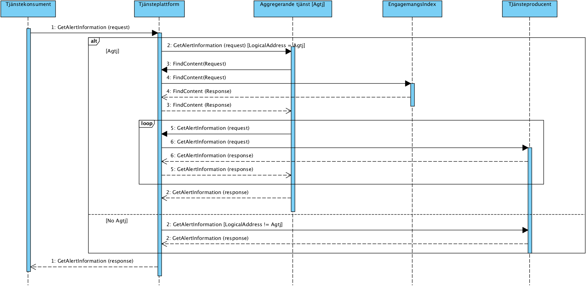
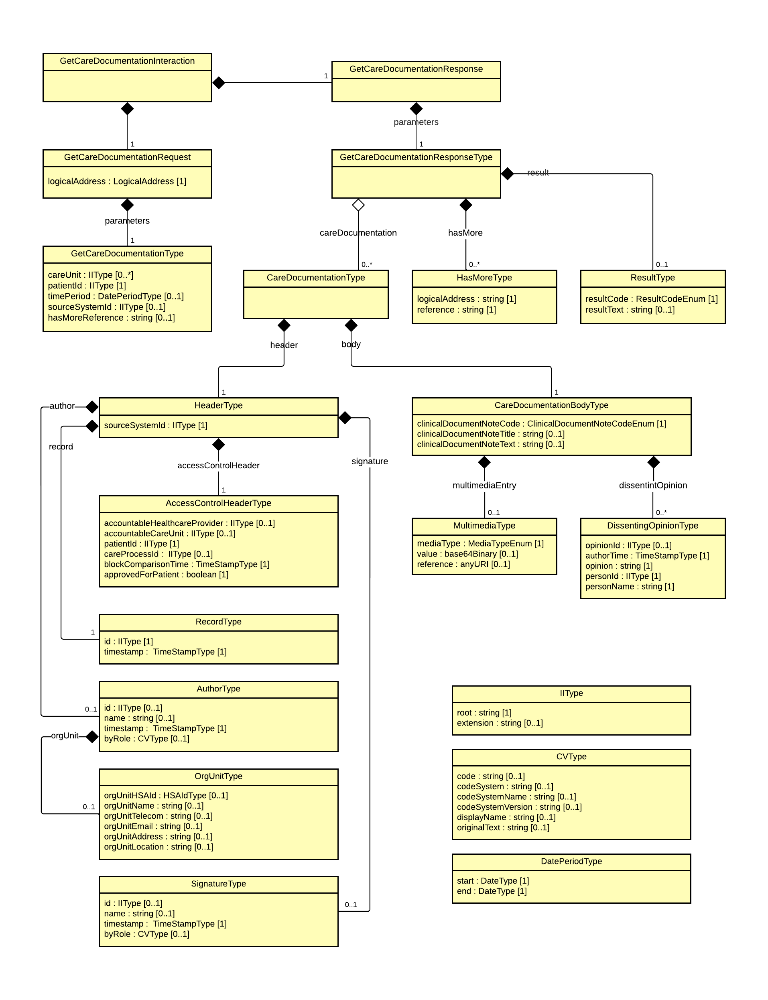
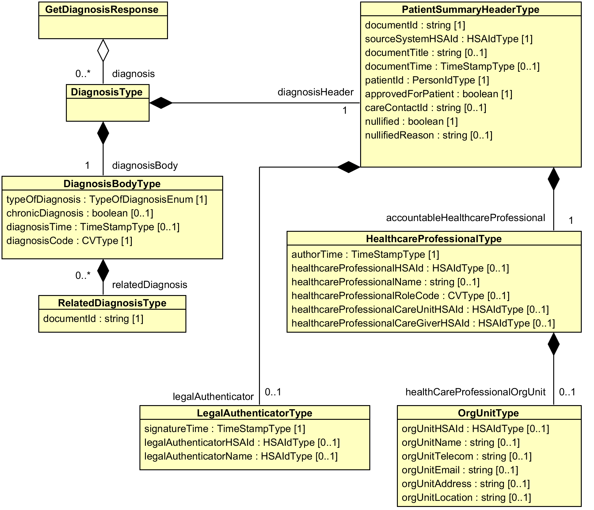
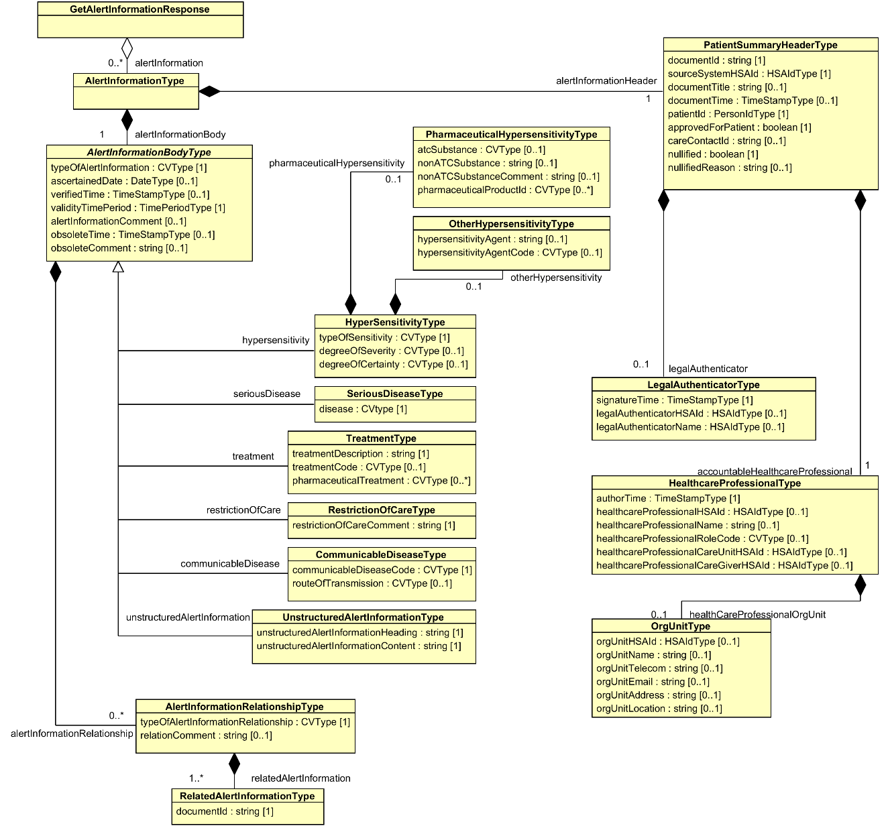
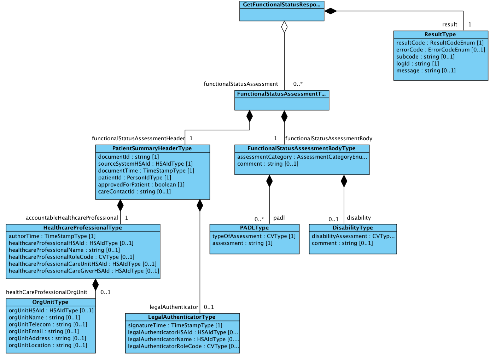

clinicalprocess_healthcond_ description

Innehållsförteckning
Revisionshistorik	3
Referenser	18
Förkortningar	19
1	Inledning	20
1.1	Svenskt namn	20
1.2	Beskrivning	20
2	Versionsinformation	21
2.1	Version 3.0.5	21
2.1.1	Oförändrade tjänstekontrakt	21
2.1.2	Nya tjänstekontrakt	21
2.1.3	Förändrade tjänstekontrakt	21
2.1.4	Utgångna tjänstekontrakt	22
2.2	Version tidigare	22
3	Tjänstedomänens arkitektur	22
3.1	Flöden	22
3.1.1	Arbetsflöde	23
3.1.2	Sekvensdiagram	24
3.1.3	Obligatoriska kontrakt	25
3.2	Adressering	25
3.2.1	Sammanfattning av adresseringsmodell	26
3.3	Aggregering och engagemangsindex	26
4	Tjänstedomänens krav och regler	26
4.1	Uppdatering av engagemangsindex	26
4.2	Informationssäkerhet och juridik	30
4.2.1	Medarbetarens direktåtkomst	30
4.2.2	Patientens direktåtkomst	30
4.2.3	Generellt	30
4.3	Icke funktionella krav	31
4.3.1	SLA krav	31
4.3.2	Övriga krav och regler	32
4.4	Felhantering	33
4.4.1	Krav på en tjänsteproducent	33
4.4.2	Krav på en tjänstekonsument	33
5	Gemensamma informationskomponenter	33
6	Tjänstedomänens meddelandemodeller	34
6.1	MIM Journalanteckning	35
6.2	MIM Diagnos	40
6.3	MIM Uppmärksamhetsinformation	43
6.4	MIM Funktionsstatus	48
7	Tjänstekontrakt	51
7.1	GetCareDocumentation	51
7.1.1	Version	51
7.1.2	Gemensamma informationskomponenter	51
7.1.3	DocBook-format för clinicalDocuemtNoteText-fältet	56
7.1.4	Fältregler	57
7.1.5	Partiell datahämtning	68
7.1.6	Övriga regler	68
7.1.7	Logiska fel	71
7.2	GetDiagnosis	72
7.2.1	Version	72
7.2.2	Gemensamma informationskompontenter	72
7.2.3	Fältregler	72
7.2.4	Övriga regler	78
7.2.5	Logiska fel	78
7.3	GetAlertInformation	79
7.3.1	Version	79
7.3.2	Gemensamma informationskomponenter	79
7.3.3	Fältregler	79
7.3.4	Övriga regler	94
7.3.5	Logiska fel	95
7.4	GetFunctionalStatus	96
7.4.1	Version	96
7.4.2	Gemensamma informationskomponenter	96
7.4.3	Fältregler	96
7.4.4	Övriga regler	103
7.4.5	Logiska fel	104
Revisionshistorik

| Version | Datum | Författare | Kommentar |
| :--- | :--- | :--- | :--- |
| PA1 | 2012-12-03 | FS, MA | Arbetsdokument: Vårddokumentation tillagd |
| PA2 | 2012-12-11 | Maria Andersson | Uppdaterade tabeller efter diskussioner med Johan Eltes |
| PA3 | 2012-12-18 | Maria Andersson | Lagt till kap 5. GetReferralAnswer |
| PA4 | 2012-12-20 | Maria Andersson | Uppdaterat tabeller |
| PA5 | 2012-12-21 | Maria Andersson | Uppdaterat tabeller efter ny struktur |
| PA6 | 2012-12-21 | Maria Andersson | Uppdaterat namnen i tabellen |
| PA7 | 2012-12-21 | Johan Eltes | Lagt till avsnittet Tjänstedomänens arkitektur samt redigerat avsnittet Generella regler |
| PA8 | 2013-01-07 | Johan Eltes | Förbättrad kvalitén på texterna från PA7 |
| PA9 | 2013-01-08 | Maria Andersson | Uppdaterat tabellerna under kap 4, 5 och 6 |
| PA10 | 2013-01-09 | Johan Eltes | Lagt till avsnitt om engagemangsindex. Kompletterat/förtydligat avsnitten nationell användning, nationell användning och adresseringsmodell. |
| PA11 | 2013-01-14 | Maria Andersson | Uppdaterat kap 5 och 6 med ny struktur. |
| PA12 | 2013-01-14 | Maria Andersson | Lagt till kap 7. |
| PA13 | 2013-01-20 | Johan Eltes | Uppdaterat efter beslut att hålla indexpostern på PDLenhetsnivå och använda SourceSystem för adressering. |
| PA14 | 2013-01-21 | Fredrik Ström | Uppdaterat gemensamma informationskomponenter och tjänstebeskrivning |
| PA15 | 2013-01-21 | Maria Andersson | Uppdaterat typerna med inledande versal. Ändrat från careRequest till Referral och från Answer till Outcome i kap 6. |
| PA16 | 2013-01-21 | Maria Andersson | Ändrat kardinaliteten på referral i kap 6. |
| PA17 | 2013-01-24 | Maria Andersson | Ändrat i tabellerna i kap 4, 5 och 6. |
| PA18 | 2013-01-25 | Maria Andersson | Ändrat i tabellerna i kap 4, 5 och 6. |
| PA19 | 2013-01-29 | Maria Andersson | Ändrat beskrivningar i kap 4, 5 och 6 samt ny struktur i kap 4. |
| PA20 | 2013-01-30 | Fredrik Ström / Magnus Ekstrand | Ändrat beskrivningar kap 4, 5.4 och 6.4. / Nya och uppdaterade typer kap 4, 5.4 och 6.4. |
| PA21 | 2013-01-31 | Maria Andersson | Ändringar i beskrivningar kap 4, 5, 6 och 7. |
| PA22 | 2013-01-31 | Maria Andersson | Ändringar i kap 7, GetCareContact |
| PA23 | 2013-02-07 | Magnus Ekstrand | Justeringar av elementnamn och kardinalitet i kap 5, 6 och 7. / Tog bort ej använd gemensam komponent. |
| PA24 | 2013-02-11 | Maria Andersson de Vicente | Lagt till kap 8, GetDiagnosis |
| PA25 | 2013-02-19 | Johan Eltes | Definierat krav på uppdatering av fältet mostRecentContent i EI-posten. |
| PA26 | 2013-03-01 | Maria Andersson de Vicente | Lagt in beskrivning av personidentifierare under kap 3. |
| PA27 | 2013-03-04 | Maria Andersson de Vicente | Uppdaterat till careContactUnitid, careContactUnitName, careContactUnitAddress under 7.4. Uppdaterat beskrivningen av Author under 5.4, 6.4, 7.4 och 8.4. Ändrat Adress till Postadress i hela dokumentet. |
| PA28 | 2013-03-04 | Maria Andersson de Vicente | Ändrat kardinalitet på CareContactUnit till 1..1 under 7.4. Lagt till authorOrgUnitHSAid och authorOrgUnitName. Ändrat kardinalitet på legalAuthenticatorHSAid till 0..1. Tagit bort information om signatur under 7.4. Lagt till sourceSystem. |
| PA29 | 2013-03-05 | Johan Eltes | Lagt till nya sökparametrar för source system och care contact id. Lagt till authorOrgUnitAddress och tagit bort careUnitName. / Förtydligat skrivning om aggregerande tjänster samt lagt till scenariobeskrivning för sökning på careContactId / Överfört i ny tjänstedomän enligt anvisning från CeHis. |
| PA30 | 2013-03-11 | Johan Eltes | Specificerat kodverk för EI-postens Categorization-fält. / SLA-krav uppdaterade |
| PA31 | 2013-03-14 | Maria Andersson de Vicente | Ändrat beskrivningen av DocumentTime |
| PA32 | 2013-03-14 | Johan Eltes | Preciserat lexikaliskt format för personnummer. / Lagt till stöd för gamla dokumenttyper för att under en övergångsperiod underlätta för bef. NPÖ-anslutningar. |
| PA33 | 2013-03-25 | Fredrik Ström / Johan Eltes / Khaled Daham | Uppdaterat beskrivning i GetCareDocumentation av tidsattribut. / Ändrat format på MultiMediaEntry / authorOtherRole tillagt. / Tagit bort koppling mellan categorization-koden för EI och NPÖ:s kodverk. Koden ägs nu av denna tjänstedomän (ingen ändring av själva värdet). / Ändrat elementnamnet sourceSystem till sourceSystemHSAid / Förbättrat och utökat beskrivningen av adressering för att även täcka anrop utan aggregering. / Uppdaterat semantik för ”Most Recent Content” (EI) |
| PA34 | 2013-04-30 | Johan Eltes | Uppdaterat regelverk för EI-poster avseende fältet LogicalAddress (som nu är samma som för source system) / Lagt till regel enligt NPÖ RIV-spec för formattering av clinicalDocumentNoteText / Lagt till krav på uppdatering av EI-fältet DataController / Uppdaterat bilder och text i arkitekturavsnittet för att spegla ändring i EI-postens innehåll / Formatteringsproblem i dokumentet åtgärdade. |
| PA35 | 2013-09-21 | Björn Genfors | Uppdaterat sektionen om gemensamma typer. / Följduppdaterat tjänstekontraktsbeskrivningar / Lagt till information om avvikande åsikt till journalnotatet / Lagt till beskrivning av formattering av clinicalDocumentNoteText |
| PA36 | 2013-09-26 | Björn Genfors | Redaktionella ändringar (HSAId ska skrivas just så) |
| PA37 | 2013-09-30 | Johan Eltes | Åtgärdat ett par copy-paste-fel i skrivningen om docbook-formatet. / Förtydligat beskrivningen av opinionId |
| PB1 | 2013-10-09 | Björn Genfors | Tagit bort nullified från GetCareDocumentation / Satt kardinaliteten på healthcareProfessionalHSAId till 0..1. / Justerat läsbarheten i kontraktstabellen. |
| PB2 | 2013-10-15 | Björn Genfors | Förtydligat patientId i PatientSummaryHeader. |
| PB3 | 2013-10-17 | Björn Genfors | Korrigerat beskrivning av documentId i PatientSummaryHeader / Justerat beskrivning av adress i OrgUnitType. / Lagt till SourceSystem i Engagemangsindex. |
| PB4 | 2013-10-21 | Johan Eltes | Förtydligat kravet på filtrering av svar enligt logicalAddress (lagt till avsnitt 3.4). / Markerat i flödesmodeller att anslutningskatalog inte är del av dagens arkitektur. |
| PB5 | 2013-11-04 | Johan Eltes | Ersatt termen PDL-enhet med vårdenhet (i löpande text) / Uppdaterat avsnittet om informationssäkerhet efter CeHis-granskning |
| PB6 | 2013-11-25 | Johan Eltes | Lagt till text för tjänstekontrakten som deklarerar kompatibilitet med NPÖ RIV Spec och HL7 CDA. |
| PB7 | 2013-11-26 | Björn Genfors | Lagt till tjänstekontrakt för Diagnos / Lagt till tjänstekontrakt för Uppmärksamhetsinformation |
| PB8 | 2013-11-28 | Khaled Daham | Rättat namn på typer och djup på element för GetAlertInformation |
| PB9 | 2013-11-29 | Björn Genfors | Rättat versalisering på två element i diagnoskontraktet |
| PB10 | 2013-12-05 | Björn Genfors | Infört nytt element: chronicDiagnosis i GetDiagnosis / Ändrat elementnamn på relaterad diagnos-id i GetDiagnosis / Korrigerat format och kardinalitet på ingående element i validityTimePeriod i GetAlertInformation / Ändrat namn på ett fåtal element i GetAlertInformation (treatmentDescription, communicableDiseaseCode och restrictionOfCareComment är nya namnen) / Beskrivningar av ett fåtal fält har åtgärdats. |
| PB11 | 2013-12-10 | Björn Genfors | Bytt namn på elementet diagnosisType till typeOfDiagnosis |
| PB12 | 2013-12-11 | Björn Genfors | Förtydligat beskrivning av tidsparametern i begäran för GetAlertInformation |
| PB13 | 2013-12-11 | Johan Eltes | Lagt till kategorikoder för infomängder diagnos och uppmärksamhetsinformation / Ersatt beskrivningen av generella klasser med en referens till bilaga / Lagt till skrivning på orgunit-fält i alla typer och kontrakt om att lokalt id kan anges om HSA-id saknas i källsystemet. |
| PB14 | 2014-01-21 | Björn Genfors | Lagt till det nya kontraktet för reumatismdata. |
| PB15 | 2014-01-22 | Björn Genfors | Kontraktet för reumatismdata är flyttat till en egen domän: clinicalprocess.healthcond.rheuma |
| PB16 | 2014-01-23 | Khaled Daham | Ändrade serviceDomain ifrån logistics.logistics till healthcond.description |
| 2.1.RC2 | 2014-03-13 | Björn Genfors | Bytt dokumentationen till ny mall / Lagt till MIM-ar / Lagt till V-TIM-mappning / Uppdaterat arbetsflödesdiagram / Uppdaterat några av fältregelbeskrivningarna i GetDiagnosis och GetAlertInformation för att harmoniera med GetCareDocumentation / Förtydligat beskrivningen av vad diagnoskontraktet är tänkt att returnera (definitionen av ”diagnos”). / Ändrat ISO-referens för angivande av tid- och datumformat. |
| 2.1.RC3 | 2014-03-17 | Khaled Daham | Lagt till resultType för alla kontrakt i tabellen för fältregler / Lagt till en beskrivning för logiska fel i kap 4.4 / Förtydligat text kring adressering i kap 3.3 / Uppdaterat versionsnummer samt kompabilitetstabellen |
| 2.1 RC4 | 2014-09-15 | Björn Genfors | Bytt dokumentationsmall / Korrigerat GCD att vara bakåtkompatibel med v 2.0 (elementnamnet sourceSystemHSAid behöver ett gement i). / Förtydligat dokumentation om begäran i GetDiagnosis och GetAlertInformation. / Lagt till kontraktet GetFunctionalStatus |
| 2.1 RC4 | 2014-09-16 | Khaled Daham | Uppdaterat MIM för GetFunctionalStatus, samt referredInformation.type till string från URN |
| 2.1 RC5 | 2014-09-18 | Khaled Daham | Rättat småfel i fältregellistan, bl.a kardinalitet för referredInformation från 0..* till 1..* |
| 2.1 RC6 | 2014-10-02 | Khaled Daham | Åtgärdat kommentarer efter VIS-granskning. |
| 2.1 RC7 | 2014-11-18 | Khaled Daham | Fixat stavfel / Lagt till Ineras HSAid för aggregerande tjänster. / sourceSystemHSAId krävs vid begäran på reservnummer |
| 2.1 RC7 | 2014-11-25 | Khaled Daham | Tagit bort alternativet att använda GetUpdates(index-pull) för EI då den inte är implementerad och det pågår diskussioner om att den skall tas bort ifrån TKB för EI. / Uppdaterat sekvensdiagram. / Ändrat skrivelse kring medarbetarens åtkomst till att peka på SOSFS 2008:14 istället för PDL-i-praktiken. / Förtydligat sambandet mellan categorization och assessmentCategory för GetFunctionalStatus |
| 2.1 | 2015-03-16 | Björn Genfors | Uppdaterat V-TIM-mappningskapitlet med korrigerade V-TIM-mappningar, och mappning mot NPÖ. / Korrigerat beskrivninge n av fältet padl/assessment i GFS. |
| 2.1.1 | 2015-03-31 | Khaled Daham | Tagit bort relation ifrån GetFunctionalStatus efter beslut av Inera |
| 2.1.2 | 2015-05-13 | Khaled Daham | Korrigerat HSA-id som skall användas vid addressering till Inera. |
| 2.1.3 | 2015-07-02 | Khaled Daham | Uppdaterat beskrivning av authorTime i headern. |
| 2.1.4 | 2015-09-16 | Björn Genfors | Korrigerat NPÖ-mappningar för två fält i GD och GAI |
| 2.1.4 | 2015-09-21 | Khaled Daham | Förtydligat att användning av clinicalDocumentTypeCode endast skall användas av 13606-adapters. |
| 2.1.4 | 2015-10-13 | Khaled Daham | Ändrad/rättat kardinalitet på pharmaceuticalTreatment från 0..1 till 0..* i fältregellistan samt i schemat. / Svarstider för SLA ändrat ifrån 15 sekunder till 30 sekunder. |
| 2.1.4 | 2015-10-20 | Khaled Daham | Uppdaterat text kring KV Befattning för GetFunctionalStatus / Uppdaterat regelverk för inbäddade binära bilagor |
| 2.1.5 | 2015-11-27 | Björn Genfors | Uppdaterat fältet allvarlighetsgrad i GAI med information om att det föreslagna kodverket allvarlighetsgrad finns i två versioner. |
| 2.1.6 | 2016-02-23 | Ranjdar Fallyih | Uppdaterat beskrivningen för legalAuthenticator (när informationen har låsts utan signering) |
| 2.1.7 | 2017-04-18 | Khaled Daham | Förtydligat i kap 7.1.4 att nullified och nullifiedReason inte används https://bitbucket.org/rivta-domains/riv.clinicalprocess.healthcond.description/issues/358/gcd-21-tkb-saknar-f-lten-om-makulering-i-f |
| 2.1.7 | 2017-04-19 | Björn Pettersson | Testsviter uppdaterade |
| 2.1.8 | 2017-06-21 | Magnus Söderlind | Testsviter och självdeklaration uppdaterade |
| 2.1.9 | 2017-08-07 | Khaled Daham | Uppdaterat beskrivning av fält clinicalDocumentNoteText samt multimediaEntry https://bitbucket.org/rivta-domains/riv.clinicalprocess.healthcond.description/issues/374/getcaredocumentation-tvetydig-semi |
| 2.1.9 | 2017-08-11 | Khaled Daham | Förtydligat actSubstance och lagt till element som ej skall användas, https://bitbucket.org/rivta-domains/riv.clinicalprocess.healthcond.description/issues/369/getalertinformation-20-felaktig-cvtype / Förtydligat att låsning skall signaleras på samma sätt som det görs i getCareDocumentation för getDiagnosis, getFunctionalStatus, getAlertInformation / https://bitbucket.org/rivta-domains/riv.clinicalprocess.healthcond.description/issues/377 / Förtydligat användning av relatedDiagnosis https://bitbucket.org/rivta-domains/riv.clinicalprocess.healthcond.description/issues/373/fr-gor-ang-ende-tolkning-av |
| 2.1.9 | 2017-08-11 | Magnus Söderlind | Testsviter/självdeklarationer utökade och uppdaterade. |
| 2.1.10 | 2018-01-19 | Emmy Damberg | Rättat beskrivning av timePeriod i GetDiagnosis och datePeriod i GetFunctionalStatus https://bitbucket.org/rivta-domains/riv.clinicalprocess.healthcond.description/issues/380/felaktig-beskrivning-av-dateperiod-i-tkb |
| 2.1.10 | 2018-10-05 | Magnus Söderlind | Uppdateringar i SJD och testförbättringar i testsviter, framförallt tidsfiltrering. Testsvit 7,8 tillkommer. |
| 2.1.10 | 2019-03-25 | Jan Söderman | Lagt till SjD för konsument och uppdaterat mock |
| 2.1.10 | 2019-04-03 | Malin Lindberg | Rättat kardinalitet för ../start och ../end i GetFunctionalStatus / https://bitbucket.org/rivta-domains/riv.clinicalprocess.healthcond.description/issues/384/kardinalitet |
| 2.1.11 | 2019-05-02 | Jan Söderman | Ny testsvit och självdeklaration |
| 2.1.12 | 2020-03-30 | Maja Hedengren | Regelförtydligande av HSA-id för / vårdgivare och vårdenhet. / Rättning av kardinalitet  till 0..1 för elementen healthcareProfessionalCareUnitHSAId samt healthcareProfessionalCareGiverHSAId i GCD som felaktigt var satt till 1..1 i TKB. / Flyttat ut regler i fältreglerna till Övriga regler. / Uppdaterar gamla länkar i referenslistan. / Tagit bort mappningar mot NPÖ och V-TIM från mappningstabellerna för respektive tjänstekontrakt samt övriga referenser till mappningen, efter A&R beslut om att mappningar ska tas bort. / Förtydligat regel i GFS för elemten ../../../disabilityAssessment och ../../../comment / Ändrat användning av vård- och omsorg (tex vård och omsorgspersonal) till hälso- och sjukvård (tex hälso- och sjukvårdspersonal). |
| 2.1.13 | 2020-11-25 | Claudia Ehrentraut | Uppdaterat versionsnummer |
| 2.1.14 | 2020-11-25 / 2020-12-02 | Claudia Ehrentraut | Förtydligat information om DocBook-formatet under avsnitt 7.1.3 och i beskrivningstexten för attributet clinicalDocumentNoteText samt uppdaterat referenser för DocBookformatet. / Byt ut alla förekomster av skall till ska och förekomster av oid till OID. / Bytt ut SOAP-Exception till Soap Fault, enligt https://bitbucket.org/rivta-domains/riv.clinicalprocess.healthcond.description/issues/381/byt-till-soap-fault / Förtydligat skrivning under avsnitt 4.3 Icke funktionella krav om hur dubbletter i olika verksamhetssystem ska hanteras samt lagt till referens till ARK_0040. / Bytt namn av kodverket KV Befattning till Befattning, resp. KV Sambandstyp till KV Samband för att stämma överens med benämningarna på https://inera.atlassian.net/wiki/spaces/KINT/pages/3615655/Kodverk+i+nationella+tj+nstekontrakt OBS! Det är samma kodverk som avses i båda fall. / Uppdaterat länk för referens R13 till https://inera.atlassian.net/wiki/spaces/KINT/pages/3615655/Kodverk+i+nationella+tj+nstekontrakt / Lagt till referens till kodverkslistan [R13] för Snomed, ICD10, och ATC, KV Samband / Tagit bort referens R14 Internationell klassifikation av funktionstillstånd, funktionshinder och hälsa (ICF) eftersom ICF listas på kodverkslistan som refereras till i R13. / Lagt till ny R14 som är en referens till Listan över identifierare. / Lagt till referens till Listan över identifierare [R14] för personnummer, samordningsnummer och SLL-reservnummer. / Uppdaterat beskrivning av documentId i PatientSummaryHeader / Ändrat multiplicitet för orgUnitHSAId och orgUnitName från 0..1 till 1..1 för att stämma överens med schemat/testsviter i GetDiagnosis, GetAlertInformation och GetFunctionalStatus (GetCareDocumentation var redan korrekt satt till 1..1), utifrån https://bitbucket.org/rivta-domains/riv.clinicalprocess.healthcond.description/issues/387/uppt-ckt-fel-i-wsdl-och-soapui-testsvit-f / Rättat rubriknivåer under 3.1 Flöden |
| 2.1.15 | 2021-02-01 | Tobias Blomberg
Claudia Ehrentraut | Förtydligat regel 2 för GetFunctionalStatus. / Uppdaterat attributbeskrivningen  för headerId (dvs documentId i PatientSummaryHeaderType) i samtliga tjänstekontrakt för domänen. / Uppdaterat versionsinformation |
| 2.1.16 | 2021-05-24 | Tobias Blomberg | Uppdaterat beskrivningarna för domänen respektive varje tjänstekontrakt. / Uppdaterat beskrivningen för attributet MostRecentContent unde avsnitt 4.1 / Uppdaterat beskrivningen av tidsfiltrering i samtliga tjänstekontrakt. |
| 2.1.17 | 2022-01-11 / 2022-03-18 | Tobias Blomberg | Ändrat multiplicitet för careDocumentation/careDocumentationHeader/documentTime i GCD till valfritt för att stämma överens med schemat. / Uppdaterat beskrivningen för elementet sourceSystemHSAId i begäran för samtliga kontrakt i domänen. |
| 2.1.17 | 2022-03-22 | Tobias Blomberg | Version godkänd |
| 2.1.18 | 2022-11-29 / 2023-01-10 | Tobias Blomberg | Uppdaterat beskrivningen för attributet alertInformation i getAlertInformation enligt TJN-291 / Lagt till regel 2 under övriga regler i getAlertInformation / Tagit bort denna text från attributet legalAuthenticator ur samtliga tjänstekontrakt: / ”I de fall där informationen har låsts utan signering, representeras detta genom att signatureTime sätts till tidpunkten för låsning, och resterande fält i LegalAuthenticatorType lämnas tomma.”. / Detta då det enligt SOSFS 2016:40 ska det ej längre finnas möjlighet att låsa osignerade journalanteckningar / Uppdaterat samtliga beskrivningar av CVType för att tydliggöra regler gällande hur de olika elementen i typen relaterar till varandra. Reglerna finns redan beskrivna i schematron. |
| 3.0 | 2023-10-03 | Thomas Siltberg | 2021-07-09 / Kontraktet GetCareDocumentation uppdaterat till version 3.0. / Uppdaterat JoL-header till version 1.5 i GetCareDocumentation. / Uppdaterat gemensamma datatyper för GetCareDocumentation. / Lagt till pageneringshantering i GetCareDocumentation och med det lagt till avsnitt 4.3.2.5, 4.3.2.5 och 7.1.5 samt uppdaterat avsnitt 4.4.1.1 och 3.2. / Ändring av datatypen för personId i DissentingOpinionType. / Ändrat namn på sourceSystemHSAId till sourceSystemId i GetCareDocumentation. / Ändrat datatyp på sourceSystemId i GetCareDocumentation. / Flyttat regeln för sourceSystemId i GetCareDocumentation till avsnittet för övriga regler. / Justerat regel 1 för GetCareDocumentation då vårdgivaren nu är obligatorisk att ange i headern. / Lagt till hantering av logiska fel för GetCareDocumentation. / Lagt till regel 4 i övriga regler för GetCareDocumentation. / 2021-08-04 / Tagit bort clinicalDocumentTypeCode från GetCareDocumentation då den inte används längre. / Ändrat beskrivningen av clinicalDocumentNoteCode i GetCareDocumentation. / 2021-08-12 / Uppdatering av regler vid användning av Partiell datahämtning. / 2021-09-01 / Uppdaterat namn och beskrivning för tidsfiltrering i GetCareDocumentation. / 2021-10-12 / Ändrat benämningen på avvikande åsikt till avvikande mening. / Ändrat benämningen på hälso- och vårddokument till journalanteckning. / 2021-11-02 / Lagt till mappningstabell mellan MIM och informationsmodell för GetCareDocumentation. / 2022-01-25 / Lagt till regel för hur länge referensen ska vara giltig för HasMoreType  i GetCareDociumentation under avsnitt 7.1.6. / Tagit bort attributet readyAt från HasMoreType för partiell datahämtning. / Förtydligat beskrivningen av record.id i GetCareDocumentation. / 2022-05-05 / Uppdaterat headern till version 2.0. / 2022-10-21 / Uppdaterat headern till version 2.1 (se TJN-304) / Tagit bort careContactId från begäran i GetCareDocumentation (se TJN-304) / Uppdaterat regel 3 för GetCareDocumentation vid borttag av careContactId / accountableHealthcareProvider i GetCareDocumentation är ändrad till ej obligatorisk (se TJN-304). / 2022-11-17 / Uppdaterat beskrivningen av patientId i begäran i GetCareDocumentation. / Förtydligat hantering av Partiell datahämtning under avsnitt 7.1.5. / Uppdaterat headern till version 2.2 och med det ändrat namnet på originalPatientId till patientId och kardinaliteten till 1..1 i schema och TKB. / Uppdaterat gemensamma typer till version 17. / Uppdaterat ClinicalDocumentNoteCode i GetCareDocumentation till att vara obligatorisk att ange i schema och TKB. / 2022-12-14 / Förtydligat användning av hasMore / 2022-12-16 / Justerat MIM samt mappningstabell för GetCareDocumentation. / Uppdatering av element för regel 1 för GetCareDocumentation. / Kompletterat fältregeltabellen med beskrivningarna av attributen i JoL-headern. / Lagt till skrivelse om att kodverket för clinicalDocumentNoteCode kan komma att ändras över tid och att konsumenter ska ta höjd för det. / 2022-12-30 / Ändrat clinicalDocumentNoteCode till CVType och uppdaterat beskrivningen. / Ändrat beskrivning av MultimediaEntry samt ändrat mediaType till string. / 2023-01-18 / Justerat beskrivningen av clinicalDocumentNoteCode samt MultimediaEntry / Har lyft in gemensamma typer i TKB i stället för att peka på en bilaga. Gäller GetCareDocumentation. / Har lyft in beskrivning om headern i TKB i stället för att peka på en bilaga. Gäller GetCareDocumentation. / Har lagt till regler för getCareDocumentation och kopplat dessa till schematron. / Uppdaterat beskrivningen av patientId i begäran för GetCareDocumentation. / 2023-02-09 / Tagit bort regel om begränsning på 100kb för binära bilagor. Storlegsbegränsning anges i interaktionsöverenskommelse i stället. / 2023-03-02 / Uppdaterat beskrivning av record.id i GetCareDocumentation. / 2023-09-21 / Ny dokumentmall / 2023-10-03 / Uppdaterat beskrivningen för sourceSystemHSAId i samtliga tjänstekontrakt för att tydliggöra vad fältet avser filtrera på. |
| 3.0.1 | 2024-03-05 | Thomas Siltberg | Stegrad domänversion. Inga ändringar i detta dokument. |
| 3.0.2 | 2024-04-23 | Thomas Siltberg | Uppdaterat beskrivningen om hantering av DocBook-standarden. / Justerat beskrivning om funktionen hasMore så att det framgår att den även är aktuell att använda baserat på gällande storleksbegränsningar på svarsmeddelandet. |
| 3.0.3 | 2024-05-06 | Tobias Blomberg | Stegrad domänversion. Inga ändringar i detta dokument. |
| 3.0.4 | 2024-05-28 | Tobias Blomberg | Stegrad domänversion. Inga ändringar i detta dokument. |
| 3.0.5 | 2024-11-22 | Thomas Siltberg | Förtydligande av beskrivning för atcSubstance, nonATCSubstance samt nonATCSubstanceComment i GetAlertInformation. |
Referenser

| Namn | Dokument | Kommentar | Länk |
| :--- | :--- | :--- | :--- |
| R1 | AB_clinicalprocess_healthcond_description | Obligatoriskt | Bilaga |
| R2 | RIVTA flera dokument | Finns på Webben | Länk |
| R3 | Bilaga Mappningar_GetCareDocumentation.xslx |  | Bilaga |
| R4 | Bilaga Mappningar_GetDiagnosis.xslx |  | Bilaga |
| R5 | Bilaga Mappningar_GetAlertInformation.xslx |  | Bilaga |
| R6 | ISO8601-standarden för tidsformat | Finns på Webben | Länk |
| R7 | RIV Tekniska Anvisningar / Översikt. Version 2.0.4 | Finns på Webben | Länk |
| R8 | Tabell över godkända tjänstedomäner | Finns på Webben | Länk |
| R9 | Senaste version av SOSFS 2016:40 Socialstyrelsens föreskrifter och allmänna råd om journalföring och behandling av personuppgifter i hälso- och sjukvården | Finns på Webben | Länk |
| R10 | Journalföring och behandling av personuppgifter i hälso- och sjukvården - Handbok vid tillämpningen av Socialstyrelsens föreskrifter och allmänna råd (HSLF-FS 2016:40) om journalföring och behandling av personuppgifter i hälso- och sjukvården. | Finns på Webben | Länk |
| R11 | DocBook | Finns på Webben | Länk DocBook / Länk schemas / Länk tools |
| R12 | Apache Commons Text StringEscapeUtils | Finns på Webben | Länk |
| R13 | Kodverkslistan | Finns på Webben | Länk |
| R14 | Lista över identifierare | Finns på Webben | Länk |
| R15 | Bilaga Gemensamma_typer_7.pdf |  | Bilaga |
| R16 | RIV Tekniska Anvisningar - Binära bilagor | Finns på Webben | Länk |
| R17 | RIV Tekniska Anvisningar - Parallella huvudversioner av ett tjänstekontrakt | Finns på Webben | Länk |
| R18 | ADL-Taxonomin® – en bedömning av aktivitetsförmåga |  | Länk |
| R19 | Regel #11, Logiska fel | RIV Tekniska Anvisningar - Tjänsteschema 2.1 | Länk |
Förkortningar

| Förkortning | Betydelse | Kommentar |
| :--- | :--- | :--- |
| K | Tjänstekonsument | Se referens R7 |
| P | Tjänsteproducent | Se referens R7 |

## Inledning
Detta är beskrivningen av tjänstekontrakten i tjänstedomänen
clinicalprocess: healthcond: description
Tjänstekontrakten är baserade på RIVTA 2.1 [R2] och reglerade genom arkitekturella beslut [R1].
Tjänstekontraktsbeskrivningen är en kravspecifikation. Den skall fungera som ett teknikneutralt, formellt regelverk som reglerar integrationskrav för parter (tjänstekonsumenter och tjänsteproducenter) som avser ansluta system för samverkan enligt dessa tjänstekontrakt. Tjänstekontraktsbeskrivningen är också ett viktigt underlag för skapande av de tekniska kontrakten (scheman och WSDL-filer).
Detta dokument kompletterar reglerna i de tekniska kontrakten. Tjänsteproducenter och tjänstekonsumenter ska m.a.o. följa såväl de maskintolkbara reglerna i de tekniska kontrakten, så väl som de regler som uttrycks verbalt i detta dokument.

### Svenskt namn
Vård- och omsorg kärnprocess:hantera hälsorelaterade tillstånd:tillståndsbeskrivning
Tillståndsbeskrivning

### Beskrivning
Denna domän hantera information som beskriver patientens hälsotillstånd, till exempel vårdanteckningar, diagnoser, uppmärksamhetsinformation och funktionsstatus. Domänen syftar till att tillmötesgå vårdprofessionens behov av direktåtkomst till patientens vårdinformation (så kallad sammanhållen journalföring) såväl som patientens egen åtkomst till sin vårdinformation.
Tjänstekontrakten i denna domän hanterar specifikt patientens journalanteckningar, och klinisk information som beskriver patientens hälsotillstånd, exempelvis vårdanteckningar, diagnoser, uppmärksamhetsinformation (som innefattar bland annat allvarliga allergier och allvarliga sjukdomar) samt funktionsstatus. Domänens kontrakt stödjer tjänsteinteraktioner där konsumenten är i behov av att läsa informationen från ett eller flera källsystem.

## Versionsinformation
Denna revision av tjänstekontraktsbeskrivningen handlar om domänen clinicalprocess: healthcond: description. Observera att version för detta dokument och domänen måste vara lika. Detta för att spårbarheten inte skall brytas.

### Version 3.0.5

#### Oförändrade tjänstekontrakt
GetDiagnosis, version 2.0
GetAlertInformation, version 2.0
GetFunctionalStatus, version 2.0

#### Nya tjänstekontrakt
Följande nya tjänstekontrakt finns från och med denna version:
Inga nya kontrakt har tillkommit i denna version

#### Förändrade tjänstekontrakt
GetCareDocumentation, version 3.0
Nedan redovisas kompatibilitet mellan konsument och producent för tjänstekontrakten som finns i flera versioner. Kompatibilitet avser här såväl format som semantik. För definition av kompatibilitet mellan format, se RIV Tekniska Anvisningar, Översikt.

| Tjänstekontrakt | Konsument | Producent | Kompatibilitet |
| :--- | :--- | :--- | :--- |
| GetCareDocumentation | 2.1 | 2.0 | OK |
|  | 2.0 | 2.1 | Ej kompatibel |
|  | 2.x | 3.0 | EJ kompatibel |
|  | 3.0 | 2.x | EJ kompatibel |

#### Utgångna tjänstekontrakt
Inga tjänstekontrakt har utgått.

### Version tidigare
3.0.2

## Tjänstedomänens arkitektur
I detta avsnitt beskrivs hur T-boken tillämpats i tjänstedomänen. Avsnittet syftar till att ge läsaren överblick och förståelse. Avsnittet innehåller inga regler, men ger ett sammanhang för de regler som beskrivs i övriga delar av dokumentet.
Tjänsterna för beskrivning av hälsorelaterade tillstånd erbjuder sökning av information i hälso- och sjukvårdsgivarnas system för patientadministration och vårddokumentation. Utgångspunkten för tjänsterna i denna tjänstedomän är i första hand patientens och professionens behov av direktåtkomst till en patients hälso- och sjukvårdshistorik sett ur ett nationellt eller ett regionalt perspektiv. I båda fallen är syftet att historisk information sammanställs från det eller de källsystem där det finns historik via s.k. aggregerande tjänster, snarare än att begära information från ett specifikt system eller en specifik verksamhet.
Tjänstekontrakten erbjuder även möjlighet att nå information från ett specifikt system eller en specifik verksamhet. Behovet av att rikta en fråga till ett specifikt system uppstår främst när tjänstekonsumenten också är prenumerant på notifieringar från engagemangsindex och på det sättet (via ProcessNotification) får information om en händelse i ett specifikt system. Det är då ändamålsenligt att adressera det specifika systemet, istället för den aggregerande tjänsten.
Följande flödesmodeller beskriver översiktligt hur tjänstekontrakten är tänkta att användas. Tjänstekonsument (K) och tjänsteproducenter (P) är markerade i figurerna.

### Flöden
Nedanstående diagram visar hur flödet principiellt ser ut när information ur kontrakt i tjänstedomänen efterfrågas och hanteras.

#### Arbetsflöde

*Figur 2 Exempel: Adressering vid anrop till aggregerande vårdgivartjänst (t.ex. från NPÖ-tillämpningen).*

##### Roller

| Namn/beteckning | Beskrivning alt. referens |
| :--- | :--- |
| Patienten | Den patient som vill få tillgång till information som tjänsterna tillhandahåller. |
| Professionen | Den hälso- och sjukvårdsperson som vill få tillgång till patientens data. |

#### Sekvensdiagram

**
Figur 3 Sekvensdiagram över sökning efter information där GetAlertInformation används som exempel men samma princip gäller för alla kontrakt i tjänstedomänen, diagrammet visar på två alternativa sekvenser där det första alternativet gäller när aggregerande tjänster adresseras och det andra alternativet gäller när källsystemet adresseras.

##### Roller

| Namn/beteckning | Beskrivning alt. referens |
| :--- | :--- |
| Tjänstekonsument | Det system som används för att konsumera information. Dvs det system som använder tjänster enligt ett tjänstekontrakt. |
| Tjänsteplattform | Tjänsteplattformen är det lager som hanterar virtuella tjänster, aggregerande tjänster samt anpassningstjänster. |
| Aggregerande tjänst | En aggregerande tjänst är en integrationstjänst som för en tjänstekonsument sammanställer en nationell vy av informationen av den typ som är aktuell för tjänsten i fråga. Är beroende av engagemangsindex för att begränsa sökningen till relevanta informationsägare. |
| Engagemangsindex | En tjänst där det finns uppdaterade nationella index över vilka informationsägare som har information kring en viss invånare/patient. |
| Vårdinformationssystem | Det system som i detta fall utgör källsystemet som vårdpersonal direkt registrerar/uppdaterar/raderar information i. |

#### Obligatoriska kontrakt
Domänen definierar inga flöden och har därmed inga obligatoriska kontrakt att uppfylla.

### Adressering
Tjänstedomänen tillämpar källsystem-adressering. Observera att tjänstekonsumenter främst anropar aggregerande tjänster. Tjänstekonsumenten adresserar därför den aggregerande tjänsten med antingen nationellt HSA-id (Ineras HSA-id) eller HSA-id för aktuell huvudman om det är en regional/huvudmanna-specifik (t.ex. ”regional”) aggregerande tjänst som ska adresseras.
Det finns också fall då en tjänstekonsument adresserar ett källsystem. Det förutsätter att tjänstekonsumenten känner till källsystemets HSA-id. Det sker genom att ett sådant anrop föregås av ett anrop till en aggregerande tjänst (källsystemets HSA-id finns då i svarsmeddelandet) eller genom att tjänstekonsumenten är producent för Engagemangsindex notifieringskontrakt (ProcessNotification). Notifieringen innehåller information om en händelse rörande en patients information i ett specifikt källsystem. Genom att använda informationen om källsystemets HSA-id kan tjänstekonsumenten direktadressera källsystemet i syfte att hämta information om den händelse som just notifierats för patienten.
Adressering sker i enlighet med RIV Tekniska Anvisningar Översikt, Rev E, avsnitt 8.3, där mer information kan hittas.
Vid partiell datahämtning ska anropen efter det första anropet direktadresseras till tjänsteproducenten.

#### Sammanfattning av adresseringsmodell

| Åtkomstbehov för patientens journalhistorik | Logisk adress |
| :--- | :--- |
| Nationellt | Ineras HSA-id: 5565594230 |
| För en huvudman/region | Huvudmannens/regionens HSA-id |
| För ett källsystem | Källsystemets HSA-id |

### Aggregering och engagemangsindex
Det behövs en aggregerande tjänst för varje tjänstekontrakt som läser data i denna domän. Aggregerande tjänster har samma tjänstekontrakt och anropsadress som en traditionell virtuell tjänst, men nås via olika logiska adresser.
Om ett källsystemets HSA-id anges som logisk adress, kommer frågemeddelandet att dirigeras vidare direkt till källsystemet utav tjänsteplattformen utan att passera en aggregerande tjänst.
Om logisk adress HSA-id för Inera eller en huvudman kommer anropet att dirigeras till aggregerande tjänsten som i sin tur – efter att ha konsulterat engagemangsindex – vidarebefordrar frågan till de källsystem som har information om patienten.

## Tjänstedomänens krav och regler
Dessa gäller alla tjänstekontrakt i hela tjänstedomänen om inte undantag görs för specifika tjänstekontrakt senare i dokumentet.

### Uppdatering av engagemangsindex
Alla källsystem ska uppdatera engagemangsindex. Engagemangsindex ska uppdateras så snart en händelse inträffar som påverkar indexposterna enligt beskrivningen nedan.
All uppdatering av engagemangsindex sker genom att källsystemet anropar engagemangsindex genom tjänstekontraktet
urn:riv:itintegration:engagementindex:UpdateResponder:1 (”index-push”).
Ladda hem engagemangsindex WSDL (se referens [R8]), scheman och tjänstekontraktsbeskrivning för detaljer.
Följande regler gäller för innehållet i begäran till engagemangsindex för uppdateringar som rör denna tjänstedomän:

| Attribut | Beskrivning | Format | Kardinalitet | Kodverk/värde-mängd 
/ev begränsningar | Beslutsregler och kommentar |
| :--- | :--- | :--- | :--- | :--- | :--- |
| Registered ResidentIdent Identification | Invånarens person-nummer | Person- eller samordningsnummer enligt skatteverkets definition (12 tecken). | 1..1 |  | Del av instansens unikhet |
| Service domain* | Den tjänstedomän som förekomsten avser. | URN på formen <regelverk>:<huvuddomän>:<underdomän1>:<underdomän2> | 1..1 | ”riv:clinicalprocess:healthcond:description” | Del av instansens unikhet |
| Categori-zation* | Kategori-sering enligt kodverk som är specifikt för tjänste-domänen | Text bestående av bokstäver i ASCII. | 1..1 | Informationsmängd enligt tabell nedan. | Del av instansens unikhet |
| Logical address* | Referens till informationskällan enligt tjänste-domänens definition | Logisk adress enligt adresseringsmodell för den tjänstedomän som anges av fältet Service Domain. | 1..1 | Samma värde som fältet Source System. | Del av instansens unikhet |
| Business object Instance Identifier* | Unik identifierare för händelse-bärande objekt | Text | 1..1 | ”NA” – d.v.s. ej tillämpat för tjänstedomänen. | Del av instansens unikhet |
| Clinical process interest Id | Hälsoärende-id | GUID | 1..1 | ”NA” (ännu ej tillämpat i tjänstedomänen) | Del av instansens unikhet |
| Most Recent Content* | Tidpunkt för senaste uppdatering av den informationstyp och patient i den källa som denna indexpost avser. | DT | 1..1 | Tidpunkt för senaste händelse som matchar indexposten. Kan även avse borttag. Ex: En indexpost representerar 2 bef. dokument. Ett av dem tas bort. Det markeras genom att bef. post uppdateras med tidpunkt för borttagshändelsen. |  |
| Creation
Time | Tidpunkten då index-posten registrerades | DT | 1..1 | Sätts automatiskt av EI-instansen. | Genereras automatiskt av kontraktets tjänste-producent |
| Update Time | Tidpunkten då index-posten senast upp-daterades | DT | 0..1 | Sätts automatiskt av EI-instansen. | Upp-datering innebär ny post som matchar samtliga attribut som är del av en instans unikitet. |
| Source system | Källsystemet som genererade engagemangs-posten via Update-tjänsten | Källsystemets HSA-id.  För system-adresserade tjänstedomäner motsvarar detta LogicalAddress vid anrop till tjänster i tjänstedomänen i fråga. Detta är inte anslutningspunktens HSA-id utan systemet som operativt hanterar originalinformationen i verksamheten. | 1..1 | Systemadressering tillämpas. Detta värde används som LogicalAddress vid tjänsteanrop. | Del av instansens unikhet |
| Data Controller | Personuppgiftsansvarig organisation | Vårdgivarens organisationsnummer eller HSA-id / eller inom källsystemet unik identifierare för vårdgivaren. | 1..1 | ”SE”<organisationsnummer>. Exempel: ”SE5565594230” eller HSA-id, eller / systemspecifik identitet. | Del av instansens unikhet |
Regler för tilldelning av värde i fältet Categorization i engagemangsposten för tjänstekontrakt i denna domän.
En tjänsteproducent av GetFunctionalStatus måste använda samma värde för categorization i en Update som för elementet assessmentCategory i svaret.

| Informationsmängd enligt Tjänstekontrakt | Värde på Categorization |
| :--- | :--- |
| GetCareDocumentation | voo |
| GetDiagnosis | dia |
| GetAlertInformation | upp |
| GetFunctionalStatus – funktionsnedsättning | fun-fun |
| GetFunctionalStatus – PADL | pad-pad |

### Informationssäkerhet och juridik

#### Medarbetarens direktåtkomst
Vid sammanhållen journalföring ansvarar verksamheten som erbjuder sina medarbetare direktåtkomst till sammanhållen journal för att patientdatalagen efterlevs. Det innebär bl.a. att spärrkontroll kan behöva genomföras innan information kan visas. Det innebär också att regelverket för samtycke, vårdrelation och åtkomstloggning måste följas. Dessutom finns krav från Integritetsskyddsmyndigheten om ytterligare teknisk åtkomstkontroll.
HSLF-FS 2016:40 [R9] ställer också krav (via handboken "Journalföring och behandling av personuppgifter i hälso- och sjukvården" [R10]) på att medarbetaren är starkt autentiserad om medarbetarens inloggning sker i nät som delas med flera vårdgivare och att uppdragsval görs i samband med autentisering (vårdenhet).
Det kompletta regelverket finns i handboken samt i anvisningar för tillgänglig patient.
Observera att tjänstekontrakten i sig inte påtvingar sammanhållen journalföring. Krav rörande sammanhållen journalföring och eller krav på spärrhantering uppstår först om tjänstekonsumenten (e-tjänsten) för medarbetaren tillgängliggör information som härrör från andra vårdgivare (sammanhållen journalföring) eller andra vårdenheter inom egna vårdgivaren (spärrkrav).

#### Patientens direktåtkomst
Alla tjänstekontrakten i denna tjänstedomän har en svarsflagga som anger om verksamheten (informationsägaren) godkänt att informationen får visas för patient. Det kan t.ex. ha skett genom menprövning eller rådrum. För vissa tjänstekontrakt, såsom hälso- och sjukvårdskontakter, kanske informationsägaren policymässigt har menprövat all information. Det är varje vårdgivares ansvar att tjänsteproducenten sätter ”kan visas för patient”-flaggan i enlighet med vårdgivarens verksamhetsregler.

#### Generellt
Tjänsteproducenten ansvarar för att information endast lämnas ut till de tjänstekonsumenter som informationsägaren godkänt. Det är inte ett juridiskt krav, men tydliggörs här eftersom det avviker från T-boken i det att tjänsteplattformen då inte ansvarar för den tekniska åtkomstkontrollen (ej möjligt när systembaserad adressering tillämpas). Om informationsägaren har behov av att reglera åtkomst per tjänstekonsument, ska tjänsteproducenten filtrera svaret enligt informationsägarens önskemål. Observera att det är regionala policyer snarare än lagar och förordningar som styr i vilken grad tjänsteproducenten ska begränsa åtkomst för en viss tjänstekonsument. Kunskapen om tjänstekonsumentens (tjänstens) identitet (d.v.s. ursprunglig tjänstekonsument i anropskedjan) får bara användas för teknisk åtkomstbegränsning på så sätt att svaret blir som om de vårdenheter vars verksamhetschef inte godkänner aktuell tjänstekonsument varit exkluderade i frågan.

### Icke funktionella krav
Det är den informationsproducerande vårdgivarens ansvar att endast ett källsystem tillhandahåller informationen via lästjänst och engagemangsindex där patientdata lagras i flera källsystem. Konsumenter som är anslutna till flera majorversioner av samma kontrakt måste hantera dubblettborttagning mellan dessa. Detta sker genom att jämföra identiteter på postnivå och endast behålla en av de poster som returnerats, se referens [R17].

#### SLA krav
Följande generella SLA-krav gäller för alla tjänsteproducenter som tillhandahåller tjänster. Dessa krav gäller där inget annat anges för ett specifikt tjänstekontrakt.

| Kategori | Värde | Beskrivning |
| :--- | :--- | :--- |
| Svarstid | Svarstiden för ett anrop får inte överstiga 30 sekunder. |  |
| Tillgänglighet | 24x7, 99,5% |  |
| Last | Tjänsteproducenten ska kunna hantera minst dubbla mängden frågor per dygn i förhållande till antalet journaluppdatering per dygn. |  |
| Aktualitet | Kraven på aktualitet varierar för olika tjänstekonsumenter. Det behöver inte vara absolut aktualitet i förhållande till källsystemet, men ju mindre fördröjning desto bättre. Ett riktmärke är att försöka undvika längre fördröjning än 60 minuter. Fördröjningen avser både journaldata och uppdatering av engagemangsindex. / Uppdatering av engagemangspost måste ske så att engagemangsposten refererar data som är omedelbart tillgängligt via tjänstekontraktet. |  |
| Robusthet | Om tidsintervall inte angivits i frågan kan tjänsteproducenten välja att lämna ett delsvar i syfte att uppfylla svarstidskravet. Delsvaret måste då vara avgränsat i tiden genom att det finns äldre men inte nyare data än det äldsta som returnerats. |  |
| Samtidighet | Tjänsteproducenten ska hantera minst 10 samtidiga frågor. |  |

#### Övriga krav och regler

##### Gemensamma konsumentregler
R1: Filtrera enligt flagga ”approvedForPatient”
R2: Tillämpa regelverk enl. PDL

##### Gemensamma producentregler
R3: Filtrera enligt RIVTA-headern LogicalAddress. Svarsmeddelandet får endast innehålla information som skapats i det källsystem som anges av frågemeddelandets LogicalAddress.

##### Format för datum och tidpunkter
Datum anges alltid på formatet ”ÅÅÅÅMMDD”, vilket motsvarar ISO 8601-kompatibla formatbeskrivningen ”YYYYMMDD”.
Tidpunkter anges alltid på formatet ”ÅÅÅÅMMDDttmmss”, vilket motsvarar den ISO 8601-kompatibla formatbeskrivningen ”YYYYMMDDhhmmss”.

##### Tidszon för tidpunkter
Tidszon anges inte i meddelandeformaten. All information om datum och tidpunkter som utbyts via tjänsterna ska ange datum och tidpunkter i den tidszon som gäller/gällde i Sverige vid den tidpunkt som respektive datum- eller tidpunktsfält bär information om. Såväl tjänstekonsumenter som tjänsteproducenter ska med andra ord förutsätta att datum och tidpunkter som utbyts är i tidszonerna CET (svensk normaltid) respektive CEST (svensk normaltid med justering för sommartid).

##### Partiell datahämtning direktadresseras (Övriga krav och regler)
Om en tjänstekonsument väljer att hämta ytterligare information från en tjänsteproducent som signalerat att detta finns med hasMore, så måste detta göras med direktadressering. hasMoreReference får alltså inte användas vid anrop till aggregerande tjänst.

##### Dubblettkontroll vid partiell datahämtning görs av tjänstekonsument (övriga krav och regler)
Vid partiell leverans av information är det tjänstekonsumentens ansvar att hantera eventuella dubbletter om sådana skulle skickas i efterföljande anrop. Det kan exempelvis ske om information som redan levererats i tidigare anrop förändrats. Med dubblett avses information med samma unika identifierare (record.id i JoL-headern).

### Felhantering

#### Krav på en tjänsteproducent

##### Logiska fel
Respektive kontrakt beskriver närmare hur logiska fel ska hanteras.

##### Tekniska fel
Vid ett tekniskt fel levereras ett generellt undantag (Soap Fault). Exempel på detta kan vara deadlock i databasen eller följdeffekter av programmeringsfel. Tekniska fel får inte förmedla personuppgifter. Istället rekommenderas att ett log-id förmedlas, som ger möjlighet för tjänsteproducentens förvaltning att bistå tjänstekonsumentens förvaltning med felsökning. Ett log-id bör vara en UUID. Ett log-id får under inga omständigheter förmedla information som är spårbar till patienten.

#### Krav på en tjänstekonsument

##### Logiska fel
Inga krav på konsument

##### Tekniska fel
Inga krav på konsument

## Gemensamma informationskomponenter
I tjänstekontraktsbeskrivningarna används ett antal komponenter som är gemensamma för vissa meddelanden i flera domäner eller inom denna domän. Observera att med anledning av att tjänstekontrakten även kan stödjas av producentsystem som saknar (fullständig) HSA-id-information så är HSA-id-attribut i beskrivningarna nedan valfria. Se även avsnittet ”Informationssäkerhet och juridik” ovan.
De gemensamma typerna beskrivs i bilaga/bilagor med namn ”Bilaga Gemensamma_typer_<version>.pdf”. Hänvisad <version> anges vid respektive tjänstekontrakt i kapitlet Tjänstekontrakt.

## Tjänstedomänens meddelandemodeller
Här beskrivs de modeller som beskriver informationsinnehållet i tjänstekontrakten inom tjänstedomänen. Varje tjänstekontrakt ska ha en (1..1) egen meddelandemodell som uttömmande beskriver informationen som tjänstekontraktet bär. För varje meddelandemodell beskrivs hur mappning ser ut mot tjänstekontraktets schema (XSD).

### MIM Journalanteckning

Modellen är en UML-representation av XSD-schemat. Någon mappning mellan XSD och MIM är därmed inte inkluderad.
Nedan beskrivs mappning mellan MIM/ XSD och informationsmodellen i informationsspecifikationen.

| MIM/ XSD | Mappning mot informationsmodell |
| :--- | :--- |
| GetCareDocumentationRequest |  |
| logicalAddress | Saknas |
| parameters | Saknas |
| GetCareDocumentationType |  |
| careUnit | Vårdenhet.id |
| healthcareProvider | Vårdgivare.id |
| patientId | Patient.id |
| timePeriod | Saknas |
| sourceSystemId | Saknas |
| hasMoreReference | Saknas |
| GetCareDocumentationResponse |  |
| parameters | Saknas |
| GetCareDocumentationResponseType |  |
| careDocumentation | Saknas |
| hasMore | Saknas |
| result | Saknas |
| CareDocumentationType |  |
| header | Saknas |
| body | Saknas |
| HeaderType |  |
| accessControlHeader | Saknas |
| sourceSystemId | Saknas |
| record | Journalanteckning |
| author | Hälso- och sjukvårdspersonal |
| signature | Hälso- och sjukvårdspersonal |
| AccessControlHeaderType |  |
| accountableHealthcareProvider | Vårdgivare.id |
| accountableCareUnit | Vårdenhet.id |
| patientId | Patient.id |
| careProcessId | Saknas |
| blockComparisonTime | Saknas |
| approvedForPatient | Saknas |
| RecordType |  |
| id | Journalanteckning.id |
| timestamp | Journalanteckning.dokumentationstidpunkt |
| AuthorType |  |
| id | Hälso- och sjukvårdspersonal.id |
| name | Saknas |
| timestamp | Deltagande.tid |
| byRole | Hälso- och sjukvårdspersonal.befattning |
| orgUnit | Vårdenhet |
| OrgUnitType |  |
| orgUnitHSAId | Vårdenhet.id |
| orgUnitName | Saknas |
| orgUnitTelecom | Saknas |
| orgUnitEmail | Saknas |
| orgUnitAddress | Saknas |
| orgUnitLocation | Saknas |
| SignatureType |  |
| id | Hälso- och sjukvårdspersonal.id |
| name | Saknas |
| timestamp | Deltagande.tid |
| byRole | Hälso- och sjukvårdspersonal.befattning |
| CareDocumentationBodyType |  |
| clinicalDocumentNoteCode | Journalanteckning.typ |
| clinicalDocumentNoteTitle | Journalanteckning.titel |
| clinicalDocumentNoteText | Journalanteckning.text |
| multimediaEntry | Multimedia |
| dissentingOpinion | Avvikande mening |
| MultimediaType |  |
| mediaType | Multimedia.typ |
| value | Multimedia.binärdata |
| reference | Multimedia.referens |
| DissentingOpinionType |  |
| opinionId | Avvikande mening.id |
| authorTime | Avvikande mening.tidpunkt |
| opinion | Avvilande mening.text |
| personId | Person.person-id |
| personName | Person.namn |
| HasMoreType |  |
| logicalAddress | Saknas |
| reference | Saknas |
| ResultType |  |
| resultCode | Saknas |
| resultText | Saknas |
| IIType |  |
| root | Saknas |
| extension | Saknas |
| CVType |  |
| code | Saknas |
| codeSystem | Saknas |
| codeSystemName | Saknas |
| codeSystemVersion | Saknas |
| displayName | Saknas |
| originalText | Saknas |
| DatePeriodType |  |
| start | Saknas |
| end | Saknas |

### MIM Diagnos

| Klass.attribut | Mappning mot XSD schema |
| :--- | :--- |
| diagnosis |  |
| DiagnosisHeaderType.documentId | diagnosis/diagnosisHeader/documentId |
| DiagnosisHeaderType.sourceSystemHSAId | diagnosis/diagnosisHeader/sourceSystemHSAId |
| DiagnosisHeaderType.patientId | diagnosis/diagnosisHeader/patientId |
| DiagnosisHeaderType.accountableHealthcareProfessional | diagnosis/diagnosisHeader/accountableHealthcareProfessional |
| AccountableHealthcareProfessionalType.authorTime | diagnosis/diagnosisHeader/ accountableHealthcareProfessional /authorTime |
| AccountableHealthcareProfessionalType.healthcareProfessionalHSAId | diagnosis/diagnosisHeader/accountableHealthcareProfessional/healthcareProfessionalHSAId |
| AccountableHealthcareProfessionalType.healthcareProfessionalName | diagnosis/diagnosisHeader/accountableHealthcareProfessional/healthcareProfessionalName |
| AccountableHealthcareProfessionalType.healthcareProfessionalRoleCode | diagnosis/diagnosisHeader/accountableHealthcareProfessional/healthcareProfessionalRoleCode |
| HealthcareProfessionalOrgUnitType.orgUnitHSAId | diagnosis/diagnosisHeader/accountableHealthcareProfessional/healthcareProfessionalOrgUnit/orgUnitHSAId |
| HealthcareProfessionalOrgUnitType.orgUnitname | diagnosis/diagnosisHeader/accountableHealthcareProfessional/healthcareProfessionalOrgUnit/orgUnitname |
| HealthcareProfessionalOrgUnitType.orgUnitTelecom | diagnosis/diagnosisHeader/accountableHealthcareProfessional/healthcareProfessionalOrgUnit/orgUnitTelecom |
| HealthcareProfessionalOrgUnitType.orgUnitEmail | diagnosis/diagnosisHeader/accountableHealthcareProfessional/healthcareProfessionalOrgUnit/orgUnitEmail |
| HealthcareProfessionalOrgUnitType.orgUnitAddress | diagnosis/diagnosisHeader/accountableHealthcareProfessional/healthcareProfessionalOrgUnit/orgUnitAddress |
| HealthcareProfessionalOrgUnitType.orgUnitLocation | diagnosis/diagnosisHeader/accountableHealthcareProfessional/healthcareProfessionalOrgUnit/orgUnitLocation |
| AccountableHealthcareProfessionalType.healthcareProfessionalCareUnitHSAId | diagnosis/diagnosisHeader/accountableHealthcareProfessional/healthcareProfessionalCareUnitHSAId |
| AccountableHealthcareProfessionalType.healthcareProfessionalCareGiverHSAId | diagnosis/diagnosisHeader/accountableHealthcareProfessional/healthcareProfessionalCareGiverHSAId |
| LegalAuthenticatorType.legalAuthenticatorTime | diagnosis/diagnosisHeader/legalAuthenticator/legalAuthenticatorTime |
| LegalAuthenticatorType.legalAuthenticatorHSAId | diagnosis/diagnosisHeader/legalAuthenticator/legalAuthenticatorHSAId |
| LegalAuthenticatorType.legalAuthenticatorName | diagnosis/diagnosisHeader/legalAuthenticator/legalAuthenticatorName |
| DiagnosisHeaderType.approvedForPatient | diagnosis/diagnosisHeader/approvedForPatient |
| DiagnosisHeaderType.careContactId | diagnosis/diagnosisHeader/careContactId |
| DiagnosisBodyType |  |
| DiagnosisBodyType.typeOfDiagnosis | diagnosis/diagnosisBody/typeOfDiagnosis |
| DiagnosisBodyType.chronicDiagnosis | diagnosis/diagnosisBody/chronicDiagnosis |
| DiagnosisBodyType.diagnosisTime | diagnosis/diagnosisBody/diagnosisTime |
| DiagnosisBodyType.diagnosisCode | diagnosis/diagnosisBody/diagnosisCode |
| RelatedDiagnosisType.documentId | diagnosis/diagnosisBody/relatedDiagnosis/documentId |

### MIM Uppmärksamhetsinformation

| Klass.attribut | Mappning mot XSD schema |
| :--- | :--- |
| AlertInformationType |  |
| AlertInformationHeaderType.documentId | alertInformation/alertInformationHeader/documentId |
| AlertInformationHeaderType.sourceSystemHSAId | alertInformation/alertInformationHeader/sourceSystemHSAId |
| AlertInformationHeaderType.patientId | alertInformation/alertInformationHeader/patientId |
| AlertInformationHeaderType.accountableHealthcareProfessional | alertInformation/alertInformationHeader/accountableHealthcareProfessional |
| AccountableHealthcareProfessionalType.authorTime | alertInformation/alertInformationHeader/ accountableHealthcareProfessional /authorTime |
| AccountableHealthcareProfessionalType.healthcareProfessionalHSAId | alertInformation/alertInformationHeader/accountableHealthcareProfessional/healthcareProfessionalHSAId |
| AccountableHealthcareProfessionalType.healthcareProfessionalName | alertInformation/alertInformationHeader/accountableHealthcareProfessional/healthcareProfessionalName |
| AccountableHealthcareProfessionalType.healthcareProfessionalRoleCode | alertInformation/alertInformationHeader/accountableHealthcareProfessional/healthcareProfessionalRoleCode |
| HealthcareProfessionalOrgUnitType.orgUnitHSAId | alertInformation/alertInformationHeader/accountableHealthcareProfessional/healthcareProfessionalOrgUnit/orgUnitHSAId |
| HealthcareProfessionalOrgUnitType.orgUnitname | alertInformation/alertInformationHeader/accountableHealthcareProfessional/healthcareProfessionalOrgUnit/orgUnitname |
| HealthcareProfessionalOrgUnitType.orgUnitTelecom | alertInformation/alertInformationHeader/accountableHealthcareProfessional/healthcareProfessionalOrgUnit/orgUnitTelecom |
| HealthcareProfessionalOrgUnitType.orgUnitEmail | alertInformation/alertInformationHeader/accountableHealthcareProfessional/healthcareProfessionalOrgUnit/orgUnitEmail |
| HealthcareProfessionalOrgUnitType.orgUnitAddress | alertInformation/alertInformationHeader/accountableHealthcareProfessional/healthcareProfessionalOrgUnit/orgUnitAddress |
| HealthcareProfessionalOrgUnitType.orgUnitLocation | alertInformation/alertInformationHeader/accountableHealthcareProfessional/healthcareProfessionalOrgUnit/orgUnitLocation |
| AccountableHealthcareProfessionalType.healthcareProfessionalCareUnitHSAId | alertInformation/alertInformationHeader/accountableHealthcareProfessional/healthcareProfessionalCareUnitHSAId |
| AccountableHealthcareProfessionalType.healthcareProfessionalCareGiverHSAId | alertInformation/alertInformationHeader/accountableHealthcareProfessional/healthcareProfessionalCareGiverHSAId |
| LegalAuthenticatorType.legalAuthenticatorTime | alertInformation/alertInformationHeader/legalAuthenticator/legalAuthenticatorTime |
| LegalAuthenticatorType.legalAuthenticatorHSAId | alertInformation/alertInformationHeader/legalAuthenticator/legalAuthenticatorHSAId |
| LegalAuthenticatorType.legalAuthenticatorName | alertInformation/alertInformationHeader/legalAuthenticator/legalAuthenticatorName |
| AlertInformationHeaderType.approvedForPatient | alertInformation/alertInformationHeader/approvedForPatient |
| AlertInformationHeaderType.careContactId | alertInformation/alertInformationHeader/careContactId |
| AlertInformationBodyType |  |
| AlertInformationBodyType.typeOfAlertInformation | alertInformation/alertInformationBody/typeOfAlertInformation |
| AlertInformationBodyType.ascertainedDate | alertInformation/alertInformationBody/ascertainedDate |
| AlertInformationBodyType.verifiedTime | alertInformation/alertInformationBody/verifiedTime |
| AlertInformationBodyType.validityTimePeriod | alertInformation/alertInformationBody/validityTimePeriod |
| AlertInformationBodyType.alertInformationComment | alertInformation/alertInformationBody/alertInformationComment |
| AlertInformationBodyType.obsoleteTime | alertInformation/alertInformationBody/obsoleteTime |
| AlertInformationBodyType.obsoleteComment | alertInformation/alertInformationBody/obsoleteComment |
| HypersensitivityType.typeOfSensitivity | alertInformation/alertInformationBody/hyperSensitivity/typeOfSensitvity |
| HypersensitivityType.degreeOfSeverity | alertInformation/alertInformationBody/hyperSensitivity/degreeOfSeverity |
| HypersensitivityType.degreeOfCertainty | alertInformation/alertInformationBody/hyperSensitivity/degreeOfCertainty |
| PharmaceuticalHypersensitivityType.atcSubstance | alertInformation/alertInformationBody/hyperSensitivity/pharmaceuticalHypersensitivity/atcSubstance |
| PharmaceuticalHypersensitivityType.nonATCSubstance | alertInformation/alertInformationBody/hyperSensitivity/pharmaceuticalHypersensitivity/nonATCSubstance |
| PharmaceuticalHypersensitivityType.nonATCSubstanceComment | alertInformation/alertInformationBody/hyperSensitivity/pharmaceuticalHypersensitivity/nonATCSubstanceComment |
| PharmaceuticalHypersensitivityType.pharmaceuticalProductId | alertInformation/alertInformationBody/hyperSensitivity/pharmaceuticalHypersensitivity/pharmaceuticalProductId |
| OtherHypersensitivityType.hypersensitivityAgent | alertInformation/alertInformationBody/hyperSensitivity/otherHypersensitivity/hypersensitivityAgent |
| OtherHypersensitivityType.hypersensitivityAgentCode | alertInformation/alertInformationBody/hyperSensitivity/otherHypersensitivity/hypersensitivityAgentCode |
| SeriousDiseaseType.disease | alertInformation/alertInformationBody/seriousDisease/disease |
| TreatmentType.treatmentDescription | alertInformation/alertInformationBody/treatment/treatmentDescription |
| TreatmentType.treatmentCode | alertInformation/alertInformationBody/treatment/treatmentCode |
| TreatmentType.pharmaceuticalTreatment | alertInformation/alertInformationBody/treatment/pharmaceuticalTreatment |
| RestrictionOfCareType.restrictionOfCareComment | alertInformation/alertInformationBody/restrictionOfCare/restrictionOfCareComment |
| CommunicableDiseaseType.communicableDiseaseCode | alertInformation/alertInformationBody/communicableDisease/communicableDiseaseCode |
| CommunicableDiseaseType.routeOfTransmission | alertInformation/alertInformationBody/communicableDisease/routeOfTransmission |
| UnstructuredAlertInformationType.unstructuredAlertInformationHeading | alertInformation/alertInformationBody/unstructuredAlertInformation/unstructuredAlertInformationHeading |
| UnstructuredAlertInformationType.unstructuredAlertInformationContent | alertInformation/alertInformationBody/unstructuredAlertInformation/unstructuredAlertInformationContent |
| AlertInformationRelationshipType.typeOfAlertInformationRelationship | alertInformation/alertInformationBody/alertInformationRelationship/typeOfAlertInfomationRelationship |
| AlertInformationRelationshipType.relationComment | alertInformation/alertInformationBody/alertInformationRelationship/relationComment |
| RelatedAlertInformationType.documentId | alertInformation/alertInformationBody/alertInformationRelationship/relatedAlertInformation/documentId |

### MIM Funktionsstatus

| Klass.attribut | Mappning mot XSD schema |
| :--- | :--- |
| FunctionalStatusAssessmentType |  |
| PatientSummaryHeaderType.documentId | functionalStatusAssessment/functionalStatusAssessmentHeader/documentId |
| PatientSummaryHeaderType.sourceSystemHSAId | functionalStatusAssessment/functionalStatusAssessmentHeader/sourceSystemHSAId |
| PatientSummaryHeaderType.documentTime | functionalStatusAssessment/functionalStatusAssessmentHeader/documentTime |
| PatientSummaryHeaderType.patientId | functionalStatusAssessment/functionalStatusAssessmentHeader/patientId |
| PatientSummaryHeaderType.accountableHealthcareProfessional | functionalStatusAssessment/functionalStatusAssessmentHeader/accountableHealthcareProfessional |
| HealthcareProfessionalType.authorTime | functionalStatusAssessment/functionalStatusAssessmentHeader/accountableHealthcareProfessional /authorTime |
| HealthcareProfessionalType.healthcareProfessionalHSAId | functionalStatusAssessment/functionalStatusAssessmentHeader/accountableHealthcareProfessional/healthcareProfessionalHSAId |
| HealthcareProfessionalType.healthcareProfessionalName | functionalStatusAssessment/functionalStatusAssessmentHeader/accountableHealthcareProfessional/healthcareProfessionalName |
| HealthcareProfessionalType.healthcareProfessionalRoleCode | functionalStatusAssessment/functionalStatusAssessmentHeader/accountableHealthcareProfessional/healthcareProfessionalRoleCode |
| HealthcareProfessionalOrgUnitType.orgUnitHSAId | functionalStatusAssessment/functionalStatusAssessmentHeader/accountableHealthcareProfessional/healthcareProfessionalOrgUnit/orgUnitHSAId |
| HealthcareProfessionalOrgUnitType.orgUnitname | functionalStatusAssessment/functionalStatusAssessmentHeader/accountableHealthcareProfessional/healthcareProfessionalOrgUnit/orgUnitname |
| HealthcareProfessionalOrgUnitType.orgUnitTelecom | functionalStatusAssessment/functionalStatusAssessmentHeader/accountableHealthcareProfessional/healthcareProfessionalOrgUnit/orgUnitTelecom |
| HealthcareProfessionalOrgUnitType.orgUnitEmail | functionalStatusAssessment/functionalStatusAssessmentHeader/accountableHealthcareProfessional/healthcareProfessionalOrgUnit/orgUnitEmail |
| HealthcareProfessionalOrgUnitType.orgUnitAddress | functionalStatusAssessment/functionalStatusAssessmentHeader/accountableHealthcareProfessional/healthcareProfessionalOrgUnit/orgUnitAddress |
| HealthcareProfessionalOrgUnitType.orgUnitLocation | functionalStatusAssessment/functionalStatusAssessmentHeader/accountableHealthcareProfessional/healthcareProfessionalOrgUnit/orgUnitLocation |
| HealthcareProfessionalType.healthcareProfessionalCareUnitHSAId | functionalStatusAssessment/functionalStatusAssessmentHeader/accountableHealthcareProfessional/healthcareProfessionalCareUnitHSAId |
| HealthcareProfessionalType.healthcareProfessionalCareGiverHSAId | functionalStatusAssessment/functionalStatusAssessmentHeader/accountableHealthcareProfessional/healthcareProfessionalCareGiverHSAId |
| LegalAuthenticatorType.legalAuthenticatorTime | functionalStatusAssessment/functionalStatusAssessmentHeader/legalAuthenticator/legalAuthenticatorTime |
| LegalAuthenticatorType.legalAuthenticatorHSAId | functionalStatusAssessment/functionalStatusAssessmentHeader/legalAuthenticator/legalAuthenticatorHSAId |
| LegalAuthenticatorType.legalAuthenticatorName | functionalStatusAssessment/functionalStatusAssessmentHeader/legalAuthenticator/legalAuthenticatorName |
| LegalAuthenticatorType.legalAuthenticatorRoleCode | functionalStatusAssessment/functionalStatusAssessmentHeader/legalAuthenticator/legalAuthenticator RoleCode |
| PatientSummaryHeaderType.approvedForPatient | functionalStatusAssessment/functionalStatusAssessmentHeader/approvedForPatient |
| PatientSummaryHeaderType.careContactId | functionalStatusAssessment/functionalStatusAssessmentHeader/careContactId |
| FunctionalStatusAssessmentBodyType |  |
| FunctionalStatusAssessmentBodyType.assessmentCategory | functionalStatusAssessment/functionalStatusAssessmentBody/assessmentCategory |
| FunctionalStatusAssessmentBodyType.comment | functionalStatusAssessment/functionalStatusAssessmentBody/comment |
| PADLType.typeOfAssessment | functionalStatusAssessment/functionalStatusAssessmentBody/padl/typeOfAssessment |
| PADLType.assessment | functionalStatusAssessment/functionalStatusAssessmentBody/padl/assessment |
| DisabilityType.disabilityAssessment | functionalStatusAssessment/functionalStatusAssessmentBody/disability/disabilityAssessment |
| DisabilityType.comment | functionalStatusAssessment/functionalStatusAssessmentBody/disability/comment |
| ResultType | result |
| ResultType.resultCode | result/resultCode |
| ResultType.errorCode | result/errorCode |
| ResultType.subcode | result/subcode |
| ResultType.logId | result/logId |
| ResultType.message | result/message |

## Tjänstekontrakt

### GetCareDocumentation
GetCareDocumentation returnerar journalanteckningar för en patient. Sådana anteckningar är av typerna utredning, åtgärd/behandling, sammanfattning, samordning, inskrivning, slutanteckning som även inkluderar epikris, anteckning utan fysiskt möte, slutenvårdsanteckning samt besöksanteckning.
Meddelandeformatet baseras på NPÖ RIV 2.2.0 och är kompatibelt med HL7 v. 3 CDA v. 2. Mappning mot dessa hittas i bilaga [R3].

#### Version
3.0

#### Gemensamma informationskomponenter
Gemensamma informationskomponenter är typer gemensamma för användning i tjänstekontrakt i flera domäner. Nedan listas de gemensamma typer som används i kontraktet GetCareDocumentation.
Användning av datatyperna sker i enlighet med hur de är definierade, dvs. regler som anges för respektive datatyp och kardinalitet för de olika attributen ska följas. I de fall det finns restriktioner på en eller flera datatyper anges det i fältregeltabellerna.
Version 19 av gemensamma datatyper har använts för det här kontraktet.

##### CVType
En CVType är en referens till ett begrepp som definieras i ett externt kodverk (kodsystem, terminologi eller ontologi). Se vanligt förekommande kodverk. En CVType kan innehålla en enkel kod, det vill säga en hänvisning till ett begrepp som definieras direkt av det refererade kodverket, eller den kan innehålla ett uttryck i någon syntax definierad av det refererade kodverket som kan utvärderas, exempelvis begreppet "vänster fot" som är ett postkoordinerat uttryck byggt från den primära koden "FOT" och bestämningen "VÄNSTER".

| Namn | Datatyp | Beskrivning | Kardinalitet |
| :--- | :--- | :--- | :--- |
| code | string | Kod eller uttryck definierad enligt kodverket. | 0..1 |
| codeSystem | string | Kodverket som definierar koden. | 0..1 |
| codeSystemName | string | Kodverkets namn i klartext. | 0..1 |
| codeSystemVersion | string | Versionsangivelse som har definierats specifikt för det givna kodverket. | 0..1 |
| displayName | string | Den läsbara representationen (klartext) av koden eller uttrycket som definierat av kodverket. | 0..1 |
| originalText | string | Texten så som sedd och/eller vald av användaren som har matat in den, och som representerar användarens avsedda betydelse. | 0..1 |
Regler
code
code ska vara en exakt match till en kod eller ett uttryck definierat av kodverket, som refereras till i codeSystem. Om kodverket definierar en kod eller ett uttryck som inkluderar mellanslag, ska koden inkludera mellanslaget. Ett uttryck kan endast användas där kodverket antingen definierar en uttryckssyntax, eller där det finns en allmänt accepterad syntax för kodverket.
Det åligger det mottagande systemet att bedöma om man kontrollerar huruvida det är ett uttryck som har skickats istället för en enkel kod, och utvärdera uttrycket istället för att behandla uttrycket som en kod. I vissa fall kan det vara oklart eller tvetydigt om koden representerar en enda symbol eller ett uttryck. Detta uppstår vanligtvis där kodverket definierar ett uttrycksspråk och sedan definierar prekoordinerade begrepp med symboler som matchar deras uttryck, t.ex. UCUM. I andra fall är det säkert att behandla uttrycket som en symbol. Det finns ingen garanti för att detta alltid är säkert: definitionerna i kodverket bör alltid konsulteras för att avgöra hur man ska hantera potentiella uttryck.
codeSystem
Kodverk ska refereras till genom en globalt unik identifierare, som möjliggör entydig hänvisning till standardkodverk eller andra lokala kodverk. Identifieraren ska vara en Universally Unique Identifier (UUID), Object Identifier (OID), eller Uniform Resource Identifier (URI). En CVType som har ett kodattribut ska ha ett kodverk som specificerar begreppsystemet som definierar koden.
codeSystemName
Syftet med ett kodverksnamn är att hjälpa en mänsklig tolkare av en kod att tolka codeSystem. Tjänstekonsumenter och tjänsteproducenter som använder codeSystemName ska INTE funktionellt förlita sig på kodverkets namn. Dessutom KAN de välja att inte implementera kodverkets namn men ska INTE avvisa instanser då namnet finns.
codeSystemVersion
Olika versioner av ett kodverk måste vara kompatibla. Per definition ska en kod ha samma betydelse i alla versioner av ett kodverk. Mellan versioner kan koder inaktiveras men inte tas bort eller återanvändas. Om klartexten av en kod ändras måste den fortfarande vara kompatibel (lika) mellan olika kodverksversioner.
displayName
Om ifylld, ska klartexten vara den läsbara representationen av koden eller uttrycket som definierat av kodverket vid tiden av datainmatningen. Om kodverket inte definierar en klartext för koden eller uttrycket, kan ingen tillhandahållas. Tjänstekonsumenter och tjänsteproducenter som hävdar direkt eller indirekt överensstämmelse KAN välja att inte implementera klartext men ska INTE avvisa instanser då klartext finns.
Huvudsyfte med klartexten är att stödja implementationsfelsökning, men kan även användas till andra tillämpningsspecifika ändamål som till exempel visning för användaren i gränssnittet.
originalText
Det finns två godkända tillämpningar av elementet originalText:
OriginalText kan användas för att beskriva det en användare angav och som representeras av koden. I en situation där användaren dikterar eller skriver text är originalText den text som matats in eller yttrats av användaren.
OriginalText kan användas i de fall producenten avser ange ett värde som saknar kod. I dessa fall motsvarar originalText benämningen för värdet som saknar kod. Behov att tillföra nya koder till kodverket förmedlas till den som ansvarar för kodverkets innehåll.
OriginalText ska vara den exakta text så som den presenteras i originalkällan utan att på något sätt bearbetas eller omvandlas. Således ska originalText representeras i vanlig textform.

##### DatePeriodType
Ett datumintervall anges normalt sett med ett start- och ett slutdatum, men öppna intervall är tillåtna. Huruvida ändpunkterna inkluderas i intervallet eller ej bör tydligt beskrivas vid varje enskild tillämpning.

| Namn | Typ | Beskrivning | Kardinalitet |
| :--- | :--- | :--- | :--- |
| start | DateType | Periodens startdatum. Minst ett av start och end skall anges. | 0..1 |
| end | DateType | Periodens slutdatum. Minst ett av start och end skall anges. | 0..1 |

##### DateType
Datum anges som en sträng med formatet ”ÅÅÅÅMMDD”. Detta motsvarar den ISO 8601 och ISO 8824-kompatibla formatbeskrivningen ”YYYYMMDD”. Tidszon anges inte. Datum ska anges i tidszonerna CET (svensk normaltid) respektive CEST (svensk normaltid med justering för sommartid).

##### HSAIdType
HSA-id anges som en sträng enligt definition från Inera AB. I de fall då HSA-id inte finns tillgängligt ska ett för källsystemet lokalt id användas. Lokala id:n får enbart användas i OrgUnitType, och då endast i undantagsfall.

##### IIType
En IIType är en numerisk eller alfanumerisk sträng som kan härledas till ett enskilt objekt eller entitet i ett känt system. Exempel är ett personnummer eller ett vårdkontakts-id.

| Namn | Datatyp | Beskrivning | Kardinalitet |
| :--- | :--- | :--- | :--- |
| root | string | En identifierare som i sig själv eller tillsammans med värdet för extension är universellt unik. Om extension anges är root en unik identifierare av namnrymden för värdet som anges i extension. | 1..1 |
| extension | string | En identifierare som tillsammans med värdet för root är universellt unik. Används om värdet på root inte är universellt unikt. | 0..1 |

##### MultimediaType

| Namn | Datatyp | Beskrivning | Kardinalitet |
| :--- | :--- | :--- | :--- |
| id | string | Identitet på multimediaobjekt som används vid referenser inom multimediadokument. | 0..1 |
| mediaType | MediaTypeEnum | Mediatyper enligt HL7 | 1..1 |
| value | base64Binary | Value är binärdata som representerar objektet. Ett och endast ett av value och reference ska anges. | 0..1 |
| reference | anyURI | Referens till extern bild i form av en URL. Ett och endast ett av value och reference ska anges. | 0..1 |

##### OrgUnitType

| Namn | Datatyp | Beskrivning | Kardinalitet |
| :--- | :--- | :--- | :--- |
| orgUnitHSAId | HSAIdType | HSA-id för organisationsenhet. Om tillgängligt skall detta anges. I de fall HSA-id saknas kan ett för källsystemet unikt id användas. | 0..1 |
| orgUnitName | string | Namn på organisationsenhet. Om tillgängligt skall detta anges. | 0..1 |
| orgUnitTelecom | string | Telefon till organisationsenhet. | 0..1 |
| orgUnitEmail | string | Epost till organisationsenhet. | 0..1 |
| orgUnitAddress | string | Postadress till organisationsenhet. Skrivs på ett så naturligt sätt som möjligt, exempelvis:
”Storgatan 12
468 91 Lilleby” | 0..1 |
| orgUnitLocation | string | Text som anger namnet på plats eller ort för enhetens eller funktionens fysiska placering | 0..1 |

##### ResultType
Element för att returnera logiska fel i uppdaterande tjänster. Ska inte definieras som egen typ utan inkluderas i svarstypen.

| Namn | Datatyp | Beskrivning | Kardinalitet |
| :--- | :--- | :--- | :--- |
| resultCode | ResultCodeEnum | Kan endast vara OK, INFO eller ERROR. | 1..1 |
| resultText | string | En beskrivande text som kan visas för användaren. | 0..1 |

##### TimeStampType
Tidpunkt anges som en sträng med formatet ”ÅÅÅÅMMDDttmmss”. Detta motsvarar den ISO 8601 och ISO 8824-kompatibla formatbeskrivningen ”YYYYMMDDhhmmss”. Tidszon anges inte. Tidpunkt ska anges i tidszonerna CET (svensk normaltid) respektive CEST (svensk normaltid med justering för sommartid).

##### JoL-header
Detta kontrakt använder en gemensam header som används vid läsning av journalinformation. Headern är uppdelad i två huvudsakliga delar. Den första innehåller information för att ett konsumerande system ska kunna avgöra om en användare har rätt att ta del av den returnerade informationen. För detta beslut krävs bland annat information om vilken vårdgivare och vårdenhet som är informationsägare samt vilken tidpunkt som skall användas som jämförelsetid vid spärrkontroll. Den andra delen av headern innehåller metainformation som är gemensam för patientjournalinformation, exempelvis uppgift om vilken hälso- och sjukvårdspersonal som är angiven som författare av informationen och information om signering.
Version 2.2 av JoL-headern har använts för det här kontraktet.

#### DocBook-format för clinicalDocuemtNoteText-fältet
Fältet ”clinicalDocumentNoteText” innehåller anteckningens textuella innehåll. Producenten har möjlighet att formatera denna text i sina system i det standardiserade layout-formatet DocBook version 5.0 [R11], som är en Oasis standard.
En tjänstekonsument eller tjänsteproducent behöver inte stödja samtliga element i DocBook-standarden. Följande element är centrala och ska hanteras av samtliga tjänstekonsumenter.
version
article
title
info
para
section
bibliography
En tjänstekonsument kan utöver dessa element specificera regler kring användningen av ytterligare element i en interaktionsöverenskommelse.
En tjänsteproducent kan välja att hantera elementen ovan men kan även välja att följa reglerna i en eventuell interaktionsöverenskommelsen vid formatering av text med DocBook anpassad för en specifik tjänstekonsument. Tjänsteproducenten ska då baserat på information i http-headern ”x-rivta-original-serviceconsumer-hsaid” [R2] identifiera tjänstekonsumenten och anpassa svaret baserat på interaktionsöverenskommelsens regler.
En tjänsteproducent får inte använda andra element i DocBook-standarden som inte ingår i listan ovan eller i tjänstekonsumentens interaktionsöverenskommelse.
En text som är formaterad enligt DocBook ska vara s.k. ”entity encoded” för att kunna skickas via fältet “clinicalDocumentNoteText”. Detta behövs för att XML-taggarna, som är en del av DocBook-formatet som används för att formatera texten som utgör fältets innehåll, inte ska uppfattas som en del av svarsmeddelandets XML-struktur. Vid den s.k. entity encoding översätts exempelvis de nedanstående symbolerna på angivit sätt:
> översätts till &gt;
< översätts till &lt;
“ översätts till &quot;
Kolumnen “DocBook-element” i tabellen nedan visar en exempelstruktur med de DocBook-element som kan användas. Kolumnen “DocBook-element med entity encoding” visar samma DocBook-element med entity encoding, och därmed det formatet som kan skickas via fältet “clinicalDocumentNoteText”.
Konsumenten behöver sedan återskapa den ursprungliga DocBook XML-syntaxen från innehållet i fältet, dvs översätta t.ex. &gt till >. Det finns många exempel på open-source-bibliotek som kan användas av producenten för att göra ”entity encoding” och av konsumenten för att återställa till XML-syntaxen. Ett exempel är Apache Commons Text StringEscapeUtils (se metoderna escapeXml respektive unescapeXml) [R12].
Efter att konsumenten har återställt texten till den ursprungliga XML-syntaxen, behöver konsumenten även transformera texten till ett presentationsformat såsom XHTML eller PDF. Det kan t.ex. ske med hjälp av de XSLT-baserade transformeringsskript som tillhandahålls på DocBooks hemsida [R11].

| DocBook-element | DocBook-element med entity encoding |
| :--- | :--- |
|  |  |

#### Fältregler
Nedanstående tabell beskriver varje element i begäran och svar. Finns ytterligare regler för ett element är det noterat med referens till regeln i beskrivningen och beskrivs mer i detalj i stycket Övriga regler.

| Namn | Typ | Beskrivning | Kardinalitet |
| :--- | :--- | :--- | :--- |
| Begäran |  |  |  |
| careUnit | IIType | Filtrering på vårdenhet vilket motsvarar accountableCareUnit i svaret. / root sätts till OID(1.2.752.129.2.1.4.1) för HSA / extension sätts till HSA-id på vårdenhet. | 0..* |
| healthcareProvider | IIType | Filtrering på vårdgivare vilket motsvarar accountableHealthcareProvider i svaret. / root sätts till OID (1.2.752.129.2.1.4.1) för HSA / extension sätts till HSA-id på vårdgivare. | 0..* |
| patientId | IIType | Id för patienten där fältet extension sätts till patientens identitetsbeteckning. Anges med 12 tecken utan avskiljare. / Tjänsteproducenten ska i svaret leverera all information om patienten på en begäran riktad mot någon av patientens identitetsbeteckningar, dvs. även information som har registrerats på andra till patienten kopplade identitetsbeteckningar (personnummer, samordningsnummer eller lokala reservnummer). / Fältet root sätts till OID för typ av identifierare. 
1) För personnummer ska Skatteverkets OID för personnummer (1.2.752.129.2.1.3.1) användas. / 2) För samordningsnummer ska Skatteverkets OID för samordningsnummer (1.2.752.129.2.1.3.3) användas. / 3) Tjänsteproducenter ska även stödja sökning på lokal reservidentitet med hjälp av att ange lokalt definierade OID:ar för lokal reservidentitet, exempelvis SLL:s lokal reservidentitet (1.2.752.97.3.1.3). / OBS lokal reservidentitet kan ej användas tillsammans med EI och aggregerande tjänster då dessa komponenter idag inte är anpassade för att stödja typ av id, inga uppdateringar till EI ska göras av en tjänsteproducent för lokal reservidentitet. / En tjänstekonsument som vill begära mha. lokal reservidentitet måste därmed använda sig av systemadressering och ha vetskap om vilken OID för den specifika lokala reservidentitet som gäller vid anrop mot en specifik tjänsteproducent. | 1..1 |
| datePeriod | DatePeriodType | Begränsar sökningen till det angivna intervallet. Begränsningen innebär att endast poster returneras där någon av tidpunkterna record.timestamp, author.timestamp, signature.timestamp i headern eller dissentingOpinion.authorTime i svaret ligger inom sökintervallets start- och slutdatum. / Notera att sökintervallet beskrivs som ett datumintervall. Vid jämförelse konverteras datapostens tidpunkter till datum. | 0..1 |
| ../start | string | Startdatum. Format ÅÅÅÅMMDD. | 1..1 |
| ../end | string | Slutdatum. Format ÅÅÅÅMMDD. | 1..1 |
| sourceSystemId | IIType | Begränsar sökningen till anteckningar som är skapade i det angivna källsystemet. Tjänsteproducenten förväntas enbart returnera poster som tillhör efterfrågat källsystem. / Fältet root sätts till OID för HSA-katalogen (1.2.752.129.2.1.4.1) och fältet extension sätts till källsystemets HSA-id. / Se även regel sourceSystemId. | 0..1 |
| hasMoreReference | string | Kan anges av tjänstekonsument när man tidigare fått ett hasMore-svar från tjänsteproducent att det finns ytterligare information att hämta. / Se även regel hasMoreReference. | 0..1 |
| Svar |  |  |  |
| careDocumentation | CareDocumentationType | De anteckningar som matchar begäran. | 0..* |
| ../header | HeaderType | JoL-header. / Innehåller metainformation som är gemensam för patientjournalinformation, exempelvis uppgift om vilken hälso- och sjukvårdspersonal / som är angiven som författare av informationen och information om signering. | 1..1 |
| ../../accessControlHeader | AccessControlHeaderType | Information för kontroll av åtkomst. / Syftet med denna del av headern är att den ska innehålla den information som behövs för konsumentens filtrering av informationen innan den visas upp för slutanvändaren eller på annat vis behandlas vidare, exempelvis för kontroll av spärrar (avseende vårdpersonals åtkomst till information; PDL) eller om informationen får visas för patienten eller inte (verksamhetens rätt till rådrum och menprövning). / En konsument (en konsumerande tjänst/applikation) har inte rätt att ta del av något annat än innehållet i accessControlHeader innan de för ändamålet nödvändiga säkerhetskontrollerna har utförts. | 1..1 |
| ../../../accountableHealthcareProvider | IIType | Id för informationsägande vårdgivare. / I första hand HSAid alternativt i andra hand organisationsnummer. / Om HSA-id används sätts fältet root till oid för HSA-katalogen (1.2.752.129.2.1.4.1) och fältet extension sätts till HSA-id. / Om organisationsnummer används skall fältet root sättas till OID för organisationsnummer (1.2.752.29.4.3) och fältet extension sättas till organisationsnumret. / Enskild näringsidkare har i rollen som juridisk person sitt personnummer som organisationsnummer. / Se även regel Spärrhantering. | 0..1 |
| ../../../accountableCareUnit | IIType | Id för informationsägande vårdenhet angivet med HSA-id. / Fältet root sätts OID för HSA-katalogen (1.2.752.129.2.1.4.1) och fältet extension sätts till HSA-id. / Fältet används för spärrkontroll och är obligatorisk om uppgiften i patientjournal ska kunna ses via sammanhållen journalföring. / Se även regel Spärrhantering. | 0..1 |
| ../../../patientId | IIType | Patientens identitetsbeteckning. Den identitetsbeteckning som denna uppgift lagrades under när uppgiften skapades ska om möjligt anges. Exempel på en situation då detta förekommer är exempelvis då patienten tidigare erhållit vård dokumenterat under ett samordningsnummer för att sedan bli folkbokförd i Sverige och få ett personnummer. / Fältet root sätts till OID för kodverket för identifieraren: / 1) För personnummer skall Skatteverkets OID för personnummer (1.2.752.129.2.1.3.1) användas. / 2) För samordningsnummer skall Skatteverkets OID för samordningsnummer (1.2.752.129.2.1.3.3) användas. / Fältet extension sätts till patientens identifierare. Anges med 12 tecken utan avskiljare. | 1..1 |
| ../../../careProcessId | IIType | Id för den individanpassad vårdprocess som informationen journalförts inom ramen för. Består av ett lokalt genererat UUID. / UUID anges i root och extension lämnas tomt. | 0..1 |
| ../../../blockComparisonTime | TimeStampType | Den tidpunkt mot vilken spärrkontroll sker vid åtkomst med syftet sammanhållen journalföring för kontroll av patientens (ev.) spärrade information, såväl yttre (mellan vårdgivare) som inre (mellan vårdenheter) spärr. / Tidpunkten ska i så hög grad som möjligt överensstämma med den tidpunkt som ur patientens synvinkel är den mest naturliga. Detta är vanligtvis tidpunkten för patientens vårdkontakt som låg till grund för dokumentationen. | 1..1 |
| ../../../approvedForPatient | boolean | Ansvarig vårdpersonals beslut, alternativt baserat på verksamhetens policy och regler (men-/sekretessprövning), huruvida informationen får delas till patient för ändamålet Patients åtkomst (Individens direktåtkomst). / Om information beslutas delas sätts värdet i sådant fall till true, i annat fall till false. False innebär att informationen inte får delas till patient. / Notera att flaggans värde kan, för samma information, förändras med tiden på grund av att rådrumstid har passerats, eller att verksamheten ändrat policy för vad som lämnas ut till patient. / I sådana fall skall källsystemet uppdatera engagemangsindex för att konsumenter skall kunna bli notifierade därom. | 1..1 |
| ../../sourceSystemId | IIType | Det källsystem som informationen lagras i. / Fältet root sätts till OID för HSA-katalogen (1.2.752.129.2.1.4.1) och fältet extension sätts till källsystemets HSA-id. | 1..1 |
| ../../record | RecordType | Uppgift i patientjournal / Metainformation avseende den dokumenterade informationen. | 1..1 |
| ../../../id | IIType | Unik och beständig identifierare för uppgift i patientjournal. / För att vara konsistent och beständig med tidigare majorversioner ska tjänsteproducenter av tidigare majorversioner av GetCareDocumentation endast ange root på samma sätt som documentId i tidigare majorversioner.
Extension utelämnas. Denna hantering krävs för att tjänstekonsumenten ska kunna filtrera bort dubbletter. / Identifieraren ska vara konsistent och beständigt mellan olika kontrakt. Ett exempel på detta är att samma remiss-identitet ska användas i ett tjänstekontrakt för att läsa remisser, samt tjänstekontraktet som läser remissvar som refererar till den ursprungliga remissen. / Se även regel Verify unique recordId. | 1..1 |
| ../../../timestamp | TimeStampType | Första tidpunkten då denna journalinformation skapades hos tjänsteproducenten. | 1..1 |
| ../../author | AuthorType | Hälso- och sjukvårdspersonal som ansvarar för information i patientjournal. Notera att den som registrerar informationen från annan källa, exempelvis en medicinsk sekreterare som transkriberar ett diktat, inte är författare. | 0..1 |
| ../../../id | IIType | HSA-id för hälso- och sjukvårdspersonal. / Fältet root sätts till oid för HSA-id (1.2.752.129.2.1.4.1) och fältet extension sätts till HSA-id. | 0..1 |
| ../../../name | string | Namn på hälso- och sjukvårdspersonal. | 0..1 |
| ../../../timestamp | TimeStampType | Tidpunkt vid vilken journalinformationen skapades eller senast uppdaterades hos tjänsteproducenten. I de fall då journalinformationen skapats i ett annat informationssystem (t.ex. laboratoriesystem eller annan remittents journalsystem) är det tidpunkten då journalinformationen ursprungligen skapades som ska anges. | 1..1 |
| ../../../byRole | CVType | Information om hälso- och sjukvårdspersonalens befattning vid författandet av informationen. Om möjligt skall kod från kodverket KV Befattning användas för att ange personens befattning så som den var angiven i HSA-katalogen vid tidpunkten. Om kod inte är tillgänglig anges befattning i klartext i CV-typens attribut originalText. | 0..1 |
| ../../../orgUnit | OrgUnitType | Den organisation som författaren är uppdragstagare på. | 0..1 |
| ../../signature | SignatureType | Signeringsinformation | 0..1 |
| ../../../id | IIType | HSA-id för hälso- och sjukvårdspersonal som signerat uppgift i patientjournal. / Fältet root sätts till oid för HSA-id (1.2.752.129.2.1.4.1) och fältet extension sätts till HSA-id. | 0..1 |
| ../../../name | String | Namn på hälso- och sjukvårdspersonal som signerat uppgift i patientjournal. | 0..1 |
| ../../../timestamp | TimeStampType | Anger tidpunkten för signering av uppgift i patientjournal. | 0..1 |
| ../../../byRole | CVType | Information om hälso- och sjukvårdspersonalens befattning vid författandet av informationen. Om möjligt skall KV Befattning användas för att ange personens befattning så som den var angiven i HSA-katalogen vid tidpunkten.  Om kod inte är tillgänglig anges befattning i klartext i CV-typens attribut originalText. | 0..1 |
| ../body | CareDocumentationBodyType | Journalanteckning | 1..1 |
| ../../clinicalDocumentNoteCode | CVType | Typ av anteckning. Kod tas från KV Anteckningstyp (1.2.752.129.2.2.2.11). / Kodverket kan komma att kompletteras över tid vilket medför att konsumenter av kontraktet behöver vara förberedda på att nya koder kan tillkomma utan att versionen på tjänstekontraktet uppdateras. | 1..1 |
| ../../clinicalDocumentNoteTitle | string | Titel på anteckningen. | 0..1 |
| ../../clinicalDocumentNoteText | string | Journalanteckningens innehåll i text. / Texten kan antingen skickas som vanlig text eller formaterat enligt DocBook-standarden, se 7.1.3. / Se även regel careDocumentationBody. | 0..1 |
| ../../multimediaEntry | MultimediaType | Journalanteckningens innehåll i form av en multimediaobjekt, i form av antingen ett inbäddat objekt eller en länk till objektet. / Vid användning av multimediaEntry kompletteras reglerna i tjänstekontraktsbeskrivningen med en Interaktionsöverenskommelse som ytterligare beskriver integrationen. / Se även regel careDocumentationBody samt regel Binära bilagor. | 0..1 |
| ../../../mediaType | string | Typ av multimedia. / Se interaktionsöverenskommelse för beskrivning av typer som hanteras. | 1..1 |
| ../../../value | base64Binary | Value är binärdata som representerar objektet. Ett och endast ett av attributen value och reference ska anges. / Se även regel multimediaEntry. | 0..1 |
| ../../../reference | anyURI | Referens till extern binär fil i form av en URL om interaktionsöverenskommelsen tillåter detta. Ett och endast ett av attributen value och reference ska anges. / Se interaktionsöverenskommelse för ytterligare beskrivning. / Se även regel multimediaEntry. | 0..1 |
| ../../dissentingOpinion | DissentingOpinionType | Om patienten eller någon för denna ansvarig person (exempelvis vårdnadshavare) har lämnat en avvikande mening till journalanteckningen. | 0..* |
| ../../../opinionId | IIType | En universellt unik identifierare för den avvikande meningen. Identifieraren ska vara beständig, i betydelsen att upprepade frågemeddelanden ger samma värde i svarsmeddelanden som rör samma journalnotat. | 0..1 |
| ../../../../root | string | En universellt unik identifierare för den avvikande meningen eller en identifierare som tillsammans med värdet för ”extension” ger en universellt unik identifierare. | 1..1 |
| ../../../../extension | string | Om värdet på root inte universellt unikt ska detta fält innehålla ett kompletterande värde som tillsammans med värdet för root ger en universellt unik identifierare. | 0..1 |
| ../../../authorTime | TimeStampType | Tidpunkten då den avvikande meningen författades. | 1..1 |
| ../../../opinion | string | Text som innehåller den avvikande meningen. | 1..1 |
| ../../../personId | IIType | Id för författaren av den avvikande meningen. | 1..1 |
| ../../../../root | string | Sätts till OID för typ av identifierare. 
För personnummer ska Skatteverkets personnummer (1.2.752.129.2.1.3.1) ), [R14].
För samordningsnummer ska Skatteverkets samordningsnummer (1.2.752.129.2.1.3.3) ), [R14].
För reservnummer används lokalt definierade reservnummet, exempelvis SLL reservnummer (1.2.752.97.3.1.3) ), [R14]. | 1..1 |
| ../../../../extension | string | Sätts till personens identifierare. Anges med 12 tecken utan avskiljare. | 1..1 |
| ../../../personName | string | Namnet på författaren av den avvikande meningen. | 1..1 |
| hasMore | HasMoreType | Anges av tjänsteproducent när det finns ytterligare information att hämta. / Not: Vid svar från tjänsteproducent är kardinaliteten 0..1. / Se även regel Partiell datahämtning. | 0..* |
| ../logicalAddress | string | Den logiska adressen till tjänsteproducenten som genererar svaret och har mer information. | 1..1 |
| ../reference | string | En unik identifierare som tjänstekonsumenten anger i nästa anrop för att hämta mer data. Om det då finns ytterligare mer information hos tjänsteproducenten ska en ny, unik identifierare levereras. / Tjänsteproducenten avgör hur referensen byggs upp. / Exempel: Base64({ ”queryHash” : ”7114efbb6a761fb1a2d6dae55b5612e1", ”lastReturnedId” : 7685824}) = eyDigJ1xdWVyeUhhc2jigJ0gOiDigJ03MTE0ZWZiYjZhNzYxZmIxYTJkNmRhZTU1YjU2MTJlMSIsIOKAnWxhc3RSZXR1cm5lZElk4oCdIDogNzY4NTgyNH0= / Re även regel Referensens giltighetstid. | 1..1 |
| result | ResultType | Innehåller information om det gick bra eller ej att besvara förfrågan. / Se avsnitt 7.1.7 för beskrivning av hantering vid logiska fel. | 1..1 |
| ../resultCode | ResultCodeEnum | Anger resultatet av besvarad förfrågan. / Kan endast vara OK, INFO eller ERROR. | 1..1 |
| ../resultText | string | Optionellt felmeddelande som innehåller information om felet som uppstod. | 0..1 |

#### Partiell datahämtning
GetCareDocumentation möjliggör partiell leverans och hämtning av vårdanteckningar. Detta bör endast användas av de tjänsteproducenter som har uttömt möjligheterna att möta svarstidskraven eller krav på meddelandestorlek för tjänstekontraktet. Att stödja partiell datahämtning är frivilligt för både tjänstekonsument och tjänsteproducent.
Partiell datahämtning initieras av tjänsteproducenten genom att leverera den senaste journalinformationen, plus elementet hasMore med en unik referens.
Vid flera partiella leveranser ska tjänsteproducenten alltid leverera den senaste informationen som inte tidigare levererats i omvänd kronologisk ordning. I det fall information som redan levererats har uppdaterats kan producenten välja att på nytt skicka den uppdaterade informationen i kommande anrop. I det fall ny information tillkommer under den tid då referensen är giltig kan producenten välja att inkludera den nya informationen.
Ambitionen bör vara att skicka så många poster som möjligt under svarstidskravet eller krav på meddelandestorlek för tjänstekontraktet vid varje partiell leverans. Detta då det är frivilligt för tjänstekonsumenter att stödja funktionen samt för att möjliggöra en så bra upplevelse som möjligt för slutanvändaren då en tjänstekonsument kan ha valt att endast hämta nästkommande partiella leverans på slutanvändarens kommando.
Tjänstekonsumenter väljer själva hur och om de vill hämta resterande information, eller om de vill nöja sig med den information som levererats. Om mer information ska hämtas, så ska anropet direktadresseras till aktuell tjänsteproducent, begäran ska innehålla attributet hasMoreReference och övriga anropsparametrar ska vara identiska med anropet som föranledde hasMore-svar.

#### Övriga regler
Till detta tjänstekontrakt finns regler som ej uttrycks i schemafilerna och tabellen ovan. Dessa återfinns nedan. Regler markerade med [sch] återfinns i schematron (constraints).

| ID | Element | Beskrivning |
| :--- | :--- | :--- |
| Begäran | Begäran | Begäran |
| hasMoreReference | <hasMoreReference> | Anropet skall göras direktadresserat till den logiska adressen som tjänsteproducenten levererat i <hasMore/logicalAddress>.
hasMoreReference ska vara identiskt med den referens som tjänsteproducenten levererat i <hasMore/reference>. / Övriga anropsparametrar ska vara identiska med anropet som föranledde hasMore-svar. |
| sourceSystemId | <sourceSystemId> | Värdet på detta fält måste överensstämma med värdet på logicalAddress i anropets tekniska kuvertering (ex. SOAP-header). / Det innebär i praktiken att aggregerande tjänster inte används när detta fält anges. / Ska anges vid begäran på reservnummer. |
| Svar | Svar | Svar |
| Spärrhantering | <header/accessControlHeader/ accountableHealthcareProvider> / <header/accessControlHeader/ accountableCareUnit> | Uppgifterna krävs för spärrhantering, åtkomstkontroll samt loggning enligt PDL. Om HSA-id för vårdenhet inte kan lämnas kommer elementet inte visas upp av konsumenter inom sammanhållen journalföring. |
| Verify unique recordId [sch] | <header/record/id> | Identifieraren ska vara unik. Samma id får inte förekomma flera gånger. |
| careDocumentationBody [sch] | <clinicalDocumentNoteText>

<multimediaEntry> | Endast ett av attributen clinicalDocumentNoteText och multimediaEntry ska anges. |
| Binära bilagor | <multimediaEntry> | Producenter av GetCareDocumentation måste följa de generella riktlinjer för binära bilagor, se referens [R16]. |
| multimediaEntry [sch] | <multimediaEntry/value> / <multimediaEntry/reference> | Endast ett av attributen value och reference ska anges. |
| Partiell datahämtning | <hasMore> | Får enbart användas när antalet poster är så många att tjänsteproducenten riskerar att inte kunna svara inom 27 sekunder eller när storleken på svaret inte ryms inom gällande regelverk [R2]. / De poster som levereras måste vara de senaste posterna. / Vid svar från tjänsteproducent är kardinaliteten 0..1. |
| Referensens giltighetstid | <hasMore/reference> | Referensen ska vara giltig i minst en timme. |
| Allmänna regler | Allmänna regler | Allmänna regler |
| Verify non-empty elements [sch] | Alla element i svaret. | Tomma värden får inte anges. |
| pattern.CvType [sch] | Alla element som använder datatypen CVType. | code och/eller originalText ska anges / Om code anges ska även codeSystem anges / Om codeSystem anges ska även code anges / codeSystem ska vara en OID / Om codeSystemName anges ska även code samt codeSystem anges / Om codeSystemVersion anges ska även code samt codeSystem anges / Om displayName anges ska även code samt codeSystem anges |

##### Icke funktionella krav
Inga övriga icke funktionella krav.

##### SLA krav
Inga avvikande SLA krav.

#### Logiska fel
För återrapportering av logiska fel skall resultCode sättas till någon av de giltiga koderna enligt [R19].
Logiskt fel
Ett logisk fel är en situation där behandlingen kan ha resulterat i ett, ur slutanvändarens perspektiv, oväntat utfall. För att klassas som ett logiskt fel måste tjänstebegäran utformats enligt överenskommelse (korrekt enligt XML-schema och tjänstekontraktsbeskrivning) och tjänsteproducentens behandling har inte misslyckats på grund av ett tekniskt fel hos vare sig tjänstekonsument eller tjänsteproducent enligt definitionen i [R19].
För återrapportering av logiska fel ska svaret innehålla ett element “resultCode” med värde ERROR och en textuell felbeskrivning av felet i element “resultText”.
ResultText skall loggas och kan visas upp för användaren i de fall då det är tillämpbart.
Exempel:

| <MakeBookingResponse> / <resultCode>ERROR</resultCode> / <resultText>Referensen som skickats i hasMoreReference är ogiltig</resultText> / </MakeBookingResponse> |
| :--- |
Inget att rapportera
Om man inte har något speciellt att rapportera kring behandling av en tjänstebegäran sätts elementet “resultCode” till värdet OK och elementet “resultText” utelämnas.
Meddelande till systemförvaltare
Om man efter lyckad behandling av en tjänstebegäran vill återrapportera information från behandlingen eller beskrivande text för returnerad data ska man i svaret inkludera elementet “resultCode” med värde OK och elementet “resultText” innehållande den text som ska loggas men inte visas för användaren.
Meddelande till användare
Om man efter lyckad behandling av en tjänstebegäran vill återrapportera ett meddelande som skall visas upp för användaren ska man i svaret inkludera elementet “resultCode” med värde INFO och elementet “resultText” innehållande meddelandet som ska visas upp.

### GetDiagnosis
GetDiagnosis returnerar registrerade diagnoser för en patient inklusive en diagnoskod per ursprungligt diagnosticeringstillfälle. Meddelandeformatet baseras på NPÖ RIV 2.2.0 och är kompatibelt med HL7 v. 3 CDA v. 2. Mappning mot dessa hittas i bilaga [R4].

#### Version
2.0

#### Gemensamma informationskompontenter
De gemensamma informationskomponenter som används i detta kontrakt beskrivs i bilagan ”Bilaga Gemensamma_typer_7.pdf” [R15]. Restriktioner av kardinaliteten av enskilda element i dessa gemensamma informationskomponenter markeras i kardinalitetskolumnen med röd text.

#### Fältregler
Nedanstående tabell beskriver varje element i begäran och svar. Finns ytterligare regler för ett element är det noterat med referens till regeln i beskrivningen och beskrivs mer i detalj i stycket Övriga regler.

| Namn | Typ | Beskrivning | Kardinalitet |
| :--- | :--- | :--- | :--- |
| Begäran |  |  |  |
| careUnitHSAId | HSAIdType | Filtrering på vårdenhet vilket motsvarar careUnitHSAId i healthcareProfessionalType. | 0..* |
| patientId | PersonIdType | Id för patienten där fältet id sätts till patientens identifierare. Anges med 12 tecken utan avskiljare. / Fältet type sätts till OID för typ av identifierare. 
1) För personnummer ska Skatteverkets OID för personnummer (1.2.752.129.2.1.3.1) användas), [R14]. / 2) För samordningsnummer ska Skatteverkets OID för samordningsnummer (1.2.752.129.2.1.3.3) användas), [R14]. / 3) Tjänsteproducenter ska även stödja sökning på reservnummer med hjälp av att ange lokalt definierade OID’ar för reservnummer, exempelvis SLL reservnummer (1.2.752.97.3.1.3), [R14]. / OBS reservnummer kan ej användas tillsammans med EI och aggregerande tjänster då dessa komponenter idag inte är anpassade för att stödja typ av id, inga uppdateringar till EI ska göras av en tjänsteproducent för reservnummer. / En tjänstekonsument som vill begära mha reservnummer måste därmed använda sig av systemadressering och ha vetskap om vilken reservnummer-OID som gäller vid anrop mot en specifik tjänsteproducent. | 1..1 |
| timePeriod | DatePeriodType | Begränsar sökningen till det angivna intervallet. Begränsningen innebär att endast poster returneras där någon av tidpunkterna authorTime, signatureTime eller diagnosisTime i svaret ligger inom sökintervallets start- och slutdatum. / Notera att sökintervallet beskrivs som ett datumintervall. Vid jämförelse konverteras datapostens tidpunkter till datum. | 0..1 |
| ../start | string | Startdatum. Format ÅÅÅÅMMDD. | 1..1 |
| ../end | string | Slutdatum. Format ÅÅÅÅMMDD. | 1..1 |
| sourceSystemHSAId | HSAIdType | Begränsar sökningen till diagnoser som tillgängliggörs av angivet källsystem. / Värdet på detta fält måste överensstämma med värdet på logicalAddress i anropets tekniska kuvertering (ex. SOAP-header). / Det innebär i praktiken att aggregerande tjänster inte används när detta fält anges. / Ska anges om careContactId angivits. / Ska anges vid begäran på reservnummer. / Om sourceSystemHSAId och logicalAddress är olika ska ett svar endast innehålla en resultType med result.resultCode satt till ERROR samt result.errorCode satt till INVALID_REQUEST / Om careContactId är satt och sourceSystemHSAId är tomt ska ett svar endast innehålla en resultType med  result.resultCode satt till ERROR samt result.errorCode satt till INVALID_REQUEST. | 0..1 |
| careContactId | string | Begränsar sökningen till de diagnoser som dokumenterades vid hälso- och sjukvårdskontakt. | 0..* |
| Svar |  |  |  |
| diagnosis | DiagnosisType | De diagnoser som matchar begäran. | 0..* |
| ../diagnosisHeader | PatientSummaryHeaderType | Innehåller basinformation om dokumentet | 1..1 |
| ../../documentId | string | Dokumentets identitet som är unik inom källsystemet. / Identifieraren ska vara konsistent och beständigt mellan olika majorversioner av ett kontrakt. Ett exempel på detta är att en vårdkontakt ska ha samma identifierare i majorversion 3 och 4 av ett tjänstekontrakt för att läsa vårdkontakter. / Identifieraren ska vara konsistent och beständigt mellan olika kontrakt. Ett exempel på detta är att samma remiss-identitet ska användas i ett tjänstekontrakt för att läsa remisser, samt tjänstekontraktet som läser remissvar som refererar till den ursprungliga remissen. | 1..1 |
| ../../sourceSystemHSAId | HSAIdType | HSA-id för det system tillgängliggör informationen. | 1..1 |
| ../../documentTitle |  | N/A | 0..0 |
| ../../documentTime |  | N/A | 0..0 |
| ../../patientId | PersonIdType | Identifierare för patient. | 1..1 |
| ../../../id | string | Sätts till patientens identifierare. Anges med 12 tecken utan avskiljare. | 1..1 |
| ../../../type | string | Sätts till OID för typ av identifierare. 
För personnummer ska Skatteverkets personnummer (1.2.752.129.2.1.3.1), [R14].
För samordningsnummer ska Skatteverkets samordningsnummer (1.2.752.129.2.1.3.3), [R14].
För reservnummer används lokalt definierade reservnummet, exempelvis SLL reservnummer (1.2.752.97.3.1.3), [R14]. | 1..1 |
| ../../accountableHealthcareProfessional | HealthcareProfessionalType | Information om den hälso- och sjukvårdsperson som ansvarar för informationen i dokumentet, nedan kallas författare. | 1..1 |
| ../../../authorTime | TimeStampType | Tidpunkt då informationen registrerades. | 1..1 |
| ../../../healthcareProfessionalHSAId | HSAIdType | Författarens HSA-id. | 0..1 |
| ../../../healthcareProfessionalName | string | Namn på författaren. Om tillgängligt ska detta anges. | 0..1 |
| ../../../healthcareProfessionalRoleCode | CVType | Information om personens befattning. Om möjligt ska kodverket Befattning (OID 1.2.752.129.2.2.1.4), [R13] | 0..1 |
| ../../../../code | string | Befattningskod. Om code anges ska också codeSystem  samt displayName anges. | 0..1 |
| ../../../../codeSystem | string | Kodsystem för befattningskod. Om codeSystem anges ska också code samt displayName anges. | 0..1 |
| ../../../../codeSystemName | string | Namn på kodsystem för befattningskod. | 0..1 |
| ../../../../codeSystemVersion | string | Version på kodsystem för befattningskod. | 0..1 |
| ../../../../displayName | string | Befattningskoden i klartext. Om separat displayName inte finns i producerande system ska samma värde som i code anges. | 0..1 |
| ../../../../originalText | string | Om befattning är beskriven i ett lokalt kodverk utan OID, eller när kod helt saknas, kan en beskrivande text anges i originalText. / Om originalText anges ska inget annat värde i healthcareProfessionalRoleCode anges. | 0..1 |
| ../../../healthcareProfessionalOrgUnit | OrgUnitType | Den organisation som författaren är uppdragstagare på. I de fall då HSA-id inte finns tillgängligt i systemet ska lokalt id anges (unikt inom källsystemet). | 0..1 |
| ../../../../orgUnitHSAId | HSAIdType | HSA-id för organisationsenhet. I de fall då HSA-id inte finns tillgängligt i systemet ska lokalt id anges (unikt inom källsystemet). | 1..1 |
| ../../../../orgUnitName | string | Namnet på den organisation som författaren är uppdragstagare på. | 1..1 |
| ../../../../orgUnitTelecom | string | Telefon till organisationsenhet. | 0..1 |
| ../../../../orgUnitEmail | string | Epost till organisationsenhet. | 0..1 |
| ../../../../orgUnitAddress | string | Postadress för den organisation som författaren är uppdragstagare på. | 0..1 |
| ../../../../orgUnitLocation | string | Text som anger namnet på plats eller ort för organisationens fysiska placering. | 0..1 |
| ../../../healthcareProfessionalCareUnitHSAId | HSAIdType | HSA-id för vårdenhet / (Regel: 1) | 0..1 |
| ../../../healthcareProfessionalCareGiverHSAId | HSAIdType | HSA-id för vårdgivaren, som är vårdgivare för den enhet som författaren är uppdragstagare för. (Regel: 1) | 0..1 |
| ../../legalAuthenticator | LegalAuthenticatorType | Information om vem som signerat informationen i dokumentet. | 0..1 |
| ../../../signatureTime | TimeStampType | Tidpunkt för signering. | 1..1 |
| ../../../legalAuthenticatorHSAId | HSAIdType | HSA-id för person som signerat dokumentet | 0..1 |
| ../../../legalAuthenticatorName | string | Namnen i klartext för signerande person. | 0..1 |
| ../../approvedForPatient | boolean | Anger om information får delas till patient. Värdet sätts i sådant fall till true, i annat fall till false. | 1..1 |
| ../../careContactId | string | Identitetet för den hälso- och sjukvårds skontakt som föranlett den information som omfattas av dokumentet. Identiteten är unik inom källsystemet | 0..1 |
| ../../nullified |  | N/A | 0..0 |
| ../../nullifiedReason |  | N/A | 0..0 |
| ../diagnosisBody | DiagnosisBodyType |  | 1..1 |
| ../../typeOfDiagnosis | TypeOfDiagnosisEnum | Anges som "Huvuddiagnos" eller "Bidiagnos". | 1..1 |
| ../../chronicDiagnosis | boolean | Sätts till true om diagnosen är kronisk, false om diagnosen inte är kronisk, och används inte om okänt. | 0..1 |
| ../../diagnosisTime | TimeStampType | Tidpunkt då bedömningen gjordes. | 0..1 |
| ../../diagnosisCode | CVType | Diagnoskod. | 0..1 |
| ../../../code | string | Kod för den aktuella diagnosen. | 0..1 |
| ../../../displayName | string | Klartext för kod som angivits i attributet diagnosisCode. | 0..1 |
| ../../../codeSystem | string | OID för kodsystem. | 0..1 |
| ../../../codeSystemName | string | Namn på kodsystem. | 0..1 |
| ../../../codeSystemVersion | string | Om tillämpbart, versionsangivelse som definierats av det givna kodsystemet. | 0..1 |
| ../../../originalText | string | originalText ska användas vid överföring av värden som kommer från lokala kodverk som ej är identifierade med OID eller när kod helt saknas. I sådana fall ska en beskrivande text anges i originalText. / Om originalText anges kan inget av de övriga elementen anges. | 0..1 |
| ../../relatedDiagnosis | RelatedDiagnosisType | Relaterad diagnos. / Associationen används för att länka samman diagnoser som relaterar till varandra. Använd om möjligt detta för att länka t.ex. bidiagnos till huvuddiagnos eller orsakskod till diagnos. | 0..* |
| ../../../documentId | string | Unik identitet för diagnosen. | 1..1 |
| result | ResultType | Innehåller information om begäran gick bra eller ej, en P av 2.1 måste skicka med resultType, för kompabilitet mellan K 2.1 och P 2.0 är den satt till icke obligatorisk i wsdl. | 1..1 |
| ../resultCode | ResultCodeEnum | Kan endast vara OK, INFO eller ERROR | 1..1 |
| ../errorCode | ErrorCodeEnum | Sätts endast om resultCode är ERROR, se kapitel 4.4 för mer information. | 0..1 |
| ../subcode | string | Inga subkoder är specificerade. | 0..1 |
| ../logId | string | En UUID som kan användas vid felanmälan för att användas vid felsökning av producent. | 1..1 |
| ../message | string | En beskrivande text som kan visas för användaren. | 0..1 |

#### Övriga regler

| Namn | Regel | Element | Ändamål |
| :--- | :--- | :--- | :--- |
| Regel 1 | Krävs för spärrhantering, åtkomstkontroll samt loggning enligt PDL. Om HSA-id för vårdenhet och vårdgivare inte kan lämnas kommer elementet inte visas upp av konsumenter inom sammanhållen journalföring | ../../../healthcareProfessionalCareGiverHSAId / ../../../healthcareProfessionalCareUnitHSAId | Sammanhållen journalföring |

##### Icke funktionella krav
Inga övriga icke funktionella krav.

##### SLA krav
Inga avvikande SLA krav.

#### Logiska fel
Vid ett logiskt fel ska result.resultCode sättas till ERROR och result.errorCode enligt nedanstående tabell, om result.message innehåller ett meddelande så ska det vara sådant att det kan visas för en användare. Respektive kontrakt beskriver närmare vilka logiska fel som ska returneras.

| Felkod | Värde | Beskrivning |
| :--- | :--- | :--- |
| Ogiltig begäran | INVALID_REQUEST | Informationsmängden som skickats är ej korrekt utifrån de regler som gäller för tjänstekontraktet. En förklarande result.message kan närmare peka på vilken regel som ej efterföljts. / En omsändning av information kommer att ge samma fel. |

### GetAlertInformation
GetAlertInformation returnerar uppmärksamhetsinformation för en patient, exempelvis överkänslighet mot läkemedel, allvarlig sjukdom eller vårdbegränsning. Meddelandeformatet baseras på NPÖ RIV 2.2.0 och är kompatibelt med HL7 v. 3 CDA v. 2. Mappning mot dessa hittas i bilaga [Error! Reference source not found.]R3.

#### Version
2.0

#### Gemensamma informationskomponenter
De gemensamma informationskomponenter som används i detta kontrakt beskrivs i bilagan ”Bilaga Gemensamma_typer_7.pdf” [R15]. Restriktioner av kardinaliteten av enskilda element i dessa gemensamma informationskomponenter markeras i kardinalitetskolumnen med röd text.

#### Fältregler
Nedanstående tabell beskriver varje element i begäran och svar. Finns ytterligare regler för ett element är det noterat med referens till regeln i beskrivningen och beskrivs mer i detalj i stycket Övriga regler.

| Namn | Typ | Beskrivning | Kardinalitet |
| :--- | :--- | :--- | :--- |
| Begäran |  |  |  |
| careUnitHSAId | HSAIdType | Filtrering på vårdenhet vilket motsvarar careUnitHSAId i HealthcareProfessionalType. | 0..* |
| patientId | PersonIdType | Id för patienten där fältet id sätts till patientens identifierare. Anges med 12 tecken utan avskiljare. / Fältet type sätts till OID för typ av identifierare. 
1) För personnummer ska Skatteverkets OID för personnummer (1.2.752.129.2.1.3.1) användas, [R14]. / 2) För samordningsnummer ska Skatteverkets OID för samordningsnummer (1.2.752.129.2.1.3.3) användas, [R14]. / 3) Tjänsteproducenter ska även stödja sökning på reservnummer med hjälp av att ange lokalt definierade OID’ar för reservnummer, exempelvis SLL reservnummer (1.2.752.97.3.1.3), [R14]. / OBS reservnummer kan ej användas tillsammans med EI och aggregerande tjänster då dessa komponenter idag inte är anpassade för att stödja typ av id, inga uppdateringar till EI ska göras av en tjänsteproducent för reservnummer. / En tjänstekonsument som vill begära mha reservnummer måste därmed använda sig av systemadressering och ha vetskap om vilken reservnummer-OID som gäller vid anrop mot en specifik tjänsteproducent. | 1..1 |
| timePeriod | DatePeriodType | Begränsar sökningen till det angivna intervallet. Begränsningen innebär att endast poster returneras där datumintervallet, som startar vid validityTimePeriod.start och slutar vid obsoleteTime eller validityTimePeriod.end om någon av dessa är satta, annars tills vidare, helt eller delvis överlappar med det angivna sökintervallet, dvs. / det bildade intervallets startdatum ligger inom sökintervallets start- och slutdatum / det bildade intervallets slutdatum ligger inom sökintervallets start- och slutdatum / det bildade intervallets startdatum ligger före sökintervallets startdatum och slutdatum ligger efter sökintervallets slutdatum / Notera att sökintervallet beskrivs som ett datumintervall. Vid jämförelse konverteras datapostens tidpunkter till datum. | 0..1 |
| ../start | string | Startdatum. Format ÅÅÅÅMMDD. | 1..1 |
| ../end | string | Slutdatum. Format ÅÅÅÅMMDD. | 1..1 |
| sourceSystemHSAId | HSAIdType | Begränsar sökningen till uppmärksamhetsinformation som tillgängliggörs av angivet källsystem.

Värdet på detta fält måste överensstämma med värdet på logicalAddress i anropets tekniska kuvertering (ex. SOAP-header). / Det innebär i praktiken att aggregerande tjänster inte används när detta fält anges. / Ska anges om careContactId angivits. / Ska anges vid begäran på reservnummer. / Om sourceSystemHSAId och logicalAddress är olika ska ett svar endast innehålla en resultType med result.resultCode satt till ERROR samt result.errorCode satt till INVALID_REQUEST / Om careContactId är satt och sourceSystemHSAId är tomt ska ett svar endast innehålla en resultType med  result.resultCode satt till ERROR samt result.errorCode satt till INVALID_REQUEST. | 0..1 |
| careContactId | string | Begränsar sökningen till den uppmärksamhetsinformation som dokumenterades vid hälso- och sjukvårds kontakt. | 0..* |
| Svar |  |  |  |
| alertInformation | AlertInformationType | Den uppmärksamhetsinformation som matchar begäran. | 0..* |
| ../alertInformationHeader | PatientSummaryHeaderType | Innehåller basinformation om dokumentet | 1..1 |
| ../../documentId | string | Dokumentets identitet som är unik inom källsystemet. / Identifieraren ska vara konsistent och beständigt mellan olika majorversioner av ett kontrakt. Ett exempel på detta är att en vårdkontakt ska ha samma identifierare i majorversion 3 och 4 av ett tjänstekontrakt för att läsa vårdkontakter. / Identifieraren ska vara konsistent och beständigt mellan olika kontrakt. Ett exempel på detta är att samma remiss-identitet ska användas i ett tjänstekontrakt för att läsa remisser, samt tjänstekontraktet som läser remissvar som refererar till den ursprungliga remissen. | 1..1 |
| ../../sourceSystemHSAId | HSAIdType | HSA-id för det system tillgängliggör informationen. | 1..1 |
| ../../documentTitle |  | N/A | 0..0 |
| ../../documentTime |  | N/A | 0..0 |
| ../../patientId | PersonIdType | Identifierare för patient. | 1..1 |
| ../../../id | string | Sätts till patientens identifierare. Anges med 12 tecken utan avskiljare. | 1..1 |
| ../../../type | string | Sätts till OID för typ av identifierare. 
För personnummer ska Skatteverkets personnummer (1.2.752.129.2.1.3.1), [R14].
För samordningsnummer ska Skatteverkets samordningsnummer (1.2.752.129.2.1.3.3), [R14].
För reservnummer används lokalt definierade reservnummet, exempelvis SLL reservnummer (1.2.752.97.3.1.3), [R14]. | 1..1 |
| ../../accountableHealthcareProfessional | HealthcareProfessionalType | Information om den hälso- och sjukvårdsperson som verifierat informationen i dokumentet. | 1..1 |
| ../../../authorTime | TimeStampType | Tidpunkt då informationen registrerades. | 1..1 |
| ../../../healthcareProfessionalHSAId | HSAIdType | hälso- och sjukvårdspersonalens HSA-id. | 0..1 |
| ../../../healthcareProfessionalName | string | Namn på hälso- och sjukvårdspersonal. Om tillgängligt ska detta anges. | 0..1 |
| ../../../healthcareProfessionalRoleCode | CVType | Information om personens befattning. Om möjligt ska kodverket Befattning (OID 1.2.752.129.2.2.1.4) användas, [R13] | 0..1 |
| ../../../../code | string | Befattningskod. Om code anges ska också codeSystem samt displayName anges. | 0..1 |
| ../../../../codeSystem | string | Kodsystem för befattningskod. Om codeSystem anges ska också code samt displayName anges. | 0..1 |
| ../../../../codeSystemName | string | Namn på kodsystem för befattningskod. | 0..1 |
| ../../../../codeSystemVersion | string | Version på kodsystem för befattningskod. | 0..1 |
| ../../../../displayName | string | Befattningskoden i klartext. Om separat displayName inte finns i producerande system ska samma värde som i code anges. | 0..1 |
| ../../../../originalText | string | Om befattning är beskriven i ett lokalt kodverk utan OID, eller när kod helt saknas, kan en beskrivande text anges i originalText. / Om originalText anges ska inget annat värde i healthcareProfessionalRoleCode anges. | 0..1 |
| ../../../healthcareProfessionalOrgUnit | OrgUnitType | Den organisation som hälso- och sjukvårdspersonalen är uppdragstagare på. I de fall då HSA-id inte finns tillgängligt i systemet ska lokalt id anges (unikt inom källsystemet). | 0..1 |
| ../../../../orgUnitHSAId | HSAIdType | HSA-id för organisationsenhet. I de fall då HSA-id inte finns tillgängligt i systemet ska lokalt id anges (unikt inom källsystemet). | 1..1 |
| ../../../../orgUnitName | string | Namnet på den organisation som hälso- och sjukvårdspersonalen är uppdragstagare på. | 1..1 |
| ../../../../orgUnitTelecom | string | Telefon till organisationsenhet. | 0..1 |
| ../../../../orgUnitEmail | string | Epost till organisationsenhet. | 0..1 |
| ../../../../orgUnitAddress | string | Postadress för den organisation som hälso- och sjukvårdspersonalen är uppdragstagare på. | 0..1 |
| ../../../../orgUnitLocation | string | Text som anger namnet på plats eller ort för organisationens fysiska placering. | 0..1 |
| ../../../healthcareProfessionalCareUnitHSAId | HSAIdType | HSA-id för vårdenhet. / Se regel 1 | 0..1 |
| ../../../healthcareProfessionalCareGiverHSAId | HSAIdType | HSA-id för vårdgivaren, som är vårdgivare för den enhet som hälso- och sjukvårdspersonalen är uppdragstagare för. / Se regel 1 | 0..1 |
| ../../legalAuthenticator | LegalAuthenticatorType | Information om vem som signerat informationen i dokumentet. | 0..1 |
| ../../../signatureTime | TimeStampType | Tidpunkt för signering. | 1..1 |
| ../../../legalAuthenticatorHSAId | HSAIdType | HSA-id för person som signerat dokumentet | 0..1 |
| ../../../legalAuthenticatorName | string | Namnen i klartext för signerande person. | 0..1 |
| ../../approvedForPatient | boolean | Anger om information får delas till patient. Värdet sätts i sådant fall till true, i annat fall till false. | 1..1 |
| ../../careContactId | string | Identitetet för den hälso- och sjukvårdskontakt som föranlett den information som omfattas av dokumentet. Identiteten är unik inom källsystemet | 0..1 |
| ../../nullified |  | N/A | 0..0 |
| ../../nullifiedReason |  | N/A | 0..0 |
| ../alertInformationBody | AlertInformation / BodyType |  | 1..1 |
| ../../typeOfAlertInformation | CVType | Kod som anger vilken typ av uppmärksamhetssignal som avses. / Använd t.ex.  KV Uppmärksamhetstyp eller KV Informationstyp. / Se regel 2 | 1..1 |
| ../../../code | string | Kod som anger typ av uppmärksamhetssignal. Bör tas från KV Uppmärksamhetstyp. | 0..1 |
| ../../../displayName | string | Koden i klartext. | 0..1 |
| ../../../codeSystem | string | OID för kodsystem. Då OID till KV Uppmärksamhetstyp saknas bör OID för KV Informationstyp anges istället (1.2.752.129.2.2.2.1), då KV Uppmärksamhetstyp är en delmängd av KV Informationstyp. | 0..1 |
| ../../../codeSystemName | string | Klartext för kodsystemet angivet i codeSystem. | 0..1 |
| ../../../codeSystemVersion | string | Version på kodsystem, om tillgängligt. | 0..1 |
| ../../../originalText | string | Om typ av uppmärksamhetssignal är beskriven i ett lokalt kodsystem, eller ett kodsystem utan OID ska typ av uppmärksamhetssignal anges här. | 0..1 |
| ../../ascertainedDate | DateType | Datum då förhållandet som föranledde uppmärksamhetssignalen konstaterades. Om inget specifikt datum för detta finns i källsystemet används
samma tid som starttiden i attributet giltighetstid. | 0..1 |
| ../../verifiedTime | TimeStampType | Den tidpunkt då uppmärksamhetssignalen verifierades i det lokala systemet | 0..1 |
| ../../validityTimePeriod | TimePeriodType | Tidsintervallet inom vilket uppmärksamhetssignalen är giltig. Sluttidpunkt kan vara aktuellt att ange då man i förväg bedömer att uppmärksamhetssignalen har en sluttidpunkt (t.ex. för behandlingar). | 1..1 |
| ../../../start | TimeStampType | Format ÅÅÅÅMMDDhhmmss. | 1..1 |
| ../../../end | TimeStampType | Format ÅÅÅÅMMDDhhmmss. | 0..1 |
| ../../alertInformationComment | string | Text som innehåller en kommentar av den ansvarige hälso- och sjukvårdspersonalen angående uppmärksamhetssignalen. Vid läkemedelsöverkänslighet kan kommentaren avse en anamnes,
en beskrivning av den observerade reaktionen, en beskrivning av möjliga agens, föreliggande undersökningsresultat. | 0..1 |
| ../../obsoleteTime | TimeStampType | Tidpunkt då uppmärksamhetssignalen registrerades som inaktuell i det lokala systemet. Används exempelvis om det uppmärksammade förhållandet bedöms som inte längre aktuellt trots att tidigare angiven gilitighetstid ej gått ut. | 0..1 |
| ../../obsoleteComment | string | Text som innehåller information om varför uppmärksamhetssignalen gjorts inaktuell. | 0..1 |
| ../../hypersensitivity | HyperSensitivityType | En och endast en av hypersensitivity, seriousDisease, treatment, communicableDisease, restrictionOfCare och unstructuredAlertInformation ska anges. | 0..1 |
| ../../../typeOfHypersensitivity | CVType | Kod som anger en precisering av vilken typ av överkänslighet som uppmärksamhetssignalen avser. Koden bör hämtas ur ICD10/SNOMED, [R13]. / Exempel: / Läkemedelsöverkänslighet / Överkänslighet avs. födoämne / Överkänslighet avs. djur / Överkänslighet avs. växt / Överkänslighet av kemikalie | 0..1 |
| ../../../../code | string | Kod. Om code anges måste också codeSystem och displayName också anges. | 0..1 |
| ../../../../displayName | string | Klartext. Om displayName anges måste också code och codeSystem anges. | 0..1 |
| ../../../../codeSystem | string | OID för kodsystem. Om codeSystem anges måste också code och displayName anges. | 0..1 |
| ../../../../codeSystemName | string | Klartext för kodsystem. | 0..1 |
| ../../../../codeSystemVersion | string | Kodsystemsversion. | 0..1 |
| ../../../../originalText | string | Används i de fall kod finns i ett lokalt kodverk som ej är identifierat med OID eller när kod helt saknas. I sådana fall ska en beskrivande text anges i originalText. Om originalText anges kan ingen av de övriga elementen anges. | 0..1 |
| ../../../degreeOfSeverity | CVType | Kod som anger bedömning av överkänslighetens allvarlighet. / KV Allvarlighetsgrad (1.2.752.129.2.2.3.3), [R13] | 0..1 |
| ../../../../code | string | Kod. Om code anges måste också codeSystem och displayName också anges. | 0..1 |
| ../../../../displayName | string | Klartext. Om displayName anges måste också code och codeSystem anges. | 0..1 |
| ../../../../codeSystem | string | OID för kodsystem. Om codeSystem anges måste också code och displayName anges. | 0..1 |
| ../../../../codeSystemName | string | Klartext för kodsystem. | 0..1 |
| ../../../../codeSystemVersion | string | Kodsystemsversion. | 0..1 |
| ../../../../originalText | string | Används i de fall kod finns i ett lokalt kodverk som ej är identifierat med OID eller när kod helt saknas. I sådana fall ska en beskrivande text anges i originalText. Om originalText anges kan ingen av de övriga elementen anges. | 0..1 |
| ../../../degreeOfCertainty | CVType | Kod som innehåller en uppgift om med vilken visshet överkänsligheten är precis så som den har angivits. / KV Visshetsgrad (1.2.752.129.2.2.3.11) | 0..1 |
| ../../../../code | string | Kod. Om code anges måste också codeSystem och displayName också anges. | 0..1 |
| ../../../../displayName | string | Klartext. Om displayName anges måste också code och codeSystem anges. | 0..1 |
| ../../../../codeSystem | string | OID för kodsystem. Om codeSystem anges måste också code och displayName anges. | 0..1 |
| ../../../../codeSystemName | string | Klartext för kodsystem. | 0..1 |
| ../../../../codeSystemVersion | string | Kodsystemsversion. | 0..1 |
| ../../../../originalText | string | Används i de fall kod finns i ett lokalt kodverk som ej är identifierat med OID eller när kod helt saknas. I sådana fall ska en beskrivande text anges i originalText. Om originalText anges kan ingen av de övriga elementen anges. | 0..1 |
| ../../../pharmaceuticalHypersensitivity | PharmaceuticalHypersensitivityType | Mer detaljerad information om läkemedelsöverkänslighet. | 0..1 |
| ../../../../atcSubstance | CVType | Kod och klartext som anger den substans, eller grupp av substanser, som kan förorsaka en överkänslighetsreaktion. ATC-kod på minst treställig nivå ska anges för en läkemedelsöverkänslighet med en allvarlighetsgrad livshotande eller skadande, [R13]. / Om en ATC-kod ej kan anges ska attributen nonAtcSubstance
och nonATCSubstanceComment
användas. | 0..1 |
| ../../../../../code | string | Substansens ATC-kod. | 1..1 |
| ../../../../../displayName | string | Klartext för substans (substansnamn) | 1..1 |
| ../../../../../codeSystem | string | 1.2.752.129.2.2.3.1.1 | 1..1 |
| ../../../../../ codeSystemName | string | Används ej | 0..0 |
| ../../../../../ codeSystemVersion | string | Används ej | 0..0 |
| ../../../../../originalText | string | Används ej | 0..0 |
| ../../../../nonATCSubstance | string | Text som anger benämning på aktiv substans som kan förorsaka en överkänslighetsreaktion. / Ska anges om attributet atcSubstance saknas. | 0..1 |
| ../../../../nonATCSubstanceComment | string | Text som innehåller en förklaring till varför ej ATC-kod används. / Ska anges om attributet atcSubstance saknas. | 0..1 |
| ../../../../pharmaceuticalProductId | CVType | Identifierare för aktuell läkemedelsprodukt som kan orsaka överkänslighet. 
NPL-id (1.2.752.129.2.1.5.1). | 0..* |
| ../../../../../code | string | Kod. Om code anges måste också codeSystem och displayName också anges. | 0..1 |
| ../../../../../displayName | string | Klartext. Om displayName anges måste också code och codeSystem anges. | 0..1 |
| ../../../../../codeSystem | string | OID för kodsystem. Om codeSystem anges måste också code och displayName anges. | 0..1 |
| ../../../../../codeSystemName | string | Klartext för kodsystem. | 0..1 |
| ../../../../../codeSystemVersion | string | Kodsystemsversion. | 0..1 |
| ../../../../../originalText | string | Används i de fall kod finns i ett lokalt kodverk som ej är identifierat med OID eller när kod helt saknas. I sådana fall ska en beskrivande text anges i originalText. Om originalText anges kan ingen av de övriga elementen anges. | 0..1 |
| ../../../otherHypersensitivity | OtherHypersensitivityType | Mer detaljerad information om överkänsligheten. Kan användas för annan överkänslighet än läkemedelsöverkänslighet. | 0..1 |
| ../../../../hypersensitivityAgent | string | Text som beskriver det agens som bedöms kunna orsaka en överkänslighetsreaktion. / Bör anges. | 0..1 |
| ../../../../hypersensitivityAgentCode | CVType | Text som anger den kod som beskriver det agens som bedöms kunna orsaka en överkänslighetsreaktion. Exempelvis kan LMK-kod för överkänslighet födoämne eller CAS-kod för överkänslighet kemikalie användas. Kan användas för annan överkänslighet än läkemedelsöverkänslighet. | 0..1 |
| ../../../../../code | string | Kod. Om code anges måste också codeSystem och displayName också anges. | 0..1 |
| ../../../../../displayName | string | Klartext. Om displayName anges måste också code och codeSystem anges. | 0..1 |
| ../../../../../codeSystem | string | OID för kodsystem. Om codeSystem anges måste också code och displayName anges. | 0..1 |
| ../../../../../codeSystemName | string | Klartext för kodsystem. | 0..1 |
| ../../../../../codeSystemVersion | string | Kodsystemsversion | 0..1 |
| ../../../../../originalText | string | Används i de fall kod finns i ett lokalt kodverk som ej är identifierat med OID eller när kod helt saknas. I sådana fall ska en beskrivande text anges i originalText. Om originalText anges kan ingen av de övriga elementen anges. | 0..1 |
| ../../seriousDisease | SeriousDiseaseType | En och endast en av hypersensitivity, seriousDisease, treatment, communicableDisease, restrictionOfCare och unstructuredAlertInformation ska anges. | 0..1 |
| ../../../disease | CVType | Kod som beskriver en allvarlig sjukdom som hälso- och sjukvårdstagaren har och som en hälso- och sjukvårdspersonen vill göra andra uppmärksammade på (avsaknad av kunskap om att hälso- och sjukvårdstagaren har denna sjukdom skulle kunna innebära ett allvarligt hot för liv eller hälsa för hälso- och sjukvårdstagaren). Bör anges enligt ICD10/SNOMED, [R13]. | 1..1 |
| ../../../../code | string | Kod. Om code anges måste också codeSystem och displayName också anges. | 0..1 |
| ../../../../displayName | string | Klartext. Om displayName anges måste också code och codeSystem anges. | 0..1 |
| ../../../../codeSystem | string | OID för kodsystem. Om codeSystem anges måste också code och displayName anges. | 0..1 |
| ../../../../codeSystemName | string | Klartext för kodsystem. | 0..1 |
| ../../../../codeSystemVersion | string | Kodsystemsversion. | 0..1 |
| ../../../../originalText | string | Används i de fall kod finns i ett lokalt kodverk som ej är identifierat med OID eller när kod helt saknas. I sådana fall ska en beskrivande text anges i originalText. Om originalText anges kan ingen av de övriga elementen anges. | 0..1 |
| ../../treatment | TreatmentType | En och endast en av hypersensitivity, seriousDisease, treatment, communicableDisease, restrictionOfCare och unstructuredAlertInformation ska anges (den som motsvarar uppmärksamhetstyp (typeOfAlertInformation)). | 0..1 |
| ../../../treatmentDescription | string | Text som beskriver en allvarlig behandling som hälso- och sjukvårdstagaren genomgår och som en hälso- och sjukvårdspersonal vill göra andra uppmärksammade på (avsaknad av kunskap om att hälso- och sjukvårdstagaren har denna behandling skulle kunna innebära ett allvarligt hot för liv eller hälsa för hälso- och sjukvårdstagaren). | 1..1 |
| ../../../treatmentCode | CVType | En preciserad uppgift om behandlingen. Bör anges med KVÅ-kod (1.2.752.116.1.3.2.1.4) | 0..1 |
| ../../../../code | string | Kod. Om code anges måste också codeSystem och displayName också anges. | 0..1 |
| ../../../../displayName | string | Klartext. Om displayName anges måste också code och codeSystem anges. | 0..1 |
| ../../../../codeSystem | string | OID för kodsystem. Om codeSystem anges måste också code och displayName anges. | 0..1 |
| ../../../../codeSystemName | string | Klartext för kodsystem. | 0..1 |
| ../../../../codeSystemVersion | string | Kodsystemsversion. | 0..1 |
| ../../../../originalText | string | Används i de fall kod finns i ett lokalt kodverk som ej är identifierat med OID eller när kod helt saknas. I sådana fall ska en beskrivande text anges i originalText. Om originalText anges kan ingen av de övriga elementen anges. | 0..1 |
| ../../../pharmaceuticalTreatment | CVType | Kod och klartext som anger uppgift om den eller de läkemedel som används vid en uppmärksammad behandling.
ATC-kod (1.2.752.129.2.2.3.1.1), [R13]. | 0..* |
| ../../../../code | string | Läkemedlets (ATC-)kod. Om code anges måste också codeSystem och displayName anges. | 0..1 |
| ../../../../displayName | string | Klartext för läkemedel (namn på läkemedel). Om displayName anges måste också code och codeSystem anges. | 0..1 |
| ../../../../codeSystem | string | OID för kodsystem. Om codeSystem anges måste också code och displayName anges. | 0..1 |
| ../../../../codeSystemName | string | Klartext för kodsystem. | 0..1 |
| ../../../../codeSystemVersion | string | Kodsystemsversion. | 0..1 |
| ../../../../originalText | string | Används i de fall kod finns i ett lokalt kodverk som ej är identifierat med OID eller när kod helt saknas. I sådana fall ska en beskrivande text anges i originalText. Om originalText anges kan ingen av de övriga elementen anges. | 0..1 |
| ../../communicableDisease | CommunicableDiseaseType | En och endast en av hypersensitivity, seriousDisease, treatment, communicableDisease, restrictionOfCare och unstructuredAlertInformation ska anges (den som motsvarar uppmärksamhetstyp (typeOfAlertInformation)). | 0..1 |
| ../../../communicableDiseaseCode | CVType | Kod som anger en precisering av vilken smittsam sjukdom som hälso- och sjukvårdstagaren har. Bör anges som ICD10-kod, [R13]. | 1..1 |
| ../../../../code | string | Kod. Om code anges måste också codeSystem och displayName också anges. | 0..1 |
| ../../../../displayName | string | Klartext. Om displayName anges måste också code och codeSystem anges. | 0..1 |
| ../../../../codeSystem | string | OID för kodsystem. Om codeSystem anges måste också code och displayName anges. | 0..1 |
| ../../../../codeSystemName | string | Klartext för kodsystem. | 0..1 |
| ../../../../codeSystemVersion | string | Kodsystemsversion. | 0..1 |
| ../../../../originalText | string | Används i de fall kod finns i ett lokalt kodverk som ej är identifierat med OID eller när kod helt saknas. I sådana fall ska en beskrivande text anges i originalText. Om originalText anges kan ingen av de övriga elementen anges. | 0..1 |
| ../../../routeOfTransmission | CVType | Kod som anger hur den uppmärksammade sjukdomen smittar. Obligatorisk uppgift om det styrs av författning. KV Smittväg. | 0..1 |
| ../../../../code | string | Kod. Om code anges måste också codeSystem och displayName också anges. | 0..1 |
| ../../../../displayName | string | Klartext. Om displayName anges måste också code och codeSystem anges. | 0..1 |
| ../../../../codeSystem | string | OID för kodsystem. Om codeSystem anges måste också code och displayName anges. | 0..1 |
| ../../../../codeSystemName | string | Klartext för kodsystem. | 0..1 |
| ../../../../codeSystemVersion | string | Kodsystemsversion. | 0..1 |
| ../../../../originalText | string | Används i de fall kod finns i ett lokalt kodverk som ej är identifierat med OID eller när kod helt saknas. I sådana fall ska en beskrivande text anges i originalText. Om originalText anges kan ingen av de övriga elementen anges. | 0..1 |
| ../../restrictionOfCare | RestrictionOfCareType | En och endast en av hypersensitivity, seriousDisease, treatment, communicableDisease, restrictionOfCare och unstructuredAlertInformation ska anges (den som motsvarar uppmärksamhetstyp (typeOfAlertInformation)). Denna klass skiljer sig sig något från motsvarigheten i Varning2-infospec. | 0..1 |
| ../../../restrictionOfCareComment | string | Text som innehåller information om ett uppmärskammat förhållande som inte avser överkänslighet, annat medicinskt tillstånd, behandling eller arbetsmiljörisk. | 1..1 |
| ../../unstructuredAlertInformation | UnstructuredAlertInformationType | En och endast en av hypersensitivity, seriousDisease, treatment, communicableDisease, restrictionOfCare och unstructuredAlertInformation ska anges (den som motsvarar uppmärksamhetstyp (typeOfAlertInformation)). | 0..1 |
| ../../../unstructuredAlertInformationHeading | string | Text som innehåller en beskrivande rubrik för en tidigare utfärdad varning. Ska anges om typ av uppmärksamhetssignal = historisk varning. Avser tidigare varningsinformation i systemet vilken inte har preciserats enligt NPÖ-strukturen. | 1..1 |
| ../../../unstructuredAlertInformationContent | string | Text som beskriver vad varningen gäller, samt viss administrativ information. Ska anges om typ av uppmärksamhetssignal = historisk varning. Avser tidigare varningsinformation i systemet vilken inte har preciserats enligt NPÖ-strukturen. | 1..1 |
| ../../relatedAlertInformation | RelatedAlertInformationType | Information om samband uppmärksamhetssignal | 0..* |
| ../../../typeOfAlertInformationRelationship | CVType | Text som anger vilken typ av samband som avses. KV Samband (1.2.752.129.2.2.2.4), [R13]. | 1..1 |
| ../../../../code | string | Kod för samband uppmärksamhetssignal. Om code anges måste också displayName och codeSystem anges. | 0..1 |
| ../../../../displayName | string | Klartext för samband uppmärksamhetssignal. Om displayName anges måste också code och codeSystem anges. | 0..1 |
| ../../../../codeSystem | string | Kodsystem för samband uppmärksamhetssignal. Om codeSystem anges måste också code och displayName anges. | 0..1 |
| ../../../../codeSystemName | string | Klartext för kodsystem för samband uppmärksamhetssignal. | 0..1 |
| ../../../../codeSystemVersion | string | Version för kodsystem för samband uppmärksamhetssignal. | 0..1 |
| ../../../../originalText | string | Används i de fall kod finns i ett lokalt kodverk som ej är identifierat med OID eller när kod helt saknas. I sådana fall ska en beskrivande text anges i originalText. Om originalText anges kan ingen av de övriga elementen anges. | 0..1 |
| ../../../relationComment | string | Text som innehåller en kommentar till det aktuella sambandet | 0..1 |
| ../../../documentId | string | Lokalt unik identitet för relaterad uppmärksamhetssignal | 1..* |
| result | ResultType | Innehåller information om begäran gick bra eller ej, en P av 2.1 måste skicka med resultType, för kompabilitet mellan K 2.1 och P 2.0 är den satt till icke obligatorisk i wsdl. | 1..1 |
| ../resultCode | ResultCodeEnum | Kan endast vara OK, INFO eller ERROR | 1..1 |
| ../errorCode | ErrorCodeEnum | Sätts endast om resultCode är ERROR, se kapitel 4.4 för mer information. | 0..1 |
| ../subcode | string | Inga subkoder är specificerade. | 0..1 |
| ../logId | string | En UUID som kan användas vid felanmälan för att användas vid felsökning av producent. | 1..1 |
| ../message | string | En beskrivande text som kan visas för användaren. | 0..1 |

#### Övriga regler
Inga fältregler utöver de som är beskrivna ovan.

| Namn | Regel | Element | Ändamål |
| :--- | :--- | :--- | :--- |
| Regel 1 | Krävs för spärrhantering, åtkomstkontroll samt loggning enligt PDL. Om HSA-id för vårdenhet och vårdgivare inte kan lämnas kommer elementet inte visas upp av konsumenter inom sammanhållen journalföring | ../../../healthcareProfessionalCareGiverHSAId / ../../../healthcareProfessionalCareUnitHSAId | Sammanhållen journalföring |
| Regel 2 | Då uppmärksamhetssignaler ska skickas till Nationell Patientöversikt måste någon av följande koder från kv informationstyp anges: / upp-ube / upp-ube-beh / upp-ube-lbe / upp-ube-kod / upp-uas / upp-uas-sjd / upp-vbe / upp-vbe-vbe / upp-arb / upp-arb-smf / upp-arb-smf-vag / upp-arb-smf-sjd / upp-est / upp-est-rub / upp-est-inh / Alternativt ska någon av följande koder från kv uppmärksamhetstyp anges: / Överkänslighet / Allvarlig sjukdom / Allvarlig behandling / Smittsam sjukdom / Vårdbegränsning / Historisk varningsinformation | ../../typeOfAlertInformation | Uppmärksamhets-signaler till NPÖ. |

##### Icke funktionella krav
Inga övriga icke funktionella krav.

##### SLA krav
Inga avvikande SLA krav.

#### Logiska fel
Vid ett logiskt fel ska result.resultCode sättas till ERROR och result.errorCode enligt nedanstående tabell, om result.message innehåller ett meddelande så ska det vara sådant att det kan visas för en användare. Respektive kontrakt beskriver närmare vilka logiska fel som ska returneras.

| Felkod | Värde | Beskrivning |
| :--- | :--- | :--- |
| Ogiltig begäran | INVALID_REQUEST | Informationsmängden som skickats är ej korrekt utifrån de regler som gäller för tjänstekontraktet. En förklarande result.message kan närmare peka på vilken regel som ej efterföljts. / En omsändning av information kommer att ge samma fel. |

### GetFunctionalStatus
GetFunctionalStatus returnerar dokumenterade bedömning av funktionsnedsättningar och/eller aktivitetsförmåga för en patient. Meddelandeformatet baseras på NPÖ RIV 2.2.0.

#### Version
2.0

#### Gemensamma informationskomponenter
De gemensamma informationskomponenter som används i detta kontrakt beskrivs i bilagan ”Bilaga Gemensamma_typer_7.pdf” [R15]. Restriktioner av kardinaliteten av enskilda element i dessa gemensamma informationskomponenter markeras i kardinalitetskolumnen med röd text.

#### Fältregler
Nedanstående tabell beskriver varje element i begäran och svar.  Finns ytterligare regler för ett element är det noterat med referens till regeln i beskrivningen och beskrivs mer i detalj i stycket Övriga regler.

| Namn | Typ | Beskrivning | Kardinalitet |
| :--- | :--- | :--- | :--- |
| Begäran |  |  |  |
| careUnitHSAId | HSAIdType | Filtrering på vårdenhet vilket motsvarar careUnitHSAId i healthcareProfessionalType. | 0..* |
| patientId | PersonIdType | Id för patienten där fältet id sätts till patientens identifierare. Anges med 12 tecken utan avskiljare. / Fältet type sätts till OID för typ av identifierare. 
1) För personnummer ska Skatteverkets OID för personnummer (1.2.752.129.2.1.3.1) användas, [R14]. / 2) För samordningsnummer ska Skatteverkets OID för samordningsnummer (1.2.752.129.2.1.3.3) användas, [R14]. / 3) Tjänsteproducenter ska även stödja sökning på reservnummer med hjälp av att ange lokalt definierade OID’ar för reservnummer, exempelvis SLL reservnummer (1.2.752.97.3.1.3), [R14]. / OBS reservnummer kan ej användas tillsammans med EI och aggregerande tjänster då dessa komponenter idag inte är anpassade för att stödja typ av id, inga uppdateringar till EI ska göras av en tjänsteproducent för reservnummer. / En tjänstekonsument som vill begära mha reservnummer måste därmed använda sig av systemadressering och ha vetskap om vilken reservnummer-OID som gäller vid anrop mot en specifik tjänsteproducent. | 1..1 |
| datePeriod | DatePeriodType | Begränsar sökningen till det angivna intervallet. Begränsningen innebär att endast poster returneras där documentTime i svaret ligger inom sökintervallets start- och slutdatumet. / Notera att sökintervallet beskrivs som ett datumintervall. Vid jämförelse konverteras datapostens tidpunkter till datum. | 0..1 |
| ../start | string | Startdatum. Format ÅÅÅÅMMDD. | 1..1 |
| ../end | string | Slutdatum. Format ÅÅÅÅMMDD. | 1..1 |
| sourceSystemHSAId | HSAIdType | Begränsar sökningen till information om funktionsstatus som tillgängliggörs av angivet källsystem. / Värdet på detta fält måste överensstämma med värdet på logicalAddress i anropets tekniska kuvertering (ex. SOAP-header). / Det innebär i praktiken att aggregerande tjänster inte används när detta fält anges. / Ska anges om careContactId angivits. / Ska anges vid begäran på reservnummer. / Om sourceSystemHSAId och logicalAddress är olika ska ett svar endast innehålla en resultType med result.resultCode satt till ERROR samt result.errorCode satt till INVALID_REQUEST / Om careContactId är satt och sourceSystemHSAId är tomt ska ett svar endast innehålla en resultType med  result.resultCode satt till ERROR samt result.errorCode satt till INVALID_REQUEST. | 0..1 |
| careContactId | string | Begränsar sökningen till de funktionsstatusobjekt som dokumenterades vid angiven hälso- och sjukvårdskontakt. | 0..* |
|  |  |  |  |
| Svar |  |  |  |
| functionalStatusAssessment | FunctionalStatusAssessmentTime | De funktionsstatusbedömningar som matchar begäran. | 0..* |
| ../functionalStatusAssessmentHeader | PatientSummaryHeaderType | Innehåller basinformation om dokumentet | 1..1 |
| ../../documentId | string | Funktionsbedömningens identitet som är unik inom källsystemet. / Identifieraren ska vara konsistent och beständigt mellan olika majorversioner av ett kontrakt. Ett exempel på detta är att en vårdkontakt ska ha samma identifierare i majorversion 3 och 4 av ett tjänstekontrakt för att läsa vårdkontakter. / Identifieraren ska vara konsistent och beständigt mellan olika kontrakt. Ett exempel på detta är att samma remiss-identitet ska användas i ett tjänstekontrakt för att läsa remisser, samt tjänstekontraktet som läser remissvar som refererar till den ursprungliga remissen. | 1..1 |
| ../../sourceSystemHSAId | HSAIdType | HSA-id för det system tillgängliggör informationen. | 1..1 |
| ../../documentTitle | string | N/A | 0..0 |
| ../../documentTime | TimeStampType | Bedömningstidpunkt/händelsetidpunkt. | 1..1 |
| ../../patientId | PersonIdType | Identifierare för patient. | 1..1 |
| ../../../id | string | Sätts till patientens identifierare. Anges med 12 tecken utan avskiljare. | 1..1 |
| ../../../type | string | Sätts till OID för typ av identifierare. 
För personnummer ska Skatteverkets personnummer (1.2.752.129.2.1.3.1), [R14].
För samordningsnummer ska Skatteverkets samordningsnummer (1.2.752.129.2.1.3.3), [R14].
För reservnummer används lokalt definierade reservnummet, exempelvis SLL reservnummer (1.2.752.97.3.1.3), [R14]. | 1..1 |
| ../../accountableHealthcareProfessional | HealthcareProfessionalType | Information om den hälso- och sjukvårdsperson som ansvarar för funktionsstatusbedömninge, nedan kallas författare. | 1..1 |
| ../../../authorTime | TimeStampType | Tidpunkt då informationen registrerades. | 1..1 |
| ../../../healthcareProfessionalHSAId | HSAIdType | Författarens HSA-id. | 0..1 |
| ../../../healthcareProfessionalName | string | Namn på författaren. Om tillgängligt ska detta anges. | 0..1 |
| ../../../healthcareProfessionalRoleCode | CVType | Information om personens befattning. Om möjligt ska kodverket Befattning (OID 1.2.752.129.2.2.1.4) användas, [R13]. / I de fall kodverket Befattning ej kan användas, men information om befattning finns tillgänglig, måste vårdgivaren ange en OID på det organisationsinterna kodverk som används istället. / Information som finns kan inte utelämnas på grund av att mappning till kodverket Befattning inte är möjlig | 0..1 |
| ../../../../code | string | Befattningskod. Om code anges ska också codeSystem  samt displayName anges. | 0..1 |
| ../../../../codeSystem | string | Kodsystem för befattningskod. Om codeSystem anges ska också code samt displayName anges. | 0..1 |
| ../../../../codeSystemName | string | Namn på kodsystem för befattningskod. | 0..1 |
| ../../../../codeSystemVersion | string | Version på kodsystem för befattningskod. | 0..1 |
| ../../../../displayName | string | Befattningskoden i klartext. Om separat displayName inte finns i producerande system ska samma värde som i code anges. | 0..1 |
| ../../../../originalText | string | Om befattning är beskriven i ett lokalt kodverk utan OID, eller när kod helt saknas, kan en beskrivande text anges i originalText. / Om originalText anges ska inget annat värde i healthcareProfessionalRoleCode anges. | 0..1 |
| ../../../healthcareProfessionalOrgUnit | OrgUnitType | Den organisation som författaren är uppdragstagare på. | 0..1 |
| ../../../../orgUnitHSAId | HSAIdType | HSA-id för organisationsenhet. | 1..1 |
| ../../../../orgUnitName | string | Namnet på den organisation som författaren är uppdragstagare på. | 1..1 |
| ../../../../orgUnitTelecom | string | Telefon till organisationsenhet. | 0..1 |
| ../../../../orgUnitEmail | string | Epost till organisationsenhet. | 0..1 |
| ../../../../orgUnitAddress | string | Postadress för den organisation som författaren är uppdragstagare på. | 0..1 |
| ../../../../orgUnitLocation | string | Text som anger namnet på plats eller ort för organisationens fysiska placering. | 0..1 |
| ../../../healthcareProfessionalCareUnitHSAId | HSAIdType | HSA-id för vårdenhet. (Regel:1) | 0..1 |
| ../../../healthcareProfessionalCareGiverHSAId | HSAIdType | HSA-id för vårdgivaren, som är vårdgivare för den enhet som författaren är uppdragstagare för. (Regel:1) | 0..1 |
| ../../legalAuthenticator | LegalAuthenticatorType | Information om vem som signerat informationen i dokumentet. | 0..1 |
| ../../../signatureTime | TimeStampType | Signaturtidpunkt. / Tid vid vilken funktionsstatusbedömningen signeras. | 1..1 |
| ../../../legalAuthenticatorHSAId | HSAIdType | HSA-id för person som signerat dokumentet | 0..1 |
| ../../../legalAuthenticatorName | string | Namnen i klartext för signerande person. | 0..1 |
| ../../../legalAuthenticatorRoleCode | CVType | Signerande persons befattning. Om möjligt ska kodverket Befattning (OID 1.2.752.129.2.2.1.4), [R13] | 0..1 |
| ../../../../code | string | Befattningskod. Om code anges ska också codeSystem  samt displayName anges. | 0..1 |
| ../../../../codeSystem | string | Kodsystem för befattningskod. Om codeSystem anges ska också code samt displayName anges. | 0..1 |
| ../../../../codeSystemName | string | Namn på kodsystem för befattningskod. | 0..1 |
| ../../../../codeSystemVersion | string | Version på kodsystem för befattningskod. | 0..1 |
| ../../../../displayName | string | Befattningskoden i klartext. Om separat displayName inte finns i producerande system ska samma värde som i code anges. | 0..1 |
| ../../../../originalText | string | Om befattning är beskriven i ett lokalt kodverk utan OID, eller när kod helt saknas, kan en beskrivande text anges i originalText. / Om originalText anges ska inget annat värde i healthcareProfessionalRoleCode anges. | 0..1 |
| ../../approvedForPatient | boolean | Anger om information får delas till patient. Värdet sätts i sådant fall till true, i annat fall till false. | 1..1 |
| ../../careContactId | string | Vårdkontakts-id. / Id för den vårdkontakt vid vilken funktionsstatusbedömningen gjorts. | 0..1 |
| ../../nullified | boolean | N/A | 0..0 |
| ../../nullifiedReason | string | N/A | 0..0 |
| ../functionalStatusAssessmentBody | FunctionalStatusAssessmentBodyType |  | 1..1 |
| ../../assessmentCategory | AssessmentCategoryEnum | Bedömningskategori. / Beskriver vilken kategori av bedömning som är gjord. Tillåtna värden är "pad-pad" (för PADL-bedömning) och "fun-fun" (för funktionsnedsättningsbedömningar). / Värdet här ska stämma överens med elementet categorization i den Update som tjänsteproducent skickar till EI. | 1..1 |
| ../../comment | string | Kommentar. / Text som innehåller kommentar till totaliten av bedömningarna. Får endast användas om assessmentCategory = pad-pad. | 0..1 |
| ../../padl | PADLType | Beskriver gjorda PADL-bedömningar. / Får enbart anges samtidigt som assessmentCategory = pad-pad. | 0..* |
| ../../../typeOfAssessment | CVType | Typ av PADL-bedömning. Kan anges med lämpligt kodsystem.
(Regel:2) | 1..1 |
| ../../../../code | string | Kod för PADL-bedömning. / Om code anges ska också codeSystem  samt displayName anges. | 0..1 |
| ../../../../codeSystem | string | Kodsystem för PADL-bedömning. / Om codeSystem anges ska också code samt displayName anges. | 0..1 |
| ../../../../codeSystemName | string | Namn på kodsystem för PADL-bedömning. | 0..1 |
| ../../../../codeSystemVersion | string | Version på kodsystem för PADL-bedömning. | 0..1 |
| ../../../../displayName | string | PADL-bedömningskoden i klartext. Om separat displayName inte finns i producerande system ska samma värde som i code anges. | 0..1 |
| ../../../../originalText | string | Om PADL-bedömning är beskriven i ett lokalt kodverk utan OID, eller när kod helt saknas, kan en beskrivande text anges i originalText. / Om originalText anges ska inget annat värde i typeOfAssessment anges. | 0..1 |
| ../../../assessment | string | Den textuella PADL-bedömning som gjorts i kategorin av bedömningar som beskrivs i typeOfAssessment. | 1..1 |
| ../../disability | DisabilityType | Beskriver gjord funktionsnedsättningsbedömning. / Får endast anges om assessmentCategory = fun-fun. | 0..1 |
| ../../../disabilityAssessment | CVType | Angivelse av kod för den funktion som bedömts nedsatt. / Om funktionen anges strukturerat ska kod från ICF [R13] användas. Koden ska anges utan bedömningsfaktor och detta ska tolkas som att det är den funktion som ICF-koden representerar som är nedsatt från normal funktion. I attributet kommentar kan nedsättningen vid behov textuellt graderas och specificeras ytterligare. / Om ICF-kod inte kan anges kan den nedsatta funktionen anges i attributet originalText / Kontraktet har i denna version inte stöd för ICFs numeriska bedömningsfaktor. | 1..1 |
| ../../../../code | string | Kod för den funktion som bedömts nedsatt. Exempelvis ICF kod: b3101 / Om code anges ska också codeSystem  samt displayName anges, men ej originalText. | 0..1 |
| ../../../../codeSystem | string | OID för ICF: 1.2.752.116.1.1.3 | 0..1 |
| ../../../../codeSystemName | string | Namn på kodsystem för funktionsnedsättning. | 0..0 |
| ../../../../codeSystemVersion | string | Version på kodsystem för funktionsnedsättning. | 0..0 |
| ../../../../displayName | string | ICF-kodens klartextbenämning, exempelvis ”röstkvalitet” . | 0..1 |
| ../../../../originalText | string | Om ICF-kod saknas, kan en funktionsnedsättningen beskrivas i text i detta attribut. / Om originalText anges ska inget annat värde i disabilityAssessment anges. | 0..1 |
| ../../../comment | string | Kommentar. / Text som innehåller ytterligare information om funktionsnedsättningen. Exempelvis: ”uttalssvårigheter och tillfälligt bortfall av röststyrka”. | 0..1 |
| result | ResultType | Innehåller information om begäran gick bra eller ej. | 1..1 |
| ../resultCode | ResultCodeEnum | Kan endast vara OK, INFO eller ERROR | 1..1 |
| ../errorCode | ErrorCodeEnum | Sätts endast om resultCode är ERROR, se kapitel 4.4 för mer information. | 0..1 |
| ../subcode | string | Inga subkoder är specificerade. | 0..1 |
| ../logId | string | En UUID som kan användas vid felanmälan för att användas vid felsökning av producent. | 1..1 |
| ../message | string | En beskrivande text som kan visas för användaren. | 0..1 |

#### Övriga regler

| Namn | Regel | Element | Ändamål |
| :--- | :--- | :--- | :--- |
| Regel 1 | Krävs för spärrhantering, åtkomstkontroll samt loggning enligt PDL. Om HSA-id för vårdenhet och vårdgivare inte kan lämnas kommer elementet inte visas upp av konsumenter inom sammanhållen journalföring | ../../../healthcareProfessionalCareGiverHSAId / ../../../healthcareProfessionalCareUnitHSAId | Sammanhållen journalföring |
| Regel 2 | Då attributet endast avser Personlig ADL ska endast följande och max ett av vardera av följande värden användas: "personlig hygien", "på/avklädning", "förflyttning", "toalettbesök" och "födointag". | ../../../typeOfAssessment | Följsamhet till den delen av ADL taxonomin som rör de personliga aktiviteterna [R18]. |

##### Icke funktionella krav
Inga övriga icke funktionella krav

##### SLA krav
Inga avvikande SLA krav

#### Logiska fel
Vid ett logiskt fel ska result.resultCode sättas till ERROR och result.errorCode enligt nedanstående tabell, om result.message innehåller ett meddelande så ska det vara sådant att det kan visas för en användare. Respektive kontrakt beskriver närmare vilka logiska fel som ska returneras.

| Felkod | Värde | Beskrivning |
| :--- | :--- | :--- |
| Ogiltig begäran | INVALID_REQUEST | Informationsmängden som skickats är ej korrekt utifrån de regler som gäller för tjänstekontraktet. En förklarande result.message kan närmare peka på vilken regel som ej efterföljts. / En omsändning av information kommer att ge samma fel. |
