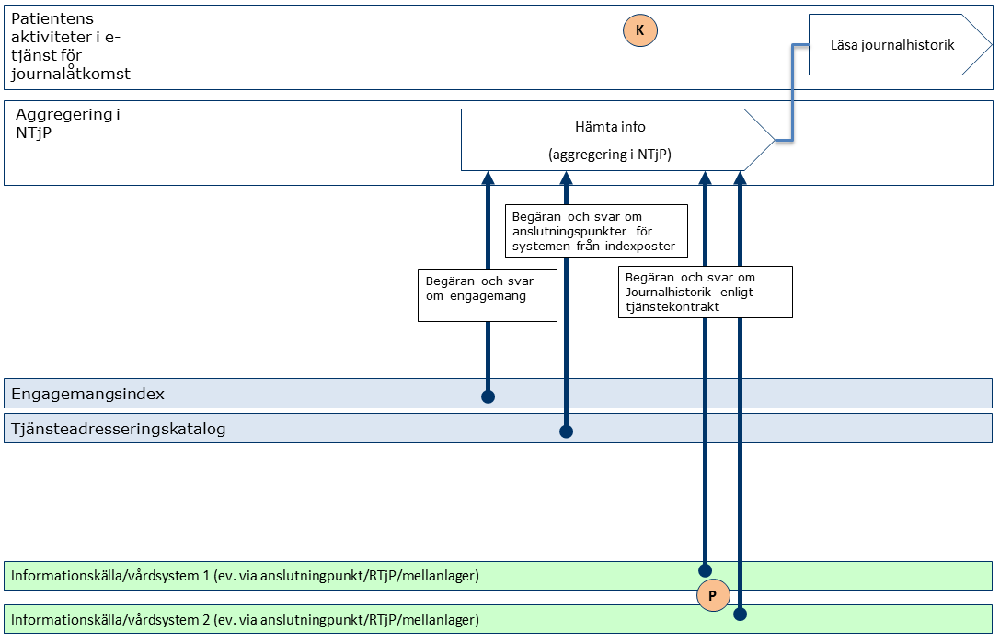
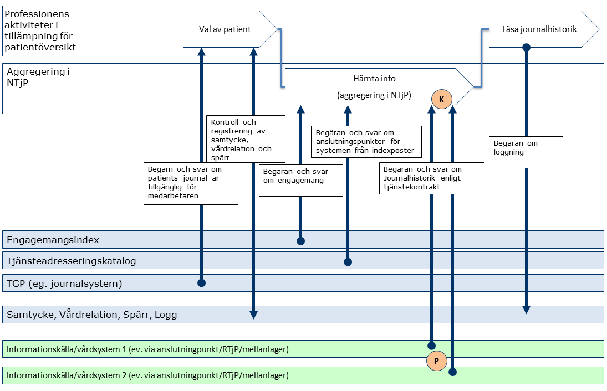
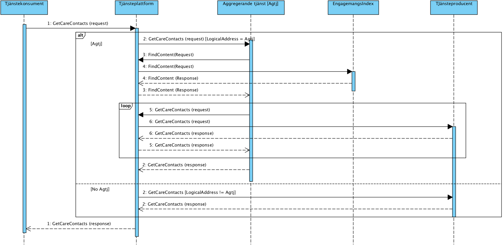
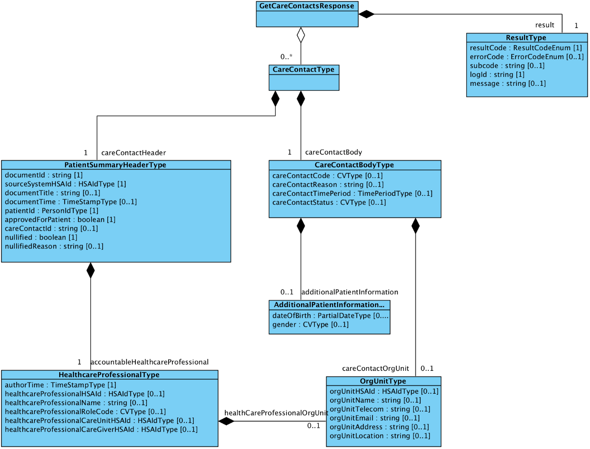
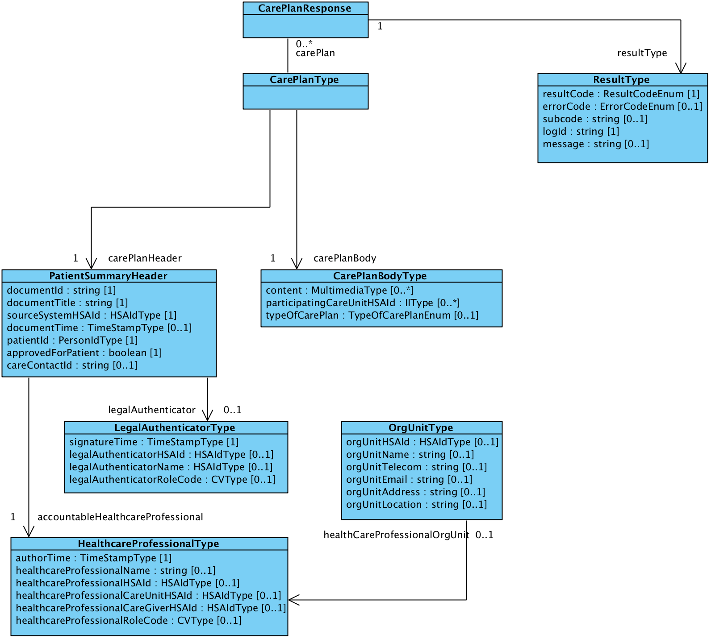

clinicalprocess: logistics:logistics

Innehållsförteckning
1	Inledning	15
1.1	Svenskt namn	15
2	Versionsinformation	16
2.1	Version 3.0.12	16
2.1.1	Oförändrade tjänstekontrakt	16
2.1.2	Nya tjänstekontrakt	16
2.1.3	Förändrade tjänstekontrakt	16
2.1.4	Utgångna tjänstekontrakt	16
2.1.5	Ej Fastställda kontrakt	16
2.2	Version tidigare	16
3	Tjänstedomänens arkitektur	17
3.1	Flöden	17
3.1.2	Obligatoriska kontrakt	20
3.2	Adressering	20
3.2.1	Sammanfattning av adresseringsmodell	20
3.3	Aggregering och engagemangsindex	20
4	Tjänstedomänens krav och regler	22
4.1	Uppdatering av engagemangsindex	22
4.2	Informationssäkerhet och juridik	25
4.2.1	Medarbetarens direktåtkomst	25
4.2.2	Patientens direktåtkomst	25
4.2.3	Generellt	25
4.3	Icke funktionella krav	26
4.3.1	SLA krav	26
4.3.2	Övriga krav	27
4.4	Felhantering	27
4.4.1	Krav på en tjänsteproducent	27
4.4.2	Krav på en tjänstekonsument	28
5	Gemensamma informationskomponenter	29
6	Tjänstedomänens meddelandemodeller	30
6.1	V-MIM GetCareContacts – Vårdkontakter	30
6.2	MIM GetCarePlans – Vård- och omsorgsplan	33
6.3	Formatregler	35
6.3.1	Format för datum och tidpunkter	35
6.3.2	Tidszon för tidpunkter	35
7	Tjänstekontrakt	36
7.1	GetCareContacts	36
7.1.1	Version	36
7.1.2	Fältregler	36
7.1.3	Övriga regler	46
7.1.4	Icke funktionella krav	47
7.1.5	SLA-krav	47
7.2	GetCarePlans	48
7.2.1	Version	48
7.2.2	Fältregler	48
7.2.3	Övriga regler	55
7.2.4	Icke funktionella krav	55
7.2.5	SLA-krav	56
Revisionshistorik

| Version | Datum | Författare | Kommentar |
| :--- | :--- | :--- | :--- |
| - | 2012-12-03 | FS, MA | Arbetsdokument: Vårddokumentation tillagd |
| - | 2012-12-11 | Maria Andersson | Uppdaterade tabeller efter diskussioner med Johan Eltes |
| - | 2012-12-18 | Maria Andersson | Lagt till kap 5. GetReferralAnswer |
| - | 2012-12-20 | Maria Andersson | Uppdaterat tabeller |
| - | 2012-12-21 | Maria Andersson | Uppdaterat tabeller efter ny struktur |
| - | 2012-12-21 | Maria Andersson | Uppdaterat namnen i tabellen |
| - | 2012-12-21 | Johan Eltes | Lagt till avsnittet Tjänstedomänens arkitektur samt redigerat avsnittet Generella regler |
| - | 2013-01-07 | Johan Eltes | Förbättrad kvalitén på texterna från PA7 |
| - | 2013-01-08 | Maria Andersson | Uppdaterat tabellerna under kap 4, 5 och 6 |
| - | 2013-01-09 | Johan Eltes | Lagt till avsnitt om engagemangsindex. Kompletterat/förtydligat avsnitten nationell användning, nationell användning och adresseringsmodell. |
| - | 2013-01-14 | Maria Andersson | Uppdaterat kap 5 och 6 med ny struktur. |
| - | 2013-01-14 | Maria Andersson | Lagt till kap 7. |
| - | 2013-01-20 | Johan Eltes | Uppdaterat efter beslut att håll aindexpostern på PDLenhetsnivå och använda SourceSystem för adressering. |
| - | 2013-01-21 | Fredrik Ström | Uppdaterat gemensamma informationskomponenter och tjänstebeskrivning |
| - | 2013-01-21 | Maria Andersson | Uppdaterat typerna med inledande versal. Ändrat från careRequest till Referral och från Answer till Outcome i kap 6. |
| - | 2013-01-21 | Maria Andersson | Ändrat kardinaliteten på referral i kap 6. |
| - | 2013-01-24 | Maria Andersson | Ändrat i tabellerna i kap 4, 5 och 6. |
| - | 2013-01-25 | Maria Andersson | Ändrat i tabellerna i kap 4, 5 och 6. |
| - | 2013-01-29 | Maria Andersson | Ändrat beskrivningar i kap 4, 5 och 6 samt ny struktur i kap 4. |
| - | 2013-01-30 | Fredrik Ström / Magnus Ekstrand | Ändrat beskrivningar kap 4, 5.4 och 6.4. / Nya och uppdaterade typer kap 4, 5.4 och 6.4. |
| - | 2013-01-31 | Maria Andersson | Ändringar i beskrivningar kap 4, 5, 6 och 7. |
| - | 2013-01-31 | Maria Andersson | Ändringar i kap 7, GetCareContact |
| - | 2013-02-07 | Magnus Ekstrand | Justeringar av elementnamn och kardinalitet i kap 5, 6 och 7. / Tog bort ej använd gemensam komponent. |
| - | 2013-02-11 | Maria Andersson | Lagt till kap 8, GetDiagnosis |
| - | 2013-02-19 | Johan Eltes | Definierat krav på uppdatering av fältet mostRecentContent i EI-posten. |
| - | 2013-03-01 | Maria Andersson de Vicente | Lagt in beskrivning av personidentifierare under kap 3. |
| - | 2013-03-04 | Maria Andersson de Vicente | Uppdaterat till careContactUnitid, careContactUnitName, careContactUnitAddress under 7.4. Uppdaterat beskrivningen av Author under 5.4, 6.4, 7.4 och 8.4. Ändrat Aderss till Postadress i hela dokumentet. |
| - | 2013-03-04 | Maria Andersson de Vicente | Ändrat kardinalitet på CareContactUnit till 1..1 under 7.4. Lagt till authorOrgUnitHSAid och authorOrgUnitName. Ändrat kardinalitet på legalAuthenticatorHSAid till 0..1. Tagit bort information om signatur under 7.4. Lagt till sourceSystem. |
| - | 2013-03-05 | Johan Eltes | Lagt till nya sökparametrar för source system och care contact id. Lagt till authorOrgUnitAddress och tagit bort careUnitName. Tagit bort signeringsinformation. / Förtydligat skrivning om aggregerande tjänster samt lagt till scenariobeskrivning för sökning på careContactId / Ändringar är markerade med gult. |
| - | 2013-03-14 | Maria Andersson de Vicente | Lagt till Telecom, Email och Location i kap 5. Har även ändrat beskrivningen av DocumentTime. |
| - | 2013-03-15 | Johan Eltes | Specificerat kodverk för EI-postens Categorization-fält. / SLA-krav uppdaterade / Preciserat lexikaliskt format för personnummer. |
| - | 2013-04-08 | Johan Eltes / Khaled Daham | Skapat klassen OrgUnitType. / Bytt namn på documentId till careContactId / Bytt namn på careContactUnitId till careContactOrgUnitHsaId / Bytt namn på alla fält som börjar med careContactUnit… till careContactOrgUnit… / Ändrat kardinalitet på careContactOrgUnit från 0..* till 1..1. / Bytt namn på ”author” till ”accountableHealthcareProfessional” och definierat typen HealthcareProfessional / Lagt till fältet ” accountableHealthcareProfessionalOrgUnit” / HealthcareProfessionalType / Ändrat elementnamnet sourceSystem till sourceSystemHSAid / Ändrat semantik (regel) för EI-fältet ”Most Recent Content” / Färbättrat och utökat dokumentation om systemadressering |
| - | 2013-04-15 | Johan Eltes | Ändrat kodverk för kontaktstatus till samma som i NPÖ RIV-Spec. / Lagt till contactTimePeriod i GetCareContacts svarsmeddelande. / Lagt till fältet Data Controller i EI-posten, samt uppdaterat regler för EI-fältet Logical Address |
| - | 2013-04-23 | Johan Eltes | Ändrat kardinalitet för careContactCode till 0..1, samt tydliggjort innebörd i utelämnat värde. |
| - | 2013-05-07 | Johan Eltes | Arkitekturskisser uppdaterade för att spegla korrekt användning av EI / Formatteringsfelet i dokumentet är årgärdat. |
| - | 2013-08-20 | Fredrik Ström | Beskrivning av accountableHealthcareProfesionalOrgUnit samt careContactOrgUnit uppdaterad/förtydligad |
| - | 2013-09-03 | Björn Genfors | Ändrat kardinalitet på accountableHealthcareProfessional, se Google Code issue 80. Följdändrat kardinaliteten på accountableHealthcareProfessional i PatientSummaryHeaderType. / Redigerat små felaktigheter. |
| - | 2013-09-20 | Björn Genfors | Uppdaterat sektionen om gemensamma typer. / Följduppdaterat tjänstekontraktsbeskrivningar |
| - | 2013-09-26 | Björn Genfors | Redaktionella ändringar (HSAId ska skrivas just så). |
| - | 2013-09-30 | Johan Eltes | Rättade ”healthcareProfessionalOrgUnit” som var skrivet som ”healthCareProfessionalOrgUnit” |
| - | 2013-10-09 | Björn Genfors | Tagit bort nullified i GetCareContacts / Justerat utseendet i kontrakt-tabellen för bättre läsbarhet |
| - | 2013-10-15 | Björn Genfors | Förtydligat patientId i PatientSummaryHeader. |
| - | 2013-10-17 | Björn Genfors | Redigerat förtydligandet från PA41, så det beskriver rätt. / Stavat rätt på Thomas Siltberg / Tagit bort Lennart Eriksson, CeHis från projektgruppen / Förtydligat hur adress bör skrivas. / Korrigerat beskrivningen av documentId i PatientSummaryHeader / Förtydligat inledningen. / Korrigerat beskrivningen av adresseringsmodell / Justerat rubrikfel vid ”Informationssäkerhet - patientens direktåtkomst” / Korrigerat felaktig beskrivning under ”Informationssäkerhet – generellt” / Lagt till posten SourceSystem i Engagemangsindex. |
| - | 2013-10-21 | Johan Eltes | Förtydligat kravet på filtrering av svar enligt logicalAddress (lagt till avsnitt 3.4). / Markerat i flödesmodeller att anslutningskatalog inte är del av dagens arkitektur. |
| - | 2013-11-05 | Johan Eltes | Ersatt termen PDL-enhet med vårdenhet / Uppdaterat avsnittet om informationssäkerhet efter CeHis-granskning / Tagit bort referenser till HL7 CDA för denna domen (administrativ domän) |
| - | 2013-11-14 | Johan Eltes | Rättelse: ändrat kardinalitet för healthcareProfessionalCareUnitHSAId och healthcareProfessionalCareGiverHSAId från 1..1 till 0..1 |
| - | 2013-11-21 | Johan Eltes | Lagt till text på GCC som deklarerar kompatibilitet med NPö RIV Spec. |
| - | 2013-11-28 | Khaled Daham | Synkat fältregler med gemensamma komponenter som har uppdaterats (PatientSummaryHeaderType samt HealthcareProfessionalType) |
| - | 2013-12-16 | Björn Genfors | Uppdaterat beskrivningen av orgUnitHSAId (se även Google Code issue 221). / Tagit bort avsnittet med de gemensamma typerna och hänvisar till bilaga istället (gemensamma typer 2). |
| - | 2014-02-13 | Khaled Daham | healthcareProfessionalHSAId ändrad från 1..1 till 0..1, orgUnitHSAId ändrad från 1..1 till 0..1 |
| - | 2014-02-17 | Khaled Daham | accountableHealthCareProfessional ändrad från 0..1 till 1..1 (authorTime måste alltid vara med) / careContactOrgUnit.orgUnitHSAId 0..1 till 1..1 / careContactOrgUnit.orgUnitName 0..1 till 1..1 |
| - | 2014-02-17 | Khaled Daham | Förtydligande över hur lokalt id för orgUnitHsaId ska se ut. |
| 2.1_RC2 | 2014-02-20 | Khaled Daham | Uppdaterat versionsnummer och datum. |
| 2.1_RC3 | 2014-02-20 | Marcus Claus | Lagt till referenstabell med hänvisning till bl.a. bilagan för arkitekturella beslut. Uppdaterat rc nummer. |
| 3.0_RC1 | 2014-03-21 | Björn Genfors | Bytt dokumentationen till ny mall / Uppdaterat GetCareContacts till version 3.0. |
| 3.0_RC1 | 2014-09-12 | Khaled Daham | Lagt till GetCareServices och GetCarePlans. |
| 3.0_RC1 | 2014-09-20 | Marcus Claus | Justerat svenska namnen för de nya kontraken enl npö rivspec |
| 3.0_RC1 | 2014-09-22 | Khaled Daham | Lagt till documentTitle i svar på GetCareServices |
| 3.0_RC2 | 2014-10-28 | Khaled Daham | Korrigerat enligt kommentarer ifrån VIS-granskning. / Uppdaterat beskrivning för reservnummer / Uppdaterat beskrivning för hur GetCareContacts datePeriod skall tolkas för framtida vårdkontakter. / Förenklat flödesbeskrivning och obligatoriska kontrakt. / Uppdaterat beskrivning för categorization i kapitel 4.1 / Förenklat logiska fel. / Flödesbeskrivning av relation-konceptet. |
| 3.0_RC3 | 2014-11-17 | Khaled Daham | Uppdaterat web-beskrivning / Rättat stavfel / sourceSystemHSAId krävs vid begäran på reservnummer |
| 3.0_RC3 | 2014-11-18 | Khaled Daham | Lagt till Ineras HSA-id för aggregerande tjänster |
| 3.0_RC3 | 2014-11-18 | Khaled Daham | Ändrat kardinalitet på referredInformation ifrån 1..* till 1..1, synkat med clinicalprocess.healthcond.basic |
| 3.0_RC3 | 2014-11-25 | Khaled Daham | Tagit bort alternativet att använda GetUpdates(index-pull) för EI då den inte är implementerad och det pågår diskussioner om att den skall tas bort ifrån TKB för EI. / Uppdaterat sekvensdiagram. |
| 3.0_RC3 |  | Khaled Daham | Uppdaterat kv_kontaktstatus |
| 3.0_RC3 | 2015-03-28 | Khaled Daham | Tagit bort relations-konceptet ur alla kontrakt för domänen efter beslut taget av Inera. |
| 3.0_RC4 | 2015-05-15 | Khaled Daham, Björn Genfors | Uppdaterat v-tim / Uppdaterat HSA-id för Inera / Issue 324 på google code / Issue 326 på google code / Förtydligat att kv_vårdkontaktstatus kommer att ersättas med en ny version juni 2015. |
| 3.0_RC5 | 2015-06-24 | Khaled Daham | Uppdaterat beskrivning av kv_vårdkontaktstatus med information om vart i SNOMED man kan hitta kodverket, samt de nu gällande koderna. |
| 3.0_RC5 | 2015-07-02 | Khaled Daham | Uppdaterat beskrivning av authorTime i header. |
| 3.0_RC5 | 2015-08-26 | Khaled Daham | Uppdaterat SLA enligt beslut av Inera |
| 3.0.1_RC2 | 2015-09-15 | Björn Genfors | Uppdaterat kap 5 med NPÖ-mappning för GCC |
| 3.0.1_RC3 | 2015-11-26 | Björn Genfors, Khaled Daham | Uppdaterat kap 5 med mappning för additionalPatientInformationType i GCC / Lagt till länk för ärendehantering / Lagt till förtydligande kring regler för binära bilagor. |
| 3.0.2 | 2016-04-11 | Khaled Daham | Issue https://bitbucket.org/rivta-domains/riv.clinicalprocess.logistics.logistics/issues/344 / Issue https://bitbucket.org/rivta-domains/riv.clinicalprocess.logistics.logistics/issues/345 |
| 3.0.2 | 2016-04-28 | Khaled Daham | Issue https://bitbucket.org/rivta-domains/riv.clinicalprocess.logistics.logistics/issues/328 / Issue https://bitbucket.org/rivta-domains/riv.clinicalprocess.logistics.logistics/issues/343 |
| 3.0.5 | 2017-06-10 | Khaled Daham | Har tagit bort GetCareServices som ej är fastställd (går att finna i senaste release candidate) / Anledning för den här releasen är utökade testsviter. |
| 3.0.6 | 2019-07-04 | Claudia Ehrentraut | Uppdaterat R8 i enlighet med senaste mall för informationsspecifikationen (ARK_0026 på http://rivta.se/documents.html, v 2.8) i referenstabellen / Lagt till kodverksreferens [R8] i fältbeskrivningarna för careContactCode och gender / OBS! uppdatering av referensen för careContactCode innebär ett förtydligande gällande vilket kodverk som ska användas för detta attribut. Kodverket som ska användas nämns i fältbeskrivningen för attributet och SKA hämtas från källan som är angivit under R8 / Lagt till R12 referens för Snomed CT i enlighet med senaste mall för informationsspecifikationen (ARK_0026 på http://rivta.se/documents.html, v 2.8) i referenstabellen / Uppdaterat referens till Snomed i fältbeskrivningen för careContactStatus / Ändrat fältbeskrivning för careContactTimePeriod (utifrån https://bitbucket.org/rivta-domains/riv.clinicalprocess.logistics.logistics/issues/356/synpunkter-p-regler-f-r) / Ändrat kardinalitet för carePlanBody/content från 0..1 till 0..* för att motsvarar kardinaliten som tillåts i schemat: <xs:element name="content" type="tns:MultimediaType" minOccurs="0" maxOccurs="unbounded"/> (utifrån https://bitbucket.org/rivta-domains/riv.clinicalprocess.logistics.logistics/issues/339/getcareplans-20-content-under-careplanbody) |
| 3.0.7 | 2020-02-05 / 2020-03-24 / 2020-03-25 / 2020-04-22 / 2020-05-05 / 2020-06-10 | Claudia Ehrentraut | Tagit bort mappningar mot NPÖ och V-TIM från mappningstabellerna för respektive tjänstekontrakt samt övriga referenser till mappningen, efter A&R beslut om att mappningar ska tas bort. / Uppdaterat gamla länkar i referenslistan. / Uppdaterat referensnamn (tex R8 till R6, R12 till R10). / Uppdaterat stycke om stark autentisering och lagt till R11 och R12 i samband med uppdateringen. / Uppdaterat mappning ”CarePlanBodyType.content” – ”carePlan/carePlanBody/comment” till ”CarePlanBodyType.content” – ”carePlan/carePlanBody/content” i mappningstabellen under MIM GetCarePlans – Vård- och omsorgsplan, för att stämma överens med schemat. / Uppdaterat regeltabellen under ”Övriga regler” till ny format / Länkat till reglerna från attribut i fältregeltabellen / Flyttat ut tjänstespecifika regler för NPÖ till regeltabellen / Regelförtydligande av HSA-id för / vårdgivare och vårdenhet (Regel 1) / Ändrat användning av vård- och omsorg (tex vård och omsorgspersonal) till hälso- och sjukvård (tex hälso- och sjukvårdspersonal). I enstaka fall har vård- och omsorg ändrats till enbart vård (tex vårdkontakter, vårddokumentation). Vård- och omsorgsplan har bibehållits eftersom det är ett ’vedertaget’ begrepp som definieras i Socialstyrelsens termbank. / Uppdaterat beskrivande texter i inledningen / Uppdaterat attributbeskrivningar, dvs tagit bort formuleringar ”Skall anges om tillgängligt.” eller ”I undantagsfall kan ett för källsystemet lokalt id användas istället.” för healthcareProfessionalOrgUnit.orgUnitHSAId/orgUnitName & careContactOrgUnit.orgUnitHSAId/orgUnitName / Lagt till lista med mediatyper som kan användas i kontraktet GetCarePlans. |
| 3.0.8 | 2020-11-25 | Claudia Ehrentraut | Uppdaterat versionsnummer. |
| 3.0.9 | 2021-05-24 | Tobias Blomberg | Lagt till referens till Ark_0040 gällande hantering av parallella majorversioner. / Ersatt alla skall med ska, samt alla oid med OID. / Uppdaterat beskrivningen av attributet ”documentId” i ”PatientSummaryHeaderType” i GCC och GDP. / Tagit bort regel 6 under övriga regler för GCC då attributbeskrivningen uppdaterats enligt ovan. / Uppdaterat referens till kodverk och identifierare. / Uppdaterat referensnamn (tex R8 till R9, R12 till R13). / Uppdaterat beskrivningen för tidsfiltrering i GCC och GCP. / Uppdaterat beskrivningen för attributet LegalAuthenticatorType i GCP. / Uppdaterat beskrivningen av attributet MostRecentContent under avsnitt 4.1 / Uppdaterat beskrivning av domän samt tjänstekontrakt. |
| 3.0.10 | 2022-02-14 | Tobias Blomberg | Uppdaterat elementet participatingCareUnitId i GetCarePlan till participatingCareUnitHSAId på grund av felskrivning. / Uppdaterat beskrivningen för elementet sourceSystemHSAId i begäran för båda tjänstekontrakten i domänen. |
| 3.0.10 | 2022-03-22 | Tobias Blomberg | Granskning av version godkänd |
| 3.0.11_RC1 | 2023-02-03 | Tobias Blomberg | Tagit bort denna text från attributet legalAuthenticator ur getCarePlans: / ”I de fall där informationen har låsts utan signering, representeras detta genom att signatureTime sätts till tidpunkten för låsning, och resterande fält i LegalAuthenticatorType lämnas tomma.”. / Detta då det enligt SOSFS 2016:40 ska det ej längre finnas möjlighet att låsa osignerade journalanteckningar / Uppdaterat samtliga beskrivningar av CVType för att tydliggöra regler gällande hur de olika elementen i typen relaterar till varandra. Reglerna finns redan beskrivna i schematron. |
| 3.0.11 | 2023-02-09 | Tobias Blomberg | Granskning av version godkänd. |
| 3.0.12 | 2023-06-22 | Tobias Blomberg | Uppdaterat beskrivningen för tidsfiltrering i GCC enl. TJN-348 / Ändrat från Datainspektionen till Integritetsskyddsmyndigheten då myndigheten bytt namn. / Ändrat svarstiden under kap 4.3.1 från 30 sek till 27 sek enligt regler i RIV-TA. Totaltiden är fortfarande 30 sek men 3 sek behövs för bearbetning hos tjänstekonsumtenten. / Tagit bort avsnittet Förkortningar då de förkortningar som angetts där inte återfinns i dokumentet. / Flyttat innehåll i TKB till senaste TKB-mallen men Ineras nya grafiska profil. |
| 3.0.13 | 2023-12-06 | Tobias Blomberg | Lagt till följande beskrivning för fältet ”../../typeOfCarePlan” i GetCarePlans: / ”OBS! Detta attribut motsvarar typen typeOfCarePlanEnum i XSD-schemat.” TJN-376 / Ändrat i mappningen mellan klass.attribut och XSD-schemat för typeOfCarePlan så den mappar mot typeOfCarePlanEnum i XSD-schemat. TJN-376 |
Referenser

| Namn | Dokument | Kommentar | Länk |
| :--- | :--- | :--- | :--- |
| R1 | AB_clinicalprocess_healthcond_description.docx | Obligatoriskt | Bilaga |
| R2 | RIVTA flera dokument | Finns på Webben | länk |
| R3 | Bilaga Gemensamma_typer_3.pdf | - | Bilaga |
| R4 | RIV Tekniska Anvisningar Översikt | Finns på Webben | länk |
| R5 | Tabell över godkända tjänstedomäner | Finns på Webben | länk |
| R6 | Kodverkslistan | Finns på Webben | länk |
| R7 | Lista över identifierare | Finns på Webben | länk |
| R8 | ISO8601-standarden för tidsformat | Finns på Webben | länk |
| R9 | Ärendehantering | Finns på Webben | länk |
| R10 | Hantering av binära bilagor | Finns på Webben | länk |
| R11 | SnomedCT | Finns på Webben | länk |
| R12 | Senaste version av SOSFS 2016:40 Socialstyrelsens föreskrifter och allmänna råd om journalföring och behandling av personuppgifter i hälso- och sjukvården | - | länk |
| R13 | Journalföring och behandling av personuppgifter i hälso- och sjukvården - Handbok vid tillämpningen av Socialstyrelsens föreskrifter och allmänna råd (HSLF-FS 2016:40) om journalföring och behandling av personuppgifter i hälso- och sjukvården |  | länk |
| R14 | RIV Tekniska Anvisningar – Parallella versioner av ett tjänstekontrakt | Finns på webben | länk |

## Inledning
Detta är beskrivningen av tjänstekontrakten i tjänstedomänen
clinicalprocess: logistics: logistics
Tjänstekontrakten är baserade på RIVTA 2.1 [R2] och reglerade genom arkitekturella beslut [R1].
Tjänstedomänens syftar till att tillmötesgå behovet av både patientens och hälso- och sjukvårdspersonalens direktåtkomst till patientens vårdinformation.
Tjänstekontraktsbeskrivningen är en kravspecifikation. Den ska fungera som ett teknikneutralt, formellt regelverk som reglerar integrationskrav för parter (tjänstekonsumenter och tjänsteproducenter) som avser ansluta system för samverkan enligt dessa tjänstekontrakt. Tjänstekontraktsbeskrivningen är också ett viktigt underlag för skapande av de tekniska kontrakten (scheman och WSDL-filer).
Detta dokument kompletterar reglerna i de tekniska kontrakten. Tjänsteproducenter och tjänstekonsumenter ska m.a.o. följa såväl de maskintolkbara reglerna i de tekniska kontrakten, så väl som de regler som uttrycks verbalt i detta dokument.

### Svenskt namn
operativt processtöd: samordna resurser över verksamhetsstrukturer: logistik
resurssamordning

## Versionsinformation
Denna revision av tjänstekontraktsbeskrivningen handlar om domänen clinicalprocess: logistics: logistics. Observera att version för detta dokument och domänen måste vara lika. Detta för att spårbarheten inte skall brytas.

### Version 3.0.13

#### Oförändrade tjänstekontrakt
GetCareContacts, version 3.0
GetCarePlans, version 2.0

#### Nya tjänstekontrakt
Inga kontrakt är nya sedan föregående version.

#### Förändrade tjänstekontrakt
Inga kontrakt är förändrade sedan föregående version.

#### Utgångna tjänstekontrakt
Inga tjänstekontrakt har utgått sedan föregående version.

#### Ej Fastställda kontrakt
Inga tjänstekontrakt är ej fastställda sedan föregående version.

### Version tidigare
3.0.12

## Tjänstedomänens arkitektur
I detta avsnitt beskrivs hur T-boken tillämpats i tjänstedomänen. Avsnittet syftar till att ge läsaren överblick och förståelse. Avsnittet innehåller inga regler, men ger ett sammanhang för de regler som beskrivs i övriga delar av dokumentet.
Tjänsterna i denna domän erbjuder sökning efter logistikrelaterad information från hälso- och sjukvårdens journal- och patientadministrativa system, såsom information om planerade och utförda vårdkontakter, samt information om vårdplaner. Utgångspunkten för tjänsterna i denna tjänstedomän är i första hand patientens och professionens behov av direktåtkomst till en patients vårdhistorik sett ur ett nationellt eller ett regionalt perspektiv. I båda fallen är syftet att historisk information sammanställs från det eller de källsystem där det finns historik via s.k. aggregerande tjänster, snarare än att begära information från ett specifikt system eller en specifik verksamhet.
Tjänstekontrakten erbjuder även möjlighet att nå information från ett specifikt system eller en specifik verksamhet. Behovet av att rikta en fråga till ett specifikt system uppstår främst när tjänstekonsumenten också är prenumerant på notifieringar från engagemangsindex och på det sättet (via ProcessNotification) får information om en händelse i ett specifikt system. Det är då ändamålsenligt att adressera det specifika systemet, istället för den aggregerande tjänsten.
Följande flödesmodeller beskriver översiktligt hur tjänstekontrakten är tänkta att användas. Tjänstekonsument (K) och tjänsteproducenter (P) är markerade i figurerna.

### Flöden
Nedanstående diagram visar hur flödet principiellt ser ut när information ur kontrakt i tjänstedomänen efterfrågas och hanteras (exemplifierat med GetCareContacts).

##### Arbetsflöde

*Figur  Exempel: Adressering vid anrop till aggregerande tjänst från patienttjänst (t.ex. Journalen).*

*Figur  Exempel: Adressering vid anrop till aggregerande vårdgivartjänst (t.ex. från NPÖ-tillämpningen).*

###### Roller

| Namn/beteckning | Beskrivning alt. referens |
| :--- | :--- |
| Patienten | Den patient som vill få tillgång till sina vårdkontakter. |

##### Sekvensdiagram

*Figur  Sekvensdiagram över sökning efter information där GetCareContacts används som exempel men samma princip gäller för alla kontrakt i tjänstedomänen, diagrammet visar på två alternativa sekvenser där det första alternativet gäller när aggregerande tjänster adresseras och det andra alternativet gäller när källsystemet adresseras.*

###### Roller

| Namn | Beskrivning |
| :--- | :--- |
| Tjänstekonsument | Det system som används för att konsumera information. Dvs det system som använder tjänster enligt ett tjänstekontrakt. |
| Tjänsteplattform | Tjänsteplattformen är det lager som hanterar virtuella tjänster, aggregerande tjänster samt anpassningstjänster. |
| Vårdinformationssystem | Det system som i detta fall utgör källsystemet som vårdpersonal direkt registrerar/uppdaterar/raderar information i. |

#### Obligatoriska kontrakt
Tjänstedomänen definierar inga flöden, alla tjänstekontrakt är frivilliga.

### Adressering
Tjänstedomänen tillämpar källsystem-adressering. Observera att tjänstekonsumenter främst anropar aggregerande tjänster. Tjänstekonsumenten adresserar därför den aggregerande tjänsten med antingen nationellt HSA-id (Ineras HSA-id) eller HSA-id för aktuell huvudman om det är en regional/huvudmanna-specifik (t.ex. ”regional”) aggregerande tjänst som ska adresseras.
Det finns också fall då en tjänstekonsument adresserar ett källsystem. Det förutsätter att tjänstekonsumenten känner till källsystemets HSA-id. Det sker genom att ett sådant anrop föregås av ett anrop till en aggregerande tjänst (källsystemets HSA-id finns då i svarsmeddelandet) eller genom att tjänstekonsumenten är producent för Engagemangsindex notifieringskontrakt (ProcessNotification). Notifieringen innehåller information om en händelse rörande en patients information i ett specifikt källsystem. Genom att använda informationen om källsystemets HSA-id kan tjänstekonsumenten direktadressera källsystemet i syfte att hämta information om den händelse som just notifierats för patienten.
Adressering sker i enlighet med RIV Tekniska Anvisningar Översikt, Rev PD2, avsnitt 8.3, där mer information kan hittas.

#### Sammanfattning av adresseringsmodell

| Åtkomstbehov för patientens journalhistorik | Logisk adress |
| :--- | :--- |
| Nationellt | Ineras HSA-id: 5565594230 |
| För en huvudman/region | Huvudmannens/regionens HSA-id |
| För ett källsystem | Källsystemets HSA-id |

### Aggregering och engagemangsindex
Det behövs en aggregerande tjänst för varje tjänstekontrakt som läser data i denna domän.
Aggregerande tjänster har samma tjänstekontrakt och anropsadress som en traditionell virtuell tjänst, men nås via olika logiska adresser.
Om ett källsystemets HSA-id anges som logisk adress, kommer frågemeddelandet att dirigeras vidare direkt till källsystemet utav tjänsteplattformen utan att passera en aggregerande tjänst.
Om logisk adress HSA-id för Inera eller en huvudman kommer anropet att dirigeras till aggregerande tjänsten som i sin tur – efter att ha konsulterat engagemangsindex – vidarebefordrar frågan till de källsystem som har information om patienten.

## Tjänstedomänens krav och regler
Dessa gäller alla tjänstekontrakt i hela tjänstedomänen om inte undantag görs för specifika tjänstekontrakt senare i dokumentet.

### Uppdatering av engagemangsindex
Alla källsystem ska uppdatera engagemangsindex. Engagemangsindex ska uppdateras så snart en händelse inträffar som påverkar indexposterna enligt beskrivningen nedan.
All uppdatering av engagemangsindex sker genom att källsystemet anropar engagemangsindex genom tjänstekontraktet
urn:riv:itintegration:engagementindex:UpdateResponder:1 (”index-push”).
Ladda hem Engagemangsindex WSDL, scheman och tjänstekontraktsbeskrivning (se referens [R5]).
Följande regler gäller för innehållet i begäran till engagemangsindex för uppdateringar som rör denna tjänstedomän:

| Attribut | Beskrivning | Format | Kardinalitet | Kodverk/värde-mängd 
/ev begränsningar | Beslutsregler och kommentar |
| :--- | :--- | :--- | :--- | :--- | :--- |
| Registered ResidentIdent Identification | Invånarens person-nummer | Person- eller samordningsnummer enligt skatteverkets definition (12 tecken). | 1..1 |  | Del av instansens unikhet |
| Service domain* | Den tjänstedomän som förekomsten avser. | URN på formen <regelverk>:<huvuddomän>:<underdomän1>:<underdomän2> | 1..1 | ”riv:clinicalprocess:logistics:logistics” | Del av instansens unikhet |
| Categori-zation* | Kategori-sering enligt kodverk som är specifikt för tjänste-domänen | Text bestående av bokstäver i ASCII. | 1..1 | Informationsmängd som finns i källsystemet för angiven patient och som indexposten avser. Anges med kortform enligt tabell nedan. | Del av instansens unikhet |
| Logical address* | Referens till informationskällan enligt tjänste-domänens definition | Logisk adress enligt adresseringsmodell för den tjänstedomän som anges av fältet Service Domain. | 1..1 | Samma värde som fältet Source System. | Del av instansens unikhet |
| Business object Instance Identifier* | Unik identifierare för händelse-bärande objekt | Text | 1..1 | ”NA” – d.v.s. ej tillämpat för tjänstedomänen. | Del av instansens unikhet |
| Clinical process interest Id | Hälsoärende-id | GUID | 1..1 | ”NA” (ännu ej tillämpat i tjänstedomänen) | Del av instansens unikhet |
| Most Recent Content* | Tidpunkt för senaste uppdatering av den informationstyp och patient i den källa som denna indexpost avser. | DT | 1..1 | Tidpunkt för senaste händelse som matchar indexposten. Kan även avse borttag. Ex: En indexpost representerar 2 bef. dokument. Ett av dem tas bort. Det markeras genom att bef. post uppdateras med tidpunkt för borttagshändelsen. |  |
| Creation / Time | Tidpunkten då index-posten registrerades | DT | 1..1 | Sätts automatiskt av EI-instansen. | Genereras automatiskt av kontraktets tjänste-producent |
| Update Time | Tidpunkten då index-posten senast upp-daterades | DT | 0..1 | Sätts automatiskt av EI-instansen. | Upp-datering innebär ny post som matchar samtliga attribut som är del av en instans unikitet. |
| Source system | Källsystemet som genererade engagemangs-posten via Update-tjänsten | Källsystemets HSA-id.  För system-adresserade tjänstedomäner motsvarar detta LogicalAddress vid anrop till tjänster i tjänstedomänen i fråga. Detta är inte anslutningspunktens HSA-id utan systemet som operativt hanterar originalinformationen i verksamheten. | 1..1 | Systemadressering tillämpas. Detta värde används som LogicalAddress vid tjänsteanrop. | Del av instansens unikhet |
| Data Controller | Personuppgiftsansvarig organisation | Vårdgivarens organisationsnummer eller HSA-id / eller inom källsystemet unik identifierare för vårdgivaren. | 1..1 | ”SE”<organisationsnummer>. Exempel: ”SE5565594230” eller HSA-id, eller / systemspecifik identitet. | Del av instansens unikhet |
Regler för tilldelning av värde i fältet Categorization i engagemangsposten för tjänstekontrakt i denna domän.

| Informationsmängd enligt Tjänstekontrakt | Värde på Categorization |
| :--- | :--- |
| GetCareContacts | vko |
| GetCarePlans | cll-cp |

### Informationssäkerhet och juridik

#### Medarbetarens direktåtkomst
Vid sammanhållen journalföring ansvarar verksamheten som erbjuder sina medarbetare direktåtkomst till sammanhållen journal för att patientdatalagen efterlevs. Det innebär bl.a. att spärrkontroll kan behöva genomföras innan information kan visas. Det innebär också att regelverket för samtycke, vårdrelation och åtkomstloggning måste följas. Dessutom finns krav från Integritetsskyddsmyndigheten om ytterligare teknisk åtkomstkontroll.
HSLF-FS 2016:40 [R12] ställer också krav (via handboken "Journalföring och behandling av personuppgifter i hälso- och sjukvården" [R13]) på att medarbetaren är starkt autentiserad om medarbetarens inloggning sker i nät som delas med flera vårdgivare och att uppdragsval görs i samband med autentisering (vårdenhet).
Observera att tjänstekontrakten i sig inte påtvingar sammanhållen journalföring. Krav rörande sammanhållen journalföring och eller krav på spärrhantering uppstår först om tjänstekonsumenten (e-tjänsten) för medarbetaren tillgängliggör information som härrör från andra vårdgivare (sammanhållen journalföring) eller andra vårdenheter inom egna vårdgivaren (spärrkrav).

#### Patientens direktåtkomst
Alla tjänstekontrakten i denna tjänstedomän har en svarsflagga som anger om verksamheten (informationsägaren) godkänt att informationen får visas för patient. Det kan t.ex. ha skett genom menprövning eller rådrum. För vissa tjänstekontrakt, såsom GetCareContacts (vårdkontakter), kanske informationsägaren policymässigt har menprövat all information på förhand. Det är varje vårdgivares ansvar att tjänsteproducenten sätter ”kan visas för patient”-flaggan i enlighet med vårdgivarens verksamhetsregler.

#### Generellt
Tjänsteproducenten ansvarar för att information endast lämnas ut till de tjänstekonsumenter som informationsägaren godkänt. Det är inte ett juridiskt krav, men tydliggörs här eftersom det avviker från T-boken i det att tjänsteplattformen då inte ansvarar för den tekniska åtkomstkontrollen (ej möjligt när systembaserad adressering tillämpas). Om informationsägaren har behov av att reglera åtkomst per tjänstekonsument, ska tjänsteproducenten filtrera svaret enligt informationsägarens önskemål. Observera att det är regionala policyer snarare än lagar och förordningar som styr i vilken grad tjänsteproducenten ska begränsa åtkomst för en viss tjänstekonsument. Kunskapen om tjänstekonsumentens (tjänstens) identitet (d.v.s. ursprunglig tjänstekonsument i anropskedjan) får bara användas för teknisk åtkomstbegränsning på så sätt att svaret blir som om de vårdenheter vars verksamhetschef inte godkänner aktuell tjänstekonsument varit exkluderade i frågan.

### Icke funktionella krav
Det är den informationsproducerande vårdgivarens ansvar att endast ett källsystem tillhandahåller informationen via lästjänst och engagemangsindex där patientdata lagras i flera källsystem. Konsumenter som är anslutna till flera majorversioner av samma kontrakt måste hantera dubblettborttagning mellan dessa. Detta sker genom att jämföra identiteter på postnivå och endast behålla en av de poster som returnerats, [R14].

#### SLA krav
Följande generella SLA-krav gäller för alla tjänsteproducenter som tillhandahåller tjänster. Dessa krav gäller där inget annat anges för ett specifikt tjänstekontrakt.
Följande SLA-krav gäller för producenter av tjänstekontrakten i denna domän

| Kategori | Värde | Beskrivning |
| :--- | :--- | :--- |
| Svarstid | Svarstiden för ett anrop får inte överstiga 27 sekunder. |  |
| Tillgänglighet | 24x7, 99,5% |  |
| Last | Tjänsteproducenten ska kunna hantera minst dubbla mängden frågor per dygn i förhållande till antalet journaluppdatering per dygn. |  |
| Aktualitet | Kraven på aktualitet varierar för olika tjänstekonsumenter. Det behöver inte vara absolut aktualitet i förhållande till källsystemet, men ju mindre fördröjning desto bättre. Ett riktmärke är att försöka undvika längre fördröjning än 60 minuter. Fördröjningen avser både journaldata och uppdatering av engagemangsindex. / Uppdatering av engagemangspost måste ske så att engagemangsposten refererar data som är omedelbart tillgängligt via tjänstekontraktet. |  |
| Robusthet | Om tidsintervall inte angivits i frågan kan tjänsteproducenten välja att lämna ett delsvar i syfte att uppfylla svarstidskravet. Delsvaret måste då vara avgränsat i tiden genom att det finns äldre men inte nyare data än det äldsta som returnerats. |  |
| Samtidighet | Tjänsteproducenten ska hantera minst 10 samtidiga frågor. |  |

#### Övriga krav

##### Gemensamma konsumentregler
R1: Filtrera enligt flagga ”approvedForPatient”
R2: Tillämpa regelverk enl. PDL

##### Gemensamma producentregler
R3: Filtrera enligt RIVTA-headern LogicalAddress. Svarsmeddelandet får endast innehålla information som skapats i det källsystem som anges av frågemeddelandets LogicalAddress.

### Felhantering

#### Krav på en tjänsteproducent

##### Logiska fel
Vid ett logiskt fel ska result.resultCode sättas till ERROR och result.errorCode enligt nedanstående tabell, om result.message innehåller ett meddelande så ska det vara sådant att det kan visas för en användare. Respektive kontrakt beskriver närmare vilka logiska fel som ska returneras.

| Felkod | Värde | Beskrivning |
| :--- | :--- | :--- |
| Ogiltig begäran | INVALID_REQUEST | Informationsmängden som skickats är ej korrekt utifrån de regler som gäller för tjänstekontraktet. En förklarande result.message kan närmare peka på vilken regel som ej efterföljts. / En omsändning av information kommer att ge samma fel. |

##### Tekniska fel
Vid ett tekniskt fel levereras ett generellt undantag (SOAP-Fault). Exempel på detta kan vara deadlock i databasen eller följdeffekter av programmeringsfel. Tekniska fel får inte förmedla personuppgifter. Istället rekommenderas att ett log-id förmedlas, som ger möjlighet för tjänsteproducentens förvaltning att bistå tjänstekonsumentens förvaltning med felsökning. Ett log-id bör vara en UUID. Ett log-id får under inga omständigheter förmedla information som är spårbar till patienten.

#### Krav på en tjänstekonsument

##### Logiska fel
Inga krav på konsument.

##### Tekniska fel
Inga krav på konsument.

## Gemensamma informationskomponenter
I tjänstekontraktsbeskrivningarna används ett antal komponenter som är gemensamma för vissa meddelanden i flera domäner eller inom denna domän. Observera att med anledning av att tjänstekontrakten även kan stödjas av producentsystem som saknar (fullständig) HSA-id-information så är HSA-id-attribut i beskrivningarna nedan valfria. Se även avsnittet ”4.2 Informationssäkerhet och juridik” ovan.
De gemensamma typerna beskrivs i referens [R3].

## Tjänstedomänens meddelandemodeller
Här beskrivs de meddelandemodeller som tjänstekontrakten bygger på. För varje meddelandemodell beskrivs hur mappning ser ut mot schema (XSD) för tjänstekontrakt.

### V-MIM GetCareContacts – Vårdkontakter

| Klass.attribut | Mappning mot XSD schema |
| :--- | :--- |
| careContact |  |
| careContactHeader.documentId | careContact/careContactHeader/documentId |
| careContactHeader.sourceSystemHSAId | careContact/careContactHeader/sourceSystemHSAId |
| careContactHeader.patientId | careContact/careContactHeader/patientId |
| careContactHeader.accountableHealthcareProfessional | careContact/careContactHeader/accountableHealthcareProfessional |
| accountableHealthcareProfessional.authorTime | careContact/careContactHeader/ accountableHealthcareProfessional /authorTime |
| accountableHealthcareProfessional.healthcareProfessionalHSAId | careContact/careContactHeader/accountableHealthcareProfessional/healthcareProfessionalHSAId |
| accountableHealthcareProfessional.healthcareProfessionalName | careContact/careContactHeader/accountableHealthcareProfessional/healthcareProfessionalName |
| accountableHealthcareProfessional.healthcareProfessionalRoleCode | careContact/careContactHeader/accountableHealthcareProfessional/healthcareProfessionalRoleCode |
| healthcareProfessionalOrgUnit.orgUnitHSAId | careContact/careContactHeader/accountableHealthcareProfessional/healthcareProfessionalOrgUnit/orgUnitHSAId |
| healthcareProfessionalOrgUnit.orgUnitname | careContact/careContactHeader/accountableHealthcareProfessional/healthcareProfessionalOrgUnit/orgUnitname |
| healthcareProfessionalOrgUnit.orgUnitTelecom | careContact/careContactHeader/accountableHealthcareProfessional/healthcareProfessionalOrgUnit/orgUnitTelecom |
| healthcareProfessionalOrgUnit.orgUnitEmail | careContact/careContactHeader/accountableHealthcareProfessional/healthcareProfessionalOrgUnit/orgUnitEmail |
| healthcareProfessionalOrgUnit.orgUnitAddress | careContact/careContactHeader/accountableHealthcareProfessional/healthcareProfessionalOrgUnit/orgUnitAddress |
| healthcareProfessionalOrgUnit.orgUnitLocation | careContact/careContactHeader/accountableHealthcareProfessional/healthcareProfessionalOrgUnit/orgUnitLocation |
| accountableHealthcareProfessional.healthcareProfessionalCareUnitHSAId | careContact/careContactHeader/accountableHealthcareProfessional/healthcareProfessionalCareUnitHSAId |
| accountableHealthcareProfessional.healthcareProfessionalCareGiverHSAId | careContact/careContactHeader/accountableHealthcareProfessional/healthcareProfessionalCareGiverHSAId |
| careContactHeader.approvedForPatient | careContact/careContactHeader/approvedForPatient |
| careContactBody |  |
| careContactBody.careContactCode | careContact/careContactBody/careContactCode |
| careContactBody.careContactReason | careContact/careContactBody/careContactReason |
| careContactBody.careContactTimePeriod | careContact/careContactBody/careContactTimePeriod |
| careContactBody.careContactStatus | careContact/careContactBody/careContactStatus |
| additionalPatientInformationType.dateOfBirth | careContact/careContactBody/additionalPatientInformation/dateOfBirth |
| additionalPatientInformationType.gender | careContact/careContactBody/additionalPatientInformation/gender |
| careContactBody.careContactOrgUnit | careContact/careContactBody/careContactOrgUnit |
| careContactOrgUnit.orgUnitHSAId | careContact/careContactBody/careContactOrgUnit/orgUnitHSAId |
| careContactOrgUnit.orgUnitName | careContact/careContactBody/careContactOrgUnit/orgUnitName |
| careContactOrgUnit.orgUnitTelecom | careContact/careContactBody/careContactOrgUnit/orgUnitTelecom |
| careContactOrgUnit.orgUnitEmail | careContact/careContactBody/careContactOrgUnit/orgUnitEmail |
| careContactOrgUnit.orgUnitAddress | careContact/careContactBody/careContactOrgUnit/orgUnitAddress |
| careContactOrgUnit.orgUnitLocation | careContact/careContactBody/careContactOrgUnit/orgUnitLocation |
| additionalPatientInformation.dateOfBirth | careContact/careContactBody/additionalPatientInformation/dateOfBirth |
| additionalPatientInformation.gender | careContact/careContactBody/additionalPatientInformation/gender |
| result | result |
| result.resultCode | result/resultCode |
| result.errorCode | result/errorCode |
| result.subcode | result/subcode |
| result.logId | result/logId |
| result.message | result/message |

### MIM GetCarePlans – Vård- och omsorgsplan

| Klass.attribut | Mappning mot XSD schema |
| :--- | :--- |
| CarePlanType |  |
| PatientSummaryHeaderType.documentId | carePlan/carePlanHeader/documentId |
| PatientSummaryHeaderType.sourceSystemHSAId | carePlan/carePlanHeader/sourceSystemHSAId |
| PatientSummaryHeaderType.documentTitle | carePlan/carePlanHeader/documentTitle |
| PatientSummaryHeaderType.documentTime | carePlan/carePlanHeader/documentTime |
| PatientSummaryHeaderType.patientId | carePlan/carePlanHeader/patientId |
| PatientSummaryHeaderType.accountableHealthcareProfessional | carePlan/carePlanHeader/accountableHealthcareProfessional |
| HealthcareProfessionalType | carePlan/carePlanHeader/accountableHealthcareProfessional |
| HealthcareProfessionalType.authorTime | carePlan/carePlanHeader/accountableHealthcareProfessional /authorTime |
| HealthcareProfessionalType.healthcareProfessionalHSAId | carePlan/carePlanHeader/accountableHealthcareProfessional/healthcareProfessionalHSAId |
| HealthcareProfessionalType.healthcareProfessionalName | carePlan/carePlanHeader/accountableHealthcareProfessional/healthcareProfessionalName |
| HealthcareProfessionalType.healthcareProfessionalRoleCode | carePlan/carePlanHeader/accountableHealthcareProfessional/healthcareProfessionalRoleCode |
| HealthcareProfessionalOrgUnitType.orgUnitHSAId | carePlan/carePlanHeader/accountableHealthcareProfessional/healthcareProfessionalOrgUnit/orgUnitHSAId |
| HealthcareProfessionalOrgUnitType.orgUnitname | carePlan/carePlanHeader/accountableHealthcareProfessional/healthcareProfessionalOrgUnit/orgUnitname |
| HealthcareProfessionalOrgUnitType.orgUnitTelecom | carePlan/carePlanHeader/accountableHealthcareProfessional/healthcareProfessionalOrgUnit/orgUnitTelecom |
| HealthcareProfessionalOrgUnitType.orgUnitEmail | carePlan/carePlanHeader/accountableHealthcareProfessional/healthcareProfessionalOrgUnit/orgUnitEmail |
| HealthcareProfessionalOrgUnitType.orgUnitAddress | carePlan/carePlanHeader/accountableHealthcareProfessional/healthcareProfessionalOrgUnit/orgUnitAddress |
| HealthcareProfessionalOrgUnitType.orgUnitLocation | carePlan/carePlanHeader//accountableHealthcareProfessional/healthcareProfessionalOrgUnit/orgUnitLocation |
| HealthcareProfessionalType.healthcareProfessionalCareUnitHSAId | carePlan/carePlanHeader/accountableHealthcareProfessional/healthcareProfessionalCareUnitHSAId |
| HealthcareProfessionalType.healthcareProfessionalCareGiverHSAId | carePlan/carePlanHeader/accountableHealthcareProfessional/healthcareProfessionalCareGiverHSAId |
| LegalAuthenticatorType.legalAuthenticatorTime | carePlan/carePlanHeader/legalAuthenticator/legalAuthenticatorTime |
| LegalAuthenticatorType.legalAuthenticatorHSAId | carePlan/carePlanHeader/legalAuthenticator/legalAuthenticatorHSAId |
| LegalAuthenticatorType.legalAuthenticatorName | carePlan/carePlanHeader/legalAuthenticator/legalAuthenticatorName |
| LegalAuthenticatorType.legalAuthenticatorRoleCode | carePlan/carePlanHeader/legalAuthenticator/legalAuthenticator RoleCode |
| PatientSummaryHeaderType.approvedForPatient | carePlan/carePlanHeader/approvedForPatient |
| PatientSummaryHeaderType.careContactId | carePlan/carePlanHeader/careContactId |
| CarePlanBodyType |  |
| CarePlanBodyType.content | carePlan/carePlanBody/content |
| CarePlanBodyType.participatingCareUnit | carePlan/carePlanBody/participatingCareUnit |
| CarePlanBodyType.typeOfCarePlan | carePlan/carePlanBody/typeOfCarePlanEnum |
| ResultType | result |
| ResultType.resultCode | result/resultCode |
| ResultType.errorCode | result/errorCode |
| ResultType.subcode | result/subcode |
| ResultType.logId | result/logId |
| ResultType.message | result/message |

### Formatregler

#### Format för datum och tidpunkter
Datum anges på formatet ”ÅÅÅÅMMDD”. Detta motsvarar den ISO 8601 och ISO 8824-kompatibla formatbeskrivningen ”YYYYMMDD” (se referens [R8]).
Tidpunkter anges alltid på formatet ”ÅÅÅÅMMDDttmmss”, vilket motsvarar den ISO 8601 och ISO 8824-kompatibla formatbeskrivningen ”YYYYMMDDhhmmss”.

#### Tidszon för tidpunkter
Tidszon anges inte i meddelandeformaten. All information om datum och tidpunkter som utbyts via tjänsterna ska ange datum och tidpunkter i den tidszon som gäller/gällde i Sverige vid den tidpunkt som respektive datum- eller tidpunktsfält bär information om. Såväl tjänstekonsumenter som tjänsteproducenter ska med andra ord förutsätta att datum och tidpunkter som utbyts är i tidszonerna CET (svensk normaltid) respektive CEST (svensk normaltid med justering för sommartid).

## Tjänstekontrakt

### GetCareContacts
GetCareContacts returnerar vårdkontakter som finns dokumenterade för en patient.

#### Version
3.0

#### Fältregler
Nedanstående tabell beskriver varje element i begäran och svar. Finns ytterligare regler för ett element är det noterat med referens till regeln i beskrivningen och beskrivs mer i detalj i stycket Övriga regler.

| Namn | Typ | Beskrivning | Kardinalitet |
| :--- | :--- | :--- | :--- |
| Begäran |  |  |  |
| careUnitHSAId | HSAIdType | Filtrering på PDL-enhet vilket motsvarar careUnitHSAId i healthcareProfessionalType. | 0..* |
| careGiverHSAId | HSAIdType | Filtrering på informationsägande vårdgivare, vilket motsvarar careGiverHSAId i healthcareProfessionalType | 0..* |
| patientId | PersonIdType | Id för patienten där fältet id sätts till patientens identifierare. Anges med 12 tecken utan avskiljare. / Fältet type sätts till OID för typ av identifierare. 
1) För personnummer ska Skatteverkets OID för personnummer (1.2.752.129.2.1.3.1) användas. / 2) För samordningsnummer ska Skatteverkets OID för samordningsnummer (1.2.752.129.2.1.3.3) användas. / 3) Tjänsteproducenter ska även stödja sökning på reservnummer med hjälp av att ange lokalt definierade OID’ar för reservnummer, exempelvis SLL reservnummer (1.2.752.97.3.1.3). / OBS reservnummer kan ej användas tillsammans med EI och aggregerande tjänster då dessa komponenter idag inte är anpassade för att stödja typ av id, inga uppdateringar till EI ska göras av en tjänsteproducent för reservnummer. / En tjänstekonsument som vill begära mha reservnummer måste därmed använda sig av systemadressering och ha vetskap om vilken reservnummer- OID som gäller vid anrop mot en specifik tjänsteproducent. | 1..1 |
| ../id | string | Id för patient enligt ovan. | 1..1 |
| ../type | string | OID enligt ovan. | 1..1 |
| datePeriod | DatePeriodType | Begränsar sökningen till det angivna intervallet. Begränsningen innebär att endast poster returneras där datumintervallet, som bildas av tidpunkterna authorTime, careContactTimePeriod.start och careContactTimePeriod.end i svaret, helt eller delvis överlappar med det angivna sökintervallet, dvs. / det bildade intervallets startdatum ligger inom sökintervallets start- och slutdatum / det bildade intervallets slutdatum ligger inom sökintervallets start- och slutdatum / det bildade intervallets startdatum ligger före sökintervallets startdatum och slutdatum ligger efter sökintervallets slutdatum / careContactTimePeriod.start ligger före eller inom sökintervallets start- och slutdatum samt careContactTimePeriod.end saknas. / careContactTimePeriod.end ligger inom eller efter sökintervallets start- och slutdatum samt careContactTimePeriod.start saknas. / Notera att sökintervallet beskrivs som ett datumintervall. Vid jämförelse konverteras datapostens tidpunkter till datum. | 0..1 |
| ../start | string | Startdatum. Format ÅÅÅÅMMDD. | 1..1 |
| ../end | string | Slutdatum. Format ÅÅÅÅMMDD. | 1..1 |
| sourceSystemHSAId | HSAIdType | Begränsar sökningen till aktivitet som är skapad i det angivna källsystemet. Tjänsteproducenten förväntas enbart returnera poster som tillhör efterfrågat källsystem. / Värdet på detta fält måste överensstämma med värdet på logicalAddress i anropets tekniska kuvertering (ex. SOAP-header). / Det innebär i praktiken att aggregerande tjänster inte används när detta fält anges. / Fältet är tvingande om careContactId angivits. / Fältet är tvingande vid begäran på reservnummer. | 0..1 |
| careContactId | string | Begränsar sökningen till den/de vårdkontakter vars id anges. Motsvarar documentId i careContactHeader i svaret. | 0..* |
| Svar |  |  |  |
| careContact | CareContactType | De vårdkontakter som matchar begäran. | 0..* |
| ../careContactHeader | PatientSummaryHeaderType | Innehåller basinformation om dokumentet | 1..1 |
| ../../documentId | string | Vårdkontaktens identitet som är unik inom källsystemet. / Identifieraren ska vara konsistent och beständigt mellan olika majorversioner av ett kontrakt. Ett exempel på detta är att en vårdkontakt ska ha samma identifierare i majorversion 3 och 4 av ett tjänstekontrakt för att läsa vårdkontakter. / Identifieraren ska vara konsistent och beständigt mellan olika kontrakt. Ett exempel på detta är att samma remiss-identitet ska användas i ett tjänstekontrakt för att läsa remisser, samt tjänstekontraktet som läser remissvar som refererar till den ursprungliga remissen. | 1..1 |
| ../../sourceSystemHSAId | HSAIdType | HSA-id för det system som dokumentet är skapat i. | 1..1 |
| ../../documentTitle |  | Ska ej anges | 0..0 |
| ../../documentTime |  | Ska ej anges | 0..0 |
| ../../patientId | PersonIdType | Id för patienten. | 1..1 |
| ../../../id | string | Patientens identifierare. Är identifieraren ett personnummer eller ett samordningsnummer ska denna anges med 12 tecken utan avskiljare. | 1..1 |
| ../../../type | string | Sätts till OID för typ av identifierare. / För personnummer ska Skatteverkets personnummer (1.2.752.129.2.1.3.1). / För samordningsnummer ska Skatteverkets samordningsnummer (1.2.752.129.2.1.3.3). / För reservnummer används lokalt definierade reservnummet, exempelvis SLL reservnummer (1.2.752.97.3.1.3). / För sökning på reservnummer där ingen OID finns för att peka ut reservnumret används följande undantagslösning: / type sätts till 1.2.752.129.2.1.2.1 / id sätts till källsystemets HSA-id + det lokala reservnumret. | 1..1 |
| ../../accountableHealthcareProfessional | HealthcareProfessionalType | Hälso- och sjukvårdspersonalen som ansvarar för vårdkontakten. | 1..1 |
| ../../../authorTime | TimeStampType | Tidpunkt då informationen registrerades. / Regel: Regel 2 | 1..1 |
| ../../../healthcareProfessionalHSAId | HSAIdType | HSA-id för hälso- och sjukvårdspersonal som ansvar för vårdkontakten. | 0..1 |
| ../../../healthcareProfessionalName | string | Namn på hälso- och sjukvårdspersonal. | 0..1 |
| ../../../healthcareProfessionalRoleCode | CVType | Information om hälso- och sjukvårdspersonalens befattning. Om möjligt ska KV Befattning (OID 1.2.752.129.2.2.1.4) användas. Se referens [R6]. | 0..1 |
| ../../../../code | string | Befattningskod. / Om code anges ska också codeSystem samt displayName anges. | 0..1 |
| ../../../../codeSystem | string | OID för kodsystem för befattningskod. Om codeSystem anges ska också code samt displayName anges. | 0..1 |
| ../../../../codeSystemName | string | Namn på kodsystem för befattningskod. | 0..1 |
| ../../../../codeSystemVersion | string | Version på kodsystem för befattningskod. | 0..1 |
| ../../../../displayName | string | Befattningskoden i klartext. Om separat displayName inte finns i producerande system ska samma värde som i code anges. / Om displayName anges ska även code samt codeSystem anges. | 0..1 |
| ../../../../originalText | string | Om befattning är beskriven i ett lokalt kodverk utan OID, eller när kod helt saknas, kan en beskrivande text anges i originalText. / Om originalText anges ska inget annat värde i healthcareProfessionalRoleCode anges. | 0..1 |
| ../../../healthcareProfessionalOrgUnit | OrgUnitType | Den organisation som hälso- och sjukvårdspersonen är uppdragstagare på. / Regel: Regel 4 | 0..1 |
| ../../../../orgUnitHSAId | HSAIdType | HSA-id för organisationsenhet. / Regel: Regel 4 | 0..1 |
| ../../../../orgUnitName | string | Namnet på den organisation som den ansvariga hälso- och sjukvårdspersonalen är uppdragstagare på. / Regel: Regel 4 | 0..1 |
| ../../../../orgUnitTelecom | string | Telefon till organisationsenhet. | 0..1 |
| ../../../../orgUnitEmail | string | Epost till enhet. | 0..1 |
| ../../../../orgUnitAddress | string | Postadress för den organisation som hälso- och sjukvårdspersonal en är uppdragstagare på. Skrivs på ett så naturligt sätt som möjligt, exempelvis: / ”Storgatan 12 / 468 91 Lilleby” | 0..1 |
| ../../../../orgUnitLocation | string | Text som anger namnet på plats eller ort för organisationens fysiska placering. | 0..1 |
| ../../../healthcareProfessionalcareUnitHSAId* | HSAIdType | HSA-id för vårdenhet. / Regel: Regel 1 | 0..1 |
| ../../../healthcareProfessionalcareGiverHSAId* | HSAIdType | HSA-id för vårdgivaren, som är vårdgivare för den enhet som hälso- och sjukvårdspersonalen är uppdragstagare för. / Regel :Regel 1 | 0..1 |
| ../../legalAuthenticator |  | Ska ej anges. | 0..0 |
| ../../approvedForPatient | boolean | Anger om information får delas till patient. Värdet sätts i sådant fall till true, i annat fall till false. / Regel: Regel 3 | 1..1 |
| ../../nullfied |  | Ska ej anges. | 0..0 |
| ../../nullfiedReason |  | Ska ej anges. | 0..0 |
| ../../careContactId |  | Ska ej anges. | 0..0 |
| ../careContactBody | CareContactBodyType |  | 1..1 |
| ../../careContactCode | CVType | Kod som anger på vilket sätt vårdkontakten är planerad att ske, alternativt skedde. KV Vårdkontakttyp (1.2.752.129.2.2.2.25) ska användas. Se referens [R6]. / Utelämnat värde betyder att värdet är okänt. | 0..1 |
| ../../../code | string | Kod som anger vårdkontakttyp. / Om code anges ska också codeSystem samt displayName anges. | 0..1 |
| ../../../codeSystem | string | OID för kodsystem för vårdkontakttypskod. / Om codeSystem anges ska också code samt displayName anges. | 0..1 |
| ../../../codeSystemName | string | Namn på kodsystem för vårdkontakttypskod. | 0..1 |
| ../../../codeSystemVersion | string | Version på kodsystem för vårdkontakttypskod. | 0..1 |
| ../../../displayName | string | Vårdkontakttypskoden i klartext. Om separat displayName inte finns i producerande system ska samma värde som i code anges. / Om displayName anges ska även code samt codeSystem anges. | 0..1 |
| ../../../originalText | string | Om vårdkontakttypskod är beskriven i ett lokalt kodverk utan OID, eller när kod helt saknas, kan en beskrivande text anges i originalText. / Om originalText anges ska inget annat värde i careContactCode anges. | 0..1 |
| ../../careContactReason | string | Text som beskriver orsaken till vårdkontakt som patienten själv eller dess företrädare anger. | 0..1 |
| ../../careContactOrgUnit | OrgUnitType | Den enhet som vårdkontakten utfördes vid eller planeras utföras vid. / Regel: Regel 5 | 0..1 |
| ../../../orgUnitHSAId | HSAIdType | HSA-id för organisationsenhet. / Regel: Regel 5 | 0..1 |
| ../../../orgUnitName | string | Namn på organisationsenheten. / Regel: Regel 5 | 0..1 |
| ../../../orgUnitTelecom | string | Telefon till organisationsenheten. | 0..1 |
| ../../../orgUnitEmail | string | Epost till organisationsenheten. | 0..1 |
| ../../../orgUnitAddress | string | Postadress till organisationsenheten. | 0..1 |
| ../../../orgUnitLocation | string | Text som anger namnet på plats eller ort för organisationsenhetens eller funktionens fysiska placering. | 0..1 |
| ../../careContactTimePeriod | TimePeriodType | Tidsintervall för vårdkontakt. Vid besök i öppenvård sätts careContactTimePeriod.start och careContactTimePeriod.end till samma tidpunkt (besökets startidpunkt). | 0..1 |
| ../../../start | TimeStampType | Vårdkontaktens starttidpunkt. Minst ett av fälten start och end måste anges. | 0..1 |
| ../../../end | TimeStampType | Vårdkontaktens sluttidpunkt. Minst ett av fälten start och end måste anges. | 0..1 |
| ../../careContactStatus | CVType | Kod som anger aktuell status för vårdkontakten. / Kodverket är definierat i SNOMED CT-SE med SCTID: 53761000052103 (Snomed CT finns tillgängligt via R11 där man kan se de publicerade koderna som är refererade) | 0..1 |
| ../../../code | string | Kod som anger vårdkontaktstatus. / avbruten vårdkontakt = 53661000052105 / avslutad vårdkontakt = 53671000052101 / inställd vårdkontakt = 53641000052109 / makulerad vårdkontakt = 53691000052102 / patient på väntelista = 53701000052102 / permission från vårdkontakt = 53681000052104 / pågående vårdkontakt = 53651000052107 / tidbokad vårdkontakt = 53631000052103 / Om code anges ska även codeSystem samt displayName anges. | 0..1 |
| ../../../codeSystem | string | Sätts till OID för SNOMED CT SE som är 1.2.752.116.2.1.1 / Om codeSystem anges ska även code samt displayName anges. | 0..1 |
| ../../../codeSystemName | string | Namn på kodsystem för vårdkontaktstatuskod. | 0..1 |
| ../../../codeSystemVersion | string | Version på kodsystem för vårdkontaktstatuskod. | 0..1 |
| ../../../displayName | string | Vårdkontaktstatuskoden i klartext. Om separat displayName inte finns i producerande system ska samma värde som i code anges. / Om displayName anges ska även code samt codeSystem anges. | 0..1 |
| ../../../originalText | string | Om vårdkontaktstatuskod är beskriven i ett lokalt kodverk utan OID (exempelvis i KV Vårdkontaktstatus), eller när kod helt saknas, kan en beskrivande text anges i originalText. / Om originalText anges ska inget annat värde i careContactCode anges. | 0..1 |
| ../../additionalPatientInformation | AdditionalPatientInformationType | Ytterligare information om patienten som inte går att få tag på via en gemensam PU-slagning. | 0..1 |
| ../../../dateOfBirth | PartialDateType | Patientens födelsedatum. | 0..1 |
| ../../../../format | DateTypeFormatEnum | Enum-sträng som beskriver formatet på det datum som anges. Tillåtna värden är ”YYYY” (när enbart år anges), ”YYYYMM” (när år och månad anges) och ”YYYYMMDD” (när år, månad och dag anges). | 1..1 |
| ../../../../value | string | Sträng som anger värde på datumet. Måste följa formatet som anges i format. | 1..1 |
| ../../../gender | CVType | Patientens kön. KV Kön (1.2.752.129.2.2.1.1) bör användas. Se referens [R6]. | 0..1 |
| ../../../../code | string | Kod som anger kön. / Om code anges ska även codeSystem samt displayName anges. | 1..1 |
| ../../../../codeSystem | string | OID för kodsystem för kön. / Om codeSystem anges ska även code samt displayName anges. | 1..1 |
| ../../../../codeSystemName | string | Namn på kodsystem för kön. | 0..1 |
| ../../../../codeSystemVersion | string | Version på kodsystem för kön. | 0..1 |
| ../../../../displayName | string | Könet i klartext. / Om displayName anges ska även code samt codeSystem anges. | 1..1 |
| ../../../../originalText | string | Anges ej | 0..0 |
| result | ResultType | Innehåller information om begäran gick bra eller ej. | 1..1 |
| ../resultCode | ResultCodeEnum | Kan endast vara OK, INFO eller ERROR | 1..1 |
| ../errorCode | ErrorCodeEnum | Sätts endast om resultCode är ERROR, se kapitel 4.4 för mer information. | 0..1 |
| ../subcode | string | Inga subkoder är specificerade. | 0..1 |
| ../logId | string | En UUID som kan användas vid felanmälan för att användas vid felsökning av producent. | 1..1 |
| ../message | string | En beskrivande text som kan visas för användaren. | 0..1 |

#### Övriga regler
Till detta tjänstekontrakt finns regler som ej uttrycks i schemafilerna och tabellen ovan. Dessa återfinns nedan. Regler markerade med [sch] återfinns i schematron (constraints).

| Namn | Regel | Element | Ändamål |
| :--- | :--- | :--- | :--- |
| Regel 1 | Krävs för spärrhantering, åtkomstkontroll samt loggning enligt PDL. Om HSA-id för vårdenhet och vårdgivare inte kan lämnas kommer elementet inte visas upp av konsumenter inom sammanhållen journalföring | healthcareProfessionalCareGiverHSAId / healthcareProfessionalCareUnitHSAId | Sammanhållen journalföring |
| Regel 2 | Används ofta för kontroll av tidsbegränsade spärrar i e-tjänster för sammanhållen journalföring | authorTime | Sammanhållen journalföring |
| Regel 3 | Ska kunna sättas till false för information som inte ska visas vid enskilds direktåtkomst | approvedForPatient | Enskilds direktåtkomst |
| Regel 4 | För kompatibilitet med NPÖ RIV 2.2.0 måste healthcareProfessionalOrgUnit (och i denna orgUnitHSAId och orgUnitName) anges. | healthcareProfessionalOrgUnit / healthcareProfessionalOrgUnit.orgUnitHSAId / healthcareProfessionalOrgUnit.orgUnitName | Kompatibilitet med NPÖ |
| Regel 5 | För kompatibilitet med NPÖ RIV 2.2.0 måste careContactOrgUnit (och i denna orgUnitHSAId och orgUnitName) anges. | careContactOrgUnit / careContactOrgUnit.orgUnitHSAId / careContactOrgUnit.orgUnitName | Kompatibilitet med NPÖ |

#### Icke funktionella krav
Inga övriga icke funktionella krav.

#### SLA-krav
Inga avvikande SLA-krav.

### GetCarePlans
GetCarePlans returnerar vårdplaner som finns dokumenterade för en patient.

#### Version
2.0

#### Fältregler
Nedanstående tabell beskriver varje element i begäran och svar. Finns ytterligare regler för ett element är det noterat med referens till regeln i beskrivningen och beskrivs mer i detalj i stycket Övriga regler.

| Namn | Typ | Beskrivning | Kardinalitet |
| :--- | :--- | :--- | :--- |
| Begäran |  |  |  |
| careUnitHSAId | HSAIdType | Filtrering på PDL-enhet vilket motsvarar careUnitHSAId i healthcareProfessionalType. | 0..* |
| patientId | PersonIdType | Id för patienten där fältet id sätts till patientens identifierare. Anges med 12 tecken utan avskiljare. / Fältet type sätts till OID för typ av identifierare. 
1) För personnummer ska Skatteverkets OID för personnummer (1.2.752.129.2.1.3.1) användas. / 2) För samordningsnummer ska Skatteverkets OID för samordningsnummer (1.2.752.129.2.1.3.3) användas. / 3) Tjänsteproducenter ska även stödja sökning på reservnummer med hjälp av att ange lokalt definierade OID’ar för reservnummer, exempelvis SLL reservnummer (1.2.752.97.3.1.3). / OBS reservnummer kan ej användas tillsammans med EI och aggregerande tjänster då dessa komponenter idag inte är anpassade för att stödja typ av id, inga uppdateringar till EI ska göras av en tjänsteproducent för reservnummer. / En tjänstekonsument som vill begära mha reservnummer måste därmed använda sig av systemadressering och ha vetskap om vilken reservnummer- OID som gäller vid anrop mot en specifik tjänsteproducent. | 1..1 |
| ../id | string | Id för patient enligt ovan. | 1..1 |
| ../type | string | OID enligt ovan. | 1..1 |
| datePeriod | DatePeriodType | Begränsar sökningen till det angivna intervallet. Begränsningen innebär att endast poster returneras där documentTime i svaret ligger inom sökintervallets start- och slutdatum. / Notera att sökintervallet beskrivs som ett datumintervall. Vid jämförelse konverteras datapostens tidpunkter till datum. | 0..1 |
| ../start | string | Startdatum. Format ÅÅÅÅMMDD. | 1..1 |
| ../end | string | Slutdatum. Format ÅÅÅÅMMDD. | 1..1 |
| sourceSystemHSAId | HSAIdType | Begränsar sökningen till aktivitet som är skapad i det angivna källsystemet. Tjänsteproducenten förväntas enbart returnera poster som tillhör efterfrågat källsystem. / Värdet på detta fält måste överensstämma med värdet på logicalAddress i anropets tekniska kuvertering (ex. SOAP-header). / Det innebär i praktiken att aggregerande tjänster inte används när detta fält anges. / Fältet är tvingande om careContactId angivits. / Fältet är tvingande vid begäran på reservnummer. | 0..1 |
| careContactId | string | Begränsar sökningen till den/de vårdkontakter vars id anges vilket matchar documentId i GetCareContactsResponse/careContact/careContactHeader / Se test-case ”CareContactId Filter” som finns i SOAPui-projektet under test-suite/GetCarePlans | 0..* |

| Svar |  |  |  |
| :--- | :--- | :--- | :--- |
| carePlan | CarePlanType | De vård- och omsorgsplaner som matchar begäran. | 0..* |
| ../carePlanHeader | PatientSummaryHeaderType | Innehåller basinformation om dokumentet. | 1..1 |
| ../../documentId | string | Vård- och omsorgsplanens identitet som är unik inom källsystemet. / Identifieraren ska vara konsistent och beständigt mellan olika majorversioner av ett kontrakt. Ett exempel på detta är att en vårdkontakt ska ha samma identifierare i majorversion 3 och 4 av ett tjänstekontrakt för att läsa vårdkontakter. / Identifieraren ska vara konsistent och beständigt mellan olika kontrakt. Ett exempel på detta är att samma remiss-identitet ska användas i ett tjänstekontrakt för att läsa remisser, samt tjänstekontraktet som läser remissvar som refererar till den ursprungliga remissen. | 1..1 |
| ../../sourceSystemHSAId | HSAIdType | HSA-id för det system som dokumentet är skapat i. | 1..1 |
| ../../documentTitle |  | Text som innehåller en rubrik som beskriver innehållet i vård- och omsorgsplanen. / För att underlätta för användaren att orientera sig i gränssnittet är det viktigt att ange en deskriptiv text i attributet rubrik. Inga krav finns dock på struktur för detta. / Exempel: / Samordnad vårdplanering Rehabiliteringsplan. | 1..1 |
| ../../documentTime |  | Tidpunkt då vård- och omsorgsplanen upprättats. | 0..1 |
| ../../patientId | PersonIdType | Id för patienten. | 1..1 |
| ../../../id | string | Patientens identifierare. Är identifieraren ett personnummer eller ett samordningsnummer ska denna anges med 12 tecken utan avskiljare. | 1..1 |
| ../../../type | string | Sätts till OID för typ av identifierare. 
För personnummer ska Skatteverkets personnummer (1.2.752.129.2.1.3.1).
För samordningsnummer ska Skatteverkets samordningsnummer (1.2.752.129.2.1.3.3). / För reservnummer används lokalt definierade reservnummet, exempelvis SLL reservnummer (1.2.752.97.3.1.3). / För sökning på reservnummer där ingen OID finns OID för att peka ut reservnumret används följande undantagslösning: / type sätts till 1.2.752.129.2.1.2.1 / id sätts till källsystemets HSA-id + det lokala reservnumret. | 1..1 |
| ../../accountableHealthcareProfessional | HealthcareProfessionalType | Hälso- och sjukvårdspersonal som ansvarar för vård- och omsorgsplanen. | 1..1 |
| ../../../authorTime | TimeStampType | Tidpunkt då informationen registrerades. / Regel: Regel 2 | 1..1 |
| ../../../healthcareProfessionalHSAId | HSAIdType | HSA-id för hälso- och sjukvårdspersonal som ansvar för vårdplanen. | 0..1 |
| ../../../healthcareProfessionalName | string | Namn på hälso- och sjukvårdspersonal. | 0..1 |
| ../../../healthcareProfessionalRoleCode | CVType | Information om hälso- och sjukvårdspersonalens befattning. Om möjligt ska KV Befattning (OID 1.2.752.129.2.2.1.4) användas. Se referens [R6]. | 0..1 |
| ../../../../code | string | Befattningskod. Om code anges ska också codeSystem samt displayName anges. | 0..1 |
| ../../../../codeSystem | string | OID för kodsystem för befattningskod. Om codeSystem anges ska också code samt displayName anges. | 0..1 |
| ../../../../codeSystemName | string | Namn på kodsystem för befattningskod. | 0..1 |
| ../../../../codeSystemVersion | string | Version på kodsystem för befattningskod. | 0..1 |
| ../../../../displayName | string | Befattningskoden i klartext. Om separat displayName inte finns i producerande system ska samma värde som i code anges. / Om displayName anges ska även code samt codeSystem anges. | 0..1 |
| ../../../../originalText | string | Om befattning är beskriven i ett lokalt kodverk utan OID, eller när kod helt saknas, kan en beskrivande text anges i originalText. / Om originalText anges ska inget annat värde i healthcareProfessionalRoleCode anges. | 0..1 |
| ../../../healthcareProfessionalOrgUnit | OrgUnitType | Den organisation som hälso- och sjukvårdspersonalen är uppdragstagare på. / Regel: Regel 4 | 0..1 |
| ../../../../orgUnitHSAId | HSAIdType | HSA-id för organisationsenhet. / Regel: Regel 4 | 0..1 |
| ../../../../orgUnitName | string | Namnet på den organisation som den ansvariga / hälso- och sjukvårdspersonalen är uppdragstagare på. / Regel: Regel 4 | 0..1 |
| ../../../../orgUnitTelecom | string | Telefon till organisationsenhet. | 0..1 |
| ../../../../orgUnitEmail | string | Epost till enhet. | 0..1 |
| ../../../../orgUnitAddress | string | Postadress för den organisation som hälso- och sjukvårdspersonal en är uppdragstagare på. Skrivs på ett så naturligt sätt som möjligt, exempelvis: / ”Storgatan 12 / 468 91 Lilleby” | 0..1 |
| ../../../../orgUnitLocation | string | Text som anger namnet på plats eller ort för organisationens fysiska placering. | 0..1 |
| ../../../healthcareProfessionalcareUnitHSAId | HSAIdType | HSA-id för vårdenhet. / Regel: Regel 1 | 0..1 |
| ../../../healthcareProfessionalcareGiverHSAId | HSAIdType | HSA-id för vårdgivaren, som är vårdgivare för den enhet som hälso- och sjukvårdspersonalalen är uppdragstagare för. / Regel: Regel 1 | 0..1 |
| ../../legalAuthenticator | LegalAuthenticatorType | Information om vem som signerat informationen i dokumentet. | 0..1 |
| ../../../signatureTime | TimeStampType | Tidpunkt för signering | 1..1 |
| ../../../legalAuthenticatorHSAId | HSAIdType | HSA-id för person som signerat dokumentet | 0..1 |
| ../../../legalAuthenticatorName | string | Namnen i klartext för signerande person. | 0..1 |
| ../../approvedForPatient | boolean | Anger om information får delas till patient. Värdet sätts i sådant fall till true, i annat fall till false. / Regel: Regel 3 | 1..1 |
| ../../nullified |  | Ska ej anges | 0..0 |
| ../../nullifiedReason |  | Ska ej anges | 0..0 |
| ../../careContactId | string | Identitetet för den vårdkontakt som föranlett den information som omfattas av dokumentet. Identiteten är unik inom källsystemet | 0..1 |
| ../carePlanBody | CarePlanBodyType |  | 1..1 |
| ../../content* | MultimediaType | Beskrivning av innehållet i vård- och omsorgsplanen, bör innehålla vård- och omsorgsplansstatus och mål. Exempelvis kan detta vara ett pdf- dokument, skannat dokument, eller beskrivet i text. | 0..* |
| ../../../../id |  | N/A | 0..0 |
| ../../../mediaType | MediaTypeEnum | Typ av multimedia (enligt HL7). / Följande format för mediatype kan tillämpas i denna version: / text/plain / text/html / image/png / image/jpeg / image/tiff / application/pdf | 1..1 |
| ../../../value | string | Value är binärdata som representerar objektet. Ett och endast ett av attributen value och reference ska anges. | 0..1 |
| ../../../reference | string | Referens till extern binär fil i form av en URL. Ett och endast ett av attributen value och reference ska anges. | 0..1 |
| ../../participatingCareUnitHSAId | IIType | En Vård- och omsorgsplan har noll eller flera deltagande enheter. | 0..* |
| ../../typeOfCarePlan / OBS! Detta attribut motsvarar typen typeOfCarePlanEnum i XSD-schemat. | TypeOfCarePlanEnum | Typ av vård- och omsorgsplan, 
"SIP" för Samordnad individuell plan, / "SPLPTLRV" för Samordnad plan enligt LPT eller LRV, / "SPU" för Samordnad plan vid utskrivning, / "VP" för Vårdplan, / "HP" för Habiliteringsplan, / "RP" för Rehabiliteringsplan, / "GP" för Genomförande plan, / "SVP" Standardiserad vårdplan. / Termerna är tagna ifrån Socialstyrelsens termbank. | 0..1 |
| Result | ResultType | Innehåller information om begäran gick bra eller ej. | 1..1 |
| ../resultCode | ResultCodeEnum | Kan endast vara OK, INFO eller ERROR | 1..1 |
| ../errorCode | ErrorCodeEnum | Sätts endast om resultCode är ERROR, se kapitel 4.4 för mer information. | 0..1 |
| ../subcode | string | Inga subkoder är specificerade. | 0..1 |
| ../logId | string | En UUID som kan användas vid felanmälan för att användas vid felsökning av producent. | 1..1 |
| ../message | string | En beskrivande text som kan visas för användaren. | 0..1 |

#### Övriga regler
R1: Producenter måste följa de generella riktlinjerna för binära bilagor, se referens R10. Inbäddade bilagor får inte överstiga 100KB.

| Namn | Regel | Element | Ändamål |
| :--- | :--- | :--- | :--- |
| Regel 1 | Krävs för spärrhantering, åtkomstkontroll samt loggning enligt PDL. Om HSA-id för vårdenhet och vårdgivare inte kan lämnas kommer elementet inte visas upp av konsumenter inom sammanhållen journalföring | healthcareProfessionalCareGiverHSAId / healthcareProfessionalCareUnitHSAId | Sammanhållen journalföring |
| Regel 2 | Används ofta för kontroll av tidsbegränsade spärrar i e-tjänster för sammanhållen journalföring | authorTime | Sammanhållen journalföring |
| Regel 3 | Ska kunna sättas till false för information som inte ska visas vid enskilds direktåtkomst | approvedForPatient | Enskilds direktåtkomst |
| Regel 4 | För kompatibilitet med NPÖ RIV 2.2.0 måste healthcareProfessionalOrgUnit (och i denna orgUnitHSAId och orgUnitName) anges. | healthcareProfessionalOrgUnit / healthcareProfessionalOrgUnit.orgUnitHSAId / healthcareProfessionalOrgUnit.orgUnitName | Kompatibilitet med NPÖ |

#### Icke funktionella krav
Inga övriga icke funktionella krav.

#### SLA-krav
Inga avvikande SLA-krav.
