|  | Engagemangsindex / Itintegration:engagementindex / Version 1.0.9 / 2024-10-16 |
| :--- | :--- |
Innehåll
1	Inledning	8
1.1	Svenskt namn	8
1.2	Beskrivning	8
2	Versionsinformation	10
2.1	Version 1.0.8	10
2.1.1	ProcessNotification	10
2.1.2	Attributet MostRecentContent	10
2.1.3	Attributet DataController	10
2.1.4	Målgruppsanpassning	11
2.1.5	Oförändrade tjänstekontrakt	11
2.1.6	Nya tjänstekontrakt	11
2.1.7	Förändrade tjänstekontrakt	11
2.1.8	Utgångna tjänstekontrakt	12
2.2	Version tidigare	12
3	Tjänstedomänens krav och regler	12
3.1	Informationssäkerhet och juridik	12
3.2	Personuppgiftsansvar	12
3.3	Personuppgiftsbehandlingens syfte och ändamål	12
3.4	Nationella Krav och Regler	13
3.5	Lokala Krav och Regler	13
3.6	Felhantering	13
3.7	Icke funktionella krav	13
3.7.1	SLA krav	13
4	Tjänstedomänens arkitektur	14
4.1	Roll i arkitekturen	14
4.2	Uppdatering och konsolidering	14
4.3	Flöden	16
4.3.1	Skapa, uppdatera och radera indexpost	16
4.3.2	Poster konsolideras till nationellt engagemangsindex	18
4.3.3	Konsolidera information via engagemangsindex	19
4.3.4	Använda indexinformation	20
5	Information till utvecklare och förvaltare av Engagemangsindex	22
5.1	Inledning	22
5.2	Realisering av tjänstekontrakt i engagemangsindex	22
5.2.1	FindContent som tjänsteproducent	22
5.2.2	Update som tjänsteproducent	23
5.2.3	ProcessNotification som tjänsteproducent och tjänstekonsument	26
6	Information till tjänstekonsumenter av Update	28
6.1	Inledning	28
6.2	Krav och Regler	28
6.2.1	Omsändning när tjänsteproducent är otillgänglig	28
6.3	Tjänstekontraktet	28
6.3.1	Version	28
6.3.2	Adressering	28
6.3.3	Meddelandeinnehåll	28
6.3.4	Regler	29
7	Information till tjänstekonsumenter av FindContent	29
7.1	Inledning	29
7.2	Tjänstekontraktet	29
7.2.1	Version	30
7.2.2	Adressering	30
7.2.3	Meddelandeinnehåll	30
7.2.4	Regler	30
8	Tjänstekontraktens tekniska beskrivning	31
8.1	Domänspecifika attribut	31
8.2	Update	32
8.2.1	Version	32
8.2.2	Fältregler	32
8.3	FindContent	35
8.3.1	Begäran	35
8.3.2	Svar	36
8.4	ProcessNotification	38
8.4.1	Begäran	38
8.4.2	Svar	40
9	Tjänstedomänens meddelandemodeller	41
9.1	V-MIM	41
9.2	Informationsmodell	41
9.3	Formatregler	45
9.3.1	Format för Datum	45
9.3.2	Format för tidpunkter	45
9.3.3	Tidszon för tidpunkter	45
9.3.4	Nationell accepterad personidentitet	45
10	Regelmappning mellan 1.0.6 och 1.0.7	46
10.1	Update	46
10.2	FindContent	49
10.3	Process notification	50
Revisionshistorik

| Version | Revision Nr | Revision Datum | Beskrivning av ändringar | Ändringar gjorda av | Granskad av |
| :--- | :--- | :--- | :--- | :--- | :--- |
| 1.0.0 |  | 2013-06-04 | Första fastställd version av tjänstedomänen |  |  |
| 1.0.1 |  | 2015-06-18 | Byte av mall för tjänstekontraktsbeskrivning / Rättat uttrycket för validering av personnummer både i xml-schema samt fältregler och kommentarer i TKB. / Uppdaterat text kring omsändning enligt RIVTA_Tekniska_Anvisningar_Basic_Profile_2.1 Ver 2.1.2 / Nytt krav på producenter av Update att validera TD-specifika schemtron-regler / Nytt krav på producenter av ProcessNotification att filtrera baserat på TD-specifika schematron-regler / Rättat kardinalitet i fältregellistan (ifrån 1..1 till 0..1) för dataController i begäran för FindContent / Förtydligat regler för max antal poster med några exempel. |  |  |
| 1.0.2 |  | 2016-04-15 | Förtydligat krav på att Update måste skickas på alla förändringar som påverkar en läsning. |  |  |
| 1.0.3 |  | 2016-09-20 | Förtydligande angående creationTime och updateTime i ProcessNotification då notifieringen motsvarar en ny post respektive en uppdatering av tidigare post. Notera att efterföljande regler fått nytt löpnummer då de ligger under annan underrubrik. |  |  |
| 1.0.4 |  | 2016-11-30 | Lagt till flöde 5 (3.2.5) som förtydligar hur makulering av informationsposter sker. |  |  |
| 1.0.5 |  | 2017-10-17 | Lagt till beskrivning av hantering av Nationellt reservnummer / Ny regel (R14) för Update och hantering av nationellt reservnummer. / Uppdaterat förekomster av regexp som validerar personidentitet. / Ändrat typ ifrån person-nummer till nationellt accepterad personidentitet |  |  |
| 1.0.6 |  | 2019-03-27 | Rättat en referens i R13 som felaktigt pekade på R5 ist för R8 / Rättat sekvensdiagram i 3.2.5 Flöde 5 – Makulering, ärende |  |  |
| 1.0.7 |  | 2022-03-01 | Uppdaterat datum och version | Jan Söderman |  |
| 1.0.8 |  | 2023-01-12 | Förändring av reglerna för användning av tjänstekontrakten i olika instansieringar. De viktigaste ändringarna listas nedan. / ProcessNotification / Attributet MostRecentContent / Målgruppsanpassning / Regelmappning mellan 1.0.7 och 1.0.8 / Dokumentets struktur är ändrad för att förbättra läsbarheten. / Se även kapitel 2 Versionsinformation. | Björn Hedman / Lars-Erik Röjerås / Rolf Rönnback |  |
| 1.0.9 |  | 2024-10-16 | Uppdaterad version pga uppdaterat AB | Emanuel Bergsten |  |
Referenser

| Namn | Dokument | Kommentar | Länk |
| :--- | :--- | :--- | :--- |
| Ref1 | Arkitekturella beslut – infrastruktur:tjänsteförmedlings-tjänster:engagemangsindex | Obligatoriskt | AB_itintegration_engagementindex.docx |
| Ref2 | RIV-TA-profiler | Beskriver generella protokoll-krav för informationsöverföring | http://rivta.se/ |
| Ref3 | IS_strategicresourcemanagement.persons.person.docx | Beskrivning av nationellt reservnummer | http://rivta.se/domains/strategicresourcemanagement_persons_person.html |
| Ref4 | Referensarkitektur för vård och omsorg - T-boken |  | Referensarkitektur för vård och omsorg - T-boken REV D - RIV Tekniska Anvisningar - Confluence |
| Ref5 | Teknisk dokumentation Nationellt Engagemangsindex |  | https://skl-tp.atlassian.net/wiki/spaces/SKLTP/pages/8323234/EI+-+Engagemangsindex |
| Ref6 | Teknisk dokumentation Nationell Aggregeringsplattform |  | https://skl-tp.atlassian.net/wiki/spaces/SKLTP/pages/8323232/AgP+-+Aggregeringsplattform |
| Ref7 | RIV-Tekniska Anvisningar / Tjänsteplattform |  | https://rivta.se/documents/ARK_0034/ |
| Ref8 | Patientdatalagen (2008:355) |  | Patientdatalag (2008:355) Svensk författningssamling 2008:2008:355 t.o.m. SFS 2022:915 - Riksdagen |
| Ref9 | RIV-Tekniska Anvisningar |  | https://rivta.se/documents.html#003 |

## Inledning
Detta är beskrivningen av tjänstekontrakten i tjänstedomänen
itintegration: engagementindex:
Tjänstekontrakten är baserade på RIVTA 2.1 [R2] och reglerade genom arkitekturella beslut [R1].
Tjänstekontraktsbeskrivningen är en kravspecifikation. Den skall fungera som ett teknikneutralt, formellt regelverk som reglerar integrationskrav för parter (tjänstekonsumenter och tjänsteproducenter) som avser ansluta system för samverkan enligt dessa tjänstekontrakt. Tjänstekontraktsbeskrivningen är också ett viktigt underlag för skapande av de tekniska kontrakten (scheman och WSDL-filer).
Detta dokument kompletterar reglerna i de tekniska kontrakten. Tjänsteproducenter och tjänstekonsumenter ska m.a.o. följa såväl de maskintolkbara reglerna i de tekniska kontrakten, så väl som de regler som uttrycks verbalt i detta dokument.

### Svenskt namn
Engagemangsindex

### Beskrivning
Engagemangsindex (EI) är en stödtjänst som används i syftet att underlätta lokalisering av patientinformation som kan vara spritt över flera informationskällor.
Från indexet får tjänstekonsumenten information om vilka tjänsteproducenter som har information om den specifika patienten. Det räcker därmed att tjänstekonsumenten anropar dessa istället för att anropa alla tänkbara tjänsteproducenter och fråga vilka av dem som faktiskt har information om den specifika patienten.
Indexet i sig innehåller inte någon detaljerad patientinformation.
Detta dokument beskriver tjänstekontrakten i tjänstedomänen “itintegration.engagementindex”.
Den svenska namnet på tjänstedomänen är ”infrastruktur:tjänsteförmedlingstjänster:engagemangsindex”.
Det finns målgruppsanpassade avsnitt nedan för följande målgrupper:
Förvaltare och utvecklare av engagemangsindexinstanser (samtliga tjänstekontrakt)
Användare som behöver uppdatera informationen i index (konsumenter av tjänstekontraktet Update)
Användare som behöver använda informationen i index (konsumenter av tjänstekontraktet FindContent)
Tjänstekontrakten är baserade på RIVTA 2.1 [Ref2] och reglerade genom arkitekturella beslut [Ref1].
Tjänstedomänen omfattar tjänstekontrakt för att stödja konsumtion av engagemangsinformation, uppdatering av engagemangsinformation och notifiering av prenumeranter av engagemangsinformation.
Tjänstekontraktsbeskrivningen är en specifikation. Den skall fungera som ett teknikneutralt, formellt regelverk som reglerar integrationskrav för parter (tjänstekonsumenter och tjänsteproducenter) som avser ansluta system för samverkan enligt dessa tjänstekontrakt.
Det kan finnas flera instanser som kan samverka till exempel en nationell instans samt instanser hos part som tillämpar nationella referensarkitekturen.
Respektive ägare av en instans av ett engagemangsindex beslutar om regelverk för informationens användning och hantering. Engagemangsindex som ingår i nationell samverkan kan påverkas av gemensamt överenskomna regler gällande uppdatering och användning.
Merparten av de regler som beskrivs här avser användning av engagemangsindex i nationell samverkan. Lokal användning för andra ändamål utformar sina egna regler och policys.
Den nationella Referensarkitektur för vård och omsorg - T-boken [Ref4], beskriver engagemangsindex i ett sammanhang. Syftet kan sammanfattas till att skapa förutsättningar för att sammanställa information ur ett nationellt eller lokalt (baserat på lokala instanser) patientperspektiv.
Detta dokument kompletterar reglerna i de tekniska kontrakten (WSDL-filer och XML-scheman). Tjänsteproducenter och tjänstekonsumenter ska m.a.o. följa såväl de maskintolkbara reglerna i de tekniska kontrakten, som de regler som uttrycks i detta dokument. Tjänsteproducenter och konsumenter ska följa regelverket i RIV-TA [Ref9].

## Versionsinformation
Denna revision av tjänstekontraktsbeskrivningen handlar om domänen itintegration: engagementindex:  . Observera att version för detta dokument och domänen måste vara lika. Detta för att spårbarheten inte skall brytas.

### Version 1.0.9
Förändring av reglerna för användning av tjänstekontrakten i olika instansieringar av engagemangsindex. De viktigaste ändringarna listas nedan.

#### ProcessNotification
Förändringar kring regler för tjänstekontraktets användning i olika instanser
Nationellt engagemangsindex slutar skicka (agera tjänstekonsument) till ProcessNotification. Det gäller såväl till lokala engagemangsindex såsom verksamhetssystem.
Nationellt engagemangsindex tar emot (agerar tjänsteproducent av) ProcessNotification där lokala engagemangsindex agerar avsändare. På detta sätt kan ett lokalt engagemangsindex uppdatera nationellt engagemangsindex.
Regler för användning av ProcessNotification kopplat till ett lokalt engagemangsindex inom en region bestäms av regionen självt.
Nuvarande användning inom Formulärtjänsten och Tidbokning/Kallelser får ett tidsbegränsat undantag från reglerna ovan, och kan tillsvidare fortsätta använda ProcessNotification som idag.

#### Attributet MostRecentContent
Alla regler kring uppdatering av MostRecentContent tas bort ur tjänstekontraktsbeskrivning för engagemangsindex. OM en specifik tjänstedomän har ett behov av sådana regler får dessa anges i denna domäns tjänstekontraktsbeskrivning.
Detta leder till att för de domäner som inte definierar användning av MostRecentContent så behöver ett källsystem endast hantera poster i engagemangsindex när den första informationsförekomsten, för en patient, uppstår och när den sista försvinner.

#### Attributet DataController
För att underlätta för vårdgivare att ansluta till de tjänstekontrakt som använder engagemangsindex tilläts tidigare att de angav källsystemets HSA-id i attributet DataController. För att underlätta personuppgiftsbehandlingen är detta inte längre självklart tillåtet. Anslutande part ska antingen ange organisationsnummer eller HSA-id för personuppgiftsansvarig organisation eller en identitet som personuppgiftsansvarig organisation eller källsystemsansvarig organisation enkelt kan koppla till den personuppgiftsansvariga organisationen. Avvikelser från detta vid nyanslutning ska hanteras som en avvikelse, d.v.s. analyseras noggrant för att säkerställa att det är en acceptabel lösning i det specifika fallet.

#### Målgruppsanpassning
Regelverk och engagemangsindex tjänstekontraktsbeskrivning skall struktureras på ett sådant sätt att det blir lättare för olika målgrupper att ta till sig informationen. Det inbegriper ett förtydligande av vad som är regler som enbart gäller nationellt engagemangsindex, samt vad en region själva kan besluta kring ett lokalt engagemangsindex.
Denna version beskriver inte hur aggregerande tjänster implementeras. För stöd kring detta hänvisas till RIV Tekniska Anvisningar - Tjänsteplattform [Ref 7] samt Teknisk dokumentation - Nationell Aggregeringsplattform (SKLTP) [Ref 6].
Reglerna är nu uppdelade på respektive målgrupp och har därmed fått ny numrering och det har också gjorts en översyn av reglerna rent generellt i de fall de varit otydliga eller motsägelsefulla. Reglerna har dessutom försetts med målgruppsprefix för att vara lättare att skilja ut kR för konsument och pR för producent. Nedan finns en tabell där det tidigare reglerna mappas mot ny numrering eller om de utgår.
De identifierade målgrupperna är:

##### Utvecklare och förvaltare av Engagemangsindex
Denna målgrupp behöver agera producent utifrån flera/alla tjänstekontrakt och kan i vissa fall, beroende på struktur, behöva agera både konsument och producent för ProcessNotification.

##### Tjänstekonsumenter av Update kontraktet
Detta är den bredaste målgruppen eftersom den består av de källsystem som ska populera ett index.

##### Tjänstekonsumenter av FindContent kontraktet
Den här gruppen är främst aggregerande tjänster i respektive tjänsteplattform men mot lokala index kan, beroende på lokala regler, även andra tillämpningar/parter vara aktuella.
För stöd i mappning av skillnader i regler mellan 1.0.6 och 1.0.7 se sista kapitlet

#### Oförändrade tjänstekontrakt
Alla

#### Nya tjänstekontrakt
Inga

#### Förändrade tjänstekontrakt
Inga

#### Utgångna tjänstekontrakt
Inga

### Version tidigare
1.0.8

## Tjänstedomänens krav och regler
Dessa krav och regler gäller alla tjänstekontrakt i hela tjänstedomänen om inte undantag görs för specifika tjänstekontrakt senare i dokumentet.

### Informationssäkerhet och juridik
Lagring av uppgifter i Engagemangsindex är att anses som en vårdgivares behandling av personuppgifter inom hälso- och sjukvården enligt Patientdatalagen [Ref8] 1 kap. §1. Varje vårdgivare är personuppgiftsansvarig för sina egna uppgifter i Engagemangsindex.
Engagemangsindexinformation klassas som patientuppgift. Det betyder att ett engagemangsindex är ett personregister. Engagemangsindexinformation består inte av direkt klinisk information, men kan ändå röja patientens vårdbehov. Om en invånare till exempel har bokad tid hos en psykologmottagning, kommer detta att kunna konstateras genom informationen i engagemangsindex.
Informationen i nationell instans av engagemangsindex får inte spridas till lokala instanser så uppdateringsriktningen är enbart från lokal till nationell instans. Detta på grund av att ägarskapet av informationen i nationell instans är delat mellan många informationsägare och det krävs personuppgiftsavtal mellan parterna om en informationsägare ska ta del av en annan informationsägares information.

### Personuppgiftsansvar
Varje post ska innehålla information om personuppgiftsansvarig organisation. Det anges i fältet Data Controller. Om ett källsystem betjänar flera personuppgiftsansvariga organisationer ska källsystemet säkerställa att Engagemangsindexposterna speglar detta så att antalet Engagemangsindexposter blir det samma som om varje PU-ansvarig organisation hade använt ett eget källsystem.
Grundregeln är att personuppgiftsansvarig organisation anger ett värde i fältet Data Controller som möjliggör för dem att ta sitt ansvar och fullgöra sin roll som personuppgiftsansvarig för information i engagemangsindex.

### Personuppgiftsbehandlingens syfte och ändamål
Informationen i Engagemangsindex får endast använda i syfte att lokalisera informationskällor med avsikt att anropa dessa för att hämta den faktiska information som pekas ut av engagemangsindexposterna. Konsumenter av index får ignorera poster som anses irrelevanta men filtrering ska i första hand ske genom att konsumenten anger kriterier i anropet till indexets söktjänst. Informationen i Engagemangsindex får alltså inte utsökas eller bearbetas i annat syfte, eller lagras undan för framtida bearbetning. Det gäller oavsett om sökning sker med hjälp av FindContent-interaktionen eller indirekt via användning av aggregerande tjänster i en tjänsteplattform.

### Nationella Krav och Regler
Regler kring användning som uttrycks i detta dokument gäller för den av Inera förvaltade nationella instansen som innehåller information från flera huvudmän.
Användningen av FindContent i den nationella instansen av engagemangsindex är begränsad till aggregerande tjänster i den nationella tjänsteplattformen.
Användning av ProcessNotification i nationell instans avgränsas till att agera producent för att ta emot information från andra index.

### Lokala Krav och Regler
Eftersom Engagemangsindex som stödtjänst kan finnas i flera olika instanser och dessa kan ha olika omfattning gällande huvudmän så kan varje instans definiera egna regler för hur instansen får användas.

### Felhantering
Vid ett tekniskt fel levereras ett generellt undantag (SOAP-Exception). Exempel på felsituationer som rapporteras som tekniskt fel kan vara deadlock i databasen eller följdeffekter av programmeringsfel. Denna information bör loggas av tjänstekonsumenten. Informationen är inte riktad till användaren.
Vid ett logiskt fel i de uppdaterande tjänsterna levereras ResultCode och comment.
ResultCode kan vara:
OK 
Transaktionen har utförts enligt uppdraget i frågemeddelandet.
INFO 
Transaktionen har utförts enligt uppdraget i frågemeddelandet, men det finns ett meddelande med ytterligare information.
ERROR
Transaktionen har INTE kunnat utföras enligt uppdrag i frågemeddelandet p.g.a. logiskt fel.
De logiska fel som skall returneras finns beskrivna under övriga regler för respektive kontrakt.

### Icke funktionella krav

#### SLA krav
SLA anges av respektive systeminstans

## Tjänstedomänens arkitektur

### Roll i arkitekturen
Engagemangsindex är en stödtjänst vars primära syfte är att stödja realisering av aggregerande tjänster genom att samla information om vilka källsystem som har information av en viss typ för en individ. Frågor mot indexet är personcentrerade.

| Tjänstekontrakt | Innebörd |
| :--- | :--- |
| FindContent | Används av konsument för att hämta/söka poster från ett Engagemangsindex. |
| Update | Verksamhetssystem skapar/uppdaterar/raderar Engagemangsindex-post. |
| ProcessNotification | Engagemangsindex-instanser (andra engagemangsindex-instanser) prenumererar på uppdateringar från ett engagemangsindex genom att vara producent av detta kontrakt. Index som behöver notifiera andra parter agerar konsument. |
Tabell 1 Beskrivning av tjänstekontrakt i domänen
Informationsmodellen finns beskriven i separat kapitel

### Uppdatering och konsolidering
Engagemangsindex är (enligt T-boken [Ref4]) en stödtjänst som kan finnas i flera instanser. Det kan finnas en nationell instans samt flera andra instanser hos parter som tillämpar nationella referensarkitekturen. Nedanstående figur beskriver logiskt sambandet mellan instanserna.

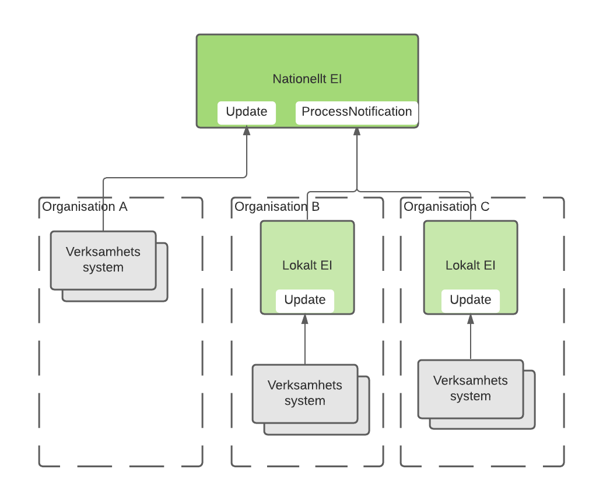
Med hjälp av uppdateringskontraktet (Update) kan verksamhetssystem skapa indexposter i enlighet med regelverk för respektive tjänstedomän. Uppdatering kan ske antingen direkt i det nationella indexet eller i en lokal instans.
För att nationellt engagemangsindex ska kunna erbjuda sina tjänstekonsumenter en konsoliderad vy av invånarens engagemang, inklusive de som registrerats i en lokal instans, kopplas de olika instanserna av index samman med hjälp av notifieringskontraktet (ProcessNotification).

| Exempel: / Verksamhetssystem i organisation A uppdaterar direkt i nationell instans med kontraktet Update. / Lokalt engagemangsindex i organisation B agerar tjänstekonsument för ProcessNotification, och uppdaterar nationellt engagemangsindex via den producenttjänst som nationellt engagemangsindex tillhandahåller. / Nationellt Engagemangsindex agerar endast producent och det lokala i organisation B agerar endast konsument mot det nationella. |
| :--- |
Om det finns situationer där det finns flera engagemangsindex lokalt så kan även dessa agera utifrån en hierarki och i ett sådant fall så ska en lokal ”toppnod” agera producent av ProcessNotification gentemot övriga lokala engagemangsindex och som konsument mot nationellt engagemangsindex.

| Om det finns flera lokala index som agerar både tjänsteproducent och tjänstekonsument av ProcessNotification gentemot varandra så behövs det mekanismer för att undvika så kallad rundgång. |
| :--- |

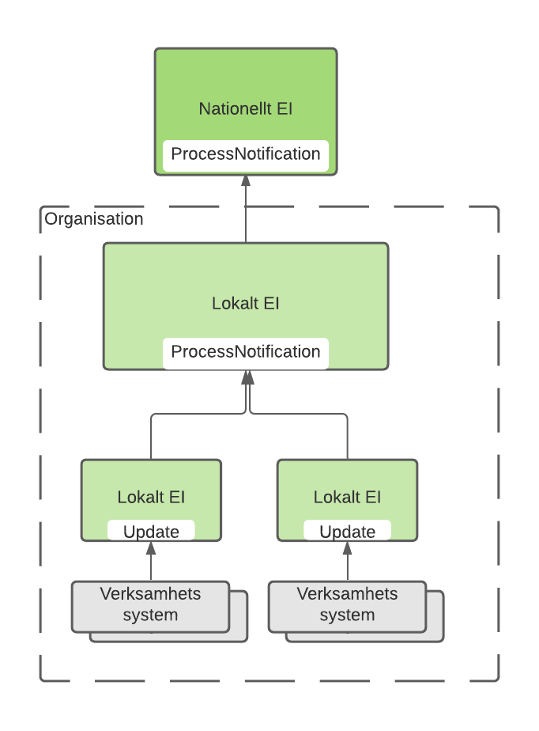
Exempel på struktur där flera lokala instanser organiseras i hierarki och den “översta” instansen ansvara för uppdatering av nationell instans

### Flöden
Följande flöden illustrerar den tänkta användningen av ett engagemangsindex.

#### Skapa, uppdatera och radera indexpost
Kontraktet Update används vid såväl skapande, uppdatering och radering av indexposter.

##### Skapa indexpost

##### Uppdatera indexpost

##### Radera indexpost
Vid makulering i källsystem som har en indexpost för den aktuella personen så behöver det övervägas om det fortfarande finns någon information (av den aktuella typen) kvar i källsystemet.
Om det inte gör det ska indexposten raderas annars behövs som princip ingen åtgärd om inte den aktuella tjänstedomänens regler ställer krav på uppdatering.
För att radera indexposten anropas Update med samma uppgifter för instansens unikhet som befintlig post och deleteFlag sätts till true.

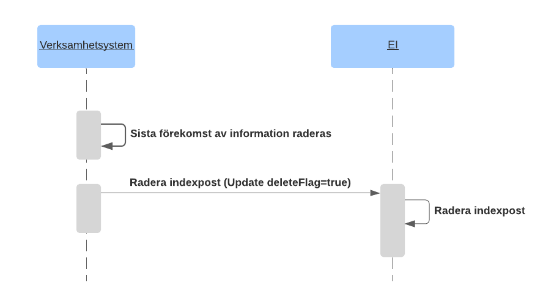

#### Poster konsolideras till nationellt engagemangsindex
När lokala index som ingår i nationell samverkan uppdateras så ska uppdateringarna konsolideras till nationell instans, detta görs med kontraktet ProcessNotification.

##### Poster skapas eller uppdateras
När ett verksamhetsystem lägger till eller uppdaterar en post i ett lokalt index så skapas indexposten lokalt och en notifiering med den skapade postens innehåll skickas till nationell instans

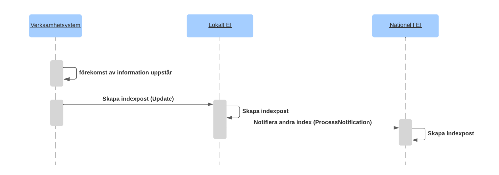

##### Poster raderas
När ett verksamhetssystem tar bort en post i ett lokalt index så skickas en notifiering med postens innehåll (med attributet deleteFlag=true till nationell instans som raderar sin kopia

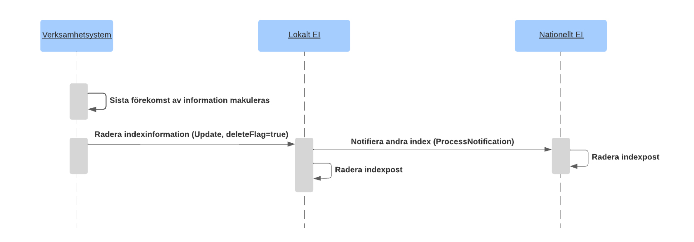

| Namn | Beskrivning |
| :--- | :--- |
| Engagemangsindex (EI) | Stödtjänst där det finns information om vilka verksamhetssystem som har information kring en viss patient. Kan finnas både som nationell och lokala instanser. |
| Verksamhetssystem | Ett system som bär information om en viss patient och som tillgängliggör informationen genom ett tjänstekontrakt och registrerar informationen i engagemangsindex. |

#### Konsolidera information via engagemangsindex
Ett index som ingår i nationell samverkan behöver stödja notifiering av indexuppdateringar för att kunna uppdatera centrala/nationella instanser. I engagemangsindexinstanser som bygger på SKLTP [R5] registreras prenumeranter genom att konfigureras som tjänsteproducenter till ProcessNotification.

##### Notifiera om uppdatering
När ett index uppdateras, notifierar det sina prenumeranter så att dessa kan skapa eller uppdatera motsvarande poster i sin instans.

##### Notifiera indexhändelse om radering
När ett index mottar en uppdatering som begär att en indexpost raderas så notifieras övriga index om detta innan posten raderas

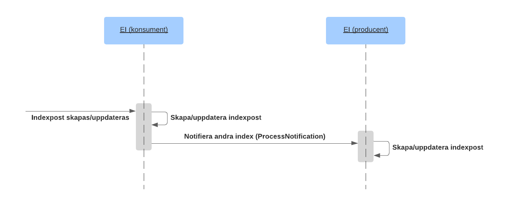
Exempel på samverkande index där det första tar emot en uppdatering som ska konsolideras till ett annat index. Det första indexet agerar då tjänstekonsument för kontraktet ProcessNotification och anropar det mottagande indexet som agerar tjänsteproducent.

#### Använda indexinformation
Exempel: Aggregering av patientbunden information från flera källsystem eller verksamheter.
Vid användningsmönster aggregering används engagemangsindex som en stödtjänst för realisering av aggregerande tjänster. Aggregerande tjänster är konsumenter av FindContent. Alla interaktioner med Engagemangsindex sker inom en tjänsteplattform. Exemplet beskriver vare sig aspekter kring adressering eller alla ingående komponenter som t ex tjänsteplattformar. För information om detta hänvisas till T-boken [Ref4]
Figuren nedan visar strukturen för exemplet.

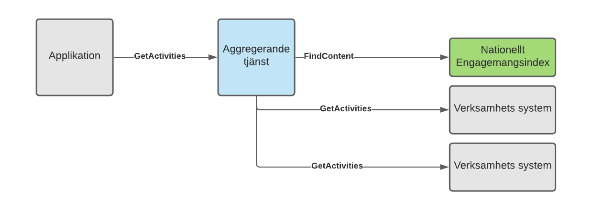

| Namn | Beskrivning |
| :--- | :--- |
| Applikation | Det system som används för att konsumera information. Dvs det system som använder tjänster enligt ett tjänstekontrakt. |
| Aggregerande tjänst | En aggregerande tjänst är en integrationstjänst som för en tjänstekonsument sammanställer en nationell vy av informationen av den typ som är aktuell för tjänsten i fråga. Är beroende av engagemangsindex för att begränsa sökningen till relevanta informationsägare. / För detaljer kring utformning av aggregerande tjänst hänvisas till RIV Tekniska Anvisningar - Tjänsteplattform [Ref7]. |
| Engagemangsindex (EI) | Stödtjänst där det finns information om vilka verksamhetssystem som har information om en viss patient. |
| Verksamhetssystem | Ett system som bär information om en viss patient och som tillgängliggör informationen genom ett tjänstekontrakt och registrerar informationen i engagemangsindex. |

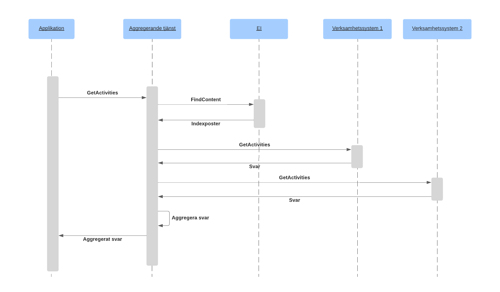
Sekvensdiagram som visar hur en aggregerad tjänst anropas av en applikation och sedan använder engagemangsindex för att lokalisera information i två verksamhetssystem och därefter hämta och aggregera informationen och returnera den till den anropande applikationen. Aggregerande tjänst anropar alla de verksamhetssystem som har eftersökt information parallellt.

## Information till utvecklare och förvaltare av Engagemangsindex

### Inledning
Olika implementationer av engagemangsindex har behov av olika kombinationer av tjänstekontrakt. I normalfallet krävs att Update och FindContent produceras.
Stöd för ProcessNotification, i rollen tjänsteproducent, beror på om instansen har behov av att uppdateras från andra index eller ej. Och på samma sätt så beror Stöd för ProcessNotification som tjänstekonsument på om instansen behöver uppdatera andra index.
När ett lokalt engagemangsindex uppdateras med information som ska ingå i nationell samverkan så ska det lokala indexet notifiera det nationella indexet. Det agerar då i rollen som tjänstekonsument av ProcessNotification. Detta i syfte att kunna erbjuda en konsoliderad vy av invånarens engagemang inom vård och omsorg.

| All konsolidering av indexinformation är enkelriktad till nationell nivå, dvs ett lokalt index kan inte hämta eller prenumerera på information från nationellt index. |
| :--- |

### Realisering av tjänstekontrakt i engagemangsindex

#### FindContent som tjänsteproducent
Engagemangsindex realiserar FindContent i rollen som tjänsteproducent i syfte att låta tjänstekonsumenter ta del av indexinformationen.

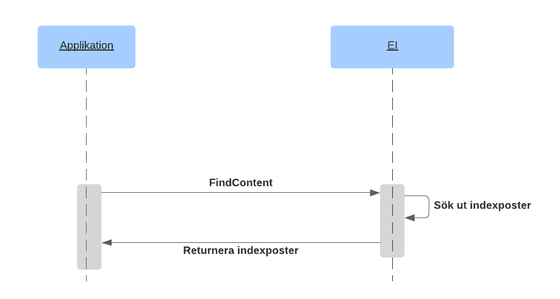

##### Version
1.0

##### Adressering
Engagemangsindex använder verksamhetsbaserad adressering.

##### Regler
pR1: Engagemangsindex validerar begäran enligt regler som specificerats per attribut enligt tjänstekontraktets beskrivning. Felaktigheter betraktas som programmeringsfel hos tjänstekonsument och signaleras därför som tekniskt fel.
pR2: Attribut som anges i begäran används för att filtrera svaret till poster som har exakt matchning.

#### Update som tjänsteproducent
Engagemangsindex realiserar Update i rollen som tjänsteproducent.
När information tillkommer i ett källsystem så ska indexpost skapas, detta görs genom att systemet anropar Update.

När den sista informationsposten av en viss typ för en individ tas bort i ett källsystem så ska indexpost för den individen och informationstypen tas bort, detta görs genom att tjänstekonsument anropar Update med deleteFlag=true.
För tjänstedomäner som kräver att informationsförändringar i källsystem ska speglas i engagemangsindex (det gäller t ex Tidbokning - crm:scheduling) så anropas Update med den förändrade informationen.

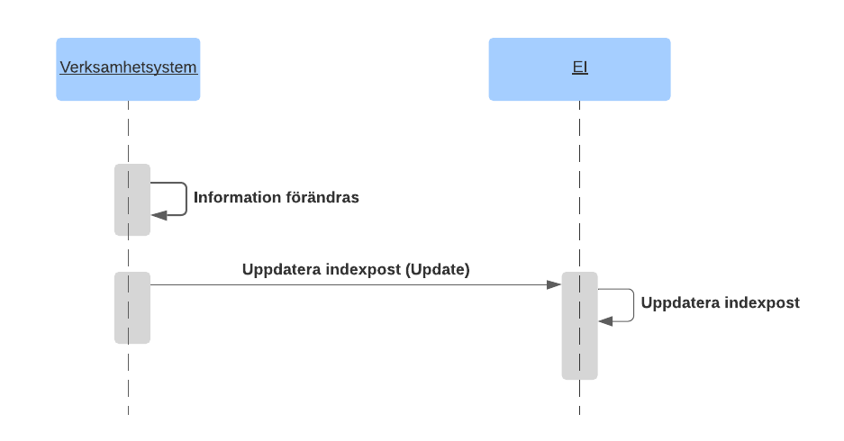

##### Version
1.0

##### Adressering
Engagemangsindex använder verksamhetsbaserad adressering.

##### Regler
pR1: Alla poster i en begäran måste vara sinsemellan unika med avseende på de element som är del av postens unikhet. Dessa utgör postens identitet.
Om duplikat hittas skall ResultCode sättas till ”ERROR” och comment till ” EngagementTransaction {index på första posten} and {index på andra posten som är densamma som första} have the same unique key. Duplicates are not allowed.”
pR2: För poster med deleteFlag = true ska borttag göras.
pR3: Efter framgångsrik uppdatering eller radering ska denna instans notifiera prenumererande instanser enligt regelverket för tjänstekontraktet ProcessNotification.
pR4: Om det redan existerar en indexpost med matchande identitet ska posten uppdateras, annars skapas.
pR5: Om alla fälten i en engagemangspost matchar en befintlig indexpost skall ingen uppdatering göras och posten ska heller inte ingå i efterföljande notifiering.
pR6: creationTime och updateTime ska uppdateras för den befintliga engagemangsposten. creationTime sätts till aktuell tid när en ny post skapas. updateTime sätts till aktuell tid när en befintlig post uppdateras.
pR7: owner sätts för den lagrade engagemangsposten. Värdet skall sättas till HSA-id för den organisation vars engagemangsindex först skapade posten, det vill säga fick uppdateringen via ett Update-anrop. Syftet är att kunna skilja poster som lagrats via ProcessNotification från poster som inkommit via Update.
Exempel: Nationell instans som tillhandahålls av Inera AB, ska stämpla alla poster som skapas via Update-tjänstekontraktet med Inera AB:s HSA-id.

#### ProcessNotification som tjänsteproducent och tjänstekonsument
Syftet med kontraktet är att kunna konsolidera indexinformation från flera index.
Engagemangsindex agerar i rollen som tjänsteproducent för att ta emot information om förändringar i ett annat engagemangsindex.
Engagemangsindex agerar som tjänstekonsument för att skicka förändringar till andra engagemangsindex.

| Notera: Användning av ProcessNotification i nationell instans avgränsas till att agera tjänsteproducent för att ta emot information från andra index. |
| :--- |
Uppdatering mellan index när information tillkommer, det vill säga skapas eller uppdateras:
Exempel på samverkande index där det första tar emot en uppdatering som resulterar i att en indexpost skapas eller uppdateras och ska konsolideras till ett annat index. Det första indexet agerar då tjänstekonsument för kontraktet ProcessNotification och anropar det mottagande indexet som agerar tjänsteproducent.
Uppdatering mellan index när information raderas:

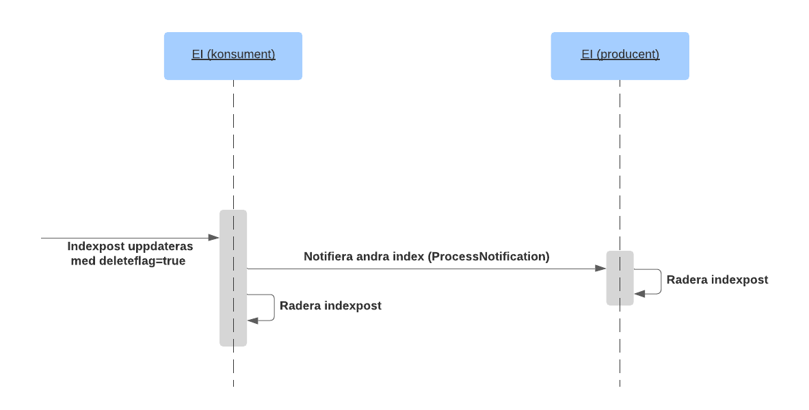
Exempel på samverkande index där det första tar emot en uppdatering med begäran om radering som ska konsolideras till ett annat index. Det första indexet agerar då tjänstekonsument för kontraktet ProcessNotification och anropar det mottagande indexet

##### Version
1.0

##### Adressering
Engagemangsindex använder verksamhetsbaserad adressering.

##### Regler när engagemangsindex agerar tjänstekonsument av ProcessNotification
kR1: Innehållet i begäran ska exakt spegla begäran i ursprunglig Update, förutom att även owner, creationTime, updateTime ska anges.
kR2: för poster som ska tas bort sätts deleteFlag = true

##### Regler när engagemangsindex agerar tjänsteproducent av ProcessNotification
pR1: Tjänsteproducent ska alltså (till skillnad från vid Update) inte generera fälten owner, creationTime och updateTime själv utan använda de värdena som finns i begäran.
pR2: För poster med deleteFlag = true ska borttag göras
pR3: Efter framgångsrik lagring enligt begäran ska producenten notifiera.
pR4: Om notifiering mottas där owner är samma som instansen så ska ingen uppdatering eller notifiering ske.

## Information till tjänstekonsumenter av Update

### Inledning
Med hjälp av uppdateringskontraktet (Update) kan källsystem (vårddokumentationssystem, tidbokningssystem m.fl) skapa indexposter enligt regelverk för respektive tjänstedomän.

### Krav och Regler

#### Omsändning när tjänsteproducent är otillgänglig
Regler och riktlinjer för omsändning vid otillgänglig tjänsteproducent finns beskrivna i RIVTA BP 2.1.2 regel #22. Dessa regler är tillämpliga för tjänstekonsumenter av Update- och ProcessNotification-tjänstekontrakten.

### Tjänstekontraktet
Definierar en tjänst som konsumenter kan använda för att uppdatera en engagemangsindexinstans.

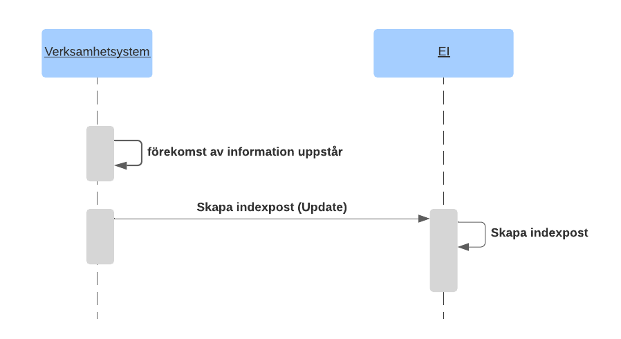

#### Version
1.0

#### Adressering
Engagemangsindex använder verksamhetsbaserad adressering.

#### Meddelandeinnehåll
Information om innehållet i begäran och svar återfinns här.

#### Regler
kR1: Alla poster i en begäran måste vara sinsemellan unika med avseende på de element som är del av postens unikhet.
Om duplikat hittas kommer tjänsteproducenten returnera ResultCode som sätts till ”ERROR” och comment till ” EngagementTransaction {index på första posten} and {index på andra posten som är densamma som första} have the same unique key. Duplicates are not allowed.”
kR2: För poster som ska raderas ska deleteFlag sättas till true.
kR3: Om tjänstekonsumenten vid anrop har mer än 1 post så bör dessa paketeras i samma anrop.
Tjänstekonsumenten ska kunna konfigureras med avseende på hur många engagemangsposter som paketeras i varje Update-anrop, maximala antalet avgörs av respektive instans av engagemangsindex.
För den nationella instansen är max antal poster satt till 1000.
kR4: Hantering av lokala reservidentiteter.
Eftersom källsystemposter som registreras på lokala reservidentiteter inte uppdateras till engagemangsindex så behöver dessa hanteras när en lokal reservidentitet kopplas till en nationellt accepterad personidentitet.
När denna koppling sker ska engagemangsindexposter skapas för den nationellt accepterade personidentiteten.

## Information till tjänstekonsumenter av FindContent

### Inledning
Tjänstekontraktet FindContent används för att söka fram och hämta indexinformation. Sökresultatet filtreras baserat på attribut i begäran.

### Tjänstekontraktet
Tjänst som en applikation använder för att begära information från ett engagemangsindex.

#### Version
1.0

#### Adressering
Engagemangsindex använder verksamhetsbaserad adressering.

#### Meddelandeinnehåll
Information om innehållet i begäran och svar återfinns här.

#### Regler
kR1: För den nationella EI-instansen är åtkomst till tjänsten FindContent begränsad till aggregerande tjänster realiserad i den nationella aggregeringsplattformen. Detta av juridiska skäl på grund av att nationell instans innehåller information från flera vårdgivare, varför det inte går att kontrollera spärr eller försegling på själva EI-posterna vilket riskerar att leda till att hälsotillstånd röjs.
kR2: Tjänstekonsumenter ska inte spara innehållet i svaret för senare användning utan ska hämta relaterade poster från källsystemen och behandla dessa i enlighet med syftet.

## Tjänstekontraktens tekniska beskrivning

### Domänspecifika attribut
Ett antal av attributen i tjänstekontrakten för engagemangsindex definieras endast tekniskt avseende namn, typ och multiplicitet. Användningen av dessa attribut i tjänstekontrakten definieras av den tjänstedomän som informationen avser. Krav och regler beskrivs i respektive tjänstedomäns tjänstekontraktsbeskrivning.
Detta innebär att ett attribut som tekniskt sett är valfritt (multiplicitet 0..1 eller 0..*) kan vara obligatoriskt i en viss tjänstedomän. Kravet kan uttryckas via skrivningar i tjänstekontraktsbeskrivning och ibland kompletterat med schematronfiler.
Notera också att vissa attribut kan vara tekniskt obligatoriska men inte användas inom domänen. I dessa fall sätts attributet till NA (för Not Applicable) för att indikera detta men ändå tekniskt uppfylla tjänstekontraktet.

| Namn | Typ | Kommentar / Nedan ges den beskrivning av attributen som är den vanligaste. Varje tjänstedomän kan dock definiera om attributens betydelse. | Kardi-nalitet |
| :--- | :--- | :--- | :--- |
| *engagement |  |  |  |
| *.serviceDomain | URN | Namnrymd för den Tjänstedomän som innehåller det tjänstekontrakt som ska användas för att läsa den information som EI-posten gäller. / exempel:
urn:riv:clinicalprocess:activity:request | 1..1 |
| *.categorization | String | Identifierar den informationskategori som EI-posten gäller, t.ex. vaccination eller journalanteckning. De informations-kategorier som är giltiga för en viss tjänstedomän anges i tjänstedomänens tjänstekontraktsbeskrivning. | 1..1 |
| *.logicalAddress | String | Den logiska adress som ska anropas för att nå den tjänsteproducent som har den information som indexposten avser. / Den logiska adressen följer den adresseringsmodell som gäller för den tjänstedomän som anges av fältet Service Domain. | 1..1 |
| *.engagementTransaction .engagement.businessObjectInstanceIdentifier | String | Definieras av respektive tjänstedomän. / ”NA” anger att attributet inte är tillämpbart i aktuell tjänstedomän. | 1..1 |
| *.clinicalProcess InterestId | String | Definieras av respektive tjänstedomän. / ”NA” anger att attributet inte är tillämpbart i aktuell tjänstedomän. | 1..1 |
| *.mostRecentContent | TS | Definieras av respektive tjänstedomän. | 0..1 |

### Update

#### Version
1.0

#### Fältregler
Nedanstående tabell beskriver varje element i begäran och svar. Har namnet en * finns ytterligare regler för detta element och beskrivs mer i detalj i stycket Regler.

##### Begäran

| Namn | Typ | Kommentar | Kardi-nalitet |
| :--- | :--- | :--- | :--- |
| engagementTransaction | EngagementTransactionType |  | 1..* |
| engagementTransaction.deleteFlag | Boolean | True anger att posten ska tas bort. False anger att posten ska skapas/uppdateras. | 1..1 |
| engagementTransaction .engagement | EngagementType |  | 1..1 |
| engagementTransaction .engagement.registeredResidentIdentification | Nationell accepterad personidentitet | Enligt formatregler i meddelandemodellen | 1..1 |
| engagementTransaction .engagement.serviceDomain | URN | Namnrymd för Tjänstedomän / exempel:
urn:riv:clinicalprocess:activity:request | 1..1 |
| engagementTransaction .engagement.categorization | String | Enligt tjänstedomänens dokumentation. | 1..1 |
| engagementTransaction .engagement.logicalAddress | String | Enligt tjänstedomänens dokumentation. | 1..1 |
| engagementTransaction .engagement.businessObjectInstanceIdentifier | String | Enligt tjänstedomänens dokumentation. | 1..1 |
| engagementTransaction .engagement.clinicalProcess InterestId | String | Enligt tjänstedomänens dokumentation. | 1..1 |
| engagementTransaction .engagement.mostRecentContent | TS | Enligt tjänstedomänens dokumentation. | 0..1 |
| engagementTransaction .engagement.sourceSystem | HSA-id | Källsystemet som innehåller den information som EI-posten pekar ut. / I regel det vårdsystem som skapade informationen eller det system hos vårdgivaren som är master för informationen. | 1..1 |
| engagementTransaction .engagement.dataController | String | Identitet för den PUA som ansvarar för postens innehåll. / I första hand organisations-nummer eller HSA-id för den PUA som ansvarar för postens innehåll, i andra hand en källsystemsintern identitet för PUA. (Tidigare har även källsystemets HSA-id tillåtits.) / Viktigt att välja ett värde som PUA kan använda för att fullgöra sin roll som personuppgifts-ansvarig för sin information i engagemangsindex. | 1..1 |

| Notera att vissa element finns representerade i schemafilerna på grund av att typen som används är gemensamt definierad. Dessa ska inte användas i denna interaktion, detta gäller: / engagementTransaction .engagement.creationTime / engagementTransaction .engagement.updateTime / engagementTransaction .engagement.owner |
| :--- |

##### Svar

| Namn | Typ | Kommentar | Kardinalitet |
| :--- | :--- | :--- | :--- |
| ResultCode | Kodverk | Status enligt generell regel. | 1..1 |
| comment | String | Meddelande enligt generell regel | 0..1 |

### FindContent

#### Begäran

| Namn | Typ | Kommentar | Kardi-nalitet |
| :--- | :--- | :--- | :--- |
| registeredResidentIdentification | Nationell accepterad personidentitet | Enligt formatregler i meddelandemodellen | 1..1 |
| serviceDomain | URN | Namnrymd för Tjänstedomän / exempel:
urn:riv:clinicalprocess:activity:request | 1..1 |
| categorization | String | Kodverk enligt tjänstedomänens dokumentation. | 0..1 |
| logicalAddress | String | Enligt tjänstedomänens dokumentation. | 0..1 |
| engagementTransaction .engagement.businessObjectInstanceIdentifier | String | Enligt tjänstedomänens dokumentation. | 0..1 |
| clinicalProcessInterestId | String | Enligt tjänstedomänens dokumentation | 0..1 |
| mostRecentContent | TS | YYYYMMDDhhmmss. | 0..1 |
| sourceSystem | HSA-id | Källsystemet som innehåller den information som EI-posten pekar ut. / I regel det vårdsystem som skapade informationen eller det system hos vårdgivaren som är master för informationen. | 0..1 |
| dataController | String | Identitet för den PUA som ansvarar för postens innehåll. / I första hand organisationsnummer eller HSA-id för den PUA som ansvarar för postens innehåll, i andra hand en källsystemsintern identitet för PUA. (Tidigare har även källsystemets HSA-id tillåtits.) / Viktigt att välja ett värde som PUA kan använda för att fullgöra sin roll som personuppgiftsansvarig för sin information i engagemangsindex. | 0..1 |
| owner | HSA-id | HSA-id för den organisations vars index tog emot uppdateringsbegäran. | 0..1 |

#### Svar

| Namn | Typ | Kommentar | Kardi-nalitet |
| :--- | :--- | :--- | :--- |
| engagement | EngagementType |  | 0..* |
| engagement.registeredResidentIdentification | Nationell accepterad personidentitet | Enligt formatregler i meddelandemodell | 1..1 |
| engagement.serviceDomain | URN | Namnrymd för Tjänstedomän / exempel:
urn:riv:clinicalprocess:activity:request | 1..1 |
| engagement.categorization | String | Enligt tjänstedomänens dokumentation. | 1..1 |
| engagement.logicalAddress | String | Enligt tjänstedomänens dokumentation. | 1..1 |
| engagementTransaction .engagement.businessObjectInstanceIdentifier | String | Enligt tjänstedomänens dokumentation. | 1..1 |
| engagement.clinicalProcessInterestId | String | Enligt tjänstedomänens dokumentation. | 0..1 |
| engagement.mostRecentContent | TS | YYYYMMDDhhmmss | 0..1 |
| engagement.sourceSystem | HSA-id | Källsystemet som innehåller den information som EI-posten pekar ut. / I regel det vårdsystem som skapade informationen eller det system hos vårdgivaren som är master för informationen. | 1..1 |
| engagement.creationTime | TS | YYYYMMDDhhmmss | 1..1 |
| engagement.updateTime | TS | YYYYMMDDhhmmss | 0..1 |
| engagement.dataController | String | Identitet för den PUA som ansvarar för postens innehåll. / I första hand organisationsnummer eller HSA-id för den PUA som ansvarar för postens innehåll, i andra hand en källsystemsintern identitet för PUA. (Tidigare har även källsystemets HSA-id tillåtits.) / Viktigt att välja ett värde som PUA kan använda för att fullgöra sin roll som personuppgiftsansvarig för sin information i engagemangsindex. | 1..1 |
| engagement.owner | HSA-id | HSA-id för den organisations vars index tog emot uppdateringsbegäran. | 1..1 |

### ProcessNotification

#### Begäran

| Namn | Typ | Kommentar | Kardin-alitet |
| :--- | :--- | :--- | :--- |
| engagementTransaction | EngagementTransactionType |  | 1..* |
| engagementTransaction.deleteFlag | Boolean | ”true” anger att posten ska tas bort. False anger att posten ska skapas/uppdateras. | 1..1 |
| engagementTransaction .engagement | EngagementType |  | 1..1 |
| engagementTransaction .engagement.registeredResidentIdentification | Nationell accepterad personidentitet | Enligt formatregler i meddelandemodell | 1..1 |
| engagementTransaction .engagement.serviceDomain | URN | Namnrymd för Tjänstedomän / exempel:
urn:riv:clinicalprocess:activity:request | 1..1 |
| engagementTransaction .engagement.categorization | String | Enligt tjänstedomänens dokumentation. | 1..1 |
| engagementTransaction .engagement.logicalAddress | String | Enligt tjänstedomänens dokumentation. | 1..1 |
| engagementTransaction .engagement.businessObjectInstanceIdentifier | String | Enligt tjänstedomänens dokumentation. | 1..1 |
| engagementTransaction .engagement.clinicalProcessInterestId | HSA-id | Enligt tjänstedomänens dokumentation. | 1..1 |
| engagementTransaction .engagement.mostRecentContent | TS | Enligt tjänstedomänens dokumentation. | 0..1 |
| engagementTransaction .engagement.sourceSystem | HSA-id | Källsystemet som innehåller den information som EI-posten pekar ut. / I regel det vårdsystem som skapade informationen eller det system hos vårdgivaren som är master för informationen. | 1..1 |
| engagementTransaction .engagement.creationTime | TS | YYYYMMDDhhmmss | 1..1 |
| engagementTransaction .engagement.updateTime | TS | YYYYMMDDhhmmss | 1..1 |
| engagementTransaction .engagement.dataController | String | Identitet för den PUA som ansvarar för postens innehåll. / I första hand organisations-nummer eller HSA-id för den PUA som ansvarar för postens innehåll, i andra hand en källsystemsintern identitet för PUA. (Tidigare har även källsystemets HSA-id tillåtits.) / Viktigt att välja ett värde som PUA kan använda för att fullgöra sin roll som personuppgifts-ansvarig för sin information i engagemangsindex. | 1..1 |
| engagementTransaction .engagement.owner | HSA-id | HSA-id för den organisations vars index tog emot ursprunglig uppdateringsbegäran. | 1..1 |

#### Svar

| Namn | Typ | Kommentar | Kardinalitet |
| :--- | :--- | :--- | :--- |
| ResultCode | Kodverk | Status enligt generell regel. | 1..1 |
| comment | String | Meddelande enligt generell regel | 0..1 |

## Tjänstedomänens meddelandemodeller
Här beskrivs de meddelandemodeller som tjänstekontrakten bygger på. För varje meddelandemodell beskrivs hur mappning ser ut delvis mot V-TIM, här version 2.2 samt mot schema (XSD) för tjänstekontrakt.

### V-MIM
Denna mappning görs av respektive tillämpande tjänstedomän.

### Informationsmodell
Följande tabell beskriver innehållet i en engagemangspost:
Varje tillämpande tjänstedomän preciserar betydelsen för de fält som är markerade med asterisk i informationsmodellen.

| Attribut | Beskrivning | Format | Mult | Kodverk/värde-mängd 
/ ev begränsningar | Beslutsregler och kommentar |
| :--- | :--- | :--- | :--- | :--- | :--- |
| Registered ResidentIdent Identification | Invånarens personidentitet | Person- eller samordningsnummer enligt Skatteverkets definition (12 tecken). / Nationellt reservnummer enligt Ineras definition (12 tecken), se R3 för mer information. | 1..1 | Validering med xml-regexp uttryckt enligt: / [0-9]{8}[0-9A-Zptf]{4} | Del av instansens unikhet |
| Service domain | Den tjänstedomän som förekomsten avser. | URN på formen <regelverk>:<huvuddomän>:<underdomän>:<ev. ytterkligare nivå>. Ex: ”riv:crm:scheduling” | 1..1 | Nationellt index kan innehålla tjänstedomäner som är nationellt fastställda. Huvudmanna-index kan även tillåta icke-nationella domäner. | Del av instansens unikhet |
| Categori-zation* | Kategori-sering enligt kodverk som är specifikt för tjänste-domänen | Text bestående av bokstäver i ASCII. Exempel för domänen crm:scheduling: ”Booking”, ”Invitation” / Exempel för domänen careprocess:request: RequestStatus (remisstatus) | 1..1 | Enligt kodverk som beskrivs i respektive tjänstedomäns tjänstekontrakts-beskrivning. | Del av instansens unikhet |
| Logical address* | Referens till informationskällan enligt tjänste-domänens definition | Logisk adress enligt adresseringsmodell för det eller de tjänstekontrakt som realiseras av de aggregerande tjänster som använder posten vid aggregering. | 1..1 | Definieras av respektive tillämpande tjänstedomän. | Del av instansens unikhet |
| Business object Instance Identifier* | Unik identifierare för händelse-bärande objekt | Format enligt aktuell identifierare. / Exempel för domänen crm:scheduling: bookingid / Exempel för domänen clinicalprocess:healthcond:description: ”NA” | 1..1 | Typen av identifierare beror av tjänstedomänen. Om tjänstedomänen inte exponerar tjänster baserat på unika händelsebärande objekt, ska värdet vara konstanten ”NA” (not applicable). | Del av instansens unikhet |
| Clinical process interest id | Hälsoärende-id | GUID | 1..1 | ”NA” anges om hälsoärende-id inte tillämpas för domänen, annars värde enl. nat. standard för hälsoärende-id. | Del av instansens unikhet |
| Most Recent Content* | Verksamhets-mässig tidpunkt för senaste informations-förekomsten i källan som indexeras av denna indexpost | DT | 0..1 | Exakt betydelse är specifik för tjänstedomänen och definieras i respektive tjänstedomäns tjänstekontraktsbeskrivning. | Multiplicitet varierar med tjänstedomän. Möjliga regler är 0..1 och 1..1 |
| Creation Time | Tidpunkten då indexinstansen registrerades | DT | 1..1 |  | Genereras automatiskt av kontraktets tjänste-producent, dvs EI |
| Update Time | Tidpunkten då indexinstansen senast uppdaterades | DT | 0..1 |  | Uppdatering innebär ny post som matchar samtliga attribut som är del av en instans unikhet. |
| Data Controller | Ett värde som kan användas för att härleda (kan kräva manuella insatser) vem som är personuppgiftsansvarig för posten. | Format för det id-begrepp som används. | 1..1 | Identitet för den PUA som ansvarar för postens innehåll. / I första hand organisations-nummer eller HSA-id för den PUA som ansvarar för postens innehåll, i andra hand en källsystemsintern identitet för PUA. (Tidigare har även källsystemets HSA-id tillåtits.) / Viktigt att välja ett värde som PUA kan använda för att fullgöra sin roll som personuppgifts-ansvarig för sin information i engagemangsindex. | Del av instansen unikhet |
| Source System | Systemet som genererade engagemangsposten | Källsystemet som innehåller den information som EI-posten pekar ut. / I regel det vårdsystem som skapade informationen eller det system som är master för informationen. | 1..1 | Syftet är att underlätta felsökning och ge spårbarhet. | Del av instansens unikhet |
| Owner | Organisation vars index tog emot ”update” från ”source system” | Organisationsnummer (HSA-id) för organisationen som äger indexinstansen. Organisationen är en myndighet eller Inera om uppdateringen togs emot direkt av nationellt index. | 1..1 | Syftet är att skapa förutsättningar för att undvika rundgång mellan notifierande parter. | Del av instansens unikhet |

### Formatregler

#### Format för Datum
Datum anges alltid på formatet ”ÅÅÅÅMMDD”, vilket motsvarar den ISO 8601 och ISO 8824-kompatibla formatbeskrivningen ”YYYYMMDD”.

#### Format för tidpunkter
Tidpunkter anges alltid på formatet ”ÅÅÅÅMMDDttmmss”, vilket motsvara den ISO 8601 och ISO 8824-kompatibla formatbeskrivningen ”YYYYMMDDhhmmss”.

#### Tidszon för tidpunkter
Tidszon anges inte i meddelandeformaten. All information om datum och tidpunkter som utbyts via tjänsterna ska ange datum och tidpunkter i den tidszon som gäller/gällde i Sverige vid den tidpunkt som respektive datum- eller tidpunktsfält bär information om. Såväl tjänstekonsumenter som tjänsteproducenter skall med andra ord förutsätta att datum och tidpunkter som utbyts är i tidszonerna CET (svensk normaltid) respektive CEST (svensk normaltid med justering för sommartid).

#### Nationell accepterad personidentitet
Person- eller samordningsnummer enligt skatteverkets definition (12 tecken).
Nationellt reservnummer enligt Ineras definition (12 tecken), se referens Ref3
Validering enligt format(xml-regexp):
[0-9]{8}[0-9A-Zptf]{4}

##### Format för personnummer (registeredResidentIdentIdentification)
Personnummer anges enligt format CCYYMMDDNNNN.

##### Format för samordningsnummer (registeredResidentIdentIdentification)
Samordningsnummer anges enligt format CCYYMMDDNNNN.
De inledande sex siffrorna utgår från personens födelsetid (år, månad och dag). Därefter följer ett tresiffrigt individnummer som motsvarar födelsenumret i ett personnummer. Individnumret hämtas slumpvis ur en serie 001-999 för alla som är födda samma dag. Numret är udda för män och jämnt för kvinnor. Siffran för födelsedag ökas med talet 60 och en kontrollsiffra beräknas på samma sätt som för ett personnummer.
Exempel
Samordningsnummer för en man som är född den 3 oktober 1970 och har individnummer 239 blir
19701003
+60
————---
197010632391

##### Format för nationell reservidentitet (registeredResidentIdentIdentification)
XXYYMMDDNNGC. Se informationsspecifikationen i domänen strategicresourcemanagement.persons.person för mer information om formatet [Ref3].

## Regelmappning mellan 1.0.6 och 1.0.7
Tidigare regler per interaktion och mappning mot nya regler per interaktion och målgrupp

### Update

| Regel enligt 1.0.6 | Regel from 1.0.7 | Kommentar |
| :--- | :--- | :--- |
| Allmänna regler / R1: Alla poster i en begäran måste vara sinsemellan unika med avseende på de element som är del av postens unikhet. / Om duplikat hittas skall ResultCode sättas till ”ERROR” och comment till ” EngagementTransaction {index på första posten} and {index på andra posten som är densamma som första} have the same unique key. Duplicates are not allowed.” | kR1 / pR1 |  |
| Borttagsregler / R2: För poster med deleteFlag = true ska borttag göras. | kR2 / pR2 |  |
| Notifieringsregler / R3: Efter framgångsrik uppdatering enligt begäran ska producenten notifiera prenumeranter enligt regelverket som beskrivs i avsnitt 4 samt de regler och SLA-krav för notifieringskonsumenter som beskrivs för tjänstekontraktet ProcessNotification. | pR3 |  |
| Uppdateringsregler / R4: Om producenten redan har en indexpost med matchande identitet ska posten uppdateras, annars skapas. | pR4 |  |
| R5: creationTime och updateTime ska uppdateras för den lagrade engagemangsposten. creationTime sätts till aktuell tid när en ny post skapas. updateTime sätts till aktuell tid när en befintlig post uppdateras. | pR6 |  |
| R6: owner uppdateras för den lagrade engagemangsposten. Värdet skall sättas till den organisation som utgör sammanhang (domänarkitektur) för tjänsteproducenten. Det betyder t.ex. att en nationell instans som tillhandahålls av Inera AB, ska stämpla alla poster som skapas via detta tjänstekontrakt med Inera AB:s HSA-id. För en landstingsspecifik instans ska landstingets organisationsnummer användas som värde. Syftet är att kunna skilja poster som lagrats via ProcessNotification från poster som inkommit via ”Update”. | pR7 |  |
| R7: logicalAddress (se avsnitt 4.7) i en begäran skall överensstämma med producentens konfigurerade owner. Om dessa inte överensstämmer ska begäran avbrytas med ResultCode ”ERROR” och comment ”Invalid routing. Logical address targets ${värde på logical address} but the responder is ${värde på producentens konfigurerade owner}” | utgår | Svårtolkat hur denna regel ska kunna implementeras. Owner sätts av EI instanser och LogicalAddress som nämns är rimligen (men inte helt säkert eftersom avsnitt 4.7 saknas i TKB…) den logiska adressen i adresseringsheadern. Så regeln skulle kunna tolkas vara en kontroll av att det är rätt EI som adresseras. / Det som brister i den logiken är ju rimligen att det är instansens förvaltningsorganisation som beslutar om vilken logisk adress som definieras i TAK OCH konfigurerar det värde som kommer skrivas in i owner (så frågan är vad värde det tillför i egentlig mening). / Regeln går också emot principen om lös koppling i T-boken. I kap 5.1.1 pekas på att kopplingen mellan logisk och fysisk adress sker i TAK. / Denna regel har också försvårat testverksamhet då den omöjliggör att routa till EI i olika tjänsteplattformar med hjälp av logisk adress. Kontrollen har tagits bort åtminstone i Ineras EI-instans för test-miljön (den som brukar benämnas SIT). / En EI-instans (eller annan producent) kan naturligtvis implementera den här typen av kontroll, men det skall inte vara ett krav eller rekommendation. |
| R8: Poster med samma unika nyckel skall inte skickas oftare än var 5:e minut även om det skett fler än en matchande händelse i källsystemet under den tidsrymden. Detta intervall bör vara konfigurerbart. Under en grundladdning får inga dubbletter (med avseende på fälten som utgör del i postens unikhet) förekomma under hela körningen (d.v.s. inte bara inom ett Update-anrop, utan sammantaget för alla Update-anrop som sker under grundladdningen). | utgår | Ingår i regler för grundladdning och är specifikt per instans |
| R9: Om alla fälten i en engagemangspost, som enligt fältreglerna inte har kardinalitet 0..0, matchar en befintlig indexpost skall ingen uppdatering göras och posten ska heller inte ingå i efterföljande notifiering. | pR5 |  |
| R10: En tjänsteproducent skall klara av att validera poster baserat på specifika regler som definieras per tjänstedomän, Dessa regler skall versionshanteras av respektive tillämpande tjänstedomän och vara uttryckta i schematron. | utgår | definieras av tjänstedomäner och kan därför inte vara en validering för en EI instans, blir svår/ohanterligt att hålla uppdaterat och det är oklart varför EI ska validera detta. |
| R11: Tjänstekonsumenten ska kunna konfigureras med avseende på hur många engagemangsposter som paketeras i varje Update-anrop, utan krav på release eller ominstallation. / De engagemangsposter som är färdiga att skickas under det intervall som är angivet I R8 skall skickas enligt max antal tillåtna poster som är angivet I SLA-krav under “Last”. / Exempel: / Finns 500 nya poster så anropas Update 1 gång med 500 poster i en och samma transaktion. / Finns 1003 nya poster så anropas Update 2 ggr, ett anrop på 1000 poster och ett på 3 poster. / Finns 2000 nya poster så anropas Update 2 ggr, vardera anrop med 1000 poster. | kR3 |  |
| R12: Transaktionsfrekvens vid grundladdning skall vara konfigurerbar och anges - i millisekunder - som paus mellan anrop till Update med max antal poster enligt SLA-krav under ”Last”, default ska vara 5000 ms. | utgår | Ingår i regler för grundladdning och är specifikt per instans |
| R13: EI ska uppdateras när ett anrop till motsvarande tjänstekontrakt ger annan data än ett tidigare anrop skulle gjort. Dock max med frekvensen enligt regel R8 ovan. / Exempel: EI ska uppdateras när approvedForPatient för en journalanteckning sätts till sant efter en viss tidpunkt och utan att journalanteckningen har förändrats. | utgår | Flyttas till domänspecifika regler och kopplas till MostRecentContent |
| R14: EI-poster med patientens huvudidentitet ska skapas/uppdateras så snart en koppling av en reservidentitet till en nationellt accepterad personidentitet dokumenterats i källsystemet. Regeln gäller när en journalanteckning på den tidigare identiteten (den som blev kopplad till en nationellt accepterad identitet) utgör den senaste journalposten av aktuell kombination av tjänstedomän och kategori. | kR4 |  |

### FindContent

| Regel enligt 1.0.6 | Regel from 1.0.7 | Kommentar |
| :--- | :--- | :--- |
| Begäran / R1: Tjänsteproducenten validerar begäran enligt regler som specificerats i per attribut ovan. Felaktigheter betraktas som programmeringsfel hos konsument och signaleras därför som tekniskt fel (Se kapitel 4.7). | pR1 |  |
| Svar / R2: Sökresultatet framställs genom att svaret begränsas av de värden som angivits i begäran. | pR2 |  |
|  | kR1 | Ny regel |
|  | kR2 | Ny regel |

### Process notification

| Regel enligt 1.0.6 | Regel from 1.0.7 | Kommentar |
| :--- | :--- | :--- |
| Allmänna regler / R1: Innehållet i begäran ska exakt spegla begäran i ursprunglig Update, förutom att även owner, creationTime, updateTime ska anges. | kR1 / pR1 (nyskriven) |  |
| Borttagsregler / R2: För poster med deleteFlag = true ska borttag göras. | kR2 / pR2 |  |
| Notifieringsregler / R3: Efter framgångsrik lagring enligt begäran ska producenten notifiera prenumeranter enligt regelverket som beskrivs i avsnitt 4 och 5. | pR3 |  |
| R4: Notifiering ska bara ske för poster vars owner är annan än EI själv. Detta syftar till att undvika ”rundgång” vid cirkulära notifieringar. | pR4 |  |
| R5: Om en notifiering motsvarar en ny EI post ska creationTime och updateTime båda innehålla tidsstämpeln för när EI posten skapades. Om notifieringen motsvarar en uppdatering av en EI post ska creationTime innehålla tidsstämpeln för när posten ursprungligen skapades samt updateTime innehålla tidsstämpeln för uppdateringen. / innehåller en post som redan finns hos producenten med producenten som owner och notifieringen anger en annan owner, ska varningsmeddelande loggas. Att index-posten byter owner kan vara korrekt om det uppdaterande källsystemet bytt tjänsteproducent för Update-tjänsten. Det kan också vara ett symptom på ett fel i någon konfiguration – t.ex. fel ”owner” i en ny engagemengsindexinstans, eller att en lokal tjänsteadresseringskatalog är felkonfigurerad. | Utgår | Regeln utgår eftersom den är i många delar svårtydbar och dessutom beskriver två olika saker som är vitt skilda (creationtime v.s owner) / Det första stycket beskriver hantering av tidstämplar och hur dessa sätts men populering av dessa attribut stipuleras av när posten skapas inte när den notifieras, vid notifiering ska de tas med som de är lagrade. / Det andra stycket är oanvändbart eftersom det kräver loggning men inte ger någon direkt ledning i hur loggarna ska tolkas i en instans… |
| R6: Notifiering ska bara ske för poster vars owner är annan än EI själv. Detta syftar till att undvika ”rundgång” vid cirkulära notifieringar. | Utgår | hanteras av pR4 |
| Lagringsregler för ett engagemangsindex / R7: creationTime och updateTime ska uppdateras för den lagrade engagemangsposten. Det betyder att när det lagras lokalt så används inte creationTime och updateTime som kommer med i notifieringsposten. | Utgår | motsäger kR1 & pR1 |
| R8: Se regler för lagring i kapitel 4.1 | Utgår | Ologiskt eftersom mottagare av processnotification är ett EI vars syfte är att lagra EI poster, för nationell konsolidering så gäller också att denna är “uppåtriktad” dvs lokala index får inte ta emot notifieringar från nationellt index / Delar av skrivningen härör troligen också från tidigare ideer kring notifiering till e-tjänster vilket nu utgår i nationell syvinkel. lokala EI kan göra sina tolkningar beroende på informationsägare, avtal m.m |
